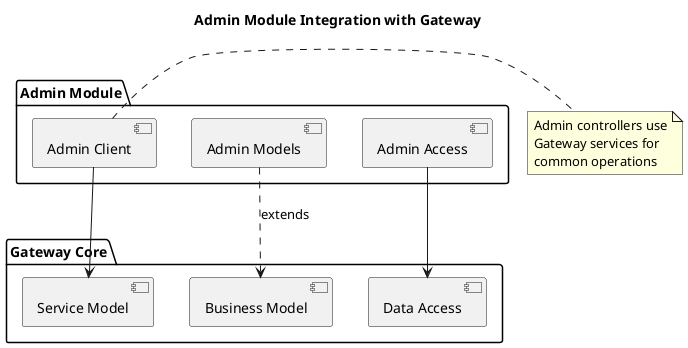

# Admin Module Layered Architecture

This document describes the layered architecture of the OoBDev Admin module.

## Architecture Overview

The Admin module follows a three-tier architecture pattern for administrative operations.

```plantuml
@startuml
title OoBDev Admin - Layered Architecture

skinparam componentStyle rectangle
skinparam packageStyle rectangle

!define LAYER_BG_COLOR #E3F2FD
!define LAYER_BORDER_COLOR #1976D2

package "Admin Client" as AdminClient #LAYER_BG_COLOR {
  component "OoBDev.Admin.Controllers" as AdminControllers
}

package "Admin Models" as AdminModels #LAYER_BG_COLOR {
  component "OoBDev.Admin.Models" as AdminModelsComp
}

package "Admin Access" as AdminAccess #LAYER_BG_COLOR {
  component "OoBDev.Admin.Access" as AdminAccessComp
}

AdminControllers --> AdminModelsComp
AdminControllers --> AdminAccessComp
AdminAccessComp --> AdminModelsComp

note right of AdminClient
  MVC Controllers for
  admin operations
  Namespace: OoBDev.Admin.Controllers
end note

note right of AdminModels
  View models and
  data transfer objects
end note

note right of AdminAccess
  Data access layer
  for admin operations
end note

@enduml
```

### ASCII Diagram

```
┌──────────────────────────────────────────────────────────────┐
│           OoBDev Admin - Three-Tier Architecture             │
└──────────────────────────────────────────────────────────────┘

┌──────────────────────────────────────────────────────────────┐
│  Tier 1: Admin Client (Presentation)                        │
│  ┌────────────────────────────────────────────────────────┐  │
│  │  OoBDev.Admin.Controllers                              │  │
│  │  - User Administration Controller                      │  │
│  │  - Role Management Controller                          │  │
│  │  - Trial Configuration Controller                      │  │
│  │  - Audit Controller                                    │  │
│  └────────────────────────────────────────────────────────┘  │
└────────────────────┬────────────────┬──────────────────────┘
                     │                │
                     │                │
                     ↓                ↓
┌──────────────────────────────┐  ┌──────────────────────────────┐
│  Tier 2: Admin Models        │  │  Tier 3: Admin Access        │
│  ┌────────────────────────┐  │  │  ┌────────────────────────┐  │
│  │  OoBDev.Admin.Models   │  │  │  │  OoBDev.Admin.Access   │  │
│  │                        │  │  │  │                        │  │
│  │  - View Models         │  │  │  │  - User Repository     │  │
│  │  - DTOs                │  │  │  │  - Role Repository     │  │
│  │  - Domain Models       │  │  │  │  - Trial Repository    │  │
│  └────────────────────────┘  │  │  │  - Audit Repository    │  │
│                              │  │  └────────────────────────┘  │
│                              │  │                              │
└──────────────────────────────┘  └───────────┬──────────────────┘
                     ↑                         │
                     └─────────────────────────┘

Dependencies:
  • Admin Client → Admin Models (for view models)
  • Admin Client → Admin Access (for data operations)
  • Admin Access → Admin Models (for entity definitions)

Architecture Pattern: Traditional 3-Tier
  - Tier 1: Presentation (Controllers)
  - Tier 2: Business Logic (Models)
  - Tier 3: Data Access (Repositories)
```

## Layer Descriptions

### 1. Admin Client Layer

**Purpose**: Presentation and controller logic for administrative functions

**Components**:
- **OoBDev.Admin.Controllers**
  - Project: `OoBDev.Admin.Controllers.csproj`
  - Required Namespace: `OoBDev.Admin.Controllers`
  - ASP.NET MVC Controllers for admin pages
  - Request handling and response generation
  - View rendering logic

**Dependencies**:
- Admin Models (for view models)
- Admin Access (for data operations)

**Responsibilities**:
- Handle HTTP requests for admin operations
- Validate user input
- Coordinate between models and data access
- Return views or JSON responses
- Enforce authorization

**Controllers** (typical):
- `UserAdministrationController` - User management operations
- `RoleManagementController` - Role assignment
- `TrialConfigurationController` - Trial settings
- `AuditController` - Audit trail viewing

### 2. Admin Models Layer

**Purpose**: Data models and view models for admin module

**Components**:
- **OoBDev.Admin.Models**
  - Project: `OoBDev.Admin.Models.csproj`
  - View models for admin pages
  - Data transfer objects (DTOs)
  - Domain entities for admin operations

**Dependencies**:
- None (foundational layer)

**Responsibilities**:
- Define structure of data displayed in admin views
- Provide validation rules
- Model binding for forms
- Data contracts for API responses

**Model Types** (typical):
- **View Models**: `UserListViewModel`, `CreateUserViewModel`, `TrialConfigViewModel`
- **DTOs**: `UserSummaryDto`, `RoleAssignmentDto`
- **Domain Models**: `AdminUser`, `Trial`, `Role`

### 3. Admin Access Layer

**Purpose**: Data access and business logic for admin operations

**Components**:
- **OoBDev.Admin.Access**
  - Project: `OoBDev.Admin.Access.csproj`
  - Repository implementations
  - Data access logic
  - Business rule enforcement

**Dependencies**:
- Admin Models (for entity definitions)

**Responsibilities**:
- Database operations (CRUD)
- Query composition
- Transaction management
- Business rule validation
- Audit logging

**Patterns Used**:
- Repository pattern for data access
- Unit of Work for transaction boundaries
- Specification pattern for complex queries (optional)

**Repositories** (typical):
- `UserRepository` - User account data access
- `RoleRepository` - Role and permission data access
- `TrialRepository` - Trial configuration data access
- `AuditRepository` - Audit trail data access

## Architecture Constraints

### Namespace Requirements

- **Admin Client**: All code must be in `OoBDev.Admin.Controllers` namespace
- Violations are tracked and validated at build time

### Dependency Rules

1. **Admin Client** can depend on:
   - Admin Models
   - Admin Access
   - Core Gateway libraries (not shown)

2. **Admin Access** can depend on:
   - Admin Models
   - Core data libraries (not shown)

3. **Admin Models** should have:
   - No dependencies on other Admin layers
   - Framework dependencies only

### Best Practices

#### Layer Communication

1. **Controllers → Access**: Controllers call repositories through interfaces
2. **Access → Models**: Repositories return domain models or DTOs
3. **No Skip**: Controllers should not bypass Access layer for direct data access

#### Error Handling

1. **Controllers**: Catch exceptions and return user-friendly messages
2. **Access**: Throw domain-specific exceptions
3. **Logging**: All errors logged at appropriate layer

#### Authorization

1. **Controllers**: Verify user has admin role
2. **Action-level**: Apply `[Authorize]` attributes
3. **Business Logic**: Additional permission checks in Access layer

## Integration with Gateway

The Admin module integrates with the core Gateway architecture:



### Shared Dependencies

The Admin module leverages Gateway core components:

1. **Authentication/Authorization**: Uses Gateway auth services
2. **Logging**: Uses Gateway logging infrastructure
3. **Email**: Uses Gateway email services for notifications
4. **Audit Trail**: May use Gateway audit services

### Data Sharing

- Admin operations modify core Gateway data (users, roles)
- Admin Access layer uses same database context as Gateway
- Shared models from Gateway Business Model layer

## Project Structure

```
OoBDev.Admin/
├── OoBDev.Admin.Controllers/
│   ├── UserAdministrationController.cs
│   ├── RoleManagementController.cs
│   ├── TrialConfigurationController.cs
│   └── ...
├── OoBDev.Admin.Models/
│   ├── ViewModels/
│   │   ├── UserListViewModel.cs
│   │   ├── CreateUserViewModel.cs
│   │   └── ...
│   ├── DTOs/
│   │   └── ...
│   └── Domain/
│       └── ...
└── OoBDev.Admin.Access/
    ├── Repositories/
    │   ├── UserRepository.cs
    │   ├── RoleRepository.cs
    │   └── ...
    ├── Services/
    │   └── ...
    └── Interfaces/
        └── ...
```

## Validation

The Admin module includes architecture validation:

- Layer dependencies enforced at build time
- Namespace compliance validated
- No circular references allowed

### Running Validation

Architecture validation runs automatically during build when the `OoBDev.Admin.Architecture.modelproj` project is included in the solution.

## Related Documentation

- [Admin Use Cases](./use-cases.md) - Administrative functionality
- [Gateway Layering](../gateway/layering.md) - Core Gateway architecture
- [Admin README](./README.md) - Admin module overview
