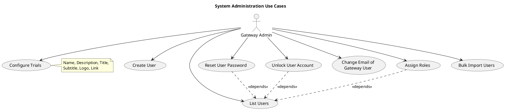
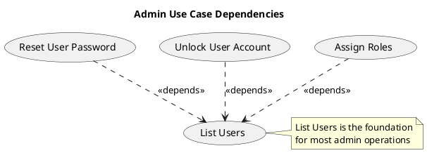

# Admin Use Cases

This document describes the administrative use cases for the OoBDev system.

## Admin Use Case Diagram

## Actor: Gateway Admin

The Gateway Admin has full administrative privileges for managing the OoBDev system.

**Responsibilities**:
- User account management
- Role and permission assignment
- Trial configuration
- System maintenance tasks

## Use Case Descriptions

### User Management

#### Create User (UC_CreateUser)

**Actor**: Gateway Admin

**Description**: Create new user accounts in the system.

**Work Item**: #495

**Preconditions**:
- Admin must be authenticated
- Admin must have user creation permissions

**Main Flow**:
1. Admin navigates to user creation page
2. System displays user creation form
3. Admin enters user information:
   - Username/email
   - First name and last name
   - Initial password
   - Contact information
4. Admin submits form
5. System validates user data
6. System creates user account
7. System sends welcome email to new user
8. System displays success confirmation

**Postconditions**:
- New user account created
- User can log in with provided credentials
- Welcome email sent
- Audit trail recorded

**Business Rules**:
- Username/email must be unique
- Password must meet complexity requirements
- User email must be valid format

**Alternative Flows**:
- Duplicate username: System displays error and prompts for different username
- Invalid email: System displays validation error
- Email delivery failure: User created but notification logged for manual follow-up

---

#### List Users (UC_ListUsers)

**Actor**: Gateway Admin

**Description**: View and search all user accounts in the system.

**Preconditions**:
- Admin must be authenticated
- Admin must have user view permissions

**Main Flow**:
1. Admin navigates to user list page
2. System displays paginated list of users
3. System shows user information:
   - Username/email
   - Name
   - Roles
   - Account status (active/locked)
   - Last login
4. Admin can filter/search users
5. Admin can sort by columns

**Postconditions**:
- User list displayed

**Features**:
- Pagination for large user sets
- Search by username, name, email
- Filter by role or status
- Sort by various columns
- Export to CSV (optional)

---

#### Reset User Password (UC_ResetPassword)

**Actor**: Gateway Admin

**Description**: Reset a user's password when they cannot access their account through self-service.

**Work Item**: #499

**Preconditions**:
- Admin must be authenticated
- Admin must have password reset permissions
- Target user account must exist

**Main Flow**:
1. Admin lists users (UC_ListUsers)
2. Admin selects target user
3. Admin clicks "Reset Password"
4. System prompts for confirmation
5. Admin confirms password reset
6. System generates temporary password
7. System updates user account
8. System sends password reset email to user
9. System displays success message with temporary password
10. System logs password reset in audit trail

**Postconditions**:
- User password reset to temporary password
- User receives email with new password
- User must change password on next login
- Audit trail updated

**Business Rules**:
- Temporary password must meet complexity requirements
- User must change temporary password on first login
- Password reset email must be sent within 5 minutes
- Admin cannot set specific password (security)

**Dependencies**:
- Depends on List Users for user selection

**Alternative Flows**:
- Email delivery failure: Admin shown temporary password to communicate manually
- User account locked: Admin must unlock account first

---

#### Unlock User Account (UC_UnlockAccount)

**Actor**: Gateway Admin

**Description**: Unlock user account that has been locked due to failed login attempts.

**Work Item**: #498

**Preconditions**:
- Admin must be authenticated
- Admin must have account unlock permissions
- User account must be locked

**Main Flow**:
1. Admin lists users (UC_ListUsers)
2. Admin identifies locked account
3. Admin selects user
4. Admin clicks "Unlock Account"
5. System prompts for confirmation
6. Admin confirms unlock
7. System unlocks user account
8. System resets failed login counter
9. System sends notification email to user
10. System displays success message
11. System logs unlock in audit trail

**Postconditions**:
- User account unlocked
- Failed login counter reset to 0
- User can attempt login
- Audit trail updated

**Business Rules**:
- Admin should verify user identity before unlocking
- Unlock notification sent to user email
- Previous failed login attempts logged for security review

**Dependencies**:
- Depends on List Users for user selection

**Alternative Flows**:
- Account not locked: System displays message that account is already active
- Account disabled: Admin must enable account (different operation)

---

#### Change Email of Gateway User (UC_ChangeEmail)

**Actor**: Gateway Admin

**Description**: Change the email address of a user account.

**Preconditions**:
- Admin must be authenticated
- Admin must have user modification permissions
- User account must exist

**Main Flow**:
1. Admin lists users (UC_ListUsers)
2. Admin selects target user
3. Admin clicks "Change Email"
4. System displays current email
5. Admin enters new email address
6. System validates email format and uniqueness
7. Admin submits change
8. System updates email address
9. System sends confirmation to both old and new email
10. System displays success message
11. System logs email change in audit trail

**Postconditions**:
- User email address updated
- Notifications sent to both old and new email
- Audit trail updated

**Business Rules**:
- New email must be unique (not used by another user)
- New email must be valid format
- Confirmations sent to both old and new email addresses
- Username may also be updated if it was based on email

**Alternative Flows**:
- Email already in use: System displays error
- Invalid email format: System displays validation error
- Email delivery failure: Change saved but notifications logged for review

---

#### Assign Roles (UC_AssignRoles)

**Actor**: Gateway Admin

**Description**: Assign or modify user roles and permissions.

**Work Item**: #497

**Preconditions**:
- Admin must be authenticated
- Admin must have role assignment permissions
- User account must exist
- Roles must be defined in system

**Main Flow**:
1. Admin lists users (UC_ListUsers)
2. Admin selects target user
3. Admin clicks "Manage Roles"
4. System displays current roles
5. System displays available roles
6. Admin selects/deselects roles
7. Admin submits changes
8. System validates role assignments
9. System updates user roles
10. System displays success message
11. System logs role changes in audit trail

**Postconditions**:
- User roles updated
- User permissions reflect new roles immediately
- Audit trail updated

**Business Rules**:
- User must have at least one role
- Some role combinations may be restricted
- Role changes take effect immediately
- Previous roles logged for audit purposes

**Available Roles** (examples):
- Gateway User
- Trial/Site Manager
- Coordinator (RA1)
- Manager (RA2)
- Gateway Admin
- System Admin

**Dependencies**:
- Depends on List Users for user selection

**Alternative Flows**:
- Invalid role combination: System displays error and explains restriction
- User has active sessions: System may require re-login for changes to take effect

---

#### Bulk Import Users (UC_BulkImport)

**Actor**: Gateway Admin

**Description**: Import multiple user accounts from a file (CSV/Excel).

**Preconditions**:
- Admin must be authenticated
- Admin must have bulk import permissions
- Import file must follow required format

**Main Flow**:
1. Admin navigates to bulk import page
2. System displays import instructions and template
3. Admin downloads template (optional)
4. Admin prepares import file
5. Admin selects file for upload
6. System validates file format
7. System displays preview of users to import
8. Admin reviews import preview
9. Admin confirms import
10. System processes imports (may be async for large files)
11. System creates user accounts
12. System sends welcome emails (optional setting)
13. System displays import results (success/failures)
14. System logs bulk import in audit trail

**Postconditions**:
- Valid users created
- Invalid entries reported with errors
- Import summary available
- Welcome emails sent (if configured)
- Audit trail updated

**File Format**:
- Supported formats: CSV, Excel (.xlsx)
- Required columns:
  - Email/Username
  - First Name
  - Last Name
  - Role(s)
- Optional columns:
  - Phone
  - Trial assignment
  - Site assignment

**Business Rules**:
- Maximum import size: 1000 users per file
- Duplicate emails skipped with warning
- Invalid rows reported but don't block valid rows
- Partial imports allowed (valid users created, invalid users reported)

**Alternative Flows**:
- Invalid file format: System rejects file and displays format requirements
- All users invalid: Import cancelled with error report
- Large import: System processes asynchronously and emails admin when complete

---

### Trial Configuration

#### Configure Trials (UC_ConfigureTrials)

**Actor**: Gateway Admin

**Description**: Configure trial settings and properties.

**Preconditions**:
- Admin must be authenticated
- Admin must have trial configuration permissions

**Main Flow**:
1. Admin navigates to trial configuration
2. System displays list of trials
3. Admin selects trial to configure
4. System displays trial configuration form
5. Admin modifies trial settings:
   - Trial name
   - Description
   - Title and subtitle
   - Logo image
   - Link/URL
   - Additional metadata
6. Admin submits changes
7. System validates configuration
8. System updates trial settings
9. System displays success message
10. System logs configuration changes

**Postconditions**:
- Trial configuration updated
- Changes visible to trial users
- Audit trail updated

**Configurable Fields**:
- **Name**: Internal trial name/code
- **Description**: Detailed trial description
- **Title**: Display title for users
- **Subtitle**: Additional descriptive text
- **Logo**: Trial branding image
- **Link**: External trial website or resources

**Business Rules**:
- Trial name must be unique
- Logo must be valid image format (PNG, JPG)
- Maximum logo size: 2MB
- URLs must be valid format

**Alternative Flows**:
- Invalid logo file: System rejects and displays error
- Duplicate trial name: System displays error
- Invalid URL: System displays validation error

---

## Dependencies Between Use Cases

## Work Item References

The use cases reference Team Foundation Server work items:

- #495 - Create User
- #497 - Assign Roles
- #498 - Unlock User Account
- #499 - Reset User Password

TFS Server: tfscorp.itrica.com\ITRICA
Collection ID: 04150b45-2081-4a9f-89f8-b188e6a7a0a4

## Security Considerations

### Audit Trail

All administrative actions must be logged including:
- Action performed
- Target user (if applicable)
- Admin performing action
- Timestamp
- Before/after values (for modifications)
- IP address of admin

### Separation of Duties

- Password resets should be logged and reviewed
- Bulk imports should require second approval (optional)
- Role changes for admin accounts require special approval

### Notifications

Users should be notified when:
- Password is reset by admin
- Account is unlocked
- Email address is changed
- Roles are modified

## Related Documentation

- [Gateway Use Cases](../gateway/use-cases.md) - Gateway user capabilities
- [Admin Layering](./layering.md) - Admin module architecture
