# CEC Use Cases

This document describes the primary use cases for the OoBDev Clinical Event Committee (CEC) module.

## CEC Overview Diagram

The complete CEC use case diagram shows all actors and their interactions with the system.

```plantuml
@startuml CEC Overview
title OoBDev CEC - Clinical Event Committee Use Cases

' Actors
actor "Site User" as SiteUser
actor "Coordinator" as Coordinator
actor "Medical Reviewer" as MedicalReviewer
actor "Adjudicator" as Adjudicator
actor "Meeting Manager" as MeetingManager
actor "Sponsor" as Sponsor
actor "Primary Researcher" as PrimaryResearcher
actor "Notification Service" as NotificationService <<system>>

' Core Use Cases
usecase "Report Events" as UC_ReportEvents
usecase "Upload Source Documents" as UC_UploadDocs
usecase "View Source Documents" as UC_ViewDocs
usecase "Classify Source Document" as UC_ClassifyDoc

' Coordinator Use Cases
usecase "Approve Meeting for\nMedical Review" as UC_ApproveMeeting
usecase "Review Information Requests" as UC_ReviewInfoRequests
usecase "Request Information from Site" as UC_RequestInfo
usecase "Public Annotations" as UC_PublicAnnotations
usecase "Bulk Import Events" as UC_BulkImport
usecase "Checklist Management" as UC_ChecklistMgmt

' Medical Reviewer Use Cases
usecase "Review Event" as UC_ReviewEvent
usecase "Approve Event for Meeting" as UC_ApproveEvent

' Meeting Manager Use Cases
usecase "Collect Approved Events" as UC_CollectEvents
usecase "Schedule Meeting" as UC_ScheduleMeeting
usecase "Assign Members to Meeting" as UC_AssignMembers
usecase "Notify Meeting Members" as UC_NotifyMembers

' Adjudicator Use Cases
usecase "Adjudicate Event" as UC_AdjudicateEvent
usecase "Adjudication Meeting Process" as UC_MeetingProcess

' Site User Use Cases
usecase "Reply with Information" as UC_ReplyInfo
usecase "Email Unassigned Documents" as UC_EmailDocs

' Reporting Use Cases
usecase "List Adjudicated Events" as UC_ListAdjudicated
usecase "List HIPAA Violations" as UC_ListHIPAA
usecase "List Adjudicators Per Meeting" as UC_ListAdjudicators
usecase "List Event Classification Summary" as UC_ListClassification
usecase "List Events Reported as\n\"Not an Event\"" as UC_ListNotEvents
usecase "List Event Status by Region" as UC_ListByRegion
usecase "List Event Status by Week" as UC_ListByWeek
usecase "List Events without\nSource Documents" as UC_ListNoDocuments

' Document Management Features
usecase "Report HIPAA Violation" as UC_ReportHIPAA
usecase "Request Information (Query)" as UC_InfoQuery
usecase "Private Annotations" as UC_PrivateAnnotations
usecase "Document Page Manipulation" as UC_DocPageManip

' Notification
usecase "Send Meeting Notification" as UC_SendNotification

' Site User Associations
SiteUser --> UC_ReportEvents
SiteUser --> UC_UploadDocs
SiteUser --> UC_ReplyInfo
SiteUser --> UC_EmailDocs

' Coordinator Associations
Coordinator --> UC_ReportEvents
Coordinator --> UC_UploadDocs
Coordinator --> UC_ApproveMeeting
Coordinator --> UC_ViewDocs
Coordinator --> UC_ReviewInfoRequests
Coordinator --> UC_RequestInfo
Coordinator --> UC_PublicAnnotations
Coordinator --> UC_BulkImport
Coordinator --> UC_ChecklistMgmt

' Medical Reviewer Associations
MedicalReviewer --> UC_ApproveEvent
MedicalReviewer --> UC_ReviewEvent
MedicalReviewer --> UC_ViewDocs
MedicalReviewer --> UC_ClassifyDoc
MedicalReviewer --> UC_ChecklistMgmt

' Adjudicator Associations
Adjudicator --> UC_ReportEvents
Adjudicator --> UC_ViewDocs
Adjudicator --> UC_AdjudicateEvent
Adjudicator --> UC_ClassifyDoc
Adjudicator --> UC_MeetingProcess

' Meeting Manager Associations
MeetingManager --> UC_CollectEvents
MeetingManager --> UC_ScheduleMeeting
MeetingManager --> UC_AssignMembers
MeetingManager --> UC_NotifyMembers

' Sponsor Associations
Sponsor --> UC_ListAdjudicated
Sponsor --> UC_ListHIPAA

' Primary Researcher Associations
PrimaryResearcher --> UC_ListAdjudicated
PrimaryResearcher --> UC_ListAdjudicators
PrimaryResearcher --> UC_ListHIPAA
PrimaryResearcher --> UC_ListClassification
PrimaryResearcher --> UC_ListNotEvents
PrimaryResearcher --> UC_ListByRegion
PrimaryResearcher --> UC_ListByWeek
PrimaryResearcher --> UC_ListNoDocuments

' Notification Service Associations
NotificationService --> UC_SendNotification

' Dependencies and Includes
UC_UploadDocs ..> UC_ReportEvents : <<depends>>
UC_UploadDocs ..> UC_ClassifyDoc : <<include>>
UC_ViewDocs ..> UC_UploadDocs : <<depends>>
UC_ViewDocs ..> UC_ReportHIPAA : <<include>>
UC_ViewDocs ..> UC_InfoQuery : <<include>>
UC_ViewDocs ..> UC_PrivateAnnotations : <<include>>
UC_ViewDocs ..> UC_DocPageManip : <<include>>

UC_ReviewEvent ..> UC_ReportEvents : <<depends>>
UC_ReviewEvent ..> UC_ApproveMeeting : <<depends>>
UC_CollectEvents ..> UC_ApproveEvent : <<depends>>
UC_AssignMembers ..> UC_ScheduleMeeting : <<depends>>
UC_NotifyMembers ..> UC_AssignMembers : <<depends>>
UC_ListAdjudicated ..> UC_AdjudicateEvent : <<depends>>

@enduml
```

## Core Event Management

### Report Events (UC_ReportEvents)
- **Actors**: Site User, Coordinator, Adjudicator
- **Description**: Report a clinical event for review and adjudication
- **Workflow**:
  1. User identifies a clinical event requiring review
  2. Event details are entered into the system
  3. Event is created with initial status
  4. Event enters the review workflow

### Upload Source Documents (UC_UploadDocs)
- **Actors**: Site User, Coordinator
- **Description**: Upload supporting documentation for clinical events
- **Dependencies**: Requires reported event
- **Includes**: Classify Source Document
- **Workflow**:
  1. User selects event requiring documentation
  2. Source documents are uploaded (PDFs, images, medical records)
  3. Documents are automatically classified by type
  4. Documents are linked to the event
  5. HIPAA compliance checks are performed

### Classify Source Document (UC_ClassifyDoc)
- **Actors**: Medical Reviewer, Adjudicator
- **Included by**: Upload Source Documents
- **Description**: Categorize source documents by type and relevance
- **Document Types**:
  - Medical records
  - Lab results
  - Imaging reports
  - Physician notes
  - Other supporting documentation

### View Source Documents (UC_ViewDocs)
- **Actors**: Coordinator, Medical Reviewer, Adjudicator
- **Description**: Access and review source documents with annotation capabilities
- **Dependencies**: Upload Source Documents
- **Includes**:
  - Report HIPAA Violation
  - Request Information (Query)
  - Private Annotations
  - Document Page Manipulation
- **Features**:
  - Document viewer with zoom and navigation
  - Public and private annotations
  - HIPAA violation flagging
  - Information request creation
  - Page reordering and manipulation

## Coordinator Workflow

### Approve Meeting for Medical Review (UC_ApproveMeeting)
- **Actor**: Coordinator
- **Description**: Advance events from coordinator review to medical review stage
- **Pre-conditions**: Event has complete documentation
- **Post-conditions**: Event available for medical reviewer assignment

### Review Information Requests (UC_ReviewInfoRequests)
- **Actor**: Coordinator
- **Description**: Review and process information requests from sites
- **Workflow**:
  1. Coordinator views pending information requests
  2. Requests are evaluated for completeness
  3. Follow-up actions are determined
  4. Requests are marked as complete or require additional information

### Request Information from Site (UC_RequestInfo)
- **Actor**: Coordinator
- **Description**: Send information queries to site users
- **Workflow**:
  1. Coordinator identifies missing or unclear information
  2. Query is created with specific questions
  3. Site user is notified
  4. Response tracking is initiated

### Public Annotations (UC_PublicAnnotations)
- **Actor**: Coordinator
- **Description**: Add annotations visible to all reviewers
- **Use Cases**:
  - Highlight key findings in documents
  - Flag important sections for adjudicators
  - Add explanatory notes for context

### Bulk Import Events (UC_BulkImport)
- **Actor**: Coordinator
- **Description**: Import multiple events from external data sources
- **Supported Formats**:
  - CSV files
  - Excel spreadsheets
  - EDC system exports
- **Validation**:
  - Data format validation
  - Required field checking
  - Duplicate event detection

### Checklist Management (UC_ChecklistMgmt)
- **Actors**: Coordinator, Medical Reviewer
- **Description**: Create and manage standardized review checklists
- **Features**:
  - Template-based checklists
  - Required vs. optional items
  - Completion tracking
  - Audit trail

## Medical Review Workflow

### Review Event (UC_ReviewEvent)
- **Actor**: Medical Reviewer
- **Description**: Conduct medical review of reported events
- **Dependencies**:
  - Report Events
  - Approve Meeting for Medical Review
- **Workflow**:
  1. Medical reviewer is assigned event
  2. Event details and source documents are reviewed
  3. Medical assessment is documented
  4. Checklist items are completed
  5. Decision to approve or request more information is made

### Approve Event for Meeting (UC_ApproveEvent)
- **Actor**: Medical Reviewer
- **Description**: Approve events as ready for adjudication committee meeting
- **Pre-conditions**: Medical review complete
- **Post-conditions**: Event available for meeting collection

## Meeting Management

### Collect Approved Events (UC_CollectEvents)
- **Actor**: Meeting Manager
- **Description**: Gather all approved events for upcoming meeting
- **Dependencies**: Approve Event for Meeting
- **Workflow**:
  1. Meeting manager initiates collection
  2. System identifies all approved events
  3. Events are grouped by meeting agenda
  4. Packet materials are prepared

### Schedule Meeting (UC_ScheduleMeeting)
- **Actor**: Meeting Manager
- **Description**: Set meeting date, time, and location
- **Details Captured**:
  - Meeting date and time
  - Physical or virtual location
  - Dial-in information for remote participants
  - Estimated duration
  - Agenda items

### Assign Members to Meeting (UC_AssignMembers)
- **Actor**: Meeting Manager
- **Description**: Assign adjudicators to specific meetings
- **Dependencies**: Schedule Meeting
- **Workflow**:
  1. Meeting is created
  2. Available adjudicators are identified
  3. Adjudicators are assigned based on:
     - Availability
     - Expertise
     - Conflict of interest checks
  4. Quorum requirements are validated

### Notify Meeting Members (UC_NotifyMembers)
- **Actor**: Meeting Manager
- **Description**: Send meeting notifications to assigned members
- **Dependencies**: Assign Members to Meeting, Notification Services
- **Notification Content**:
  - Meeting date, time, location
  - Agenda and event list
  - Pre-meeting materials
  - Access instructions

### Send Meeting Notification (UC_SendNotification)
- **Actor**: Notification Service (System)
- **Description**: Automated notification delivery system
- **Channels**:
  - Email notifications
  - Calendar invitations
  - SMS reminders (optional)

## Adjudication Process

### Adjudicate Event (UC_AdjudicateEvent)
- **Actor**: Adjudicator
- **Description**: Formal adjudication of clinical events during committee meetings
- **Workflow**:
  1. Event is presented to committee
  2. Source documents and medical review are discussed
  3. Adjudicators provide independent assessment
  4. Consensus is reached
  5. Final classification is recorded
- **Outcomes**:
  - Confirmed event with classification
  - Not an event
  - Requires additional information
  - Deferred for future meeting

### Adjudication Meeting Process (UC_MeetingProcess)
- **Actor**: Adjudicator
- **Description**: Overall meeting workflow and decision process
- **Process**:
  1. Meeting is called to order
  2. Quorum is confirmed
  3. Each event is reviewed sequentially
  4. Discussion and voting occurs
  5. Decisions are documented
  6. Meeting minutes are recorded

## Site User Workflow

### Reply with Information (UC_ReplyInfo)
- **Actor**: Site User
- **Description**: Respond to information requests from coordinators
- **Workflow**:
  1. Site user receives information request notification
  2. User reviews questions and gathers information
  3. Response is entered in system
  4. Additional documents are uploaded if needed
  5. Response is submitted to coordinator

### Email Unassigned Documents (UC_EmailDocs)
- **Actor**: Site User
- **Description**: Email documents that haven't been linked to specific events
- **Use Case**: Documents arrive before event is formally reported
- **Workflow**:
  1. Site user emails documents to designated CEC email address
  2. System receives and stores documents
  3. Documents appear in unassigned queue
  4. Coordinator later assigns to appropriate event

## Reporting & Analytics

### List Adjudicated Events (UC_ListAdjudicated)
- **Actors**: Sponsor, Primary Researcher
- **Description**: View all events that have completed adjudication
- **Dependencies**: Adjudicate Event
- **Filters**:
  - Date range
  - Event classification
  - Site or region
  - Adjudication outcome

### List HIPAA Violations (UC_ListHIPAA)
- **Actors**: Sponsor, Primary Researcher
- **Description**: Track and report HIPAA compliance violations
- **Information Captured**:
  - Violation type
  - Date identified
  - Source document
  - Remediation status
- **Compliance**: Required for regulatory oversight

### List Adjudicators Per Meeting (UC_ListAdjudicators)
- **Actor**: Primary Researcher
- **Description**: View adjudicator participation across meetings
- **Metrics**:
  - Attendance rate
  - Number of events reviewed
  - Areas of expertise
  - Participation trends

### List Event Classification Summary (UC_ListClassification)
- **Actor**: Primary Researcher
- **Description**: Aggregate statistics on event classifications
- **Summary Views**:
  - Events by classification type
  - Classification trends over time
  - Regional variations
  - Site-specific patterns

### List Events Reported as "Not an Event" (UC_ListNotEvents)
- **Actor**: Primary Researcher
- **Description**: Track events that were adjudicated as not meeting event criteria
- **Purpose**:
  - Training opportunities for sites
  - Protocol clarification needs
  - Pattern identification

### List Event Status by Region (UC_ListByRegion)
- **Actor**: Primary Researcher
- **Description**: Geographic analysis of event reporting and status
- **Dimensions**:
  - Events per region
  - Adjudication status by region
  - Regional compliance metrics

### List Event Status by Week (UC_ListByWeek)
- **Actor**: Primary Researcher
- **Description**: Temporal analysis of event workflow
- **Metrics**:
  - Weekly event reporting volume
  - Processing time by stage
  - Workflow bottlenecks
  - Trend analysis

### List Events without Source Documents (UC_ListNoDocuments)
- **Actor**: Primary Researcher
- **Description**: Quality control report for incomplete events
- **Purpose**:
  - Identify events needing follow-up
  - Site training needs
  - Process improvement

## Document Management Features

### Report HIPAA Violation (UC_ReportHIPAA)
- **Included by**: View Source Documents
- **Description**: Flag documents containing improperly redacted patient information
- **Triggers Immediate Action**:
  - Document is quarantined
  - Site is notified
  - Violation is logged
  - Remediation process begins

### Request Information (Query) (UC_InfoQuery)
- **Included by**: View Source Documents
- **Description**: Create information requests directly from document review
- **Context-Aware**:
  - Links query to specific document and page
  - Pre-fills event and document context
  - Notifies appropriate site personnel

### Private Annotations (UC_PrivateAnnotations)
- **Included by**: View Source Documents
- **Description**: Personal notes visible only to the annotating user
- **Use Cases**:
  - Medical reviewer personal notes
  - Adjudicator pre-meeting thoughts
  - Draft comments before making public

### Document Page Manipulation (UC_DocPageManip)
- **Included by**: View Source Documents
- **Description**: Reorder, rotate, or extract document pages
- **Features**:
  - Page reordering for logical flow
  - Rotation for scanned documents
  - Page extraction for sub-document creation
  - Merge multiple documents

## Related Documentation

- [CEC Architecture Overview](./README.md) - Module overview and integration
- [Gateway Use Cases](../gateway/use-cases.md) - User management and authentication
