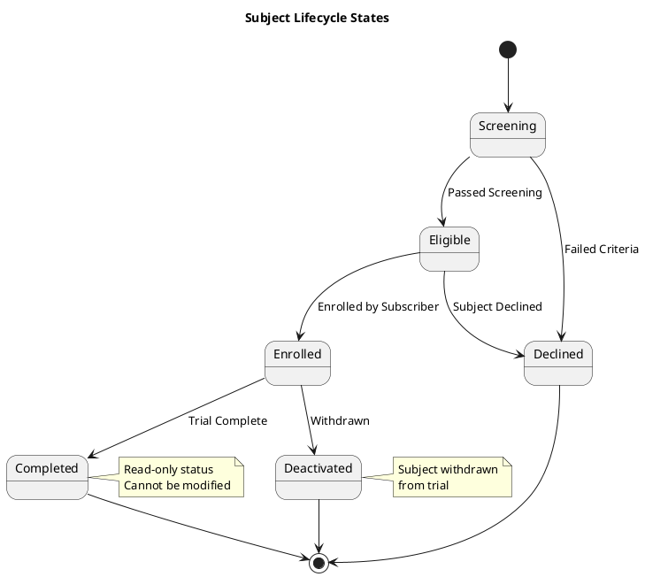

# CTS Use Cases

This document describes the primary use cases for the OoBDev Clinical Trial System (CTS) - Subject Screening module.

## Subject Screening Use Cases

The CTS module centers around subject screening, enrollment, and management throughout the clinical trial lifecycle.

```plantuml
@startuml Subject Screening Use Cases
title OoBDev CTS - Subject Screening and Enrollment

' Actors
actor "User" as User
actor "Subscriber" as Subscriber
actor "Primary Subscriber" as PrimarySubscriber
actor "Sponsor" as Sponsor

' Core Use Cases
usecase "R14: Is a Gateway User" as UC_GatewayUser
usecase "Is Related to a Site" as UC_RelatedSite
usecase "R1: May Screen Subjects for\nRelated Site" as UC_ScreenSubjects
usecase "R2: May Resume a Screening for\na Site Subject" as UC_ResumeScreening
usecase "R3: May Search for a Subject\nwithin Related Site" as UC_SearchSubject
usecase "R4: Completed Subjects\nare Read Only" as UC_CompletedReadOnly
usecase "R5: May Deactivate Subjects for\nRelated Site" as UC_DeactivateSubject
usecase "R6: May Enroll Subjects for\nRelated Site" as UC_EnrollSubject
usecase "R6: May Decline Subjects for\nRelated Site" as UC_DeclineSubject

' Questionnaire Configuration
usecase "R7: Questionnaire and Validation\nRules are Configurable" as UC_ConfigurableQuestionnaire
usecase "R7: Ineligible Reasons\nMust be Displayed" as UC_ShowIneligible
usecase "R11: Must be Able to Disable\nQuestions Based on Gender" as UC_GenderQuestions
usecase "R12: Must be Able to Disable Questions\nBased on Other Questions" as UC_ConditionalQuestions
usecase "R13: Questions May Have a Color\nIndicating Selected Answer" as UC_ColorCodedAnswers

' Reporting
usecase "R8: May View Designated Reports" as UC_ViewReports
usecase "R9: May View Sponsor\nDesignated Reports" as UC_ViewSponsorReports
usecase "R9: Must Not Show Any\nIdentification Information" as UC_NoIdentifyingInfo

' Training
usecase "R10: Must be Able to View\nTraining Materials" as UC_ViewTraining

' Actor Generalizations
Subscriber --|> User
PrimarySubscriber --|> Subscriber

' User Associations
User --> UC_GatewayUser
User --> UC_ViewTraining

' Subscriber Associations
Subscriber --> UC_RelatedSite
Subscriber --> UC_ScreenSubjects
Subscriber --> UC_ResumeScreening
Subscriber --> UC_SearchSubject
Subscriber --> UC_CompletedReadOnly
Subscriber --> UC_DeactivateSubject
Subscriber --> UC_EnrollSubject
Subscriber --> UC_DeclineSubject
Subscriber --> UC_ConfigurableQuestionnaire
Subscriber --> UC_ViewReports

' Sponsor Associations
Sponsor --|> User
Sponsor --> UC_ViewSponsorReports

' Questionnaire Dependencies
UC_ConfigurableQuestionnaire --> UC_ShowIneligible : <<include>>
UC_ConfigurableQuestionnaire --> UC_GenderQuestions : <<include>>
UC_ConfigurableQuestionnaire --> UC_ConditionalQuestions : <<include>>
UC_ConfigurableQuestionnaire --> UC_ColorCodedAnswers : <<include>>

' Sponsor Report Dependencies
UC_ViewSponsorReports --> UC_NoIdentifyingInfo : <<include>>

' Notes
note right of UC_ColorCodedAnswers
  This alone would not be
  508 compliant - additional
  indicators needed
end note

note right of UC_GatewayUser
  R15: All features must support
  auditing for 21 CFR Part 11
  Compliance
end note

note right of UC_ConfigurableQuestionnaire
  R16: System should support
  configuration without
  recompiling source code
end note

@enduml
```

## Use Case Descriptions

### User Management

#### R14: Is a Gateway User (UC_GatewayUser)
- **Actor**: User
- **Description**: All CTS users are also Gateway users with full Gateway functionality
- **Inherited Capabilities**:
  - Login/Logout
  - Password management
  - Profile management
  - Role checking
  - Support requests
- **Related**: See [Gateway Use Cases](../gateway/use-cases.md) for full details

#### Is Related to a Site (UC_RelatedSite)
- **Actor**: Subscriber
- **Description**: Users are assigned to specific trial sites
- **Purpose**: Scope data access to assigned sites
- **Business Rule**: Users can only access subjects and data for their assigned sites

### Subject Screening Workflow

#### R1: May Screen Subjects for Related Site (UC_ScreenSubjects)
- **Actor**: Subscriber
- **Description**: Screen potential subjects using configurable questionnaires
- **Pre-conditions**: User assigned to site
- **Workflow**:
  1. Subscriber selects site from assigned sites
  2. Initiates new subject screening
  3. Subject demographics are captured
  4. Questionnaire is presented
  5. Responses are validated in real-time
  6. Eligibility is determined based on rules
  7. Screening is saved (can be completed or resumed later)
- **Post-conditions**: Subject record created with screening status

#### R2: May Resume a Screening for a Site Subject (UC_ResumeScreening)
- **Actor**: Subscriber
- **Description**: Continue an incomplete screening session
- **Use Cases**:
  - Subject needs to leave before completing screening
  - Additional information needs to be gathered
  - Technical interruption occurred
- **Workflow**:
  1. Subscriber searches for incomplete screenings
  2. Selects subject to resume
  3. System loads previous responses
  4. Continues from last completed question
  5. Completes remaining questions
  6. Final eligibility determination

#### R3: May Search for a Subject within Related Site (UC_SearchSubject)
- **Actor**: Subscriber
- **Description**: Search and locate subjects by various criteria
- **Search Criteria**:
  - Subject ID
  - Name (partial or full)
  - Screening date
  - Status (screening, enrolled, declined, etc.)
  - Demographics
- **Scope**: Limited to user's assigned sites
- **Results**: List of matching subjects with key information

#### R4: Completed Subjects are Read Only (UC_CompletedReadOnly)
- **Actor**: Subscriber
- **Description**: Subjects who have finished the trial cannot be edited
- **Purpose**:
  - Data integrity for completed trials
  - Regulatory compliance
  - Prevent accidental modifications
- **Status**: Viewing is allowed, editing is prevented
- **Audit**: All view access is logged

#### R5: May Deactivate Subjects for Related Site (UC_DeactivateSubject)
- **Actor**: Subscriber
- **Description**: Mark subjects as inactive/withdrawn
- **Reasons for Deactivation**:
  - Subject withdrawal from trial
  - Protocol violation
  - Lost to follow-up
  - Investigator decision
  - Adverse event requiring discontinuation
- **Workflow**:
  1. Subscriber selects subject
  2. Chooses "Deactivate"
  3. Selects deactivation reason
  4. Enters notes
  5. Confirms deactivation
- **Post-conditions**: Subject marked inactive, no longer in active subject pool

### Enrollment Operations

#### R6: May Enroll Subjects for Related Site (UC_EnrollSubject)
- **Actor**: Subscriber
- **Description**: Formally enroll eligible subjects into the trial
- **Pre-conditions**: Subject has passed screening (eligible status)
- **Workflow**:
  1. Subscriber reviews eligible subjects
  2. Verifies all enrollment criteria met
  3. Selects subject for enrollment
  4. Confirms enrollment decision
  5. Subject number is assigned
  6. Enrollment date is recorded
- **Post-conditions**: Subject status changes to "Enrolled"
- **Audit**: Enrollment action is logged with timestamp and user

#### R6: May Decline Subjects for Related Site (UC_DeclineSubject)
- **Actor**: Subscriber
- **Description**: Decline subjects who do not meet enrollment criteria
- **Pre-conditions**: Screening completed
- **Reasons for Decline**:
  - Failed screening criteria
  - Subject declined participation
  - Investigator decision
  - Protocol-specific exclusion
- **Workflow**:
  1. Subscriber reviews screening results
  2. Selects subject to decline
  3. Chooses decline reason
  4. Enters additional notes if needed
  5. Confirms decline decision
- **Post-conditions**: Subject status changes to "Declined"

### Questionnaire Configuration

#### R7: Questionnaire and Validation Rules are Configurable (UC_ConfigurableQuestionnaire)
- **Actor**: Subscriber (uses configured questionnaires)
- **Configuration**: By system administrators without code changes
- **Description**: Flexible questionnaire engine driven by configuration
- **Includes**:
  - Show Ineligible Reasons
  - Gender-based Question Logic
  - Conditional Question Logic
  - Color-Coded Answers
- **Configuration Elements**:
  - Question text and type
  - Answer options
  - Validation rules
  - Eligibility criteria
  - Question dependencies
  - Display logic

#### R7: Ineligible Reasons Must be Displayed (UC_ShowIneligible)
- **Included by**: Configurable Questionnaire
- **Description**: Real-time display of why a subject is ineligible
- **Behavior**:
  - As responses are entered, eligibility is evaluated
  - If responses indicate ineligibility, reasons are shown immediately
  - Multiple ineligibility reasons can be displayed
  - Reasons link to specific inclusion/exclusion criteria
- **Purpose**: Transparency and subject education

#### R11: Must be Able to Disable Questions Based on Gender (UC_GenderQuestions)
- **Included by**: Configurable Questionnaire
- **Description**: Gender-specific question branching
- **Examples**:
  - Pregnancy-related questions only for females
  - Prostate-related questions only for males
  - Gender-specific medical history
- **Configuration**: Questions marked with gender applicability

#### R12: Must be Able to Disable Questions Based on Other Questions (UC_ConditionalQuestions)
- **Included by**: Configurable Questionnaire
- **Description**: Dynamic question flow based on previous answers
- **Examples**:
  - "If yes to smoking, how many years?"
  - "If history of diabetes, what medications?"
  - "If pregnant, expected due date?"
- **Logic**: Question visibility rules in configuration
- **Complexity**: Supports nested conditionals and complex logic

#### R13: Questions May Have a Color Indicating Selected Answer (UC_ColorCodedAnswers)
- **Included by**: Configurable Questionnaire
- **Description**: Visual feedback on answer selection
- **Color Coding**:
  - Green: Positive/eligible response
  - Yellow: Caution/requires attention
  - Red: Negative/ineligible response
- **Accessibility Note**: Color alone is not sufficient for 508 compliance
  - Must also include text labels
  - Icons or symbols for colorblind users
  - Screen reader compatible

### Reporting

#### R8: May View Designated Reports (UC_ViewReports)
- **Actor**: Subscriber
- **Description**: Access to site-specific reports
- **Report Types**:
  - Screening summary by site
  - Enrollment status report
  - Screen failure analysis
  - Subject status report
  - Demographics summary
- **Data**: Includes identifiable subject information (PHI/PII)
- **Scope**: Limited to subscriber's assigned sites

#### R9: May View Sponsor Designated Reports (UC_ViewSponsorReports)
- **Actor**: Sponsor
- **Description**: Access to aggregate trial-wide reports
- **Includes**: Must Not Show Identification Information
- **Report Types**:
  - Overall enrollment progress
  - Screen failure rates by site (de-identified)
  - Demographics aggregates
  - Timeline and milestone tracking
  - Recruitment metrics
- **Data Protection**: All PHI/PII removed

#### R9: Must Not Show Any Identification Information (UC_NoIdentifyingInfo)
- **Included by**: Sponsor Designated Reports
- **Description**: De-identification of all sponsor-visible data
- **Removed Information**:
  - Subject names
  - Dates of birth
  - Addresses
  - Contact information
  - Subject ID numbers (replaced with coded IDs)
  - Site-specific identifiers (aggregated to region)
- **Compliance**: HIPAA de-identification requirements

### Training & Documentation

#### R10: Must be Able to View Training Materials (UC_ViewTraining)
- **Actor**: User
- **Description**: Access to protocol training and documentation
- **Materials**:
  - Protocol documents
  - Standard Operating Procedures (SOPs)
  - Screening questionnaire guides
  - Video training modules
  - Knowledge assessments
- **Tracking**:
  - Materials viewed
  - Completion dates
  - Assessment scores
  - Certification status
- **Compliance**: GCP training requirements

## Compliance Requirements

### R15: Audit Trail (21 CFR Part 11)
- **Applies to**: All features in CTS
- **Audit Captures**:
  - User ID and name
  - Action performed
  - Date and time (with timezone)
  - Data before and after (for changes)
  - Reason for change (if applicable)
  - IP address and session information
- **Requirements**:
  - Tamper-proof audit log
  - Audit review capabilities
  - Long-term retention
  - Regulatory inspection ready

### R16: Configuration Without Recompilation
- **Applies to**: Questionnaire and business rules
- **Configuration Storage**:
  - Database-driven configuration
  - XML or JSON configuration files
  - Web-based configuration interface
- **Benefits**:
  - Rapid protocol implementation
  - Trial-specific customization
  - No developer involvement for questionnaire changes
  - Version control for configurations
- **Change Management**: Configuration changes are audited

## Subject Status Workflow

## Related Documentation

- [CTS Architecture Overview](./README.md) - Module overview and requirements
- [Gateway Architecture](../gateway/README.md) - User management integration
- [Gateway Use Cases](../gateway/use-cases.md) - Inherited Gateway functionality
