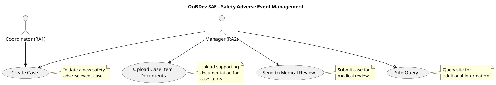
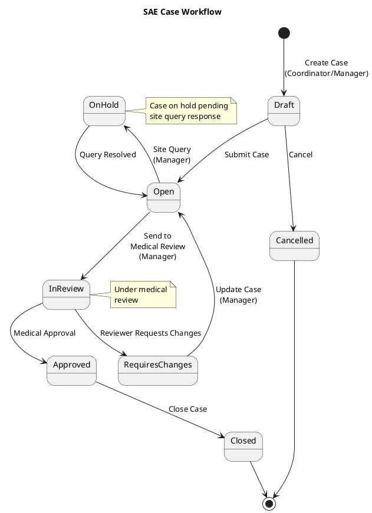

# Safety Adverse Event (SAE) Use Cases

This document describes the use cases for managing Safety Adverse Events in clinical trials.

## Overview

The SAE (Safety Adverse Event) module manages the reporting, review, and tracking of adverse events that occur during clinical trials. This is a critical regulatory compliance feature.

## SAE Use Case Diagram

## Actor Roles

### Coordinator (RA1)
**Research Assistant Level 1**

- **Responsibilities**:
  - Create new SAE cases
  - Initial data entry
  - Basic case documentation

- **Permissions**: Limited to case creation and basic data entry

- **Work Item**: #547

### Manager (RA2)
**Research Assistant Level 2**

- **Responsibilities**:
  - All Coordinator capabilities
  - Upload supporting documents
  - Submit cases for medical review
  - Communicate with sites through queries

- **Permissions**: Full SAE management capabilities

- **Hierarchy**: Extends Coordinator role with additional permissions

## Use Case Descriptions

### Create Case (UC_CreateCase)

**Actors**: Coordinator (RA1), Manager (RA2)

**Description**: Initiate a new safety adverse event case when an adverse event is reported during a clinical trial.

**Preconditions**:
- User must be authenticated
- User must have Coordinator (RA1) or Manager (RA2) role
- Trial must be active

**Main Flow**:
1. User navigates to SAE case creation
2. System displays case creation form
3. User enters adverse event details:
   - Subject identifier
   - Event description
   - Event date and time
   - Severity classification
   - Relationship to study intervention
4. User submits case
5. System validates data
6. System creates case with unique identifier
7. System logs case creation audit trail

**Postconditions**:
- New SAE case created
- Case assigned unique case number
- Audit trail recorded
- Case status set to "Draft" or "Open"

**Business Rules**:
- Case number must be unique
- All mandatory fields must be completed
- Event date cannot be in the future

### Upload Case Item Documents (UC_UploadDocs)

**Actor**: Manager (RA2)

**Description**: Upload supporting documentation for items within an SAE case, such as lab results, medical records, or correspondence.

**Preconditions**:
- User must be authenticated
- User must have Manager (RA2) role
- SAE case must exist
- User must have access to the case

**Main Flow**:
1. User navigates to existing SAE case
2. User selects case item requiring documentation
3. User clicks upload document button
4. System displays file upload dialog
5. User selects file(s) from local system
6. System validates file type and size
7. System uploads and stores documents
8. System associates documents with case item
9. System updates audit trail

**Postconditions**:
- Documents uploaded and associated with case item
- Document metadata recorded
- Audit trail updated

**Business Rules**:
- Supported file types: PDF, DOCX, JPG, PNG, TIFF
- Maximum file size: 10MB per file
- Documents must be associated with specific case items
- Version control maintained for document updates

**Alternative Flows**:
- Invalid file type: System rejects upload and displays error
- File too large: System rejects and prompts for smaller file
- Upload failure: System retries and logs error if persistent

### Send to Medical Review (UC_MedicalReview)

**Actor**: Manager (RA2)

**Description**: Submit a completed SAE case for medical review by qualified medical personnel.

**Preconditions**:
- User must be authenticated
- User must have Manager (RA2) role
- SAE case must exist and be complete
- All required documentation must be uploaded
- Case must not already be in medical review

**Main Flow**:
1. User navigates to SAE case
2. User reviews case completeness
3. User clicks "Send to Medical Review" button
4. System validates case completeness
5. System prompts for confirmation
6. User confirms submission
7. System changes case status to "In Medical Review"
8. System assigns case to medical reviewer queue
9. System sends notification to medical reviewers
10. System updates audit trail

**Postconditions**:
- Case status changed to "In Medical Review"
- Case locked from further edits (unless returned)
- Medical reviewer notified
- Audit trail updated

**Business Rules**:
- Case must have all mandatory fields completed
- Required documents must be attached
- Case cannot be edited while in medical review
- Medical reviewer must be qualified and available

**Alternative Flows**:
- Incomplete case: System displays list of missing items and prevents submission
- No available reviewers: System queues case and notifies administrator

### Site Query (UC_SiteQuery)

**Actor**: Manager (RA2)

**Description**: Create and send queries to the clinical site to request additional information or clarification about an SAE case.

**Preconditions**:
- User must be authenticated
- User must have Manager (RA2) role
- SAE case must exist
- User must have access to the case
- Site contact information must be available

**Main Flow**:
1. User navigates to SAE case
2. User clicks "Create Site Query" button
3. System displays query creation form
4. User enters query details:
   - Query subject/title
   - Question or information request
   - Priority level
   - Due date
5. User submits query
6. System validates query
7. System creates query record
8. System sends notification to site contact
9. System links query to SAE case
10. System updates audit trail

**Postconditions**:
- Query created and linked to case
- Site notified of query
- Query status set to "Open"
- Audit trail updated

**Business Rules**:
- Query must have clear question or request
- Due date must be in the future
- Site must be notified within 24 hours
- Queries must be tracked for response time

**Alternative Flows**:
- Invalid site contact: System alerts user to update contact information
- Notification failure: System logs error and alerts administrator

## SAE Workflow

## Regulatory Compliance

### 21 CFR Part 11 Compliance

The SAE module must comply with FDA 21 CFR Part 11 requirements for electronic records:

1. **Audit Trail**: All actions must be logged with user, timestamp, and action details
2. **Electronic Signatures**: Critical actions require electronic signature
3. **Access Controls**: Role-based access controls enforced
4. **Data Integrity**: Changes tracked with before/after values

### GCP Compliance

Good Clinical Practice (GCP) requirements:

1. **Timely Reporting**: SAEs must be reported within regulatory timeframes
2. **Complete Documentation**: All relevant information must be captured
3. **Medical Review**: Qualified medical review required
4. **Site Communication**: Effective communication with sites

## Related Documentation

- [Gateway Use Cases](./use-cases.md) - Core Gateway functionality
- [Messaging Architecture](../messaging/README.md) - Notification and messaging workflows
- [Admin Use Cases](../admin/use-cases.md) - Administrative functions

## Work Item Reference

- Work Item #502: SAE Use Case implementation
- TFS Server: tfscorp.itrica.com\ITRICA
- Collection ID: 04150b45-2081-4a9f-89f8-b188e6a7a0a4
