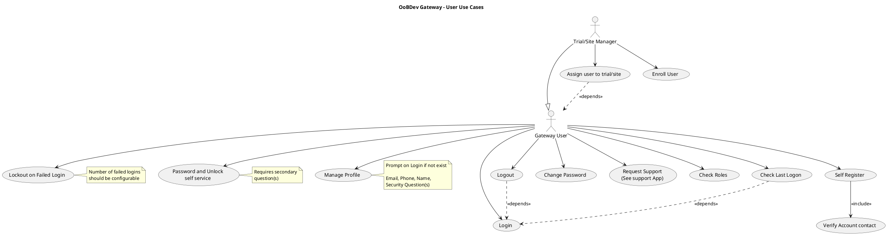
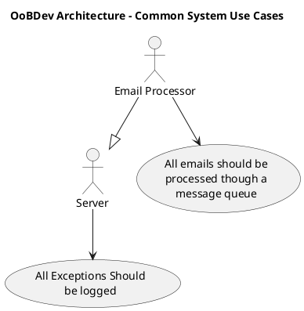

# Gateway Use Cases

This document describes the primary use cases for the OoBDev Gateway application.

## Gateway User Use Cases

The Gateway User represents the base user role with fundamental system access capabilities.



### ASCII Diagram

```
OoBDev Gateway - User Use Cases

┌──────────────────┐
│  Gateway User    │────────┐
│   (Base Role)    │        │
└──────────────────┘        │
         │                  │
         │                  │ inherits from
         │                  │
         │              ┌───▼──────────────────┐
         │              │  Trial/Site Manager  │
         │              └───────────┬──────────┘
         │                          │
         │                          │
         ├──────►( Login )          │
         │                          │
         ├──────►( Logout )◄────────┼───depends on Login
         │                          │
         ├──────►( Change Password )│
         │                          │
         ├──────►( Request Support )│
         │        (See Support App) │
         │                          │
         ├──────►( Check Roles )    │
         │                          │
         ├──────►( Check Last Logon )◄──depends on Login
         │                          │
         ├──────►( Lockout on Failed Login )
         │        [Configurable threshold]
         │                          │
         ├──────►( Self Register )──includes──►( Verify Account Contact )
         │                          │
         ├──────►( Manage Profile ) │
         │        [Prompted on Login if not exists]
         │        - Email, Phone, Name
         │        - Security Questions
         │                          │
         ├──────►( Password and Unlock Self Service )
         │        [Requires Security Questions]
         │                          │
         │                          ├──────►( Assign User to Trial/Site )
         │                          │
         └──────────────────────────┴──────►( Enroll User )


Actor Relationships:
  • Trial/Site Manager extends Gateway User (inherits all Gateway User use cases)

Key Dependencies:
  • Logout depends on Login (must be logged in to log out)
  • Check Last Logon depends on Login (shown during login)
  • Self Register includes Verify Account Contact (email/phone verification)
  • Assign User to Trial/Site depends on Gateway User existing

Notes:
  [1] Lockout threshold should be configurable
  [2] Password/Unlock self service requires security questions
  [3] Profile management prompted on first login if profile doesn't exist
```

## Use Case Descriptions

### Authentication & Session Management

#### Login (UC_Login)
- **Actor**: Gateway User
- **Description**: User authenticates with username and password
- **Work Item**: #570
- **Post-conditions**: User session established, last logon time recorded

#### Logout (UC_Logout)
- **Actor**: Gateway User
- **Description**: User terminates their session
- **Work Item**: #571
- **Dependencies**: Requires active login session

#### Check Last Logon (UC_CheckLastLogon)
- **Actor**: Gateway User
- **Description**: System displays last successful login timestamp
- **Dependencies**: Triggered during login process

#### Lockout on Failed Login (UC_Lockout)
- **Actor**: Gateway User
- **Description**: System locks user account after configurable number of failed login attempts
- **Work Item**: #575
- **Configuration**: Number of failed attempts should be configurable
- **Related**: Password and Unlock self service

### Password Management

#### Change Password (UC_ChangePassword)
- **Actor**: Gateway User
- **Description**: Authenticated user can change their password
- **Work Item**: #569
- **Requirements**: Must meet password complexity requirements

#### Password and Unlock Self Service (UC_PasswordUnlock)
- **Actor**: Gateway User
- **Description**: User can reset password or unlock account without admin assistance
- **Work Item**: #574
- **Requirements**: Requires answering secondary security questions
- **Related**: Manage Profile (for setting security questions)

### User Registration & Profile

#### Self Register (UC_SelfRegister)
- **Actor**: Gateway User
- **Description**: New users can create their own account
- **Work Item**: #577
- **Includes**: Verify Account Contact
- **Post-conditions**: Account created but may require verification

#### Verify Account Contact (UC_VerifyAccount)
- **Actor**: System
- **Description**: Verifies user's email or phone number through confirmation code
- **Included by**: Self Register

#### Manage Profile (UC_ManageProfile)
- **Actor**: Gateway User
- **Description**: User maintains their profile information
- **Work Item**: #573
- **Fields**:
  - Email address
  - Phone number
  - Name
  - Security questions and answers
- **Business Rule**: System prompts for profile completion on login if not complete

### Authorization

#### Check Roles (UC_CheckRoles)
- **Actor**: Gateway User
- **Description**: User can view their assigned roles and permissions
- **Work Item**: #572

### Support

#### Request Support (UC_RequestSupport)
- **Actor**: Gateway User
- **Description**: User can submit support requests
- **Work Item**: #563
- **Note**: See separate Support application for full support workflow

## Trial/Site Manager Use Cases

The Trial/Site Manager role extends Gateway User with additional capabilities for managing trial participants.

### User Management

#### Assign User to Trial/Site (UC_AssignUser)
- **Actor**: Trial/Site Manager
- **Description**: Assign users to specific trials and sites
- **Work Item**: #576
- **Dependencies**: Requires valid Gateway User account

#### Enroll User (UC_EnrollUser)
- **Actor**: Trial/Site Manager
- **Description**: Enroll users into trials
- **Pre-conditions**: User must be assigned to trial/site

## Common System Use Cases

System-level use cases that apply to all server components.



### System Requirements

#### All Exceptions Should be Logged (UC_LogExceptions)
- **Actor**: Server
- **Description**: All unhandled exceptions must be logged for troubleshooting
- **Work Item**: #579
- **Applies to**: All server-side components

#### All Emails Processed Through Message Queue (UC_EmailQueue)
- **Actor**: Email Processor
- **Description**: Email sending must be asynchronous through a message queue
- **Work Item**: #578
- **Rationale**: Prevents email delays from blocking user requests
- **Related**: See [Messaging Architecture](../messaging/README.md)

## Work Item References

The use cases reference Team Foundation Server work items for detailed requirements and implementation tracking.

- TFS Server: tfscorp.itrica.com\ITRICA
- Collection ID: 04150b45-2081-4a9f-89f8-b188e6a7a0a4

## Related Documentation

- [SAE Use Cases](./sae-use-cases.md) - Safety Adverse Event management
- [Layering Architecture](./layering.md) - System architecture and dependencies
