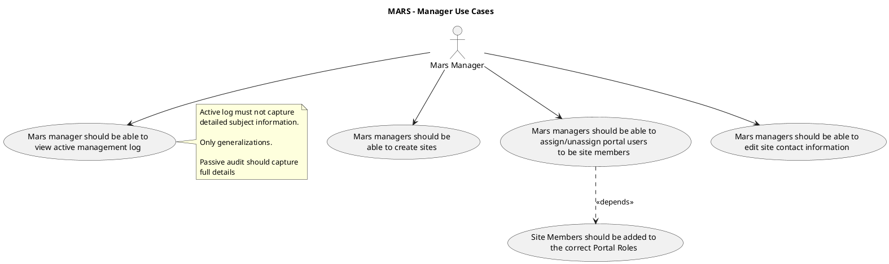
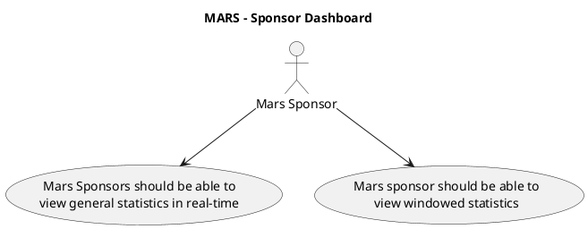

# MARS Use Cases

This document describes the primary use cases for the OoBDev MARS (Medication Adherence Reminder System) module.

## MARS Manager Use Cases

Mars managers handle administrative tasks including site creation and user management.

### Manager Use Case Descriptions

#### Create Sites (UC_CreateSites)
- **Actor**: Mars Manager
- **Description**: Create new trial sites in the MARS system
- **Workflow**:
  1. Manager accesses site creation interface
  2. Enters site information:
     - Site name
     - Site number/identifier
     - Physical address
     - Primary phone number
     - Fax number
     - Primary email address
     - Time zone
  3. Sets site status (active/inactive)
  4. Saves site configuration
- **Post-conditions**: Site is available for member assignment and subject management

#### Assign/Unassign Portal Users to be Site Members (UC_AssignMembers)
- **Actor**: Mars Manager
- **Description**: Manage which portal users can access and manage specific sites
- **Dependencies**: Site Members added to Portal Roles
- **Workflow**:
  1. Manager selects site
  2. Views current site members
  3. Searches for portal users
  4. Assigns user to site
  5. System automatically updates portal roles
  6. User gains access to site
- **Unassignment**:
  1. Manager selects site member
  2. Removes member from site
  3. System updates portal roles
  4. User loses access to site (if not assigned elsewhere)

#### Site Members Added to Portal Roles (UC_PortalRoles)
- **Depended on by**: Assign Members
- **Description**: Automatic portal role assignment when users become site members
- **Portal Roles**:
  - MARS_SiteMember
  - Site-specific roles as needed
- **Purpose**: Ensure proper permissions and access control
- **Automation**: System-driven, no manual intervention required

#### Edit Site Contact Information (UC_EditSiteContact)
- **Actor**: Mars Manager
- **Description**: Update site contact details
- **Editable Fields**:
  - Phone number
  - Fax number
  - Email address
  - Physical address
  - Site name
  - Site status
- **Workflow**:
  1. Manager selects site
  2. Accesses site editing interface
  3. Modifies contact information
  4. Saves changes
- **Audit**: All changes are logged with user and timestamp

#### View Active Management Log (UC_ViewLog)
- **Actor**: Mars Manager
- **Description**: Monitor recent system activity and operations
- **Privacy Consideration**: Active log contains only generalized information
  - No detailed subject information
  - High-level activity summaries
  - Aggregate counts and statistics
- **Passive Audit**: Separate detailed audit log captures full information for compliance
- **Log Entries**:
  - User login/logout
  - Site access
  - Message send counts
  - Appointment creation counts
  - Error and warning messages
- **Purpose**: Operational monitoring without exposing PHI

## MARS Site Member Use Cases

Site members manage day-to-day subject interactions and site operations.

```plantuml
@startuml MARS Site Member Use Cases
title MARS - Site Member Use Cases

actor "Mars Site Member" as SiteMember

' Site Management Use Cases
package "Site Management Functions" {
  usecase "Mars Site Member should be able to\nselect site to work with from a list\nof assigned sites" as UC_SelectSite
  usecase "When a mars site member accesses\nthe mars landing page that member\nshould be redirected to the site\nmanagement page if that member only\nhas one assigned site. Otherwise they\nshould be directed to their available\nsite list." as UC_AutoRedirect
  usecase "Mars Site Member should be able to\nmanage some site contact information\nsuch as phone, fax, and primary\nemail address" as UC_ManageSiteContact
  usecase "Mars site member should be able\nto view the list of members assigned\nto the current site" as UC_ViewMembers
}

' Subject Management Use Cases
package "Subject Management Functions" {
  usecase "Mars Site Member should be able to\nselect a subject within a site\nto manage" as UC_SelectSubject
  usecase "Mars site members should be able\nto edit primary contact details\nfor a subject" as UC_EditSubjectContact
  usecase "Mars site member should be able to\nsee app appointments related to the\nsite in one list" as UC_ViewAppointments
  usecase "Mars site members should be able\nto manage appointments and\nappointment reminders" as UC_ManageAppointments
  usecase "Mars site members should be able\nto view the list of scheduled messages\nfor a subject" as UC_ViewScheduledMessages
  usecase "Mars site members should be able\nto view the message thread (inbound\nand outbound messages) per subject" as UC_ViewMessageThread
  usecase "Mars site members should be able\nto keep journaled notes on subjects" as UC_KeepNotes
}

' Associations
SiteMember --> UC_SelectSite
SiteMember --> UC_AutoRedirect
SiteMember --> UC_ManageSiteContact
SiteMember --> UC_ViewMembers
SiteMember --> UC_SelectSubject
SiteMember --> UC_EditSubjectContact
SiteMember --> UC_ViewAppointments
SiteMember --> UC_ManageAppointments
SiteMember --> UC_ViewScheduledMessages
SiteMember --> UC_ViewMessageThread
SiteMember --> UC_KeepNotes

' Notes
note right of UC_ViewMembers
  Site to Member will
  typically be one to one
end note

note bottom of "Site Management Functions"
  These are site management
  functions for a site member
end note

note bottom of "Subject Management Functions"
  These are subject management
  functions for site members
end note

@enduml
```

### Site Management Use Cases

#### Select Site to Work With (UC_SelectSite)
- **Actor**: Mars Site Member
- **Description**: Choose which assigned site to manage
- **Workflow**:
  1. Site member logs in
  2. Views list of assigned sites
  3. Selects site to work with
  4. System loads site-specific data
  5. Site context is maintained throughout session
- **Multi-Site Support**: Members can be assigned to multiple sites

#### Auto-Redirect for Single Site Assignment (UC_AutoRedirect)
- **Actor**: Mars Site Member
- **Description**: Automatic navigation for single-site members
- **Logic**:
  - If member assigned to exactly one site: Redirect directly to site management page
  - If member assigned to multiple sites: Show site selection list
- **Purpose**: Streamline user experience, reduce clicks for majority use case

#### Manage Site Contact Information (UC_ManageSiteContact)
- **Actor**: Mars Site Member
- **Description**: Limited site contact editing for operational updates
- **Editable Fields** (Subset of manager capabilities):
  - Phone number
  - Fax number
  - Primary email address
- **Restricted Fields** (Manager only):
  - Site name
  - Site address
  - Site identifier
  - Site status
- **Use Case**: Quick updates to daily operational contact information

#### View Members Assigned to Current Site (UC_ViewMembers)
- **Actor**: Mars Site Member
- **Description**: See list of all site members for coordination
- **Information Displayed**:
  - Member name
  - Contact information
  - Role
  - Last login date
  - Status (active/inactive)
- **Note**: Site-to-member is typically one-to-one but system supports multiple members per site

### Subject Management Use Cases

#### Select Subject to Manage (UC_SelectSubject)
- **Actor**: Mars Site Member
- **Description**: Choose a subject for detailed management
- **Workflow**:
  1. Site member accesses subject list for current site
  2. Can search or browse subjects
  3. Selects subject
  4. Subject management interface loads with:
     - Contact information
     - Appointment history
     - Message thread
     - Notes history
     - Scheduled messages

#### Edit Primary Contact Details for Subject (UC_EditSubjectContact)
- **Actor**: Mars Site Member
- **Description**: Update subject's contact information
- **Editable Fields**:
  - Primary phone number
  - Alternative phone number
  - Email address
  - Mailing address
  - Preferred contact method
  - Preferred contact time
- **Workflow**:
  1. Site member selects subject
  2. Accesses contact edit interface
  3. Updates fields as needed
  4. Saves changes
- **Validation**: Phone and email format validation
- **Audit**: All changes logged with timestamp and user

#### View Site Appointments in One List (UC_ViewAppointments)
- **Actor**: Mars Site Member
- **Description**: Calendar view of all appointments for the site
- **Display Options**:
  - Daily view
  - Weekly view
  - Monthly view
  - List view
- **Information Shown**:
  - Subject (de-identified in some views)
  - Appointment date and time
  - Appointment type
  - Reminder status
  - Completion status
- **Filtering**: By date range, appointment type, subject

#### Manage Appointments and Reminders (UC_ManageAppointments)
- **Actor**: Mars Site Member
- **Description**: Create, update, and track subject appointments with automated reminders
- **Create Appointment**:
  1. Select subject
  2. Choose appointment type (visit, procedure, follow-up, etc.)
  3. Set date and time
  4. Enter location/instructions
  5. Configure reminder schedule:
     - Number of reminders (e.g., 3 days before, 1 day before, morning of)
     - Reminder method (SMS, email, or both)
  6. Save appointment
- **Update Appointment**:
  1. Select existing appointment
  2. Modify details
  3. Update reminder configuration if needed
  4. Save changes
- **Reminder Automation**: System sends reminders according to schedule
- **Reminder Tracking**: View reminder delivery status

#### View Scheduled Messages for Subject (UC_ViewScheduledMessages)
- **Actor**: Mars Site Member
- **Description**: See all upcoming automated messages for a subject
- **Information Displayed**:
  - Message type (reminder, medication adherence, follow-up)
  - Scheduled delivery date/time
  - Message content preview
  - Delivery method (SMS/email)
  - Status (pending, sent, failed)
- **Actions Available**:
  - Cancel scheduled message
  - Reschedule message
  - Edit message content (if allowed)
- **Use Cases**:
  - Verify reminder schedule
  - Prevent duplicate communications
  - Coordinate message timing

#### View Message Thread (UC_ViewMessageThread)
- **Actor**: Mars Site Member
- **Description**: Complete bi-directional message history for a subject
- **Display**:
  - Chronological message thread
  - Inbound messages (from subject)
  - Outbound messages (to subject)
  - Message timestamps
  - Delivery status
  - Read receipts (if available)
- **Features**:
  - Search within messages
  - Filter by date range
  - Export message history
  - Reply to inbound messages
- **Privacy**: Messages are PHI and access is logged

#### Keep Journaled Notes on Subjects (UC_KeepNotes)
- **Actor**: Mars Site Member
- **Description**: Maintain chronological notes documenting subject interactions
- **Note Types**:
  - Phone call notes
  - In-person visit notes
  - Email correspondence summaries
  - Issue resolution notes
  - General observations
- **Workflow**:
  1. Site member selects subject
  2. Accesses notes interface
  3. Creates new note entry
  4. Enters note text
  5. Categorizes note (optional)
  6. Saves note
- **Features**:
  - Timestamps automatically added
  - User name automatically recorded
  - Notes cannot be deleted (audit trail)
  - Notes can be edited (with edit history)
  - Search within notes
- **Purpose**:
  - Continuity of care documentation
  - Handoff between site members
  - Issue tracking and resolution

## MARS Sponsor Use Cases

Sponsors have read-only access to aggregated statistics and analytics.

### Sponsor Use Case Descriptions

#### View General Statistics in Real-Time (UC_RealTimeStats)
- **Actor**: Mars Sponsor
- **Description**: Live dashboard with current trial metrics
- **Metrics Displayed**:
  - Total active subjects across all sites
  - Total appointments (today, this week, this month)
  - Message delivery statistics
  - Adherence rates (aggregate)
  - Site participation levels
  - System health indicators
- **Refresh Rate**: Auto-refresh every 5-15 minutes
- **Data**: De-identified, aggregate only
- **Visualization**: Charts, graphs, KPIs
- **Purpose**: Monitor trial progress and engagement

#### View Windowed Statistics (UC_WindowedStats)
- **Actor**: Mars Sponsor
- **Description**: Historical trends and time-period analysis
- **Time Windows**:
  - Last 7 days
  - Last 30 days
  - Last 90 days
  - Custom date ranges
  - Month-over-month
  - Quarter-over-quarter
- **Metrics**:
  - Enrollment trends
  - Message delivery trends
  - Appointment completion rates
  - Subject retention
  - Site performance comparison
- **Visualizations**:
  - Line charts for trends
  - Bar charts for comparisons
  - Heat maps for geographical analysis
- **Export**: Download reports as PDF or Excel
- **Purpose**: Strategic decision making and trial oversight

## Privacy & Compliance Notes

### Active Management Log Privacy
The active management log viewed by Mars managers contains only generalized information to prevent inadvertent PHI disclosure:
- **Excluded**: Subject names, IDs, specific medical information
- **Included**: Aggregate counts, system events, user activities (without PHI context)
- **Rationale**: Operations monitoring shouldn't require PHI access

### Passive Audit Log
The passive audit log maintains complete details for regulatory compliance:
- **Captured**: All user actions with full context including PHI
- **Access**: Restricted to audit review personnel
- **Retention**: Long-term storage per regulatory requirements
- **Purpose**: Regulatory inspections, investigations, compliance verification

### Role-Based Access Control
- **Mars Manager**: Administrative access, no subject-level PHI
- **Mars Site Member**: Full subject access for assigned sites
- **Mars Sponsor**: Aggregate statistics only, zero PHI access

## Related Documentation

- [MARS Architecture Overview](./README.md) - Module overview and components
- [Gateway Architecture](../gateway/README.md) - Portal user and role management
- [Messaging Architecture](../messaging/README.md) - Message delivery infrastructure
