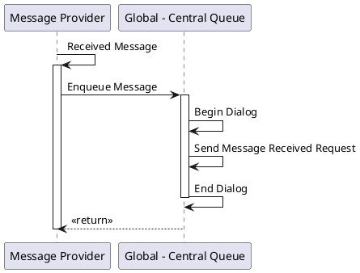
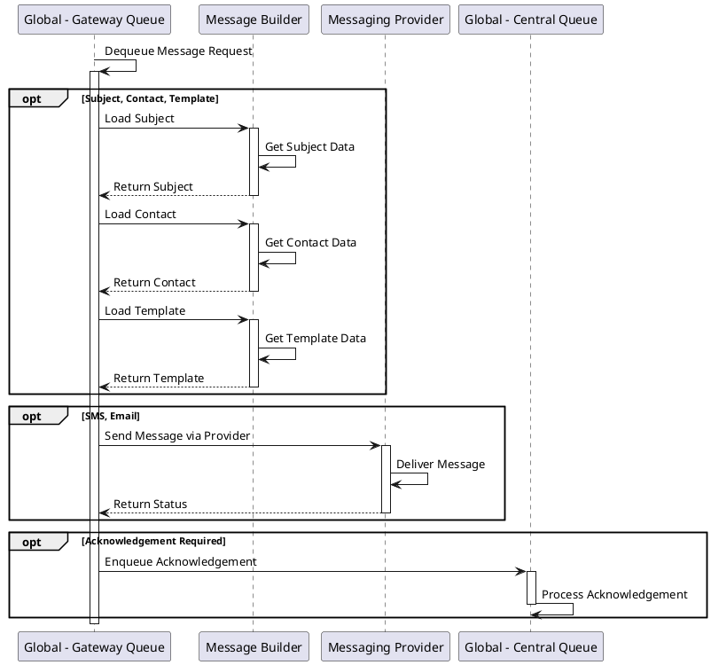

# Gateway Queue Operations

## Overview

The Gateway Queue is the external-facing layer of the messaging architecture, responsible for:
- Receiving messages from the Message Provider (SMS/Email services)
- Handling outbound message requests from the Global Queue
- Building final messages from templates
- Managing service bus dialogs with messaging providers

## Components

- **Global - Gateway Queue** - Service bus queue handling gateway operations
- **Message Builder** - Constructs final message content from templates and data
- **Messaging Provider** - External messaging service (SMS, Email providers)
- **Global - Central Queue** - Upstream queue for message coordination

## Operations

### GatewayReceiveMessage

Handles incoming messages from external messaging providers.



**Description:**
When a message is received from an external provider (e.g., an SMS reply from a subject), the Message Provider:
1. Captures the received message
2. Enqueues it to the Global Central Queue
3. Creates a service bus dialog
4. Sends a Message Received Request
5. Closes the dialog
6. Returns confirmation

**Critical Section:** The entire operation runs in a critical section to ensure atomic processing.

---

### GatewayQueueHandleMessageRequest

Processes outbound message requests from the Global Queue.



**Description:**
This operation handles the actual message sending process:

1. **Message Request Dequeue** - Retrieves message request from the queue
2. **Consider Subject, Contact, Template** - Loads necessary data:
   - Subject information (trial participant)
   - Contact details (phone/email)
   - Message template
3. **Consider SMS/Email** - Routes to appropriate provider:
   - SMS messages → SMS provider
   - Email messages → Email provider
4. **Optional Acknowledgement** - If message delivery confirmation is required, enqueue acknowledgement request back to Global Queue

**Critical Section:** Operations within the critical section ensure consistent state during message construction and delivery.

**Note:** Message Provider selection is based on Message Type (SMS or Email).

---

## Message Flow Patterns

### Provider Integration
The Gateway Queue abstracts the complexity of different messaging providers (SMS, Email) and provides a unified interface to the rest of the system.

### Dialog Management
Service bus dialogs ensure transactional message processing:
- **Begin Dialog** - Opens a transaction
- **Send/Receive Operations** - Execute within the transaction
- **End Dialog** - Commits the transaction

### Error Handling
If message delivery fails at the provider level, the Gateway Queue captures the error and routes it back to the Global Queue for appropriate handling.

## Data Flow

```
Global Queue → Gateway Queue → Message Builder → Messaging Provider → External Recipient
                     ↓                                    ↓
              Load Subject/Contact/Template         Delivery Status
                                                          ↓
                                            Acknowledgement → Global Queue
```

## Configuration Considerations

- **Message Provider Credentials** - Secure storage of API keys/credentials for SMS and Email providers
- **Rate Limiting** - Respect provider rate limits
- **Retry Policies** - Configure retry behavior for transient failures
- **Timeout Settings** - Set appropriate timeouts for provider API calls
