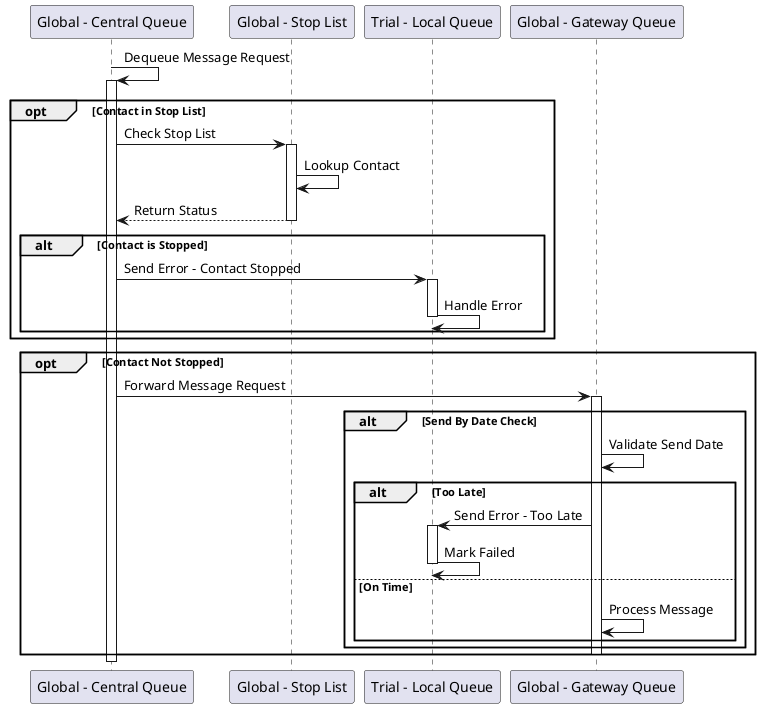
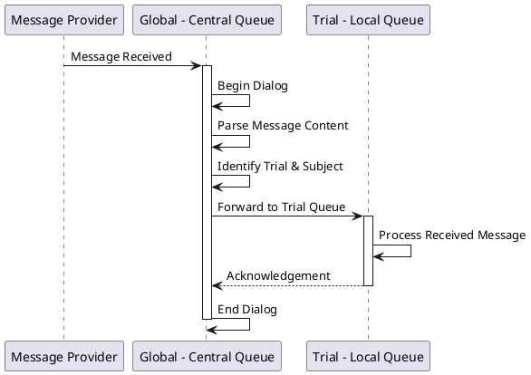
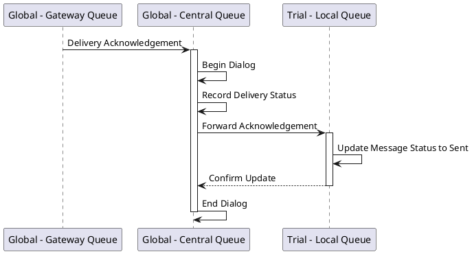
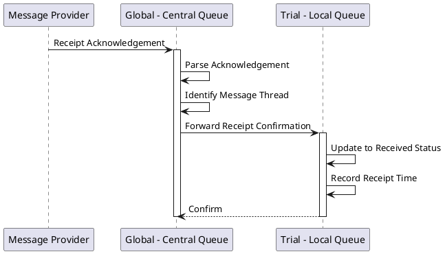
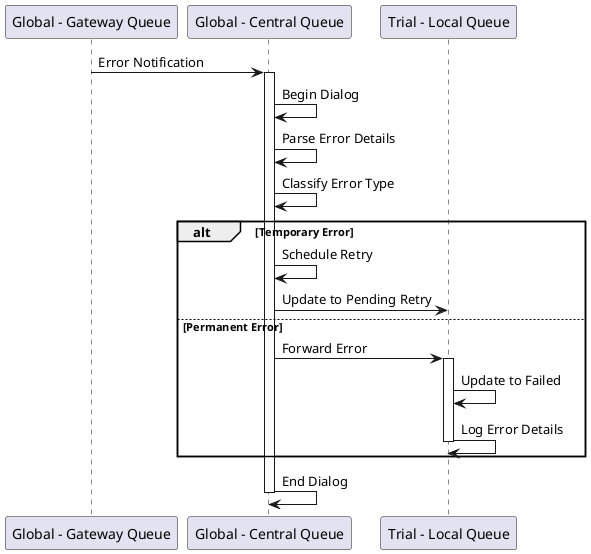
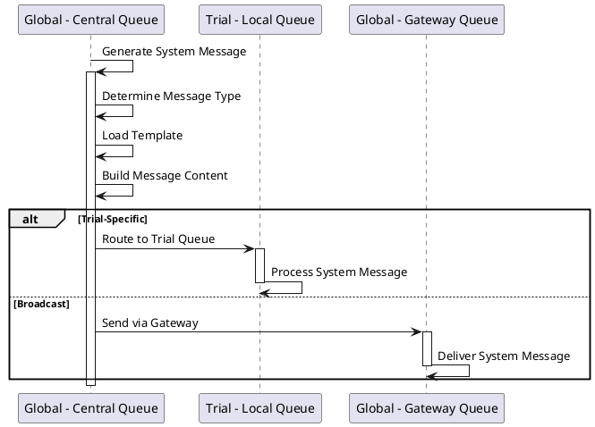

# Global Queue Operations

## Overview

The Global Queue (Central Queue) serves as the central orchestration layer for all messaging operations. It coordinates between Trial Queues and the Gateway Queue, manages the stop list, and handles system-level message routing.

## Components

- **Global - Central Queue** - Central service bus queue
- **Global - Stop List** - Database of contacts who should not receive messages
- **Trial - Local Queue** - Trial-specific message queues
- **Global - Gateway Queue** - External messaging gateway
- **Message Provider** - External messaging services

## Operations

### GlobalQueueHandleMessageRequest

Routes message requests from Trial Queues to the Gateway Queue, with stop list checking.



**Description:**
This operation manages the routing of message requests:

1. **Dequeue Request** - Retrieves message request from the Global Queue
2. **Stop List Check (Optional)** - If contact verification is needed:
   - Query the stop list
   - If contact is on stop list, send error back to Trial Queue
   - If contact is clear, proceed
3. **Forward to Gateway** - Route message to Gateway Queue for delivery
4. **Send By Date Validation** - Verify message timing:
   - If past send-by date, return "Too Late" error to Trial Queue
   - Otherwise, proceed with delivery

**Critical Section:** Ensures atomic stop list checking and routing decisions.

---

### GlobalQueueHandleMessageReceived

Processes incoming messages from the Gateway Queue.



**Description:**
Handles messages received from external sources:

1. **Receive Message** - Incoming message from Message Provider
2. **Begin Dialog** - Start transaction
3. **Parse & Route** - Identify destination trial and subject
4. **Forward to Trial Queue** - Route to appropriate trial-specific queue
5. **End Dialog** - Complete transaction

---

### GlobalQueueHandleAcknowledgement

Processes delivery acknowledgements from the Gateway Queue.



**Description:**
Handles acknowledgements of successful message delivery:

1. **Receive Acknowledgement** - From Gateway Queue
2. **Begin Dialog** - Transaction start
3. **Record Status** - Log delivery confirmation
4. **Forward to Trial** - Notify Trial Queue of successful delivery
5. **Update Status** - Trial Queue updates message to "Sent" state
6. **End Dialog** - Commit transaction

---

### GlobalQueueHandleAcknowledgeReceived

Confirms receipt acknowledgement from recipients.



**Description:**
Processes confirmations that a recipient has actually received/read the message:

1. **Receipt Notification** - From messaging provider
2. **Parse** - Extract message thread identification
3. **Forward** - Send to Trial Queue
4. **Update Status** - Mark message as "Received"
5. **Record Timestamp** - Log receipt time

---

### GlobalQueueHandleError

Handles error conditions from Gateway Queue or messaging providers.



**Description:**
Manages error scenarios from message delivery attempts:

1. **Error Notification** - Receive error from Gateway
2. **Begin Dialog** - Start error handling transaction
3. **Parse & Classify** - Determine error type and severity
4. **Handle Based on Type**:
   - **Temporary/Transient** - Schedule retry, update to "Pending Retry"
   - **Permanent** - Mark as "Failed", forward to Trial Queue with details
5. **End Dialog** - Complete transaction

---

### GlobalQueueHandleSystemMessage

Processes system-generated messages (notifications, alerts, automated communications).



**Description:**
Handles automated system messages:

1. **Generate** - Create system message based on trigger
2. **Determine Type** - Classify message (alert, notification, etc.)
3. **Build Content** - Load template and populate data
4. **Route**:
   - **Trial-Specific** - Send to specific Trial Queue
   - **Broadcast** - Send directly via Gateway to multiple recipients

---

## Message Routing Rules

### Stop List Priority
The stop list check is the first validation step. Messages to stopped contacts are immediately rejected.

### Trial Identification
Incoming messages are routed to Trial Queues based on:
- Contact information
- Subject identifier
- Trial context in message metadata

### Error Classification
Errors are classified as:
- **Transient** - Network issues, temporary provider unavailability → Retry
- **Permanent** - Invalid contact, unsubscribed, blocked → Failed
- **Validation** - Missing data, invalid format → Failed

## Data Flow

```
Trial Queue ──→ Global Queue ──→ Gateway Queue ──→ Message Provider
     ↑               ↓
     │         Stop List Check
     │               │
     └───────────────┘
       Error/Ack Feedback Loop
```

## Critical Sections

All Global Queue operations use critical sections to ensure:
- Atomic stop list checking
- Consistent message routing
- Reliable state updates
- Transactional dialog management
