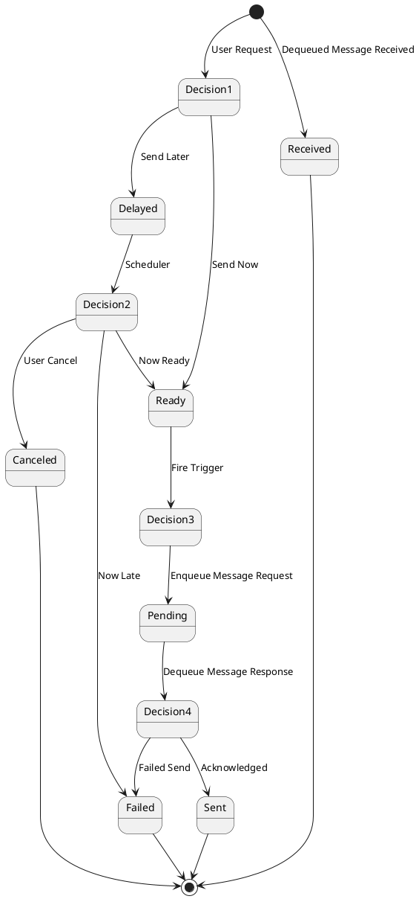

# Message Thread State Machine

## Overview

The Message Thread State Machine defines the lifecycle of a message from creation through delivery and confirmation. It manages state transitions based on user actions, scheduler events, and delivery results.

## State Diagram



## States

### Initial States

#### User Request (Entry Point)
- **Trigger:** User initiates message send
- **Transitions:**
  - **Send Now** → Ready
  - **Send Later** → Delayed

### Primary States

#### Delayed
Message is scheduled for future delivery.

- **Characteristics:**
  - Has a scheduled send date/time
  - Monitored by scheduler
  - Can be canceled by user
- **Transitions:**
  - **Scheduler: Now Ready** → Ready
  - **Scheduler: Now Late** → Failed
  - **User: Cancel** → Canceled

#### Ready
Message is prepared and ready to be sent immediately.

- **Characteristics:**
  - All prerequisites met (subject active, contact valid)
  - Template data resolved
  - Waiting for trigger to queue
- **Transitions:**
  - **Fire Trigger: Enqueue Message Request** → Pending

#### Pending
Message is queued for delivery, awaiting provider response.

- **Characteristics:**
  - In service bus queue
  - Being processed by Gateway Queue
  - Awaiting delivery confirmation
- **Transitions:**
  - **Acknowledged** → Sent
  - **Failed Send** → Failed

#### Sent
Message successfully delivered to recipient.

- **Characteristics:**
  - Confirmed delivery by messaging provider
  - Activity logged
  - Thread can be closed or await reply
- **Transitions:**
  - Terminal state → [*]

#### Failed
Message delivery failed permanently.

- **Characteristics:**
  - Error recorded
  - Reason logged (e.g., invalid contact, rejected, too late)
  - Activity marked as failed
- **Transitions:**
  - Terminal state → [*]

#### Canceled
Message was canceled before delivery.

- **Characteristics:**
  - User-initiated cancellation
  - Only possible from Delayed state
  - Activity marked as canceled
- **Transitions:**
  - Terminal state → [*]

### Received Path (Incoming Messages)

#### Received
Message received from external source (subject reply).

- **Trigger:** Dequeued Message Received
- **Characteristics:**
  - Incoming message from subject
  - Added to message thread
  - Activity logged
- **Transitions:**
  - Terminal state → [*]

## Transitions

### User-Initiated Transitions

#### Send Now
```
User Request → Ready
```
User chooses to send message immediately.

- **Conditions:** None (always allowed)
- **Actions:**
  - Set status to Ready
  - Prepare for immediate queuing

#### Send Later
```
User Request → Delayed
```
User schedules message for future delivery.

- **Conditions:** Send date/time must be in the future
- **Actions:**
  - Set status to Delayed
  - Record scheduled send time
  - Register with scheduler

#### User Cancel
```
Delayed → Canceled
```
User cancels a scheduled message.

- **Conditions:** Message must be in Delayed state
- **Actions:**
  - Set status to Canceled
  - Remove from scheduler
  - Log cancellation activity

### Scheduler-Initiated Transitions

#### Now Ready
```
Delayed → Ready
```
Scheduled send time has arrived.

- **Conditions:**
  - Current time >= scheduled send time
  - Current time <= send window end
  - Subject still active
  - Contact still valid
- **Actions:**
  - Set status to Ready
  - Trigger message queuing

#### Now Late
```
Delayed → Failed
```
Send window has passed without delivery.

- **Conditions:**
  - Current time > send window end
  - Message never delivered
- **Actions:**
  - Set status to Failed
  - Record reason: "Too Late"
  - Log failure activity

### System-Initiated Transitions

#### Fire Trigger (Enqueue Message Request)
```
Ready → Pending
```
System queues the ready message for delivery.

- **Conditions:** Message status is Ready
- **Actions:**
  - Enqueue to Trial Queue
  - Set status to Pending
  - Record queue time

#### Acknowledged
```
Pending → Sent
```
Delivery acknowledged by messaging provider.

- **Conditions:** Valid acknowledgement received
- **Actions:**
  - Set status to Sent
  - Record delivery time
  - Log success activity

#### Failed Send
```
Pending → Failed
```
Delivery attempt failed.

- **Conditions:** Error received from provider or queue
- **Actions:**
  - Set status to Failed
  - Record error details
  - Log failure activity

#### Dequeued Message Received
```
[*] → Received
```
Incoming message from subject.

- **Conditions:** Valid message received
- **Actions:**
  - Create or update thread
  - Set status to Received
  - Log received activity

## State Persistence

All state transitions are persisted in the database with:

- **Timestamp** - When transition occurred
- **Previous State** - State before transition
- **New State** - State after transition
- **Reason** - Why transition occurred
- **Actor** - Who/what initiated transition (User, Scheduler, System)

## Concurrent State Management

The state machine handles concurrent operations:

### Race Conditions

#### User Cancel vs. Scheduler Ready
- **Scenario:** User cancels while scheduler is processing "Now Ready"
- **Resolution:** Last write wins, but transaction ensures one commits
- **Outcome:** Either Canceled or Ready based on timing

#### Multiple Delivery Attempts
- **Scenario:** Retry logic triggers while original attempt completes
- **Resolution:** Idempotency keys prevent duplicate delivery
- **Outcome:** Single delivery, duplicate attempts ignored

## Error Handling

### Invalid Transitions

Attempting invalid state transitions results in:

1. **Logged Warning** - Invalid transition attempt logged
2. **State Preserved** - Current state unchanged
3. **Error Returned** - Clear error message to caller
4. **Activity Record** - Failed transition attempt recorded

### Recovery

If state becomes inconsistent:

1. **Detection** - Validation checks detect inconsistency
2. **Reconciliation** - Compare database, queue, and activity log
3. **Resolution** - Manual review or automated recovery based on activity log
4. **Notification** - Alert administrators of inconsistency

## Monitoring

Key metrics tracked:

- **State Distribution** - Count of messages in each state
- **Transition Rates** - How quickly messages move through states
- **Failure Patterns** - Common failure reasons
- **Dwell Time** - Time spent in each state
- **Cancellation Rate** - Percentage of delayed messages canceled

## Example Flows

### Immediate Send Success
```
[*] → Decision1 → Ready → Decision3 → Pending → Decision4 → Sent → [*]
     (User Request)  (Send Now)  (Fire Trigger)  (Enqueue)  (Acknowledged)
```

### Delayed Send Success
```
[*] → Decision1 → Delayed → Decision2 → Ready → Decision3 → Pending → Decision4 → Sent → [*]
     (User Request)  (Send Later)  (Scheduler)  (Now Ready)  (Fire Trigger)  (Enqueue)  (Acknowledged)
```

### Delayed Send Too Late
```
[*] → Decision1 → Delayed → Decision2 → Failed → [*]
     (User Request)  (Send Later)  (Scheduler)  (Now Late)
```

### User Cancellation
```
[*] → Decision1 → Delayed → Decision2 → Canceled → [*]
     (User Request)  (Send Later)  (User Cancel)
```

### Delivery Failure
```
[*] → Decision1 → Ready → Decision3 → Pending → Decision4 → Failed → [*]
     (User Request)  (Send Now)  (Fire Trigger)  (Enqueue)  (Failed Send)
```

### Incoming Message
```
[*] → Received → [*]
     (Dequeued Message Received)
```
