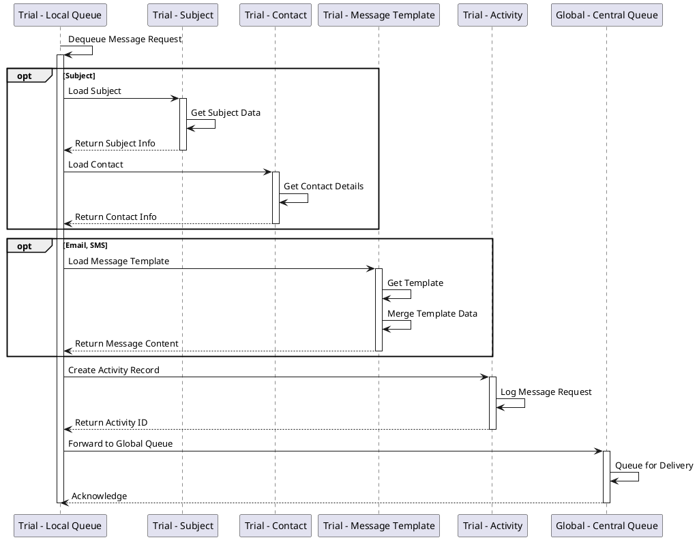
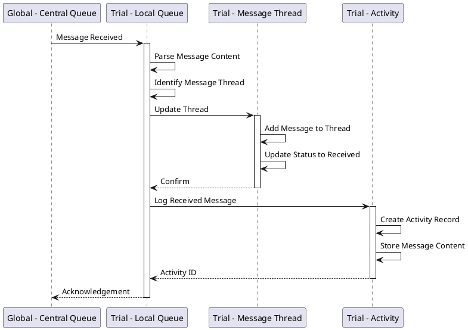
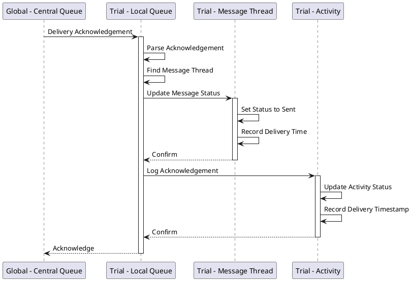
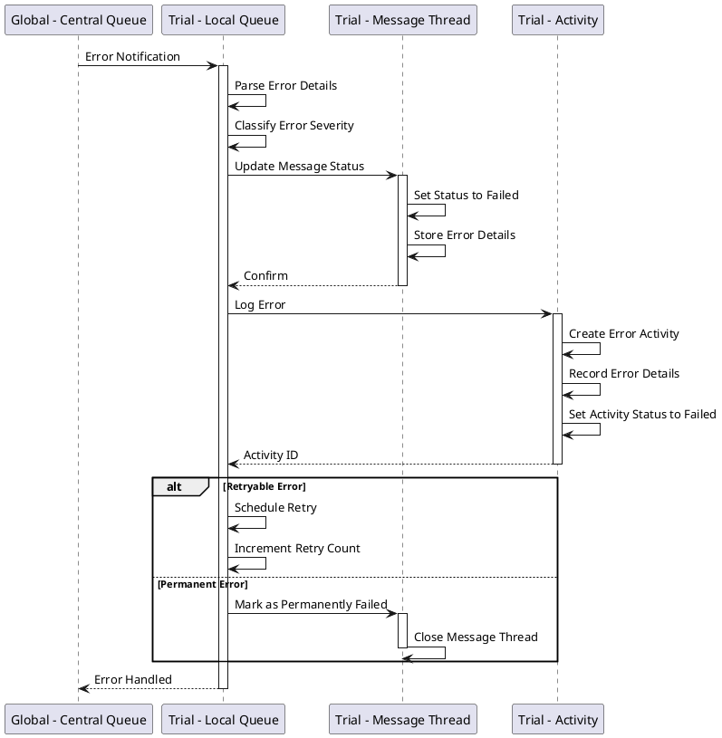
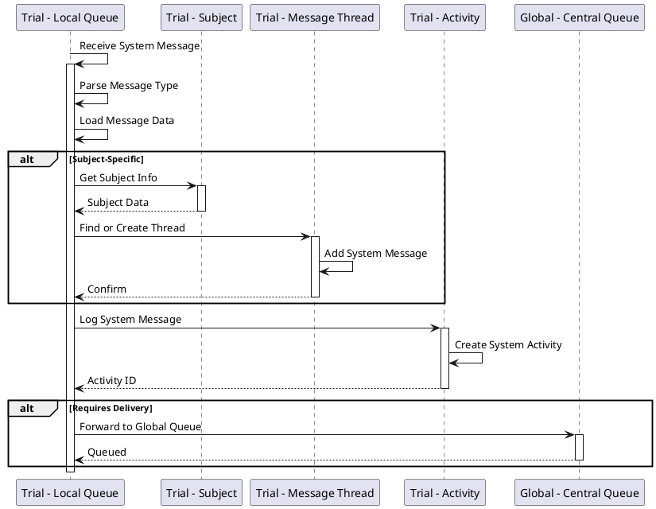
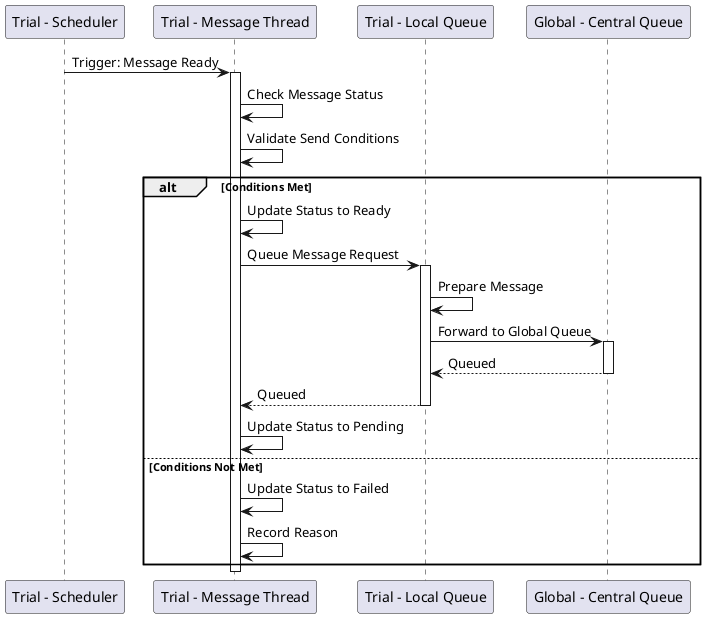
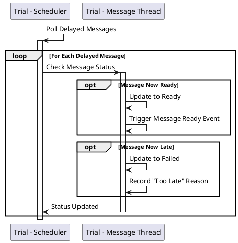

# Trial Queue Operations

## Overview

The Trial Queue (Local Queue) handles trial-specific message processing, including:
- Managing message threads with trial subjects
- Coordinating with trial entities (Subject, Contact, Template, Activity)
- Processing message state transitions
- Handling acknowledgements and errors at the trial level

## Components

- **Trial - Local Queue** - Trial-specific service bus queue
- **Trial - Subject** - Clinical trial participant
- **Trial - Contact** - Subject contact information (phone, email)
- **Trial - Message Template** - Pre-defined message templates
- **Trial - Message Thread** - Conversation thread with a subject
- **Trial - Activity** - Activity tracking for audit and compliance
- **Global - Central Queue** - Upstream global queue

## Operations

### TrialQueueHandleMessageRequest

Processes new message requests from message threads, preparing messages for delivery.



**Description:**
Handles the preparation and forwarding of message requests:

1. **Dequeue Request** - Retrieve message request from trial queue
2. **Load Subject Data (Consider: Subject)** - If subject-related:
   - Load subject information
   - Load associated contact details
3. **Load Template (Consider: Email, SMS)** - Based on message type:
   - Retrieve appropriate template
   - Merge template with subject/trial data
4. **Create Activity** - Log the message request for audit trail
5. **Forward to Global Queue** - Send prepared message to Global Queue for routing

**Critical Section:** Ensures atomic processing of message data and activity logging.

---

### TrialQueueHandleMessageReceived

Processes incoming messages received from subjects (replies, responses).



**Description:**
Handles messages received from trial subjects:

1. **Receive Message** - From Global Queue
2. **Parse Content** - Extract message data and identify thread
3. **Update Thread** - Add message to conversation thread
4. **Update Status** - Mark message as "Received"
5. **Log Activity** - Create activity record with message content
6. **Acknowledge** - Confirm processing to Global Queue

---

### TrialQueueHandleAcknowledgement

Processes delivery acknowledgements for messages sent to subjects.



**Description:**
Handles confirmation of successful message delivery:

1. **Receive Acknowledgement** - From Global Queue
2. **Parse** - Extract message identifier
3. **Find Thread** - Locate corresponding message thread
4. **Update Status** - Change message status to "Sent"
5. **Record Time** - Log delivery timestamp
6. **Update Activity** - Update activity record with delivery confirmation
7. **Confirm** - Acknowledge processing

---

### TrialQueueHandleError

Manages error conditions from message delivery attempts.



**Description:**
Handles errors from delivery attempts:

1. **Error Notification** - Receive error from Global Queue
2. **Parse & Classify** - Determine error type and severity
3. **Update Message Status** - Set to "Failed"
4. **Store Error Details** - Record error information in thread
5. **Log Error Activity** - Create error activity record
6. **Determine Action**:
   - **Retryable** - Schedule retry, increment retry counter
   - **Permanent** - Mark permanently failed, close thread

---

### TrialQueueHandleSystemMessage

Processes system-generated messages for the trial.



**Description:**
Handles system-generated notifications and alerts:

1. **Receive** - System message from scheduler or automated process
2. **Parse Type** - Determine message category
3. **Load Data** - Retrieve necessary context
4. **Subject Processing** - If subject-specific:
   - Get subject information
   - Find or create message thread
   - Add message to thread
5. **Log Activity** - Record system message activity
6. **Optional Delivery** - If message requires external delivery, forward to Global Queue

---

### TrialTriggerMessageReady

Handles the trigger when a delayed message becomes ready for delivery.



**Description:**
Triggered by the scheduler when a delayed message's send time arrives:

1. **Trigger** - Scheduler fires message ready event
2. **Check Status** - Verify message is still in "Ready" state
3. **Validate Conditions** - Ensure send conditions are still valid
4. **Process**:
   - **Conditions Met** - Update to "Ready", queue to Trial Queue, forward to Global Queue, update to "Pending"
   - **Conditions Not Met** - Mark as "Failed" with reason (e.g., too late, subject withdrawn)

---

### TrialSchedulerMessages

Manages scheduled messages and delayed delivery.



**Description:**
The scheduler continuously monitors delayed messages:

1. **Poll** - Regular polling of delayed messages
2. **Check Each Message**:
   - **Message Delayed** - Check if send time has arrived
   - **Message Now Ready** - Update to "Ready" state, trigger ready event
   - **Message Now Late** - If past valid send window, mark as "Failed"

---

## Message Thread Lifecycle

Messages in the Trial Queue follow this lifecycle:

```
Create → Delayed → Ready → Pending → Sent → Received
                    ↓         ↓        ↓
                 Failed    Failed   Failed
                    ↓         ↓        ↓
                 Canceled  Canceled Canceled
```

## Activity Tracking

Every message operation creates an activity record for:
- **Compliance** - Regulatory audit trail
- **Debugging** - Troubleshooting delivery issues
- **Analytics** - Message engagement metrics
- **Reporting** - Trial communication reports

## Error Retry Strategy

The Trial Queue implements a retry strategy:

1. **First Failure** - Wait 1 minute, retry
2. **Second Failure** - Wait 5 minutes, retry
3. **Third Failure** - Wait 15 minutes, retry
4. **Fourth Failure** - Mark as permanently failed

## Performance Considerations

- **Batching** - Multiple message requests can be batched to Global Queue
- **Caching** - Subject, Contact, and Template data are cached to reduce database load
- **Parallel Processing** - Multiple trial queues process independently
- **Priority** - Urgent messages can be prioritized in the queue
