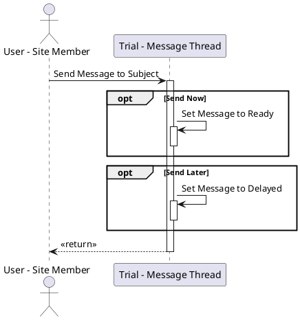
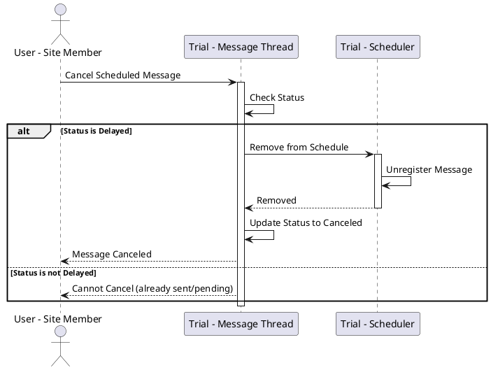
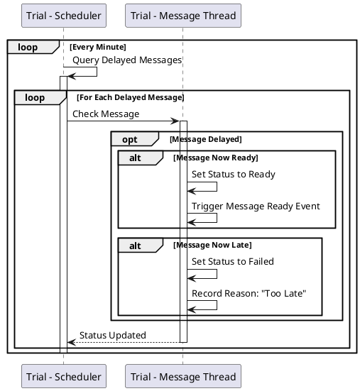
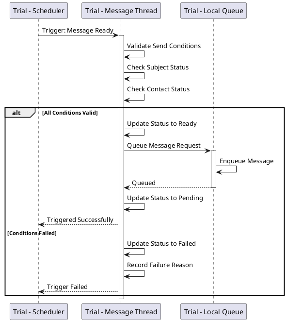

# User Workflows and Scheduler

## Overview

This document describes the user-facing workflows for sending messages and the scheduler operations that manage delayed message delivery.

## User Workflows

### UserRequestSendMessage

The primary workflow for users to send messages to trial subjects.



**Description:**

This workflow allows site members (trial coordinators, investigators) to send messages to trial subjects.

#### Steps

1. **Initiate Send** - User selects subject and composes or chooses message
2. **Choose Timing**:
   - **Send Now**: Message is immediately set to "Ready" state for delivery
   - **Send Later**: Message is set to "Delayed" state with scheduled send time
3. **Confirm** - System confirms message has been queued or scheduled
4. **Return** - User receives confirmation

#### Send Now Flow

When "Send Now" is selected:

1. **Set Message to Ready**
   - Message status → Ready
   - Message immediately enters delivery pipeline
   - Subject, Contact, and Template data validated
   - Message queued to Trial Queue

The Ready message triggers the following chain:
```
Ready → Trial Queue → Global Queue → Gateway Queue → Message Provider → Subject
```

#### Send Later Flow

When "Send Later" is selected:

1. **Set Message to Delayed**
   - Message status → Delayed
   - Scheduled send date/time recorded
   - Message registered with scheduler
   - No immediate delivery attempt

The Delayed message will be processed by the scheduler when the scheduled time arrives.

### Message Composition

Users can compose messages by:

1. **Select Template** - Choose from pre-approved message templates
2. **Customize** - Personalize with subject-specific data (name, appointment time, etc.)
3. **Preview** - Review merged message before sending
4. **Select Contact** - Choose phone (SMS) or email
5. **Schedule** - Choose immediate or scheduled delivery
6. **Confirm** - Send message

### Message Cancellation (Delayed Messages Only)



**Description:**

Users can cancel messages that are in the "Delayed" state (not yet sent).

#### Steps

1. **Request Cancel** - User selects scheduled message to cancel
2. **Check Status** - System verifies message is in "Delayed" state
3. **Remove from Scheduler** - Unregister from scheduler
4. **Update Status** - Change status to "Canceled"
5. **Confirm** - User receives cancellation confirmation

**Note:** Messages that are already "Pending" or "Sent" cannot be canceled.

---

## Scheduler Operations

### TrialSchedulerMessages

The scheduler continuously monitors delayed messages and triggers delivery when appropriate.



**Description:**

The scheduler runs as a background service that:

1. **Poll Delayed Messages** - Queries database for messages in "Delayed" state
2. **Check Timing** - For each delayed message:
   - Compare current time with scheduled send time
   - Check if within valid send window
3. **Transition State**:
   - **Message Now Ready** - If send time has arrived and within window, transition to "Ready"
   - **Message Now Late** - If past send window, transition to "Failed"
4. **Repeat** - Continuous polling (typically every 1 minute)

### Scheduler Configuration

- **Poll Interval:** 60 seconds (configurable)
- **Send Window:** Messages have a valid send window (e.g., within 4 hours of scheduled time)
- **Batch Size:** Process up to 100 delayed messages per poll
- **Time Zone:** All times in UTC, converted to local time for display

### TrialTriggerMessageReady

When a delayed message becomes ready, this trigger fires to initiate delivery.



**Description:**

When the scheduler determines a message is ready:

1. **Trigger Event** - Scheduler fires "Message Ready" trigger
2. **Validate Conditions** - Message thread validates:
   - Subject is still active in trial
   - Contact information is still valid
   - Trial is still accepting messages
   - No stop list conflicts
3. **Process Based on Validation**:
   - **Valid** - Update to "Ready", queue to Trial Queue, transition to "Pending"
   - **Invalid** - Update to "Failed" with reason (e.g., "Subject withdrawn", "Contact invalid")

### Edge Cases

#### Scheduler Downtime

If scheduler is down when a message's send time arrives:

1. **Catch Up** - On restart, scheduler processes all overdue messages
2. **Window Check** - Messages past their send window → Failed
3. **Valid Messages** - Messages still within window → Ready

#### Time Zone Changes

- All scheduled times stored in UTC
- Local time zone changes don't affect scheduled delivery
- Display layer converts UTC to user's local time

#### Daylight Saving Time

- UTC storage eliminates DST issues
- Messages scheduled during "spring forward" hour will send at next available time
- Messages during "fall back" hour send only once (UTC prevents duplicates)

---

## Integration Points

### User Interface

The messaging UI provides:

- **Message Composition** - Template selection and customization
- **Recipient Selection** - Subject and contact chooser
- **Scheduling Interface** - Date/time picker for delayed send
- **Message History** - View sent/scheduled/failed messages
- **Cancellation** - Cancel scheduled messages

### Notifications

Users receive notifications for:

- **Message Sent** - Confirmation of successful delivery
- **Message Failed** - Alert if delivery fails
- **Reply Received** - Notification when subject responds
- **Scheduled Message Pending** - Reminder of upcoming scheduled send

### Audit Trail

All user actions are logged:

- **Message Creation** - Who created, when, for which subject
- **Scheduling** - Scheduled time, who scheduled
- **Cancellation** - Who canceled, when, reason
- **Modifications** - Any changes to message content or timing

---

## Workflow Variations

### Bulk Messaging

For sending messages to multiple subjects:

1. **Select Recipients** - Choose multiple subjects
2. **Choose Template** - Select single template for all
3. **Customize** - Template merges with each subject's data
4. **Schedule** - Choose immediate or scheduled for all
5. **Queue** - System queues individual messages for each subject

Each subject's message follows the standard workflow independently.

### Auto-Reply

For automated responses:

1. **Receive Message** - Subject sends message
2. **Parse Content** - System analyzes message content
3. **Match Pattern** - Check against auto-reply rules
4. **Generate Response** - Create appropriate response
5. **Send Immediately** - Auto-reply sent as "Send Now" message

### Reminder Series

For scheduled reminder sequences:

1. **Define Series** - Set up multiple messages with relative timing
2. **Anchor Date** - Base timing on appointment or event date
3. **Schedule All** - System creates multiple delayed messages
4. **Individual Tracking** - Each message in series tracked independently

Example: Appointment reminders
- 7 days before: "Appointment in 1 week"
- 1 day before: "Appointment tomorrow"
- 2 hours before: "Appointment in 2 hours"

---

## Performance Considerations

### Scheduler Scalability

- **Partitioning** - Multiple scheduler instances for different trial ranges
- **Indexing** - Database indexes on status and scheduled_time for fast queries
- **Caching** - Frequently accessed message threads cached
- **Batch Processing** - Process messages in batches to reduce database load

### User Experience

- **Asynchronous Processing** - Message sending happens asynchronously
- **Immediate Feedback** - User gets immediate confirmation of queuing
- **Progress Indicators** - UI shows message status progression
- **Real-time Updates** - WebSocket updates for delivery status changes

### Rate Limiting

To prevent overwhelming the system:

- **User Limits** - Max messages per user per hour
- **Trial Limits** - Max messages per trial per day
- **System Limits** - Overall system throughput limits
- **Provider Limits** - Respect external provider rate limits
