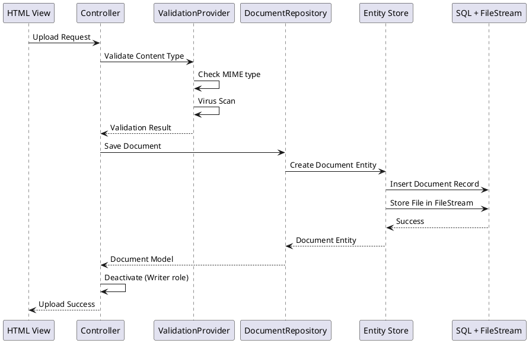
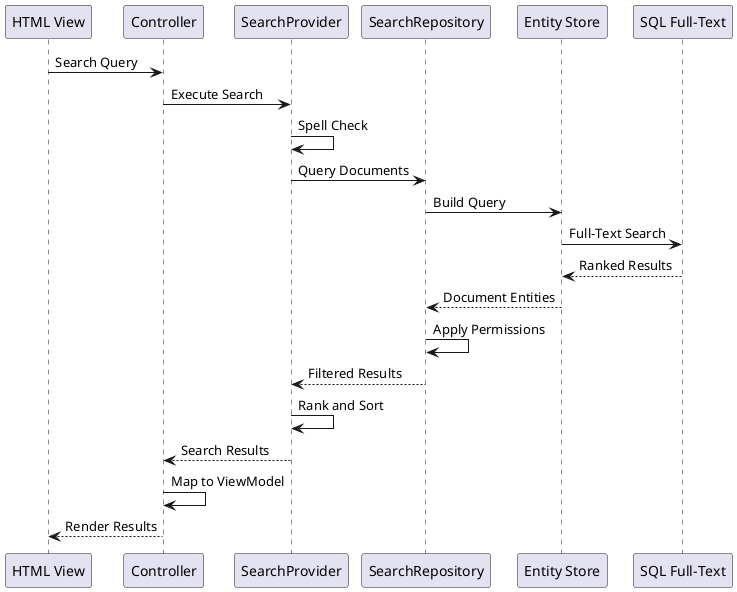

# Site Library Layered Architecture

This document describes the layered architecture of the OoBDev Site Library application.

## Architecture Overview

The Site Library follows a strict layered architecture pattern to ensure separation of concerns, maintainability, and testability.

```plantuml
@startuml
title OoBDev Site Library - Layered Architecture

skinparam componentStyle rectangle
skinparam packageStyle rectangle

!define LAYER_BG #E3F2FD
!define SUBLAYER_BG #BBDEFB

package "Presentation" as Presentation #LAYER_BG {
  component "HTML" as HTML #SUBLAYER_BG
  component "RSS/Atom" as RSSAtom #SUBLAYER_BG
}

package "Services" as Services #LAYER_BG {
  component "Controller" as Controller #SUBLAYER_BG
  component "Provider" as Provider #SUBLAYER_BG
  component "Repository" as Repository #SUBLAYER_BG
}

package "Models" as Models #LAYER_BG {
  component "Models" as ModelsComp
}

package "Data Access" as DataAccess #LAYER_BG {
  component "Entity Store" as EntityStore #SUBLAYER_BG
}

package "Data Storage" as DataStorage #LAYER_BG {
  package "SQL" as SQL #SUBLAYER_BG {
    component "File Stream" as FileStream
    component "Full-Text Index" as FullTextIndex
  }
}

package "Entities" as Entities #LAYER_BG {
  component "Entities" as EntitiesComp
}

' Dependencies - Presentation
HTML --> Controller
RSSAtom --> Controller

' Dependencies - Services
Controller --> Provider
Controller --> Repository
Provider --> Repository
Repository --> EntityStore
Repository --> EntitiesComp

' Dependencies - Models
Services --> ModelsComp

' Dependencies - Data Access
EntityStore --> SQL
EntityStore --> EntitiesComp

' Notes
note right of Presentation
  Presentation layer with
  HTML views and RSS/Atom
  feed generation
end note

note right of Services
  Service layer with MVC
  Controllers, Business Logic
  Providers, and Data Repositories
end note

note right of Models
  Domain models and
  view models (DTOs)
end note

note right of EntityStore
  Entity Framework
  data context
end note

note right of FileStream
  Large document storage
  using SQL FileStream
end note

note right of FullTextIndex
  Full-text search indexing
  for document content
end note

note right of Entities
  Shared entity definitions
  used across layers
end note

@enduml
```

### ASCII Diagram

```
┌──────────────────────────────────────────────────────────────────────────────┐
│                 OoBDev Site Library - Layered Architecture                   │
└──────────────────────────────────────────────────────────────────────────────┘

┌──────────────────────────────────────────────────────────────────────────────┐
│  Layer 1: Presentation                                                       │
│  ┌────────────────────────────────┐  ┌──────────────────────────────────┐    │
│  │  HTML Views                    │  │  RSS/Atom Feeds                  │    │
│  │  - Document list/detail        │  │  - Search results feed           │    │
│  │  - Search interface            │  │  - Folder contents feed          │    │
│  │  - Tree navigation             │  │  - Recent updates feed           │    │
│  └────────────────────────────────┘  └──────────────────────────────────┘    │
└────────────────────────────┬────────────────────┬──────────────────────────┘
                             │                    │
                             ↓                    ↓
┌──────────────────────────────────────────────────────────────────────────────┐
│  Layer 2: Services (3 sub-layers)                                            │
│                                                                               │
│  ┌─────────────────────────────────────────────────────────────────────────┐ │
│  │  2a. Controller                                                         │ │
│  │  - DocumentController  - SearchController  - LibraryController         │ │
│  └─────────────────────────────────────────────────────────────────────────┘ │
│                                       ↓                                       │
│  ┌─────────────────────────────────────────────────────────────────────────┐ │
│  │  2b. Provider (Business Logic)                                          │ │
│  │  - SearchProvider  - VersionProvider  - PermissionProvider              │ │
│  └─────────────────────────────────────────────────────────────────────────┘ │
│                                       ↓  ↑ (bidirectional)                   │
│  ┌─────────────────────────────────────────────────────────────────────────┐ │
│  │  2c. Repository (Data Access)                                           │ │
│  │  - DocumentRepository  - FolderRepository  - SearchRepository           │ │
│  └─────────────────────────────────────────────────────────────────────────┘ │
└────────────────────────────────┬──────────────┬───────────────────────────┘
                                 │              │
                                 ↓              ↓
┌────────────────────────────────┐  ┌──────────────────────────────────────┐
│  Layer 3: Models               │  │  Layer 6: Entities (Shared)          │
│  ┌──────────────────────────┐  │  │  ┌────────────────────────────────┐  │
│  │  View Models & DTOs      │  │  │  │  Entity Definitions            │  │
│  │  - DocumentViewModel     │  │  │  │  - Document                    │  │
│  │  - SearchResultViewModel │  │  │  │  - DocumentVersion             │  │
│  │  - FolderTreeViewModel   │  │  │  │  - Folder                      │  │
│  └──────────────────────────┘  │  │  │  - Permission                  │  │
└────────────────────────────────┘  │  └────────────────────────────────┘  │
                                    └─────────────┬────────────────────────┘
                                                  │
                                                  ↓
┌──────────────────────────────────────────────────────────────────────────────┐
│  Layer 4: Data Access                                                        │
│  ┌────────────────────────────────────────────────────────────────────────┐  │
│  │  Entity Store (Entity Framework Context)                              │  │
│  │  - SiteLibraryContext                                                  │  │
│  │  - Query composition & optimization                                    │  │
│  └────────────────────────────────────────────────────────────────────────┘  │
└────────────────────────────────────────┬─────────────────────────────────────┘
                                         │
                                         ↓
┌──────────────────────────────────────────────────────────────────────────────┐
│  Layer 5: Data Storage (SQL Server)                                          │
│  ┌────────────────────────────────────────────────────────────────────────┐  │
│  │  SQL Database                                                          │  │
│  │  ┌──────────────────────────────┐  ┌──────────────────────────────┐   │  │
│  │  │  FileStream Storage          │  │  Full-Text Search Index      │   │  │
│  │  │  - Large document files      │  │  - Document content indexing │   │  │
│  │  │  - Multi-GB file support     │  │  - Word breaking & stemming  │   │  │
│  │  │  - Streaming access          │  │  - Relevance ranking         │   │  │
│  │  └──────────────────────────────┘  └──────────────────────────────┘   │  │
│  └────────────────────────────────────────────────────────────────────────┘  │
└──────────────────────────────────────────────────────────────────────────────┘

Key Features:
  • Strict layered architecture with downward dependencies
  • Bidirectional: Provider ↔ Repository (for complex operations)
  • Entities layer shared across Repository, Entity Store, and Models
  • Specialized storage: FileStream for large files, Full-Text for search
  • RSS/Atom feeds provide alternate presentation format
```

## Layer Descriptions

### 1. Presentation Layer

**Purpose**: User interface and content delivery

**Components**:

#### HTML Sub-Layer
- **Responsibility**: Render web pages for browser-based access
- **Technology**: ASP.NET MVC Views (Razor)
- **Views**:
  - Document list views
  - Document detail/viewer
  - Search results
  - Tree navigation
  - Admin interfaces
- **Features**:
  - Responsive design
  - AJAX for dynamic updates
  - Client-side validation

#### RSS/Atom Sub-Layer
- **Responsibility**: Generate syndication feeds
- **Technology**: Custom RSS/Atom formatters
- **Feeds**:
  - Search query results as RSS
  - Folder contents as Atom
  - Recent updates feed
- **Standards Compliance**: RSS 2.0 and Atom 1.0

**Dependencies**: Controller sub-layer

**Constraints**:
- No direct access to data layers
- No business logic
- Read-only access to Models

### 2. Services Layer

**Purpose**: Business logic orchestration and data access coordination

**Components**:

#### Controller Sub-Layer
- **Responsibility**: Handle HTTP requests and route to appropriate services
- **Technology**: ASP.NET MVC Controllers
- **Controllers**:
  - DocumentController - Document CRUD operations
  - SearchController - Search functionality
  - LibraryController - Tree navigation
  - AdminController - Permission management
- **Features**:
  - Request validation
  - Response formatting
  - Error handling
  - Action filters for logging

**Dependencies**: Provider, Repository, Models

#### Provider Sub-Layer
- **Responsibility**: Business logic implementation
- **Providers**:
  - SearchProvider - Search logic and ranking
  - VersionProvider - Version management
  - PermissionProvider - Access control logic
  - ValidationProvider - Content validation
- **Features**:
  - Business rule enforcement
  - Workflow orchestration
  - Transaction coordination
- **Bidirectional**: Providers may call Repositories and vice versa for complex operations

**Dependencies**: Repository, Models

#### Repository Sub-Layer
- **Responsibility**: Data access abstraction
- **Repositories**:
  - DocumentRepository - Document CRUD
  - FolderRepository - Folder management
  - VersionRepository - Version tracking
  - PermissionRepository - Access control data
  - SearchRepository - Search query execution
- **Pattern**: Repository pattern with interface-based design
- **Features**:
  - Query composition
  - Data mapping
  - Change tracking

**Dependencies**: Entity Store, Entities, Models

**Constraints**:
- Must not contain business logic
- Should abstract database details

### 3. Models Layer

**Purpose**: Data transfer objects and view models

**Components**:
- **View Models**: UI-specific models
  - DocumentViewModel
  - SearchResultViewModel
  - FolderTreeViewModel
- **DTOs**: Data transfer between layers
  - DocumentDTO
  - VersionDTO
  - PermissionDTO
- **Request Models**: API request payloads
  - SearchRequest
  - UploadRequest
- **Response Models**: API response payloads
  - SearchResponse
  - ValidationResponse

**Dependencies**: None (pure data structures)

**Bidirectional**: Used by Services layer

**Constraints**:
- No business logic
- No persistence logic
- Serializable structures

### 4. Data Access Layer

**Purpose**: Database access and ORM configuration

**Components**:

#### Entity Store Sub-Layer
- **Responsibility**: Entity Framework DbContext and database operations
- **Technology**: Entity Framework 6.x or EF Core
- **Context Classes**:
  - SiteLibraryContext - Main database context
- **Features**:
  - Entity mapping configuration
  - Migration management
  - Connection management
  - Query optimization
- **Query Capabilities**:
  - LINQ query composition
  - Stored procedure calls
  - Full-text search integration

**Dependencies**: SQL Storage, Entities

**Constraints**:
- Configuration-driven mapping
- No business logic

### 5. Data Storage Layer

**Purpose**: Physical data storage and specialized storage features

**Components**:

#### SQL Sub-Layer
- **Responsibility**: SQL Server database
- **Technology**: Microsoft SQL Server (2012 or higher)
- **Database Objects**:
  - Tables for documents, versions, permissions, folders
  - Views for reporting
  - Stored procedures for complex operations
  - Triggers for audit logging

#### File Stream Sub-Layer
- **Responsibility**: Large file storage using SQL Server FileStream
- **Technology**: SQL Server FileStream
- **Purpose**: Efficient storage of large document files
- **Benefits**:
  - Large file support (multi-GB documents)
  - Streaming access
  - Integrated backup with database
  - Transactional consistency
- **File Types**: PDFs, Office documents, videos, images

#### Full-Text Index Sub-Layer
- **Responsibility**: Full-text search indexing
- **Technology**: SQL Server Full-Text Search
- **Indexed Content**:
  - Document titles
  - Document descriptions
  - Document file content (text extraction)
  - Previous versions (optional)
- **Features**:
  - Word breaking and stemming
  - Thesaurus support
  - Ranking by relevance
  - Phrase searching

**Dependencies**: None (foundational layer)

**Constraints**:
- Should not be accessed directly except by Entity Store

### 6. Entities Layer

**Purpose**: Shared entity definitions across layers

**Components**:
- **Entity Classes**:
  - Document
  - DocumentVersion
  - Folder
  - Permission
  - RoleAssignment
  - UserAssignment
- **Shared across**:
  - Repository layer
  - Entity Store
  - Models (mapping)

**Dependencies**: None (shared library)

**Design**:
- Plain Old CLR Objects (POCOs)
- Data annotations for validation
- Navigation properties for relationships

## Layer Communication Rules

### Dependency Direction
- **Downward Only**: Layers can only depend on layers below them
- **No Skipping**: Layers should not skip intermediate layers
- **Exception**: Entities layer is shared across multiple layers

### Communication Patterns

#### Request Flow (Top to Bottom)
1. **Presentation** receives user request
2. **Controller** routes to appropriate action
3. **Provider** applies business logic
4. **Repository** accesses data
5. **Entity Store** queries database
6. **SQL Storage** returns data

#### Response Flow (Bottom to Top)
1. **SQL Storage** returns query results
2. **Entity Store** maps to entities
3. **Repository** returns domain objects
4. **Provider** applies business rules
5. **Controller** maps to view models
6. **Presentation** renders to user

### Bidirectional Communication

The following layers have bidirectional dependencies for complex operations:

#### Services ↔ Models
- Services create and consume Models
- Models define contract for Services

#### Provider ↔ Repository
- Providers call Repositories for data
- Repositories may call Providers for business rules validation during complex queries
- Use Case: Permission evaluation during data filtering

#### Entity Store ↔ Entities
- Entity Store maps database to Entities
- Entities define schema for Entity Store

## Data Flow Examples

### Document Upload Flow



### Search Flow



## Architecture Validation

### Build-Time Checks
- **Namespace Rules**: Each layer has designated namespaces
- **Reference Validation**: Project references follow layer dependencies
- **Analyzer Rules**: Custom Roslyn analyzers enforce layer boundaries

### Runtime Checks
- **Dependency Injection**: Service layer uses DI to enforce abstractions
- **Interface Contracts**: All layer communication through interfaces

## Best Practices

### Layer Responsibilities
1. **Presentation**: User interaction only, no business logic
2. **Services**: Orchestration and business rules
3. **Models**: Pure data structures
4. **Data Access**: Database operations only
5. **Storage**: Data persistence

### Communication Guidelines
1. **Use Interfaces**: Define contracts between layers
2. **Map Data**: Convert between entity types at layer boundaries
3. **Handle Errors**: Each layer handles appropriate errors
4. **Log Appropriately**: Each layer logs at appropriate level

### Performance Optimization
1. **Caching**: Implement at Controller/Provider level
2. **Lazy Loading**: Use carefully to avoid N+1 queries
3. **Batch Operations**: Optimize at Repository level
4. **Indexing**: Ensure proper database indexes

## Related Documentation

- [Site Library Use Cases](./use-cases.md) - Functional use cases
- [Site Library Overview](./README.md) - Module overview
- [Gateway Layering](../gateway/layering.md) - Gateway architecture layers
