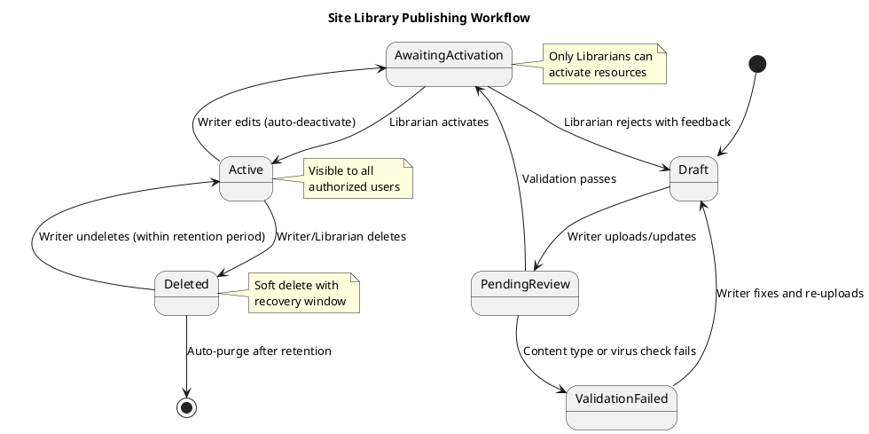

# Site Library Use Cases

This document describes the primary use cases for the OoBDev Site Library module.

## Site Library Use Cases Overview

The Site Library provides document management with role-based publishing workflow.

```plantuml
@startuml Site Library Use Cases
title OoBDev Site Library - Document Management

' Actors
actor "User" as User
actor "Writer" as Writer
actor "Librarian" as Librarian
actor "System" as System <<system>>

' Core Use Cases
usecase "A user of sitelibrary should\nbe able to view files" as UC_ViewFiles
usecase "A user of site library should\nbe able to search for content" as UC_SearchContent
usecase "Search by Content" as UC_SearchByContent
usecase "Search by Title" as UC_SearchByTitle
usecase "Search by Description" as UC_SearchByDescription
usecase "Search previous versions" as UC_SearchPreviousVersions

' Writer Use Cases
usecase "Site Library Writers should be\nable to update descriptions" as UC_UpdateDescription
usecase "Site Library writers should be\nable to update content of resources" as UC_UpdateContent
usecase "Resources should be deactivated\nif updated by a writer and not\na publisher" as UC_DeactivateOnEdit
usecase "Site Library Writers should be\nable to move content to folders\nthey have access to" as UC_MoveContent
usecase "Deleted Resources should be\nmoved to a undelete area" as UC_SoftDelete
usecase "Writers should be able to\nundelete resources" as UC_Undelete

' Librarian Use Cases
usecase "A site library publisher should\nbe able to activate resources" as UC_ActivateResources
usecase "Site Library Librarian should be\nable to manage role assignments\nfor resources" as UC_ManageRoleAssignments
usecase "Site Library librarian should be\nable to manage user assignments\nfor resources" as UC_ManageUserAssignments

' System Use Cases
usecase "Content should be checked for\ncorrect content type" as UC_ValidateContentType
usecase "Content should be checked to\nensure virus free" as UC_VirusScan
usecase "Store Search Query and Spelling\nCorrected Search Query" as UC_StoreQuery
usecase "Provide Spelling Corrected\nSearch Queries" as UC_SpellingCorrection
usecase "Permissions should be returned\nbased on current user" as UC_EvaluatePermissions

' Version Management
usecase "Site Library users should be\nable to list versions of\ndocument contents" as UC_ListVersions
usecase "Site Library users should be\nable to see a tree view of\nthe resources" as UC_TreeView

' RSS/Atom
usecase "Site Library Queries should be\navailable as RSS & Atom" as UC_RSSQueries
usecase "Site Library Resource lists should\nbe available as RSS & Atom" as UC_RSSResourceLists

' Actor Generalizations
Writer --|> User
Librarian --|> Writer

' User Associations
User --> UC_ViewFiles
User --> UC_SearchContent
User --> UC_ListVersions
User --> UC_TreeView
User --> UC_RSSQueries
User --> UC_RSSResourceLists

' Writer Associations
Writer --> UC_UpdateDescription
Writer --> UC_UpdateContent
Writer --> UC_MoveContent
Writer --> UC_SoftDelete
Writer --> UC_Undelete

' Librarian Associations
Librarian --> UC_ActivateResources
Librarian --> UC_ManageRoleAssignments
Librarian --> UC_ManageUserAssignments

' System Associations
System --> UC_ValidateContentType
System --> UC_VirusScan
System --> UC_StoreQuery
System --> UC_SpellingCorrection

' Search Includes
UC_SearchContent --> UC_SearchByContent : <<include>>
UC_SearchContent --> UC_SearchByTitle : <<include>>
UC_SearchContent --> UC_SearchByDescription : <<include>>
UC_SearchContent --> UC_SearchPreviousVersions : <<include>>

' System Extensions
UC_ValidateContentType ..> UC_UpdateContent : <<extend>>
UC_VirusScan ..> UC_UpdateContent : <<extend>>
UC_StoreQuery ..> UC_SearchContent : <<extend>>
UC_SpellingCorrection ..> UC_SearchContent : <<extend>>

' Writer Dependencies
UC_DeactivateOnEdit ..> Writer : <<depends>>
UC_DeactivateOnEdit --> UC_UpdateContent : <<include>>
UC_Undelete ..> UC_SoftDelete : <<depends>>

' Librarian Dependencies
UC_EvaluatePermissions ..> UC_ManageUserAssignments : <<depends>>
UC_EvaluatePermissions ..> UC_ManageRoleAssignments : <<depends>>
User --> UC_EvaluatePermissions

' Notes
note right of UC_ListVersions
  Version UI support may
  not make this release
end note

note bottom of UC_SoftDelete
  Deleted resources moved
  to undelete area for
  recovery
end note

note bottom of UC_ActivateResources
  Completed Feature
end note

@enduml
```

## User Use Cases

Users have read-only access to view and search documents.

### View Files (UC_ViewFiles)
- **Actor**: User
- **Description**: Access and view active documents in the library
- **Supported Formats**:
  - PDF documents
  - Microsoft Office (Word, Excel, PowerPoint)
  - Images (JPEG, PNG, GIF)
  - Videos (MP4, WebM)
  - Text files
- **Viewing Options**:
  - In-browser preview
  - Download original
  - Print
- **Permissions**: Only documents user has access to

### Search for Content (UC_SearchContent)
- **Actor**: User
- **Description**: Locate documents using keyword search
- **Includes**:
  - Search by Content
  - Search by Title
  - Search by Description
  - Search Previous Versions (optional)
- **Features**:
  - Relevance ranking
  - Highlighting of search terms
  - Faceted search filters
  - Sort by date, relevance, title
- **Extensions**:
  - Spelling correction suggestions
  - Query storage for analytics

#### Search by Title (UC_SearchByTitle)
- **Included by**: Search Content
- **Description**: Search within document titles
- **Matching**: Partial and full word matching
- **Examples**:
  - "protocol" matches "Study Protocol v2.0"
  - "informed" matches "Informed Consent Form"

#### Search by Description (UC_SearchByDescription)
- **Included by**: Search Content
- **Description**: Search within document descriptions/abstracts
- **Purpose**: Find documents by metadata and summaries
- **Use Case**: When title alone is insufficient

#### Search by Content (UC_SearchByContent)
- **Included by**: Search Content
- **Description**: Full-text search within document body
- **Technology**: SQL Server Full-Text Index
- **Supported Formats**: PDF text, Office documents, plain text
- **Performance**: Indexed for fast searching

#### Search Previous Versions (UC_SearchPreviousVersions)
- **Included by**: Search Content
- **Description**: Include historical document versions in search
- **Use Case**: Find information that may have been removed in current version
- **Option**: User can enable/disable in search interface
- **Note**: May impact search performance

### List Versions of Document Contents (UC_ListVersions)
- **Actor**: User
- **Description**: View version history for a document
- **Information Displayed**:
  - Version number
  - Date uploaded
  - Uploaded by user
  - File size
  - Change description (if provided)
- **Actions Available**:
  - View specific version
  - Download specific version
  - Compare versions (future enhancement)
- **Note**: Version UI support may not make initial release

### See Tree View of Resources (UC_TreeView)
- **Actor**: User
- **Description**: Navigate documents in hierarchical folder structure
- **Features**:
  - Expandable/collapsible folders
  - Visual hierarchy
  - Breadcrumb navigation
  - Folder size/count indicators
- **Navigation**:
  - Click to expand folders
  - Click document to view
  - Drag-and-drop (if Writer)

### RSS & Atom Feeds

#### Site Library Queries Available as RSS & Atom (UC_RSSQueries)
- **Actor**: User
- **Description**: Subscribe to search results as RSS or Atom feed
- **Use Cases**:
  - Stay updated on specific topics
  - Monitor new documents matching criteria
  - Integrate with feed readers
- **Example**: "protocol" search as RSS feed shows new protocol documents

#### Site Library Resource Lists Available as RSS & Atom (UC_RSSResourceLists)
- **Actor**: User
- **Description**: Subscribe to folder contents as feed
- **Use Cases**:
  - Monitor folder for new documents
  - Track updates to specific document sets
  - Automated downstream processing
- **Example**: "Training Materials" folder as Atom feed

## Writer Use Cases

Writers can create and update document content.

### Update Descriptions (UC_UpdateDescription)
- **Actor**: Writer
- **Description**: Edit document metadata and descriptions
- **Editable Fields**:
  - Title
  - Description/Abstract
  - Keywords/Tags
  - Category
  - Related documents
- **Workflow**:
  1. Writer selects document
  2. Edits description fields
  3. Saves changes
  4. New version created
  5. Resource deactivated (requires Librarian approval)
- **Versioning**: Description changes create new version

### Update Content of Resources (UC_UpdateContent)
- **Actor**: Writer
- **Description**: Upload new version of document file
- **Workflow**:
  1. Writer selects document
  2. Uploads new file
  3. System validates content type
  4. System performs virus scan
  5. New version created
  6. Resource deactivated
- **Extensions**:
  - Content type validation
  - Virus scanning
- **Post-Condition**: Resource requires Librarian activation

### Resources Deactivated if Updated by Writer (UC_DeactivateOnEdit)
- **Depends on**: Writer role
- **Includes**: Update Content
- **Description**: Automatic deactivation upon Writer edits
- **Rationale**: Ensures Librarian review before publication
- **Business Rule**: Only Librarians can activate resources
- **Exception**: Librarians can edit without deactivation

### Move Content to Folders (UC_MoveContent)
- **Actor**: Writer
- **Description**: Reorganize documents into different folders
- **Permissions**: Can only move to folders Writer has access to
- **Workflow**:
  1. Writer selects document(s)
  2. Chooses destination folder
  3. System checks folder permissions
  4. Document(s) moved
  5. Audit trail updated
- **Validation**: Cannot move to restricted folders

### Soft Delete Resources (UC_SoftDelete)
- **Actor**: Writer
- **Description**: Delete resources with recovery capability
- **Process**:
  1. Writer selects document for deletion
  2. Document moved to "undelete area"
  3. Document no longer visible to users
  4. Document retained for potential recovery
- **Retention**: Configurable retention period in undelete area
- **Automatic Purge**: After retention period, permanent deletion

### Undelete Resources (UC_Undelete)
- **Actor**: Writer
- **Dependencies**: Soft Delete
- **Description**: Recover deleted documents from undelete area
- **Workflow**:
  1. Writer accesses undelete area
  2. Views deleted documents
  3. Selects document(s) to recover
  4. Chooses restoration location
  5. Document restored to active library
- **Time Limit**: Must recover before automatic purge

## Librarian Use Cases

Librarians have full administrative control over the library.

### Activate Resources (UC_ActivateResources)
- **Actor**: Librarian
- **Description**: Approve and publish documents for user access
- **Workflow**:
  1. Librarian reviews pending resources
  2. Checks content quality and appropriateness
  3. Verifies metadata accuracy
  4. Activates resource
  5. Document becomes visible to authorized users
- **Status**: Completed feature

### Manage Role Assignments for Resources (UC_ManageRoleAssignments)
- **Actor**: Librarian
- **Description**: Configure which roles can access documents
- **Workflow**:
  1. Librarian selects document or folder
  2. Views current role assignments
  3. Adds or removes roles:
     - User (read-only)
     - Writer (edit)
     - Librarian (full control)
  4. Saves permission changes
- **Inheritance**: Folder permissions can inherit to contents
- **Override**: Document-level permissions can override folder

### Manage User Assignments for Resources (UC_ManageUserAssignments)
- **Actor**: Librarian
- **Description**: Grant specific users access to documents
- **Use Cases**:
  - Confidential documents for specific users
  - Trial-specific documents for trial team
  - Training materials for new users
- **Workflow**:
  1. Librarian selects document
  2. Views current user assignments
  3. Searches for users to add
  4. Adds or removes users
  5. Saves changes
- **Precedence**: User assignments override role assignments

## System Use Cases

Automated system processes for validation and analytics.

### Validate Content Type (UC_ValidateContentType)
- **Actor**: System
- **Extends**: Update Content
- **Description**: Verify uploaded file matches declared content type
- **Checks**:
  - File extension matches MIME type
  - File header/magic numbers validation
  - Actual content matches declared type
- **Errors**: Reject upload if mismatch detected
- **Security**: Prevent malicious file type spoofing

### Virus Scan (UC_VirusScan)
- **Actor**: System
- **Extends**: Update Content
- **Description**: Scan all uploads for malware
- **Process**:
  1. File upload received
  2. File sent to antivirus engine
  3. Scan results evaluated
  4. Clean files accepted
  5. Infected files rejected and quarantined
- **Antivirus**: Integration with enterprise antivirus solution
- **Quarantine**: Infected files logged and isolated
- **Notification**: Admins notified of infected upload attempts

### Store Search Query and Spelling Corrected Query (UC_StoreQuery)
- **Actor**: System
- **Extends**: Search Content
- **Dependencies**: Spelling Correction
- **Description**: Log search queries for analytics
- **Stored Information**:
  - Original query text
  - Spelling-corrected query text
  - User ID (if authenticated)
  - Timestamp
  - Results count
  - Session ID
- **Analytics Use**:
  - Popular search terms
  - Failed searches (zero results)
  - Spelling patterns
  - Search trends over time
- **Privacy**: Anonymized for reporting

### Provide Spelling Corrected Search Queries (UC_SpellingCorrection)
- **Actor**: System
- **Extends**: Search Content
- **Description**: Suggest spelling corrections for search queries
- **Technology**: Dictionary-based with Levenshtein distance
- **Display**:
  - "Did you mean: [corrected query]?"
  - Original query results shown
  - Corrected query as clickable suggestion
- **Learning**: Stores corrections for future improvements

### Evaluate Permissions Based on Current User (UC_EvaluatePermissions)
- **Actor**: User (evaluated by System)
- **Dependencies**:
  - Manage User Assignments
  - Manage Role Assignments
- **Description**: Determine user's access to each document
- **Evaluation Logic**:
  1. Check explicit user assignments
  2. Check role-based assignments
  3. Check folder inheritance
  4. Apply most permissive access
  5. Return permission level (None, Read, Write, Admin)
- **Caching**: Permissions cached per session for performance
- **Real-Time**: Recalculated on permission changes

## Publishing Workflow

The complete publishing workflow ensures quality control.

## Related Documentation

- [Site Library Architecture Overview](./README.md) - Module overview
- [Site Library Layering](./layering.md) - Application architecture layers
- [Gateway Architecture](../gateway/README.md) - User authentication and roles
