# Admin Module - Entity Relationship Diagram

## Overview

The Admin module provides system administration capabilities including user management, role assignment, trial configuration, and system settings. It extends the Gateway core with administrative operations.

## Database Schema

### Technology Stack
- **Database**: Microsoft SQL Server 2012+
- **ORM**: Entity Framework 6.x / EF Core
- **Integration**: Uses Gateway tables (AspNetUsers, AspNetRoles, Trials)
- **Compliance**: 21 CFR Part 11 (Audit Trail)

---

## Entity Relationship Diagram (PlantUML)

```plantuml
@startuml Admin ERD
!define Table(name,desc) class name as "desc" << (T,#FFECB3) >>
!define primary_key(x) <b>x</b>
!define foreign_key(x) <i>x</i>
!define unique(x) <u>x</u>

skinparam class {
  BackgroundColor<<(T,#FFECB3)>> #FFF8E1
  BorderColor<<(T,#FFECB3)>> #F57C00
  ArrowColor #696969
}

' User Management Extensions
class UserAdministration {
  primary_key(AdminActionId) : bigint
  --
  foreign_key(TargetUserId) : uniqueidentifier
  foreign_key(AdminUserId) : uniqueidentifier
  ActionType : nvarchar(100)
  ActionDetails : nvarchar(MAX)
  ActionDate : datetime
  IPAddress : nvarchar(50)
}

class PasswordResets {
  primary_key(ResetId) : int
  --
  foreign_key(UserId) : uniqueidentifier
  foreign_key(ResetBy) : uniqueidentifier
  ResetDate : datetime
  ResetReason : nvarchar(500)
  NotificationSent : bit
}

class EmailChanges {
  primary_key(ChangeId) : int
  --
  foreign_key(UserId) : uniqueidentifier
  OldEmail : nvarchar(256)
  NewEmail : nvarchar(256)
  foreign_key(ChangedBy) : uniqueidentifier
  ChangeDate : datetime
  ChangeReason : nvarchar(500)
}

' Bulk Operations
class BulkImports {
  primary_key(ImportId) : uniqueidentifier
  --
  ImportType : nvarchar(100)
  FileName : nvarchar(500)
  FileContent : varbinary(MAX)
  TotalRecords : int
  SuccessCount : int
  FailureCount : int
  foreign_key(ImportedBy) : uniqueidentifier
  ImportDate : datetime
  Status : nvarchar(50)
  ErrorLog : nvarchar(MAX)
}

class BulkImportErrors {
  primary_key(ErrorId) : int
  --
  foreign_key(ImportId) : uniqueidentifier
  RowNumber : int
  ErrorMessage : nvarchar(MAX)
  RecordData : nvarchar(MAX)
}

' Trial Configuration
class TrialConfiguration {
  primary_key(ConfigId) : int
  --
  foreign_key(TrialId) : uniqueidentifier
  ConfigKey : nvarchar(200)
  ConfigValue : nvarchar(MAX)
  ConfigType : nvarchar(50)
  Description : nvarchar(500)
  foreign_key(ModifiedBy) : uniqueidentifier
  ModifiedDate : datetime
}

' System Administration
class SystemSettings {
  primary_key(SettingId) : int
  --
  SettingCategory : nvarchar(100)
  SettingKey : nvarchar(200)
  SettingValue : nvarchar(MAX)
  DataType : nvarchar(50)
  IsEncrypted : bit
  Description : nvarchar(500)
  foreign_key(ModifiedBy) : uniqueidentifier
  ModifiedDate : datetime
}

class AuditLogRetention {
  primary_key(RetentionId) : int
  --
  LogType : nvarchar(100)
  RetentionPeriodDays : int
  ArchiveEnabled : bit
  ArchivePath : nvarchar(500)
  foreign_key(ModifiedBy) : uniqueidentifier
  ModifiedDate : datetime
}

' Relationships
UserAdministration --> AspNetUsers : targets
UserAdministration --> AspNetUsers : performed by
PasswordResets --> AspNetUsers : for user
PasswordResets --> AspNetUsers : reset by
EmailChanges --> AspNetUsers : for user
EmailChanges --> AspNetUsers : changed by
BulkImports "1" -- "0..*" BulkImportErrors : has errors
TrialConfiguration --> Trials : configures
SystemSettings --> AspNetUsers : modified by
AuditLogRetention --> AspNetUsers : modified by

@enduml
```



---

## Entity Relationship Diagram (ASCII)

```
┌────────────────────────────────────────────────────────────────────────────┐
│                    OoBDev Admin - Data Model                               │
└────────────────────────────────────────────────────────────────────────────┘

┏━━━━━━━━━━━━━━━━━━━━━━━━┓
┃   USER ADMINISTRATION  ┃
┗━━━━━━━━━━━━━━━━━━━━━━━━┛

┌─────────────────────────────────────────┐
│ UserAdministration (Admin Audit)       │
├─────────────────────────────────────────┤
│ PK AdminActionId (bigint)               │
│ FK TargetUserId (GUID)──────────────────┼──►AspNetUsers (subject)
│ FK AdminUserId (GUID)───────────────────┼──►AspNetUsers (admin)
│    ActionType                           │
│    ActionDetails (JSON)                 │
│    ActionDate                           │
│    IPAddress                            │
└─────────────────────────────────────────┘

Admin Actions:
  • CreateUser
  • UpdateUser
  • DeleteUser (soft delete)
  • AssignRole
  • RemoveRole
  • ResetPassword
  • UnlockAccount
  • ChangeEmail


┌─────────────────────────────────────────┐
│ PasswordResets (Admin-initiated)       │
├─────────────────────────────────────────┤
│ PK ResetId (int)                        │
│ FK UserId (GUID)────────────────────────┼──►AspNetUsers
│ FK ResetBy (GUID)───────────────────────┼──►AspNetUsers (admin)
│    ResetDate                            │
│    ResetReason                          │
│    NotificationSent (bit)               │
└─────────────────────────────────────────┘


┌─────────────────────────────────────────┐
│ EmailChanges                            │
├─────────────────────────────────────────┤
│ PK ChangeId (int)                       │
│ FK UserId (GUID)────────────────────────┼──►AspNetUsers
│    OldEmail                             │
│    NewEmail                             │
│ FK ChangedBy (GUID)─────────────────────┼──►AspNetUsers (admin)
│    ChangeDate                           │
│    ChangeReason                         │
└─────────────────────────────────────────┘


┏━━━━━━━━━━━━━━━━━━━━━━━━┓
┃   BULK OPERATIONS      ┃
┗━━━━━━━━━━━━━━━━━━━━━━━━┛

┌─────────────────────────────────────────┐
│ BulkImports                             │
├─────────────────────────────────────────┤
│ PK ImportId (GUID)                      │
│    ImportType (Users/Subjects/Sites)    │
│    FileName (CSV/Excel)                 │
│    FileContent (varbinary)              │
│    TotalRecords                         │
│    SuccessCount                         │
│    FailureCount                         │
│ FK ImportedBy (GUID)────────────────────┼──►AspNetUsers
│    ImportDate                           │
│    Status (Processing/Complete/Failed)  │
│    ErrorLog                             │
└────────────┬────────────────────────────┘
             │
             │ has errors
             ▼
┌─────────────────────────────────────────┐
│ BulkImportErrors                        │
├─────────────────────────────────────────┤
│ PK ErrorId (int)                        │
│ FK ImportId (GUID)                      │
│    RowNumber                            │
│    ErrorMessage                         │
│    RecordData (failed row data)         │
└─────────────────────────────────────────┘

Bulk Import Process:
  1. Upload CSV/Excel file
  2. Validate all rows
  3. Import valid rows
  4. Log errors for invalid rows
  5. Generate summary report


┏━━━━━━━━━━━━━━━━━━━━━━━━┓
┃   TRIAL CONFIGURATION  ┃
┗━━━━━━━━━━━━━━━━━━━━━━━━┛

┌─────────────────────────────────────────┐
│ TrialConfiguration                      │
├─────────────────────────────────────────┤
│ PK ConfigId (int)                       │
│ FK TrialId (GUID)───────────────────────┼──►Trials
│    ConfigKey                            │
│    ConfigValue (JSON/XML/Text)          │
│    ConfigType                           │
│    Description                          │
│ FK ModifiedBy (GUID)────────────────────┼──►AspNetUsers
│    ModifiedDate                         │
└─────────────────────────────────────────┘

Trial Configuration Examples:
  • Trial.Settings.Name = "ACME-001 Diabetes Study"
  • Trial.Settings.Description = "Phase III..."
  • Trial.Settings.Title = "Study Title"
  • Trial.Settings.Subtitle = "Subtitle"
  • Trial.Settings.LogoUrl = "/images/logo.png"
  • Trial.Settings.LinkUrl = "https://trial.example.com"
  • Trial.Features.SAE.Enabled = true
  • Trial.Features.CEC.Enabled = false
  • Trial.Features.MARS.Enabled = true


┏━━━━━━━━━━━━━━━━━━━━━━━━┓
┃   SYSTEM SETTINGS      ┃
┗━━━━━━━━━━━━━━━━━━━━━━━━┛

┌─────────────────────────────────────────┐
│ SystemSettings (Global)                 │
├─────────────────────────────────────────┤
│ PK SettingId (int)                      │
│    SettingCategory                      │
│    SettingKey                           │
│    SettingValue                         │
│    DataType (String/Int/Bool/JSON)      │
│    IsEncrypted (bit)                    │
│    Description                          │
│ FK ModifiedBy (GUID)────────────────────┼──►AspNetUsers
│    ModifiedDate                         │
└─────────────────────────────────────────┘

System Settings Examples:
  Category: Authentication
    • Auth.PasswordComplexity.MinLength = 8
    • Auth.PasswordComplexity.RequireUppercase = true
    • Auth.Lockout.FailedAttemptThreshold = 5
    • Auth.Lockout.LockoutDurationMinutes = 30

  Category: Email
    • Email.SmtpServer = "smtp.example.com"
    • Email.SmtpPort = 587
    • Email.SmtpUsername = "noreply@example.com"
    • Email.SmtpPassword = [encrypted]

  Category: Messaging
    • Messaging.SMS.Provider = "Twilio"
    • Messaging.SMS.AccountSid = [encrypted]
    • Messaging.SMS.AuthToken = [encrypted]

  Category: Compliance
    • Audit.RetentionPeriodYears = 7
    • Audit.EnableDetailedLogging = true


┌─────────────────────────────────────────┐
│ AuditLogRetention                       │
├─────────────────────────────────────────┤
│ PK RetentionId (int)                    │
│    LogType (Login/Audit/Exception)      │
│    RetentionPeriodDays                  │
│    ArchiveEnabled (bit)                 │
│    ArchivePath                          │
│ FK ModifiedBy (GUID)                    │
│    ModifiedDate                         │
└─────────────────────────────────────────┘

Retention Policies:
  • LoginHistory: 365 days (1 year)
  • AuditLog: 2555 days (7 years - regulatory)
  • ExceptionLog: 90 days
  • MessageActivity: 730 days (2 years)


Integration with Gateway Tables:
  ┌─────────────────┐
  │  AspNetUsers    │◄───── Admin manages users
  └─────────────────┘
  ┌─────────────────┐
  │  AspNetRoles    │◄───── Admin assigns roles
  └─────────────────┘
  ┌─────────────────┐
  │  Trials         │◄───── Admin configures trials
  └─────────────────┘
  ┌─────────────────┐
  │  AuditLog       │◄───── All admin actions audited
  └─────────────────┘
```

---

## Admin Operations Workflow

### User Management
```
1. List Users → View user directory
2. Create User → Manual account creation
3. Assign Roles → Grant permissions
4. Reset Password → Admin-initiated password reset
5. Unlock Account → Remove lockout
6. Change Email → Update email address
7. Bulk Import → CSV/Excel user import
```

### Trial Management
```
1. Configure Trial → Set trial metadata
2. Assign Users to Trial → Grant trial access
3. Configure Trial Roles → Define permissions
4. Enable/Disable Features → Toggle SAE/CEC/MARS modules
```

### System Administration
```
1. System Settings → Configure global settings
2. Audit Log Review → Compliance monitoring
3. Retention Policies → Data retention configuration
4. Integration Configuration → External service setup
```

---

## Business Rules

### User Administration
1. Only users with "Administrator" role can access Admin module
2. Admins cannot delete users (soft delete only: IsApproved = false)
3. All admin actions logged to AuditLog table
4. Password resets generate notification email
5. Email changes require verification

### Bulk Import
1. Maximum 10,000 records per import
2. File size limit: 5 MB
3. Supported formats: CSV, Excel (.xlsx)
4. Required columns validated before import
5. Duplicate check by username/email
6. Failed rows logged with specific error messages
7. Partial success allowed (valid rows imported)

### Trial Configuration
1. Trial must exist before configuration
2. Configuration keys are predefined (schema validation)
3. Changes require admin role
4. All changes audited

### System Settings
1. Encrypted settings (passwords, keys) use AES-256
2. Settings cached for performance (5-minute refresh)
3. Changes require system restart for some settings
4. Critical settings (auth, security) require dual approval

---

## Security Considerations

### Access Control
- Admin module requires "Administrator" role
- Trial configuration requires "TrialAdministrator" role per trial
- Audit logs are read-only (no delete permission)

### Encryption
- System settings with IsEncrypted=true use column-level encryption
- Passwords in SystemSettings table always encrypted
- Bulk import files deleted after processing (GDPR)

### Audit Trail
- All admin actions logged to AuditLog
- IP address captured
- Before/after values stored for changes
- Permanent retention (21 CFR Part 11)

---

*Admin ERD Version: 1.0*
*Last Updated: January 2026*
*Integration: Extends Gateway core with administrative operations*
