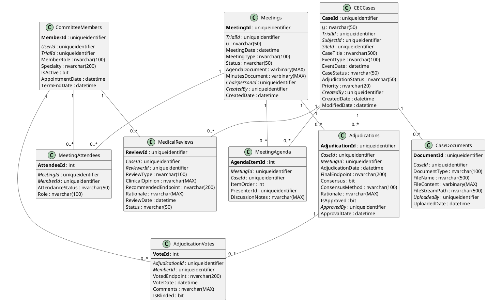

# CEC (Clinical Event Committee) - Entity Relationship Diagram

## Overview

The CEC module manages clinical event adjudication through committee meetings, independent medical review, and voting workflows. This ensures objective, independent evaluation of clinical endpoints in trials.

## Database Schema

### Technology Stack
- **Database**: Microsoft SQL Server 2012+
- **ORM**: Entity Framework 6.x / EF Core
- **File Storage**: SQL Server FileStream for case documents
- **Compliance**: GCP ICH E6, 21 CFR Part 11

---

## Entity Relationship Diagram (PlantUML)



---

## Entity Relationship Diagram (ASCII)

```
┌────────────────────────────────────────────────────────────────────────────┐
│                    OoBDev CEC - Data Model                                 │
└────────────────────────────────────────────────────────────────────────────┘

┏━━━━━━━━━━━━━━━━━━━━━━━━┓
┃   EVENT CASES          ┃
┗━━━━━━━━━━━━━━━━━━━━━━━━┛

┌─────────────────────────────────────────┐
│ CECCases                                │
├─────────────────────────────────────────┤
│ PK CaseId (GUID)                        │
│ UK CaseNumber                           │
│ FK TrialId (GUID)───────────────────────┼──►Trials
│ FK SubjectId (GUID)─────────────────────┼──►Subjects
│ FK SiteId (GUID)────────────────────────┼──►Sites
│    CaseTitle                            │
│    EventType                            │
│    EventDate                            │
│    CaseStatus                           │
│    AdjudicationStatus                   │
│    Priority                             │
│ FK CreatedBy (GUID)─────────────────────┼──►AspNetUsers
│    CreatedDate                          │
└────────────┬────────────────┬───────────┘
             │                │
             │                │
┌────────────▼───────────┐  ┌─▼────────────────────────────┐
│ MedicalReviews         │  │ CaseDocuments                │
├────────────────────────┤  ├──────────────────────────────┤
│ PK ReviewId (GUID)     │  │ PK DocumentId (GUID)         │
│ FK CaseId              │  │ FK CaseId                    │
│ FK ReviewerId──────────┼──┼─►CommitteeMembers            │
│    ReviewType          │  │    DocumentType              │
│    ClinicalOpinion     │  │    FileName                  │
│    RecommendedEndpoint │  │    FileContent (varbinary)   │
│    Rationale           │  │    FileStreamPath            │
│    ReviewDate          │  │ FK UploadedBy (GUID)         │
│    Status              │  │    UploadedDate              │
└────────────────────────┘  └──────────────────────────────┘


┏━━━━━━━━━━━━━━━━━━━━━━━━┓
┃   COMMITTEE MEETINGS   ┃
┗━━━━━━━━━━━━━━━━━━━━━━━━┛

┌─────────────────────────────────────────┐
│ Meetings                                │
├─────────────────────────────────────────┤
│ PK MeetingId (GUID)                     │
│ FK TrialId (GUID)                       │
│ UK MeetingNumber                        │
│    MeetingDate                          │
│    MeetingType                          │
│    Status                               │
│    AgendaDocument (varbinary)           │
│    MinutesDocument (varbinary)          │
│ FK ChairpersonId (GUID)─────────────────┼──►CommitteeMembers
│ FK CreatedBy (GUID)                     │
│    CreatedDate                          │
└────────────┬────────────────┬───────────┘
             │                │
             │                │
┌────────────▼───────────┐  ┌─▼────────────────────────────┐
│ MeetingAttendees       │  │ MeetingAgenda                │
├────────────────────────┤  ├──────────────────────────────┤
│ PK AttendeeId (int)    │  │ PK AgendaItemId (int)        │
│ FK MeetingId           │  │ FK MeetingId                 │
│ FK MemberId────────────┼──┼─►CommitteeMembers            │
│    AttendanceStatus    │  │ FK CaseId (GUID)─────────────┼──►CECCases
│    Role                │  │    ItemOrder                 │
└────────────────────────┘  │ FK PresenterId (GUID)        │
                            │    DiscussionNotes           │
                            └──────────────────────────────┘


┏━━━━━━━━━━━━━━━━━━━━━━━━┓
┃   ADJUDICATION         ┃
┗━━━━━━━━━━━━━━━━━━━━━━━━┛

┌─────────────────────────────────────────┐
│ Adjudications                           │
├─────────────────────────────────────────┤
│ PK AdjudicationId (GUID)                │
│ FK CaseId (GUID)────────────────────────┼──►CECCases
│ FK MeetingId (GUID)─────────────────────┼──►Meetings
│    AdjudicationDate                     │
│    FinalEndpoint                        │
│    Consensus (bit)                      │
│    ConsensusMethod                      │
│    Rationale                            │
│    IsApproved                           │
│ FK ApprovedBy (GUID)────────────────────┼──►CommitteeMembers
│    ApprovalDate                         │
└────────────┬────────────────────────────┘
             │
             │
             ▼
┌─────────────────────────────────────────┐
│ AdjudicationVotes                       │
├─────────────────────────────────────────┤
│ PK VoteId (int)                         │
│ FK AdjudicationId (GUID)                │
│ FK MemberId (GUID)──────────────────────┼──►CommitteeMembers
│    VotedEndpoint                        │
│    VoteDate                             │
│    Comments                             │
│    IsBlinded                            │
└─────────────────────────────────────────┘

Consensus Methods:
  • Unanimous (all members agree)
  • Majority (>50% agreement)
  • Super-majority (≥66% agreement)
  • Weighted (chairperson breaks tie)


┏━━━━━━━━━━━━━━━━━━━━━━━━┓
┃   COMMITTEE MEMBERS    ┃
┗━━━━━━━━━━━━━━━━━━━━━━━━┛

┌─────────────────────────────────────────┐
│ CommitteeMembers                        │
├─────────────────────────────────────────┤
│ PK MemberId (GUID)                      │
│ FK UserId (GUID)────────────────────────┼──►AspNetUsers
│ FK TrialId (GUID)───────────────────────┼──►Trials
│    MemberRole                           │
│    Specialty                            │
│    IsActive                             │
│    AppointmentDate                      │
│    TermEndDate                          │
└─────────────────────────────────────────┘

Member Roles:
  • Chairperson
  • Voting Member
  • Non-Voting Consultant
  • Medical Expert
  • Statistician


Workflow:
  1. Case Created → Medical Review
  2. Medical Review → Schedule Meeting
  3. Meeting → Present Case → Vote
  4. Votes Tallied → Determine Consensus
  5. Consensus → Final Determination
  6. Final Determination → Approved → Closed
```

---

*CEC ERD Version: 1.0*
*Last Updated: January 2026*
*Compliance: GCP ICH E6, 21 CFR Part 11*
