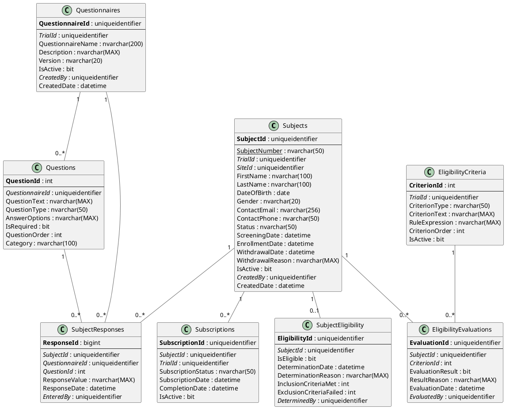

# CTS (Clinical Trial Screening) - Entity Relationship Diagram

## Overview

The CTS module manages subject screening, eligibility determination, and enrollment through configurable questionnaires and automated inclusion/exclusion criteria evaluation.

## Database Schema

### Technology Stack
- **Database**: Microsoft SQL Server 2012+
- **ORM**: Entity Framework 6.x / EF Core
- **Business Rules Engine**: Custom rules engine for eligibility criteria
- **Compliance**: GCP ICH E6, HIPAA (PHI protection)

---

## Entity Relationship Diagram (PlantUML)



---

## Entity Relationship Diagram (ASCII)

```
┌────────────────────────────────────────────────────────────────────────────┐
│                    OoBDev CTS - Data Model                                 │
└────────────────────────────────────────────────────────────────────────────┘

┏━━━━━━━━━━━━━━━━━━━━━━━━┓
┃   SUBJECTS             ┃
┗━━━━━━━━━━━━━━━━━━━━━━━━┛

┌─────────────────────────────────────────┐
│ Subjects                                │
├─────────────────────────────────────────┤
│ PK SubjectId (GUID)                     │
│ UK SubjectNumber                        │
│ FK TrialId (GUID)───────────────────────┼──►Trials
│ FK SiteId (GUID)────────────────────────┼──►Sites
│    FirstName [Encrypted]                │
│    LastName [Encrypted]                 │
│    DateOfBirth [Encrypted]              │
│    Gender                               │
│    ContactEmail [Encrypted]             │
│    ContactPhone [Encrypted]             │
│    Status (Screening/Enrolled/Withdrawn)│
│    ScreeningDate                        │
│    EnrollmentDate                       │
│    WithdrawalDate                       │
│    WithdrawalReason                     │
│    IsActive                             │
│ FK CreatedBy (GUID)                     │
│    CreatedDate                          │
└────────────┬────────────────┬───────────┘
             │                │
             │                │
┌────────────▼───────────┐  ┌─▼────────────────────────────┐
│ Subscriptions          │  │ SubjectEligibility           │
├────────────────────────┤  ├──────────────────────────────┤
│ PK SubscriptionId      │  │ PK EligibilityId (GUID)      │
│ FK SubjectId           │  │ FK SubjectId                 │
│ FK TrialId             │  │    IsEligible (bit)          │
│    SubscriptionStatus  │  │    DeterminationDate         │
│    SubscriptionDate    │  │    DeterminationReason       │
│    CompletionDate      │  │    InclusionCriteriaMet      │
│    IsActive            │  │    ExclusionCriteriaFailed   │
└────────────────────────┘  │ FK DeterminedBy (GUID)       │
                            └──────────────────────────────┘


┏━━━━━━━━━━━━━━━━━━━━━━━━┓
┃   QUESTIONNAIRES       ┃
┗━━━━━━━━━━━━━━━━━━━━━━━━┛

┌─────────────────────────────────────────┐
│ Questionnaires                          │
├─────────────────────────────────────────┤
│ PK QuestionnaireId (GUID)               │
│ FK TrialId (GUID)                       │
│    QuestionnaireName                    │
│    Description                          │
│    Version                              │
│    IsActive                             │
│ FK CreatedBy (GUID)                     │
│    CreatedDate                          │
└────────────┬────────────────────────────┘
             │
             │
             ▼
┌─────────────────────────────────────────┐
│ Questions                               │
├─────────────────────────────────────────┤
│ PK QuestionId (int)                     │
│ FK QuestionnaireId (GUID)               │
│    QuestionText                         │
│    QuestionType (Text/Numeric/Choice)   │
│    AnswerOptions (JSON)                 │
│    IsRequired                           │
│    QuestionOrder                        │
│    Category                             │
└────────────┬────────────────────────────┘
             │
             │
             ▼
┌─────────────────────────────────────────┐
│ SubjectResponses                        │
├─────────────────────────────────────────┤
│ PK ResponseId (bigint)                  │
│ FK SubjectId (GUID)─────────────────────┼──►Subjects
│ FK QuestionnaireId (GUID)               │
│ FK QuestionId (int)                     │
│    ResponseValue                        │
│    ResponseDate                         │
│ FK EnteredBy (GUID)                     │
└─────────────────────────────────────────┘


┏━━━━━━━━━━━━━━━━━━━━━━━━┓
┃   ELIGIBILITY          ┃
┗━━━━━━━━━━━━━━━━━━━━━━━━┛

┌─────────────────────────────────────────┐
│ EligibilityCriteria                     │
├─────────────────────────────────────────┤
│ PK CriterionId (int)                    │
│ FK TrialId (GUID)                       │
│    CriterionType (Inclusion/Exclusion)  │
│    CriterionText                        │
│    RuleExpression (business rule)       │
│    CriterionOrder                       │
│    IsActive                             │
└────────────┬────────────────────────────┘
             │
             │
             ▼
┌─────────────────────────────────────────┐
│ EligibilityEvaluations                  │
├─────────────────────────────────────────┤
│ PK EvaluationId (GUID)                  │
│ FK SubjectId (GUID)─────────────────────┼──►Subjects
│ FK CriterionId (int)                    │
│    EvaluationResult (Pass/Fail)         │
│    ResultReason                         │
│    EvaluationDate                       │
│ FK EvaluatedBy (GUID)                   │
└─────────────────────────────────────────┘


Example Eligibility Criteria:

Inclusion Criteria:
  IC-1: Age ≥ 18 years
    Rule: DateDiff(year, DateOfBirth, Today) >= 18

  IC-2: Diagnosed with Type 2 Diabetes
    Rule: Response("Q12") == "Yes"

Exclusion Criteria:
  EC-1: Pregnant or breastfeeding
    Rule: Response("Q25") == "Yes" OR Response("Q26") == "Yes"

  EC-2: HbA1c > 12%
    Rule: ToDecimal(Response("Q30")) > 12.0


Workflow:
  1. Subject Screening → Complete Questionnaire
  2. Questionnaire → Evaluate Eligibility Criteria
  3. All Inclusion MET + No Exclusion FAILED → Eligible
  4. Eligible → Enroll in Trial
  5. Not Eligible → Screen Failure (record reason)
```

---

*CTS ERD Version: 1.0*
*Last Updated: January 2026*
*Compliance: GCP ICH E6, HIPAA (PHI encryption)*
