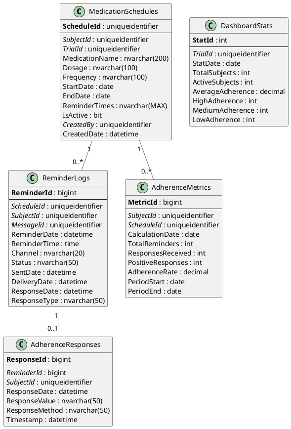

# MARS (Medication Adherence Reminder System) - Entity Relationship Diagram

## Overview

The MARS module manages medication adherence tracking through scheduled reminders, subject responses, and compliance analytics for clinical trials.

## Database Schema

### Technology Stack
- **Database**: Microsoft SQL Server 2012+
- **ORM**: Entity Framework 6.x / EF Core
- **Messaging Integration**: Integrates with Messaging module for reminders
- **Analytics**: SQL Server Reporting Services (SSRS)

---

## Entity Relationship Diagram (PlantUML)



---

## Entity Relationship Diagram (ASCII)

```
┌────────────────────────────────────────────────────────────────────────────┐
│                    OoBDev MARS - Data Model                                │
└────────────────────────────────────────────────────────────────────────────┘

┏━━━━━━━━━━━━━━━━━━━━━━━━┓
┃   MEDICATION SCHEDULES ┃
┗━━━━━━━━━━━━━━━━━━━━━━━━┛

┌─────────────────────────────────────────┐
│ MedicationSchedules                     │
├─────────────────────────────────────────┤
│ PK ScheduleId (GUID)                    │
│ FK SubjectId (GUID)─────────────────────┼──►Subjects (CTS)
│ FK TrialId (GUID)───────────────────────┼──►Trials
│    MedicationName                       │
│    Dosage                               │
│    Frequency (Daily/BID/TID/QID/Weekly) │
│    StartDate                            │
│    EndDate                              │
│    ReminderTimes (JSON) ["09:00","21:00"]
│    IsActive                             │
│ FK CreatedBy (GUID)                     │
│    CreatedDate                          │
└────────────┬────────────────────────────┘
             │
             │
             ▼
┌─────────────────────────────────────────┐
│ ReminderLogs                            │
├─────────────────────────────────────────┤
│ PK ReminderId (bigint)                  │
│ FK ScheduleId (GUID)                    │
│ FK SubjectId (GUID)                     │
│ FK MessageId (GUID)─────────────────────┼──►Messages (Messaging)
│    ReminderDate                         │
│    ReminderTime                         │
│    Channel (SMS/Email/App)              │
│    Status (Pending/Sent/Delivered)      │
│    SentDate                             │
│    DeliveryDate                         │
│    ResponseDate                         │
│    ResponseType (Taken/Missed/Skipped)  │
└────────────┬────────────────────────────┘
             │
             │
             ▼
┌─────────────────────────────────────────┐
│ AdherenceResponses                      │
├─────────────────────────────────────────┤
│ PK ResponseId (bigint)                  │
│ FK ReminderId (bigint)                  │
│ FK SubjectId (GUID)                     │
│    ResponseDate                         │
│    ResponseValue ("Taken"/"Missed")     │
│    ResponseMethod (SMS/Web/App)         │
│    Timestamp                            │
└─────────────────────────────────────────┘


┏━━━━━━━━━━━━━━━━━━━━━━━━┓
┃   ADHERENCE ANALYTICS  ┃
┗━━━━━━━━━━━━━━━━━━━━━━━━┛

┌─────────────────────────────────────────┐
│ AdherenceMetrics (Calculated Daily)    │
├─────────────────────────────────────────┤
│ PK MetricId (bigint)                    │
│ FK SubjectId (GUID)                     │
│ FK ScheduleId (GUID)                    │
│    CalculationDate                      │
│    TotalReminders                       │
│    ResponsesReceived                    │
│    PositiveResponses ("Taken" count)    │
│    AdherenceRate (decimal 0.00-1.00)    │
│    PeriodStart                          │
│    PeriodEnd                            │
└─────────────────────────────────────────┘

Adherence Rate Calculation:
  AdherenceRate = PositiveResponses / TotalReminders

  Example: 27 "Taken" / 30 Reminders = 0.90 (90% adherent)


┌─────────────────────────────────────────┐
│ DashboardStats (Trial-Level Aggregates)│
├─────────────────────────────────────────┤
│ PK StatId (int)                         │
│ FK TrialId (GUID)                       │
│    StatDate                             │
│    TotalSubjects                        │
│    ActiveSubjects                       │
│    AverageAdherence (mean rate)         │
│    HighAdherence (≥80%)                 │
│    MediumAdherence (50-79%)             │
│    LowAdherence (<50%)                  │
└─────────────────────────────────────────┘


Adherence Categories:
  • High: ≥ 80% adherence rate
  • Medium: 50-79% adherence rate
  • Low: < 50% adherence rate


Example Reminder Flow:
  1. Schedule: "Metformin 500mg, BID" (09:00, 21:00)
  2. System generates daily reminders at 09:00 and 21:00
  3. Reminder sent via SMS: "Have you taken your Metformin? Reply YES or NO"
  4. Subject replies: "YES"
  5. Response logged as "Taken"
  6. Metrics updated: 1 positive response added to daily total
```

---

*MARS ERD Version: 1.0*
*Last Updated: January 2026*
*Integration: Messaging module for reminder delivery*
