# Messaging System - Entity Relationship Diagram

## Overview

The OoBDev Messaging System provides multi-channel communication (Email, SMS) with guaranteed delivery through a sophisticated 3-queue architecture (Gateway Queue, Global Queue, Trial Queue). The system supports scheduled messages, stop lists, auto-reply processing, and activity tracking.

## Database Schema

### Technology Stack
- **Database**: Microsoft SQL Server 2012+
- **Message Queue**: Service Broker / Azure Service Bus / MSMQ
- **ORM**: Entity Framework 6.x / EF Core
- **External Services**: SMTP, SendGrid, Twilio, Azure Communication Services

---

## Entity Relationship Diagram (PlantUML)

```plantuml
@startuml Messaging ERD
!define Table(name,desc) class name as "desc" << (T,#E0F7FA) >>
!define primary_key(x) <b>x</b>
!define foreign_key(x) <i>x</i>
!define unique(x) <u>x</u>

skinparam class {
  BackgroundColor<<(T,#E0F7FA)>> #E1F5FE
  BorderColor<<(T,#E0F7FA)>> #006064
  ArrowColor #696969
}

' ============================================================
' MESSAGE CORE
' ============================================================

class Messages {
  primary_key(MessageId) : uniqueidentifier
  --
  foreign_key(TrialId) : uniqueidentifier
  MessageType : nvarchar(50)
  Channel : nvarchar(20)
  RecipientType : nvarchar(50)
  foreign_key(RecipientUserId) : uniqueidentifier
  RecipientEmail : nvarchar(256)
  RecipientPhone : nvarchar(50)
  SenderEmail : nvarchar(256)
  SenderName : nvarchar(200)
  Subject : nvarchar(500)
  MessageBody : nvarchar(MAX)
  MessageBodyHtml : nvarchar(MAX)
  Priority : nvarchar(20)
  Status : nvarchar(50)
  ScheduledSendDate : datetime
  ActualSendDate : datetime
  DeliveryDate : datetime
  ReadDate : datetime
  ClickDate : datetime
  IsScheduled : bit
  IsDelivered : bit
  IsRead : bit
  IsClicked : bit
  IsBounced : bit
  IsOptedOut : bit
  BounceReason : nvarchar(500)
  ErrorMessage : nvarchar(MAX)
  RetryCount : int
  MaxRetries : int
  foreign_key(CreatedBy) : uniqueidentifier
  CreatedDate : datetime
  ModifiedDate : datetime
}

class MessageStates {
  primary_key(StateId) : bigint
  --
  foreign_key(MessageId) : uniqueidentifier
  OldState : nvarchar(50)
  NewState : nvarchar(50)
  StateReason : nvarchar(500)
  foreign_key(ChangedBy) : uniqueidentifier
  ChangedDate : datetime
  IsAutomated : bit
}

class MessageTemplate {
  primary_key(TemplateId) : uniqueidentifier
  --
  foreign_key(TrialId) : uniqueidentifier
  TemplateName : nvarchar(200)
  TemplateType : nvarchar(100)
  Channel : nvarchar(20)
  Subject : nvarchar(500)
  BodyTemplate : nvarchar(MAX)
  BodyHtmlTemplate : nvarchar(MAX)
  Variables : nvarchar(MAX)
  IsActive : bit
  foreign_key(CreatedBy) : uniqueidentifier
  CreatedDate : datetime
  ModifiedDate : datetime
}

' ============================================================
' QUEUE ARCHITECTURE
' ============================================================

class GatewayQueue {
  primary_key(QueueItemId) : bigint
  --
  foreign_key(MessageId) : uniqueidentifier
  QueueName : nvarchar(100)
  QueuedDate : datetime
  ProcessedDate : datetime
  Status : nvarchar(50)
  Priority : int
  RetryCount : int
  ErrorMessage : nvarchar(MAX)
}

class GlobalQueue {
  primary_key(QueueItemId) : bigint
  --
  foreign_key(MessageId) : uniqueidentifier
  Channel : nvarchar(20)
  QueuedDate : datetime
  ProcessedDate : datetime
  Status : nvarchar(50)
  BatchId : uniqueidentifier
  RetryCount : int
}

class TrialQueue {
  primary_key(QueueItemId) : bigint
  --
  foreign_key(MessageId) : uniqueidentifier
  foreign_key(TrialId) : uniqueidentifier
  QueuedDate : datetime
  ProcessedDate : datetime
  Status : nvarchar(50)
  RoutingKey : nvarchar(200)
}

' ============================================================
' ROUTING & RULES
' ============================================================

class RoutingRules {
  primary_key(RuleId) : int
  --
  foreign_key(TrialId) : uniqueidentifier
  RuleName : nvarchar(200)
  MessageType : nvarchar(50)
  Channel : nvarchar(20)
  Condition : nvarchar(MAX)
  TargetQueue : nvarchar(100)
  Priority : int
  IsActive : bit
  CreatedDate : datetime
}

class ChannelConfig {
  primary_key(ConfigId) : int
  --
  foreign_key(TrialId) : uniqueidentifier
  Channel : nvarchar(20)
  ProviderName : nvarchar(100)
  ProviderConfig : nvarchar(MAX)
  IsActive : bit
  DailyLimit : int
  RateLimit : int
  ModifiedDate : datetime
}

' ============================================================
' SCHEDULED MESSAGES
' ============================================================

class ScheduledMessages {
  primary_key(ScheduleId) : uniqueidentifier
  --
  foreign_key(TrialId) : uniqueidentifier
  ScheduleName : nvarchar(200)
  ScheduleType : nvarchar(50)
  foreign_key(TemplateId) : uniqueidentifier
  RecurrenceRule : nvarchar(500)
  StartDate : datetime
  EndDate : datetime
  NextSendDate : datetime
  LastSendDate : datetime
  IsActive : bit
  foreign_key(CreatedBy) : uniqueidentifier
  CreatedDate : datetime
}

class ReminderSeries {
  primary_key(SeriesId) : uniqueidentifier
  --
  foreign_key(TrialId) : uniqueidentifier
  SeriesName : nvarchar(200)
  Description : nvarchar(MAX)
  ReminderCount : int
  IsActive : bit
  CreatedDate : datetime
}

class ReminderItems {
  primary_key(ItemId) : int
  --
  foreign_key(SeriesId) : uniqueidentifier
  ItemOrder : int
  foreign_key(TemplateId) : uniqueidentifier
  DaysOffset : int
  HoursOffset : int
  Channel : nvarchar(20)
}

' ============================================================
' STOP LIST & OPT-OUT
' ============================================================

class StopList {
  primary_key(StopListId) : int
  --
  Email : nvarchar(256)
  PhoneNumber : nvarchar(50)
  StopReason : nvarchar(500)
  StopType : nvarchar(50)
  foreign_key(TrialId) : uniqueidentifier
  AddedDate : datetime
  ExpirationDate : datetime
  IsGlobal : bit
}

class OptOutRequests {
  primary_key(RequestId) : uniqueidentifier
  --
  foreign_key(MessageId) : uniqueidentifier
  foreign_key(UserId) : uniqueidentifier
  Email : nvarchar(256)
  PhoneNumber : nvarchar(50)
  OptOutType : nvarchar(50)
  RequestDate : datetime
  ProcessedDate : datetime
  IsProcessed : bit
}

' ============================================================
' AUTO-REPLY & INBOUND
' ============================================================

class InboundMessages {
  primary_key(InboundId) : uniqueidentifier
  --
  Channel : nvarchar(20)
  FromAddress : nvarchar(256)
  ToAddress : nvarchar(256)
  Subject : nvarchar(500)
  MessageBody : nvarchar(MAX)
  ReceivedDate : datetime
  foreign_key(RelatedMessageId) : uniqueidentifier
  IsAutoReply : bit
  IsProcessed : bit
  ProcessedDate : datetime
}

class AutoReplyRules {
  primary_key(RuleId) : int
  --
  foreign_key(TrialId) : uniqueidentifier
  RuleName : nvarchar(200)
  TriggerPattern : nvarchar(500)
  ResponseAction : nvarchar(100)
  foreign_key(ResponseTemplateId) : uniqueidentifier
  IsActive : bit
  CreatedDate : datetime
}

' ============================================================
' ACTIVITY TRACKING
' ============================================================

class MessageActivity {
  primary_key(ActivityId) : bigint
  --
  foreign_key(MessageId) : uniqueidentifier
  ActivityType : nvarchar(50)
  ActivityDate : datetime
  IPAddress : nvarchar(50)
  UserAgent : nvarchar(500)
  Location : nvarchar(200)
  ClickedLink : nvarchar(MAX)
  OpenSource : nvarchar(100)
}

class LinkTracking {
  primary_key(LinkId) : uniqueidentifier
  --
  foreign_key(MessageId) : uniqueidentifier
  OriginalUrl : nvarchar(MAX)
  TrackedUrl : nvarchar(MAX)
  LinkText : nvarchar(500)
  ClickCount : int
  UniqueClickCount : int
  FirstClickDate : datetime
  LastClickDate : datetime
}

class MessageBounces {
  primary_key(BounceId) : int
  --
  foreign_key(MessageId) : uniqueidentifier
  BounceType : nvarchar(50)
  BounceDate : datetime
  BounceReason : nvarchar(MAX)
  DiagnosticCode : nvarchar(500)
  IsHardBounce : bit
}

' ============================================================
' BATCHING & CAMPAIGNS
' ============================================================

class MessageBatches {
  primary_key(BatchId) : uniqueidentifier
  --
  foreign_key(TrialId) : uniqueidentifier
  BatchName : nvarchar(200)
  BatchType : nvarchar(100)
  TotalCount : int
  SentCount : int
  DeliveredCount : int
  BouncedCount : int
  OpenedCount : int
  ClickedCount : int
  Status : nvarchar(50)
  foreign_key(CreatedBy) : uniqueidentifier
  CreatedDate : datetime
  CompletedDate : datetime
}

' ============================================================
' RELATIONSHIPS
' ============================================================

' Message Core
Messages "1" -- "0..*" MessageStates : has
Messages "0..*" -- "0..1" MessageTemplate : created from

' Queue Architecture
Messages "1" -- "0..1" GatewayQueue : queued in
Messages "1" -- "0..1" GlobalQueue : routed to
Messages "1" -- "0..1" TrialQueue : delivered via

' Routing
RoutingRules --> Messages : routes

' Scheduled
ScheduledMessages --> MessageTemplate : uses
ReminderSeries "1" -- "0..*" ReminderItems : contains
ReminderItems --> MessageTemplate : uses
ScheduledMessages --> Messages : generates

' Tracking
Messages "1" -- "0..*" MessageActivity : tracks
Messages "1" -- "0..*" LinkTracking : contains
Messages "1" -- "0..*" MessageBounces : may have

' Inbound
InboundMessages --> Messages : relates to
AutoReplyRules --> MessageTemplate : responds with

' Batching
MessageBatches "1" -- "0..*" Messages : contains

@enduml
```



---

## Entity Relationship Diagram (ASCII)

```
┌────────────────────────────────────────────────────────────────────────────┐
│                   OoBDev Messaging - Data Model                            │
└────────────────────────────────────────────────────────────────────────────┘

┏━━━━━━━━━━━━━━━━━━━━━━━━┓
┃   MESSAGE CORE         ┃
┗━━━━━━━━━━━━━━━━━━━━━━━━┛

┌─────────────────────────────────────────┐
│ Messages                                │
├─────────────────────────────────────────┤         ┌──────────────────────┐
│ PK MessageId (GUID)                     │         │ MessageTemplate      │
│ FK TrialId (GUID)───────────────────────┼──┐      ├──────────────────────┤
│    MessageType                          │  │      │ PK TemplateId        │
│    Channel (Email/SMS)                  │  │      │ FK TrialId           │
│    RecipientType                        │  │      │    TemplateName      │
│ FK RecipientUserId───────────────────────┼──┼─────►│    TemplateType      │
│    RecipientEmail                       │  │      │    Channel           │
│    RecipientPhone                       │  │      │    Subject           │
│    SenderEmail                          │  │      │    BodyTemplate      │
│    SenderName                           │  │      │    BodyHtmlTemplate  │
│    Subject                              │  │      │    Variables (JSON)  │
│    MessageBody                          │  │      │    IsActive          │
│    MessageBodyHtml                      │  │      └──────────────────────┘
│    Priority                             │  │
│    Status                               │  │
│    ScheduledSendDate                    │  │
│    ActualSendDate                       │  │
│    DeliveryDate                         │  │
│    ReadDate                             │  │
│    ClickDate                            │  │
│    IsScheduled                          │  │
│    IsDelivered                          │  │
│    IsRead                               │  │
│    IsClicked                            │  │
│    IsBounced                            │  │
│    IsOptedOut                           │  │
│    BounceReason                         │  │
│    ErrorMessage                         │  │
│    RetryCount                           │  │
│ FK CreatedBy (GUID)                     │  │
│    CreatedDate                          │  │
└────────┬────────────┬───────────────────┘  │
         │            │                       │
         │            │                       └──►Trials
         │            │
┌────────▼────────┐  ┌▼───────────────────────┐
│ MessageStates   │  │ MessageBatches         │
├─────────────────┤  ├────────────────────────┤
│ PK StateId      │  │ PK BatchId (GUID)      │
│ FK MessageId    │  │ FK TrialId             │
│    OldState     │  │    BatchName           │
│    NewState     │  │    BatchType           │
│    StateReason  │  │    TotalCount          │
│ FK ChangedBy    │  │    SentCount           │
│    ChangedDate  │  │    DeliveredCount      │
│    IsAutomated  │  │    BouncedCount        │
└─────────────────┘  │    OpenedCount         │
                     │    ClickedCount        │
                     │    Status              │
                     │ FK CreatedBy           │
                     └────────────────────────┘


┏━━━━━━━━━━━━━━━━━━━━━━━━━━━━━━━━━━━━━━━━━━━┓
┃   QUEUE ARCHITECTURE (3-Queue System)    ┃
┗━━━━━━━━━━━━━━━━━━━━━━━━━━━━━━━━━━━━━━━━━━━┛

                    ┌─────────────────┐
                    │   Messages      │
                    └────────┬────────┘
                             │
                             ▼
            ┌────────────────────────────────┐
            │  GatewayQueue (Entry Point)    │
            ├────────────────────────────────┤
            │ PK QueueItemId (bigint)        │
            │ FK MessageId (GUID)            │
            │    QueueName                   │
            │    QueuedDate                  │
            │    ProcessedDate               │
            │    Status                      │
            │    Priority                    │
            │    RetryCount                  │
            │    ErrorMessage                │
            └────────────────┬───────────────┘
                             │
                             ▼
            ┌────────────────────────────────┐
            │  GlobalQueue (Channel Routing) │
            ├────────────────────────────────┤
            │ PK QueueItemId (bigint)        │
            │ FK MessageId (GUID)            │
            │    Channel (Email/SMS)         │
            │    QueuedDate                  │
            │    ProcessedDate               │
            │    Status                      │
            │    BatchId                     │
            │    RetryCount                  │
            └────────────────┬───────────────┘
                             │
                             ▼
            ┌────────────────────────────────┐
            │  TrialQueue (Delivery)         │
            ├────────────────────────────────┤
            │ PK QueueItemId (bigint)        │
            │ FK MessageId (GUID)            │
            │ FK TrialId (GUID)              │
            │    QueuedDate                  │
            │    ProcessedDate               │
            │    Status                      │
            │    RoutingKey                  │
            └────────────────────────────────┘


┏━━━━━━━━━━━━━━━━━━━━━━━━┓
┃   ROUTING & CONFIG     ┃
┗━━━━━━━━━━━━━━━━━━━━━━━━┛

┌────────────────────────────────┐     ┌─────────────────────────────┐
│ RoutingRules                   │     │ ChannelConfig               │
├────────────────────────────────┤     ├─────────────────────────────┤
│ PK RuleId (int)                │     │ PK ConfigId (int)           │
│ FK TrialId (GUID)              │     │ FK TrialId (GUID)           │
│    RuleName                    │     │    Channel                  │
│    MessageType                 │     │    ProviderName             │
│    Channel                     │     │    ProviderConfig (JSON)    │
│    Condition (expression)      │     │    IsActive                 │
│    TargetQueue                 │     │    DailyLimit               │
│    Priority                    │     │    RateLimit                │
│    IsActive                    │     │    ModifiedDate             │
└────────────────────────────────┘     └─────────────────────────────┘

Routing Example:
  IF MessageType = 'SAE_Alert' AND Priority = 'High'
  THEN TargetQueue = 'TrialQueue_Urgent'


┏━━━━━━━━━━━━━━━━━━━━━━━━┓
┃   SCHEDULED MESSAGES   ┃
┗━━━━━━━━━━━━━━━━━━━━━━━━┛

┌────────────────────────────────┐     ┌─────────────────────────────┐
│ ScheduledMessages              │     │ ReminderSeries              │
├────────────────────────────────┤     ├─────────────────────────────┤
│ PK ScheduleId (GUID)           │     │ PK SeriesId (GUID)          │
│ FK TrialId (GUID)              │     │ FK TrialId (GUID)           │
│    ScheduleName                │     │    SeriesName               │
│    ScheduleType                │     │    Description              │
│ FK TemplateId───────────────────┼──┐  │    ReminderCount            │
│    RecurrenceRule (cron/rrule) │  │  │    IsActive                 │
│    StartDate                   │  │  └─────┬───────────────────────┘
│    EndDate                     │  │        │
│    NextSendDate                │  │        │
│    LastSendDate                │  │  ┌─────▼───────────────────────┐
│    IsActive                    │  │  │ ReminderItems               │
│ FK CreatedBy                   │  │  ├─────────────────────────────┤
└────────────────────────────────┘  │  │ PK ItemId (int)             │
                                    │  │ FK SeriesId (GUID)          │
                                    │  │    ItemOrder (1, 2, 3...)   │
                                    └──┼─FK TemplateId                │
                                       │    DaysOffset               │
                                       │    HoursOffset              │
                                       │    Channel                  │
                                       └─────────────────────────────┘

Reminder Series Example:
  Series: "Medication Adherence"
    Item 1: Day 0, Hour 9:00 - Initial reminder
    Item 2: Day 1, Hour 9:00 - Follow-up
    Item 3: Day 3, Hour 9:00 - Final reminder


┏━━━━━━━━━━━━━━━━━━━━━━━━┓
┃   STOP LIST & OPT-OUT  ┃
┗━━━━━━━━━━━━━━━━━━━━━━━━┛

┌────────────────────────────────┐     ┌─────────────────────────────┐
│ StopList                       │     │ OptOutRequests              │
├────────────────────────────────┤     ├─────────────────────────────┤
│ PK StopListId (int)            │     │ PK RequestId (GUID)         │
│    Email                       │     │ FK MessageId (GUID)─────────┼──►Messages
│    PhoneNumber                 │     │ FK UserId (GUID)            │
│    StopReason                  │     │    Email                    │
│    StopType                    │     │    PhoneNumber              │
│ FK TrialId (GUID)              │     │    OptOutType               │
│    AddedDate                   │     │    RequestDate              │
│    ExpirationDate              │     │    ProcessedDate            │
│    IsGlobal                    │     │    IsProcessed              │
└────────────────────────────────┘     └─────────────────────────────┘

Stop Types:
  - Bounced (hard bounce)
  - Complained (spam report)
  - Unsubscribed (user opt-out)
  - Legal (regulatory requirement)


┏━━━━━━━━━━━━━━━━━━━━━━━━┓
┃   INBOUND & AUTO-REPLY ┃
┗━━━━━━━━━━━━━━━━━━━━━━━━┛

┌────────────────────────────────┐     ┌─────────────────────────────┐
│ InboundMessages                │     │ AutoReplyRules              │
├────────────────────────────────┤     ├─────────────────────────────┤
│ PK InboundId (GUID)            │     │ PK RuleId (int)             │
│    Channel                     │     │ FK TrialId (GUID)           │
│    FromAddress                 │     │    RuleName                 │
│    ToAddress                   │     │    TriggerPattern (regex)   │
│    Subject                     │     │    ResponseAction           │
│    MessageBody                 │     │ FK ResponseTemplateId       │
│    ReceivedDate                │     │    IsActive                 │
│ FK RelatedMessageId────────────┼──┐  └─────────────────────────────┘
│    IsAutoReply                 │  │
│    IsProcessed                 │  │  Auto-Reply Examples:
│    ProcessedDate               │  │    Pattern: "STOP|UNSUBSCRIBE"
└────────────────────────────────┘  │    Action: Add to StopList
                                    │
                                    └──►Messages


┏━━━━━━━━━━━━━━━━━━━━━━━━┓
┃   ACTIVITY TRACKING    ┃
┗━━━━━━━━━━━━━━━━━━━━━━━━┛

┌────────────────────────────────┐
│ MessageActivity                │
├────────────────────────────────┤     ┌─────────────────────────────┐
│ PK ActivityId (bigint)         │     │ LinkTracking                │
│ FK MessageId (GUID)────────────┼──┐  ├─────────────────────────────┤
│    ActivityType                │  │  │ PK LinkId (GUID)            │
│    ActivityDate                │  │  │ FK MessageId (GUID)─────────┼──►Messages
│    IPAddress                   │  │  │    OriginalUrl              │
│    UserAgent                   │  │  │    TrackedUrl               │
│    Location                    │  │  │    LinkText                 │
│    ClickedLink                 │  │  │    ClickCount               │
│    OpenSource                  │  │  │    UniqueClickCount         │
└────────────────────────────────┘  │  │    FirstClickDate           │
                                    │  │    LastClickDate            │
Activity Types:                     │  └─────────────────────────────┘
  - Sent                            │
  - Delivered                       │  ┌─────────────────────────────┐
  - Opened                          │  │ MessageBounces              │
  - Clicked                         │  ├─────────────────────────────┤
  - Bounced                         │  │ PK BounceId (int)           │
  - Complained                      └─►│ FK MessageId (GUID)         │
                                       │    BounceType               │
                                       │    BounceDate               │
                                       │    BounceReason             │
                                       │    DiagnosticCode           │
                                       │    IsHardBounce             │
                                       └─────────────────────────────┘


Key:
  PK = Primary Key
  FK = Foreign Key
  UK = Unique Key
  ──► = One-to-Many relationship
```

---

## Queue Architecture Flow

### 3-Queue System

```
┌──────────────────────────────────────────────────────────┐
│                    Message Flow                          │
└──────────────────────────────────────────────────────────┘

User Creates Message
        │
        ▼
┌───────────────────┐
│  Messages Table   │ ◄──── Central message record
└─────────┬─────────┘
          │
          ▼
┌───────────────────┐
│  GatewayQueue     │ ◄──── Entry point, validation
├───────────────────┤
│ • Validate data   │
│ • Check stop list │
│ • Apply throttling│
└─────────┬─────────┘
          │
          ▼
┌───────────────────┐
│  GlobalQueue      │ ◄──── Channel routing
├───────────────────┤
│ • Route by channel│
│ • Batch messages  │
│ • Rate limiting   │
└─────────┬─────────┘
          │
          ▼
┌───────────────────┐
│  TrialQueue       │ ◄──── Delivery to provider
├───────────────────┤
│ • Trial-specific  │
│ • Provider send   │
│ • Track delivery  │
└───────────────────┘
          │
          ▼
    External Provider
    (SMTP, Twilio, etc.)
```

### State Machine

```
Message States:

Draft → Queued → Processing → Sent → Delivered → Read → Clicked
                      │                  │
                      ▼                  ▼
                   Failed             Bounced
                      │                  │
                      ▼                  ▼
                   Retrying          Opted Out
```

---

## Table Descriptions

### Message Core

#### Messages
**Purpose**: Central message record

**Key Features**:
- Multi-channel support (Email, SMS)
- Scheduled send support
- Comprehensive delivery tracking
- Read/click tracking
- Bounce and opt-out handling

**Message Types**:
- Transactional (password reset, confirmations)
- Notifications (case updates, queries)
- Reminders (medication adherence, visits)
- Campaigns (study recruitment)

**Channels**:
- Email (SMTP, SendGrid, AWS SES)
- SMS (Twilio, Azure Communication Services)

#### MessageStates
**Purpose**: Audit trail of message state changes

**Key Features**:
- Complete state history
- Manual vs. automated tracking
- State change reasons

### Queue Architecture

#### GatewayQueue
**Purpose**: Entry point for all messages

**Processing**:
1. Validate message data
2. Check stop list
3. Apply sending rules
4. Check daily limits
5. Route to GlobalQueue

#### GlobalQueue
**Purpose**: Channel-based routing

**Processing**:
1. Group by channel
2. Create batches
3. Apply rate limiting
4. Route to TrialQueue

#### TrialQueue
**Purpose**: Trial-specific delivery

**Processing**:
1. Trial-specific configuration
2. Send to external provider
3. Track delivery status
4. Handle webhooks

### Scheduled Messages

#### ScheduledMessages
**Purpose**: Recurring message schedules

**Recurrence Rules**:
- Cron expressions
- iCalendar RRULE
- Simple intervals

**Examples**:
- Daily medication reminder at 9:00 AM
- Weekly trial update every Monday
- Monthly newsletter first day of month

#### ReminderSeries
**Purpose**: Multi-step reminder workflows

**Use Cases**:
- Medication adherence (3-day series)
- Visit reminders (7 days, 3 days, 1 day before)
- Form completion reminders

### Stop List & Opt-Out

#### StopList
**Purpose**: Prevent messages to opted-out recipients

**Stop Reasons**:
- Hard bounce (invalid address)
- Spam complaint
- User unsubscribe
- Legal requirement

**Scope**:
- Global (all trials)
- Trial-specific

**Expiration**: Optional expiration for temporary stops

#### OptOutRequests
**Purpose**: Process opt-out requests

**Processing**:
1. Receive opt-out (link click, STOP keyword)
2. Create OptOutRequest record
3. Add to StopList
4. Mark source message as opted-out

### Activity Tracking

#### MessageActivity
**Purpose**: Track message engagement

**Activity Types**:
- Sent (queued for delivery)
- Delivered (confirmed by provider)
- Opened (tracking pixel loaded)
- Clicked (link clicked)
- Bounced (delivery failed)
- Complained (marked as spam)

**Analytics**:
- Open rate calculation
- Click-through rate
- Bounce rate
- Time-to-open metrics

#### LinkTracking
**Purpose**: Track individual link clicks

**Features**:
- URL rewriting for tracking
- Unique click counting
- Click timing analysis
- Popular link identification

#### MessageBounces
**Purpose**: Track delivery failures

**Bounce Types**:
- Hard bounce (permanent failure)
- Soft bounce (temporary failure)
- Block (spam filter)

**Bounce Handling**:
- Hard bounce → Add to StopList
- Soft bounce → Retry up to 3 times
- Block → Flag for review

---

## Business Rules

### Message Creation
1. Recipient must not be on StopList
2. Trial must be active
3. Channel must be configured
4. Template variables must be valid

### Queue Processing
1. GatewayQueue processed every 30 seconds
2. GlobalQueue batches every 1 minute
3. TrialQueue sends immediately
4. Failed messages retry with exponential backoff

### Rate Limiting
1. Email: 50/second per trial
2. SMS: 10/second per trial
3. Daily limits enforced per trial
4. Throttling for spam prevention

### Stop List
1. Check StopList before queueing
2. Hard bounces auto-added to StopList
3. Spam complaints auto-added to StopList
4. Opt-out links processed within 1 hour

### Scheduled Messages
1. NextSendDate calculated after each send
2. Expired schedules auto-deactivated
3. Past schedules never sent retroactively
4. Reminder series cancel on opt-out

---

## Performance Optimization

### Indexes

```sql
-- Message retrieval by status
CREATE NONCLUSTERED INDEX IX_Messages_StatusScheduled
ON Messages(Status, ScheduledSendDate, IsScheduled)
WHERE IsScheduled = 1

-- Queue processing
CREATE NONCLUSTERED INDEX IX_GatewayQueue_Status
ON GatewayQueue(Status, QueuedDate)
WHERE Status = 'Pending'

-- Stop list check
CREATE NONCLUSTERED INDEX IX_StopList_EmailPhone
ON StopList(Email, PhoneNumber, IsGlobal, ExpirationDate)

-- Activity tracking
CREATE NONCLUSTERED INDEX IX_MessageActivity_MessageType
ON MessageActivity(MessageId, ActivityType, ActivityDate DESC)

-- Link tracking
CREATE NONCLUSTERED INDEX IX_LinkTracking_MessageUrl
ON LinkTracking(MessageId, OriginalUrl)
```

### Partitioning

```sql
-- Partition MessageActivity by month
ALTER TABLE MessageActivity
PARTITION BY RANGE (ActivityDate)

-- Partition MessageBounces by year
ALTER TABLE MessageBounces
PARTITION BY RANGE (BounceDate)
```

### Caching

- StopList cached in memory (refresh every 5 minutes)
- RoutingRules cached (refresh on change)
- ChannelConfig cached (refresh on change)

---

## External Integrations

### Email Providers

**SMTP**
- Direct SMTP connection
- TLS 1.2+ required
- Authentication via username/password

**SendGrid**
- REST API integration
- Webhook for delivery status
- Template support

**AWS SES**
- SDK integration
- SNS for bounce/complaint notifications
- Configuration sets for tracking

### SMS Providers

**Twilio**
- REST API integration
- Webhook for delivery status
- Short code and long code support

**Azure Communication Services**
- SDK integration
- Event Grid for delivery events
- Multi-channel support

---

## Compliance & Security

### Data Retention

- Messages: 7 years (regulatory)
- MessageActivity: 2 years
- MessageBounces: 1 year
- InboundMessages: 90 days

### PII Handling

- RecipientEmail encrypted at rest
- RecipientPhone encrypted at rest
- MessageBody may contain PHI (HIPAA applies)

### Opt-Out Compliance

- CAN-SPAM Act (USA): Opt-out within 10 business days
- GDPR (EU): Immediate opt-out
- CASL (Canada): Opt-out link in every commercial message

---

*Messaging ERD Version: 1.0*
*Last Updated: January 2026*
*Queue Architecture: Gateway → Global → Trial*
