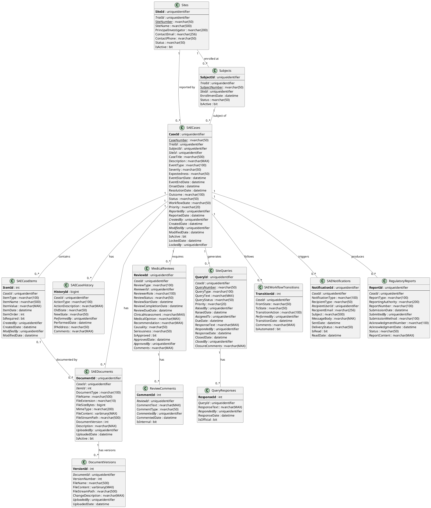

# SAE (Safety Adverse Events) - Entity Relationship Diagram

## Overview

The SAE module manages safety adverse event reporting, medical review workflows, and site queries for clinical trials. This module is critical for regulatory compliance (21 CFR Part 11, GCP ICH E6).

## Database Schema

### Technology Stack
- **Database**: Microsoft SQL Server 2012+
- **ORM**: Entity Framework 6.x / EF Core
- **File Storage**: SQL Server FileStream for document attachments
- **Queue System**: Service Broker / Azure Service Bus

---

## Entity Relationship Diagram (PlantUML)



---

## Entity Relationship Diagram (ASCII)

```
┌────────────────────────────────────────────────────────────────────────────┐
│              OoBDev SAE - Safety Adverse Event Data Model                  │
└────────────────────────────────────────────────────────────────────────────┘

┏━━━━━━━━━━━━━━━━━━━━━━━━┓
┃   CASE MANAGEMENT      ┃
┗━━━━━━━━━━━━━━━━━━━━━━━━┛

┌─────────────────────────────────────────┐
│ SAECases                                │
├─────────────────────────────────────────┤         ┌──────────────────────────┐
│ PK CaseId (GUID)                        │         │ Subjects                 │
│ UK CaseNumber                           │         ├──────────────────────────┤
│ FK TrialId (GUID)───────────────────────┼────────►│ PK SubjectId (GUID)      │
│ FK SubjectId (GUID)─────────────────────┼────────►│ FK TrialId               │
│ FK SiteId (GUID)────────────────────────┼───┐     │ UK SubjectNumber         │
│    CaseTitle                            │   │     │ FK SiteId                │
│    Description                          │   │     │    EnrollmentDate        │
│    EventType                            │   │     │    Status                │
│    Severity                             │   │     └──────────────────────────┘
│    Expectedness                         │   │
│    EventStartDate                       │   │     ┌──────────────────────────┐
│    EventEndDate                         │   └────►│ Sites                    │
│    Outcome                              │         ├──────────────────────────┤
│    Status                               │         │ PK SiteId (GUID)         │
│    WorkflowState                        │         │ FK TrialId               │
│    Priority                             │         │ UK SiteNumber            │
│ FK ReportedBy (GUID)────────────────────┼──┐      │    SiteName              │
│    ReportedDate                         │  │      │    PI Name               │
│ FK CreatedBy, ModifiedBy                │  │      │    ContactEmail          │
│    CreatedDate, ModifiedDate            │  │      │    ContactPhone          │
│ FK LockedBy (GUID)                      │  │      └──────────────────────────┘
│    LockedDate                           │  │
│    IsActive                             │  │
└────────────┬────────────────┬───────────┘  │
             │                │               │
             │                │               └────►AspNetUsers (Gateway)
             │                │
┌────────────▼───────────┐  ┌─▼────────────────────────────────┐
│ SAECaseItems           │  │ SAECaseHistory                   │
├────────────────────────┤  ├──────────────────────────────────┤
│ PK ItemId (int)        │  │ PK HistoryId (bigint)            │
│ FK CaseId (GUID)       │  │ FK CaseId (GUID)                 │
│    ItemType            │  │    ActionType                    │
│    ItemName            │  │    ActionDescription             │
│    ItemValue           │  │    OldState → NewState           │
│    ItemDate            │  │ FK PerformedBy (GUID)────────────┼──►AspNetUsers
│    ItemOrder           │  │    PerformedDate                 │
│    IsRequired          │  │    IPAddress                     │
│ FK CreatedBy           │  │    Comments                      │
│    CreatedDate         │  └──────────────────────────────────┘
└────────┬───────────────┘
         │
         │
         ▼


┏━━━━━━━━━━━━━━━━━━━━━━━━┓
┃   DOCUMENTS            ┃
┗━━━━━━━━━━━━━━━━━━━━━━━━┛

┌─────────────────────────────────────────┐
│ SAEDocuments                            │
├─────────────────────────────────────────┤
│ PK DocumentId (GUID)                    │
│ FK CaseId (GUID)────────────────────────┼──►SAECases
│ FK ItemId (int)─────────────────────────┼──►SAECaseItems
│    DocumentType                         │
│    FileName                             │
│    FileExtension                        │
│    FileSizeBytes                        │
│    MimeType                             │
│    FileContent (varbinary)              │
│    FileStreamPath                       │
│    DocumentVersion                      │
│    Description                          │
│ FK UploadedBy (GUID)────────────────────┼──►AspNetUsers
│    UploadedDate                         │
│    IsActive                             │
└────────────┬────────────────────────────┘
             │
             │
             ▼
┌─────────────────────────────────────────┐
│ DocumentVersions                        │
├─────────────────────────────────────────┤
│ PK VersionId (int)                      │
│ FK DocumentId (GUID)                    │
│    VersionNumber                        │
│    FileName                             │
│    FileContent (varbinary)              │
│    FileStreamPath                       │
│    ChangeDescription                    │
│ FK UploadedBy (GUID)────────────────────┼──►AspNetUsers
│    UploadedDate                         │
└─────────────────────────────────────────┘


┏━━━━━━━━━━━━━━━━━━━━━━━━┓
┃   MEDICAL REVIEW       ┃
┗━━━━━━━━━━━━━━━━━━━━━━━━┛

┌─────────────────────────────────────────┐
│ MedicalReviews                          │
├─────────────────────────────────────────┤
│ PK ReviewId (GUID)                      │
│ FK CaseId (GUID)────────────────────────┼──►SAECases
│    ReviewType                           │
│ FK ReviewerId (GUID)────────────────────┼──►AspNetUsers
│    ReviewerRole                         │
│    ReviewStatus                         │
│    ReviewStartDate                      │
│    ReviewCompletionDate                 │
│    ReviewDueDate                        │
│    ClinicalAssessment                   │
│    MedicalOpinion                       │
│    Recommendation                       │
│    Causality                            │
│    Seriousness                          │
│    IsApproved                           │
│    ApprovedDate                         │
│ FK ApprovedBy (GUID)────────────────────┼──►AspNetUsers
│    Comments                             │
└────────────┬────────────────────────────┘
             │
             │
             ▼
┌─────────────────────────────────────────┐
│ ReviewComments                          │
├─────────────────────────────────────────┤
│ PK CommentId (int)                      │
│ FK ReviewId (GUID)                      │
│    CommentText                          │
│    CommentType                          │
│ FK CommentedBy (GUID)───────────────────┼──►AspNetUsers
│    CommentedDate                        │
│    IsInternal                           │
└─────────────────────────────────────────┘


┏━━━━━━━━━━━━━━━━━━━━━━━━┓
┃   SITE QUERIES         ┃
┗━━━━━━━━━━━━━━━━━━━━━━━━┛

┌─────────────────────────────────────────┐
│ SiteQueries                             │
├─────────────────────────────────────────┤
│ PK QueryId (GUID)                       │
│ FK CaseId (GUID)────────────────────────┼──►SAECases
│ UK QueryNumber                          │
│    QueryType                            │
│    QueryText                            │
│    QueryStatus                          │
│    Priority                             │
│ FK RaisedBy (GUID)──────────────────────┼──►AspNetUsers
│    RaisedDate                           │
│ FK AssignedTo (GUID)────────────────────┼──►AspNetUsers
│    DueDate                              │
│    ResponseText                         │
│ FK RespondedBy (GUID)───────────────────┼──►AspNetUsers
│    ResponseDate                         │
│    ClosedDate                           │
│ FK ClosedBy (GUID)──────────────────────┼──►AspNetUsers
│    ClosureComments                      │
└────────────┬────────────────────────────┘
             │
             │
             ▼
┌─────────────────────────────────────────┐
│ QueryResponses                          │
├─────────────────────────────────────────┤
│ PK ResponseId (int)                     │
│ FK QueryId (GUID)                       │
│    ResponseText                         │
│ FK RespondedBy (GUID)───────────────────┼──►AspNetUsers
│    ResponseDate                         │
│    IsOfficial                           │
└─────────────────────────────────────────┘


┏━━━━━━━━━━━━━━━━━━━━━━━━┓
┃   WORKFLOW             ┃
┗━━━━━━━━━━━━━━━━━━━━━━━━┛

┌─────────────────────────────────────────┐
│ SAEWorkflowTransitions                  │
├─────────────────────────────────────────┤
│ PK TransitionId (int)                   │
│ FK CaseId (GUID)────────────────────────┼──►SAECases
│    FromState                            │
│    ToState                              │
│    TransitionAction                     │
│ FK PerformedBy (GUID)───────────────────┼──►AspNetUsers
│    TransitionDate                       │
│    Comments                             │
│    IsAutomated                          │
└─────────────────────────────────────────┘

Workflow States:
  Draft → Submitted → Medical Review → Query →
  Completed → Reported → Closed


┏━━━━━━━━━━━━━━━━━━━━━━━━┓
┃   NOTIFICATIONS        ┃
┗━━━━━━━━━━━━━━━━━━━━━━━━┛

┌─────────────────────────────────────────┐
│ SAENotifications                        │
├─────────────────────────────────────────┤
│ PK NotificationId (GUID)                │
│ FK CaseId (GUID)────────────────────────┼──►SAECases
│    NotificationType                     │
│    RecipientType                        │
│ FK RecipientUserId (GUID)───────────────┼──►AspNetUsers
│    RecipientEmail                       │
│    Subject                              │
│    MessageBody                          │
│    SentDate                             │
│    DeliveryStatus                       │
│    IsRead                               │
│    ReadDate                             │
└─────────────────────────────────────────┘


┏━━━━━━━━━━━━━━━━━━━━━━━━┓
┃   REGULATORY           ┃
┗━━━━━━━━━━━━━━━━━━━━━━━━┛

┌─────────────────────────────────────────┐
│ RegulatoryReports                       │
├─────────────────────────────────────────┤
│ PK ReportId (GUID)                      │
│ FK CaseId (GUID)────────────────────────┼──►SAECases
│    ReportType (CIOMS, MedWatch, etc.)   │
│    ReportingAuthority (FDA, EMA, etc.)  │
│    ReportNumber                         │
│    SubmissionDate                       │
│ FK SubmittedBy (GUID)───────────────────┼──►AspNetUsers
│    SubmissionMethod                     │
│    AcknowledgmentNumber                 │
│    AcknowledgmentDate                   │
│    Status                               │
│    ReportContent (XML/PDF)              │
└─────────────────────────────────────────┘


Key:
  PK = Primary Key
  FK = Foreign Key
  UK = Unique Key
  ──► = One-to-Many relationship
```

---

## Table Descriptions

### SAE Case Management

#### SAECases
**Purpose**: Core SAE case record

**Key Features**:
- Unique case numbering system (auto-generated)
- Trial, subject, and site associations
- Event classification (type, severity, expectedness)
- Outcome tracking
- Workflow state management
- Case locking for review periods

**Workflow States**:
1. Draft
2. Submitted
3. Medical Review
4. Query (pending site response)
5. Completed
6. Reported (to regulatory)
7. Closed

**Indexes**:
- Clustered on `CaseId` (PK)
- Non-clustered unique on `CaseNumber`
- Non-clustered on `TrialId, Status, WorkflowState`
- Non-clustered on `SubjectId`
- Non-clustered on `CreatedDate DESC`

#### SAECaseItems
**Purpose**: Flexible case data items (EAV pattern for custom fields)

**Key Features**:
- Stores case-specific data points
- Supports different item types (text, date, numeric, coded)
- Ordering support for display
- Required field tracking

**Common Item Types**:
- Concomitant medications
- Relevant medical history
- Lab values
- Investigator narrative

#### SAECaseHistory
**Purpose**: Complete audit trail of case changes

**Key Features**:
- All state transitions logged
- Before/after values captured
- IP address tracking
- Regulatory compliance (21 CFR Part 11)

**Retention**: Permanent

### Documents & Attachments

#### SAEDocuments
**Purpose**: Store case-related documents

**Key Features**:
- FileStream storage for large files
- Document versioning support
- Document type classification
- Link to specific case items

**Document Types**:
- Source documents
- Lab reports
- Medical records
- Investigator narratives
- Hospital records
- Death certificates

**Storage**:
- Files < 1MB: varbinary column
- Files >= 1MB: FileStream

#### DocumentVersions
**Purpose**: Version control for documents

**Key Features**:
- Complete version history
- Change descriptions
- Audit trail for uploads

### Medical Review

#### MedicalReviews
**Purpose**: Track medical review process

**Key Features**:
- Multiple review types (safety physician, medical monitor)
- Review lifecycle (start, due, completion dates)
- Clinical assessment documentation
- Causality and seriousness determination
- Approval workflow

**Review Types**:
- Initial Safety Review
- Medical Monitor Review
- Safety Committee Review

**Causality Assessment**:
- Not Related
- Unlikely
- Possible
- Probable
- Definite

#### ReviewComments
**Purpose**: Comments during review process

**Key Features**:
- Internal vs. external comments
- Threaded discussion support
- Audit trail

### Site Queries

#### SiteQueries
**Purpose**: Manage queries to investigational sites

**Key Features**:
- Auto-generated query numbers
- Assignment to site users
- Due date tracking
- Response workflow
- Closure tracking

**Query Types**:
- Data clarification
- Missing information
- Inconsistent data
- Follow-up request

**Query Lifecycle**:
1. Open (raised)
2. Assigned
3. Responded
4. Closed

#### QueryResponses
**Purpose**: Track query response thread

**Key Features**:
- Multiple responses per query
- Official vs. informal responses
- Response timestamps

### Workflow & Notifications

#### SAEWorkflowTransitions
**Purpose**: Track workflow state changes

**Key Features**:
- State machine enforcement
- Manual vs. automated transitions
- Audit trail

**Valid Transitions**:
```
Draft → Submitted
Submitted → Medical Review
Medical Review → Query (if clarification needed)
Query → Medical Review (after response)
Medical Review → Completed
Completed → Reported (to authorities)
Reported → Closed
```

#### SAENotifications
**Purpose**: Email/system notifications for case events

**Key Features**:
- Event-driven notifications
- Read receipt tracking
- Delivery status monitoring

**Notification Types**:
- New case assigned
- Review due
- Query raised
- Response received
- Regulatory deadline approaching

### Regulatory Reporting

#### RegulatoryReports
**Purpose**: Track regulatory authority submissions

**Key Features**:
- Multiple report formats (CIOMS, MedWatch, E2B)
- Submission tracking
- Acknowledgment tracking
- Report content archival

**Report Types**:
- CIOMS I (individual case safety report)
- FDA MedWatch 3500A
- E2B(R3) electronic submission
- ICH format

**Reporting Authorities**:
- FDA (United States)
- EMA (European Union)
- MHRA (UK)
- PMDA (Japan)
- Health Canada

---

## Business Rules

### Case Creation
1. Case number auto-generated on save (format: `TRIAL-SAE-YYYY-NNNN`)
2. Subject must be enrolled in trial
3. Event start date cannot be before enrollment date
4. Reported date defaults to current date

### Workflow Enforcement
1. Cannot transition to Medical Review without required documents
2. Medical Review must be completed before regulatory reporting
3. Case must be locked during Medical Review
4. Only authorized medical reviewers can complete reviews

### Document Management
1. Minimum one source document required
2. Documents cannot be deleted (only deactivated)
3. All document changes create new versions
4. Original versions preserved for audit

### Site Queries
1. Query auto-assigned to site coordinator
2. Automatic escalation if not responded within due date
3. Case cannot be completed with open queries
4. Response must be reviewed before query closure

### Medical Review
1. Reviewer cannot review own cases
2. Causality must be assessed for all serious events
3. Recommendation required for all reviews
4. Approval required from medical monitor for serious/unexpected events

---

## Compliance Mapping

### 21 CFR Part 11
| Requirement | Implementation |
|-------------|----------------|
| Audit Trail | SAECaseHistory, DocumentVersions |
| Electronic Signatures | User ID + Timestamp + IP in audit |
| Record Integrity | Immutable history, checksums |
| Version Control | DocumentVersions table |

### GCP ICH E6(R2)
| Requirement | Implementation |
|-------------|----------------|
| Safety Reporting | SAECases, RegulatoryReports |
| Source Documentation | SAEDocuments with FileStream |
| Query Management | SiteQueries, QueryResponses |
| Medical Review | MedicalReviews table |
| Investigator Accountability | Sites, ReportedBy tracking |

### ISO 14155 (Medical Devices)
- Adverse event classification
- Severity and causality assessment
- Timely regulatory reporting
- Complete audit trail

---

## Performance Considerations

### Indexes

```sql
-- Most frequent query: active cases for a trial
CREATE NONCLUSTERED INDEX IX_SAECases_TrialActive
ON SAECases(TrialId, IsActive, WorkflowState)
INCLUDE (CaseNumber, CaseTitle, Severity, Priority)

-- Medical review dashboard
CREATE NONCLUSTERED INDEX IX_MedicalReviews_ReviewerStatus
ON MedicalReviews(ReviewerId, ReviewStatus, ReviewDueDate)
INCLUDE (CaseId, ReviewType)

-- Open queries report
CREATE NONCLUSTERED INDEX IX_SiteQueries_StatusDue
ON SiteQueries(QueryStatus, DueDate)
WHERE QueryStatus IN ('Open', 'Assigned')

-- Document retrieval
CREATE NONCLUSTERED INDEX IX_SAEDocuments_CaseActive
ON SAEDocuments(CaseId, IsActive)
INCLUDE (DocumentId, FileName, DocumentType)
```

### Partitioning

For high-volume trials:
- Partition `SAECaseHistory` by year
- Partition `SAENotifications` by month (with purge after 90 days)

---

## Data Retention

### Permanent Retention
- SAECases
- SAECaseHistory
- SAEDocuments
- DocumentVersions
- MedicalReviews
- RegulatoryReports

### Limited Retention
- SAENotifications: 90 days after read
- SAEWorkflowTransitions: Archive after case closure + 7 years

---

*SAE ERD Version: 1.0*
*Last Updated: January 2026*
*Compliance: 21 CFR Part 11, GCP ICH E6(R2), ISO 14155*
