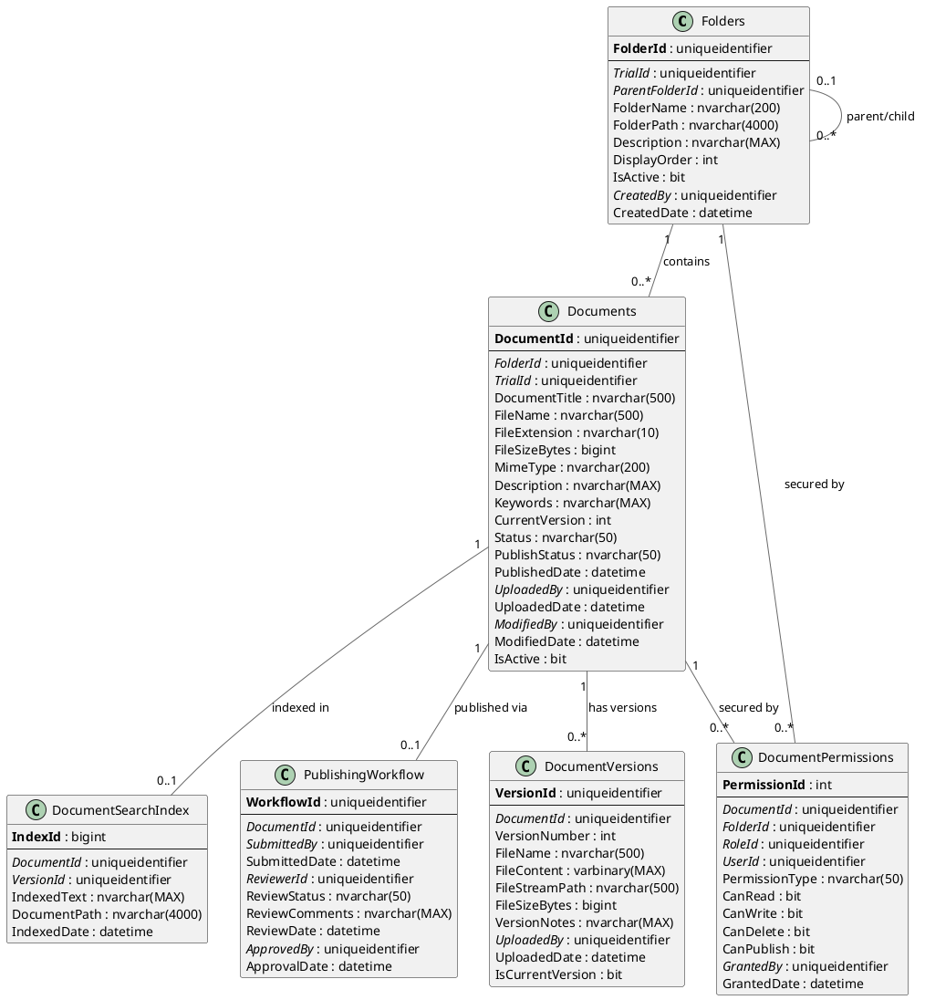

# Site Library - Entity Relationship Diagram

## Overview

The Site Library module provides document management with version control, full-text search, publishing workflows, and role-based access control for trial documentation.

## Database Schema

### Technology Stack
- **Database**: Microsoft SQL Server 2012+
- **File Storage**: SQL Server FileStream for large documents
- **Search**: SQL Server Full-Text Search
- **ORM**: Entity Framework 6.x / EF Core

---

## Entity Relationship Diagram (PlantUML)



---

## Entity Relationship Diagram (ASCII)

```
┌────────────────────────────────────────────────────────────────────────────┐
│                 OoBDev Site Library - Data Model                           │
└────────────────────────────────────────────────────────────────────────────┘

┏━━━━━━━━━━━━━━━━━━━━━━━━┓
┃   FOLDER STRUCTURE     ┃
┗━━━━━━━━━━━━━━━━━━━━━━━━┛

┌─────────────────────────────────────────┐
│ Folders (Hierarchical Tree)            │
├─────────────────────────────────────────┤
│ PK FolderId (GUID)                      │
│ FK TrialId (GUID)───────────────────────┼──►Trials
│ FK ParentFolderId (GUID) [Self-ref]     │
│    FolderName                           │
│    FolderPath (/Root/Parent/Child)      │
│    Description                          │
│    DisplayOrder                         │
│    IsActive                             │
│ FK CreatedBy (GUID)                     │
│    CreatedDate                          │
└────────────┬────────────────────────────┘
             │
             │ contains
             ▼
┌─────────────────────────────────────────┐
│ Documents                               │
├─────────────────────────────────────────┤
│ PK DocumentId (GUID)                    │
│ FK FolderId (GUID)                      │
│ FK TrialId (GUID)                       │
│    DocumentTitle                        │
│    FileName                             │
│    FileExtension                        │
│    FileSizeBytes                        │
│    MimeType                             │
│    Description                          │
│    Keywords (comma-separated)           │
│    CurrentVersion (int)                 │
│    Status (Draft/Active/Archived)       │
│    PublishStatus (Pending/Published)    │
│    PublishedDate                        │
│ FK UploadedBy (GUID)                    │
│    UploadedDate                         │
│ FK ModifiedBy (GUID)                    │
│    ModifiedDate                         │
│    IsActive                             │
└────────────┬────────────────────────────┘
             │
             │ has versions
             ▼
┌─────────────────────────────────────────┐
│ DocumentVersions                        │
├─────────────────────────────────────────┤
│ PK VersionId (GUID)                     │
│ FK DocumentId (GUID)                    │
│    VersionNumber (1, 2, 3...)           │
│    FileName                             │
│    FileContent (varbinary for < 1MB)    │
│    FileStreamPath (for >= 1MB)          │
│    FileSizeBytes                        │
│    VersionNotes                         │
│ FK UploadedBy (GUID)                    │
│    UploadedDate                         │
│    IsCurrentVersion (bit)               │
└─────────────────────────────────────────┘


┏━━━━━━━━━━━━━━━━━━━━━━━━┓
┃   PUBLISHING WORKFLOW  ┃
┗━━━━━━━━━━━━━━━━━━━━━━━━┛

┌─────────────────────────────────────────┐
│ PublishingWorkflow                      │
├─────────────────────────────────────────┤
│ PK WorkflowId (GUID)                    │
│ FK DocumentId (GUID)────────────────────┼──►Documents
│ FK SubmittedBy (GUID)───────────────────┼──►AspNetUsers
│    SubmittedDate                        │
│ FK ReviewerId (GUID)────────────────────┼──►AspNetUsers (Librarian)
│    ReviewStatus (Pending/Approved/Reject)│
│    ReviewComments                       │
│    ReviewDate                           │
│ FK ApprovedBy (GUID)────────────────────┼──►AspNetUsers
│    ApprovalDate                         │
└─────────────────────────────────────────┘

Workflow States:
  1. Writer uploads document → Draft
  2. Writer submits for review → Pending
  3. Librarian reviews → Approved/Rejected
  4. If Approved → Published (visible to all)
  5. If Rejected → Back to Draft (with comments)


┏━━━━━━━━━━━━━━━━━━━━━━━━┓
┃   ACCESS CONTROL       ┃
┗━━━━━━━━━━━━━━━━━━━━━━━━┛

┌─────────────────────────────────────────┐
│ DocumentPermissions                     │
├─────────────────────────────────────────┤
│ PK PermissionId (int)                   │
│ FK DocumentId (GUID)                    │
│ FK FolderId (GUID)                      │
│ FK RoleId (GUID)────────────────────────┼──►AspNetRoles
│ FK UserId (GUID)────────────────────────┼──►AspNetUsers
│    PermissionType (Role/User)           │
│    CanRead (bit)                        │
│    CanWrite (bit)                       │
│    CanDelete (bit)                      │
│    CanPublish (bit)                     │
│ FK GrantedBy (GUID)                     │
│    GrantedDate                          │
└─────────────────────────────────────────┘

Permission Types:
  • Role-based (e.g., all "Investigators" can read)
  • User-specific (e.g., John Smith can write)
  • Inherited from folder

Permission Hierarchy:
  Folder permissions cascade to child folders and documents


┏━━━━━━━━━━━━━━━━━━━━━━━━┓
┃   FULL-TEXT SEARCH     ┃
┗━━━━━━━━━━━━━━━━━━━━━━━━┛

┌─────────────────────────────────────────┐
│ DocumentSearchIndex                     │
├─────────────────────────────────────────┤
│ PK IndexId (bigint)                     │
│ FK DocumentId (GUID)                    │
│ FK VersionId (GUID)                     │
│    IndexedText (extracted from file)    │
│    DocumentPath                         │
│    IndexedDate                          │
└─────────────────────────────────────────┘

Full-Text Search Engine:
  • Indexes: Title, Description, Keywords, File Content
  • File Types: PDF, Word, Excel, PowerPoint, HTML, Text
  • Features: Stemming, thesaurus, ranking by relevance


Example Folder Structure:
  /Trial Protocol
  /Trial Protocol/Amendments
  /Trial Protocol/Amendments/Amendment 1
  /ICF (Informed Consent Forms)
  /ICF/Version 1.0
  /ICF/Version 2.0
  /Site Documents
  /Site Documents/Training Materials
  /Site Documents/Regulatory
```

---

*Site Library ERD Version: 1.0*
*Last Updated: January 2026*
*Features: Version Control, Full-Text Search, Publishing Workflow, RBAC*
