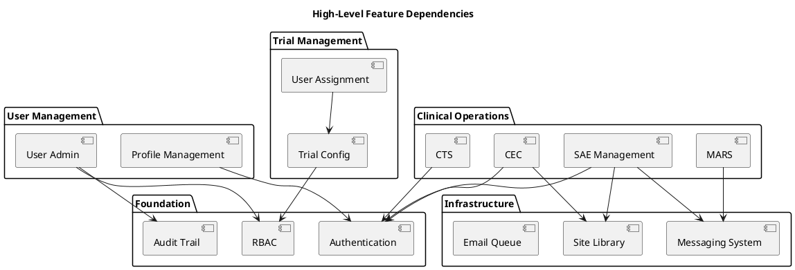

# OoBDev Feature Specifications

This directory contains comprehensive feature specifications for the OoBDev Clinical Trial Management System. Each feature is documented with requirements, designs, diagrams, and implementation details needed to recreate the functionality.

## Purpose

These specifications serve as:
- **Requirements Documentation** - Functional and non-functional requirements
- **Design Documentation** - Architecture, data models, and workflows
- **Implementation Guide** - Technical details for developers
- **Testing Guide** - Acceptance criteria and test scenarios
- **Compliance Reference** - Regulatory requirements (21 CFR Part 11, GCP)

## Feature Categories

### 1. Authentication & Session Management

Core security features for user authentication and session handling.

- **[Login](./authentication/login.md)** - User authentication with username/password
- **[Logout](./authentication/logout.md)** - Session termination
- **[Session Management](./authentication/session-management.md)** - Session tracking and last login display
- **[Account Lockout](./authentication/account-lockout.md)** - Failed login protection

### 2. User Management (Administrative)

Administrative features for managing user accounts.

- **[Create User](./user-management/create-user.md)** - Manual user account creation
- **[List Users](./user-management/list-users.md)** - User directory and search
- **[Reset Password](./user-management/reset-password.md)** - Administrative password reset
- **[Unlock Account](./user-management/unlock-account.md)** - Unlock locked accounts
- **[Change Email](./user-management/change-email.md)** - Modify user email address
- **[Assign Roles](./user-management/assign-roles.md)** - Role-based access control management
- **[Bulk Import Users](./user-management/bulk-import.md)** - CSV/Excel user import

### 3. Profile Management (Self-Service)

User self-service features for profile management.

- **[Manage Profile](./profile/manage-profile.md)** - Email, phone, security questions
- **[Change Password](./profile/change-password.md)** - User password change
- **[Self Registration](./profile/self-registration.md)** - New user self-enrollment
- **[Account Verification](./profile/account-verification.md)** - Email/phone verification
- **[Password Recovery](./profile/password-recovery.md)** - Self-service password reset

### 4. Safety Adverse Events (SAE)

Safety event reporting and medical review workflow.

- **[Create SAE Case](./sae/create-case.md)** - Initiate adverse event case
- **[Upload Documents](./sae/upload-documents.md)** - Case documentation
- **[Medical Review](./sae/medical-review.md)** - Submit for medical review
- **[Site Queries](./sae/site-queries.md)** - Request additional information
- **[SAE Workflow](./sae/workflow.md)** - Case lifecycle and state transitions

### 5. Messaging System

Multi-channel messaging with guaranteed delivery.

- **[Send Message](./messaging/send-message.md)** - User-initiated messaging
- **[Message Routing](./messaging/routing.md)** - Queue architecture and routing logic
- **[Message States](./messaging/state-machine.md)** - Message lifecycle states
- **[Scheduled Messages](./messaging/scheduled-messages.md)** - Reminder series and scheduling
- **[Stop List Management](./messaging/stop-list.md)** - Opt-out handling
- **[Auto-Reply Processing](./messaging/auto-reply.md)** - Automated response handling
- **[Activity Tracking](./messaging/activity-tracking.md)** - Message engagement metrics

### 6. Clinical Event Committee (CEC)

Event adjudication and committee management.

- **[Create Event Case](./cec/create-case.md)** - Initiate event for adjudication
- **[Medical Review](./cec/medical-review.md)** - Clinical review workflow
- **[Committee Meetings](./cec/meetings.md)** - Meeting management
- **[Adjudication Voting](./cec/adjudication.md)** - Committee voting process
- **[Final Determination](./cec/final-determination.md)** - Consensus and reporting

### 7. Clinical Trial Screening (CTS)

Subject screening and enrollment management.

- **[Screening Questionnaire](./cts/questionnaire.md)** - Configurable screening forms
- **[Eligibility Determination](./cts/eligibility.md)** - Inclusion/exclusion criteria
- **[Subject Management](./cts/subject-management.md)** - Subject lifecycle
- **[Subscription Management](./cts/subscriptions.md)** - Trial enrollment

### 8. MARS (Medication Adherence)

Subject engagement and medication adherence tracking.

- **[Medication Reminders](./mars/reminders.md)** - Scheduled reminder system
- **[Adherence Tracking](./mars/adherence-tracking.md)** - Compliance metrics
- **[Subject Management](./mars/subject-management.md)** - Subject enrollment
- **[Dashboard Analytics](./mars/analytics.md)** - Adherence reporting

### 9. Site Library

Document repository and knowledge management.

- **[Document Upload](./site-library/upload.md)** - Document storage
- **[Document Search](./site-library/search.md)** - Full-text search
- **[Version Control](./site-library/versioning.md)** - Document versioning
- **[Publishing Workflow](./site-library/publishing.md)** - Approval and publishing
- **[Access Control](./site-library/permissions.md)** - Document permissions

### 10. Trial Configuration

Trial setup and configuration.

- **[Configure Trial](./trial/configuration.md)** - Trial settings and metadata
- **[Assign Users to Trials](./trial/user-assignment.md)** - User-trial associations
- **[Trial Roles](./trial/roles.md)** - Trial-specific role management

### 11. Cross-Cutting Features

System-wide features and infrastructure.

- **[Audit Trail](./system/audit-trail.md)** - Comprehensive activity logging
- **[Role-Based Access Control](./system/rbac.md)** - Permission system
- **[Email Queue Processing](./system/email-queue.md)** - Asynchronous email
- **[Exception Logging](./system/exception-logging.md)** - Error tracking
- **[Multi-Tenancy](./system/multi-tenancy.md)** - Trial-level isolation

## Feature Documentation Template

Each feature document follows this structure:

### 1. Feature Overview
- Feature name and unique ID
- Brief description
- Business value
- User personas

### 2. Requirements
- **Functional Requirements** - What the system must do
- **Non-Functional Requirements** - Performance, security, compliance
- **Business Rules** - Validation and workflow rules
- **Compliance Requirements** - Regulatory constraints (21 CFR Part 11, GCP)

### 3. User Stories / Use Cases
- Actors and roles
- Main flow
- Alternative flows
- Exception handling

### 4. Design
- **Architecture** - Component diagrams
- **Workflows** - Sequence diagrams, state machines
- **Data Model** - Entity relationships
- **API Contracts** - Interfaces and DTOs
- **UI Mockups** - Wireframes (if applicable)

### 5. Implementation Details
- **Technology Stack** - Frameworks, libraries
- **Dependencies** - External systems, services
- **Integration Points** - APIs, message queues
- **Security Considerations** - Authentication, authorization, encryption

### 6. Acceptance Criteria
- Testable conditions for feature completion
- Success metrics
- Performance benchmarks

### 7. Test Scenarios
- Unit test scenarios
- Integration test scenarios
- User acceptance test scenarios
- Security test scenarios

### 8. Migration / Deployment
- Database migrations
- Configuration changes
- Deployment steps
- Rollback procedures

## How to Use These Specifications

### For Product Managers
1. Review feature overviews for business value
2. Validate requirements against business needs
3. Use as basis for user stories and backlog

### For Architects
1. Review design sections for architectural decisions
2. Understand integration points and dependencies
3. Validate compliance with architecture standards

### For Developers
1. Start with requirements and design sections
2. Reference data models and API contracts
3. Use implementation details for coding
4. Follow test scenarios for TDD

### For QA Engineers
1. Use acceptance criteria for test planning
2. Reference test scenarios for test case creation
3. Validate compliance requirements in testing

### For Compliance
1. Review compliance requirements sections
2. Verify audit trail specifications
3. Validate data retention and security

## Feature Dependencies

## Compliance Matrix

Features mapped to regulatory requirements:

| Feature | 21 CFR Part 11 | GCP | HIPAA |
|---------|-----------------|-----|-------|
| Audit Trail | ✅ Required | ✅ Required | ✅ Required |
| Authentication | ✅ Electronic Signatures | ✅ Access Control | ✅ Access Control |
| SAE Management | ✅ Record Integrity | ✅ Safety Reporting | ⚠️ If PHI |
| CEC | ✅ Record Integrity | ✅ Data Review | ⚠️ If PHI |
| CTS | ✅ Record Integrity | ✅ Subject Protection | ✅ PHI Protection |
| Document Versioning | ✅ Change Control | ✅ Document Control | N/A |

## Priorities

### P0 - Critical (MVP)
- Authentication & Session Management
- Role-Based Access Control
- Audit Trail
- Basic User Management

### P1 - High Priority
- Profile Management
- SAE Management
- Messaging System (core)
- Trial Configuration

### P2 - Medium Priority
- CEC
- CTS
- Site Library
- Advanced Messaging features

### P3 - Nice to Have
- MARS
- Advanced Analytics
- Bulk Operations

## Technology Stack

### Platform
- **Backend**: ASP.NET MVC / ASP.NET Core
- **Frontend**: Modern web framework (React, Angular, or Blazor)
- **Database**: SQL Server with Full-Text Search and FileStream
- **Message Queue**: Azure Service Bus or MSMQ
- **ORM**: Entity Framework Core

### Security
- **Authentication**: ASP.NET Identity or OAuth/OIDC
- **Authorization**: Claims-based RBAC
- **Encryption**: TLS 1.2+, AES-256 for data at rest

### External Services
- **Email**: SMTP / SendGrid / AWS SES
- **SMS**: Twilio / Azure Communication Services
- **Storage**: Azure Blob Storage or SQL FileStream

## Related Documentation

- [Architecture Documentation](../architecture/README.md) - System architecture
- [Code Review](../architecture/CODE_REVIEW.md) - Code patterns and findings
- [API Documentation](#) - API specifications (to be created)
- [Deployment Guide](#) - Infrastructure and deployment

## Contributing

When adding new features:
1. Copy the feature template
2. Fill in all sections completely
3. Include all diagrams (architecture, sequence, data model)
4. Define clear acceptance criteria
5. Map to compliance requirements
6. Update this index

---

*Feature Specifications Version: 1.0*
*Last Updated: January 2026*
*Based on Architecture Documentation Project*
