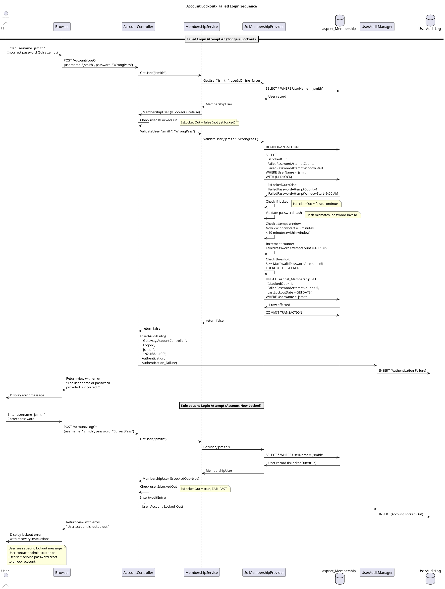
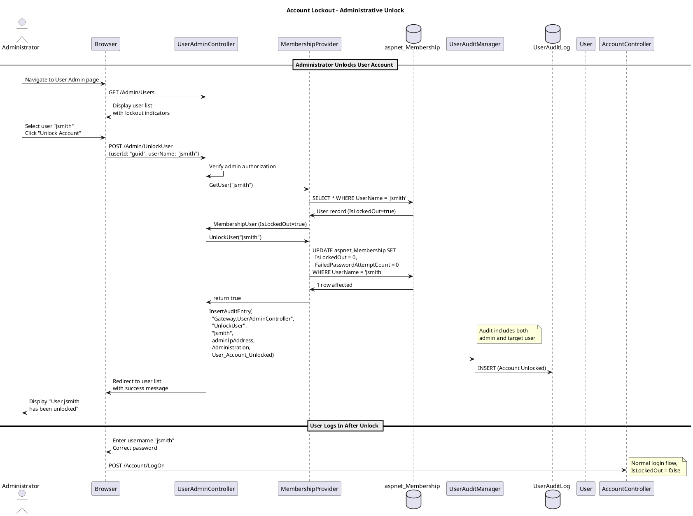

# Account Lockout Feature Specification

## Feature Overview

### Feature Name
Account Lockout on Failed Login Protection

### Description
Automated brute-force attack prevention system that monitors failed login attempts and locks user accounts after exceeding configurable thresholds. The system tracks failed password attempts within a time window, maintains lockout state in the database, provides comprehensive audit logging, and supports administrative unlock procedures. Implements defense-in-depth security to protect against credential stuffing and password guessing attacks.

### Business Value
- **Security**: Prevents brute-force and credential stuffing attacks
- **Compliance**: Meets 21 CFR Part 11 and security best practice requirements
- **Risk Mitigation**: Reduces unauthorized access risk to clinical trial data
- **User Protection**: Protects legitimate user accounts from takeover attempts
- **Forensics**: Comprehensive audit trail for security incident investigation
- **Regulatory**: Demonstrates security controls for FDA and compliance audits

### Target Personas
- **Gateway User**: Subject to lockout protection on their own account
- **Trial/Site Manager**: Same lockout protection as base users
- **System Administrator**: Unlocks locked accounts and investigates lockout events
- **Security Officer**: Monitors lockout patterns for attack detection
- **Compliance Officer**: Reviews lockout audit trails for regulatory compliance

### Work Item Reference
TFS Work Item #575 - Lockout on Failed Login (tfscorp.itrica.com\ITRICA)

### Dependencies
- Requires Login feature (UC_Login)
- Related to Session Management
- Related to Password Reset/Recovery (UC_PasswordUnlock)

---

## Requirements

### Functional Requirements

**FR-001: Failed Attempt Tracking**
- System MUST track failed password attempts per user account
- System MUST increment FailedPasswordAttemptCount on invalid password
- System MUST reset FailedPasswordAttemptCount to 0 on successful login
- System MUST track FailedPasswordAttemptWindowStart timestamp
- Failed attempts MUST be counted within configured time window only

**FR-002: Lockout Threshold Enforcement**
- System MUST lock account when FailedPasswordAttemptCount >= MaxInvalidPasswordAttempts
- System MUST set IsLockedOut = true in aspnet_Membership table
- System MUST set LastLockoutDate to current timestamp
- Lockout MUST occur immediately upon exceeding threshold
- Threshold MUST be configurable via Web.config membership provider settings

**FR-003: Lockout Status Checking**
- System MUST check IsLockedOut flag before password validation
- Locked accounts MUST be denied login even with correct password
- System MUST display specific error message for locked accounts
- System MUST log lockout attempts separately from password failures

**FR-004: Attempt Window Management**
- System MUST track FailedPasswordAttemptWindowStart datetime
- System MUST reset counter if current attempt outside window (window expired)
- System MUST update window start on first failed attempt in new window
- Window duration MUST be configurable via passwordAttemptWindow setting (minutes)

**FR-005: Lockout Audit Logging**
- System MUST log each failed password attempt with username and IP
- System MUST log account lockout event when threshold exceeded
- System MUST log lockout denial attempts (login attempt on locked account)
- System MUST log account unlock events (administrative or self-service)
- All audit entries MUST include IP address for forensic analysis

**FR-006: Account Unlock**
- System MUST support administrative unlock (IsLockedOut = false)
- System MUST reset FailedPasswordAttemptCount on unlock
- System MUST log unlock event with administrator identity
- System SHOULD support self-service unlock via password reset
- Unlock MUST be audited for compliance

**FR-007: Configuration**
- MaxInvalidPasswordAttempts MUST be configurable (Web.config)
- PasswordAttemptWindow MUST be configurable (minutes)
- Configuration SHOULD be documented in use-cases.md note
- Configuration MUST apply to all users (no per-user override)

### Non-Functional Requirements

**NFR-001: Performance**
- Lockout check MUST complete within 100ms
- Failed attempt counter update MUST NOT significantly delay login response
- Database updates MUST use optimistic concurrency to prevent race conditions

**NFR-002: Security**
- Lockout mechanism MUST NOT reveal whether username exists
- Generic error message for locked accounts ("account is locked out")
- Failed attempts MUST be tracked even for non-existent usernames (log only)
- IP address MUST be captured for all failed attempts (attack pattern detection)
- Lockout cannot be bypassed via timing attacks

**NFR-003: Reliability**
- System MUST handle concurrent failed login attempts correctly
- Database transaction isolation MUST prevent counter corruption
- Membership provider MUST atomically update failed attempt counter
- System MUST handle database connection failures gracefully

**NFR-004: Usability**
- Lockout error message MUST be clear and actionable
- Message SHOULD instruct user to contact administrator or use self-service unlock
- System SHOULD provide link to password recovery page
- Legitimate users MUST have unlock option (not permanently locked)

**NFR-005: Compliance**
- Lockout configuration MUST be documented and auditable
- Lockout threshold MUST be reasonable (5 attempts recommended)
- Audit trail MUST support forensic investigation
- Lockout events MUST be reported to security monitoring systems

### Business Rules

**BR-001: Lockout Threshold Defaults**
- Default MaxInvalidPasswordAttempts: 5 attempts
- Default PasswordAttemptWindow: 10 minutes
- Configurable via Web.config membership provider
- Same threshold applies to all users (no role-based differences)

**BR-002: Failed Attempt Window Logic**
```
IF (Now - FailedPasswordAttemptWindowStart) > PasswordAttemptWindow:
    // Outside window, reset counter
    FailedPasswordAttemptCount = 1
    FailedPasswordAttemptWindowStart = Now
ELSE:
    // Within window, increment counter
    FailedPasswordAttemptCount += 1

IF FailedPasswordAttemptCount >= MaxInvalidPasswordAttempts:
    IsLockedOut = true
    LastLockoutDate = Now
```

**BR-003: Lockout Persistence**
- Lockout state persisted in database (aspnet_Membership.IsLockedOut)
- Lockout survives application restart
- Lockout NOT automatically cleared (requires admin or self-service unlock)
- Lockout duration: indefinite (until manually unlocked)

**BR-004: Counter Reset Conditions**
- Successful login: Reset FailedPasswordAttemptCount to 0
- Outside attempt window: Reset counter to 1 (start new window)
- Administrative unlock: Reset counter to 0, set IsLockedOut = false
- Password reset (self-service): Reset counter to 0, unlock account

**BR-005: Lockout vs Username Not Found**
- Username not found: Log "Authentication_Username_Not_Found", do NOT create failed attempt counter
- Invalid password for valid user: Increment counter, log "Authentication_Failure"
- Locked account: Log "User_Account_Locked_Out", do NOT increment counter (already locked)

**BR-006: Audit Trail Requirements**
- All failed attempts audited (even for non-existent users)
- Lockout event audited when threshold exceeded
- Unlock events audited with administrator identity
- IP addresses captured for all events
- Audit records immutable

### Compliance Requirements

**COMP-001: 21 CFR Part 11 - Security**
- System MUST use authority checks to ensure only authorized individuals can use the system
- System MUST employ operational checks (account lockout) to enforce authorized access
- System MUST use device checks (IP tracking) to determine validity of access attempts
- Lockout mechanism demonstrates "appropriate controls" for access prevention

**COMP-002: 21 CFR Part 11 - Audit Trail**
- System MUST maintain secure, computer-generated, time-stamped audit trail of lockout events
- Audit trail MUST record failed login attempts and lockout events
- Audit trail MUST be available for FDA inspection
- Audit records MUST be retained per organizational policy

**COMP-003: NIST 800-63B - Account Lockout**
- System SHOULD implement rate limiting and lockout mechanisms
- Lockout threshold SHOULD be between 3-10 failed attempts
- System SHOULD notify user of lockout and provide recovery mechanism
- Lockout SHOULD be time-based OR require administrative intervention

**COMP-004: OWASP - Brute Force Protection**
- System MUST implement account lockout to prevent brute force attacks
- System MUST log all authentication attempts for security monitoring
- System SHOULD implement IP-based rate limiting (future enhancement)
- Generic error messages MUST NOT reveal lockout status to attackers

---

## User Stories

### Story 1: Account Locked After Failed Attempts
```gherkin
Given I am a Gateway User with username "jsmith"
  And my account is not locked (IsLockedOut = false)
  And the MaxInvalidPasswordAttempts is configured to 5
  And the PasswordAttemptWindow is configured to 10 minutes
When I enter my username "jsmith" and incorrect password 5 times within 10 minutes
Then my account should be locked (IsLockedOut = true)
  And the LastLockoutDate should be set to the current timestamp
  And an audit log entry should record "User Account Locked Out" with my IP address
  And I should see error message "User account is locked out"
  And I should NOT be able to log in even with the correct password
```

### Story 2: Lockout Prevents Login with Correct Password
```gherkin
Given I am a Gateway User with username "jsmith"
  And my account is locked (IsLockedOut = true)
  And I have the correct password "ValidPass123!"
When I enter my username "jsmith" and correct password "ValidPass123!"
  And I click "Log In"
Then I should remain on the login page
  And I should see error message "User account is locked out"
  And an audit log entry should record "User Account Locked Out" with my IP address
  And the password validation should NOT occur (fail-fast on lockout check)
  And the FailedPasswordAttemptCount should NOT be incremented
```

### Story 3: Failed Attempts Reset After Successful Login
```gherkin
Given I am a Gateway User with username "jsmith"
  And I have 3 failed login attempts (FailedPasswordAttemptCount = 3)
  And my account is not locked (IsLockedOut = false)
When I enter my username "jsmith" and correct password "ValidPass123!"
  And I click "Log In"
Then I should be logged in successfully
  And my FailedPasswordAttemptCount should be reset to 0
  And an audit log entry should record "Authentication Success"
  And my LastLoginDate should be updated to current timestamp
```

### Story 4: Failed Attempts Window Expiration
```gherkin
Given I am a Gateway User with username "jsmith"
  And I have 2 failed login attempts at 9:00 AM (FailedPasswordAttemptCount = 2)
  And the FailedPasswordAttemptWindowStart is 9:00 AM
  And the PasswordAttemptWindow is configured to 10 minutes
When I enter incorrect password at 9:15 AM (15 minutes later, outside window)
Then the FailedPasswordAttemptCount should be reset to 1 (start new window)
  And the FailedPasswordAttemptWindowStart should be updated to 9:15 AM
  And an audit log entry should record "Authentication Failure"
  And my account should NOT be locked
```

### Story 5: Administrative Account Unlock
```gherkin
Given I am a Gateway User with username "jsmith"
  And my account is locked (IsLockedOut = true, FailedPasswordAttemptCount = 5)
  And I am a System Administrator with username "admin"
When I navigate to the user administration page
  And I select user "jsmith"
  And I click "Unlock Account"
Then the user "jsmith" account should be unlocked (IsLockedOut = false)
  And the FailedPasswordAttemptCount should be reset to 0
  And an audit log entry should record "User Account Unlocked" with administrator "admin" and user "jsmith"
When user "jsmith" attempts to log in with correct password
Then they should be able to log in successfully
```

### Story 6: Self-Service Unlock via Password Reset
```gherkin
Given I am a Gateway User with username "jsmith"
  And my account is locked (IsLockedOut = true)
  And I have a configured security question "What is your mother's maiden name?"
When I navigate to /Account/Recover
  And I enter my username "jsmith"
  And I answer my security question correctly
  And I enter a new password "NewPass123!"
Then my account should be unlocked (IsLockedOut = false)
  And my FailedPasswordAttemptCount should be reset to 0
  And my password should be updated to the new password
  And an audit log entry should record "User Account Recovery Success"
  And I should be redirected to the login page
When I log in with my new password
Then I should be able to log in successfully
```

### Story 7: Lockout Audit Trail for Security Investigation
```gherkin
Given I am a Security Officer investigating suspicious activity
  And user "jsmith" account was locked at 2:30 AM on December 15, 2025
  And the lockout occurred from IP address 203.0.113.42 (suspicious foreign IP)
When I query the UserAuditLog for user "jsmith" around that time
Then I should see audit entries:
  | Timestamp         | Action         | Detail                     | IP            |
  | 12/15 2:25:00 AM  | Authentication | Authentication Failure     | 203.0.113.42  |
  | 12/15 2:26:15 AM  | Authentication | Authentication Failure     | 203.0.113.42  |
  | 12/15 2:27:30 AM  | Authentication | Authentication Failure     | 203.0.113.42  |
  | 12/15 2:28:45 AM  | Authentication | Authentication Failure     | 203.0.113.42  |
  | 12/15 2:30:00 AM  | Authentication | Authentication Failure     | 203.0.113.42  |
  | 12/15 2:30:01 AM  | Authentication | User Account Locked Out    | 203.0.113.42  |
And I should identify this as a brute-force attack from foreign IP
And I should contact user "jsmith" to verify legitimate access attempts
And I should potentially block IP address 203.0.113.42
```

### Story 8: Username Enumeration Prevention
```gherkin
Given I am an attacker attempting to enumerate valid usernames
  And username "jsmith" exists in the system
  And username "nonexistent" does NOT exist in the system
When I enter username "jsmith" with incorrect password
Then I should see error message "The user name or password provided is incorrect."
When I enter username "nonexistent" with any password
Then I should see error message "The user name or password provided is incorrect."
And both error messages should be IDENTICAL
And the response time should be similar for both scenarios
And I should NOT be able to determine which usernames exist
```

---

## Design

### Architecture Diagram

```plantuml
@startuml Account Lockout Architecture
!include https://raw.githubusercontent.com/plantuml-stdlib/C4-PlantUML/master/C4_Component.puml

title Account Lockout - Component Diagram

Container_Boundary(web, "Web Application") {
    Component(controller, "AccountController", "MVC Controller", "Checks lockout status before authentication")
    Component(adminController, "UserAdminController", "MVC Controller", "Administrative unlock functionality")
    Component(recoverController, "AccountController.Recover", "MVC Controller", "Self-service unlock via password reset")
}

Container_Boundary(services, "Service Layer") {
    Component(membership, "AccountMembershipService", "Membership Service", "Validates credentials, updates lockout state")
    Component(provider, "SqlMembershipProvider", "ASP.NET Provider", "Manages lockout counters and status")
    Component(auditMgr, "UserAuditManager", "Audit Manager", "Logs lockout events")
}

Container_Boundary(data, "Data Layer") {
    ComponentDb(membershipDb, "aspnet_Membership", "SQL Server Table", "Stores lockout state and counters")
    ComponentDb(auditDb, "UserAuditLog", "SQL Server Table", "Stores lockout audit trail")
}

Rel(controller, membership, "ValidateUser, GetUser", "Interface call")
Rel(controller, auditMgr, "InsertAuditEntry", "Method call")
Rel(membership, provider, "ValidateUser", "Provider pattern")
Rel(provider, membershipDb, "UPDATE counters, lockout status", "ADO.NET")
Rel(adminController, provider, "UnlockUser", "Membership API")
Rel(recoverController, provider, "ResetPassword, unlock", "Membership API")
Rel(auditMgr, auditDb, "INSERT audit record", "Entity Framework")

note right of provider
  SqlMembershipProvider Logic:
  1. Check IsLockedOut (fail-fast)
  2. Validate password hash
  3. IF invalid:
     - Check attempt window
     - Increment counter
     - Lock if threshold exceeded
  4. IF valid:
     - Reset counter to 0
     - Update LastLoginDate
end note

note right of membershipDb
  Lockout State Fields:
  - IsLockedOut (bit)
  - FailedPasswordAttemptCount (int)
  - FailedPasswordAttemptWindowStart (datetime)
  - LastLockoutDate (datetime)

  Atomic update with transaction
  to prevent race conditions
end note

@enduml
```

#### ASCII Diagram

```
┌────────────────────────────────────────────────────────────────────┐
│           Account Lockout - Component Architecture                 │
└────────────────────────────────────────────────────────────────────┘

┌──────────────────────────────────────────────────────────────────────┐
│  Web Application Layer                                              │
│                                                                      │
│  ┌────────────────────┐  ┌────────────────────┐  ┌──────────────┐  │
│  │ AccountController  │  │ UserAdminController│  │ Recover      │  │
│  │ (Login)            │  │ (Admin Unlock)     │  │ (Self-unlock)│  │
│  │                    │  │                    │  │              │  │
│  │  - POST LogOn()    │  │  - UnlockAccount() │  │  - Reset     │  │
│  │  - Check lockout   │  │  - Admin action    │  │    Password  │  │
│  │    BEFORE password │  │                    │  │  - Auto      │  │
│  │    validation      │  │                    │  │    unlock    │  │
│  └─────────┬──────────┘  └─────────┬──────────┘  └──────┬───────┘  │
└────────────┼──────────────────────┼─────────────────────┼───────────┘
             │                      │                     │
             ▼                      ▼                     ▼
┌───────────────────────────────────────────────────────────────────────┐
│  Service Layer                                                        │
│                                                                       │
│  ┌──────────────────────────┐  ┌──────────────────────────────────┐  │
│  │ AccountMembershipService │  │ SqlMembershipProvider            │  │
│  │                          │  │                                  │  │
│  │  - ValidateUser()        │  │  Lockout Logic:                  │  │
│  │  - GetUser()             │──►  1. Check IsLockedOut (fail-fast)│  │
│  │  - UnlockUser()          │  │  2. Validate password hash       │  │
│  │                          │  │  3. IF invalid:                  │  │
│  └──────────────────────────┘  │     - Check attempt window       │  │
│                                 │     - Increment counter          │  │
│  ┌──────────────────────────┐  │     - Lock if threshold reached  │  │
│  │ UserAuditManager         │  │  4. IF valid:                    │  │
│  │                          │  │     - Reset counter to 0         │  │
│  │  - Log lockout events    │  │     - Update LastLoginDate       │  │
│  │  - Log unlock events     │  └──────────────────────────────────┘  │
│  └──────────────────────────┘                                        │
└───────────────────────────────────────────────────────────────────────┘
             │
             ▼
┌───────────────────────────────────────────────────────────────────────┐
│  Data Layer (SQL Server)                                             │
│                                                                       │
│  ┌──────────────────────────┐  ┌──────────────────────────────────┐  │
│  │ aspnet_Membership        │  │ UserAuditLog                     │  │
│  ├──────────────────────────┤  ├──────────────────────────────────┤  │
│  │  UserId (PK)             │  │  AuditId (PK)                    │  │
│  │  IsLockedOut (bit)       │  │  UserName                        │  │
│  │  FailedPasswordAttempt   │  │  AuditAction                     │  │
│  │    Count (int)           │  │  Details:                        │  │
│  │  FailedPasswordAttempt   │  │   - "User_Account_Locked_Out"    │  │
│  │    WindowStart (datetime)│  │   - "User_Account_Unlocked"      │  │
│  │  LastLockoutDate         │  │  IPAddress                       │  │
│  │    (datetime)            │  │  Timestamp                       │  │
│  │                          │  │                                  │  │
│  │  Atomic updates with     │  │  Insert-only (immutable)         │  │
│  │  transactions to prevent │  │                                  │  │
│  │  race conditions         │  │                                  │  │
│  └──────────────────────────┘  └──────────────────────────────────┘  │
└───────────────────────────────────────────────────────────────────────┘

Lockout Flow (Failed Attempts):
  1. User enters invalid password
  2. AccountController calls ValidateUser()
  3. SqlMembershipProvider checks IsLockedOut (fail-fast if already locked)
  4. Validate password hash → fails
  5. Check if within attempt window (e.g., 10 minutes)
     - IF yes: Increment FailedPasswordAttemptCount
     - IF no: Reset counter, start new window
  6. IF counter >= MaxInvalidPasswordAttempts (e.g., 5):
     - Set IsLockedOut = true
     - Set LastLockoutDate = NOW
     - Log "User_Account_Locked_Out" to audit
  7. Return authentication failure to user

Unlock Flow (Administrative):
  1. Admin navigates to UserAdmin/UnlockAccount
  2. UserAdminController calls provider.UnlockUser(username)
  3. SqlMembershipProvider:
     - Set IsLockedOut = false
     - Reset FailedPasswordAttemptCount = 0
  4. Log "User_Account_Unlocked" to audit
  5. User can now log in again

Unlock Flow (Self-Service):
  1. User clicks "Forgot Password" link
  2. AccountController.Recover initiates password reset
  3. User receives password reset link/token
  4. User sets new password
  5. SqlMembershipProvider:
     - Update password hash
     - Set IsLockedOut = false (automatic unlock)
     - Reset FailedPasswordAttemptCount = 0
  6. User can log in with new password

Configuration (Web.config):
  • maxInvalidPasswordAttempts: 5 (default)
  • passwordAttemptWindow: 10 minutes (default)
  • Both values configurable per environment

Notes:
  • Lockout checked BEFORE password validation (fail-fast)
  • Successful login resets counter to 0
  • Attempt window prevents brute force attacks
  • Audit trail tracks all lockout/unlock events
  • Race conditions prevented by database transactions
```

### Workflow Diagram - Lockout on Failed Attempts



#### ASCII Diagram

```
Account Lockout - Failed Login Sequence

=== ATTEMPT #5 (Triggers Lockout) ===

User    Browser    Controller    Membership    Provider    DB          AuditMgr
  │         │            │             │            │         │             │
  │         │            │             │            │         │             │
  ├─Enter───►            │             │            │         │             │
  │ "jsmith"│            │             │            │         │             │
  │ Wrong   │            │             │            │         │             │
  │ Password│            │             │            │         │             │
  │ (5th    │            │             │            │         │             │
  │ attempt)│            │             │            │         │             │
  │         │            │             │            │         │             │
  │         ├─POST LogOn─►             │            │         │             │
  │         │ {jsmith,   │             │            │         │             │
  │         │  WrongPass}│             │            │         │             │
  │         │            │             │            │         │             │
  │         │            ├─GetUser("jsmith")────────────────────────────────►
  │         │            │             │            │         │             │
  │         │            │◄─MembershipUser (IsLockedOut=false)──────────────┤
  │         │            │             │            │         │             │
  │         │            ├─Check user.IsLockedOut   │         │             │
  │         │            │  (false - not yet locked)│         │             │
  │         │            │             │            │         │             │
  │         │            ├─ValidateUser("jsmith", "WrongPass")────────────►  │
  │         │            │             │            │         │             │
  │         │            │             │            ├─BEGIN TRANSACTION────►
  │         │            │             │            │         │             │
  │         │            │             │            ├─SELECT (WITH UPDLOCK)─►
  │         │            │             │            │  IsLockedOut,         │
  │         │            │             │            │  FailedPasswordAttemptCount,
  │         │            │             │            │  FailedPasswordAttemptWindowStart
  │         │            │             │            │         │             │
  │         │            │             │            │◄────────┤             │
  │         │            │             │            │  IsLockedOut=false    │
  │         │            │             │            │  Count=4              │
  │         │            │             │            │  WindowStart=9:00 AM  │
  │         │            │             │            │         │             │
  │         │            │             │            ├─Check if locked       │
  │         │            │             │            │  (false, continue)    │
  │         │            │             │            │         │             │
  │         │            │             │            ├─Validate password hash│
  │         │            │             │            │  (MISMATCH - invalid) │
  │         │            │             │            │         │             │
  │         │            │             │            ├─Check attempt window: │
  │         │            │             │            │  Now - WindowStart =  │
  │         │            │             │            │  5 minutes            │
  │         │            │             │            │  < 10 min (in window) │
  │         │            │             │            │         │             │
  │         │            │             │            ├─Increment counter:    │
  │         │            │             │            │  Count = 4 + 1 = 5    │
  │         │            │             │            │         │             │
  │         │            │             │            ├─Check threshold:      │
  │         │            │             │            │  5 >= MaxAttempts (5) │
  │         │            │             │            │  *** LOCKOUT! ***     │
  │         │            │             │            │         │             │
  │         │            │             │            ├─UPDATE─────────────────►
  │         │            │             │            │  SET IsLockedOut=1,   │
  │         │            │             │            │      FailedPasswordAttemptCount=5,
  │         │            │             │            │      LastLockoutDate=GETDATE()
  │         │            │             │            │  WHERE UserName='jsmith'
  │         │            │             │            │         │             │
  │         │            │             │            │◄─1 row affected────────┤
  │         │            │             │            │         │             │
  │         │            │             │            ├─COMMIT TRANSACTION────►
  │         │            │             │            │         │             │
  │         │            │             │◄─false─────┤         │             │
  │         │            │             │            │         │             │
  │         │            │◄─false──────┤            │         │             │
  │         │            │             │            │         │             │
  │         │            ├─────────────InsertAuditEntry("Authentication_Failure")──►
  │         │            │             │            │         │             │
  │         │            │             │            │         │             ├─INSERT─►
  │         │            │             │            │         │             │
  │         │◄─Error Msg─┤ "The user name or password provided is incorrect."
  │         │            │             │            │         │             │
  │◄Display─┤            │             │            │         │             │
  │ Error   │            │             │            │         │             │
  │         │            │             │            │         │             │

=== SUBSEQUENT ATTEMPT (Account Now Locked) ===

User    Browser    Controller    Membership    Provider    DB          AuditMgr
  │         │            │             │            │         │             │
  │         │            │             │            │         │             │
  ├─Enter───►            │             │            │         │             │
  │ "jsmith"│            │             │            │         │             │
  │ CORRECT │            │             │            │         │             │
  │ Password│            │             │            │         │             │
  │         │            │             │            │         │             │
  │         ├─POST LogOn─►             │            │         │             │
  │         │ {jsmith,   │             │            │         │             │
  │         │ CorrectPass}             │            │         │             │
  │         │            │             │            │         │             │
  │         │            ├─GetUser("jsmith")────────────────────────────────►
  │         │            │             │            │         │             │
  │         │            │◄─MembershipUser (IsLockedOut=TRUE)───────────────┤
  │         │            │             │            │         │             │
  │         │            ├─Check user.IsLockedOut   │         │             │
  │         │            │  (TRUE - FAIL-FAST!)     │         │             │
  │         │            │             │            │         │             │
  │         │            ├─Skip password validation │         │             │
  │         │            │  (account locked)        │         │             │
  │         │            │             │            │         │             │
  │         │            ├─────────────InsertAuditEntry("User_Account_Locked_Out")──►
  │         │            │             │            │         │             │
  │         │            │             │            │         │             ├─INSERT─►
  │         │            │             │            │         │             │
  │         │◄─Error Msg─┤ "User account is locked out"       │             │
  │         │            │             │            │         │             │
  │◄Display─┤            │             │            │         │             │
  │ Lockout │            │             │            │         │             │
  │ Error + │            │             │            │         │             │
  │ Recovery│            │             │            │         │             │
  │ Options │            │             │            │         │             │
  │         │            │             │            │         │             │

Key Events:
  Attempt #5:
    1. User enters wrong password (5th attempt within 10-minute window)
    2. Provider validates password hash → FAILS
    3. Check attempt window: Within 10 minutes → increment counter
    4. Counter reaches threshold: 5 >= 5 → LOCKOUT TRIGGERED
    5. Database UPDATE: IsLockedOut=1, LastLockoutDate=NOW
    6. Audit log: "Authentication_Failure"
    7. User sees generic error (doesn't reveal lockout yet)

  Subsequent Attempt:
    1. User tries to login (even with CORRECT password)
    2. GetUser() returns IsLockedOut=true
    3. Controller checks lockout BEFORE password validation (FAIL-FAST)
    4. Skip password validation entirely
    5. Audit log: "User_Account_Locked_Out"
    6. User sees specific lockout message with recovery options

Database Transaction (Race Condition Prevention):
  • BEGIN TRANSACTION
  • SELECT ... WITH (UPDLOCK) - locks row for update
  • Increment counter atomically
  • UPDATE IsLockedOut if threshold reached
  • COMMIT TRANSACTION
  • Prevents concurrent login attempts from bypassing lockout

Recovery Options (shown to user):
  • Contact system administrator for manual unlock
  • Use "Forgot Password" self-service to reset password (auto-unlocks)
```

### Workflow Diagram - Administrative Unlock



#### ASCII Diagram

```
Account Lockout - Administrative Unlock Workflow

Admin      Browser    AdminController    Provider    DB          AuditMgr    User
  │            │              │              │         │             │         │
  │            │              │              │         │             │         │
  ├─Navigate───►              │              │         │             │         │
  │ to User    │              │              │         │             │         │
  │ Admin page │              │              │         │             │         │
  │            │              │              │         │             │         │
  │            ├─GET /Admin/Users────────────►         │             │         │
  │            │              │              │         │             │         │
  │            │◄─User List───┤              │         │             │         │
  │◄─Display───┤ with lockout │              │         │             │         │
  │  User List │ indicators   │              │         │             │         │
  │  (jsmith   │ (IsLockedOut │              │         │             │         │
  │   shows    │  = true)     │              │         │             │         │
  │   locked)  │              │              │         │             │         │
  │            │              │              │         │             │         │
  ├─Select─────►              │              │         │             │         │
  │ "jsmith"   │              │              │         │             │         │
  │ + Click    │              │              │         │             │         │
  │ "Unlock    │              │              │         │             │         │
  │  Account"  │              │              │         │             │         │
  │            │              │              │         │             │         │
  │            ├─POST /Admin/UnlockUser──────►         │             │         │
  │            │ {userId,     │              │         │             │         │
  │            │  userName:   │              │         │             │         │
  │            │  "jsmith"}   │              │         │             │         │
  │            │              │              │         │             │         │
  │            │              ├─Verify admin authorization           │         │
  │            │              │ (check role) │         │             │         │
  │            │              │              │         │             │         │
  │            │              ├─GetUser("jsmith")──────────────────►  │         │
  │            │              │              │         │             │         │
  │            │              │◄─MembershipUser (IsLockedOut=true)───┤         │
  │            │              │              │         │             │         │
  │            │              ├─UnlockUser("jsmith")──────────────►   │         │
  │            │              │              │         │             │         │
  │            │              │              ├─UPDATE─────────────►   │         │
  │            │              │              │  SET IsLockedOut=0,    │         │
  │            │              │              │      FailedPasswordAttemptCount=0
  │            │              │              │  WHERE UserName='jsmith'
  │            │              │              │         │             │         │
  │            │              │              │◄─1 row affected────────┤         │
  │            │              │              │         │             │         │
  │            │              │◄─true────────┤         │             │         │
  │            │              │              │         │             │         │
  │            │              ├─────────────InsertAuditEntry─────────►         │
  │            │              │ ("User_Account_Unlocked")            │         │
  │            │              │  Admin: <admin username>             │         │
  │            │              │  Target: "jsmith"                    │         │
  │            │              │  IP: <admin IP>                      │         │
  │            │              │              │         │             │         │
  │            │              │              │         │             ├─INSERT──►
  │            │              │              │         │             │
  │            │◄─Redirect────┤ to /Admin/Users       │             │
  │            │  + Success   │ with success message  │             │
  │            │  message     │              │         │             │
  │            │              │              │         │             │
  │◄─Display───┤              │              │         │             │
  │  "User     │              │              │         │             │
  │  jsmith    │              │              │         │             │
  │  has been  │              │              │         │             │
  │  unlocked" │              │              │         │             │
  │            │              │              │         │             │
  │            │              │              │         │             │         │
  │            │              │              │         │             │         ├─Enter───►
  │            │              │              │         │             │         │ Creds   │
  │            │              │              │         │             │         │ + Click │
  │            │              │              │         │             │         │ Login   │
  │            │              │              │         │             │         │         │
  │            │              │              │         │             │  ◄──POST LogOn────┤
  │            │              │              │         │             │  {jsmith,
  │            │              │              │         │             │   CorrectPass}
  │            │              │              │         │             │
  │            │              │              │         │             │  Normal login flow
  │            │              │              │         │             │  IsLockedOut=false
  │            │              │              │         │             │  → SUCCESS! ✓
  │            │              │              │         │             │

Administrative Unlock Flow:
  1. Administrator navigates to User Admin page
  2. System displays user list with lockout status indicators
  3. Admin selects locked user ("jsmith") and clicks "Unlock Account"
  4. AdminController verifies admin has proper authorization
  5. AdminController calls GetUser() to verify current lockout status
  6. AdminController calls UnlockUser("jsmith")
  7. Provider updates database:
     - Set IsLockedOut = false
     - Reset FailedPasswordAttemptCount = 0
  8. Audit log records unlock event:
     - Action: "User_Account_Unlocked"
     - Admin username (who performed unlock)
     - Target username ("jsmith")
     - Admin IP address
     - Timestamp
  9. Admin sees success message: "User jsmith has been unlocked"
  10. User can now log in normally with correct password

Audit Trail:
  Before unlock:
    - Multiple "Authentication_Failure" entries (failed login attempts)
    - "User_Account_Locked_Out" entry (when lockout triggered)

  Unlock event:
    - "User_Account_Unlocked" entry
      • Performed by: <admin username>
      • Target user: "jsmith"
      • IP: <admin IP address>
      • Timestamp: <unlock time>

  After unlock:
    - "Authentication_Success" entry (user logs in successfully)

Authorization Requirements:
  • Administrator must have UserAdmin role
  • Only authorized admins can unlock accounts
  • All unlock actions audited for compliance

Alternative Unlock Methods:
  1. Administrative unlock (shown above) - manual admin action
  2. Self-service password reset - user initiates, auto-unlocks on new password
  3. Time-based unlock (if implemented) - auto-unlock after configured period
```

### Data Model

#### Entities

**aspnet_Membership** (Lockout-specific fields)
```
Table: aspnet_Membership
├── UserId (uniqueidentifier, PK)
├── IsLockedOut (bit) - TRUE when account locked
├── FailedPasswordAttemptCount (int) - Counter of failed attempts in window
├── FailedPasswordAttemptWindowStart (datetime) - Start of current attempt window
├── LastLockoutDate (datetime) - Timestamp when account was locked
├── FailedPasswordAnswerAttemptCount (int) - Failed security question attempts
├── FailedPasswordAnswerAttemptWindowStart (datetime) - Security question window
└── ... (other membership fields)

Lockout State Queries:

-- Check if account is locked
SELECT IsLockedOut, LastLockoutDate
FROM aspnet_Membership m
JOIN aspnet_Users u ON m.UserId = u.UserId
WHERE u.UserName = @username;

-- Get failed attempt details
SELECT
    FailedPasswordAttemptCount,
    FailedPasswordAttemptWindowStart,
    DATEDIFF(MINUTE, FailedPasswordAttemptWindowStart, GETDATE()) AS MinutesSinceWindowStart
FROM aspnet_Membership m
JOIN aspnet_Users u ON m.UserId = u.UserId
WHERE u.UserName = @username;

-- Get all locked accounts
SELECT
    u.UserName,
    m.LastLockoutDate,
    m.FailedPasswordAttemptCount,
    DATEDIFF(HOUR, m.LastLockoutDate, GETDATE()) AS HoursLockedOut
FROM aspnet_Membership m
JOIN aspnet_Users u ON m.UserId = u.UserId
WHERE m.IsLockedOut = 1
ORDER BY m.LastLockoutDate DESC;
```

**UserAuditLog** (Lockout-specific audit entries)
```
Table: UserAuditLog
├── UserAuditLogID (int, PK)
├── UserName (nvarchar(256)) - User being locked/unlocked
├── ControllerName (nvarchar(256)) - "Gateway.AccountController" or "Gateway.UserAdminController"
├── ActionName (nvarchar(256)) - "Logon" or "UnlockUser"
├── AuditAction (nvarchar(256)) - "Authentication" or "Administration"
├── Details (nvarchar(max)) - Specific event (see below)
├── IPAddress (nvarchar(45)) - IP address of event
└── CreatedOn (datetime) - Timestamp

Lockout-Related Audit Details (from UserAuditDetails enum):
- "Authentication Failure" - Invalid password attempt
- "User Account Locked Out" - Account locked OR login attempt on locked account
- "User Account Unlocked" - Administrative unlock
- "User Account Recovery Success" - Self-service unlock via password reset
- "Administrative Password Reset" - Admin reset (also unlocks)

Lockout Audit Queries:

-- Get all lockout events
SELECT *
FROM UserAuditLog
WHERE Details IN (
    'User Account Locked Out',
    'User Account Unlocked',
    'User Account Recovery Success'
)
ORDER BY CreatedOn DESC;

-- Get failed attempts leading to lockout for specific user
SELECT
    CreatedOn,
    Details,
    IPAddress
FROM UserAuditLog
WHERE UserName = @username
    AND AuditAction = 'Authentication'
    AND Details IN ('Authentication Failure', 'User Account Locked Out')
    AND CreatedOn BETWEEN @startTime AND @endTime
ORDER BY CreatedOn;

-- Identify potential brute-force attacks (multiple users from same IP)
SELECT
    IPAddress,
    COUNT(DISTINCT UserName) AS DistinctUsers,
    COUNT(*) AS TotalFailedAttempts,
    MIN(CreatedOn) AS FirstAttempt,
    MAX(CreatedOn) AS LastAttempt
FROM UserAuditLog
WHERE Details = 'Authentication Failure'
    AND CreatedOn >= DATEADD(HOUR, -24, GETDATE())
GROUP BY IPAddress
HAVING COUNT(*) > 20
ORDER BY TotalFailedAttempts DESC;
```

#### Membership Provider Configuration

**Web.config - Lockout Settings**
```xml
<configuration>
  <system.web>
    <membership defaultProvider="OoBDevMembershipProvider">
      <providers>
        <clear />
        <add
          name="OoBDevMembershipProvider"
          type="System.Web.Security.SqlMembershipProvider"
          connectionStringName="GatewayDatabase"
          applicationName="/Gateway"

          <!-- LOCKOUT CONFIGURATION -->
          maxInvalidPasswordAttempts="5"
          passwordAttemptWindow="10"

          <!-- Password Policy -->
          minRequiredPasswordLength="8"
          minRequiredNonalphanumericCharacters="1"
          passwordFormat="Hashed"

          <!-- Password Reset (for self-service unlock) -->
          enablePasswordReset="true"
          requiresQuestionAndAnswer="true"

          <!-- Other Settings -->
          enablePasswordRetrieval="false"
          requiresUniqueEmail="false"
          passwordStrengthRegularExpression="" />
      </providers>
    </membership>
  </system.web>
</configuration>
```

**Configuration Parameters**:
```
maxInvalidPasswordAttempts (int):
  - Number of failed password attempts before lockout
  - Default: 5
  - Recommended: 3-10 (per NIST 800-63B)
  - Use-Cases.md note: "Number of failed logins should be configurable"

passwordAttemptWindow (int):
  - Time window in MINUTES for counting failed attempts
  - Default: 10 minutes
  - Attempts outside this window reset the counter
  - Example: 5 attempts in 10 minutes = lockout
            5 attempts in 15 minutes = no lockout (counter reset)

enablePasswordReset (bool):
  - Enable self-service password reset (unlocks account)
  - Recommended: true (allows users to unlock themselves)

requiresQuestionAndAnswer (bool):
  - Require security question for password reset
  - Recommended: true (prevents unauthorized reset)
```

### API Contracts

#### Lockout Check in Login Flow

**Request**: POST /Account/LogOn (same as login.md)

**Lockout Detection Logic**:
```csharp
var selecteduser = Membership.GetUser(model.UserName);

if (selecteduser == null)
{
    // Username not found - log but don't track failed attempts
    auditManager.InsertAuditEntry(
        "Gateway.AccountController",
        "Logon",
        model.UserName,
        ipAddress,
        UserAuditActions.Authentication,
        UserAuditDetails.Authentication_Username_Not_Found
    );
}
else
{
    // User exists - check lockout status BEFORE password validation
    if (selecteduser.IsLockedOut)
    {
        auditManager.InsertAuditEntry(
            "Gateway.AccountController",
            "Logon",
            model.UserName,
            ipAddress,
            UserAuditActions.Authentication,
            UserAuditDetails.User_Account_Locked_Out
        );
        ViewData["FailedLogin.Reason"] = "User account is locked out";
        // Do NOT proceed to password validation
    }
}

// Password validation (only if user exists AND not locked)
if (MembershipService.ValidateUser(model.UserName, model.Password))
{
    // Success - counter automatically reset to 0 by provider
    // ...
}
else
{
    // Failure - counter automatically incremented by provider
    // Lockout may occur if threshold exceeded
    auditManager.InsertAuditEntry(
        "Gateway.AccountController",
        "Logon",
        model.UserName,
        ipAddress,
        UserAuditActions.Authentication,
        UserAuditDetails.Authentication_Failure
    );
}
```

**Response - Locked Account**: 200 OK
```html
<div class="validation-summary-errors">
  <ul>
    <li>User account is locked out</li>
  </ul>
</div>

<!-- Optional: Recovery instructions -->
<div class="lockout-recovery">
  <p>Your account has been locked due to multiple failed login attempts.</p>
  <p>To unlock your account:</p>
  <ul>
    <li><a href="/Account/Recover">Reset your password</a> (unlocks account)</li>
    <li>Contact your system administrator for assistance</li>
  </ul>
</div>
```

---

#### Administrative Unlock API

**Purpose**: Administrator unlocks locked user account

**Request**:
```http
POST /Admin/UnlockUser HTTP/1.1
Host: gateway.itrica.com
Cookie: .ASPXAUTH=<admin-auth-ticket>
Content-Type: application/x-www-form-urlencoded

userId=3fa85f64-5717-4562-b3fc-2c963f66afa6&userName=jsmith
```

**Authorization**: Requires "Administrators" role

**Controller Action**:
```csharp
[Authorize(Roles = "Administrators")]
[HttpPost]
public ActionResult UnlockUser(Guid userId, string userName)
{
    var user = Membership.GetUser(userId);
    if (user == null)
        return HttpNotFound();

    if (!user.IsLockedOut)
        return View("UserNotLocked");

    // Unlock user
    user.UnlockUser();

    // Reset failed attempt counter (handled by provider)
    // IsLockedOut set to false
    // FailedPasswordAttemptCount reset to 0

    // Audit the unlock
    var auditManager = new UserAuditManager();
    auditManager.InsertAuditEntry(
        "Gateway.UserAdminController",
        "UnlockUser",
        userName,
        ipAddress,
        UserAuditActions.Administration,
        UserAuditDetails.User_Account_Unlocked
    );

    // Optional: Log admin identity in custom audit field
    auditManager.InsertAdminEntry(
        "Gateway.UserAdminController",
        "UnlockUser",
        userName,
        ipAddress,
        UserAuditActions.Administration,
        $"Account unlocked by administrator: {User.Identity.Name}"
    );

    return RedirectToAction("UserDetails", new { userId });
}
```

**Response - Success**: 302 Redirect
```http
HTTP/1.1 302 Found
Location: /Admin/UserDetails?userId=3fa85f64-5717-4562-b3fc-2c963f66afa6
```

---

#### Self-Service Unlock via Password Reset

**Purpose**: User unlocks own account by resetting password

**Request** (Step 1: Get security question):
```http
POST /Account/Recover HTTP/1.1
Content-Type: application/x-www-form-urlencoded

username=jsmith
```

**Response** (Step 1): 200 OK
```html
<!-- View: Recovering.cshtml -->
<form action="/Account/Recovering" method="post">
  <input type="hidden" name="UserName" value="jsmith" />
  <p>Security Question: What is your mother's maiden name?</p>
  <input type="text" name="Answer" />
  <input type="password" name="NewPassword" />
  <button type="submit">Reset Password</button>
</form>
```

**Request** (Step 2: Answer question and reset):
```http
POST /Account/Recovering HTTP/1.1
Content-Type: application/x-www-form-urlencoded

UserName=jsmith&Answer=Smith&NewPassword=NewPass123!
```

**Controller Action**:
```csharp
[HttpPost]
public ActionResult Recovering(RecoverModel model, string returnUrl)
{
    if (!ModelState.IsValid)
        return View(model);

    var result = MembershipService.RecoverAccount(model);

    if (!result.Success)
    {
        // Audit failed recovery attempt
        new UserAuditManager().InsertAuditEntry(
            "Gateway.AccountController",
            "Recover",
            model.UserName,
            ipAddress,
            UserAuditActions.Profile,
            UserAuditDetails.User_Account_Recovery_Failure
        );

        return View(model);
    }

    // Success - account unlocked and password reset
    new UserAuditManager().InsertAuditEntry(
        "Gateway.AccountController",
        "Recover",
        model.UserName,
        ipAddress,
        UserAuditActions.Profile,
        UserAuditDetails.User_Account_Recovery_Success
    );

    return RedirectToAction("Logon", new { returnUrl });
}
```

**AccountMembershipService.RecoverAccount**:
```csharp
public RecoverModelResult RecoverAccount(RecoverModel model)
{
    try
    {
        var user = Membership.GetUser(model.UserName);
        if (user == null)
            throw new InvalidOperationException("Incorrect User Information");

        // ResetPassword validates security answer
        // AND automatically unlocks account (IsLockedOut = false)
        var tempPassword = _provider.ResetPassword(model.UserName, model.Answer);

        // Change from temp password to user's new password
        var result = _provider.ChangePassword(model.UserName, tempPassword, model.NewPassword);

        return new RecoverModelResult { Success = result };
    }
    catch (Exception ex)
    {
        return new RecoverModelResult
        {
            Note = ex.Message,
            Success = false
        };
    }
}
```

**Response - Success**: 302 Redirect
```http
HTTP/1.1 302 Found
Location: /Account/LogOn
```

---

## Implementation Details

### Technology Stack

**Framework**:
- ASP.NET MVC 4.x/5.x (.NET Framework)
- ASP.NET Membership Provider (System.Web.Security)
- SqlMembershipProvider

**Database**:
- SQL Server
- aspnet_Membership table (built-in schema)
- UserAuditLog table (custom)

**Configuration**:
- Web.config membership provider settings
- AppSettings (if custom configuration needed)

### Dependencies

**Project References**:
```
OoBDev.Web.Controllers
├── OoBDev.Web.Models (AccountModels, RecoverModel)
├── OoBDev.Gateway.Access (UserAuditManager)
├── System.Web.Security (Membership, MembershipProvider, MembershipUser)
└── System.Configuration
```

**Database Dependencies**:
- aspnet_Membership table (ASP.NET schema)
- UserAuditLog table (custom audit schema)

### Security Considerations

**Brute-Force Protection**:
- Lockout threshold prevents unlimited password guessing
- Attempt window prevents slow-iteration attacks
- IP tracking enables attack pattern detection
- Audit trail supports forensic investigation

**Username Enumeration Prevention**:
```csharp
// IMPORTANT: Same error message for invalid password and locked account
// (to external user)

// Invalid password
ModelState.AddModelError("", "The user name or password provided is incorrect.");

// Locked account - DIFFERENT message acceptable (user needs to know)
ViewData["FailedLogin.Reason"] = "User account is locked out";

// BUT: Username not found - SAME message as invalid password
ModelState.AddModelError("", "The user name or password provided is incorrect.");
```

**Rationale**:
- Locked account message acceptable: User needs to know to contact admin
- Username not found: Same generic message prevents enumeration
- Failed attempts logged with username for audit (internal only)

---

**Timing Attack Prevention**:
```csharp
// Check lockout status BEFORE password validation
if (selecteduser.IsLockedOut)
{
    // Fail-fast without password validation
    // BUT: Must ensure consistent response time
}

// SqlMembershipProvider handles password hashing with constant-time comparison
```

**Recommendation**: Add artificial delay for failed login (e.g., 1 second) to prevent timing attacks

---

**Race Condition Prevention**:
```csharp
// SqlMembershipProvider uses database transactions
// WITH (UPDLOCK) on SELECT prevents concurrent updates

// Pseudo-code from provider:
BEGIN TRANSACTION
SELECT ... FROM aspnet_Membership WITH (UPDLOCK) WHERE UserName = @username
-- Increment FailedPasswordAttemptCount
-- Check threshold
-- Update IsLockedOut if needed
UPDATE aspnet_Membership SET ... WHERE UserName = @username
COMMIT TRANSACTION
```

**Benefits**:
- Prevents lost updates from concurrent failed attempts
- Ensures counter accuracy
- Atomic lockout state transition

---

**Unlock Security**:
- Administrative unlock requires "Administrators" role
- Self-service unlock requires security question answer
- Both unlock methods audited
- Unlock resets failed attempt counter

---

**Audit Trail Security**:
- All lockout events logged (immutable)
- IP addresses captured for attack pattern detection
- Administrator identity captured for unlock events
- Audit trail supports forensic investigation

### Code Patterns

**Pattern 1: Fail-Fast on Lockout Check**
```csharp
var selecteduser = Membership.GetUser(model.UserName);

if (selecteduser == null)
{
    auditManager.InsertAuditEntry(..., Authentication_Username_Not_Found);
}
else
{
    // Check lockout BEFORE password validation
    if (selecteduser.IsLockedOut)
    {
        auditManager.InsertAuditEntry(..., User_Account_Locked_Out);
        ViewData["FailedLogin.Reason"] = "User account is locked out";
        // Do NOT proceed to ValidateUser()
    }
}

// ValidateUser() only called if user exists AND not locked
if (MembershipService.ValidateUser(model.UserName, model.Password))
{
    // ...
}
```
**From CODE_REVIEW.md Section 2**: Comprehensive Audit Logging
**Benefits**:
- Prevents unnecessary password validation for locked accounts
- Logs lockout attempts separately
- Clear separation of concerns

---

**Pattern 2: SqlMembershipProvider Handles Counter**
```csharp
// Application code does NOT manually update counters
// SqlMembershipProvider handles all counter logic

// ValidateUser() internally:
// 1. Checks IsLockedOut (return false if locked)
// 2. Validates password hash
// 3. IF invalid:
//    - Checks attempt window
//    - Increments FailedPasswordAttemptCount
//    - Sets IsLockedOut if threshold exceeded
// 4. IF valid:
//    - Resets FailedPasswordAttemptCount to 0
//    - Updates LastLoginDate

if (MembershipService.ValidateUser(model.UserName, model.Password))
{
    // Success - counter automatically reset
    FormsService.SignIn(model.UserName, model.RememberMe);
}
else
{
    // Failure - counter automatically incremented
    // Lockout may have occurred
    ModelState.AddModelError("", "The user name or password provided is incorrect.");
}
```
**Benefits**:
- Encapsulates complex lockout logic in provider
- Atomic counter updates (transaction-safe)
- Consistent behavior across application

---

**Pattern 3: Self-Service Unlock via Password Reset**
```csharp
public RecoverModelResult RecoverAccount(RecoverModel model)
{
    try
    {
        var user = Membership.GetUser(model.UserName);
        if (user == null)
            throw new InvalidOperationException("Incorrect User Information");

        // ResetPassword() automatically:
        // 1. Validates security answer
        // 2. Unlocks account (IsLockedOut = false)
        // 3. Resets failed attempt counter
        // 4. Generates temporary password
        var tempPassword = _provider.ResetPassword(model.UserName, model.Answer);

        // Change to user's new password
        var result = _provider.ChangePassword(model.UserName, tempPassword, model.NewPassword);

        return new RecoverModelResult { Success = result };
    }
    catch (Exception ex)
    {
        return new RecoverModelResult { Note = ex.Message, Success = false };
    }
}
```
**From CODE_REVIEW.md**: Related to Use Case UC_PasswordUnlock
**Benefits**:
- Users can unlock themselves without administrator
- Security question validation prevents unauthorized unlock
- Password reset and unlock in single operation

---

**Pattern 4: Lockout Audit Logging**
```csharp
// Track all lockout-related events

// Failed password attempt
auditManager.InsertAuditEntry(
    "Gateway.AccountController",
    "Logon",
    model.UserName,
    ipAddress,
    UserAuditActions.Authentication,
    UserAuditDetails.Authentication_Failure
);

// Account locked (login attempt on locked account)
auditManager.InsertAuditEntry(
    "Gateway.AccountController",
    "Logon",
    model.UserName,
    ipAddress,
    UserAuditActions.Authentication,
    UserAuditDetails.User_Account_Locked_Out
);

// Account unlocked (administrative)
auditManager.InsertAuditEntry(
    "Gateway.UserAdminController",
    "UnlockUser",
    userName,
    ipAddress,
    UserAuditActions.Administration,
    UserAuditDetails.User_Account_Unlocked
);

// Account recovered (self-service unlock)
auditManager.InsertAuditEntry(
    "Gateway.AccountController",
    "Recover",
    model.UserName,
    ipAddress,
    UserAuditActions.Profile,
    UserAuditDetails.User_Account_Recovery_Success
);
```
**From CODE_REVIEW.md Section 2**: Comprehensive Audit Logging
**Benefits**:
- Complete audit trail of lockout lifecycle
- IP addresses for attack pattern detection
- Supports compliance and forensic investigation

---

### Configuration Examples

**Web.config - Complete Lockout Configuration**
```xml
<configuration>
  <connectionStrings>
    <add name="GatewayDatabase"
         connectionString="Data Source=.\SQLEXPRESS;Initial Catalog=OoBDevGateway;Integrated Security=True"
         providerName="System.Data.SqlClient" />
  </connectionStrings>

  <system.web>
    <membership defaultProvider="OoBDevMembershipProvider">
      <providers>
        <clear />
        <add
          name="OoBDevMembershipProvider"
          type="System.Web.Security.SqlMembershipProvider"
          connectionStringName="GatewayDatabase"
          applicationName="/Gateway"

          <!-- ===== LOCKOUT CONFIGURATION ===== -->
          <!-- Number of failed attempts before lockout -->
          <!-- Recommended: 3-10 (NIST 800-63B) -->
          <!-- Default: 5 -->
          maxInvalidPasswordAttempts="5"

          <!-- Time window for counting failed attempts (minutes) -->
          <!-- Attempts outside this window reset counter -->
          <!-- Default: 10 -->
          passwordAttemptWindow="10"

          <!-- ===== PASSWORD POLICY ===== -->
          minRequiredPasswordLength="8"
          minRequiredNonalphanumericCharacters="1"
          passwordFormat="Hashed"
          passwordStrengthRegularExpression=""

          <!-- ===== PASSWORD RESET (Self-Service Unlock) ===== -->
          <!-- Enable password reset (unlocks account) -->
          enablePasswordReset="true"

          <!-- Require security question for reset -->
          requiresQuestionAndAnswer="true"

          <!-- Disable password retrieval (security best practice) -->
          enablePasswordRetrieval="false"

          <!-- ===== OTHER SETTINGS ===== -->
          requiresUniqueEmail="false" />
      </providers>
    </membership>
  </system.web>
</configuration>
```

**Environment-Specific Configuration**:
```xml
<!-- Development: Relaxed lockout for testing -->
<add ... maxInvalidPasswordAttempts="10" passwordAttemptWindow="30" />

<!-- Production: Strict lockout for security -->
<add ... maxInvalidPasswordAttempts="5" passwordAttemptWindow="10" />

<!-- High-Security: Very strict lockout -->
<add ... maxInvalidPasswordAttempts="3" passwordAttemptWindow="5" />
```

---

## Acceptance Criteria

**AC-001**: Account locks after exceeding failed attempt threshold
- User fails login 5 times (maxInvalidPasswordAttempts)
- All attempts within 10 minutes (passwordAttemptWindow)
- Account locked (IsLockedOut = true)
- LastLockoutDate set to current timestamp
- Audit log contains lockout event

**AC-002**: Locked account cannot log in with correct password
- Account locked (IsLockedOut = true)
- User enters correct password
- Login denied with "User account is locked out" message
- Audit log contains "User Account Locked Out" entry
- Password validation does NOT occur

**AC-003**: Failed attempt counter resets on successful login
- User has 3 failed attempts (FailedPasswordAttemptCount = 3)
- User logs in with correct password
- FailedPasswordAttemptCount reset to 0
- Account NOT locked
- Audit log contains "Authentication Success"

**AC-004**: Failed attempt window expires and resets counter
- User has 2 failed attempts at 9:00 AM
- PasswordAttemptWindow configured to 10 minutes
- User attempts login at 9:15 AM (outside window)
- FailedPasswordAttemptCount reset to 1 (new window starts)
- FailedPasswordAttemptWindowStart updated to 9:15 AM

**AC-005**: Administrative unlock resets lockout state
- Account locked (IsLockedOut = true, FailedPasswordAttemptCount = 5)
- Administrator unlocks account
- IsLockedOut set to false
- FailedPasswordAttemptCount reset to 0
- Audit log contains "User Account Unlocked" with admin identity
- User can log in successfully

**AC-006**: Self-service password reset unlocks account
- Account locked (IsLockedOut = true)
- User navigates to /Account/Recover
- User answers security question correctly
- User sets new password
- Account unlocked (IsLockedOut = false)
- FailedPasswordAttemptCount reset to 0
- Audit log contains "User Account Recovery Success"

**AC-007**: Lockout configuration is honored
- maxInvalidPasswordAttempts configured to 3
- User fails login 3 times
- Account locked
- Configuration change to 5 (requires app restart)
- New user can fail 5 times before lockout

**AC-008**: All lockout events are audited
- Failed password attempt logged with IP
- Account lockout logged with IP
- Login attempt on locked account logged
- Administrative unlock logged with admin identity
- Self-service unlock logged

**AC-009**: IP addresses captured for forensic analysis
- Multiple failed attempts from IP 203.0.113.42
- Audit log contains all attempts with IP
- Security officer can query by IP to identify attack patterns
- Audit log shows user "jsmith" attacked from foreign IP

**AC-010**: Username enumeration prevented
- Failed password for existing user: "username or password incorrect"
- Failed login for non-existent user: "username or password incorrect"
- Locked account: "User account is locked out" (different message acceptable)
- Response times similar for all scenarios

---

## Test Scenarios

### Unit Tests

**Test Class**: `AccountControllerTests` (Lockout)

**Test**: `LogOn_AccountLocked_DeniesLogin`
```csharp
[TestMethod]
public void LogOn_AccountLocked_DeniesLogin()
{
    // Arrange
    var mockUser = new Mock<MembershipUser>();
    mockUser.Setup(u => u.IsLockedOut).Returns(true);

    var mockMembership = new Mock<IMembershipService>();
    // Mock Membership.GetUser() to return locked user

    var controller = new AccountController
    {
        MembershipService = mockMembership.Object
    };

    var model = new LogOnModel
    {
        UserName = "locked_user",
        Password = "CorrectPassword123"
    };

    // Act
    var result = controller.LogOn(model, null) as ViewResult;

    // Assert
    Assert.IsNotNull(result);
    Assert.AreEqual("User account is locked out", controller.ViewData["FailedLogin.Reason"]);

    // Verify ValidateUser NOT called (fail-fast)
    mockMembership.Verify(m => m.ValidateUser(It.IsAny<string>(), It.IsAny<string>()), Times.Never);
}
```

**Test**: `RecoverAccount_UnlocksAccount`
```csharp
[TestMethod]
public void RecoverAccount_UnlocksAccount()
{
    // Arrange
    var mockProvider = new Mock<MembershipProvider>();
    var tempPassword = "TempPass123";
    mockProvider.Setup(p => p.ResetPassword("locked_user", "Smith"))
        .Returns(tempPassword)
        .Callback(() => {
            // Simulate unlock behavior
            // In real provider, IsLockedOut set to false
        });
    mockProvider.Setup(p => p.ChangePassword("locked_user", tempPassword, "NewPass123"))
        .Returns(true);

    var service = new AccountMembershipService(mockProvider.Object);

    var model = new RecoverModel
    {
        UserName = "locked_user",
        Answer = "Smith",
        NewPassword = "NewPass123"
    };

    // Act
    var result = service.RecoverAccount(model);

    // Assert
    Assert.IsTrue(result.Success);
    mockProvider.Verify(p => p.ResetPassword("locked_user", "Smith"), Times.Once);
    mockProvider.Verify(p => p.ChangePassword("locked_user", tempPassword, "NewPass123"), Times.Once);
}
```

### Integration Tests

**Test**: `Lockout_EndToEnd_LocksAfterFailedAttempts`
```csharp
[TestMethod]
public void Lockout_EndToEnd_LocksAfterFailedAttempts()
{
    // Arrange
    var username = "lockout_test_user";
    var correctPassword = "CorrectPass123!";
    var wrongPassword = "WrongPassword";
    CreateTestUser(username, correctPassword, isLockedOut: false);

    // Configure: maxInvalidPasswordAttempts = 5

    var client = CreateTestClient();

    // Act - 5 failed login attempts
    for (int i = 0; i < 5; i++)
    {
        var response = LoginUser(client, username, wrongPassword);
        Assert.AreEqual(HttpStatusCode.OK, response.StatusCode); // Form redisplayed
    }

    // Verify account locked
    var user = Membership.GetUser(username);
    Assert.IsTrue(user.IsLockedOut, "Account should be locked after 5 failed attempts");
    Assert.AreEqual(5, user.FailedPasswordAttemptCount);
    Assert.IsNotNull(user.LastLockoutDate);

    // Verify audit log
    var auditEntries = GetAuditEntriesForUser(username);
    var failureEntries = auditEntries.Count(e => e.Details == "Authentication Failure");
    var lockoutEntries = auditEntries.Count(e => e.Details == "User Account Locked Out");

    Assert.AreEqual(5, failureEntries, "Should have 5 failure audit entries");
    // Note: Lockout logged on next attempt after threshold

    // Act - Try to log in with CORRECT password (should fail due to lockout)
    var lockedResponse = LoginUser(client, username, correctPassword);
    var content = lockedResponse.Content.ReadAsStringAsync().Result;
    Assert.IsTrue(content.Contains("User account is locked out"));

    // Verify audit shows lockout attempt
    var lockoutAudit = GetLatestAuditEntry(username);
    Assert.AreEqual("User Account Locked Out", lockoutAudit.Details);

    // Cleanup
    DeleteTestUser(username);
}
```

**Test**: `Lockout_AttemptWindowExpires_ResetsCounter`
```csharp
[TestMethod]
public void Lockout_AttemptWindowExpires_ResetsCounter()
{
    // Arrange
    var username = "window_test_user";
    var password = "TestPass123!";
    CreateTestUser(username, password);

    // Configure: maxInvalidPasswordAttempts = 5, passwordAttemptWindow = 1 minute (for testing)

    var client = CreateTestClient();

    // Act - 2 failed attempts
    LoginUser(client, username, "Wrong1");
    LoginUser(client, username, "Wrong2");

    var user1 = Membership.GetUser(username);
    Assert.AreEqual(2, user1.FailedPasswordAttemptCount);

    // Wait for window to expire (65 seconds > 1 minute)
    System.Threading.Thread.Sleep(65000);

    // 3rd failed attempt (should reset counter to 1, new window)
    LoginUser(client, username, "Wrong3");

    var user2 = Membership.GetUser(username);
    Assert.AreEqual(1, user2.FailedPasswordAttemptCount, "Counter should reset to 1 after window expiration");
    Assert.IsFalse(user2.IsLockedOut, "Account should NOT be locked");

    // Cleanup
    DeleteTestUser(username);
}
```

**Test**: `Lockout_SuccessfulLoginResetsCounter`
```csharp
[TestMethod]
public void Lockout_SuccessfulLoginResetsCounter()
{
    // Arrange
    var username = "reset_test_user";
    var password = "TestPass123!";
    CreateTestUser(username, password);

    var client = CreateTestClient();

    // Act - 3 failed attempts
    LoginUser(client, username, "Wrong1");
    LoginUser(client, username, "Wrong2");
    LoginUser(client, username, "Wrong3");

    var user1 = Membership.GetUser(username);
    Assert.AreEqual(3, user1.FailedPasswordAttemptCount);

    // Successful login
    var successResponse = LoginUser(client, username, password);
    Assert.AreEqual(HttpStatusCode.Redirect, successResponse.StatusCode);

    // Verify counter reset
    var user2 = Membership.GetUser(username);
    Assert.AreEqual(0, user2.FailedPasswordAttemptCount, "Counter should reset to 0 on successful login");
    Assert.IsFalse(user2.IsLockedOut);

    // Cleanup
    DeleteTestUser(username);
}
```

**Test**: `Lockout_AdminUnlock_RestoresAccess`
```csharp
[TestMethod]
public void Lockout_AdminUnlock_RestoresAccess()
{
    // Arrange
    var username = "unlock_test_user";
    var password = "TestPass123!";
    CreateTestUser(username, password);

    // Lock the account
    LockUserAccount(username);

    var user1 = Membership.GetUser(username);
    Assert.IsTrue(user1.IsLockedOut);

    var adminClient = CreateAdminAuthenticatedClient();

    // Act - Admin unlocks account
    var unlockResponse = adminClient.PostAsync($"/Admin/UnlockUser?userId={user1.ProviderUserKey}&userName={username}", null).Result;
    Assert.AreEqual(HttpStatusCode.Redirect, unlockResponse.StatusCode);

    // Verify account unlocked
    var user2 = Membership.GetUser(username);
    Assert.IsFalse(user2.IsLockedOut, "Account should be unlocked");
    Assert.AreEqual(0, user2.FailedPasswordAttemptCount, "Counter should be reset");

    // Verify audit log
    var auditEntry = GetLatestAuditEntry(username);
    Assert.AreEqual("User Account Unlocked", auditEntry.Details);
    Assert.AreEqual("Administration", auditEntry.AuditAction);

    // Verify user can log in
    var client = CreateTestClient();
    var loginResponse = LoginUser(client, username, password);
    Assert.AreEqual(HttpStatusCode.Redirect, loginResponse.StatusCode);

    // Cleanup
    DeleteTestUser(username);
}
```

### Security Tests

**Test**: `Security_UsernameEnumerationPrevention_SameErrorMessage`
```csharp
[TestMethod]
public void Security_UsernameEnumerationPrevention_SameErrorMessage()
{
    // Arrange
    var existingUser = "existing_user";
    var nonExistentUser = "nonexistent_user_12345";
    var password = "AnyPass123!";
    CreateTestUser(existingUser, password);

    var client = CreateTestClient();

    // Act - Invalid password for existing user
    var response1 = LoginUser(client, existingUser, "WrongPass");
    var content1 = response1.Content.ReadAsStringAsync().Result;

    // Act - Any password for non-existent user
    var response2 = LoginUser(client, nonExistentUser, password);
    var content2 = response2.Content.ReadAsStringAsync().Result;

    // Assert - Same error message
    var errorMessage = "user name or password provided is incorrect";
    Assert.IsTrue(content1.Contains(errorMessage), "Existing user should show generic error");
    Assert.IsTrue(content2.Contains(errorMessage), "Non-existent user should show generic error");

    // Extract exact error text
    var error1 = ExtractErrorMessage(content1);
    var error2 = ExtractErrorMessage(content2);
    Assert.AreEqual(error1, error2, "Error messages must be identical");

    // Cleanup
    DeleteTestUser(existingUser);
}
```

**Test**: `Security_LockoutAuditTrail_CapturesAttackPattern`
```csharp
[TestMethod]
public void Security_LockoutAuditTrail_CapturesAttackPattern()
{
    // Arrange
    var username = "attack_target_user";
    var password = "TestPass123!";
    CreateTestUser(username, password);

    var client = CreateTestClient();
    var attackerIP = "203.0.113.42"; // Mock attacker IP

    // Act - Simulate brute-force attack (5 failed attempts)
    for (int i = 0; i < 5; i++)
    {
        LoginUser(client, username, $"AttackPassword{i}");
        System.Threading.Thread.Sleep(500); // Small delay
    }

    // Assert - Audit trail captures attack
    var auditEntries = GetAuditEntriesForUser(username);
    var failedAttempts = auditEntries.Where(e => e.Details == "Authentication Failure").ToList();

    Assert.AreEqual(5, failedAttempts.Count, "Should log all 5 failed attempts");

    // Verify IP addresses captured
    foreach (var entry in failedAttempts)
    {
        Assert.IsNotNull(entry.IPAddress, "IP address should be captured");
        Assert.IsFalse(string.IsNullOrWhiteSpace(entry.IPAddress));
    }

    // Verify timestamps for timing analysis
    var firstAttempt = failedAttempts.First().CreatedOn;
    var lastAttempt = failedAttempts.Last().CreatedOn;
    var attackDuration = lastAttempt - firstAttempt;

    Assert.IsTrue(attackDuration.TotalSeconds < 10, "Attack occurred in rapid succession");

    // Cleanup
    DeleteTestUser(username);
}
```

**Test**: `Security_SelfServiceUnlock_RequiresSecurityQuestion`
```csharp
[TestMethod]
public void Security_SelfServiceUnlock_RequiresSecurityQuestion()
{
    // Arrange
    var username = "selfservice_user";
    var password = "TestPass123!";
    var securityQuestion = "What is your mother's maiden name?";
    var correctAnswer = "Smith";
    var wrongAnswer = "Jones";

    CreateTestUser(username, password,
        securityQuestion: securityQuestion,
        securityAnswer: correctAnswer);

    // Lock account
    LockUserAccount(username);

    var client = CreateTestClient();

    // Act - Try to reset with WRONG security answer
    var wrongResponse = RecoverAccount(client, username, wrongAnswer, "NewPass123!");
    var wrongContent = wrongResponse.Content.ReadAsStringAsync().Result;

    Assert.IsTrue(wrongContent.Contains("Incorrect") || wrongContent.Contains("failed"),
        "Wrong answer should fail");

    // Verify account still locked
    var user1 = Membership.GetUser(username);
    Assert.IsTrue(user1.IsLockedOut, "Account should remain locked after wrong answer");

    // Act - Reset with CORRECT security answer
    var correctResponse = RecoverAccount(client, username, correctAnswer, "NewPass123!");

    // Assert - Account unlocked
    var user2 = Membership.GetUser(username);
    Assert.IsFalse(user2.IsLockedOut, "Account should be unlocked after correct answer");
    Assert.AreEqual(0, user2.FailedPasswordAttemptCount);

    // Verify user can log in with new password
    var loginResponse = LoginUser(client, username, "NewPass123!");
    Assert.AreEqual(HttpStatusCode.Redirect, loginResponse.StatusCode);

    // Cleanup
    DeleteTestUser(username);
}
```

---

## Migration/Deployment Considerations

### Database Schema

**Prerequisites**:
- ASP.NET Membership schema installed (aspnet_regsql.exe)
- aspnet_Membership table with lockout columns
- UserAuditLog table (for audit trail)

**Schema Verification**:
```sql
-- Verify lockout columns exist
SELECT COLUMN_NAME, DATA_TYPE
FROM INFORMATION_SCHEMA.COLUMNS
WHERE TABLE_NAME = 'aspnet_Membership'
    AND COLUMN_NAME IN (
        'IsLockedOut',
        'FailedPasswordAttemptCount',
        'FailedPasswordAttemptWindowStart',
        'LastLockoutDate',
        'FailedPasswordAnswerAttemptCount',
        'FailedPasswordAnswerAttemptWindowStart'
    );

-- Should return 6 rows
```

### Configuration Checklist

**Web.config - Lockout Settings**:
```xml
<membership defaultProvider="OoBDevMembershipProvider">
  <providers>
    <add
      name="OoBDevMembershipProvider"
      type="System.Web.Security.SqlMembershipProvider"

      <!-- CRITICAL: Configure lockout thresholds -->
      maxInvalidPasswordAttempts="5"     <!-- Adjust per security policy -->
      passwordAttemptWindow="10"          <!-- Minutes -->

      <!-- CRITICAL: Enable password reset for self-service unlock -->
      enablePasswordReset="true"
      requiresQuestionAndAnswer="true"

      <!-- CRITICAL: Use hashed passwords -->
      passwordFormat="Hashed"

      ... />
  </providers>
</membership>
```

**Configuration Validation**:
1. Verify maxInvalidPasswordAttempts reasonable (3-10)
2. Verify passwordAttemptWindow configured (default 10 minutes)
3. Verify enablePasswordReset=true for self-service unlock
4. Verify requiresQuestionAndAnswer=true for security
5. Verify passwordFormat="Hashed" (NEVER use Clear or Encrypted)

### Deployment Steps

1. **Verify Database Schema**
   - Run schema verification query
   - Ensure all lockout columns exist
   - Verify UserAuditLog table exists

2. **Update Web.config**
   - Set maxInvalidPasswordAttempts (5 recommended)
   - Set passwordAttemptWindow (10 minutes recommended)
   - Enable password reset (self-service unlock)
   - Require security question/answer

3. **Deploy Code**
   - Deploy AccountController with lockout check logic
   - Deploy AccountMembershipService with RecoverAccount
   - Deploy UserAdminController with UnlockUser action
   - Deploy Recover views

4. **Test Lockout Flow**
   - Test account lockout after failed attempts
   - Test locked account cannot log in
   - Test administrative unlock
   - Test self-service unlock via password reset
   - Verify audit log entries

5. **Create Admin Tools**
   - User admin page showing lockout status
   - Unlock button for administrators
   - Lockout report/dashboard

6. **Monitor Security**
   - Set up alerts for lockout spikes
   - Monitor audit log for attack patterns
   - Create lockout compliance reports

### Rollback Plan

1. **Disable Lockout Enforcement**
   - Set maxInvalidPasswordAttempts="999999" (effectively disabled)
   - No code rollback needed
   - Existing locked accounts remain locked (unlock manually)

2. **Revert Code** (if necessary)
   - Remove lockout check from AccountController
   - Remove unlock functionality
   - Restore previous version

3. **Unlock All Accounts** (if rollback needed)
   ```sql
   UPDATE aspnet_Membership
   SET IsLockedOut = 0,
       FailedPasswordAttemptCount = 0
   WHERE IsLockedOut = 1;
   ```

### Performance Considerations

**Database Impact**:
- Failed login triggers UPDATE on aspnet_Membership
- Successful login triggers UPDATE (reset counter)
- Consider database index on IsLockedOut for admin queries
- Transaction locks prevent race conditions (may impact concurrency)

**Optimization**:
- Monitor aspnet_Membership table locking
- Consider read uncommitted for lockout status check (if acceptable)
- Cache lockout configuration (avoid repeated config reads)

### Monitoring & Alerts

**Metrics to Track**:
- Number of locked accounts (current)
- Lockout rate (per hour/day)
- Failed login attempts (total, by user, by IP)
- Self-service unlock rate
- Administrative unlock rate

**Alert Thresholds**:
- Lockout spike (>10 new lockouts in 1 hour) - Possible attack
- High failed login rate from single IP - Brute-force attack
- Multiple users locked from same IP - Credential stuffing
- User locked >24 hours - May need administrative assistance

**Security Monitoring Queries**:
```sql
-- Locked accounts
SELECT u.UserName, m.LastLockoutDate, m.FailedPasswordAttemptCount
FROM aspnet_Membership m
JOIN aspnet_Users u ON m.UserId = u.UserId
WHERE m.IsLockedOut = 1
ORDER BY m.LastLockoutDate DESC;

-- Failed login attempts by IP (last 24 hours)
SELECT IPAddress, COUNT(*) AS FailedAttempts, COUNT(DISTINCT UserName) AS DistinctUsers
FROM UserAuditLog
WHERE Details = 'Authentication Failure'
    AND CreatedOn >= DATEADD(HOUR, -24, GETDATE())
GROUP BY IPAddress
HAVING COUNT(*) > 10
ORDER BY FailedAttempts DESC;

-- Lockout events (last 7 days)
SELECT
    CAST(CreatedOn AS DATE) AS Date,
    COUNT(*) AS LockoutCount
FROM UserAuditLog
WHERE Details = 'User Account Locked Out'
    AND CreatedOn >= DATEADD(DAY, -7, GETDATE())
GROUP BY CAST(CreatedOn AS DATE)
ORDER BY Date DESC;
```

---

## Related Documentation

- [Login Feature Specification](./login.md) - Login flow with lockout check
- [Logout Feature Specification](./logout.md) - Session termination
- [Session Management Feature Specification](./session-management.md) - Session lifecycle
- [Gateway Use Cases](/current/src/docs/architecture/gateway/use-cases.md) - UC_Lockout, UC_PasswordUnlock
- [Code Review Findings](/current/src/docs/architecture/CODE_REVIEW.md) - Audit logging patterns

---

## Future Enhancements

**Enhancement 1: IP-Based Rate Limiting**
- Limit login attempts per IP address (e.g., 20/hour)
- Prevents distributed brute-force attacks
- Complements per-account lockout

**Enhancement 2: Automatic Unlock After Time Period**
- Unlock accounts after configurable time (e.g., 30 minutes)
- Reduces administrator burden
- Configurable per security policy

**Enhancement 3: Email/SMS Notification on Lockout**
- Notify user when account locked
- Includes instructions for unlock
- Security alert for unauthorized access attempts

**Enhancement 4: Lockout Analytics Dashboard**
- Real-time lockout metrics
- Attack pattern visualization (by IP, time, user)
- Integration with SIEM (Security Information and Event Management)

**Enhancement 5: CAPTCHA After Failed Attempts**
- Show CAPTCHA after 3 failed attempts
- Prevents automated brute-force tools
- Reduces lockout rate for legitimate users

**Enhancement 6: Geo-Location Blocking**
- Block logins from suspicious countries
- Alert on login from new location
- Risk-based authentication

---

**Document Version**: 1.0
**Last Updated**: January 2026
**Status**: Implementation-Ready
**Compliance**: 21 CFR Part 11, NIST 800-63B, OWASP, GCP
