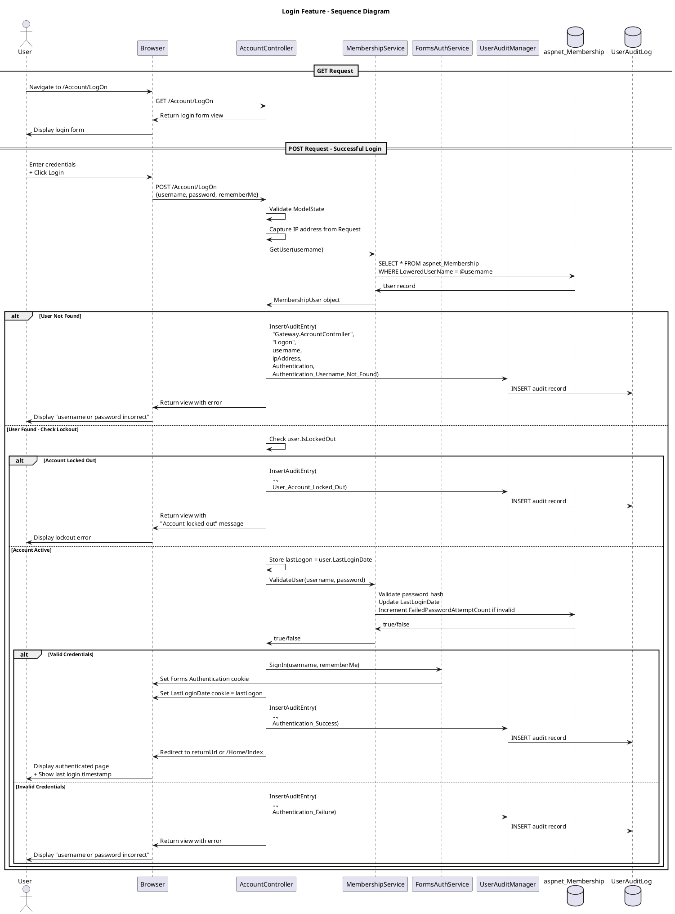

# Login Feature Specification

## Feature Overview

### Feature Name
User Authentication (Login)

### Description
Secure user authentication system that validates credentials, establishes authenticated sessions, tracks login history, and maintains comprehensive audit trails for regulatory compliance. The system implements defense-in-depth security with IP tracking, account lockout protection, and last login notification.

### Business Value
- **Security**: Prevents unauthorized access to clinical trial data and PHI (Protected Health Information)
- **Compliance**: Meets 21 CFR Part 11 electronic signature requirements for audit trails
- **User Experience**: Provides seamless authentication with "Remember Me" functionality
- **Forensics**: Enables security incident investigation through comprehensive logging
- **Awareness**: Users can detect unauthorized access through last login timestamps

### Target Personas
- **Gateway User**: Base user role requiring system access
- **Trial/Site Manager**: Extended user role managing trial participants
- **System Administrator**: Monitors authentication patterns and security events
- **Compliance Officer**: Reviews audit trails for regulatory compliance

### Work Item Reference
TFS Work Item #570 (tfscorp.itrica.com\ITRICA)

---

## Requirements

### Functional Requirements

**FR-001: Credential Validation**
- System MUST accept username and password credentials
- Username field MUST accept up to 32 characters
- Password field MUST accept up to 32 characters
- System MUST validate credentials against ASP.NET Membership Provider
- System MUST mask password input (DataType.Password)

**FR-002: Session Establishment**
- System MUST create authenticated session upon successful validation
- System MUST support Forms Authentication cookies
- System MUST support persistent authentication ("Remember Me" option)
- System MUST set cookie domain from FormsAuthentication configuration

**FR-003: Last Login Tracking**
- System MUST capture current last login timestamp BEFORE authentication
- System MUST store previous last login date in cookie (LastLoginDate)
- System MUST update user's LastLoginDate in database upon successful authentication
- System MUST display previous login timestamp to user after successful login

**FR-004: Account Status Validation**
- System MUST check if user account exists
- System MUST check if account is locked out (IsLockedOut flag)
- System MUST prevent login for locked accounts
- System MUST display specific error message for locked accounts

**FR-005: Return URL Handling**
- System MUST preserve original requested URL (returnUrl parameter)
- System MUST redirect to returnUrl after successful authentication
- System MUST redirect to Home/Index if no returnUrl specified
- System MUST prevent open redirect vulnerabilities

**FR-006: Comprehensive Audit Logging**
- System MUST log all authentication attempts (success and failure)
- System MUST log username even for failed attempts
- System MUST capture IP address for all attempts
- System MUST log specific failure reasons (username not found, locked out, invalid password)
- System MUST include timestamp for all audit entries

**FR-007: Error Handling**
- System MUST validate model state before processing
- System MUST display user-friendly error messages
- System MUST NOT reveal whether username exists (security best practice)
- System MUST redisplay login form with errors on failure

### Non-Functional Requirements

**NFR-001: Performance**
- Authentication request MUST complete within 2 seconds under normal load
- Database audit log insertion MUST NOT block authentication response
- Cookie operations MUST complete within 100ms

**NFR-002: Security**
- Passwords MUST be transmitted over HTTPS only
- Passwords MUST NOT be logged in audit trail
- Password fields MUST use secure masking (type="password")
- IP addresses MUST be captured from trusted source (UserHostAddress)
- Failed login attempts MUST increment lockout counter

**NFR-003: Reliability**
- System MUST handle null/missing user records gracefully
- System MUST handle database connection failures
- Audit logging failures MUST NOT prevent successful authentication

**NFR-004: Usability**
- Login form MUST hide breadcrumb navigation
- Error messages MUST be clear and actionable
- Form MUST preserve username on validation failure
- "Remember Me" option MUST be clearly labeled

**NFR-005: Maintainability**
- Code MUST use Code Contracts for preconditions
- Dependencies MUST use property injection pattern for testability
- Business logic MUST be separated from presentation logic

### Business Rules

**BR-001: Username Validation**
- Usernames are case-sensitive (implementation depends on membership provider configuration)
- Username MUST NOT be null or empty (validated by [Required] attribute)
- Username comparison uses exact match

**BR-002: Session Duration**
- Persistent sessions ("Remember Me" checked) duration controlled by FormsAuthentication.Timeout
- Non-persistent sessions expire on browser close
- Session cookie domain set from FormsAuthentication.CookieDomain configuration

**BR-003: Last Login Cookie**
- Cookie name: "LastLoginDate"
- Cookie value: Previous LastLoginDate as string (DateTime.ToString())
- Cookie domain: Inherited from FormsAuthentication.CookieDomain
- Cookie scope: Site-wide (not HttpOnly, for JavaScript access if needed)

**BR-004: Audit Trail Immutability**
- Audit log entries MUST be insert-only (no updates/deletes)
- Each entry includes: Controller, Action, Username, IP, AuditAction, AuditDetails, Timestamp
- Audit records retained per organizational retention policy

**BR-005: Lockout Handling**
- Locked accounts (IsLockedOut=true) cannot authenticate
- Lockout status checked before password validation
- Lockout attempts logged separately from invalid password attempts
- See Account Lockout feature specification for unlock procedures

### Compliance Requirements

**COMP-001: 21 CFR Part 11 - Electronic Signatures**
- System MUST maintain secure, computer-generated, time-stamped audit trail
- Audit trail MUST record date/time of authentication attempts
- Audit trail MUST record operator identification (username)
- Audit trail MUST be available for FDA inspection
- Audit records MUST be retained for duration of clinical trial + retention period

**COMP-002: 21 CFR Part 11 - Security**
- System MUST use authority checks to ensure only authorized individuals can use the system
- System MUST employ device checks to determine validity of authentication
- System MUST ensure authentication cannot be reused (unique sessions)

**COMP-003: GCP (Good Clinical Practice)**
- System MUST maintain audit trail of user access to clinical data
- Access attempts MUST be traceable to individual users
- Failed access attempts MUST be recorded for security review

---

## User Stories

### Story 1: Successful Login
```gherkin
Given I am an unauthenticated Gateway User
  And I have valid credentials (username: "jsmith", password: "ValidPass123!")
  And my account is not locked out
When I navigate to /Account/LogOn
  And I enter my username "jsmith"
  And I enter my password "ValidPass123!"
  And I click "Log In"
Then I should be redirected to /Home/Index
  And I should see my last login date from my previous session
  And an audit log entry should record "Authentication Success" with my IP address
  And my LastLoginDate should be updated to current timestamp
  And I should have an authenticated session cookie
  And a LastLoginDate cookie should be set with my previous login timestamp
```

### Story 2: Failed Login - Invalid Credentials
```gherkin
Given I am an unauthenticated Gateway User
  And I have a valid username "jsmith"
  And I provide an incorrect password "WrongPassword"
When I navigate to /Account/LogOn
  And I enter my username "jsmith"
  And I enter the incorrect password
  And I click "Log In"
Then I should remain on /Account/LogOn
  And I should see error message "The user name or password provided is incorrect."
  And an audit log entry should record "Authentication Failure" with my IP address
  And my failed password attempt counter should be incremented
  And I should NOT have an authenticated session
```

### Story 3: Failed Login - Username Not Found
```gherkin
Given I am an unauthenticated visitor
  And the username "nonexistent" does not exist in the system
When I navigate to /Account/LogOn
  And I enter username "nonexistent"
  And I enter any password
  And I click "Log In"
Then I should remain on /Account/LogOn
  And I should see error message "The user name or password provided is incorrect."
  And an audit log entry should record "Authentication Username Not Found" with my IP address
  And the audit log should contain the attempted username "nonexistent"
  And I should NOT have an authenticated session
```

### Story 4: Failed Login - Account Locked Out
```gherkin
Given I am a Gateway User with username "jsmith"
  And my account is locked out (IsLockedOut = true)
  And I have valid password credentials
When I navigate to /Account/LogOn
  And I enter my username "jsmith"
  And I enter my correct password
  And I click "Log In"
Then I should remain on /Account/LogOn
  And I should see error message "User account is locked out"
  And an audit log entry should record "User Account Locked Out" with my IP address
  And I should NOT have an authenticated session
  And the password validation should NOT occur (fail-fast on lockout check)
```

### Story 5: Login with Return URL
```gherkin
Given I am an unauthenticated Gateway User
  And I previously attempted to access /TrialManagement/Participants
  And the system redirected me to /Account/LogOn?ReturnUrl=%2FTrialManagement%2FParticipants
When I enter valid credentials
  And I click "Log In"
Then I should be redirected to /TrialManagement/Participants
  And I should have an authenticated session
  And the authentication should be logged
```

### Story 6: Login with Remember Me
```gherkin
Given I am an unauthenticated Gateway User
  And I have valid credentials
When I navigate to /Account/LogOn
  And I enter my valid username and password
  And I check the "Remember me?" checkbox
  And I click "Log In"
Then I should be redirected to /Home/Index
  And I should have a persistent authentication cookie
  And the cookie should persist beyond browser session
  And I should remain authenticated after browser restart
```

---

## Design

### Architecture Diagram

```plantuml
@startuml Login Architecture
!include https://raw.githubusercontent.com/plantuml-stdlib/C4-PlantUML/master/C4_Component.puml

title Login Feature - Component Diagram

Container_Boundary(web, "Web Application") {
    Component(controller, "AccountController", "ASP.NET MVC Controller", "Handles login requests and orchestrates authentication flow")
    Component(view, "LogOn View", "Razor View", "Renders login form")
    Component(formsAuth, "FormsAuthenticationService", "Authentication Service", "Manages Forms Authentication")
    Component(membership, "AccountMembershipService", "Membership Service", "Validates credentials via ASP.NET Membership")
}

Container_Boundary(business, "Business Layer") {
    Component(auditMgr, "UserAuditManager", "Audit Manager", "Records authentication events")
}

Container_Boundary(data, "Data Layer") {
    ComponentDb(membershipDb, "aspnet_Membership", "SQL Server Table", "Stores user credentials and status")
    ComponentDb(auditDb, "UserAuditLog", "SQL Server Table", "Stores audit trail")
}

Rel(controller, view, "Renders", "HTML")
Rel(view, controller, "POST credentials", "HTTP")
Rel(controller, formsAuth, "SignIn", "Interface call")
Rel(controller, membership, "ValidateUser", "Interface call")
Rel(controller, auditMgr, "InsertAuditEntry", "Method call")
Rel(membership, membershipDb, "Query user, Validate password", "ADO.NET")
Rel(auditMgr, auditDb, "Insert audit record", "Entity Framework")
Rel(formsAuth, controller, "Set cookie", "HTTP Response")

note right of auditMgr
  Logs ALL authentication attempts:
  - Username not found
  - Account locked out
  - Invalid password
  - Success

  Includes IP address for all entries
end note

note right of membership
  Uses ASP.NET Membership Provider
  - Password hashing
  - Account lockout enforcement
  - LastLoginDate update
end note

@enduml
```

#### ASCII Diagram

```
┌────────────────────────────────────────────────────────────────────┐
│              Login Feature - Component Architecture                │
└────────────────────────────────────────────────────────────────────┘

┌──────────────────────────────────────────────────────────────────────┐
│  Web Application Layer                                              │
│                                                                      │
│  ┌────────────────────┐           ┌──────────────────────────────┐  │
│  │  LogOn View        │◄──renders──│  AccountController           │  │
│  │  (Razor)           │            │  (MVC Controller)            │  │
│  │                    │            │                              │  │
│  │  - Username input  │            │  - POST LogOn(model)         │  │
│  │  - Password input  │──submits──►│  - Validate credentials      │  │
│  │  - Remember Me box │            │  - Create session            │  │
│  │  - Submit button   │            │  - Set cookies               │  │
│  └────────────────────┘            │  - Log audit events          │  │
│                                    └──┬────────┬──────────┬────────┘  │
└───────────────────────────────────────┼────────┼──────────┼───────────┘
                                        │        │          │
                                        ▼        ▼          ▼
┌───────────────────────────────────────────────────────────────────────┐
│  Business Layer                                                       │
│                                                                       │
│  ┌──────────────────────────┐  ┌──────────────────────────────────┐  │
│  │ FormsAuthenticationService│  │ AccountMembershipService         │  │
│  │                          │  │                                  │  │
│  │  - SignIn(user, persist) │  │  - GetUser(username)             │  │
│  │  - Set auth cookie       │  │  - ValidateUser(user, pass)      │  │
│  └──────────────────────────┘  └─────────────┬────────────────────┘  │
│                                               │                       │
│  ┌────────────────────────────────────────────▼───────────────────┐  │
│  │ UserAuditManager                                               │  │
│  │                                                                 │  │
│  │  - InsertAuditEntry(controller, action, user, ip, event)       │  │
│  │  - Logs: Success, Failure, Locked Out, User Not Found          │  │
│  └────────────────────────────────┬────────────────────────────────┘  │
└────────────────────────────────────┼───────────────────────────────────┘
                                     │
                                     ▼
┌───────────────────────────────────────────────────────────────────────┐
│  Data Layer (SQL Server)                                             │
│                                                                       │
│  ┌──────────────────────────┐  ┌──────────────────────────────────┐  │
│  │ aspnet_Membership        │  │ UserAuditLog                     │  │
│  ├──────────────────────────┤  ├──────────────────────────────────┤  │
│  │  UserId (PK)             │  │  AuditId (PK)                    │  │
│  │  UserName                │  │  Controller                      │  │
│  │  Password (hashed)       │  │  Action                          │  │
│  │  IsLockedOut             │  │  UserName                        │  │
│  │  LastLoginDate           │  │  IPAddress                       │  │
│  │  FailedPasswordAttempts  │  │  AuditAction                     │  │
│  │  LastLockoutDate         │  │  AuditDetails                    │  │
│  └──────────────────────────┘  │  Timestamp                       │  │
│                                 └──────────────────────────────────┘  │
└───────────────────────────────────────────────────────────────────────┘

Data Flow:
  1. User submits credentials → AccountController
  2. Controller calls MembershipService.GetUser() → aspnet_Membership
  3. Controller validates user status (not locked)
  4. Controller calls MembershipService.ValidateUser() → password hash check
  5. If valid: FormsAuthService.SignIn() → set authentication cookie
  6. UserAuditManager logs event → UserAuditLog (all attempts)
  7. Controller redirects to protected resource

Notes:
  • All authentication attempts logged (success AND failure)
  • IP address captured for forensic analysis
  • Last login cookie preserves previous login time
  • Account lockout prevents authentication before password check
```

### Workflow Diagram



#### ASCII Diagram

```
Login Feature - Sequence Diagram

User          Browser        Controller      Membership      FormsAuth      AuditMgr      DB
  │               │               │               │               │              │         │
  │               │               │               │               │              │         │
  ├──Navigate─────►               │               │               │              │         │
  │  /Account/LogOn               │               │               │              │         │
  │               ├───GET /LogOn──►               │               │              │         │
  │               │               │               │               │              │         │
  │               │◄──Login Form──┤               │               │              │         │
  │◄──Display─────┤               │               │               │              │         │
  │   Form        │               │               │               │              │         │
  │               │               │               │               │              │         │
  ├──Enter────────►               │               │               │              │         │
  │  Credentials  │               │               │               │              │         │
  │  + Click      │               │               │               │              │         │
  │  Login        │               │               │               │              │         │
  │               ├──POST LogOn───►               │               │              │         │
  │               │ {user,pass,   │               │               │              │         │
  │               │  rememberMe}  │               │               │              │         │
  │               │               │               │               │              │         │
  │               │               ├─Validate─────►│               │              │         │
  │               │               │  ModelState   │               │              │         │
  │               │               │               │               │              │         │
  │               │               ├──GetUser(user)────────────────────────────────►        │
  │               │               │               │               │              │         │
  │               │               │◄──User Record─────────────────────────────────────────┤
  │               │               │               │               │              │         │
  │               │               │               │               │              │         │
  │               │    ┌──────────┴───────────┐   │               │              │         │
  │               │    │ IF User Not Found    │   │               │              │         │
  │               │    └──────────┬───────────┘   │               │              │         │
  │               │               ├───────────InsertAuditEntry("User_Not_Found")──►        │
  │               │               │               │               │              ├─INSERT──►
  │               │◄──Error Msg───┤               │               │              │         │
  │◄──Display─────┤  "Invalid"    │               │               │              │         │
  │   Error       │               │               │               │              │         │
  │               │               │               │               │              │         │
  │               │    ┌──────────┴───────────┐   │               │              │         │
  │               │    │ IF User.IsLockedOut  │   │               │              │         │
  │               │    └──────────┬───────────┘   │               │              │         │
  │               │               ├───────────InsertAuditEntry("Locked_Out")──────►        │
  │               │               │               │               │              ├─INSERT──►
  │               │◄──Error Msg───┤               │               │              │         │
  │◄──Display─────┤  "Account     │               │               │              │         │
  │   Locked      │   Locked"     │               │               │              │         │
  │               │               │               │               │              │         │
  │               │    ┌──────────┴───────────┐   │               │              │         │
  │               │    │ ELSE Account Active  │   │               │              │         │
  │               │    └──────────┬───────────┘   │               │              │         │
  │               │               ├─Store lastLogon = user.LastLoginDate          │         │
  │               │               │               │               │              │         │
  │               │               ├──ValidateUser(user, pass)─────────────────────►        │
  │               │               │               │               │              │         │
  │               │               │◄──true/false──────────────────────────────────────────┤
  │               │               │               │               │              │         │
  │               │    ┌──────────┴───────────┐   │               │              │         │
  │               │    │ IF Valid Credentials │   │               │              │         │
  │               │    └──────────┬───────────┘   │               │              │         │
  │               │               ├──SignIn(user, rememberMe)─────►              │         │
  │               │               │               │               │              │         │
  │               │◄──────────────┼───────────────┼──Set Auth Cookie──           │         │
  │               │               │               │               │              │         │
  │               │◄──Set Cookie──┤ LastLoginDate = lastLogon     │              │         │
  │               │  (last login) │               │               │              │         │
  │               │               │               │               │              │         │
  │               │               ├───────────InsertAuditEntry("Success")─────────►        │
  │               │               │               │               │              ├─INSERT──►
  │               │               │               │               │              │         │
  │               │◄──Redirect────┤ to returnUrl or /Home/Index   │              │         │
  │               │               │               │               │              │         │
  │◄──Display─────┤               │               │               │              │         │
  │   Protected   │               │               │               │              │         │
  │   Page +      │               │               │               │              │         │
  │   Last Login  │               │               │               │              │         │
  │               │               │               │               │              │         │
  │               │    ┌──────────┴───────────┐   │               │              │         │
  │               │    │ ELSE Invalid Password│   │               │              │         │
  │               │    └──────────┬───────────┘   │               │              │         │
  │               │               ├───────────InsertAuditEntry("Auth_Failure")────►        │
  │               │               │               │               │              ├─INSERT──►
  │               │◄──Error Msg───┤               │               │              │         │
  │◄──Display─────┤  "Invalid"    │               │               │              │         │
  │   Error       │               │               │               │              │         │
  │               │               │               │               │              │         │

Key Audit Events Logged:
  • Authentication_Username_Not_Found
  • User_Account_Locked_Out
  • Authentication_Failure (invalid password)
  • Authentication_Success

All audit entries include:
  - Controller: "Gateway.AccountController"
  - Action: "Logon"
  - Username: <entered username>
  - IPAddress: Request.UserHostAddress
  - Timestamp: DateTime.Now

Security Features:
  1. Password never logged
  2. Lockout checked BEFORE password validation
  3. Generic error message ("username or password incorrect")
  4. IP address captured for forensics
  5. Last login cookie preserves previous login time
```

### Data Model

#### Entities

**aspnet_Membership** (ASP.NET Framework Table)
```
Table: aspnet_Membership
├── ApplicationId (uniqueidentifier, FK)
├── UserId (uniqueidentifier, PK, FK to aspnet_Users)
├── Password (nvarchar(128)) - Hashed
├── PasswordFormat (int) - 0=Clear, 1=Hashed, 2=Encrypted
├── PasswordSalt (nvarchar(128))
├── Email (nvarchar(256))
├── LoweredEmail (nvarchar(256)) - Indexed
├── PasswordQuestion (nvarchar(256))
├── PasswordAnswer (nvarchar(128)) - Hashed
├── IsApproved (bit)
├── IsLockedOut (bit) - Used by login flow
├── CreateDate (datetime)
├── LastLoginDate (datetime) - Updated on successful login
├── LastPasswordChangedDate (datetime)
├── LastLockoutDate (datetime)
├── FailedPasswordAttemptCount (int)
├── FailedPasswordAttemptWindowStart (datetime)
├── FailedPasswordAnswerAttemptCount (int)
└── FailedPasswordAnswerAttemptWindowStart (datetime)

Indexes:
- PK_aspnet_Membership (UserId)
- IX_aspnet_Membership_Email
- IX_aspnet_Membership_LoweredEmail
```

**UserAuditLog** (Custom Audit Table)
```
Table: UserAuditLog
├── UserAuditLogID (int, PK, Identity)
├── UserAspNetID (uniqueidentifier, FK to aspnet_Users) - May be Guid.Empty for failed logins
├── UserName (nvarchar(256)) - Captured even if user not found
├── ControllerName (nvarchar(256)) - "Gateway.AccountController"
├── ActionName (nvarchar(256)) - "Logon"
├── AuditAction (nvarchar(256)) - "Authentication", "Session", etc.
├── Details (nvarchar(max)) - Specific outcome (e.g., "Authentication Success")
├── IPAddress (nvarchar(45)) - IPv4 or IPv6
└── CreatedOn (datetime) - Timestamp of event

Indexes:
- PK_UserAuditLog (UserAuditLogID)
- IX_UserAuditLog_UserName (for user-specific queries)
- IX_UserAuditLog_CreatedOn (for time-based queries)
- IX_UserAuditLog_IPAddress (for security analysis)
```

**HTTP Cookies**
```
Cookie: .ASPXAUTH (Forms Authentication)
├── Name: .ASPXAUTH (from FormsAuthentication config)
├── Value: Encrypted authentication ticket
├── Domain: From FormsAuthentication.CookieDomain
├── Path: /
├── Secure: true (HTTPS only)
├── HttpOnly: true (not accessible via JavaScript)
└── Expires: Persistent if RememberMe=true, else session cookie

Cookie: LastLoginDate (Custom)
├── Name: LastLoginDate
├── Value: Previous LastLoginDate.ToString()
├── Domain: From FormsAuthentication.CookieDomain
├── Path: /
├── Secure: Should be true (HTTPS only)
├── HttpOnly: false (may need JavaScript access)
└── Expires: Session cookie (cleared on logout)
```

#### Relationships

```
aspnet_Applications 1---* aspnet_Membership
aspnet_Users 1---1 aspnet_Membership
aspnet_Users 1---* UserAuditLog (UserAspNetID)
```

### API Contracts

#### Endpoint: GET /Account/LogOn

**Purpose**: Display login form

**Request**:
```http
GET /Account/LogOn?returnUrl=/TrialManagement/Participants HTTP/1.1
Host: gateway.itrica.com
```

**Query Parameters**:
- `returnUrl` (optional): URL to redirect to after successful login

**Response**: 200 OK
```html
<!-- Razor view rendered with empty LogOnModel -->
<form action="/Account/LogOn?returnUrl=/TrialManagement/Participants" method="post">
  <input name="UserName" type="text" maxlength="32" />
  <input name="Password" type="password" maxlength="32" />
  <input name="RememberMe" type="checkbox" />
  <button type="submit">Log In</button>
</form>
```

**View Data**:
```csharp
ViewData["BreadCrumb.Hide"] = true;
```

---

#### Endpoint: POST /Account/LogOn

**Purpose**: Authenticate user credentials

**Request**:
```http
POST /Account/LogOn?returnUrl=/TrialManagement/Participants HTTP/1.1
Host: gateway.itrica.com
Content-Type: application/x-www-form-urlencoded

UserName=jsmith&Password=SecurePass123&RememberMe=true
```

**Request Model**:
```csharp
public class LogOnModel
{
    [Required]
    [DisplayName("User name")]
    [StringLength(32)]
    public string UserName { get; set; }

    [Required]
    [DataType(DataType.Password)]
    [DisplayName("Password")]
    [StringLength(32)]
    public string Password { get; set; }

    [DisplayName("Remember me?")]
    public bool RememberMe { get; set; }
}
```

**Validation Rules**:
- UserName: Required, max length 32
- Password: Required, max length 32, masked input
- RememberMe: Optional boolean

**Response - Success**: 302 Found
```http
HTTP/1.1 302 Found
Location: /TrialManagement/Participants
Set-Cookie: .ASPXAUTH=<encrypted-ticket>; path=/; HttpOnly; Secure
Set-Cookie: LastLoginDate=12/15/2025 10:30:45 AM; path=/; domain=.itrica.com
```

**Response - Validation Error**: 200 OK
```html
<!-- Form redisplayed with validation errors -->
<div class="validation-summary-errors">
  <ul>
    <li>The User name field is required.</li>
  </ul>
</div>
```

**Response - Authentication Error**: 200 OK
```html
<!-- Form redisplayed with authentication error -->
<div class="validation-summary-errors">
  <ul>
    <li>The user name or password provided is incorrect.</li>
  </ul>
</div>
```

**View Data** (on failure):
```csharp
ViewData["Failed"] = true;
ViewData["FailedLogin.Reason"] = "User account is locked out"; // For lockout case
```

**Response - Account Locked**: 200 OK
```html
<!-- Form redisplayed with lockout message -->
<div class="validation-summary-errors">
  <ul>
    <li>User account is locked out</li>
  </ul>
</div>
```

---

## Implementation Details

### Technology Stack

**Framework**:
- ASP.NET MVC 4.x/5.x (.NET Framework)
- C# language
- Razor view engine

**Authentication**:
- ASP.NET Membership Provider (System.Web.Security)
- Forms Authentication
- SQL Server Membership database schema

**Data Access**:
- Entity Framework (for UserAuditLog)
- ADO.NET (via Membership Provider for aspnet_Membership)

**Validation**:
- Data Annotations (System.ComponentModel.DataAnnotations)
- ModelState validation
- Code Contracts (System.Diagnostics.Contracts)

### Dependencies

**NuGet Packages** (typical):
```xml
<packages>
  <package id="Microsoft.AspNet.Mvc" version="5.x" />
  <package id="EntityFramework" version="6.x" />
  <package id="Microsoft.CodeContracts" version="1.x" />
</packages>
```

**Project References**:
```
OoBDev.Web.Controllers
├── OoBDev.Web.Models (AccountModels namespace)
├── OoBDev.Gateway.Access (UserAuditManager)
├── OoBDev.Gateway.Data (GatewayEntities)
├── OoBDev.Gateway.Models (UserAuditLog entity)
└── OoBDev.Web.Mvc (RerouteController, ProcessedController)
```

**External Dependencies**:
- System.Web.Mvc
- System.Web.Security (Membership, FormsAuthentication)
- System.Diagnostics.Contracts
- System.Configuration

### Security Considerations

**Password Security**:
- Passwords transmitted only over HTTPS (enforce at load balancer/IIS)
- Passwords never logged in plain text
- Passwords hashed using ASP.NET Membership provider (configurable algorithm)
- Password fields use `DataType.Password` for masking
- Password validation uses constant-time comparison (built into Membership provider)

**IP Address Tracking**:
```csharp
ipAddress = requestContext.HttpContext.Request.UserHostAddress;
```
- Captures from `Request.UserHostAddress`
- If behind load balancer, configure to forward real IP (X-Forwarded-For)
- Logged for all authentication attempts (success and failure)
- Used for forensic analysis and geographic access patterns

**Audit Trail Security**:
- Audit records are insert-only (no UPDATE or DELETE operations)
- UserAuditManager creates new GatewayEntities context per insert (transaction isolation)
- Failed login usernames captured for security monitoring
- IP addresses enable brute-force detection

**Session Security**:
- Forms Authentication cookie encrypted (machineKey configuration)
- Cookie marked HttpOnly to prevent XSS attacks
- Cookie marked Secure (HTTPS only) in production
- Session timeout configured via FormsAuthentication.Timeout
- Anti-forgery tokens should be used on POST (not shown in code, consider adding)

**Information Disclosure Prevention**:
- Generic error message for invalid credentials ("username or password incorrect")
- Same message for username not found and invalid password
- Prevents username enumeration attacks
- Specific lockout message acceptable (user needs to know to contact admin)

**Code Contracts**:
```csharp
Contract.Requires(model != null);
Contract.Assume(!string.IsNullOrWhiteSpace(model.UserName));
Contract.Assume(!string.IsNullOrWhiteSpace(model.Password));
```
- Preconditions enforce non-null model
- Assumptions assert validation already performed by ModelState
- Helps static analysis detect potential null reference issues
- **Note**: Code Contracts deprecated; consider migration to nullable reference types in .NET 6+

### Code Patterns

**Pattern 1: Property Injection for Testability**
```csharp
public IFormsAuthenticationService FormsService { get; set; }
public IMembershipService MembershipService { get; set; }

protected override void Initialize(RequestContext requestContext)
{
    if (FormsService == null) { FormsService = new FormsAuthenticationService(); }
    if (MembershipService == null) { MembershipService = new AccountMembershipService(); }

    base.Initialize(requestContext);
}
```
**Benefits**:
- Unit tests can inject mock services
- Production code uses default implementations
- No DI container required

**From CODE_REVIEW.md Section 6**: Manual dependency injection pattern

---

**Pattern 2: Last Login Cookie Strategy**
```csharp
// Capture CURRENT last login BEFORE authentication updates it
var lastLogon = selecteduser == null ? DateTime.Now : selecteduser.LastLoginDate;

if (MembershipService.ValidateUser(model.UserName, model.Password))
{
    FormsService.SignIn(model.UserName, model.RememberMe);

    // Store PREVIOUS last logon for display to user
    var newCookie = new HttpCookie(LastLoginDateCookieName, lastLogon.ToString())
    {
        Domain = FormsAuthentication.CookieDomain,
    };
    Response.AppendCookie(newCookie);

    // Database LastLoginDate now updated to current time by ValidateUser
}
```
**Benefits**:
- User sees their PREVIOUS login time (not the current one)
- Enables unauthorized access detection
- Simple cookie-based implementation
- No additional database query required

**From CODE_REVIEW.md Section 5**: Last Login Cookie Pattern

---

**Pattern 3: Comprehensive Audit Logging**
```csharp
var auditManager = new UserAuditManager();

// Log username not found
if (selecteduser == null)
{
    auditManager.InsertAuditEntry(
        "Gateway.AccountController",
        "Logon",
        model.UserName,  // Log attempted username
        ipAddress,
        UserAuditActions.Authentication,
        UserAuditDetails.Authentication_Username_Not_Found
    );
}

// Log account locked out
if (selecteduser.IsLockedOut)
{
    auditManager.InsertAuditEntry(
        "Gateway.AccountController",
        "Logon",
        model.UserName,
        ipAddress,
        UserAuditActions.Authentication,
        UserAuditDetails.User_Account_Locked_Out
    );
}

// Log successful authentication
auditManager.InsertAuditEntry(
    "Gateway.AccountController",
    "Logon",
    model.UserName,
    ipAddress,
    UserAuditActions.Authentication,
    UserAuditDetails.Authentication_Success
);
```
**Benefits**:
- Every authentication attempt logged
- Detailed failure reasons (username not found, locked out, invalid password)
- IP address captured for forensics
- Meets 21 CFR Part 11 audit trail requirements

**From CODE_REVIEW.md Section 2**: Comprehensive Audit Logging

---

**Pattern 4: Fail-Fast on Account Lockout**
```csharp
if (selecteduser == null)
{
    auditManager.InsertAuditEntry(..., Authentication_Username_Not_Found);
}
else
{
    if (selecteduser.IsLockedOut)
    {
        auditManager.InsertAuditEntry(..., User_Account_Locked_Out);
        ViewData["FailedLogin.Reason"] = "User account is locked out";
    }
}

// Only validate password if user exists AND not locked out
if (MembershipService.ValidateUser(model.UserName, model.Password))
{
    // ...
}
```
**Benefits**:
- Locked accounts fail immediately (before password check)
- Prevents password validation for locked accounts
- Clear separation of failure reasons in audit log
- User-friendly error message for lockout case

---

**Pattern 5: IP Address Capture in Initialize()**
```csharp
string ipAddress;

protected override void Initialize(RequestContext requestContext)
{
    // ... service initialization ...

    ipAddress = requestContext.HttpContext.Request.UserHostAddress;

    base.Initialize(requestContext);
}
```
**Benefits**:
- IP captured once per request (controller-level field)
- Available to all action methods
- Consistent IP logging across all actions

**From CODE_REVIEW.md Section 7**: IP Address Tracking

---

**Configuration Example** (Web.config):
```xml
<configuration>
  <system.web>
    <authentication mode="Forms">
      <forms
        name=".ASPXAUTH"
        loginUrl="~/Account/LogOn"
        timeout="30"
        slidingExpiration="true"
        cookieless="UseCookies"
        requireSSL="true"
        protection="All"
        domain=".itrica.com" />
    </authentication>

    <membership defaultProvider="OoBDevMembershipProvider">
      <providers>
        <clear />
        <add
          name="OoBDevMembershipProvider"
          type="System.Web.Security.SqlMembershipProvider"
          connectionStringName="GatewayDatabase"
          applicationName="/Gateway"
          enablePasswordRetrieval="false"
          enablePasswordReset="true"
          requiresQuestionAndAnswer="true"
          requiresUniqueEmail="false"
          passwordFormat="Hashed"
          maxInvalidPasswordAttempts="5"
          minRequiredPasswordLength="8"
          minRequiredNonalphanumericCharacters="1"
          passwordAttemptWindow="10"
          passwordStrengthRegularExpression="" />
      </providers>
    </membership>
  </system.web>
</configuration>
```

---

## Acceptance Criteria

**AC-001**: Given valid credentials, user can successfully log in
- User navigates to /Account/LogOn
- User enters valid username and password
- User clicks "Log In"
- System redirects to home page or returnUrl
- User has authenticated session
- Audit log contains "Authentication Success" entry with IP address

**AC-002**: Given invalid credentials, login fails with appropriate message
- User enters valid username but incorrect password
- System displays "The user name or password provided is incorrect."
- System does NOT reveal whether username exists
- Audit log contains "Authentication Failure" entry
- FailedPasswordAttemptCount incremented in database

**AC-003**: Given non-existent username, login fails without revealing non-existence
- User enters username that doesn't exist
- System displays same generic error message
- Audit log contains "Authentication Username Not Found" entry
- Audit log records the attempted username

**AC-004**: Given locked account, login fails with lockout message
- User account has IsLockedOut = true
- User enters valid credentials
- System displays "User account is locked out"
- Audit log contains "User Account Locked Out" entry
- Password validation does NOT occur

**AC-005**: Last login date is preserved and displayed
- User logs in successfully
- System captures current LastLoginDate before authentication
- System stores previous LastLoginDate in cookie
- System updates database LastLoginDate to current timestamp
- User sees previous login timestamp on subsequent page

**AC-006**: Return URL preserves navigation context
- User attempts to access protected page /TrialManagement/Participants
- System redirects to /Account/LogOn?ReturnUrl=/TrialManagement/Participants
- User logs in successfully
- System redirects to /TrialManagement/Participants

**AC-007**: Remember Me creates persistent session
- User checks "Remember me?" checkbox
- User logs in successfully
- System creates persistent authentication cookie
- User closes browser and reopens
- User remains authenticated (within timeout period)

**AC-008**: All authentication attempts are audited
- Every login attempt (success/failure) creates audit record
- Audit record includes: Controller, Action, Username, IP, Timestamp, Result
- Failed attempts include specific reason (username not found, lockout, invalid password)
- Audit records are insert-only (immutable)

**AC-009**: IP addresses are captured for all requests
- System captures IP from Request.UserHostAddress
- IP address included in all audit log entries
- IP address visible in audit reports for security analysis

**AC-010**: Validation errors are displayed clearly
- Missing username shows "The User name field is required."
- Missing password shows "The Password field is required."
- Form redisplays with validation errors
- Username field preserves entered value
- Password field is cleared for security

---

## Test Scenarios

### Unit Tests

**Test Class**: `AccountControllerTests`

**Test**: `LogOn_POST_ValidCredentials_RedirectsToHome`
```csharp
[TestMethod]
public void LogOn_POST_ValidCredentials_RedirectsToHome()
{
    // Arrange
    var mockMembership = new Mock<IMembershipService>();
    mockMembership.Setup(m => m.ValidateUser("jsmith", "ValidPass123")).Returns(true);

    var mockForms = new Mock<IFormsAuthenticationService>();

    var controller = new AccountController
    {
        MembershipService = mockMembership.Object,
        FormsService = mockForms.Object
    };

    var model = new LogOnModel
    {
        UserName = "jsmith",
        Password = "ValidPass123",
        RememberMe = false
    };

    // Act
    var result = controller.LogOn(model, null) as RedirectToRouteResult;

    // Assert
    Assert.IsNotNull(result);
    Assert.AreEqual("Index", result.RouteValues["action"]);
    Assert.AreEqual("Home", result.RouteValues["controller"]);
    mockForms.Verify(f => f.SignIn("jsmith", false), Times.Once);
}
```

**Test**: `LogOn_POST_InvalidCredentials_ReturnsViewWithError`
```csharp
[TestMethod]
public void LogOn_POST_InvalidCredentials_ReturnsViewWithError()
{
    // Arrange
    var mockMembership = new Mock<IMembershipService>();
    mockMembership.Setup(m => m.ValidateUser("jsmith", "WrongPass")).Returns(false);

    var controller = new AccountController
    {
        MembershipService = mockMembership.Object,
        FormsService = new Mock<IFormsAuthenticationService>().Object
    };

    var model = new LogOnModel
    {
        UserName = "jsmith",
        Password = "WrongPass"
    };

    // Act
    var result = controller.LogOn(model, null) as ViewResult;

    // Assert
    Assert.IsNotNull(result);
    Assert.IsFalse(controller.ModelState.IsValid);
    Assert.IsTrue(controller.ModelState[""].Errors.Any(e =>
        e.ErrorMessage.Contains("user name or password provided is incorrect")));
}
```

**Test**: `LogOn_POST_LockedAccount_ReturnsViewWithLockoutMessage`
```csharp
[TestMethod]
public void LogOn_POST_LockedAccount_ReturnsViewWithLockoutMessage()
{
    // Arrange
    var lockedUser = new Mock<MembershipUser>();
    lockedUser.Setup(u => u.IsLockedOut).Returns(true);

    var mockMembership = new Mock<IMembershipService>();
    // Setup Membership.GetUser(username) to return locked user

    var controller = new AccountController
    {
        MembershipService = mockMembership.Object
    };

    var model = new LogOnModel
    {
        UserName = "locked_user",
        Password = "AnyPass123"
    };

    // Act
    var result = controller.LogOn(model, null) as ViewResult;

    // Assert
    Assert.IsNotNull(result);
    Assert.AreEqual("User account is locked out", controller.ViewData["FailedLogin.Reason"]);
}
```

**Test**: `LogOn_POST_ValidCredentials_CreatesLastLoginCookie`
```csharp
[TestMethod]
public void LogOn_POST_ValidCredentials_CreatesLastLoginCookie()
{
    // Arrange
    var previousLoginDate = new DateTime(2025, 1, 1, 10, 30, 0);
    var mockUser = new Mock<MembershipUser>();
    mockUser.Setup(u => u.LastLoginDate).Returns(previousLoginDate);
    mockUser.Setup(u => u.IsLockedOut).Returns(false);

    var mockMembership = new Mock<IMembershipService>();
    mockMembership.Setup(m => m.ValidateUser("jsmith", "ValidPass")).Returns(true);

    var mockHttpContext = new Mock<HttpContextBase>();
    var mockResponse = new Mock<HttpResponseBase>();
    var cookies = new HttpCookieCollection();
    mockResponse.Setup(r => r.AppendCookie(It.IsAny<HttpCookie>()))
        .Callback<HttpCookie>(c => cookies.Add(c));
    mockHttpContext.Setup(c => c.Response).Returns(mockResponse.Object);

    var controller = new AccountController
    {
        MembershipService = mockMembership.Object,
        FormsService = new Mock<IFormsAuthenticationService>().Object
    };
    // Inject mock context

    var model = new LogOnModel { UserName = "jsmith", Password = "ValidPass" };

    // Act
    controller.LogOn(model, null);

    // Assert
    var lastLoginCookie = cookies["LastLoginDate"];
    Assert.IsNotNull(lastLoginCookie);
    Assert.AreEqual(previousLoginDate.ToString(), lastLoginCookie.Value);
}
```

**Test**: `LogOn_POST_WithReturnUrl_RedirectsToReturnUrl`
```csharp
[TestMethod]
public void LogOn_POST_WithReturnUrl_RedirectsToReturnUrl()
{
    // Arrange
    var mockMembership = new Mock<IMembershipService>();
    mockMembership.Setup(m => m.ValidateUser("jsmith", "ValidPass")).Returns(true);

    var controller = new AccountController
    {
        MembershipService = mockMembership.Object,
        FormsService = new Mock<IFormsAuthenticationService>().Object
    };

    var model = new LogOnModel { UserName = "jsmith", Password = "ValidPass" };
    var returnUrl = "/TrialManagement/Participants";

    // Act
    var result = controller.LogOn(model, returnUrl) as RedirectResult;

    // Assert
    Assert.IsNotNull(result);
    Assert.AreEqual(returnUrl, result.Url);
}
```

### Integration Tests

**Test**: `Login_EndToEnd_ValidCredentials_Success`
```csharp
[TestMethod]
public void Login_EndToEnd_ValidCredentials_Success()
{
    // Arrange
    var username = "integration_test_user";
    var password = "TestPass123!";
    CreateTestUser(username, password, isLockedOut: false);

    var client = CreateTestClient();

    // Act
    var response = client.PostAsync("/Account/LogOn", new FormUrlEncodedContent(new[]
    {
        new KeyValuePair<string, string>("UserName", username),
        new KeyValuePair<string, string>("Password", password),
        new KeyValuePair<string, string>("RememberMe", "false")
    })).Result;

    // Assert
    Assert.AreEqual(HttpStatusCode.Redirect, response.StatusCode);
    Assert.IsTrue(response.Headers.Location.AbsolutePath.Contains("Home/Index"));

    // Verify cookie created
    var authCookie = response.Headers.GetValues("Set-Cookie")
        .FirstOrDefault(c => c.StartsWith(".ASPXAUTH"));
    Assert.IsNotNull(authCookie);

    // Verify audit log entry
    var auditEntry = GetLatestAuditEntry(username);
    Assert.IsNotNull(auditEntry);
    Assert.AreEqual("Authentication Success", auditEntry.Details);
    Assert.IsNotNull(auditEntry.IPAddress);

    // Cleanup
    DeleteTestUser(username);
}
```

**Test**: `Login_EndToEnd_InvalidPassword_Failure`
```csharp
[TestMethod]
public void Login_EndToEnd_InvalidPassword_Failure()
{
    // Arrange
    var username = "integration_test_user";
    var correctPassword = "TestPass123!";
    var wrongPassword = "WrongPassword";
    CreateTestUser(username, correctPassword, isLockedOut: false);

    var client = CreateTestClient();

    // Act
    var response = client.PostAsync("/Account/LogOn", new FormUrlEncodedContent(new[]
    {
        new KeyValuePair<string, string>("UserName", username),
        new KeyValuePair<string, string>("Password", wrongPassword)
    })).Result;

    // Assert
    Assert.AreEqual(HttpStatusCode.OK, response.StatusCode); // Form redisplayed
    var content = response.Content.ReadAsStringAsync().Result;
    Assert.IsTrue(content.Contains("user name or password provided is incorrect"));

    // Verify no auth cookie
    var authCookie = response.Headers.GetValues("Set-Cookie")
        .FirstOrDefault(c => c.StartsWith(".ASPXAUTH"));
    Assert.IsNull(authCookie);

    // Verify audit log entry
    var auditEntry = GetLatestAuditEntry(username);
    Assert.AreEqual("Authentication Failure", auditEntry.Details);

    // Verify failed attempt counter incremented
    var user = Membership.GetUser(username);
    Assert.IsTrue(user.FailedPasswordAttemptCount > 0);

    // Cleanup
    DeleteTestUser(username);
}
```

**Test**: `Login_EndToEnd_LockedAccount_Failure`
```csharp
[TestMethod]
public void Login_EndToEnd_LockedAccount_Failure()
{
    // Arrange
    var username = "locked_test_user";
    var password = "TestPass123!";
    CreateTestUser(username, password, isLockedOut: true);

    var client = CreateTestClient();

    // Act
    var response = client.PostAsync("/Account/LogOn", new FormUrlEncodedContent(new[]
    {
        new KeyValuePair<string, string>("UserName", username),
        new KeyValuePair<string, string>("Password", password)
    })).Result;

    // Assert
    Assert.AreEqual(HttpStatusCode.OK, response.StatusCode);
    var content = response.Content.ReadAsStringAsync().Result;
    Assert.IsTrue(content.Contains("User account is locked out"));

    // Verify audit log
    var auditEntry = GetLatestAuditEntry(username);
    Assert.AreEqual("User Account Locked Out", auditEntry.Details);

    // Cleanup
    DeleteTestUser(username);
}
```

**Test**: `Login_LastLoginCookie_CreatedCorrectly`
```csharp
[TestMethod]
public void Login_LastLoginCookie_CreatedCorrectly()
{
    // Arrange
    var username = "lastlogin_test_user";
    var password = "TestPass123!";
    var previousLoginDate = DateTime.Now.AddDays(-1);
    CreateTestUser(username, password, lastLoginDate: previousLoginDate);

    var client = CreateTestClient();

    // Act
    var response = client.PostAsync("/Account/LogOn", new FormUrlEncodedContent(new[]
    {
        new KeyValuePair<string, string>("UserName", username),
        new KeyValuePair<string, string>("Password", password)
    })).Result;

    // Assert
    var lastLoginCookie = response.Headers.GetValues("Set-Cookie")
        .FirstOrDefault(c => c.StartsWith("LastLoginDate"));
    Assert.IsNotNull(lastLoginCookie);

    // Extract cookie value
    var cookieValue = ExtractCookieValue(lastLoginCookie);
    var cookieDate = DateTime.Parse(cookieValue);

    // Verify it's the PREVIOUS login date (not current)
    Assert.IsTrue(Math.Abs((cookieDate - previousLoginDate).TotalSeconds) < 5);

    // Verify database updated to current time
    var user = Membership.GetUser(username);
    Assert.IsTrue((DateTime.Now - user.LastLoginDate).TotalSeconds < 5);

    // Cleanup
    DeleteTestUser(username);
}
```

### Security Tests

**Test**: `Security_PasswordNotLoggedInAuditTrail`
```csharp
[TestMethod]
public void Security_PasswordNotLoggedInAuditTrail()
{
    // Arrange
    var username = "security_test_user";
    var password = "SecretPassword123!";
    CreateTestUser(username, password);

    var client = CreateTestClient();

    // Act - Attempt login
    var response = client.PostAsync("/Account/LogOn", new FormUrlEncodedContent(new[]
    {
        new KeyValuePair<string, string>("UserName", username),
        new KeyValuePair<string, string>("Password", password)
    })).Result;

    // Assert - Verify password NOT in audit log
    var auditEntries = GetAllAuditEntriesForUser(username);
    foreach (var entry in auditEntries)
    {
        Assert.IsFalse(entry.Details.Contains(password));
        Assert.IsFalse(entry.ControllerName.Contains(password));
        Assert.IsFalse(entry.ActionName.Contains(password));
    }

    // Cleanup
    DeleteTestUser(username);
}
```

**Test**: `Security_UsernameEnumerationPrevention`
```csharp
[TestMethod]
public void Security_UsernameEnumerationPrevention()
{
    // Arrange
    var existingUser = "existing_user";
    var nonExistentUser = "nonexistent_user_12345";
    var password = "AnyPassword123!";
    CreateTestUser(existingUser, password);

    var client = CreateTestClient();

    // Act - Try invalid password for existing user
    var response1 = client.PostAsync("/Account/LogOn", new FormUrlEncodedContent(new[]
    {
        new KeyValuePair<string, string>("UserName", existingUser),
        new KeyValuePair<string, string>("Password", "WrongPassword")
    })).Result;
    var content1 = response1.Content.ReadAsStringAsync().Result;

    // Act - Try any password for non-existent user
    var response2 = client.PostAsync("/Account/LogOn", new FormUrlEncodedContent(new[]
    {
        new KeyValuePair<string, string>("UserName", nonExistentUser),
        new KeyValuePair<string, string>("Password", password)
    })).Result;
    var content2 = response2.Content.ReadAsStringAsync().Result;

    // Assert - Both show SAME error message
    var errorMessage = "user name or password provided is incorrect";
    Assert.IsTrue(content1.Contains(errorMessage));
    Assert.IsTrue(content2.Contains(errorMessage));
    Assert.AreEqual(
        ExtractErrorMessage(content1),
        ExtractErrorMessage(content2),
        "Error messages should be identical to prevent username enumeration"
    );

    // Cleanup
    DeleteTestUser(existingUser);
}
```

**Test**: `Security_IPAddressCapturedForAllAttempts`
```csharp
[TestMethod]
public void Security_IPAddressCapturedForAllAttempts()
{
    // Arrange
    var username = "ip_test_user";
    var password = "TestPass123!";
    CreateTestUser(username, password);

    var client = CreateTestClient();
    var expectedIP = "192.168.1.100"; // Mock client IP

    // Act - Multiple login attempts (success, failure, locked)
    var scenarios = new[]
    {
        new { User = username, Pass = password, Expected = "Authentication Success" },
        new { User = username, Pass = "WrongPass", Expected = "Authentication Failure" },
        new { User = "nonexistent", Pass = password, Expected = "Authentication Username Not Found" }
    };

    foreach (var scenario in scenarios)
    {
        client.PostAsync("/Account/LogOn", new FormUrlEncodedContent(new[]
        {
            new KeyValuePair<string, string>("UserName", scenario.User),
            new KeyValuePair<string, string>("Password", scenario.Pass)
        })).Wait();

        // Verify IP address logged
        var auditEntry = GetLatestAuditEntry(scenario.User);
        Assert.IsNotNull(auditEntry.IPAddress,
            $"IP address should be captured for {scenario.Expected}");
        Assert.IsFalse(string.IsNullOrWhiteSpace(auditEntry.IPAddress));
    }

    // Cleanup
    DeleteTestUser(username);
}
```

**Test**: `Security_SessionCookieHttpOnlyAndSecure`
```csharp
[TestMethod]
public void Security_SessionCookieHttpOnlyAndSecure()
{
    // Arrange
    var username = "cookie_security_user";
    var password = "TestPass123!";
    CreateTestUser(username, password);

    var client = CreateTestClient();

    // Act
    var response = client.PostAsync("/Account/LogOn", new FormUrlEncodedContent(new[]
    {
        new KeyValuePair<string, string>("UserName", username),
        new KeyValuePair<string, string>("Password", password)
    })).Result;

    // Assert
    var authCookie = response.Headers.GetValues("Set-Cookie")
        .FirstOrDefault(c => c.StartsWith(".ASPXAUTH"));

    Assert.IsNotNull(authCookie);
    Assert.IsTrue(authCookie.Contains("HttpOnly"), "Auth cookie should be HttpOnly");
    Assert.IsTrue(authCookie.Contains("Secure"), "Auth cookie should be Secure (HTTPS only)");

    // Cleanup
    DeleteTestUser(username);
}
```

---

## Migration/Deployment Considerations

### Database Schema

**Prerequisites**:
- ASP.NET Membership schema installed (`aspnet_regsql.exe`)
- UserAuditLog table created (custom schema)

**Schema Script**:
```sql
-- Create UserAuditLog table if not exists
IF NOT EXISTS (SELECT * FROM sys.tables WHERE name = 'UserAuditLog')
BEGIN
    CREATE TABLE [dbo].[UserAuditLog] (
        [UserAuditLogID] INT IDENTITY(1,1) NOT NULL,
        [UserAspNetID] UNIQUEIDENTIFIER NULL,
        [UserName] NVARCHAR(256) NOT NULL,
        [ControllerName] NVARCHAR(256) NOT NULL,
        [ActionName] NVARCHAR(256) NOT NULL,
        [AuditAction] NVARCHAR(256) NOT NULL,
        [Details] NVARCHAR(MAX) NULL,
        [IPAddress] NVARCHAR(45) NULL,
        [CreatedOn] DATETIME NOT NULL DEFAULT GETDATE(),
        CONSTRAINT [PK_UserAuditLog] PRIMARY KEY CLUSTERED ([UserAuditLogID])
    );

    -- Indexes for performance
    CREATE NONCLUSTERED INDEX [IX_UserAuditLog_UserName]
        ON [dbo].[UserAuditLog] ([UserName]);

    CREATE NONCLUSTERED INDEX [IX_UserAuditLog_CreatedOn]
        ON [dbo].[UserAuditLog] ([CreatedOn] DESC);

    CREATE NONCLUSTERED INDEX [IX_UserAuditLog_IPAddress]
        ON [dbo].[UserAuditLog] ([IPAddress]);

    -- Foreign key to aspnet_Users (nullable for failed logins)
    ALTER TABLE [dbo].[UserAuditLog]
        ADD CONSTRAINT [FK_UserAuditLog_aspnet_Users]
        FOREIGN KEY ([UserAspNetID])
        REFERENCES [dbo].[aspnet_Users] ([UserId]);
END
GO
```

### Configuration Checklist

**Web.config Settings**:
```xml
<!-- Forms Authentication -->
<authentication mode="Forms">
  <forms
    loginUrl="~/Account/LogOn"
    timeout="30"
    requireSSL="true"  <!-- CRITICAL: Enforce HTTPS -->
    protection="All"   <!-- Encrypt and validate -->
    slidingExpiration="true" />
</authentication>

<!-- Membership Provider -->
<membership>
  <providers>
    <add
      name="OoBDevMembershipProvider"
      maxInvalidPasswordAttempts="5"  <!-- See account-lockout.md -->
      passwordAttemptWindow="10"       <!-- Minutes -->
      minRequiredPasswordLength="8"
      passwordFormat="Hashed" />       <!-- NEVER use Clear -->
  </providers>
</membership>

<!-- Connection String -->
<connectionStrings>
  <add name="GatewayDatabase"
       connectionString="Data Source=...;Initial Catalog=OoBDevGateway;..."
       providerName="System.Data.SqlClient" />
</connectionStrings>

<!-- Machine Key (for cookie encryption) -->
<!-- Generate unique key per environment -->
<machineKey
  validationKey="..."
  decryptionKey="..."
  validation="SHA1"
  decryption="AES" />
```

### Deployment Steps

1. **Backup Database**
   - Backup aspnet_Membership and UserAuditLog tables
   - Verify backup integrity

2. **Deploy Database Schema**
   - Run ASP.NET Membership schema installation
   - Execute UserAuditLog table creation script
   - Verify indexes created

3. **Update Web.config**
   - Set requireSSL="true" in production
   - Configure unique machineKey per environment
   - Update connection strings
   - Configure maxInvalidPasswordAttempts

4. **Deploy Code**
   - Deploy AccountController and dependencies
   - Deploy Views (LogOn.cshtml)
   - Deploy Models (LogOnModel, AccountMembershipService)
   - Deploy Services (UserAuditManager)

5. **Configure Load Balancer**
   - Ensure X-Forwarded-For header forwarded for IP tracking
   - Enable SSL/TLS termination
   - Configure sticky sessions if needed

6. **Test Authentication**
   - Test successful login
   - Test failed login (invalid password)
   - Test locked account
   - Test return URL preservation
   - Verify audit log entries created

7. **Monitor Audit Logs**
   - Set up alerts for failed login spikes
   - Create dashboard for authentication metrics
   - Schedule audit log archival/purging

### Rollback Plan

1. **Revert Code Deployment**
   - Restore previous version of AccountController
   - Restore previous Views and Models

2. **Database Rollback**
   - UserAuditLog table is append-only (safe to leave)
   - Restore aspnet_Membership from backup if needed

3. **Configuration Rollback**
   - Restore previous Web.config
   - Verify machineKey matches (or users will be logged out)

### Performance Considerations

**Expected Load**:
- Estimate login requests per minute
- Size UserAuditLog table accordingly
- Plan for audit log archival (e.g., monthly)

**Optimization**:
- Add database connection pooling
- Consider async audit log insertion
- Monitor aspnet_Membership table locking

**Scaling**:
- Use distributed cache for session state (Redis, AppFabric)
- Configure shared machineKey across web farm
- Load balance across multiple web servers

### Monitoring & Alerts

**Metrics to Track**:
- Login success rate
- Failed login attempts per user
- Failed login attempts per IP
- Average login response time
- Locked account count

**Alert Thresholds**:
- Failed login spike (>100/min) - Possible brute force
- High lockout rate (>10/hour) - Investigate
- Login response time >2s - Performance issue
- Authentication errors - Application issue

---

## Related Documentation

- [Logout Feature Specification](./logout.md)
- [Session Management Feature Specification](./session-management.md)
- [Account Lockout Feature Specification](./account-lockout.md)
- [Gateway Use Cases](/current/src/docs/architecture/gateway/use-cases.md)
- [Code Review Findings](/current/src/docs/architecture/CODE_REVIEW.md)

---

**Document Version**: 1.0
**Last Updated**: January 2026
**Status**: Implementation-Ready
**Compliance**: 21 CFR Part 11, GCP
