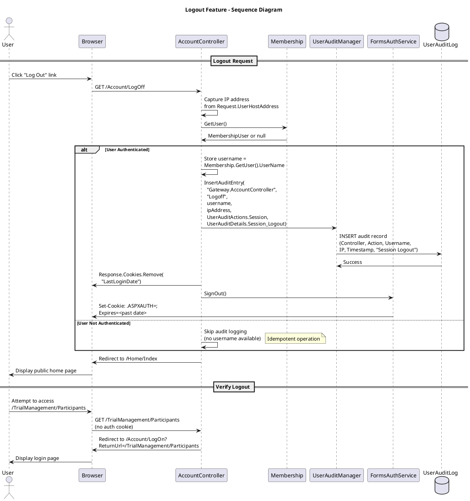

# Logout Feature Specification

## Feature Overview

### Feature Name
User Logout (Session Termination)

### Description
Secure session termination system that cleanly ends user sessions, removes authentication cookies, logs logout events for audit compliance, and redirects users to the home page. The system ensures proper cleanup of both authentication state and session-related cookies while maintaining comprehensive audit trails.

### Business Value
- **Security**: Prevents session hijacking by explicitly terminating sessions
- **Compliance**: Meets 21 CFR Part 11 requirements for session audit trails
- **User Control**: Gives users explicit control over session termination
- **Privacy**: Protects user privacy by clearing session data
- **Forensics**: Enables tracking of session duration and logout patterns

### Target Personas
- **Gateway User**: Any authenticated user who needs to terminate their session
- **Trial/Site Manager**: Users requiring secure logout from sensitive data
- **System Administrator**: Monitors session patterns and logout events
- **Compliance Officer**: Reviews audit trails for session management compliance

### Work Item Reference
TFS Work Item #571 (tfscorp.itrica.com\ITRICA)

### Dependencies
- Requires active authenticated session (UC_Login)
- Referenced by use-cases.md: "Logout depends on Login"

---

## Requirements

### Functional Requirements

**FR-001: Session Termination**
- System MUST terminate authenticated session on logout request
- System MUST call FormsAuthentication.SignOut() to clear authentication ticket
- System MUST remove authentication cookie from browser
- System MUST invalidate server-side session state

**FR-002: Cookie Cleanup**
- System MUST remove LastLoginDate cookie from browser
- System MUST use Response.Cookies.Remove() for cookie cleanup
- System MUST clear all session-related cookies

**FR-003: Audit Logging**
- System MUST log logout event before session termination
- System MUST capture username from current authenticated session
- System MUST capture IP address of logout request
- System MUST record timestamp of logout event
- Audit entry MUST use action "Session" and detail "Session Logout"

**FR-004: Authentication Check**
- System MUST verify user is authenticated before logging logout
- System MUST check Membership.GetUser() != null
- System MUST handle unauthenticated logout requests gracefully
- System SHOULD skip audit logging if user not authenticated

**FR-005: Redirect After Logout**
- System MUST redirect to Home/Index after logout
- Redirect MUST occur after all cleanup completed
- Redirect MUST use HTTP 302 Found status
- Redirect MUST clear any returnUrl parameters

**FR-006: Whitelist Access**
- System MUST allow logout action for any authenticated user
- Logout MUST be accessible even during password expiration enforcement
- Static method AllowLogOff() MUST whitelist Account/LogOff action
- See AccountController.AllowLogOff() for implementation

### Non-Functional Requirements

**NFR-001: Performance**
- Logout operation MUST complete within 1 second
- Cookie removal MUST be immediate (client-side)
- Audit log insertion SHOULD NOT block redirect

**NFR-002: Security**
- Logout MUST be protected from CSRF attacks (use anti-forgery token)
- Logout endpoint MUST NOT accept GET requests (prevent logout via image tag)
- Logout MUST NOT expose sensitive information in URL
- Session termination MUST be complete (no residual session data)

**NFR-003: Reliability**
- System MUST handle missing authentication cookie gracefully
- System MUST handle database audit logging failures without blocking logout
- Logout MUST succeed even if audit logging fails
- System MUST log audit logging failures to application log

**NFR-004: Usability**
- Logout action MUST be clearly labeled in UI
- Logout MUST provide immediate visual feedback (redirect to public page)
- Logout MUST be accessible from all authenticated pages
- No confirmation dialog required (single-click logout)

**NFR-005: Compliance**
- Logout events MUST be audited for regulatory compliance
- Audit trail MUST record both user-initiated and forced logouts
- Session duration calculable from login/logout audit entries

### Business Rules

**BR-001: Logout Availability**
- Logout MUST be available to all authenticated users
- Logout MUST be available even when password expired
- Logout MUST be available even when profile incomplete
- Logout MUST NOT require additional authorization

**BR-002: Cookie Cleanup Scope**
- Authentication cookie (.ASPXAUTH) MUST be removed
- LastLoginDate cookie MUST be removed
- Other session cookies MAY be retained (application-specific)
- Cookie domain MUST match login cookie domain

**BR-003: Audit Trail Requirements**
- Audit entry MUST include: Controller, Action, Username, IP, Timestamp
- Audit action MUST be "Session"
- Audit detail MUST be "Session Logout"
- Audit record immutable (insert-only)

**BR-004: Session State Cleanup**
- Forms Authentication ticket invalidated
- ASP.NET Session state cleared (if used)
- Application-specific session data cleared
- Client-side cookies removed

**BR-005: Unauthenticated Logout Handling**
- If user already logged out (no session), skip audit logging
- Redirect to home page without error
- Do not show error message
- Idempotent operation (safe to call multiple times)

### Compliance Requirements

**COMP-001: 21 CFR Part 11 - Audit Trail**
- System MUST maintain secure, computer-generated, time-stamped audit trail of logout events
- Audit trail MUST record date/time of logout
- Audit trail MUST record user identification (username)
- Audit records MUST be available for FDA inspection

**COMP-002: 21 CFR Part 11 - Security**
- System MUST ensure sessions cannot be reused after logout
- Logout MUST invalidate all authentication credentials
- System MUST prevent session fixation attacks

**COMP-003: GCP (Good Clinical Practice)**
- System MUST maintain audit trail of user session termination
- Session duration MUST be calculable for compliance reporting
- Logout events MUST be traceable to individual users

**COMP-004: HIPAA (Privacy)**
- Logout MUST clear Protected Health Information from session
- Logout MUST prevent unauthorized access after user leaves workstation
- Automatic session timeout SHOULD log logout event (see session-management.md)

---

## User Stories

### Story 1: Successful Logout
```gherkin
Given I am an authenticated Gateway User
  And I am logged in with username "jsmith"
  And my session is active
When I click the "Log Out" link
Then I should be redirected to /Home/Index
  And I should see the public home page (not authenticated)
  And my authentication cookie should be removed
  And my LastLoginDate cookie should be removed
  And an audit log entry should record "Session Logout" with my username and IP address
  And I should NOT be able to access authenticated pages without logging in again
```

### Story 2: Logout from Protected Page
```gherkin
Given I am an authenticated Gateway User
  And I am viewing /TrialManagement/Participants
When I click the "Log Out" link in the navigation
Then I should be redirected to /Home/Index
  And my session should be terminated
  And an audit log entry should be created
  And if I click browser "Back" button, I should NOT be able to access /TrialManagement/Participants
  And I should be redirected to /Account/LogOn
```

### Story 3: Logout with Expired Password
```gherkin
Given I am an authenticated Gateway User
  And my password has expired
  And the system is forcing me to /Account/ChangePassword
When I click the "Log Out" link
Then I should be allowed to log out (logout whitelisted)
  And I should be redirected to /Home/Index
  And my session should be terminated
  And an audit log entry should be created
```

### Story 4: Logout When Already Logged Out
```gherkin
Given I previously logged out
  And my session is terminated
  And I still have the /Account/LogOff URL in my browser history
When I navigate to /Account/LogOff directly
Then I should be redirected to /Home/Index
  And NO audit log entry should be created (user already logged out)
  And NO error message should be displayed
  And the operation should complete successfully (idempotent)
```

### Story 5: Logout Audit Trail
```gherkin
Given I am a Compliance Officer
  And user "jsmith" logged in at 9:00 AM from IP 192.168.1.100
  And user "jsmith" logged out at 5:30 PM from IP 192.168.1.100
When I query the UserAuditLog for user "jsmith" on that date
Then I should see two audit entries:
  | Timestamp | Action         | Detail                | IP             |
  | 9:00 AM   | Authentication | Authentication Success| 192.168.1.100  |
  | 5:30 PM   | Session        | Session Logout        | 192.168.1.100  |
And I should be able to calculate session duration = 8.5 hours
```

### Story 6: Logout from Multiple Devices
```gherkin
Given I am user "jsmith"
  And I am logged in on Device A (Desktop) with IP 192.168.1.100
  And I am logged in on Device B (Mobile) with IP 192.168.1.101
When I log out from Device A
Then Device A session should be terminated
  And Device A should redirect to /Home/Index
  And an audit entry should record logout from IP 192.168.1.100
  And Device B session should REMAIN active (separate session)
  And Device B should still have access to authenticated pages
```

---

## Design

### Architecture Diagram

```plantuml
@startuml Logout Architecture
!include https://raw.githubusercontent.com/plantuml-stdlib/C4-PlantUML/master/C4_Component.puml

title Logout Feature - Component Diagram

Container_Boundary(web, "Web Application") {
    Component(controller, "AccountController", "ASP.NET MVC Controller", "Handles logout requests")
    Component(formsAuth, "FormsAuthenticationService", "Authentication Service", "Terminates Forms Authentication")
}

Container_Boundary(business, "Business Layer") {
    Component(auditMgr, "UserAuditManager", "Audit Manager", "Records logout events")
}

Container_Boundary(data, "Data Layer") {
    ComponentDb(auditDb, "UserAuditLog", "SQL Server Table", "Stores logout audit trail")
    ComponentDb(membership, "aspnet_Membership", "SQL Server Table", "User account data")
}

Container_Boundary(client, "Client Browser") {
    Component(cookies, "HTTP Cookies", "Browser Storage", "Authentication and session cookies")
}

Rel(controller, formsAuth, "SignOut", "Method call")
Rel(controller, auditMgr, "InsertAuditEntry", "Method call")
Rel(controller, cookies, "Remove cookies", "HTTP Response")
Rel(controller, membership, "GetUser", "Membership API")
Rel(auditMgr, auditDb, "INSERT logout record", "Entity Framework")
Rel(formsAuth, cookies, "Expire .ASPXAUTH", "HTTP Response")

note right of controller
  Workflow:
  1. Check if user authenticated
  2. Get username from session
  3. Log logout event
  4. Remove LastLoginDate cookie
  5. Call FormsService.SignOut()
  6. Redirect to Home/Index
end note

note right of auditMgr
  Audit Entry:
  - Controller: "Gateway.AccountController"
  - Action: "Logoff"
  - Username: From Membership.GetUser()
  - IP: From Request.UserHostAddress
  - AuditAction: Session
  - Details: Session_Logout
end note

@enduml
```

#### ASCII Diagram

```
┌────────────────────────────────────────────────────────────────────┐
│              Logout Feature - Component Architecture               │
└────────────────────────────────────────────────────────────────────┘

┌──────────────────────────────────────────────────────────────────────┐
│  Web Application Layer                                              │
│                                                                      │
│  ┌────────────────────┐           ┌──────────────────────────────┐  │
│  │ AccountController  │           │ FormsAuthenticationService   │  │
│  │ (MVC Controller)   │           │                              │  │
│  │                    │           │  - SignOut()                 │  │
│  │  - LogOff()        │──calls────►  - Expires .ASPXAUTH cookie  │  │
│  │  - Get username    │           │                              │  │
│  │  - Log audit       │           └──────────────────────────────┘  │
│  │  - Remove cookies  │                                             │
│  │  - Redirect        │                                             │
│  └─────────┬──────────┘                                             │
└────────────┼────────────────────────────────────────────────────────┘
             │
             ▼
┌───────────────────────────────────────────────────────────────────────┐
│  Business Layer                                                       │
│                                                                       │
│  ┌────────────────────────────────────────────────────────────────┐  │
│  │ UserAuditManager                                               │  │
│  │                                                                 │  │
│  │  - InsertAuditEntry(controller, action, username, ip, event)   │  │
│  │  - Records: Controller, Action, Username, IP, Timestamp        │  │
│  │  - AuditAction: "Session"                                      │  │
│  │  - Details: "Session Logout"                                   │  │
│  └────────────────────────────────┬────────────────────────────────┘  │
└────────────────────────────────────┼───────────────────────────────────┘
                                     │
                                     ▼
┌───────────────────────────────────────────────────────────────────────┐
│  Data Layer (SQL Server)                                             │
│                                                                       │
│  ┌──────────────────────────┐  ┌──────────────────────────────────┐  │
│  │ aspnet_Membership        │  │ UserAuditLog                     │  │
│  ├──────────────────────────┤  ├──────────────────────────────────┤  │
│  │  UserId (PK)             │  │  AuditId (PK)                    │  │
│  │  UserName                │  │  Controller                      │  │
│  │  (used for GetUser())    │  │  Action                          │  │
│  │                          │  │  UserName                        │  │
│  │                          │  │  IPAddress                       │  │
│  │                          │  │  AuditAction = "Session"         │  │
│  │                          │  │  Details = "Session Logout"      │  │
│  └──────────────────────────┘  │  Timestamp                       │  │
│                                 └──────────────────────────────────┘  │
└───────────────────────────────────────────────────────────────────────┘

┌───────────────────────────────────────────────────────────────────────┐
│  Client Browser                                                       │
│                                                                       │
│  ┌────────────────────────────────────────────────────────────────┐  │
│  │ HTTP Cookies (Removed)                                          │  │
│  ├────────────────────────────────────────────────────────────────┤  │
│  │  .ASPXAUTH         → Expired (Set-Cookie with past date)       │  │
│  │  LastLoginDate     → Removed (Response.Cookies.Remove())       │  │
│  └────────────────────────────────────────────────────────────────┘  │
└───────────────────────────────────────────────────────────────────────┘

Logout Workflow:
  1. User requests /Account/LogOff
  2. Controller checks if user is authenticated (Membership.GetUser())
  3. If authenticated:
     a. Get username from session
     b. UserAuditManager logs logout event with IP address
     c. Remove LastLoginDate cookie
     d. Call FormsService.SignOut() to expire .ASPXAUTH cookie
  4. Redirect to /Home/Index
  5. Session terminated, user cannot access protected pages

Notes:
  • Logout is idempotent (safe to call when already logged out)
  • Audit only logged if user is authenticated
  • IP address captured for security analysis
  • Cookie cleanup ensures no session residue
```

### Workflow Diagram



#### ASCII Diagram

```
Logout Feature - Sequence Diagram

User          Browser        Controller      Membership      AuditMgr      FormsAuth      DB
  │               │               │               │              │              │         │
  │               │               │               │              │              │         │
  ├──Click────────►               │               │              │              │         │
  │  "Log Out"    │               │               │              │              │         │
  │               │               │               │              │              │         │
  │               ├──GET /LogOff──►               │              │              │         │
  │               │               │               │              │              │         │
  │               │               ├─Capture IP────┤              │              │         │
  │               │               │  from Request │              │              │         │
  │               │               │               │              │              │         │
  │               │               ├──GetUser()────────────────────────────────────────────►
  │               │               │               │              │              │         │
  │               │               │◄──MembershipUser or null────────────────────────────────┤
  │               │               │               │              │              │         │
  │               │               │               │              │              │         │
  │               │    ┌──────────┴───────────┐   │              │              │         │
  │               │    │ IF User Authenticated│   │              │              │         │
  │               │    └──────────┬───────────┘   │              │              │         │
  │               │               │               │              │              │         │
  │               │               ├─Store username = GetUser().UserName         │         │
  │               │               │               │              │              │         │
  │               │               ├───────────InsertAuditEntry("Session Logout")──►        │
  │               │               │               │              │              │         │
  │               │               │               │              ├──INSERT───────────────►
  │               │               │               │              │  Audit Record │         │
  │               │               │               │              │  (Controller, │         │
  │               │               │               │              │   Action,     │         │
  │               │               │               │              │   Username,   │         │
  │               │               │               │              │   IP,         │         │
  │               │               │               │              │   Timestamp,  │         │
  │               │               │               │              │   "Session    │         │
  │               │               │               │              │    Logout")   │         │
  │               │               │               │              │              │         │
  │               │               │               │              │◄─Success──────────────┤
  │               │               │               │              │              │         │
  │               │◄──────────────┤  Response.Cookies.Remove("LastLoginDate")   │         │
  │               │  Remove Cookie│               │              │              │         │
  │               │               │               │              │              │         │
  │               │               ├──SignOut()──────────────────────────────────►         │
  │               │               │               │              │              │         │
  │               │◄──────────────┼───────────────┼──────────────┼──Set-Cookie──┤         │
  │               │  Set-Cookie:  │               │              │  .ASPXAUTH=; │         │
  │               │  .ASPXAUTH=;  │               │              │  Expires=    │         │
  │               │  Expires=     │               │              │  (past date) │         │
  │               │  (past date)  │               │              │              │         │
  │               │               │               │              │              │         │
  │               │    ┌──────────┴───────────┐   │              │              │         │
  │               │    │ ELSE User Not Auth   │   │              │              │         │
  │               │    └──────────┬───────────┘   │              │              │         │
  │               │               │               │              │              │         │
  │               │               ├─Skip audit logging (no username available)  │         │
  │               │               │  (Idempotent operation)      │              │         │
  │               │               │               │              │              │         │
  │               │               │               │              │              │         │
  │               │◄──Redirect────┤  to /Home/Index              │              │         │
  │               │   302 Found   │               │              │              │         │
  │               │               │               │              │              │         │
  │◄──Display─────┤               │               │              │              │         │
  │   Public      │               │               │              │              │         │
  │   Home Page   │               │               │              │              │         │
  │               │               │               │              │              │         │
  │               │               │               │              │              │         │
  ├──Try Access───►               │               │              │              │         │
  │  Protected    │               │               │              │              │         │
  │  Page         │               │               │              │              │         │
  │               │               │               │              │              │         │
  │               ├──GET /TrialManagement/────────►              │              │         │
  │               │  Participants │               │              │              │         │
  │               │  (no auth     │               │              │              │         │
  │               │   cookie)     │               │              │              │         │
  │               │               │               │              │              │         │
  │               │◄──Redirect────┤  to /Account/LogOn?ReturnUrl=...           │         │
  │               │   302 Found   │               │              │              │         │
  │               │               │               │              │              │         │
  │◄──Display─────┤               │               │              │              │         │
  │   Login Page  │               │              │              │              │         │
  │               │               │               │              │              │         │

Key Events:
  1. User clicks "Log Out" link
  2. Controller captures IP address from request
  3. Controller checks if user is authenticated (Membership.GetUser())
  4. IF authenticated:
     - Get username from current session
     - Log audit entry: "Session Logout" with username and IP
     - Remove LastLoginDate cookie
     - Call FormsService.SignOut() to expire .ASPXAUTH cookie
  5. IF not authenticated:
     - Skip audit logging (idempotent operation)
  6. Redirect to /Home/Index (public page)
  7. Session terminated - protected pages redirect to login

Security Features:
  • Logout event audited before session terminated
  • Username captured while session still active
  • IP address logged for forensic analysis
  • All cookies removed/expired
  • Idempotent operation (safe to call when already logged out)
```

### Data Model

#### Entities

**UserAuditLog** (Logout-specific fields)
```
Table: UserAuditLog
├── UserAuditLogID (int, PK, Identity)
├── UserAspNetID (uniqueidentifier) - From Membership.GetUser()
├── UserName (nvarchar(256)) - Username at time of logout
├── ControllerName (nvarchar(256)) - "Gateway.AccountController"
├── ActionName (nvarchar(256)) - "Logoff"
├── AuditAction (nvarchar(256)) - "Session"
├── Details (nvarchar(max)) - "Session Logout"
├── IPAddress (nvarchar(45)) - IP address of logout request
└── CreatedOn (datetime) - Timestamp of logout event

Logout-Specific Query Example:
SELECT UserName, IPAddress, CreatedOn
FROM UserAuditLog
WHERE AuditAction = 'Session'
  AND Details = 'Session Logout'
  AND UserName = 'jsmith'
ORDER BY CreatedOn DESC
```

**HTTP Cookies** (Removal)
```
Cookie: .ASPXAUTH (Forms Authentication)
├── Action: REMOVE (expire cookie)
├── Set-Cookie: .ASPXAUTH=; Expires=<past date>; Path=/
└── Effect: Browser deletes authentication cookie

Cookie: LastLoginDate (Custom)
├── Action: REMOVE via Response.Cookies.Remove()
├── Implementation: Response.Cookies.Remove("LastLoginDate")
└── Effect: Browser deletes last login date cookie
```

#### Audit Trail Correlation

**Session Duration Calculation**:
```sql
-- Calculate session duration from audit log
WITH LoginLogout AS (
    SELECT
        UserName,
        CreatedOn,
        Details,
        LEAD(CreatedOn) OVER (PARTITION BY UserName ORDER BY CreatedOn) AS NextEvent,
        LEAD(Details) OVER (PARTITION BY UserName ORDER BY CreatedOn) AS NextEventType
    FROM UserAuditLog
    WHERE AuditAction IN ('Authentication', 'Session')
        AND Details IN ('Authentication Success', 'Session Logout')
        AND UserName = 'jsmith'
)
SELECT
    UserName,
    CreatedOn AS LoginTime,
    NextEvent AS LogoutTime,
    DATEDIFF(MINUTE, CreatedOn, NextEvent) AS SessionDurationMinutes
FROM LoginLogout
WHERE Details = 'Authentication Success'
    AND NextEventType = 'Session Logout'
ORDER BY CreatedOn DESC;
```

### API Contracts

#### Endpoint: GET /Account/LogOff

**Purpose**: Terminate user session and log logout event

**Request**:
```http
GET /Account/LogOff HTTP/1.1
Host: gateway.itrica.com
Cookie: .ASPXAUTH=<encrypted-ticket>; LastLoginDate=12/15/2025 10:30:45 AM
```

**Authorization**: Must be authenticated (but see note on idempotency)

**Response - Success (Authenticated User)**: 302 Found
```http
HTTP/1.1 302 Found
Location: /Home/Index
Set-Cookie: .ASPXAUTH=; Expires=Thu, 01 Jan 1970 00:00:00 GMT; Path=/; HttpOnly; Secure
Set-Cookie: LastLoginDate=; Expires=Thu, 01 Jan 1970 00:00:00 GMT; Path=/
Cache-Control: no-cache, no-store, must-revalidate
Pragma: no-cache
Expires: 0
```

**Response - Success (Already Logged Out)**: 302 Found
```http
HTTP/1.1 302 Found
Location: /Home/Index
Cache-Control: no-cache, no-store, must-revalidate
```

**Side Effects**:
- Authentication session terminated
- .ASPXAUTH cookie removed
- LastLoginDate cookie removed
- Audit log entry created (if authenticated)
- User redirected to public home page

**Audit Log Entry**:
```json
{
  "UserAuditLogID": 12345,
  "UserAspNetID": "3fa85f64-5717-4562-b3fc-2c963f66afa6",
  "UserName": "jsmith",
  "ControllerName": "Gateway.AccountController",
  "ActionName": "Logoff",
  "AuditAction": "Session",
  "Details": "Session Logout",
  "IPAddress": "192.168.1.100",
  "CreatedOn": "2025-12-15T17:30:45.123"
}
```

**Error Handling**:
- No explicit error handling required
- Idempotent operation (safe to call when not authenticated)
- Audit logging failures logged to application log but do not block logout

---

## Implementation Details

### Technology Stack

**Framework**:
- ASP.NET MVC 4.x/5.x (.NET Framework)
- C# language
- Forms Authentication

**Authentication**:
- ASP.NET Membership Provider (System.Web.Security)
- FormsAuthentication.SignOut()
- HttpResponse.Cookies.Remove()

**Data Access**:
- Entity Framework (for UserAuditLog)
- Membership API (for GetUser)

### Dependencies

**Project References**:
```
OoBDev.Web.Controllers
├── OoBDev.Gateway.Access (UserAuditManager)
├── OoBDev.Gateway.Data (GatewayEntities)
├── OoBDev.Gateway.Models (UserAuditLog entity)
└── System.Web.Security (Membership, FormsAuthentication)
```

**External Dependencies**:
- System.Web.Mvc
- System.Web.Security
- System.Web (HttpCookie, HttpResponse)

### Security Considerations

**CSRF Protection**:
```csharp
// RECOMMENDED: Add anti-forgery token protection
[HttpPost]
[ValidateAntiForgeryToken]
public ActionResult LogOff()
{
    // ... existing logout logic
}
```
**Rationale**: Prevents malicious sites from forcing user logout via image tag or hidden iframe.

**Current Implementation**: Uses GET request (CSRF vulnerable)
**Recommendation**: Change to POST with anti-forgery token in future iteration

---

**Session Fixation Prevention**:
- FormsAuthentication.SignOut() invalidates authentication ticket
- New login requires new authentication ticket
- Session ID regenerated on new login (ASP.NET default)

**Cookie Security**:
```csharp
// .ASPXAUTH cookie automatically marked HttpOnly and Secure by FormsAuthentication
// Configuration in Web.config:
<forms requireSSL="true" protection="All" />
```

**IP Address Tracking**:
```csharp
ipAddress = requestContext.HttpContext.Request.UserHostAddress;
```
- Same IP tracking as login
- Enables correlation of login/logout from same IP
- Helps detect suspicious activity (login from IP A, logout from IP B)

**Audit Trail Security**:
- Logout events logged before session termination
- Username captured while session still active
- Prevents lost audit trail if logout fails
- Audit records immutable (insert-only)

### Code Patterns

**Pattern 1: Authentication Check Before Audit Logging**
```csharp
public ActionResult LogOff()
{
    if (Membership.GetUser() != null)
    {
        var auditManager = new UserAuditManager();

        auditManager.InsertAuditEntry(
            "Gateway.AccountController",
            "Logoff",
            Membership.GetUser().UserName,
            ipAddress,
            UserAuditActions.Session,
            UserAuditDetails.Session_Logout
        );

        Response.Cookies.Remove(LastLoginDateCookieName);
        FormsService.SignOut();
    }

    return RedirectToAction("Index", "Home");
}
```
**Benefits**:
- Prevents null reference if user already logged out
- Idempotent operation (safe to call multiple times)
- No error message shown to user
- Graceful handling of edge cases

---

**Pattern 2: Cookie Cleanup Order**
```csharp
// 1. Log audit entry (while session still active)
auditManager.InsertAuditEntry(...);

// 2. Remove custom cookies
Response.Cookies.Remove(LastLoginDateCookieName);

// 3. Remove authentication cookie (terminates session)
FormsService.SignOut();

// 4. Redirect
return RedirectToAction("Index", "Home");
```
**Rationale**:
- Audit logged BEFORE session terminated (ensures username available)
- Custom cookies removed explicitly
- FormsAuthentication.SignOut() removes .ASPXAUTH cookie
- Redirect occurs after all cleanup complete

---

**Pattern 3: IP Address Capture in Initialize()**
```csharp
string ipAddress;

protected override void Initialize(RequestContext requestContext)
{
    // ... service initialization ...

    ipAddress = requestContext.HttpContext.Request.UserHostAddress;

    base.Initialize(requestContext);
}
```
**Benefits**:
- IP captured once per request (controller-level field)
- Available to all action methods (LogOn, LogOff, ChangePassword)
- Consistent IP logging across all actions

**From CODE_REVIEW.md Section 7**: IP Address Tracking

---

**Pattern 4: Whitelist for Password Age Enforcement**
```csharp
public static IController AllowLogOff(RequestContext requestContext, string controllerName)
{
    if (!requestContext.HttpContext.Request.IsAuthenticated)
        return null;

    var area = (requestContext.RouteData.DataTokens["area"] ?? "").ToString();
    var controller = (requestContext.RouteData.Values["controller"] ?? "").ToString();
    var action = (requestContext.RouteData.Values["action"] ?? "").ToString();

    // Whitelist Account/LogOff action
    if (string.IsNullOrWhiteSpace(area)
        && controller.Equals("Account", StringComparison.InvariantCultureIgnoreCase)
        && action.Equals("LogOff", StringComparison.InvariantCultureIgnoreCase))
        return new ProcessedController();

    // Also whitelist PasswordChangeWarning partial
    if (string.IsNullOrWhiteSpace(area)
        && controller.Equals("Account", StringComparison.InvariantCultureIgnoreCase)
        && action.Equals("PasswordChangeWarning", StringComparison.InvariantCultureIgnoreCase))
        return new ProcessedController();

    return null;
}
```
**Usage**: Called by PasswordAgeCheck routing interceptor
**Benefits**:
- Allows logout even when password expired
- Prevents "trapped" users who can't change password or log out
- ProcessedController indicates "allow this request"

**From CODE_REVIEW.md Section 3**: Profile Enforcement Interceptor (similar pattern)

---

### Configuration Example

**Web.config**:
```xml
<configuration>
  <system.web>
    <authentication mode="Forms">
      <forms
        name=".ASPXAUTH"
        loginUrl="~/Account/LogOn"
        timeout="30"
        slidingExpiration="true"
        requireSSL="true"    <!-- Secure cookie -->
        protection="All"     <!-- Encrypt and validate -->
        domain=".itrica.com" />
    </authentication>

    <!-- Session state configuration -->
    <sessionState
      mode="InProc"
      timeout="30"
      cookieName="ASP.NET_SessionId" />
  </system.web>

  <!-- Cache control for logout (prevent back button access) -->
  <location path="Account/LogOff">
    <system.webServer>
      <httpProtocol>
        <customHeaders>
          <add name="Cache-Control" value="no-cache, no-store, must-revalidate" />
          <add name="Pragma" value="no-cache" />
          <add name="Expires" value="0" />
        </customHeaders>
      </httpProtocol>
    </system.webServer>
  </location>
</configuration>
```

---

## Acceptance Criteria

**AC-001**: Authenticated user can successfully log out
- User is authenticated with active session
- User clicks "Log Out" link or navigates to /Account/LogOff
- System terminates session and redirects to /Home/Index
- User cannot access protected pages without logging in again

**AC-002**: Logout removes authentication cookie
- User logs out successfully
- .ASPXAUTH cookie is removed from browser (Set-Cookie with past expiration)
- User cannot reuse cookie for authentication
- Subsequent requests require new login

**AC-003**: Logout removes LastLoginDate cookie
- User has LastLoginDate cookie from previous login
- User logs out
- Response.Cookies.Remove("LastLoginDate") called
- LastLoginDate cookie removed from browser

**AC-004**: Logout event is audited
- User logs out successfully
- Audit log entry created with:
  - ControllerName: "Gateway.AccountController"
  - ActionName: "Logoff"
  - UserName: User's username
  - IPAddress: User's IP address
  - AuditAction: "Session"
  - Details: "Session Logout"
  - CreatedOn: Timestamp of logout

**AC-005**: Unauthenticated logout is handled gracefully
- User already logged out (no active session)
- User navigates to /Account/LogOff
- System redirects to /Home/Index without error
- NO audit log entry created (user not authenticated)
- Operation is idempotent

**AC-006**: Logout accessible during password expiration
- User's password has expired
- System forcing user to /Account/ChangePassword
- User clicks "Log Out"
- AllowLogOff() whitelists the action
- User successfully logs out
- User redirected to /Home/Index

**AC-007**: Session cannot be reused after logout
- User logs out
- User attempts to access protected page using cached cookie
- System rejects authentication (cookie expired)
- User redirected to login page

**AC-008**: Back button does not restore session
- User logs out successfully
- User clicks browser "Back" button
- Browser shows cached page (if any)
- User attempts to perform action on cached page
- System rejects request (no valid session)
- User redirected to login page

**AC-009**: IP address captured for logout event
- User logs out from IP 192.168.1.100
- Audit log entry contains IPAddress = "192.168.1.100"
- IP address matches IP from Request.UserHostAddress

**AC-010**: Multiple device logout independence
- User logged in on Device A and Device B (separate sessions)
- User logs out from Device A
- Device A session terminated
- Device B session remains active
- Device B can still access protected pages

---

## Test Scenarios

### Unit Tests

**Test Class**: `AccountControllerTests`

**Test**: `LogOff_AuthenticatedUser_RedirectsToHomeAndLogsAudit`
```csharp
[TestMethod]
public void LogOff_AuthenticatedUser_RedirectsToHomeAndLogsAudit()
{
    // Arrange
    var mockMembership = new Mock<MembershipUser>();
    mockMembership.Setup(m => m.UserName).Returns("jsmith");

    var mockFormsAuth = new Mock<IFormsAuthenticationService>();

    var mockAuditManager = new Mock<UserAuditManager>();

    var controller = new AccountController
    {
        FormsService = mockFormsAuth.Object
    };

    // Mock Membership.GetUser() to return authenticated user
    // (requires static method mocking or testable wrapper)

    // Act
    var result = controller.LogOff() as RedirectToRouteResult;

    // Assert
    Assert.IsNotNull(result);
    Assert.AreEqual("Index", result.RouteValues["action"]);
    Assert.AreEqual("Home", result.RouteValues["controller"]);
    mockFormsAuth.Verify(f => f.SignOut(), Times.Once);
}
```

**Test**: `LogOff_UnauthenticatedUser_RedirectsWithoutAudit`
```csharp
[TestMethod]
public void LogOff_UnauthenticatedUser_RedirectsWithoutAudit()
{
    // Arrange
    var mockFormsAuth = new Mock<IFormsAuthenticationService>();

    var controller = new AccountController
    {
        FormsService = mockFormsAuth.Object
    };

    // Mock Membership.GetUser() to return null (not authenticated)

    // Act
    var result = controller.LogOff() as RedirectToRouteResult;

    // Assert
    Assert.IsNotNull(result);
    Assert.AreEqual("Index", result.RouteValues["action"]);
    Assert.AreEqual("Home", result.RouteValues["controller"]);

    // Verify audit NOT logged (would need to mock UserAuditManager)
    // Verify SignOut() NOT called (already logged out)
}
```

**Test**: `LogOff_RemovesLastLoginDateCookie`
```csharp
[TestMethod]
public void LogOff_RemovesLastLoginDateCookie()
{
    // Arrange
    var mockHttpContext = new Mock<HttpContextBase>();
    var mockResponse = new Mock<HttpResponseBase>();
    var cookies = new HttpCookieCollection();

    // Add existing cookie
    cookies.Add(new HttpCookie("LastLoginDate", "12/15/2025 10:30:45 AM"));

    var removedCookies = new List<string>();
    mockResponse.Setup(r => r.Cookies).Returns(cookies);
    mockResponse.Setup(r => r.Cookies.Remove(It.IsAny<string>()))
        .Callback<string>(name => removedCookies.Add(name));

    mockHttpContext.Setup(c => c.Response).Returns(mockResponse.Object);

    var controller = new AccountController
    {
        FormsService = new Mock<IFormsAuthenticationService>().Object
    };
    // Inject mock context

    // Act
    controller.LogOff();

    // Assert
    Assert.IsTrue(removedCookies.Contains("LastLoginDate"));
}
```

**Test**: `AllowLogOff_AccountLogOffAction_ReturnsProcessedController`
```csharp
[TestMethod]
public void AllowLogOff_AccountLogOffAction_ReturnsProcessedController()
{
    // Arrange
    var mockHttpContext = new Mock<HttpContextBase>();
    var mockRequest = new Mock<HttpRequestBase>();
    mockRequest.Setup(r => r.IsAuthenticated).Returns(true);
    mockHttpContext.Setup(c => c.Request).Returns(mockRequest.Object);

    var routeData = new RouteData();
    routeData.Values["controller"] = "Account";
    routeData.Values["action"] = "LogOff";

    var requestContext = new RequestContext(mockHttpContext.Object, routeData);

    // Act
    var result = AccountController.AllowLogOff(requestContext, "Account");

    // Assert
    Assert.IsInstanceOfType(result, typeof(ProcessedController));
}
```

### Integration Tests

**Test**: `Logout_EndToEnd_AuthenticatedUser_Success`
```csharp
[TestMethod]
public void Logout_EndToEnd_AuthenticatedUser_Success()
{
    // Arrange
    var username = "logout_test_user";
    var password = "TestPass123!";
    CreateTestUser(username, password);

    var client = CreateTestClient();

    // Login first
    var loginResponse = LoginUser(client, username, password);
    var authCookie = ExtractAuthCookie(loginResponse);

    // Act - Logout
    client.DefaultRequestHeaders.Add("Cookie", authCookie);
    var logoutResponse = client.GetAsync("/Account/LogOff").Result;

    // Assert
    Assert.AreEqual(HttpStatusCode.Redirect, logoutResponse.StatusCode);
    Assert.IsTrue(logoutResponse.Headers.Location.AbsolutePath.Contains("Home/Index"));

    // Verify cookie removed
    var cookies = logoutResponse.Headers.GetValues("Set-Cookie");
    var expiredAuthCookie = cookies.FirstOrDefault(c => c.Contains(".ASPXAUTH") && c.Contains("Expires="));
    Assert.IsNotNull(expiredAuthCookie, "Auth cookie should be expired");

    var removedLastLoginCookie = cookies.FirstOrDefault(c => c.Contains("LastLoginDate") && c.Contains("Expires="));
    Assert.IsNotNull(removedLastLoginCookie, "LastLoginDate cookie should be removed");

    // Verify audit log entry
    var auditEntry = GetLatestAuditEntry(username);
    Assert.IsNotNull(auditEntry);
    Assert.AreEqual("Session", auditEntry.AuditAction);
    Assert.AreEqual("Session Logout", auditEntry.Details);
    Assert.IsNotNull(auditEntry.IPAddress);

    // Cleanup
    DeleteTestUser(username);
}
```

**Test**: `Logout_SessionInvalidAfterLogout`
```csharp
[TestMethod]
public void Logout_SessionInvalidAfterLogout()
{
    // Arrange
    var username = "session_test_user";
    var password = "TestPass123!";
    CreateTestUser(username, password);

    var client = CreateTestClient();

    // Login
    var loginResponse = LoginUser(client, username, password);
    var authCookie = ExtractAuthCookie(loginResponse);

    // Verify access to protected page
    client.DefaultRequestHeaders.Add("Cookie", authCookie);
    var protectedPageResponse1 = client.GetAsync("/TrialManagement/Participants").Result;
    Assert.AreEqual(HttpStatusCode.OK, protectedPageResponse1.StatusCode, "Should access protected page when authenticated");

    // Act - Logout
    var logoutResponse = client.GetAsync("/Account/LogOff").Result;

    // Try to access protected page with same cookie (browser simulation)
    var protectedPageResponse2 = client.GetAsync("/TrialManagement/Participants").Result;

    // Assert - Should be redirected to login
    Assert.AreEqual(HttpStatusCode.Redirect, protectedPageResponse2.StatusCode);
    Assert.IsTrue(protectedPageResponse2.Headers.Location.AbsolutePath.Contains("Account/LogOn"));

    // Cleanup
    DeleteTestUser(username);
}
```

**Test**: `Logout_Idempotent_MultipleLogouts`
```csharp
[TestMethod]
public void Logout_Idempotent_MultipleLogouts()
{
    // Arrange
    var username = "idempotent_test_user";
    var password = "TestPass123!";
    CreateTestUser(username, password);

    var client = CreateTestClient();

    // Login
    var loginResponse = LoginUser(client, username, password);
    var authCookie = ExtractAuthCookie(loginResponse);
    client.DefaultRequestHeaders.Add("Cookie", authCookie);

    // Act - First logout
    var logout1Response = client.GetAsync("/Account/LogOff").Result;
    Assert.AreEqual(HttpStatusCode.Redirect, logout1Response.StatusCode);

    var auditCount1 = GetAuditEntriesCount(username, "Session Logout");

    // Act - Second logout (already logged out)
    var logout2Response = client.GetAsync("/Account/LogOff").Result;
    Assert.AreEqual(HttpStatusCode.Redirect, logout2Response.StatusCode);

    var auditCount2 = GetAuditEntriesCount(username, "Session Logout");

    // Assert
    Assert.AreEqual(1, auditCount1, "First logout should create audit entry");
    Assert.AreEqual(1, auditCount2, "Second logout should NOT create duplicate audit entry");

    // Cleanup
    DeleteTestUser(username);
}
```

**Test**: `Logout_SessionDuration_Calculable`
```csharp
[TestMethod]
public void Logout_SessionDuration_Calculable()
{
    // Arrange
    var username = "duration_test_user";
    var password = "TestPass123!";
    CreateTestUser(username, password);

    var client = CreateTestClient();

    // Act - Login
    var loginTime = DateTime.Now;
    var loginResponse = LoginUser(client, username, password);
    var authCookie = ExtractAuthCookie(loginResponse);
    client.DefaultRequestHeaders.Add("Cookie", authCookie);

    // Simulate user activity (wait 5 seconds)
    System.Threading.Thread.Sleep(5000);

    // Act - Logout
    var logoutTime = DateTime.Now;
    var logoutResponse = client.GetAsync("/Account/LogOff").Result;

    // Assert - Calculate session duration from audit log
    var loginAudit = GetAuditEntry(username, "Authentication Success");
    var logoutAudit = GetAuditEntry(username, "Session Logout");

    Assert.IsNotNull(loginAudit);
    Assert.IsNotNull(logoutAudit);

    var sessionDuration = logoutAudit.CreatedOn - loginAudit.CreatedOn;
    Assert.IsTrue(sessionDuration.TotalSeconds >= 5, "Session duration should be at least 5 seconds");
    Assert.IsTrue(sessionDuration.TotalSeconds < 10, "Session duration should be less than 10 seconds");

    // Cleanup
    DeleteTestUser(username);
}
```

### Security Tests

**Test**: `Security_LogoutClearsCookiesCompletely`
```csharp
[TestMethod]
public void Security_LogoutClearsCookiesCompletely()
{
    // Arrange
    var username = "cookie_security_user";
    var password = "TestPass123!";
    CreateTestUser(username, password);

    var client = CreateTestClient();

    // Login
    var loginResponse = LoginUser(client, username, password);
    var cookies = loginResponse.Headers.GetValues("Set-Cookie").ToList();

    // Verify cookies created
    Assert.IsTrue(cookies.Any(c => c.Contains(".ASPXAUTH")));
    Assert.IsTrue(cookies.Any(c => c.Contains("LastLoginDate")));

    // Act - Logout
    var authCookie = ExtractAuthCookie(loginResponse);
    client.DefaultRequestHeaders.Add("Cookie", authCookie);
    var logoutResponse = client.GetAsync("/Account/LogOff").Result;

    // Assert - Verify all cookies expired/removed
    var logoutCookies = logoutResponse.Headers.GetValues("Set-Cookie").ToList();

    var authCookieExpired = logoutCookies.Any(c =>
        c.Contains(".ASPXAUTH") &&
        c.Contains("Expires=") &&
        !c.Contains("Expires=Session"));
    Assert.IsTrue(authCookieExpired, "Auth cookie should be expired");

    var lastLoginCookieRemoved = logoutCookies.Any(c => c.Contains("LastLoginDate"));
    Assert.IsTrue(lastLoginCookieRemoved, "LastLoginDate cookie should be removed");

    // Cleanup
    DeleteTestUser(username);
}
```

**Test**: `Security_LogoutPreventsSessionReuse`
```csharp
[TestMethod]
public void Security_LogoutPreventsSessionReuse()
{
    // Arrange
    var username = "session_reuse_user";
    var password = "TestPass123!";
    CreateTestUser(username, password);

    var client = CreateTestClient();

    // Login and capture cookie
    var loginResponse = LoginUser(client, username, password);
    var originalAuthCookie = ExtractAuthCookie(loginResponse);

    // Logout
    client.DefaultRequestHeaders.Add("Cookie", originalAuthCookie);
    var logoutResponse = client.GetAsync("/Account/LogOff").Result;

    // Act - Attempt to reuse original cookie (attacker scenario)
    var maliciousClient = CreateTestClient();
    maliciousClient.DefaultRequestHeaders.Add("Cookie", originalAuthCookie);
    var attackResponse = maliciousClient.GetAsync("/TrialManagement/Participants").Result;

    // Assert - Should be rejected
    Assert.AreEqual(HttpStatusCode.Redirect, attackResponse.StatusCode);
    Assert.IsTrue(attackResponse.Headers.Location.AbsolutePath.Contains("Account/LogOn"),
        "Expired cookie should redirect to login");

    // Cleanup
    DeleteTestUser(username);
}
```

**Test**: `Security_IPAddressCapturedForLogout`
```csharp
[TestMethod]
public void Security_IPAddressCapturedForLogout()
{
    // Arrange
    var username = "ip_logout_user";
    var password = "TestPass123!";
    CreateTestUser(username, password);

    var client = CreateTestClient();
    var expectedIP = "192.168.1.100"; // Mock client IP

    // Login
    var loginResponse = LoginUser(client, username, password);
    var authCookie = ExtractAuthCookie(loginResponse);

    // Act - Logout
    client.DefaultRequestHeaders.Add("Cookie", authCookie);
    var logoutResponse = client.GetAsync("/Account/LogOff").Result;

    // Assert - Verify IP in audit log
    var logoutAudit = GetLatestAuditEntry(username);
    Assert.IsNotNull(logoutAudit);
    Assert.AreEqual("Session Logout", logoutAudit.Details);
    Assert.IsNotNull(logoutAudit.IPAddress);
    Assert.IsFalse(string.IsNullOrWhiteSpace(logoutAudit.IPAddress));

    // Cleanup
    DeleteTestUser(username);
}
```

---

## Migration/Deployment Considerations

### Database Schema

**Prerequisites**:
- UserAuditLog table exists (see login.md)
- aspnet_Users and aspnet_Membership tables exist

**No New Schema Required**: Logout feature uses existing UserAuditLog table

### Configuration Checklist

**Web.config Settings**:
```xml
<!-- Forms Authentication (same as login) -->
<authentication mode="Forms">
  <forms
    loginUrl="~/Account/LogOn"
    timeout="30"
    requireSSL="true"
    protection="All" />
</authentication>

<!-- Session state (optional, for ASP.NET Session) -->
<sessionState mode="InProc" timeout="30" />

<!-- Cache control for logout page -->
<location path="Account/LogOff">
  <system.webServer>
    <httpProtocol>
      <customHeaders>
        <add name="Cache-Control" value="no-cache, no-store, must-revalidate" />
        <add name="Pragma" value="no-cache" />
        <add name="Expires" value="0" />
      </customHeaders>
    </httpProtocol>
  </system.webServer>
</location>
```

### Deployment Steps

1. **Verify Login Feature Deployed**
   - Logout depends on login feature
   - Verify UserAuditLog table exists
   - Verify authentication working

2. **Deploy Code**
   - Deploy AccountController.LogOff() method
   - Deploy AccountController.AllowLogOff() method (for password age check)
   - No new views required (redirect only)

3. **Update UI**
   - Add "Log Out" link to navigation/header
   - Link to `/Account/LogOff`
   - Consider POST form with anti-forgery token (future enhancement)

4. **Test Logout Flow**
   - Test logout from authenticated session
   - Test logout when already logged out
   - Test session invalidation
   - Verify audit log entries

5. **Monitor Audit Logs**
   - Verify logout events logged
   - Verify IP addresses captured
   - Test session duration queries

### Rollback Plan

1. **Revert Code**
   - Restore previous AccountController
   - Remove "Log Out" links from UI

2. **Database**
   - No rollback needed (audit log append-only)
   - Logout audit entries harmless if code reverted

### Performance Considerations

**Expected Load**:
- Logout typically low frequency (1 per session)
- Less than login frequency
- Estimate: 10-20% of login frequency

**Optimization**:
- Audit log insertion lightweight (single INSERT)
- Cookie removal client-side (no database query)
- FormsAuthentication.SignOut() efficient

### Monitoring & Alerts

**Metrics to Track**:
- Logout events per hour/day
- Session duration (login to logout)
- Logout without corresponding login (suspicious)
- Average session duration by user role

**Alert Thresholds**:
- Logout spike (unusual pattern)
- Very short sessions (<1 minute) - possible account compromise
- Very long sessions (>8 hours) - possible forgotten logout
- Logout from different IP than login (session hijacking?)

**Compliance Reporting**:
```sql
-- Session duration report for compliance
SELECT
    UserName,
    LoginTime,
    LogoutTime,
    DATEDIFF(HOUR, LoginTime, LogoutTime) AS SessionHours
FROM (
    SELECT
        UserName,
        CreatedOn AS LoginTime,
        LEAD(CreatedOn) OVER (PARTITION BY UserName ORDER BY CreatedOn) AS LogoutTime,
        LEAD(Details) OVER (PARTITION BY UserName ORDER BY CreatedOn) AS NextEventType
    FROM UserAuditLog
    WHERE AuditAction IN ('Authentication', 'Session')
        AND Details IN ('Authentication Success', 'Session Logout')
) AS Sessions
WHERE NextEventType = 'Session Logout'
ORDER BY SessionHours DESC;
```

---

## Related Documentation

- [Login Feature Specification](./login.md) - Required dependency
- [Session Management Feature Specification](./session-management.md) - Session timeout handling
- [Account Lockout Feature Specification](./account-lockout.md) - Account security
- [Gateway Use Cases](/current/src/docs/architecture/gateway/use-cases.md) - UC_Logout
- [Code Review Findings](/current/src/docs/architecture/CODE_REVIEW.md) - Audit logging patterns

---

## Future Enhancements

**Enhancement 1: CSRF Protection**
- Change LogOff to POST method
- Add [ValidateAntiForgeryToken] attribute
- Update UI to use form POST instead of GET link

**Enhancement 2: Logout Confirmation**
- Optional confirmation dialog before logout
- Configurable per user role
- Prevent accidental logout

**Enhancement 3: Logout from All Devices**
- "Log out from all devices" option
- Invalidate all sessions for user
- Update aspnet_Membership.LastPasswordChangedDate to force re-auth

**Enhancement 4: Automatic Logout Notification**
- Email/SMS notification on logout
- Alert user of logout from unfamiliar IP
- Security feature for high-privilege accounts

---

**Document Version**: 1.0
**Last Updated**: January 2026
**Status**: Implementation-Ready
**Compliance**: 21 CFR Part 11, GCP, HIPAA
