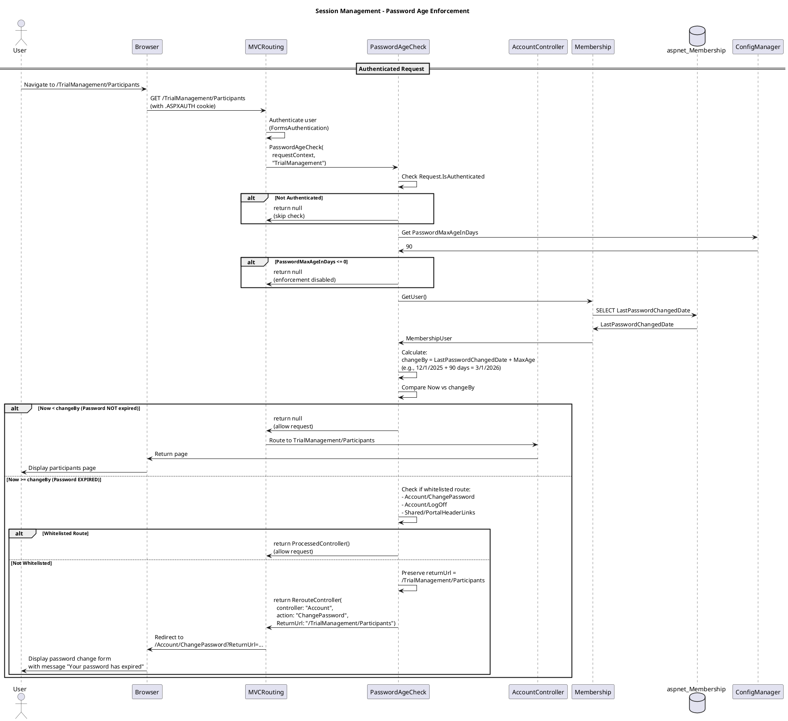
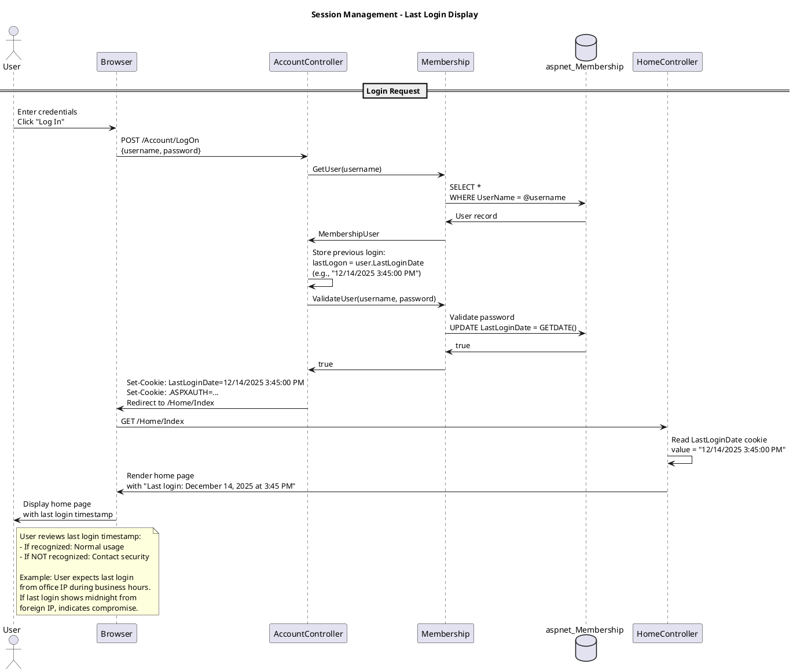

# Session Management Feature Specification

## Feature Overview

### Feature Name
Session Management and Last Login Display

### Description
Comprehensive session lifecycle management system that tracks user sessions, displays last login information to detect unauthorized access, manages session timeouts, enforces password age policies, and maintains audit trails for regulatory compliance. The system implements cookie-based last login tracking and routing interceptors for global policy enforcement.

### Business Value
- **Security Awareness**: Users can detect unauthorized access by reviewing last login timestamp
- **Compliance**: Meets 21 CFR Part 11 audit trail requirements for session tracking
- **Policy Enforcement**: Automated password age and profile completion enforcement
- **User Experience**: Transparent session management with automatic timeout handling
- **Forensics**: Complete session lifecycle tracking for security investigation

### Target Personas
- **Gateway User**: Monitors own session activity and last login
- **Trial/Site Manager**: Same session management as base user
- **System Administrator**: Configures session policies and monitors activity
- **Security Officer**: Investigates suspicious session patterns
- **Compliance Officer**: Reviews session audit trails for regulatory compliance

### Work Item Reference
TFS Work Item #572 - Check Last Logon (tfscorp.itrica.com\ITRICA)

### Dependencies
- Requires Login feature (UC_Login)
- Related to Logout feature (UC_Logout)
- Related to Change Password feature (UC_ChangePassword)

---

## Requirements

### Functional Requirements

**FR-001: Last Login Timestamp Tracking**
- System MUST capture user's current LastLoginDate BEFORE authentication
- System MUST store previous LastLoginDate in cookie for display
- Cookie name MUST be "LastLoginDate"
- Cookie value MUST be DateTime.ToString() format
- System MUST update database LastLoginDate to current timestamp on successful login

**FR-002: Last Login Display**
- System MUST display previous login timestamp to user after successful login
- Display MUST show timestamp from LastLoginDate cookie (NOT current login)
- Display SHOULD be prominently visible on first page after login
- Display format SHOULD be user-friendly (e.g., "Last login: December 15, 2025 at 10:30 AM")

**FR-003: Session Timeout Management**
- System MUST honor Forms Authentication timeout configuration
- System MUST support sliding expiration (timeout resets on activity)
- System MUST redirect expired sessions to login page
- System SHOULD preserve returnUrl for expired sessions

**FR-004: Password Age Enforcement**
- System MUST check password age on every authenticated request
- System MUST calculate password expiration from LastPasswordChangedDate + MaxPasswordAge
- System MUST redirect to Change Password page if password expired
- System MUST whitelist specific routes (Account/LogOff, Account/ChangePassword)
- System MUST preserve returnUrl for post-password-change redirect

**FR-005: Password Change Warning**
- System MUST display warning when password approaching expiration
- Warning MUST appear in configurable number of days before expiration
- Warning MUST show days remaining until expiration
- Warning message MUST be configurable via App Settings
- Warning MUST NOT display if password age enforcement disabled

**FR-006: Session Audit Logging**
- System MUST log session timeout events (see UC_LogExceptions)
- System MUST correlate login/logout events for session duration calculation
- System MUST include IP address in all session-related audit entries
- System MUST track session state changes (login, timeout, logout)

**FR-007: Profile Enforcement Interceptor**
- System MUST check if user profile exists on every authenticated request
- System MUST redirect to profile edit page if profile missing
- System MUST whitelist specific routes to prevent redirect loops
- System MUST preserve returnUrl for post-profile-completion redirect
- See MyInfoController.MyInfoCheck() for implementation pattern

### Non-Functional Requirements

**NFR-001: Performance**
- Password age check MUST complete within 50ms
- Profile existence check MUST complete within 50ms
- Cookie operations MUST NOT impact page load time
- Routing interceptors MUST NOT add significant latency

**NFR-002: Security**
- LastLoginDate cookie MUST be domain-scoped to prevent cross-site access
- Session cookies MUST be HttpOnly and Secure
- Password age configuration MUST be server-side (not client-modifiable)
- Session timeout MUST be enforced server-side

**NFR-003: Reliability**
- System MUST handle missing cookies gracefully
- System MUST handle database connection failures for password age check
- System MUST fail open (allow access) if configuration missing
- Routing interceptors MUST NOT cause application crashes

**NFR-004: Usability**
- Last login display MUST be clear and easy to find
- Password expiration warning MUST be non-intrusive
- Forced password change MUST explain reason to user
- Session timeout MUST allow user to resume work after re-authentication

**NFR-005: Configurability**
- Password max age MUST be configurable (Web.config AppSettings)
- Password warning period MUST be configurable
- Warning message format MUST be configurable
- Session timeout MUST be configurable (FormsAuthentication.Timeout)

### Business Rules

**BR-001: Last Login Cookie Lifecycle**
- Cookie created on successful login with PREVIOUS LastLoginDate
- Cookie domain inherited from FormsAuthentication.CookieDomain
- Cookie removed on logout via Response.Cookies.Remove()
- Cookie scope: site-wide, not HttpOnly (may need JavaScript access)
- Cookie expires: session cookie (cleared on browser close)

**BR-002: Password Age Calculation**
```
Password Change Due = LastPasswordChangedDate + PasswordMaxAgeInDays
Password Change Warning = Password Change Due - PasswordChangeWarningInDays
Current Status:
  - IF PasswordMaxAgeInDays <= 0: Enforcement disabled
  - IF Now < Password Change Warning: No action
  - IF Password Change Warning <= Now < Password Change Due: Show warning
  - IF Now >= Password Change Due: Force password change
```

**BR-003: Session Timeout**
- Default timeout: 30 minutes (FormsAuthentication.Timeout)
- Sliding expiration: enabled (timeout resets on each request)
- Absolute expiration: NOT enforced (only sliding)
- Session state timeout: matches authentication timeout

**BR-004: Whitelisted Routes**
**Password Age Enforcement Whitelist**:
- /Account/LogOff (must allow logout even with expired password)
- /Account/ChangePassword (target page for password change)
- /Shared/PortalHeaderLinks (partial view for navigation)

**Profile Enforcement Whitelist** (from CODE_REVIEW.md):
- /MyInfo/* (profile management pages)
- /Account/LogOff
- Other configured routes

**BR-005: Routing Interceptor Execution Order**
1. AllowLogOff check (highest priority)
2. PasswordAgeCheck
3. MyInfoCheck (profile enforcement)
4. Normal routing

**BR-006: Configuration Defaults**
- PasswordMaxAgeInDays = 0 (disabled by default)
- PasswordChangeWarning_InDays = 7 (warn 7 days before expiration)
- PasswordChangeWarning_Message = "Your password will expire in {0} days. Please change it soon."

### Compliance Requirements

**COMP-001: 21 CFR Part 11 - Audit Trail**
- System MUST maintain audit trail of session lifecycle events
- Audit trail MUST include login, logout, and timeout events
- Session duration MUST be calculable from audit records
- Audit records MUST be immutable and timestamped

**COMP-002: 21 CFR Part 11 - Security**
- System MUST enforce session timeout to prevent unauthorized access
- System MUST ensure sessions cannot be reused after timeout
- System MUST track user actions within session

**COMP-003: Password Expiration Policy**
- System MUST support configurable password aging
- System MUST force password change after configured period
- System MUST prevent access to sensitive data with expired password
- System MUST audit password change events

**COMP-004: User Profile Requirements**
- System MUST ensure user profile completeness before data access
- Profile MUST include: Email, Phone, Name, Security Questions
- System MUST prompt on login if profile incomplete (Business Rule from use-cases.md)

---

## User Stories

### Story 1: Last Login Display
```gherkin
Given I am a Gateway User with username "jsmith"
  And my previous login was on December 14, 2025 at 3:45 PM from IP 192.168.1.100
  And I am currently logging in on December 15, 2025 at 9:00 AM
When I enter valid credentials and click "Log In"
Then I should be redirected to the home page
  And I should see a message "Last login: December 14, 2025 at 3:45 PM"
  And the system should update my LastLoginDate to December 15, 2025 at 9:00 AM
  And a LastLoginDate cookie should be set with value "12/14/2025 3:45:00 PM"
```

### Story 2: Unauthorized Access Detection
```gherkin
Given I am a Gateway User with username "jsmith"
  And I last logged in on December 10, 2025 at 2:00 PM
  And an unauthorized person logged into my account on December 12, 2025 at 11:30 PM
When I log in on December 15, 2025 at 9:00 AM
Then I should see "Last login: December 12, 2025 at 11:30 PM"
  And I should recognize this is NOT my login
  And I should contact support/security to report the unauthorized access
  And the system should have audit log entries for both logins with different IP addresses
```

### Story 3: Session Timeout
```gherkin
Given I am an authenticated Gateway User
  And the session timeout is configured for 30 minutes
  And I logged in at 9:00 AM
  And I am viewing a trial participant page
  And I have been inactive for 31 minutes (last request at 9:00 AM, now 9:31 AM)
When I click a link to view participant details
Then I should be redirected to /Account/LogOn
  And I should see a returnUrl parameter with my intended destination
  And my session should be terminated (authentication cookie expired)
When I log in again with valid credentials
Then I should be redirected to the participant details page I originally requested
  And a new session should be established
```

### Story 4: Password Age Warning
```gherkin
Given I am a Gateway User with username "jsmith"
  And my password was last changed on December 1, 2025
  And PasswordMaxAgeInDays is configured to 90 days
  And PasswordChangeWarningInDays is configured to 7 days
  And today is February 26, 2026 (86 days since password change, 4 days until expiration)
When I log in successfully
Then I should see a warning message "Your password will expire in 4 days. Please change it soon."
  And the warning should be displayed prominently on every page
  And I should still be able to access all pages normally
  And I should see a link to "Change Password"
```

### Story 5: Forced Password Change
```gherkin
Given I am a Gateway User with username "jsmith"
  And my password was last changed on December 1, 2025
  And PasswordMaxAgeInDays is configured to 90 days
  And today is March 2, 2026 (91 days since password change, password expired)
When I log in successfully
Then I should be immediately redirected to /Account/ChangePassword
  And I should see a message explaining my password has expired
  And I should NOT be able to access any other pages
  And the returnUrl should be preserved for post-password-change redirect
When I attempt to navigate to /TrialManagement/Participants
Then I should be redirected back to /Account/ChangePassword
When I attempt to log out
Then I should be allowed to log out (LogOff whitelisted)
  And I should be redirected to /Home/Index
```

### Story 6: Profile Completion Enforcement
```gherkin
Given I am a new Gateway User with username "jsmith"
  And I have never completed my profile (no MyInfo record exists)
  And I log in successfully for the first time
When the system checks for my profile
Then I should be redirected to /MyInfo/Edit?id={my-user-id}
  And I should see a form to complete my profile (Email, Phone, Name, Security Questions)
  And the original returnUrl should be preserved
When I attempt to navigate to /TrialManagement/Participants
Then I should be redirected back to /MyInfo/Edit
When I complete my profile and click "Save"
Then I should be redirected to the original returnUrl (/TrialManagement/Participants)
  And my profile should be stored in the database
  And I should NOT be redirected to /MyInfo/Edit on subsequent logins
```

### Story 7: Session Duration Calculation
```gherkin
Given I am a Compliance Officer
  And user "jsmith" logged in at 9:00 AM on December 15, 2025 from IP 192.168.1.100
  And user "jsmith" logged out at 5:30 PM on December 15, 2025 from IP 192.168.1.100
When I query the UserAuditLog for session duration
Then I should retrieve:
  | Login Time         | Logout Time        | Session Duration |
  | 12/15/2025 9:00 AM | 12/15/2025 5:30 PM | 8.5 hours        |
And I should be able to generate compliance reports on session patterns
```

---

## Design

### Architecture Diagram

```plantuml
@startuml Session Management Architecture
!include https://raw.githubusercontent.com/plantuml-stdlib/C4-PlantUML/master/C4_Component.puml

title Session Management - Component Diagram

Container_Boundary(web, "Web Application") {
    Component(controller, "AccountController", "MVC Controller", "Login/Logout actions")
    Component(routeInterceptor, "Routing Interceptors", "Static Methods", "PasswordAgeCheck, MyInfoCheck, AllowLogOff")
    Component(passwordWarning, "PasswordChangeWarning", "Partial View", "Displays password expiration warning")
}

Container_Boundary(framework, "ASP.NET Framework") {
    Component(formsAuth, "FormsAuthentication", "System.Web.Security", "Session management, timeout enforcement")
    Component(membership, "Membership Provider", "System.Web.Security", "User data, LastLoginDate, LastPasswordChangedDate")
    Component(routeHandler, "MVC Routing", "System.Web.Routing", "Calls routing interceptors")
}

Container_Boundary(data, "Data Layer") {
    ComponentDb(membershipDb, "aspnet_Membership", "SQL Server", "LastLoginDate, LastPasswordChangedDate, IsLockedOut")
    ComponentDb(myInfoDb, "MyInfo", "SQL Server", "User profile data")
    ComponentDb(auditDb, "UserAuditLog", "SQL Server", "Session audit trail")
}

Container_Boundary(client, "Client Browser") {
    Component(authCookie, ".ASPXAUTH Cookie", "HTTP Cookie", "Authentication ticket, timeout tracking")
    Component(lastLoginCookie, "LastLoginDate Cookie", "HTTP Cookie", "Previous login timestamp")
}

Rel(controller, membership, "GetUser, LastLoginDate", "Membership API")
Rel(controller, lastLoginCookie, "Set cookie on login", "HTTP Response")
Rel(controller, authCookie, "FormsAuth.SignIn", "HTTP Response")
Rel(routeHandler, routeInterceptor, "Call on each request", "Method call")
Rel(routeInterceptor, membership, "Check password age, profile", "Membership API")
Rel(routeInterceptor, myInfoDb, "Check profile exists", "Database query")
Rel(formsAuth, authCookie, "Validate, check timeout", "HTTP Request/Response")
Rel(membership, membershipDb, "Query user data", "ADO.NET")
Rel(passwordWarning, membership, "Get password change date", "Membership API")

note right of routeInterceptor
  Execution Order:
  1. AllowLogOff (whitelist logout)
  2. PasswordAgeCheck
  3. MyInfoCheck (profile enforcement)
  4. Normal routing

  Each returns:
  - null: Continue to next check
  - ProcessedController: Allow request
  - RerouteController: Redirect to target
end note

note right of lastLoginCookie
  Created on login:
  - Value: PREVIOUS LastLoginDate
  - Domain: From FormsAuth config
  - Expires: Session (browser close)

  Removed on logout:
  - Response.Cookies.Remove()
end note

@enduml
```

#### ASCII Diagram

```
┌────────────────────────────────────────────────────────────────────┐
│         Session Management - Component Architecture                │
└────────────────────────────────────────────────────────────────────┘

┌──────────────────────────────────────────────────────────────────────┐
│  Web Application Layer                                              │
│                                                                      │
│  ┌────────────────────┐           ┌──────────────────────────────┐  │
│  │ AccountController  │           │ Routing Interceptors         │  │
│  │ (MVC Controller)   │           │ (Static Methods)             │  │
│  │                    │           │                              │  │
│  │  - LogOn()         │           │  - PasswordAgeCheck()        │  │
│  │  - LogOff()        │           │  - MyInfoCheck()             │  │
│  │  - Set cookies     │           │  - AllowLogOff()             │  │
│  └────────────────────┘           │                              │  │
│                                    │  Execution Order:            │  │
│  ┌────────────────────┐           │  1. AllowLogOff              │  │
│  │ PasswordChange     │           │  2. PasswordAgeCheck         │  │
│  │ Warning            │           │  3. MyInfoCheck              │  │
│  │ (Partial View)     │           │  4. Normal routing           │  │
│  └────────────────────┘           └──────────────────────────────┘  │
└──────────────────────────────────────────────────────────────────────┘
                  │                              │
                  ▼                              ▼
┌───────────────────────────────────────────────────────────────────────┐
│  ASP.NET Framework                                                    │
│                                                                       │
│  ┌──────────────────────────┐  ┌──────────────────────────────────┐  │
│  │ FormsAuthentication      │  │ Membership Provider              │  │
│  │ (Session Management)     │  │                                  │  │
│  │                          │  │  - GetUser()                     │  │
│  │  - SignIn()              │  │  - ValidateUser()                │  │
│  │  - SignOut()             │  │  - LastLoginDate                 │  │
│  │  - Timeout enforcement   │  │  - LastPasswordChangedDate       │  │
│  │                          │  │                                  │  │
│  └──────────────────────────┘  └──────────────────────────────────┘  │
│                                                                       │
│  ┌────────────────────────────────────────────────────────────────┐  │
│  │ MVC Routing                                                     │  │
│  │                                                                 │  │
│  │  - Calls routing interceptors on each request                  │  │
│  │  - Returns: null (continue), ProcessedController (allow),      │  │
│  │             RerouteController (redirect)                       │  │
│  └────────────────────────────────────────────────────────────────┘  │
└───────────────────────────────────────────────────────────────────────┘
                  │                              │
                  ▼                              ▼
┌───────────────────────────────────────────────────────────────────────┐
│  Data Layer (SQL Server)                                             │
│                                                                       │
│  ┌──────────────────────────┐  ┌──────────────────────────────────┐  │
│  │ aspnet_Membership        │  │ MyInfo                           │  │
│  ├──────────────────────────┤  ├──────────────────────────────────┤  │
│  │  UserId (PK)             │  │  UserID (PK)                     │  │
│  │  LastLoginDate           │  │  Email                           │  │
│  │  LastPasswordChangedDate │  │  Phone                           │  │
│  │  IsLockedOut             │  │  Name                            │  │
│  │                          │  │  Security Questions              │  │
│  └──────────────────────────┘  └──────────────────────────────────┘  │
│                                                                       │
│  ┌────────────────────────────────────────────────────────────────┐  │
│  │ UserAuditLog                                                    │  │
│  ├────────────────────────────────────────────────────────────────┤  │
│  │  AuditId (PK)                                                   │  │
│  │  UserName                                                       │  │
│  │  AuditAction = "Authentication" | "Session"                    │  │
│  │  Details = "Success" | "Logout" | "Timeout"                    │  │
│  │  IPAddress                                                      │  │
│  │  Timestamp                                                      │  │
│  └────────────────────────────────────────────────────────────────┘  │
└───────────────────────────────────────────────────────────────────────┘
                  │
                  ▼
┌───────────────────────────────────────────────────────────────────────┐
│  Client Browser                                                       │
│                                                                       │
│  ┌────────────────────────────────────────────────────────────────┐  │
│  │ .ASPXAUTH Cookie                                                │  │
│  ├────────────────────────────────────────────────────────────────┤  │
│  │  - Encrypted authentication ticket                              │  │
│  │  - Timeout tracking (sliding expiration)                        │  │
│  │  - HttpOnly, Secure flags                                       │  │
│  └────────────────────────────────────────────────────────────────┘  │
│                                                                       │
│  ┌────────────────────────────────────────────────────────────────┐  │
│  │ LastLoginDate Cookie                                            │  │
│  ├────────────────────────────────────────────────────────────────┤  │
│  │  - Value: Previous LastLoginDate (DateTime.ToString())         │  │
│  │  - Created on login with PREVIOUS timestamp                    │  │
│  │  - Domain: From FormsAuth config                               │  │
│  │  - Expires: Session (browser close)                            │  │
│  │  - Removed on logout                                           │  │
│  └────────────────────────────────────────────────────────────────┘  │
└───────────────────────────────────────────────────────────────────────┘

Session Management Flow:
  1. User logs in → AccountController
  2. Store PREVIOUS LastLoginDate in cookie before updating DB
  3. Update DB LastLoginDate to current timestamp
  4. On each authenticated request → Routing Interceptors execute:
     a. AllowLogOff: Whitelist logout even with expired password
     b. PasswordAgeCheck: Compare Now vs (LastPasswordChangedDate + MaxAge)
        - If expired AND not whitelisted → Redirect to /Account/ChangePassword
     c. MyInfoCheck: Verify profile exists
        - If missing → Redirect to /MyInfo/Edit
  5. Session timeout enforced by FormsAuthentication
  6. All session events audited in UserAuditLog

Notes:
  • Last login cookie enables unauthorized access detection
  • Password age enforcement uses routing interceptor pattern
  • Whitelisted routes prevent redirect loops
  • Session duration calculable from audit log (login to logout)
```

### Workflow Diagram - Password Age Enforcement



#### ASCII Diagram

```
Session Management - Password Age Enforcement Workflow

User    Browser    MVCRouting    PasswordAgeCheck    Membership    ConfigMgr    DB
  │         │            │               │                │            │        │
  │         │            │               │                │            │        │
  ├─Navigate►            │               │                │            │        │
  │ /TrialMgmt/          │               │                │            │        │
  │ Participants         │               │                │            │        │
  │         │            │               │                │            │        │
  │         ├─GET────────►               │                │            │        │
  │         │ w/ .ASPXAUTH               │                │            │        │
  │         │            │               │                │            │        │
  │         │            ├─Authenticate──┤                │            │        │
  │         │            │  user via     │                │            │        │
  │         │            │  FormsAuth    │                │            │        │
  │         │            │               │                │            │        │
  │         │            ├─PasswordAgeCheck(context, "TrialManagement")►        │
  │         │            │               │                │            │        │
  │         │            │               ├─Check Request.IsAuthenticated        │
  │         │            │               │                │            │        │
  │         │            │    ┌──────────┴─────────┐      │            │        │
  │         │            │    │ IF Not Authenticated│      │            │        │
  │         │            │    └──────────┬─────────┘      │            │        │
  │         │            │◄──return null─┤ (skip check)   │            │        │
  │         │            │               │                │            │        │
  │         │            │               ├─Get PasswordMaxAgeInDays────►        │
  │         │            │               │                │            │        │
  │         │            │               │◄──90 days──────────────────┤        │
  │         │            │               │                │            │        │
  │         │            │    ┌──────────┴─────────┐      │            │        │
  │         │            │    │ IF MaxAge <= 0     │      │            │        │
  │         │            │    └──────────┬─────────┘      │            │        │
  │         │            │◄──return null─┤ (disabled)     │            │        │
  │         │            │               │                │            │        │
  │         │            │               ├──GetUser()─────────────────────────►
  │         │            │               │                │            │        │
  │         │            │               │◄──MembershipUser (LastPasswordChangedDate)──┤
  │         │            │               │                │            │        │
  │         │            │               ├─Calculate:     │            │        │
  │         │            │               │  changeBy = LastPasswordChangedDate + MaxAge │
  │         │            │               │  (e.g., 12/1/2025 + 90 = 3/1/2026)  │        │
  │         │            │               │                │            │        │
  │         │            │               ├─Compare Now vs changeBy     │        │
  │         │            │               │                │            │        │
  │         │            │    ┌──────────┴─────────┐      │            │        │
  │         │            │    │ IF Now < changeBy  │      │            │        │
  │         │            │    │ (Password NOT exp) │      │            │        │
  │         │            │    └──────────┬─────────┘      │            │        │
  │         │            │◄──return null─┤ (allow request)│            │        │
  │         │            │               │                │            │        │
  │         │            ├─Route to TrialManagement/Participants       │        │
  │         │            │               │                │            │        │
  │         │◄──Page─────┤               │                │            │        │
  │◄Display─┤            │               │                │            │        │
  │ Page    │            │               │                │            │        │
  │         │            │               │                │            │        │
  │         │            │    ┌──────────┴─────────┐      │            │        │
  │         │            │    │ ELSE Now >= changeBy│     │            │        │
  │         │            │    │ (Password EXPIRED)  │     │            │        │
  │         │            │    └──────────┬─────────┘      │            │        │
  │         │            │               │                │            │        │
  │         │            │               ├─Check if route whitelisted: │        │
  │         │            │               │  - Account/ChangePassword   │        │
  │         │            │               │  - Account/LogOff           │        │
  │         │            │               │  - Shared/PortalHeaderLinks │        │
  │         │            │               │                │            │        │
  │         │            │    ┌──────────┴─────────┐      │            │        │
  │         │            │    │ IF Whitelisted     │      │            │        │
  │         │            │    └──────────┬─────────┘      │            │        │
  │         │            │◄──return ProcessedController()─┤ (allow)    │        │
  │         │            │               │                │            │        │
  │         │            │    ┌──────────┴─────────┐      │            │        │
  │         │            │    │ ELSE Not Whitelisted│     │            │        │
  │         │            │    └──────────┬─────────┘      │            │        │
  │         │            │               │                │            │        │
  │         │            │               ├─Preserve returnUrl = /TrialManagement/Participants │
  │         │            │               │                │            │        │
  │         │            │◄──return RerouteController───────┤           │        │
  │         │            │  (controller: "Account",         │            │        │
  │         │            │   action: "ChangePassword",      │            │        │
  │         │            │   ReturnUrl: "/TrialMgmt/...")   │            │        │
  │         │            │               │                │            │        │
  │         │◄──Redirect─┤ to /Account/ChangePassword?ReturnUrl=...    │        │
  │         │  302       │               │                │            │        │
  │         │            │               │                │            │        │
  │◄Display─┤            │               │                │            │        │
  │ Password│            │               │                │            │        │
  │ Change  │            │               │                │            │        │
  │ Form    │            │               │                │            │        │
  │ + "Your │            │               │                │            │        │
  │ password│            │               │                │            │        │
  │ expired"│            │               │                │            │        │
  │         │            │               │                │            │        │

Key Decision Points:
  1. IF Not Authenticated → Skip check (return null)
  2. IF PasswordMaxAgeInDays <= 0 → Enforcement disabled (return null)
  3. Calculate: changeBy = LastPasswordChangedDate + MaxAge
  4. IF Now < changeBy → Password valid (return null, allow request)
  5. IF Now >= changeBy → Password expired:
     a. IF route whitelisted → Allow (return ProcessedController)
     b. ELSE → Redirect to /Account/ChangePassword (return RerouteController)

Whitelisted Routes (allowed even with expired password):
  • /Account/ChangePassword (target page for password change)
  • /Account/LogOff (must allow logout)
  • /Shared/PortalHeaderLinks (partial view for navigation)

Return URL Preservation:
  • Original requested URL preserved in ReturnUrl parameter
  • After password change, user redirected to originally requested page
  • Prevents loss of navigation context
```

### Workflow Diagram - Last Login Display



#### ASCII Diagram

```
Session Management - Last Login Display Workflow

User          Browser        Controller      Membership      DB
  │               │               │               │            │
  │               │               │               │            │
  ├──Enter────────►               │               │            │
  │  Credentials  │               │               │            │
  │  + Click      │               │               │            │
  │  "Log In"     │               │               │            │
  │               │               │               │            │
  │               ├──POST LogOn───►               │            │
  │               │ {username,    │               │            │
  │               │  password}    │               │            │
  │               │               │               │            │
  │               │               ├──GetUser(username)─────────►
  │               │               │               │            │
  │               │               │◄──MembershipUser───────────┤
  │               │               │               │            │
  │               │               ├─Store previous login:      │
  │               │               │  lastLogon = user.LastLoginDate
  │               │               │  (e.g., "12/14/2025 3:45:00 PM")
  │               │               │               │            │
  │               │               ├──ValidateUser(username, password)───►
  │               │               │               │            │
  │               │               │               │  Validate password
  │               │               │               │  UPDATE LastLoginDate = GETDATE()
  │               │               │               │            │
  │               │               │◄──true────────────────────┤
  │               │               │               │            │
  │               │◄──Set-Cookie──┤               │            │
  │               │  LastLoginDate=12/14/2025 3:45:00 PM       │
  │               │               │               │            │
  │               │◄──Set-Cookie──┤               │            │
  │               │  .ASPXAUTH=<encrypted-ticket> │            │
  │               │               │               │            │
  │               │◄──Redirect────┤ to /Home/Index│            │
  │               │   302 Found   │               │            │
  │               │               │               │            │
  │               ├──GET /Home/Index──────────────►            │
  │               │ w/ cookies    │               │            │
  │               │               │               │            │
  │               │               ├─Read LastLoginDate cookie  │
  │               │               │  value = "12/14/2025 3:45:00 PM"
  │               │               │               │            │
  │               │◄──Render Page─┤               │            │
  │               │  with "Last login: December 14, 2025 at 3:45 PM"
  │               │               │               │            │
  │◄──Display─────┤               │               │            │
  │   Home Page   │               │               │            │
  │   + Last      │               │               │            │
  │   Login       │               │               │            │
  │   Timestamp   │               │               │            │
  │               │               │               │            │
  │               │               │               │            │
  ├──Review───────┤               │               │            │
  │  Last Login   │               │               │            │
  │               │               │               │            │
  │  IF recognized (e.g., yesterday at 3:45 PM from office):  │
  │     ✓ Normal usage, continue working                      │
  │               │               │               │            │
  │  IF NOT recognized (e.g., midnight from foreign IP):      │
  │     ✗ Unauthorized access detected!                       │
  │     → Contact security immediately                        │
  │     → Review audit log for details                        │
  │               │               │               │            │

Last Login Cookie Flow:
  1. User logs in with credentials
  2. Controller calls GetUser(username) → retrieves current LastLoginDate from DB
  3. Store PREVIOUS LastLoginDate in variable (e.g., "12/14/2025 3:45:00 PM")
  4. ValidateUser() updates DB: LastLoginDate = CURRENT timestamp
  5. Set LastLoginDate cookie = PREVIOUS timestamp (before update)
  6. Set .ASPXAUTH authentication cookie
  7. Redirect to /Home/Index
  8. Home page reads LastLoginDate cookie and displays to user
  9. User reviews timestamp to detect unauthorized access

Database State After Login:
  BEFORE login:
    LastLoginDate = 12/14/2025 3:45:00 PM (previous login)

  AFTER login:
    LastLoginDate = 12/15/2025 9:00:00 AM (current login)
    LastLoginDate cookie = "12/14/2025 3:45:00 PM" (previous)

Security Benefit:
  • User sees PREVIOUS login timestamp, not current one
  • Enables detection of unauthorized access
  • If last login timestamp is unrecognized → possible account compromise
  • Example: User expects last login from office during business hours
             If timestamp shows midnight from foreign IP → investigate!
  • Audit log provides additional details (IP address, exact timestamp)

Cookie Lifecycle:
  • Created: On successful login (with PREVIOUS timestamp)
  • Value: DateTime.ToString() format
  • Domain: Inherited from FormsAuthentication.CookieDomain
  • Expires: Session cookie (cleared on browser close)
  • Removed: On logout (Response.Cookies.Remove("LastLoginDate"))
```

### Data Model

#### Entities

**aspnet_Membership** (Session-related fields)
```
Table: aspnet_Membership
├── UserId (uniqueidentifier, PK)
├── LastLoginDate (datetime) - Updated on successful login
├── LastPasswordChangedDate (datetime) - Used for password age calculation
├── IsLockedOut (bit) - Checked during login
└── ... (other membership fields)

Session Management Queries:

-- Get user's last login date
SELECT LastLoginDate
FROM aspnet_Membership m
JOIN aspnet_Users u ON m.UserId = u.UserId
WHERE u.UserName = @username;

-- Check password age
SELECT
    LastPasswordChangedDate,
    DATEDIFF(DAY, LastPasswordChangedDate, GETDATE()) AS PasswordAgeInDays
FROM aspnet_Membership m
JOIN aspnet_Users u ON m.UserId = u.UserId
WHERE u.UserName = @username;
```

**MyInfo** (Profile enforcement)
```
Table: MyInfo
├── MyInfoID (uniqueidentifier, PK)
├── UserId (uniqueidentifier, FK to aspnet_Users)
├── Email (nvarchar(256))
├── Phone (nvarchar(50))
├── FirstName (nvarchar(100))
├── LastName (nvarchar(100))
├── SecurityQuestion1 (nvarchar(256))
├── SecurityAnswer1 (nvarchar(256)) - Hashed
├── ... (other profile fields)

Profile Existence Check:
SELECT COUNT(*)
FROM MyInfo
WHERE UserId = @userId;
```

**UserAuditLog** (Session audit trail)
```
Table: UserAuditLog
├── UserAuditLogID (int, PK)
├── UserName (nvarchar(256))
├── AuditAction (nvarchar(256)) - "Authentication", "Session", "Profile"
├── Details (nvarchar(max)) - "Authentication Success", "Session Logout", "Session Timeout"
├── IPAddress (nvarchar(45))
├── CreatedOn (datetime)

Session Duration Query:
WITH SessionEvents AS (
    SELECT
        UserName,
        CreatedOn,
        Details,
        LEAD(CreatedOn) OVER (PARTITION BY UserName ORDER BY CreatedOn) AS NextEventTime,
        LEAD(Details) OVER (PARTITION BY UserName ORDER BY CreatedOn) AS NextEventDetail
    FROM UserAuditLog
    WHERE AuditAction IN ('Authentication', 'Session')
        AND Details IN ('Authentication Success', 'Session Logout', 'Session Timeout')
)
SELECT
    UserName,
    CreatedOn AS LoginTime,
    NextEventTime AS LogoutTime,
    DATEDIFF(MINUTE, CreatedOn, NextEventTime) AS SessionDurationMinutes
FROM SessionEvents
WHERE Details = 'Authentication Success'
    AND NextEventDetail IN ('Session Logout', 'Session Timeout');
```

**HTTP Cookies**
```
Cookie: LastLoginDate
├── Name: "LastLoginDate"
├── Value: Previous LastLoginDate.ToString() (e.g., "12/14/2025 3:45:00 PM")
├── Domain: From FormsAuthentication.CookieDomain
├── Path: /
├── Secure: Should be true (HTTPS only)
├── HttpOnly: false (may need JavaScript access for UI)
├── Expires: Session cookie (cleared on browser close)
└── Created: On successful login (AccountController.LogOn)

Cookie: .ASPXAUTH (Forms Authentication)
├── Name: From <forms name=".ASPXAUTH">
├── Value: Encrypted authentication ticket
├── Domain: From FormsAuthentication.CookieDomain
├── Path: /
├── Secure: true (HTTPS only)
├── HttpOnly: true (prevent XSS)
├── Expires: Persistent if RememberMe=true, else session
└── Timeout: Controlled by <forms timeout="30"> (minutes)
```

#### Configuration Settings

**Web.config - AppSettings**
```xml
<appSettings>
  <!-- Password Age Enforcement -->
  <add key="PasswordMaxAgeInDays" value="90" />
  <add key="PasswordChangeWarning_InDays" value="7" />
  <add key="PasswordChangeWarning_Message"
       value="Your password will expire in {0} days. Please change it soon." />

  <!-- Other settings -->
  <add key="EnableProfileEnforcement" value="true" />
</appSettings>
```

**Web.config - Forms Authentication**
```xml
<system.web>
  <authentication mode="Forms">
    <forms
      name=".ASPXAUTH"
      loginUrl="~/Account/LogOn"
      timeout="30"              <!-- Session timeout in minutes -->
      slidingExpiration="true"  <!-- Reset timeout on each request -->
      cookieless="UseCookies"
      requireSSL="true"
      protection="All"
      domain=".itrica.com" />
  </authentication>
</system.web>
```

### API Contracts

#### Endpoint: PasswordChangeWarning (Partial View)

**Purpose**: Display password expiration warning

**Request**:
```http
GET /Account/PasswordChangeWarning HTTP/1.1
Host: gateway.itrica.com
Cookie: .ASPXAUTH=<encrypted-ticket>
```

**Action**: ChildActionOnly (called from layout)
```csharp
[ChildActionOnly]
public ActionResult PasswordChangeWarning()
```

**Response Model**:
```csharp
public class PasswordChangeWarningModel
{
    public bool DisplayWarning { get; set; }
    public int DaysUntilExpired { get; set; }
    public string WarningMessage { get; set; }
}
```

**Response**: Partial View
```html
@model PasswordChangeWarningModel

@if (Model.DisplayWarning)
{
    <div class="alert alert-warning password-expiration-warning">
        <strong>Warning:</strong> @Model.WarningMessage
        <a href="@Url.Action("ChangePassword", "Account")">Change Password Now</a>
    </div>
}
```

**Logic**:
```csharp
var warningDays = int.Parse(ConfigurationManager.AppSettings["PasswordChangeWarning_InDays"]);
var maxAge = int.Parse(ConfigurationManager.AppSettings["PasswordMaxAgeInDays"]);

if (warningDays <= 0 || maxAge <= 0)
    return View(new PasswordChangeWarningModel { DisplayWarning = false });

var user = Membership.GetUser();
var lastChangeDate = user.LastPasswordChangedDate;
var warningDate = lastChangeDate.AddDays(maxAge - warningDays);
var daysUntilExpired = warningDays - (DateTime.Now - warningDate).Days;

if (daysUntilExpired <= 0)
    return View(new PasswordChangeWarningModel { DisplayWarning = false });

var warmingMessage = string.Format(
    ConfigurationManager.AppSettings["PasswordChangeWarning_Message"],
    daysUntilExpired);

return View(new PasswordChangeWarningModel
{
    DisplayWarning = warningDate < DateTime.Now,
    DaysUntilExpired = daysUntilExpired,
    WarningMessage = warmingMessage
});
```

---

#### Routing Interceptor: PasswordAgeCheck

**Purpose**: Enforce password age policy globally

**Signature**:
```csharp
public static IController PasswordAgeCheck(RequestContext requestContext, string controllerName)
```

**Returns**:
- `null`: Continue to next routing interceptor
- `ProcessedController`: Allow request (whitelisted)
- `RerouteController`: Redirect to password change page

**Implementation**:
```csharp
public static IController PasswordAgeCheck(RequestContext requestContext, string controllerName)
{
    if (!requestContext.HttpContext.Request.IsAuthenticated)
        return null;

    var passwordMaxAge = int.Parse(ConfigurationManager.AppSettings["PasswordMaxAgeInDays"]);
    if (passwordMaxAge <= 0)
        return null;

    var member = Membership.GetUser();
    var changeBy = member.LastPasswordChangedDate.AddDays(passwordMaxAge);

    if (DateTime.Now < changeBy)
        return null;

    // Extract route values
    var area = (requestContext.RouteData.DataTokens["area"] ?? "").ToString();
    var controller = (requestContext.RouteData.Values["controller"] ?? "").ToString();
    var action = (requestContext.RouteData.Values["action"] ?? "").ToString();

    // Whitelist: Shared/PortalHeaderLinks (partial view)
    if (string.IsNullOrWhiteSpace(area)
        && controller.Equals("Shared", StringComparison.InvariantCultureIgnoreCase)
        && action.Equals("PortalHeaderLinks", StringComparison.InvariantCultureIgnoreCase))
        return null;

    // Whitelist: Account/ChangePassword (target page)
    if (string.IsNullOrWhiteSpace(area)
        && controller.Equals("Account", StringComparison.InvariantCultureIgnoreCase)
        && action.Equals("ChangePassword", StringComparison.InvariantCultureIgnoreCase))
        return new ProcessedController();

    // Force redirect to password change
    var returnUrl = requestContext.HttpContext.Request.QueryString["ReturnUrl"]
        ?? requestContext.HttpContext.Request.Path;

    return new RerouteController(new
    {
        Area = "",
        controller = "Account",
        action = "ChangePassword",
        ReturnUrl = returnUrl,
    });
}
```

---

## Implementation Details

### Technology Stack

**Framework**:
- ASP.NET MVC 4.x/5.x (.NET Framework)
- C# language
- Razor view engine

**Authentication**:
- ASP.NET Membership Provider
- Forms Authentication
- HTTP Cookies

**Configuration**:
- System.Configuration.ConfigurationManager
- Web.config AppSettings
- Web.config Forms Authentication

### Dependencies

**Project References**:
```
OoBDev.Web.Controllers
├── OoBDev.Web.Models (PasswordChangeWarningModel)
├── OoBDev.Web.Mvc (RerouteController, ProcessedController)
├── OoBDev.Gateway.Access (MyInfoService)
├── System.Web.Security (Membership, FormsAuthentication)
└── System.Configuration
```

**External Dependencies**:
- System.Web.Mvc
- System.Web.Security
- System.Configuration
- System.Web (HttpCookie, HttpContext)

### Security Considerations

**Last Login Cookie Security**:
```csharp
var newCookie = new HttpCookie(LastLoginDateCookieName, lastLogon.ToString())
{
    Domain = FormsAuthentication.CookieDomain,
    // RECOMMENDED: Add Secure flag
    Secure = true,
    // Consider HttpOnly if no JavaScript access needed
    // HttpOnly = true
};
```

**Concerns**:
- Cookie value is unencrypted timestamp (low security risk)
- Cookie domain-scoped prevents cross-site access
- Cookie removed on logout
- Cookie is informational only (not used for authentication)

---

**Password Age Enforcement Security**:
- Configuration server-side (Web.config AppSettings)
- User cannot bypass enforcement (routing interceptor)
- Whitelist prevents lockout (can always logout)
- LastPasswordChangedDate trusted source (database)

---

**Session Timeout Security**:
- Enforced server-side by FormsAuthentication
- Cookie expiration checked on each request
- Expired sessions cannot access protected resources
- Session ID regenerated on login (prevents fixation)

---

**Routing Interceptor Security**:
```csharp
// IMPORTANT: Check authentication first
if (!requestContext.HttpContext.Request.IsAuthenticated)
    return null;

// IMPORTANT: Whitelist logout to prevent lockout
if (controller.Equals("Account") && action.Equals("LogOff"))
    return new ProcessedController();

// IMPORTANT: Fail-open if configuration missing (avoid denial of service)
var passwordMaxAge = int.Parse(ConfigurationManager.AppSettings["PasswordMaxAgeInDays"]);
if (passwordMaxAge <= 0)
    return null;
```

### Code Patterns

**Pattern 1: Last Login Cookie Creation**
```csharp
// BEFORE authentication (capture current value)
var lastLogon = selecteduser == null ? DateTime.Now : selecteduser.LastLoginDate;

// AFTER authentication (database updated to current time)
if (MembershipService.ValidateUser(model.UserName, model.Password))
{
    FormsService.SignIn(model.UserName, model.RememberMe);

    // Store PREVIOUS value for display
    var newCookie = new HttpCookie(LastLoginDateCookieName, lastLogon.ToString())
    {
        Domain = FormsAuthentication.CookieDomain,
    };
    Response.AppendCookie(newCookie);
}
```
**From CODE_REVIEW.md Section 5**: Last Login Cookie Pattern

---

**Pattern 2: Routing Interceptor Pattern**
```csharp
public static IController PasswordAgeCheck(RequestContext requestContext, string controllerName)
{
    // 1. Check preconditions (authenticated, configuration)
    if (!requestContext.HttpContext.Request.IsAuthenticated)
        return null;

    var config = int.Parse(ConfigurationManager.AppSettings["PasswordMaxAgeInDays"]);
    if (config <= 0)
        return null;

    // 2. Check business rule (password age)
    var member = Membership.GetUser();
    var changeBy = member.LastPasswordChangedDate.AddDays(config);
    if (DateTime.Now < changeBy)
        return null;

    // 3. Extract route information
    var controller = (requestContext.RouteData.Values["controller"] ?? "").ToString();
    var action = (requestContext.RouteData.Values["action"] ?? "").ToString();

    // 4. Check whitelist
    if (controller.Equals("Account") && action.Equals("ChangePassword"))
        return new ProcessedController();

    // 5. Redirect to enforcement page
    var returnUrl = requestContext.HttpContext.Request.QueryString["ReturnUrl"]
        ?? requestContext.HttpContext.Request.Path;

    return new RerouteController(new
    {
        controller = "Account",
        action = "ChangePassword",
        ReturnUrl = returnUrl
    });
}
```
**From CODE_REVIEW.md Section 3**: Profile Enforcement Interceptor (similar pattern)

---

**Pattern 3: Child Action for Global Display**
```csharp
[ChildActionOnly]
public ActionResult PasswordChangeWarning()
{
    if (!Request.IsAuthenticated)
        return View(new PasswordChangeWarningModel { DisplayWarning = false });

    var warningDays = int.Parse(ConfigurationManager.AppSettings["PasswordChangeWarning_InDays"]);
    var maxAge = int.Parse(ConfigurationManager.AppSettings["PasswordMaxAgeInDays"]);

    if (warningDays <= 0 || maxAge <= 0)
        return View(new PasswordChangeWarningModel { DisplayWarning = false });

    // ... calculate warning ...

    return View(model);
}
```

**Usage in Layout**:
```razor
@Html.Action("PasswordChangeWarning", "Account")
```

**Benefits**:
- Displayed on every page (layout-level)
- Encapsulated logic (not repeated in every controller)
- [ChildActionOnly] prevents direct URL access

---

**Pattern 4: Configuration-Driven Behavior**
```csharp
// Fail-open if configuration missing or invalid
var passwordMaxAge = int.Parse(ConfigurationManager.AppSettings["PasswordMaxAgeInDays"]);
if (passwordMaxAge <= 0)
    return null;  // Enforcement disabled

var warningDays = int.Parse(ConfigurationManager.AppSettings["PasswordChangeWarning_InDays"]);
if (warningDays <= 0)
    return View(new PasswordChangeWarningModel { DisplayWarning = false });

// Configurable message format
var warningFormatter = ConfigurationManager.AppSettings["PasswordChangeWarning_Message"];
var warmingMessage = string.Format(warningFormatter, daysUntilExpired);
```

**Benefits**:
- Environment-specific configuration (dev vs prod)
- No code changes to adjust policies
- Graceful degradation if configuration missing

---

### Configuration Examples

**Web.config - Complete Session Management Settings**
```xml
<configuration>
  <appSettings>
    <!-- Password Age Policy -->
    <add key="PasswordMaxAgeInDays" value="90" />
    <add key="PasswordChangeWarning_InDays" value="7" />
    <add key="PasswordChangeWarning_Message"
         value="Your password will expire in {0} days. Please change it soon." />

    <!-- Disable enforcement (set to 0) -->
    <!-- <add key="PasswordMaxAgeInDays" value="0" /> -->
  </appSettings>

  <system.web>
    <!-- Forms Authentication -->
    <authentication mode="Forms">
      <forms
        name=".ASPXAUTH"
        loginUrl="~/Account/LogOn"
        timeout="30"              <!-- 30 minutes -->
        slidingExpiration="true"  <!-- Reset on activity -->
        cookieless="UseCookies"
        requireSSL="true"
        protection="All"
        domain=".itrica.com" />
    </authentication>

    <!-- Session State (if used) -->
    <sessionState
      mode="InProc"
      timeout="30"                <!-- Match Forms Auth timeout -->
      cookieName="ASP.NET_SessionId" />
  </system.web>
</configuration>
```

---

## Acceptance Criteria

**AC-001**: Last login timestamp is displayed to user
- User logs in successfully
- System displays previous login timestamp from cookie
- Timestamp is user-friendly format
- Timestamp is PREVIOUS login, not current login

**AC-002**: Last login cookie is created on login
- User logs in successfully
- LastLoginDate cookie created with previous login timestamp
- Cookie domain matches FormsAuthentication.CookieDomain
- Cookie is session-scoped (expires on browser close)

**AC-003**: Last login cookie is removed on logout
- User logs out
- Response.Cookies.Remove("LastLoginDate") called
- Cookie removed from browser

**AC-004**: Password age warning is displayed when approaching expiration
- User's password age within warning period
- Warning displayed on every page
- Warning shows days until expiration
- Warning includes link to change password

**AC-005**: Password change is forced when password expired
- User's password exceeded maximum age
- User redirected to /Account/ChangePassword on every request
- User cannot access other pages (except whitelisted)
- ReturnUrl preserved for post-change redirect

**AC-006**: Whitelisted routes accessible with expired password
- Password expired
- User can access /Account/ChangePassword
- User can access /Account/LogOff
- User can access /Shared/PortalHeaderLinks

**AC-007**: Session timeout enforces re-authentication
- User inactive beyond session timeout
- Session expired (authentication cookie invalid)
- User redirected to login page
- ReturnUrl preserved for post-login redirect

**AC-008**: Profile completion is enforced on login
- User has no MyInfo record
- User redirected to /MyInfo/Edit on first authenticated request
- User cannot access other pages until profile completed
- ReturnUrl preserved

**AC-009**: Configuration controls password age enforcement
- PasswordMaxAgeInDays = 0: Enforcement disabled
- PasswordMaxAgeInDays > 0: Enforcement enabled
- Changes to Web.config take effect without code deployment

**AC-010**: Session audit trail supports duration calculation
- Login and logout events in UserAuditLog
- Session duration calculable from CreatedOn timestamps
- IP addresses captured for correlation

---

## Test Scenarios

### Unit Tests

**Test Class**: `AccountControllerTests` (Session Management)

**Test**: `PasswordChangeWarning_WithinWarningPeriod_DisplaysWarning`
```csharp
[TestMethod]
public void PasswordChangeWarning_WithinWarningPeriod_DisplaysWarning()
{
    // Arrange
    var mockUser = new Mock<MembershipUser>();
    var passwordChangeDate = DateTime.Now.AddDays(-85); // 85 days ago
    mockUser.Setup(u => u.LastPasswordChangedDate).Returns(passwordChangeDate);

    // Mock ConfigurationManager (requires testable wrapper)
    // PasswordMaxAgeInDays = 90
    // PasswordChangeWarningInDays = 7

    var controller = new AccountController();
    // Inject mock configuration

    // Act
    var result = controller.PasswordChangeWarning() as ViewResult;
    var model = result.Model as PasswordChangeWarningModel;

    // Assert
    Assert.IsNotNull(model);
    Assert.IsTrue(model.DisplayWarning);
    Assert.AreEqual(5, model.DaysUntilExpired); // 90 - 85 = 5 days left
    Assert.IsTrue(model.WarningMessage.Contains("5 days"));
}
```

**Test**: `PasswordAgeCheck_PasswordExpired_RedirectsToChangePassword`
```csharp
[TestMethod]
public void PasswordAgeCheck_PasswordExpired_RedirectsToChangePassword()
{
    // Arrange
    var mockHttpContext = new Mock<HttpContextBase>();
    var mockRequest = new Mock<HttpRequestBase>();
    mockRequest.Setup(r => r.IsAuthenticated).Returns(true);
    mockRequest.Setup(r => r.Path).Returns("/TrialManagement/Participants");
    mockHttpContext.Setup(c => c.Request).Returns(mockRequest.Object);

    var routeData = new RouteData();
    routeData.Values["controller"] = "TrialManagement";
    routeData.Values["action"] = "Participants";

    var requestContext = new RequestContext(mockHttpContext.Object, routeData);

    // Mock Membership.GetUser()
    var mockUser = new Mock<MembershipUser>();
    mockUser.Setup(u => u.LastPasswordChangedDate).Returns(DateTime.Now.AddDays(-91));

    // Mock configuration: PasswordMaxAgeInDays = 90

    // Act
    var result = AccountController.PasswordAgeCheck(requestContext, "TrialManagement");

    // Assert
    Assert.IsInstanceOfType(result, typeof(RerouteController));
    var rerouteController = result as RerouteController;
    // Verify redirect to Account/ChangePassword with ReturnUrl
}
```

**Test**: `PasswordAgeCheck_EnforcementDisabled_ReturnsNull`
```csharp
[TestMethod]
public void PasswordAgeCheck_EnforcementDisabled_ReturnsNull()
{
    // Arrange
    var mockHttpContext = new Mock<HttpContextBase>();
    var mockRequest = new Mock<HttpRequestBase>();
    mockRequest.Setup(r => r.IsAuthenticated).Returns(true);
    mockHttpContext.Setup(c => c.Request).Returns(mockRequest.Object);

    var requestContext = new RequestContext(mockHttpContext.Object, new RouteData());

    // Mock configuration: PasswordMaxAgeInDays = 0 (disabled)

    // Act
    var result = AccountController.PasswordAgeCheck(requestContext, "TrialManagement");

    // Assert
    Assert.IsNull(result, "Should return null when enforcement disabled");
}
```

### Integration Tests

**Test**: `SessionManagement_LastLoginDisplayed_AfterLogin`
```csharp
[TestMethod]
public void SessionManagement_LastLoginDisplayed_AfterLogin()
{
    // Arrange
    var username = "lastlogin_integration_user";
    var password = "TestPass123!";
    var previousLoginDate = DateTime.Now.AddDays(-1);
    CreateTestUser(username, password, lastLoginDate: previousLoginDate);

    var client = CreateTestClient();

    // Act - Login
    var loginResponse = LoginUser(client, username, password);

    // Extract LastLoginDate cookie
    var cookies = loginResponse.Headers.GetValues("Set-Cookie");
    var lastLoginCookie = cookies.FirstOrDefault(c => c.StartsWith("LastLoginDate"));
    Assert.IsNotNull(lastLoginCookie);

    var cookieValue = ExtractCookieValue(lastLoginCookie);
    var cookieDate = DateTime.Parse(cookieValue);

    // Assert - Cookie contains PREVIOUS login date
    Assert.IsTrue(Math.Abs((cookieDate - previousLoginDate).TotalSeconds) < 5);

    // Navigate to home page
    var authCookie = ExtractAuthCookie(loginResponse);
    client.DefaultRequestHeaders.Add("Cookie", authCookie);
    var homeResponse = client.GetAsync("/Home/Index").Result;
    var homeContent = homeResponse.Content.ReadAsStringAsync().Result;

    // Verify last login displayed on page
    Assert.IsTrue(homeContent.Contains("Last login:"));
    // More specific assertion depends on UI implementation

    // Cleanup
    DeleteTestUser(username);
}
```

**Test**: `SessionManagement_PasswordAgeEnforcement_ForcesChange`
```csharp
[TestMethod]
public void SessionManagement_PasswordAgeEnforcement_ForcesChange()
{
    // Arrange
    var username = "password_age_user";
    var password = "TestPass123!";
    var passwordChangeDate = DateTime.Now.AddDays(-91); // 91 days ago
    CreateTestUser(username, password, lastPasswordChangedDate: passwordChangeDate);

    // Configure PasswordMaxAgeInDays = 90 in test environment

    var client = CreateTestClient();

    // Act - Login
    var loginResponse = LoginUser(client, username, password);
    var authCookie = ExtractAuthCookie(loginResponse);

    // Try to access protected page
    client.DefaultRequestHeaders.Add("Cookie", authCookie);
    var participantsResponse = client.GetAsync("/TrialManagement/Participants").Result;

    // Assert - Redirected to change password
    Assert.AreEqual(HttpStatusCode.Redirect, participantsResponse.StatusCode);
    Assert.IsTrue(participantsResponse.Headers.Location.AbsolutePath.Contains("Account/ChangePassword"));
    Assert.IsTrue(participantsResponse.Headers.Location.Query.Contains("ReturnUrl"));

    // Verify logout still accessible
    var logoutResponse = client.GetAsync("/Account/LogOff").Result;
    Assert.AreEqual(HttpStatusCode.Redirect, logoutResponse.StatusCode);
    Assert.IsTrue(logoutResponse.Headers.Location.AbsolutePath.Contains("Home/Index"));

    // Cleanup
    DeleteTestUser(username);
}
```

**Test**: `SessionManagement_SessionTimeout_RequiresReauthentication`
```csharp
[TestMethod]
public void SessionManagement_SessionTimeout_RequiresReauthentication()
{
    // Arrange
    var username = "session_timeout_user";
    var password = "TestPass123!";
    CreateTestUser(username, password);

    // Configure short timeout for testing (1 minute)
    var client = CreateTestClient();

    // Act - Login
    var loginResponse = LoginUser(client, username, password);
    var authCookie = ExtractAuthCookie(loginResponse);

    // Access protected page immediately (should succeed)
    client.DefaultRequestHeaders.Add("Cookie", authCookie);
    var response1 = client.GetAsync("/TrialManagement/Participants").Result;
    Assert.AreEqual(HttpStatusCode.OK, response1.StatusCode);

    // Wait for timeout (65 seconds to exceed 1 minute timeout)
    System.Threading.Thread.Sleep(65000);

    // Try to access protected page again
    var response2 = client.GetAsync("/TrialManagement/Participants").Result;

    // Assert - Redirected to login
    Assert.AreEqual(HttpStatusCode.Redirect, response2.StatusCode);
    Assert.IsTrue(response2.Headers.Location.AbsolutePath.Contains("Account/LogOn"));

    // Cleanup
    DeleteTestUser(username);
}
```

### Security Tests

**Test**: `Security_LastLoginCookieDomainScoped`
```csharp
[TestMethod]
public void Security_LastLoginCookieDomainScoped()
{
    // Arrange
    var username = "cookie_domain_user";
    var password = "TestPass123!";
    CreateTestUser(username, password);

    var client = CreateTestClient();

    // Act - Login
    var loginResponse = LoginUser(client, username, password);

    // Extract LastLoginDate cookie
    var cookies = loginResponse.Headers.GetValues("Set-Cookie");
    var lastLoginCookie = cookies.FirstOrDefault(c => c.StartsWith("LastLoginDate"));

    // Assert - Verify domain attribute
    Assert.IsNotNull(lastLoginCookie);
    Assert.IsTrue(lastLoginCookie.Contains("domain=.itrica.com"));

    // Cleanup
    DeleteTestUser(username);
}
```

**Test**: `Security_PasswordAgeCannotBeBypassed`
```csharp
[TestMethod]
public void Security_PasswordAgeCannotBeBypassed()
{
    // Arrange
    var username = "password_bypass_user";
    var password = "TestPass123!";
    var passwordChangeDate = DateTime.Now.AddDays(-91);
    CreateTestUser(username, password, lastPasswordChangedDate: passwordChangeDate);

    var client = CreateTestClient();

    // Login
    var loginResponse = LoginUser(client, username, password);
    var authCookie = ExtractAuthCookie(loginResponse);
    client.DefaultRequestHeaders.Add("Cookie", authCookie);

    // Act - Try multiple routes (none should be accessible except whitelisted)
    var protectedRoutes = new[]
    {
        "/TrialManagement/Participants",
        "/MyInfo/List",
        "/Home/Index"
    };

    foreach (var route in protectedRoutes)
    {
        var response = client.GetAsync(route).Result;
        Assert.AreEqual(HttpStatusCode.Redirect, response.StatusCode,
            $"Route {route} should redirect to password change");
        Assert.IsTrue(response.Headers.Location.AbsolutePath.Contains("Account/ChangePassword"));
    }

    // Verify whitelisted routes accessible
    var logoffResponse = client.GetAsync("/Account/LogOff").Result;
    Assert.AreEqual(HttpStatusCode.Redirect, logoffResponse.StatusCode);
    Assert.IsTrue(logoffResponse.Headers.Location.AbsolutePath.Contains("Home/Index"));

    // Cleanup
    DeleteTestUser(username);
}
```

---

## Migration/Deployment Considerations

### Database Schema

**Prerequisites**:
- aspnet_Membership table exists (LastLoginDate, LastPasswordChangedDate columns)
- MyInfo table exists (for profile enforcement)
- UserAuditLog table exists (for session audit trail)

**No New Schema Required**: Session management uses existing tables

### Configuration Checklist

**Web.config - Required Settings**:
```xml
<!-- AppSettings for password age -->
<appSettings>
  <add key="PasswordMaxAgeInDays" value="90" />
  <add key="PasswordChangeWarning_InDays" value="7" />
  <add key="PasswordChangeWarning_Message"
       value="Your password will expire in {0} days. Please change it soon." />
</appSettings>

<!-- Forms Authentication -->
<authentication mode="Forms">
  <forms
    timeout="30"              <!-- Session timeout -->
    slidingExpiration="true"  <!-- IMPORTANT: Enable sliding expiration -->
    requireSSL="true"
    domain=".itrica.com" />
</authentication>
```

### Deployment Steps

1. **Update Configuration**
   - Set PasswordMaxAgeInDays (90 recommended, 0 to disable)
   - Set PasswordChangeWarningInDays (7 recommended)
   - Configure session timeout (30 minutes default)
   - Verify Forms Authentication domain

2. **Deploy Code**
   - Deploy AccountController with PasswordChangeWarning action
   - Deploy PasswordAgeCheck routing interceptor
   - Deploy AllowLogOff routing interceptor
   - Deploy PasswordChangeWarningModel
   - Deploy RerouteController and ProcessedController

3. **Register Routing Interceptors**
   - Configure routing to call PasswordAgeCheck
   - Configure routing to call MyInfoCheck
   - Ensure correct execution order (AllowLogOff first)

4. **Update UI**
   - Add @Html.Action("PasswordChangeWarning", "Account") to layout
   - Add last login display to home page or layout
   - Style password warning banner

5. **Test Scenarios**
   - Test last login display
   - Test password age warning (create test user with old password)
   - Test forced password change (create user with expired password)
   - Test session timeout (wait 30+ minutes)
   - Test logout with expired password

6. **Monitor**
   - Track password change compliance
   - Monitor session duration patterns
   - Alert on suspicious session activity

### Rollback Plan

1. **Disable Password Age Enforcement**
   - Set PasswordMaxAgeInDays = 0 in Web.config
   - No code rollback needed

2. **Revert Code** (if necessary)
   - Remove PasswordChangeWarning from layout
   - Remove routing interceptor registration
   - Restore previous AccountController

### Performance Considerations

**Routing Interceptor Performance**:
- Called on EVERY authenticated request
- Must complete quickly (<50ms)
- Caches Membership.GetUser() result
- Database query for password age check

**Optimization**:
- Cache user's password expiration date in session
- Reduce database calls for password age check
- Consider moving to ActionFilter instead of routing interceptor

**Monitoring**:
- Track routing interceptor execution time
- Monitor database load from password age queries
- Alert if routing delays exceed threshold

### Monitoring & Alerts

**Metrics to Track**:
- Percentage of users with expired passwords
- Average password age
- Session duration by user role
- Forced password change rate

**Alert Thresholds**:
- High percentage of expired passwords (>10%)
- Very short sessions (<5 minutes, multiple users)
- Very long sessions (>8 hours)
- Unusual session patterns

**Compliance Reporting**:
```sql
-- Password age compliance report
SELECT
    u.UserName,
    m.LastPasswordChangedDate,
    DATEDIFF(DAY, m.LastPasswordChangedDate, GETDATE()) AS PasswordAgeInDays,
    CASE
        WHEN DATEDIFF(DAY, m.LastPasswordChangedDate, GETDATE()) > 90
        THEN 'Expired'
        ELSE 'Compliant'
    END AS ComplianceStatus
FROM aspnet_Membership m
JOIN aspnet_Users u ON m.UserId = u.UserId
ORDER BY PasswordAgeInDays DESC;
```

---

## Related Documentation

- [Login Feature Specification](./login.md) - Login and LastLoginDate tracking
- [Logout Feature Specification](./logout.md) - Logout and cookie removal
- [Account Lockout Feature Specification](./account-lockout.md) - Failed login tracking
- [Gateway Use Cases](/current/src/docs/architecture/gateway/use-cases.md) - UC_CheckLastLogon
- [Code Review Findings](/current/src/docs/architecture/CODE_REVIEW.md) - Last Login Cookie Pattern, Routing Interceptors

---

**Document Version**: 1.0
**Last Updated**: January 2026
**Status**: Implementation-Ready
**Compliance**: 21 CFR Part 11, GCP
