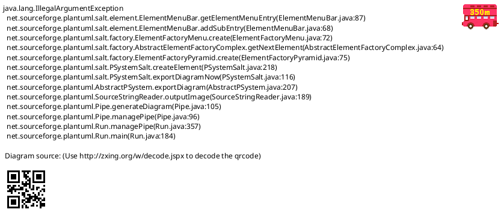
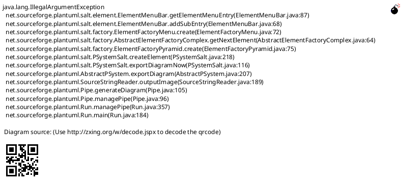
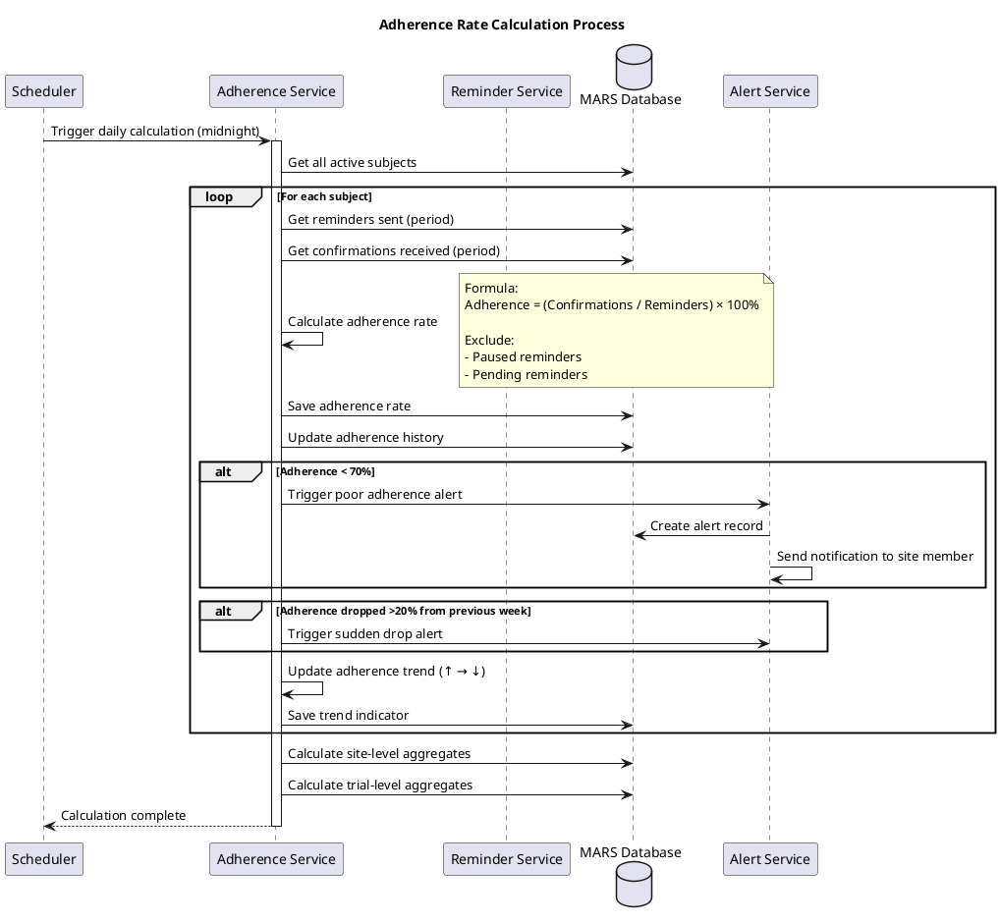
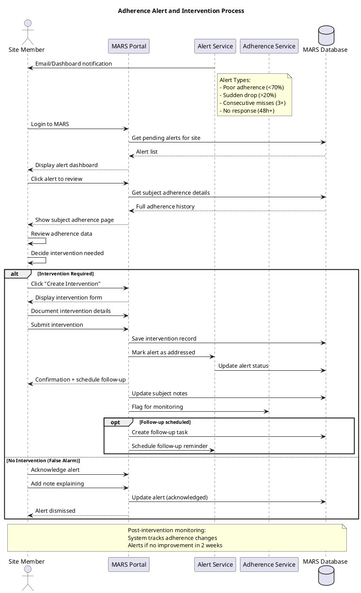

# MARS Feature Specification: Adherence Tracking

## Overview

The Adherence Tracking feature provides site members with comprehensive analytics and metrics on subject medication compliance. The system tracks medication adherence patterns, calculates compliance rates, and provides actionable insights to improve trial outcomes.

## User Stories

- **As a** site member, **I want to** view adherence metrics for my subjects, **so that** I can identify non-compliant subjects early
- **As a** site member, **I want to** see adherence trends over time, **so that** I can measure intervention effectiveness
- **As a** site member, **I want to** receive alerts for poor adherence, **so that** I can proactively intervene
- **As a** sponsor, **I want to** view aggregate adherence statistics, **so that** I can assess overall trial compliance

## Functional Requirements

### FR-1: Calculate Adherence Rate
- System automatically calculates adherence for each subject
- Formula: (Confirmations Received / Reminders Sent) × 100%
- Calculation period: Daily, Weekly, Monthly, Custom
- Exclude paused reminders from calculations
- Handle missed medication reporting

### FR-2: Subject Adherence Dashboard
- Display individual subject adherence metrics:
  - Overall adherence rate (%)
  - Current streak (consecutive days)
  - Longest streak
  - Total reminders sent
  - Total confirmations received
  - Missed doses
  - Last medication taken timestamp
- Visual indicators for adherence levels:
  - Green: ≥90% adherence (Excellent)
  - Yellow: 70-89% adherence (Fair)
  - Red: <70% adherence (Poor)

### FR-3: Adherence Trend Charts
- Line chart showing adherence % over time
- Bar chart comparing multiple medications
- Heat map showing daily adherence patterns
- Configurable time ranges:
  - Last 7 days
  - Last 30 days
  - Last 90 days
  - Custom date range
  - Since trial start

### FR-4: Medication-Specific Tracking
- Track adherence separately for each medication
- Compare adherence rates across medications
- Identify problematic medications
- Show compliance by time of day (AM vs PM)

### FR-5: Adherence Alerts
- Automatic alerts for poor adherence:
  - Subject drops below 70% adherence
  - 3+ consecutive missed doses
  - Sudden adherence decline (20%+ drop)
  - No response to reminders for 48+ hours
- Alert delivery:
  - Dashboard notification
  - Email to assigned site member
  - Optional SMS alert
- Alert acknowledgment and resolution tracking

### FR-6: Missed Dose Reporting
- Subjects can report missed doses via:
  - SMS reply to reminder
  - Email response
  - Subject mobile app (future)
- Missed dose reasons (optional):
  - Forgot
  - Side effects
  - Traveling
  - Medication unavailable
  - Other (free text)
- Site member review of missed dose reports

### FR-7: Medication Confirmation
- Subjects can confirm medication taken:
  - Reply "TAKEN" or "YES" to SMS reminder
  - Click confirmation link in email
  - Future: Mobile app confirmation
- Confirmation tracking:
  - Timestamp of confirmation
  - Method of confirmation (SMS, Email, App)
  - Late confirmations (after scheduled time)

### FR-8: Site-Level Adherence Metrics
- Aggregate adherence across all subjects at site:
  - Average adherence rate
  - Number of subjects by adherence category
  - Trending up/down indicators
  - Comparison to site target goals
- Subject ranking by adherence
- Identification of at-risk subjects

### FR-9: Sponsor Analytics Dashboard
- Trial-wide adherence statistics:
  - Overall trial adherence rate
  - Adherence by site comparison
  - Adherence by medication type
  - Temporal trends
  - Geographic variations
- De-identified aggregate data only
- Export capabilities for reports

### FR-10: Adherence Intervention Tracking
- Document interventions for poor adherence:
  - Phone call to subject
  - In-person counseling
  - Schedule adjustment
  - Medication change
  - Other intervention
- Track intervention outcomes:
  - Adherence rate before intervention
  - Adherence rate after intervention
  - Intervention effectiveness score
- Intervention history per subject

## User Interface Specifications

### UI-1: Subject Adherence Dashboard

#### PlantUML+SALT Mockup


#### ASCII Art Version

```
┌─────────────────────────────────────────────────────────────────────────────────────┐
│ MARS - Adherence Dashboard                                                          │
│ Subject: John Doe (ID: 12345)    Site: Memorial Hospital    Period: Last 30 Days   │
├─────────────────────────────────────────────────────────────────────────────────────┤
│                                                                                      │
│ ┌─────────────────────────────────────────────┐  ┌──────────────────────────────┐  │
│ │ Overall Adherence: 85%                      │  │ Total Reminders:      60     │  │
│ │                                             │  │ Confirmed:            51     │  │
│ │ ┌─────────────────────────────────────────┐ │  │ Missed:                9     │  │
│ │ │ Status:         FAIR     🟡             │ │  │ Pending:               0     │  │
│ │ │ Current Streak: 5 days                  │ │  │                              │  │
│ │ │ Best Streak:    12 days                 │ │  └──────────────────────────────┘  │
│ │ └─────────────────────────────────────────┘ │                                     │
│ └─────────────────────────────────────────────┘                                     │
│                                                                                      │
│ ┌─ Adherence Trend (Last 30 Days) ────────────────────────────────────────────┐    │
│ │                                                                               │    │
│ │  100% │                                                                       │    │
│ │       │                                                                       │    │
│ │   90% │                    ●═════●                                           │    │
│ │       │                   ╱       ╲                                          │    │
│ │   80% │        ●═════●                 ●═════●                               │    │
│ │       │       ╱       ╲                       ╲                              │    │
│ │   70% │  ●═════●                               ●                             │    │
│ │       │                                                                       │    │
│ │   60% ├───────┼───────┼───────┼───────┼───────┼───────┼──────►              │    │
│ │       │     Week 1   Week 2  Week 3  Week 4                                 │    │
│ │                                                                               │    │
│ └───────────────────────────────────────────────────────────────────────────────┘    │
│                                                                                      │
│ ┌─ Medication Details ─────────────────────────────────────────────────────────┐    │
│ │                                                                               │    │
│ │ ┌──────────────────┬───────────┬──────┬─────────────────┬──────────────────┐ │    │
│ │ │ Medication       │ Adherence │ Trend│ Last Taken      │ Status           │ │    │
│ │ ├──────────────────┼───────────┼──────┼─────────────────┼──────────────────┤ │    │
│ │ │ Metformin 500mg  │    90%    │  ↑   │ Today 8:15 AM   │ 🟢 Excellent    │ │    │
│ │ ├──────────────────┼───────────┼──────┼─────────────────┼──────────────────┤ │    │
│ │ │ Lisinopril 10mg  │    85%    │  →   │ Today 9:10 AM   │ 🟡 Fair         │ │    │
│ │ ├──────────────────┼───────────┼──────┼─────────────────┼──────────────────┤ │    │
│ │ │ Aspirin 81mg     │    75%    │  ↓   │ Yest. 8:00 AM   │ 🟡 Fair         │ │    │
│ │ ├──────────────────┼───────────┼──────┼─────────────────┼──────────────────┤ │    │
│ │ │ Atorvastatin 20mg│    88%    │  ↑   │ Today 10:05 PM  │ 🟢 Excellent    │ │    │
│ │ └──────────────────┴───────────┴──────┴─────────────────┴──────────────────┘ │    │
│ │                                                                               │    │
│ └───────────────────────────────────────────────────────────────────────────────┘    │
│                                                                                      │
│         [View Detailed History]     [Export Report]     [Create Intervention]       │
│                                                                                      │
└─────────────────────────────────────────────────────────────────────────────────────┘
```

### UI-2: Site Adherence Overview

#### PlantUML+SALT Mockup



#### ASCII Art Version

```
┌─────────────────────────────────────────────────────────────────────────────────────┐
│ MARS - Site Adherence Overview                                                      │
│ Site: Memorial Hospital                 Period: Last 30 Days           [Export]     │
├─────────────────────────────────────────────────────────────────────────────────────┤
│                                                                                      │
│ ┌─ Site Summary ───────────────────────────────────────────────────────────────┐    │
│ │                                                                               │    │
│ │  Average Adherence: 82%    Active Subjects: 45    Total Reminders: 2,700    │    │
│ │                                                                               │    │
│ │  ┌──────────────────────────────────────────────────────────────────────┐    │    │
│ │  │  🟢 Excellent (≥90%):    18 subjects (40%)                           │    │    │
│ │  │  🟡 Fair (70-89%):       22 subjects (49%)                           │    │    │
│ │  │  🔴 Poor (<70%):          5 subjects (11%)  ⚠ ATTENTION REQUIRED    │    │    │
│ │  └──────────────────────────────────────────────────────────────────────┘    │    │
│ │                                                                               │    │
│ └───────────────────────────────────────────────────────────────────────────────┘    │
│                                                                                      │
│ ┌─ At-Risk Subjects (Adherence < 70%) ────────────────────────────────────────┐    │
│ │                                                                               │    │
│ │ ┌───────────┬──────────────┬───────────┬──────┬─────────────┬────────────┐  │    │
│ │ │Subject ID │ Name         │ Adherence │Trend │ Alert       │ Action     │  │    │
│ │ ├───────────┼──────────────┼───────────┼──────┼─────────────┼────────────┤  │    │
│ │ │ 12345     │ John Doe     │    65%    │  ↓   │ 3 missed    │[Intervene] │  │    │
│ │ │           │              │           │      │ doses       │            │  │    │
│ │ ├───────────┼──────────────┼───────────┼──────┼─────────────┼────────────┤  │    │
│ │ │ 12389     │ Jane Smith   │    58%    │  ↓   │ No response │[Intervene] │  │    │
│ │ │           │              │           │      │ 72h         │            │  │    │
│ │ ├───────────┼──────────────┼───────────┼──────┼─────────────┼────────────┤  │    │
│ │ │ 12401     │ Bob Johnson  │    68%    │  ↓   │ Sudden drop │[Intervene] │  │    │
│ │ ├───────────┼──────────────┼───────────┼──────┼─────────────┼────────────┤  │    │
│ │ │ 12456     │ Mary Wilson  │    62%    │  →   │ Below target│[Intervene] │  │    │
│ │ ├───────────┼──────────────┼───────────┼──────┼─────────────┼────────────┤  │    │
│ │ │ 12498     │ Tom Brown    │    69%    │  ↑   │ Improving   │ [Monitor]  │  │    │
│ │ └───────────┴──────────────┴───────────┴──────┴─────────────┴────────────┘  │    │
│ │                                                                               │    │
│ └───────────────────────────────────────────────────────────────────────────────┘    │
│                                                                                      │
│ ┌─ Adherence Distribution ─────────────────────────────────────────────────────┐    │
│ │                                                                               │    │
│ │   50% │                                                                       │    │
│ │       │     ████                                                              │    │
│ │   40% │     ████                                                              │    │
│ │       │     ████                                                              │    │
│ │   30% │     ████                                                              │    │
│ │       │     ████                                                              │    │
│ │   20% │     ████        ████                                                  │    │
│ │       │     ████        ████                                                  │    │
│ │   10% │     ████        ████        ████                                      │    │
│ │       │     ████        ████        ████                                      │    │
│ │    0% ├─────████────────████────────████──────►                              │    │
│ │       │   90-100%      70-89%       <70%                                      │    │
│ │       │   Excellent     Fair         Poor                                     │    │
│ │                                                                               │    │
│ └───────────────────────────────────────────────────────────────────────────────┘    │
│                                                                                      │
└─────────────────────────────────────────────────────────────────────────────────────┘
```

### UI-3: Adherence Intervention Form

#### PlantUML+SALT Mockup



#### ASCII Art Version

```
┌─────────────────────────────────────────────────────────────────────────────────────┐
│ MARS - Create Adherence Intervention                                                │
│ Subject: John Doe (ID: 12345)                       Current Adherence: 65% 🔴       │
├─────────────────────────────────────────────────────────────────────────────────────┤
│                                                                                      │
│ ┌─ Intervention Details ───────────────────────────────────────────────────────┐    │
│ │                                                                               │    │
│ │  Date: [01/15/2026 📅]            Time: [14:30]                              │    │
│ │                                                                               │    │
│ │  Intervention Type:  [▼ Phone Call                                        ]  │    │
│ │                      Options: Phone Call, In-Person, Email, Video Call       │    │
│ │                                                                               │    │
│ │  Performed By:       [Sarah Johnson (Site Coordinator)                    ]  │    │
│ │                                                                               │    │
│ └───────────────────────────────────────────────────────────────────────────────┘    │
│                                                                                      │
│ ┌─ Subject Contact ────────────────────────────────────────────────────────────┐    │
│ │                                                                               │    │
│ │  Contact Method:     [▼ Phone Call                                        ]  │    │
│ │  Duration:           [15 minutes                                          ]  │    │
│ │  Subject Response:   [▼ Receptive                                         ]  │    │
│ │                      Options: Receptive, Neutral, Defensive, Unresponsive    │    │
│ │                                                                               │    │
│ └───────────────────────────────────────────────────────────────────────────────┘    │
│                                                                                      │
│ ┌─ Identified Issues ──────────────────────────────────────────────────────────┐    │
│ │                                                                               │    │
│ │  [✓] Forgetfulness                      [ ] Lack of Understanding            │    │
│ │  [ ] Side Effects                       [ ] Medication Cost                  │    │
│ │  [✓] Complex Schedule                   [✓] Traveling Frequently             │    │
│ │  [ ] Other: [________________________________________]                       │    │
│ │                                                                               │    │
│ └───────────────────────────────────────────────────────────────────────────────┘    │
│                                                                                      │
│ ┌─ Actions Taken ──────────────────────────────────────────────────────────────┐    │
│ │                                                                               │    │
│ │  ┌───────────────────────────────────────────────────────────────────────┐   │    │
│ │  │ Discussed importance of adherence for trial success.                 │   │    │
│ │  │ Recommended setting phone alarms in addition to reminders.            │   │    │
│ │  │ Adjusted morning reminder from 8 AM to 9 AM to fit schedule.          │   │    │
│ │  │ Provided pill organizer to help with complex schedule.                │   │    │
│ │  │                                                                        │   │    │
│ │  │                                                                        │   │    │
│ │  └───────────────────────────────────────────────────────────────────────┘   │    │
│ │                                                                               │    │
│ └───────────────────────────────────────────────────────────────────────────────┘    │
│                                                                                      │
│ ┌─ Follow-Up Plan ─────────────────────────────────────────────────────────────┐    │
│ │                                                                               │    │
│ │  Next Review Date:   [01/29/2026 📅]                                         │    │
│ │                                                                               │    │
│ │  [✓] Schedule follow-up call in 2 weeks                                      │    │
│ │  [ ] Increase reminder frequency                                              │    │
│ │  [✓] Monitor adherence closely                                                │    │
│ │  [ ] Refer to study coordinator                                               │    │
│ │                                                                               │    │
│ └───────────────────────────────────────────────────────────────────────────────┘    │
│                                                                                      │
│                                                                                      │
│    [Cancel]          [Save Intervention]          [Save & Send to Coordinator]      │
│                                                                                      │
└─────────────────────────────────────────────────────────────────────────────────────┘
```

## Process Flow

### Adherence Calculation Process



#### ASCII Art Version

```
Scheduler    Adherence Svc    Reminder Svc    MARS DB    Alert Service
    |               |                |            |              |
    |-- Trigger daily calculation (midnight) --->|              |
    |               |                |            |              |
    |               |--- Get all active subjects ->              |
    |               |<-- Subject list ------------|              |
    |               |                |            |              |
    |               +-- For each subject ------+  |              |
    |               |                |         |  |              |
    |               |--- Get reminders sent (period) ----------->|
    |               |<-- Reminder count ----------|              |
    |               |                |            |              |
    |               |--- Get confirmations (period) ------------>|
    |               |<-- Confirmation count ------|              |
    |               |                |            |              |
    |               |-- Calculate adherence rate  |              |
    |               |   Formula: (Confirmations / Reminders) × 100%
    |               |   Exclude: Paused, Pending  |              |
    |               |                |            |              |
    |               |--- Save adherence rate -------------------->|
    |               |--- Update adherence history --------------->|
    |               |                |            |              |
    |               +-- Check thresholds ------+  |              |
    |               |                |         |  |              |
    |               +-- IF Adherence < 70% ---+  |              |
    |               |                |            |              |
    |               |--- Trigger poor adherence alert ---------->|
    |               |                |            |              |
    |               |                |            |<- Create alert -|
    |               |                |            |<- Send notification to site member
    |               |                |            |              |
    |               +-- IF Drop > 20% ---------+  |              |
    |               |                |            |              |
    |               |--- Trigger sudden drop alert ------------->|
    |               |                |            |              |
    |               |-- Update trend (↑ → ↓) -----              |
    |               |--- Save trend indicator ------------------->|
    |               |                |            |              |
    |               +-- End subject loop ------+  |              |
    |               |                |            |              |
    |               |--- Calculate site-level aggregates ------->|
    |               |--- Calculate trial-level aggregates ------>|
    |               |                |            |              |
    |<-- Calculation complete -------|            |              |
    |               |                |            |              |
```

### Adherence Alert Workflow



#### ASCII Art Version

```
Site Member    MARS Portal    Alert Service    Adherence Svc    MARS DB
     |               |                |                |            |
     |<-- Email/Dashboard notification --|            |            |
     |               |                |                |            |
     |-- Login to MARS -->            |                |            |
     |               |                |                |            |
     |               |--- Get pending alerts for site ------------->|
     |               |<-- Alert list -------------------------------|
     |<-- Display alert dashboard ---|                |            |
     |               |                |                |            |
     |-- Click alert to review ------>|                |            |
     |               |                |                |            |
     |               |--- Get subject adherence details ----------->|
     |               |<-- Full adherence history -------------------|
     |<-- Show subject adherence page                 |            |
     |               |                |                |            |
     |-- Review data -|               |                |            |
     |-- Decide intervention needed   |                |            |
     |               |                |                |            |
     +-- IF Intervention Required ---+                |            |
     |               |                |                |            |
     |-- Create Intervention -------->|                |            |
     |<-- Display intervention form --|                |            |
     |               |                |                |            |
     |-- Document details ----------->|                |            |
     |-- Submit intervention -------->|                |            |
     |               |                |                |            |
     |               |--- Save intervention record ------------------->|
     |               |--- Mark alert as addressed ---->|            |
     |               |                |                |            |
     |               |                |<- Update alert status ------|
     |<-- Confirmation + schedule follow-up ----------|            |
     |               |                |                |            |
     |               |--- Update subject notes ---------------------->|
     |               |--- Flag for monitoring -------->|            |
     |               |                |                |            |
     |               |--- Create follow-up task --------------------->|
     |               |--- Schedule follow-up reminder ->            |
     |               |                |                |            |
     +-- ELSE No Intervention (False Alarm) -------+  |            |
     |               |                |                |            |
     |-- Acknowledge alert ---------->|                |            |
     |-- Add note explaining -------->|                |            |
     |               |                |                |            |
     |               |--- Update alert (acknowledged) -------------->|
     |<-- Alert dismissed ------------|                |            |
     |               |                |                |            |

Note: Post-intervention monitoring tracks adherence changes
      and alerts if no improvement in 2 weeks
```

## Business Rules

### BR-1: Adherence Calculation
- Adherence calculated daily at midnight (site local time)
- Minimum 7 days of data required for valid calculation
- Paused reminders excluded from denominator
- Pending (not yet sent) reminders excluded
- Late confirmations (within 24 hours) count as adherent

### BR-2: Adherence Classification
- Excellent: ≥90% adherence (Green indicator)
- Fair: 70-89% adherence (Yellow indicator)
- Poor: <70% adherence (Red indicator)
- Thresholds configurable per trial protocol

### BR-3: Alert Triggers
- Poor adherence: <70% for 7+ consecutive days
- Sudden drop: ≥20% decrease from previous week
- Consecutive misses: 3+ doses without confirmation
- No response: 48+ hours without any confirmation
- Alert sent once per condition (no duplicates)

### BR-4: Intervention Tracking
- All interventions documented in subject record
- Pre-intervention adherence rate captured
- Post-intervention monitoring for 30 days
- Intervention effectiveness calculated after 30 days
- Multiple interventions allowed per subject

### BR-5: Streak Calculation
- Streak = consecutive days with all medications confirmed
- Streak breaks on any missed confirmation
- Paused medications don't break streak
- Current streak and best streak tracked separately

### BR-6: Reporting Periods
- Daily: Last 24 hours
- Weekly: Last 7 days (rolling)
- Monthly: Last 30 days (rolling)
- Trial-to-date: Since subject enrollment
- Custom: User-specified date range

## Data Model

### Adherence Metrics Entity

| Field | Type | Required | Description |
|-------|------|----------|-------------|
| MetricID | GUID | Yes | Unique identifier |
| SubjectID | GUID | Yes | Reference to subject |
| CalculationDate | Date | Yes | Date of calculation |
| PeriodType | Enum | Yes | Daily, Weekly, Monthly, TrialToDate |
| AdherenceRate | Decimal(5,2) | Yes | Adherence percentage (0.00-100.00) |
| TotalReminders | Int | Yes | Reminders sent in period |
| ConfirmedDoses | Int | Yes | Confirmations received |
| MissedDoses | Int | Yes | Unconfirmed doses |
| CurrentStreak | Int | Yes | Consecutive adherent days |
| BestStreak | Int | Yes | Longest streak achieved |
| TrendIndicator | Enum | Yes | Up, Down, Stable |
| Classification | Enum | Yes | Excellent, Fair, Poor |
| CreatedDate | DateTime | Yes | Calculation timestamp |

### Medication Adherence Entity

| Field | Type | Required | Description |
|-------|------|----------|-------------|
| MedicationAdherenceID | GUID | Yes | Unique identifier |
| SubjectID | GUID | Yes | Reference to subject |
| ReminderID | GUID | Yes | Reference to medication reminder |
| CalculationDate | Date | Yes | Date of calculation |
| AdherenceRate | Decimal(5,2) | Yes | Medication-specific adherence % |
| TotalReminders | Int | Yes | Reminders for this medication |
| ConfirmedDoses | Int | Yes | Confirmations for this medication |
| MissedDoses | Int | Yes | Missed doses for this medication |

### Adherence Alert Entity

| Field | Type | Required | Description |
|-------|------|----------|-------------|
| AlertID | GUID | Yes | Unique identifier |
| SubjectID | GUID | Yes | Reference to subject |
| AlertType | Enum | Yes | PoorAdherence, SuddenDrop, ConsecutiveMisses, NoResponse |
| TriggeredDate | DateTime | Yes | When alert generated |
| AdherenceRate | Decimal(5,2) | Yes | Adherence rate at alert time |
| Severity | Enum | Yes | High, Medium, Low |
| Status | Enum | Yes | Pending, Acknowledged, Addressed, Dismissed |
| AssignedTo | GUID | No | Site member assigned |
| AcknowledgedDate | DateTime | No | When acknowledged |
| AcknowledgedBy | GUID | No | Who acknowledged |
| ResolutionNotes | String(500) | No | How addressed |

### Intervention Record Entity

| Field | Type | Required | Description |
|-------|------|----------|-------------|
| InterventionID | GUID | Yes | Unique identifier |
| SubjectID | GUID | Yes | Reference to subject |
| AlertID | GUID | No | Related alert (if applicable) |
| InterventionDate | DateTime | Yes | When intervention performed |
| InterventionType | Enum | Yes | PhoneCall, InPerson, Email, VideoCall, Other |
| PerformedBy | GUID | Yes | Site member who performed |
| ContactDuration | Int | No | Duration in minutes |
| SubjectResponse | Enum | Yes | Receptive, Neutral, Defensive, Unresponsive |
| IdentifiedIssues | JSON | Yes | Array of issue codes |
| ActionsTaken | String(2000) | Yes | Detailed description |
| FollowUpDate | Date | No | Scheduled follow-up date |
| FollowUpActions | JSON | No | Array of follow-up tasks |
| PreAdherenceRate | Decimal(5,2) | Yes | Adherence before intervention |
| PostAdherenceRate | Decimal(5,2) | No | Adherence 30 days after |
| EffectivenessScore | Decimal(5,2) | No | Calculated effectiveness |
| CreatedDate | DateTime | Yes | Record creation timestamp |

## Non-Functional Requirements

### NFR-1: Performance
- Adherence calculations complete within 5 minutes (all subjects)
- Dashboard loads within 2 seconds
- Real-time adherence updates within 1 minute of confirmation
- Support 10,000+ subjects per trial

### NFR-2: Accuracy
- Adherence calculations accurate to 0.01%
- No false negatives on alert triggers
- Time zone handling accurate for all subjects
- Historical data immutable (audit trail)

### NFR-3: Availability
- Adherence data available 24/7
- Alert delivery within 15 minutes of trigger
- Scheduled calculations run even during maintenance
- Graceful degradation if external services unavailable

### NFR-4: Scalability
- Support 100+ sites per trial
- Handle 1,000,000+ adherence calculations per month
- Dashboard responsive with 1+ year of historical data
- Efficient database indexing for time-series queries

### NFR-5: Compliance
- All calculations auditable
- PHI protection in aggregate reports (sponsor view)
- Alert notifications HIPAA compliant
- Data retention per regulatory requirements
- Export capabilities for regulatory submissions

## Testing Requirements

### Test Scenarios

1. **Calculate Daily Adherence**
   - Subject with 100% adherence (all confirmed)
   - Subject with 50% adherence (half missed)
   - Subject with 0% adherence (none confirmed)
   - Verify classification (Excellent, Fair, Poor)

2. **Adherence Trend Detection**
   - Stable adherence over time
   - Improving adherence (trend up)
   - Declining adherence (trend down)
   - Sudden 20%+ drop

3. **Alert Generation**
   - Trigger poor adherence alert (<70%)
   - Trigger sudden drop alert (>20% decline)
   - Trigger consecutive miss alert (3+)
   - Trigger no response alert (48h+)
   - Verify no duplicate alerts

4. **Streak Calculation**
   - Calculate current streak correctly
   - Break streak on missed dose
   - Handle paused medications in streak
   - Track best streak accurately

5. **Intervention Effectiveness**
   - Document pre-intervention adherence
   - Track post-intervention adherence (30 days)
   - Calculate effectiveness score
   - Multiple interventions for same subject

6. **Medication-Specific Adherence**
   - Subject on multiple medications
   - Different adherence rates per medication
   - Identify problematic medication
   - Compare AM vs PM adherence

7. **Site-Level Aggregation**
   - Calculate average adherence across subjects
   - Count subjects by classification
   - Identify at-risk subjects
   - Generate distribution chart

8. **Sponsor Analytics**
   - De-identified aggregate data only
   - Trial-wide statistics
   - Site comparison
   - Temporal trends

9. **Time Zone Handling**
   - Subjects in different time zones
   - Site in different time zone from subject
   - Daylight saving time transitions
   - Midnight boundary calculations

10. **Historical Data**
    - Load 1 year of adherence history
    - Export adherence report
    - View trend charts for extended periods
    - Performance with large datasets

## Related Documentation

- [MARS Use Cases](/current/src/docs/architecture/mars/use-cases.md) - UC_ManageAppointments, UC_ViewMessageThread
- [Medication Reminders Feature](/current/src/docs/features/mars/reminders.md) - Related feature
- [Analytics Dashboard Feature](/current/src/docs/features/mars/analytics.md) - Reporting features
- [Subject Management Feature](/current/src/docs/features/mars/subject-management.md) - Subject profiles

## Implementation Notes

### Phase 1: Core Metrics
- Basic adherence calculation (daily, weekly, monthly)
- Subject adherence dashboard
- Medication-specific tracking
- Manual intervention documentation

### Phase 2: Alerting & Automation
- Automated alert generation
- Alert delivery (email, dashboard)
- Trend detection
- Streak calculation

### Phase 3: Advanced Analytics
- Predictive analytics
- Intervention effectiveness analysis
- Site comparison tools
- Sponsor analytics dashboard
- Machine learning for risk prediction

## Change History

| Version | Date | Author | Changes |
|---------|------|--------|---------|
| 1.0 | 2026-01-13 | System | Initial specification with dual-format mockups |
