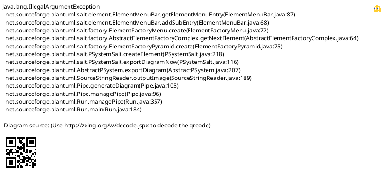
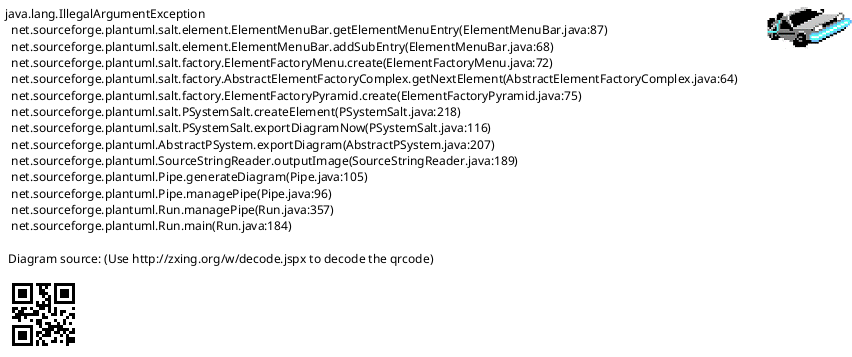
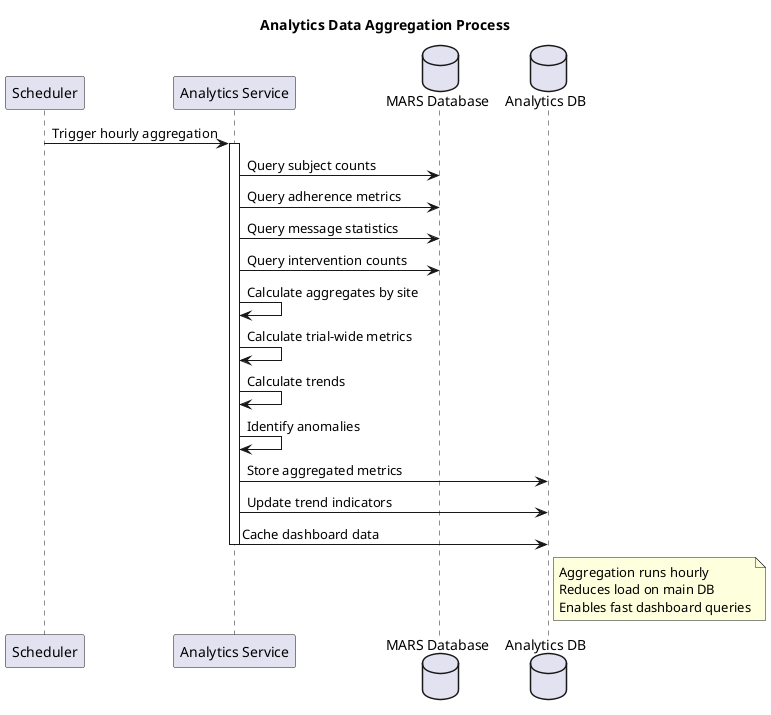

# MARS Feature Specification: Analytics Dashboard

## Overview

The Analytics Dashboard provides comprehensive reporting and visualization capabilities for MARS sponsors and managers to monitor trial performance, subject adherence, and system usage across all sites.

## User Stories

- **As a** sponsor, **I want to** view real-time trial statistics, **so that** I can monitor trial progress
- **As a** sponsor, **I want to** analyze adherence trends across sites, **so that** I can identify underperforming sites
- **As a** MARS manager, **I want to** track system usage metrics, **so that** I can optimize resource allocation
- **As a** site member, **I want to** view my site's performance, **so that** I can compare against trial averages

## Functional Requirements

### FR-1: Real-Time Dashboard
- Display current trial metrics updated every 5-15 minutes
- Key metrics:
  - Total active subjects across all sites
  - Overall adherence rate
  - Reminders sent (today, this week, this month)
  - Active sites count
  - At-risk subjects count
  - System health status

### FR-2: Adherence Analytics
- Trial-wide adherence statistics
- Adherence by site comparison
- Adherence by medication type
- Trend analysis over time
- At-risk subject identification

### FR-3: Enrollment Metrics
- Enrollment by site (bar chart)
- Enrollment trend over time (line chart)
- Enrollment velocity (subjects/week)
- Geographic distribution (map view)
- Status breakdown (active, paused, withdrawn, completed)

### FR-4: Message Delivery Analytics
- Total messages sent/delivered
- Delivery success rate by method (SMS vs Email)
- Failed delivery analysis
- Peak messaging times
- Message volume trends

### FR-5: Site Performance Comparison
- Site ranking by adherence
- Site enrollment rates
- Site message delivery success
- Intervention effectiveness by site

### FR-6: Custom Date Ranges
- Last 7 days
- Last 30 days
- Last 90 days
- Month-to-date
- Year-to-date
- Custom date range selector
- Comparison to previous period

### FR-7: Export Capabilities
- Export charts as PNG/PDF
- Export data as Excel/CSV
- Scheduled report delivery via email
- Custom report builder

### FR-8: Data Filtering
- Filter by site(s)
- Filter by date range
- Filter by subject status
- Filter by adherence level
- Saved filter presets

## User Interface Specifications

### UI-1: Sponsor Real-Time Dashboard

#### PlantUML+SALT Mockup



#### ASCII Art Version

```
┌─────────────────────────────────────────────────────────────────────────────────────┐
│ MARS Analytics - Sponsor Dashboard                                                  │
│ Trial: ACME-2026-001        Last Updated: 01/15/2026 10:45 AM  [Auto-Refresh: ON]  │
├─────────────────────────────────────────────────────────────────────────────────────┤
│                                                                                      │
│ ┌─ Trial Overview ─────────────────────┐  ┌─ Recent Activity ────────────────────┐ │
│ │                                       │  │                                       │ │
│ │  Total Active Subjects:       248    │  │  Messages (30 days):      42,180     │ │
│ │  Overall Adherence:         84.5%    │  │  Delivery Success:         96.8%     │ │
│ │  Active Sites:                 12    │  │  At-Risk Subjects:      18 (7.3%)    │ │
│ │  Reminders Today:           1,456    │  │  Interventions (30 days):    34      │ │
│ │                                       │  │                                       │ │
│ └───────────────────────────────────────┘  └───────────────────────────────────────┘ │
│                                                                                      │
│ ┌─ Adherence Trend (Last 90 Days) ────────────────────────────────────────────┐    │
│ │                                                                               │    │
│ │  100% │                                                                       │    │
│ │       │                        ●═════●═════●                                 │    │
│ │   90% │                ●═════●                 ●═════●                       │    │
│ │       │        ●═════●                                 ●                     │    │
│ │   80% │═════●                                                                │    │
│ │       │                                                                       │    │
│ │   70% ├───────┼───────┼───────┼───────┼───────┼───────┼───────►             │    │
│ │       │     Nov     Dec      Jan                                             │    │
│ │                                                                               │    │
│ └───────────────────────────────────────────────────────────────────────────────┘    │
│                                                                                      │
│ ┌─ Enrollment by Site (Top 5) ────────┐  ┌─ Adherence Distribution ────────────┐   │
│ │                                      │  │                                      │   │
│ │  Site A  ███████████████████  45    │  │  ┌────────────────────────────────┐ │   │
│ │  Site B  ████████████████     32    │  │  │ Excellent (≥90%):   98 (40%)   │ │   │
│ │  Site C  ████████████         25    │  │  │ Fair (70-89%):     132 (53%)   │ │   │
│ │  Site D  ██████████           20    │  │  │ Poor (<70%):        18 (7%)    │ │   │
│ │  Site E  ████████             15    │  │  └────────────────────────────────┘ │   │
│ │                                      │  │                                      │   │
│ │  [View All Sites]                    │  │  ┌──────────────┐                  │   │
│ │                                      │  │  │ 🟢 40%       │                  │   │
│ │                                      │  │  │ 🟡 53%       │                  │   │
│ │                                      │  │  │ 🔴  7%       │                  │   │
│ │                                      │  │  └──────────────┘                  │   │
│ └──────────────────────────────────────┘  └──────────────────────────────────────┘   │
│                                                                                      │
│      [View Detailed Reports]      [Export Dashboard]      [Configure Widgets]       │
│                                                                                      │
└─────────────────────────────────────────────────────────────────────────────────────┘
```

### UI-2: Site Comparison Report

#### PlantUML+SALT Mockup



#### ASCII Art Version

```
┌─────────────────────────────────────────────────────────────────────────────────────┐
│ MARS Analytics - Site Comparison                                                    │
│ Period: Last 30 Days                                           [Export to Excel]    │
├─────────────────────────────────────────────────────────────────────────────────────┤
│                                                                                      │
│ ┌────────────────────┬────────┬──────────┬──────────┬──────────┬──────────────────┐ │
│ │ Site               │ Active │   Avg    │ Messages │ Delivery │  Interventions   │ │
│ │                    │Subject │Adherence │   Sent   │   Rate   │                  │ │
│ ├────────────────────┼────────┼──────────┼──────────┼──────────┼──────────────────┤ │
│ │ Memorial Hospital  │   45   │  87.2%🟡│  2,700   │  97.5%   │        8         │ │
│ ├────────────────────┼────────┼──────────┼──────────┼──────────┼──────────────────┤ │
│ │ City Medical Ctr   │   38   │  82.1%🟡│  2,280   │  95.2%   │       12         │ │
│ ├────────────────────┼────────┼──────────┼──────────┼──────────┼──────────────────┤ │
│ │ Regional Clinic    │   32   │  91.5%🟢│  1,920   │  98.1%   │        3         │ │
│ ├────────────────────┼────────┼──────────┼──────────┼──────────┼──────────────────┤ │
│ │ University Health  │   28   │  79.8%🟡│  1,680   │  94.7%   │        9         │ │
│ ├────────────────────┼────────┼──────────┼──────────┼──────────┼──────────────────┤ │
│ │ Community Care     │   25   │  85.6%🟡│  1,500   │  96.3%   │        5         │ │
│ ├────────────────────┼────────┼──────────┼──────────┼──────────┼──────────────────┤ │
│ │ Downtown Wellness  │   22   │  88.9%🟡│  1,320   │  97.8%   │        4         │ │
│ ├────────────────────┼────────┼──────────┼──────────┼──────────┼──────────────────┤ │
│ │ Suburban Health    │   20   │  76.4%🟡│  1,200   │  93.1%   │       11         │ │
│ ├────────────────────┼────────┼──────────┼──────────┼──────────┼──────────────────┤ │
│ │ Northside Medical  │   18   │  90.3%🟢│  1,080   │  98.5%   │        2         │ │
│ ├────────────────────┼────────┼──────────┼──────────┼──────────┼──────────────────┤ │
│ │ Southside Clinic   │   15   │  83.7%🟡│    900   │  95.9%   │        6         │ │
│ ├────────────────────┼────────┼──────────┼──────────┼──────────┼──────────────────┤ │
│ │ East End Health    │   12   │  86.1%🟡│    720   │  96.8%   │        4         │ │
│ └────────────────────┴────────┴──────────┴──────────┴──────────┴──────────────────┘ │
│                                                                                      │
│ ┌─ Trial Averages ─────────────────────────────────────────────────────────────┐    │
│ │                                                                               │    │
│ │  Average Adherence: 84.5%    Delivery Rate: 96.2%    Interventions: 6.4/Site│    │
│ │                                                                               │    │
│ └───────────────────────────────────────────────────────────────────────────────┘    │
│                                                                                      │
└─────────────────────────────────────────────────────────────────────────────────────┘
```

## Process Flow

### Analytics Data Aggregation



#### ASCII Art Version

```
Scheduler    Analytics Service    MARS DB    Analytics DB
    |               |                |              |
    |-- Trigger hourly aggregation ->|              |
    |               |                |              |
    |               |--- Query subject counts ----->|
    |               |--- Query adherence metrics -->|
    |               |--- Query message statistics ->|
    |               |--- Query intervention counts >|
    |               |                |              |
    |               |-- Calculate aggregates by site
    |               |-- Calculate trial-wide metrics
    |               |-- Calculate trends            |
    |               |-- Identify anomalies          |
    |               |                |              |
    |               |--- Store aggregated metrics --------------->|
    |               |--- Update trend indicators ----------------->|
    |               |--- Cache dashboard data -------------------->|
    |               |                |              |

Note: Aggregation runs hourly, reduces load on main DB,
      enables fast dashboard queries
```

## Business Rules

### BR-1: Data Refresh
- Real-time metrics updated every 5-15 minutes
- Historical aggregations calculated hourly
- Trend analysis recalculated daily
- Dashboard auto-refresh configurable (on/off)

### BR-2: De-identification
- Sponsor view shows only aggregate data
- No individual subject PHI visible to sponsors
- Site-level data aggregated (minimum 5 subjects)
- Geographic data shown at state/country level only

### BR-3: Comparison Periods
- Comparisons always to equivalent prior period
- Account for different month lengths
- Handle trial start date properly (no negative comparisons)

### BR-4: Export Limits
- Maximum 100,000 rows per Excel export
- PDF reports limited to 50 pages
- Scheduled reports sent daily/weekly/monthly only

## Data Model

### Analytics Aggregate Entity

| Field | Type | Required | Description |
|-------|------|----------|-------------|
| AggregateID | GUID | Yes | Unique identifier |
| AggregateType | Enum | Yes | Site, Trial, Medication |
| AggregateKey | String(50) | Yes | Site ID, Trial ID, etc. |
| PeriodType | Enum | Yes | Hourly, Daily, Weekly, Monthly |
| PeriodStart | DateTime | Yes | Start of aggregation period |
| PeriodEnd | DateTime | Yes | End of aggregation period |
| ActiveSubjects | Int | Yes | Active subject count |
| AverageAdherence | Decimal(5,2) | Yes | Average adherence rate |
| MessagesSent | Int | Yes | Total messages sent |
| MessagesDelivered | Int | Yes | Messages successfully delivered |
| InterventionCount | Int | Yes | Interventions performed |
| AtRiskSubjects | Int | Yes | Subjects with poor adherence |
| CalculatedDate | DateTime | Yes | When aggregation calculated |

## Non-Functional Requirements

### NFR-1: Performance
- Dashboard loads within 2 seconds
- Charts render within 1 second
- Export completes within 30 seconds (10,000 rows)
- Real-time updates without page refresh

### NFR-2: Scalability
- Support 100+ concurrent dashboard users
- Handle 10+ year historical data
- Efficient aggregation for 100+ sites
- Optimized database queries and indexes

### NFR-3: Availability
- Dashboard available 24/7
- Graceful degradation if data unavailable
- Cached metrics if database offline
- Mobile-responsive for tablet access

## Related Documentation

- [MARS Use Cases](/current/src/docs/architecture/mars/use-cases.md) - UC_RealTimeStats, UC_WindowedStats
- [Adherence Tracking Feature](/current/src/docs/features/mars/adherence-tracking.md) - Metrics source
- [Subject Management Feature](/current/src/docs/features/mars/subject-management.md) - Subject data

## Change History

| Version | Date | Author | Changes |
|---------|------|--------|---------|
| 1.0 | 2026-01-13 | System | Initial specification with dual-format mockups |
