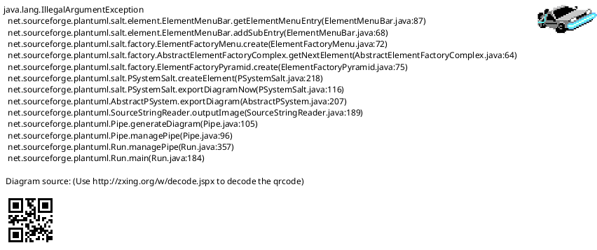
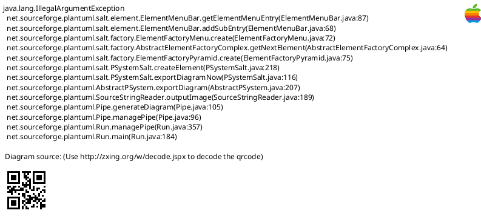
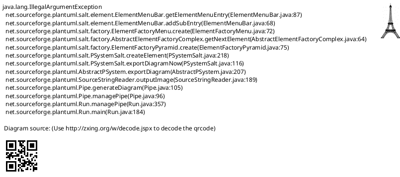
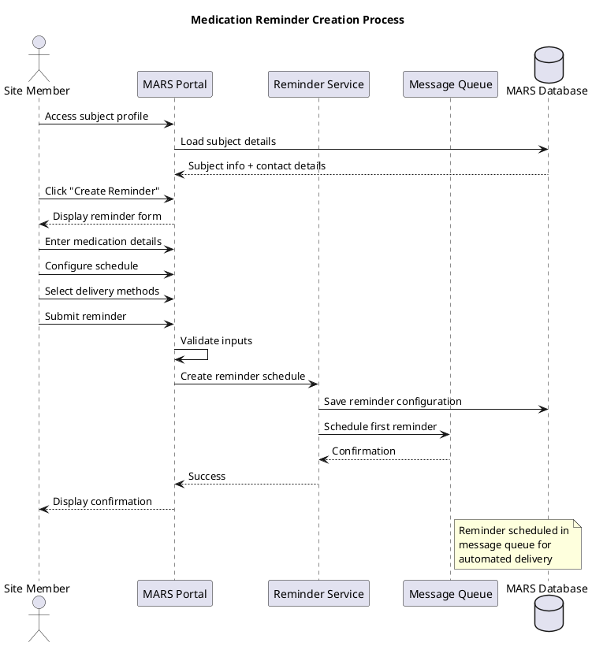

# MARS Feature Specification: Medication Reminders

## Overview

The Medication Reminders feature enables MARS site members to configure and manage automated medication adherence reminders for trial subjects. The system sends scheduled reminders via SMS and/or email to help subjects maintain medication compliance.

## User Stories

- **As a** site member, **I want to** create medication reminder schedules for subjects, **so that** they receive timely notifications to take their medications
- **As a** site member, **I want to** customize reminder frequency and timing, **so that** reminders align with subject medication schedules
- **As a** site member, **I want to** view reminder delivery status, **so that** I can verify subjects are receiving notifications
- **As a** subject, **I want to** receive medication reminders on my phone, **so that** I remember to take my medications on time

## Functional Requirements

### FR-1: Create Medication Reminder Schedule
- Site member can create a new medication reminder schedule for a subject
- System captures:
  - Medication name
  - Dosage instructions
  - Frequency (daily, twice daily, weekly, custom)
  - Time(s) of day for reminders
  - Start date and end date
  - Delivery method (SMS, Email, Both)
  - Custom message text (optional)

### FR-2: Configure Reminder Frequency
- Support standard frequencies:
  - Once daily (specify time)
  - Twice daily (specify morning/evening times)
  - Three times daily (specify times)
  - Weekly (specify day and time)
  - Custom schedule (specify specific days/times)
- Allow multiple reminders per medication

### FR-3: Customize Reminder Messages
- Default template: "Reminder: Time to take your [medication name] - [dosage]"
- Site member can customize message text
- Message includes:
  - Medication name
  - Dosage information
  - Optional special instructions
  - Site contact information

### FR-4: Delivery Method Configuration
- Support SMS delivery
- Support Email delivery
- Support simultaneous SMS + Email
- Validate phone number format for SMS
- Validate email address format

### FR-5: View Reminder Schedule
- Site member can view all active reminders for a subject
- Display shows:
  - Medication name
  - Schedule details
  - Next scheduled reminder date/time
  - Delivery method
  - Active/Paused status

### FR-6: Edit Reminder Schedule
- Site member can modify existing reminder schedules
- Editable fields:
  - Times of day
  - Frequency
  - End date
  - Message text
  - Delivery method
- Schedule changes take effect for future reminders

### FR-7: Pause/Resume Reminders
- Site member can temporarily pause reminders
- Common use cases:
  - Subject on vacation
  - Medication temporarily stopped
  - Subject hospitalized
- Site member can resume paused reminders
- Paused reminders maintain schedule but don't send

### FR-8: Cancel Reminder Schedule
- Site member can cancel (delete) reminder schedules
- Confirmation required before cancellation
- Cancellation stops all future reminders
- Historical sent reminders remain in message thread

### FR-9: Track Reminder Delivery Status
- System tracks delivery status for each reminder:
  - Pending (scheduled but not sent)
  - Sent (delivered to carrier/email server)
  - Delivered (confirmed delivery to device - SMS only)
  - Failed (delivery failure)
  - Bounced (invalid recipient - Email only)
- Site member can view delivery status in message thread

### FR-10: Bulk Schedule Creation
- Site member can create multiple reminder schedules at once
- Use case: Subject starting multiple medications
- Single form to configure multiple medications
- All reminders created simultaneously

## User Interface Specifications

### UI-1: Create Reminder Screen

#### PlantUML+SALT Mockup



#### ASCII Art Version

```
┌─────────────────────────────────────────────────────────────────────────────┐
│ MARS - Create Medication Reminder                                           │
│ Subject: John Doe (ID: 12345)                      Site: Memorial Hospital  │
├─────────────────────────────────────────────────────────────────────────────┤
│                                                                              │
│ ┌─ Medication Information ───────────────────────────────────────────────┐  │
│ │                                                                          │  │
│ │ Medication Name:         [_________________________________]            │  │
│ │                          Metformin 500mg                                 │  │
│ │                                                                          │  │
│ │ Dosage Instructions:     [_________________________________]            │  │
│ │                          Take with food                                  │  │
│ │                                                                          │  │
│ └──────────────────────────────────────────────────────────────────────────┘  │
│                                                                              │
│ ┌─ Reminder Schedule ────────────────────────────────────────────────────┐  │
│ │                                                                          │  │
│ │ Frequency:               [▼ Twice Daily                              ]  │  │
│ │                          ( ) Once Daily                                  │  │
│ │                          (•) Twice Daily                                 │  │
│ │                          ( ) Three Times Daily                           │  │
│ │                          ( ) Weekly                                      │  │
│ │                          ( ) Custom                                      │  │
│ │                                                                          │  │
│ │ Morning Time:            [08:00 AM ▼]                                   │  │
│ │ Evening Time:            [08:00 PM ▼]                                   │  │
│ │                                                                          │  │
│ │ Start Date:              [01/15/2026 📅]                                │  │
│ │ End Date:                [07/15/2026 📅]                                │  │
│ │                                                                          │  │
│ └──────────────────────────────────────────────────────────────────────────┘  │
│                                                                              │
│ ┌─ Delivery Settings ────────────────────────────────────────────────────┐  │
│ │                                                                          │  │
│ │ [✓] SMS to (555) 555-0123                                               │  │
│ │ [✓] Email to john.doe@email.com                                         │  │
│ │                                                                          │  │
│ └──────────────────────────────────────────────────────────────────────────┘  │
│                                                                              │
│ ┌─ Custom Message (Optional) ────────────────────────────────────────────┐  │
│ │                                                                          │  │
│ │ ┌────────────────────────────────────────────────────────────────────┐  │  │
│ │ │ Remember to take your Metformin with breakfast/dinner. Call       │  │  │
│ │ │ us at 555-SITE if you have any questions.                          │  │  │
│ │ │                                                                     │  │  │
│ │ │                                                                     │  │  │
│ │ └────────────────────────────────────────────────────────────────────┘  │  │
│ │                                                                          │  │
│ │ Characters: 95/500                                                       │  │
│ │                                                                          │  │
│ └──────────────────────────────────────────────────────────────────────────┘  │
│                                                                              │
│                                                                              │
│        [Cancel]           [Preview Message]         [Create Reminder]       │
│                                                                              │
└─────────────────────────────────────────────────────────────────────────────┘
```

### UI-2: View Reminder Schedule

#### PlantUML+SALT Mockup



#### ASCII Art Version

```
┌─────────────────────────────────────────────────────────────────────────────────────────┐
│ MARS - Medication Reminders                                                             │
│ Subject: John Doe (ID: 12345)                              [+ Create New Reminder]      │
├─────────────────────────────────────────────────────────────────────────────────────────┤
│                                                                                          │
│ ┌────────────────────┬──────────────────┬──────────────────┬────────┬───────────┬──────┐ │
│ │ Medication         │ Schedule         │ Next Reminder    │ Status │ Method    │ Act. │ │
│ ├────────────────────┼──────────────────┼──────────────────┼────────┼───────────┼──────┤ │
│ │ Metformin 500mg    │ 8:00 AM,         │ Today 8:00 PM    │ Active │ SMS+Email │ [Ed] │ │
│ │                    │ 8:00 PM Daily    │                  │        │           │ [Pa] │ │
│ ├────────────────────┼──────────────────┼──────────────────┼────────┼───────────┼──────┤ │
│ │ Lisinopril 10mg    │ 9:00 AM Daily    │ Tomorrow 9:00 AM │ Active │ SMS       │ [Ed] │ │
│ │                    │                  │                  │        │           │ [Pa] │ │
│ ├────────────────────┼──────────────────┼──────────────────┼────────┼───────────┼──────┤ │
│ │ Aspirin 81mg       │ 8:00 AM Daily    │ Today 8:00 AM    │ Paused │ Email     │ [Ed] │ │
│ │                    │                  │                  │        │           │ [Re] │ │
│ │                    │                  │                  │        │           │ [De] │ │
│ ├────────────────────┼──────────────────┼──────────────────┼────────┼───────────┼──────┤ │
│ │ Atorvastatin 20mg  │ 10:00 PM Daily   │ Today 10:00 PM   │ Active │ SMS+Email │ [Ed] │ │
│ │                    │                  │                  │        │           │ [Pa] │ │
│ └────────────────────┴──────────────────┴──────────────────┴────────┴───────────┴──────┘ │
│                                                                                          │
│ Showing 4 active schedules                                                              │
│                                                                                          │
│                  [Export to PDF]              [View All History]                        │
│                                                                                          │
└─────────────────────────────────────────────────────────────────────────────────────────┘

Legend:
  [Ed] = Edit    [Pa] = Pause    [Re] = Resume    [De] = Delete
```

### UI-3: Reminder Delivery Status

#### PlantUML+SALT Mockup



#### ASCII Art Version

```
┌─────────────────────────────────────────────────────────────────────────────────────┐
│ MARS - Reminder Delivery Status                                                     │
│ Medication: Metformin 500mg                           Subject: John Doe             │
├─────────────────────────────────────────────────────────────────────────────────────┤
│                                                                                      │
│ Date Range: [01/01/2026] to [01/15/2026]                      [Filter]             │
│                                                                                      │
│ ┌───────────┬─────────────────────────┬────────┬───────────┬──────────────────────┐ │
│ │ Date/Time │ Message                 │ Method │ Status    │ Details              │ │
│ ├───────────┼─────────────────────────┼────────┼───────────┼──────────────────────┤ │
│ │ 01/15     │ Time to take            │ SMS    │ ✓ Deliver │ Carrier confirmed    │ │
│ │ 8:00 AM   │ Metformin...            │        │           │                      │ │
│ ├───────────┼─────────────────────────┼────────┼───────────┼──────────────────────┤ │
│ │ 01/15     │ Time to take            │ Email  │ ✓ Sent    │ Opened 8:05 AM       │ │
│ │ 8:00 AM   │ Metformin...            │        │           │                      │ │
│ ├───────────┼─────────────────────────┼────────┼───────────┼──────────────────────┤ │
│ │ 01/14     │ Time to take            │ SMS    │ ✓ Deliver │ Carrier confirmed    │ │
│ │ 8:00 PM   │ Metformin...            │        │           │                      │ │
│ ├───────────┼─────────────────────────┼────────┼───────────┼──────────────────────┤ │
│ │ 01/14     │ Time to take            │ Email  │ ✓ Sent    │ Opened 8:12 PM       │ │
│ │ 8:00 PM   │ Metformin...            │        │           │                      │ │
│ ├───────────┼─────────────────────────┼────────┼───────────┼──────────────────────┤ │
│ │ 01/14     │ Time to take            │ SMS    │ ✓ Deliver │ Carrier confirmed    │ │
│ │ 8:00 AM   │ Metformin...            │        │           │                      │ │
│ ├───────────┼─────────────────────────┼────────┼───────────┼──────────────────────┤ │
│ │ 01/14     │ Time to take            │ Email  │ ✓ Sent    │ Not opened           │ │
│ │ 8:00 AM   │ Metformin...            │        │           │                      │ │
│ ├───────────┼─────────────────────────┼────────┼───────────┼──────────────────────┤ │
│ │ 01/13     │ Time to take            │ SMS    │ ✗ Failed  │ Invalid number       │ │
│ │ 8:00 PM   │ Metformin...            │        │           │                      │ │
│ ├───────────┼─────────────────────────┼────────┼───────────┼──────────────────────┤ │
│ │ 01/13     │ Time to take            │ Email  │ ✓ Sent    │ Opened 8:03 PM       │ │
│ │ 8:00 PM   │ Metformin...            │        │           │                      │ │
│ └───────────┴─────────────────────────┴────────┴───────────┴──────────────────────┘ │
│                                                                                      │
│ Summary Statistics:                                                                 │
│ ┌─────────────────────────────────────────────────────────────────────────────────┐ │
│ │ Total Sent: 16    Delivered: 14    Failed: 2    Success Rate: 87.5%            │ │
│ └─────────────────────────────────────────────────────────────────────────────────┘ │
│                                                                                      │
│      [Back to Schedule]      [Export Report]      [Troubleshoot Failed]            │
│                                                                                      │
└─────────────────────────────────────────────────────────────────────────────────────┘
```

## Process Flow

### Reminder Creation Process



#### ASCII Art Version

```
Site Member    MARS Portal    Reminder Service    Message Queue    MARS Database
     |              |                 |                  |                |
     |--- Access subject profile ---->|                  |                |
     |              |                 |                  |                |
     |              |--- Load subject details -------------------------->|
     |              |<--------------- Subject info + contact ------------|
     |              |                 |                  |                |
     |-- Create Reminder -->          |                  |                |
     |<-- Display form ---|           |                  |                |
     |              |                 |                  |                |
     |-- Enter details -->            |                  |                |
     |-- Configure schedule ->        |                  |                |
     |-- Select delivery ->           |                  |                |
     |-- Submit ----->|               |                  |                |
     |              |                 |                  |                |
     |              |-- Validate -->  |                  |                |
     |              |                 |                  |                |
     |              |--- Create reminder schedule ------>|                |
     |              |                 |                  |                |
     |              |                 |--- Save config ---------------->|
     |              |                 |                  |                |
     |              |                 |--- Schedule first reminder ----->|
     |              |                 |<-- Confirmation --|                |
     |              |                 |                  |                |
     |              |<-- Success -----|                  |                |
     |<-- Confirmation --|            |                  |                |
     |              |                 |                  |                |

Note: Reminder scheduled in message queue for automated delivery
```

### Reminder Delivery Process

```plantuml
@startuml Reminder Delivery Flow
title Automated Reminder Delivery Process

participant "Scheduler" as Scheduler
participant "Reminder Service" as Service
participant "Message Gateway" as Gateway
participant "SMS Provider" as SMS
participant "Email Server" as Email
database "MARS Database" as DB

Scheduler -> Service: Trigger scheduled reminder
activate Service
Service -> DB: Retrieve reminder details
DB --> Service: Reminder + subject contact

Service -> Service: Check if active (not paused)
alt Reminder is Active
  Service -> Service: Generate message from template
  Service -> DB: Log reminder attempt

  par SMS Delivery
    Service -> Gateway: Send SMS request
    Gateway -> SMS: Deliver to carrier
    SMS --> Gateway: Delivery status
    Gateway --> Service: SMS result
    Service -> DB: Update SMS status
  and Email Delivery
    Service -> Gateway: Send Email request
    Gateway -> Email: Deliver via SMTP
    Email --> Gateway: Send status
    Gateway --> Service: Email result
    Service -> DB: Update Email status
  end

  Service -> Scheduler: Schedule next reminder
  Service --> DB: Update next reminder time
else Reminder is Paused
  Service -> DB: Log skipped (paused)
  Service -> Scheduler: Reschedule check
end
deactivate Service

@enduml
```

#### ASCII Art Version

```
Scheduler  Reminder Svc  Message Gateway  SMS Provider  Email Server  MARS DB
    |            |              |               |              |          |
    |-- Trigger reminder ------>|               |              |          |
    |            |              |               |              |          |
    |            |-- Retrieve reminder details ---------------------------->|
    |            |<------------- Reminder + subject contact ---------------|
    |            |              |               |              |          |
    |            |-- Check if active           |              |          |
    |            |              |               |              |          |
    |            |-- Generate message          |              |          |
    |            |-- Log attempt ------------------------------------------->|
    |            |              |               |              |          |
    +------------+-- SMS Delivery Path --------------------------------+  |
    |            |              |               |              |          |
    |            |--- Send SMS request ------->|               |          |
    |            |              |               |              |          |
    |            |              |--- Deliver to carrier ----->|          |
    |            |              |<-- Delivery status ---------|          |
    |            |<-- SMS result ---|          |              |          |
    |            |-- Update SMS status -------------------------------->|
    |            |              |               |              |          |
    +------------+-- Email Delivery Path (parallel) ------------------+  |
    |            |              |               |              |          |
    |            |--- Send Email request ----->|               |          |
    |            |              |               |              |          |
    |            |              |--- Deliver via SMTP ----------------->|
    |            |              |<-- Send status -----------------------|
    |            |<-- Email result --|          |              |          |
    |            |-- Update Email status ------------------------------>|
    |            |              |               |              |          |
    +------------+-- End Parallel Delivery --------------------------------+
    |            |              |               |              |          |
    |            |-- Schedule next reminder --->|               |          |
    |            |-- Update next reminder time ------------------------->|
    |            |              |               |              |          |

Alternative Flow (Paused):
    |            |-- Log skipped (paused) ------------------------------->|
    |            |-- Reschedule check ---->|               |              |
```

## Business Rules

### BR-1: Reminder Timing
- Reminders sent at exact scheduled time (within 1-minute tolerance)
- If system downtime occurs, missed reminders sent immediately upon recovery
- Maximum 1 missed reminder per schedule period

### BR-2: Message Delivery
- SMS messages limited to 160 characters
- Email messages can include formatting and longer text
- Both methods include unsubscribe/opt-out instructions
- Delivery failures trigger automatic retry (3 attempts)

### BR-3: Schedule Conflicts
- Multiple medications can have overlapping reminder times
- System sends separate message for each medication
- Option to combine reminders if timing within 15-minute window

### BR-4: Pause/Resume
- Paused reminders maintain schedule but don't send
- Resume continues from next scheduled time (doesn't send missed)
- Pause duration tracked for reporting

### BR-5: End Date Behavior
- Reminders automatically stop after end date
- Schedule remains in system for historical reference
- Site member notified 7 days before schedule expires

## Data Model

### Reminder Schedule Entity

| Field | Type | Required | Description |
|-------|------|----------|-------------|
| ReminderID | GUID | Yes | Unique identifier |
| SubjectID | GUID | Yes | Reference to subject |
| MedicationName | String(100) | Yes | Medication name |
| Dosage | String(50) | Yes | Dosage instructions |
| Frequency | Enum | Yes | Daily, TwiceDaily, ThreeTimesDaily, Weekly, Custom |
| ScheduleTimes | JSON | Yes | Array of time(s) for reminders |
| StartDate | Date | Yes | First reminder date |
| EndDate | Date | No | Last reminder date (null = indefinite) |
| DeliveryMethodSMS | Boolean | Yes | Enable SMS delivery |
| DeliveryMethodEmail | Boolean | Yes | Enable email delivery |
| CustomMessage | String(500) | No | Optional custom message text |
| Status | Enum | Yes | Active, Paused, Cancelled, Completed |
| CreatedBy | GUID | Yes | Site member who created |
| CreatedDate | DateTime | Yes | Creation timestamp |
| ModifiedBy | GUID | No | Last modifier |
| ModifiedDate | DateTime | No | Last modification timestamp |
| NextReminderDate | DateTime | Yes | Next scheduled reminder |

### Reminder Delivery Log Entity

| Field | Type | Required | Description |
|-------|------|----------|-------------|
| DeliveryID | GUID | Yes | Unique identifier |
| ReminderID | GUID | Yes | Reference to reminder schedule |
| ScheduledDateTime | DateTime | Yes | When reminder was scheduled |
| ActualSentDateTime | DateTime | No | When actually sent |
| DeliveryMethod | Enum | Yes | SMS or Email |
| MessageText | String(500) | Yes | Actual message sent |
| DeliveryStatus | Enum | Yes | Pending, Sent, Delivered, Failed, Bounced |
| StatusDetails | String(200) | No | Additional status information |
| RetryCount | Int | Yes | Number of delivery attempts |
| RecipientAddress | String(100) | Yes | Phone or email recipient |

## Non-Functional Requirements

### NFR-1: Performance
- Reminder creation completes within 2 seconds
- Support 10,000+ concurrent scheduled reminders
- Delivery status updates within 30 seconds of carrier confirmation

### NFR-2: Reliability
- 99.9% delivery success rate for valid contacts
- Automatic retry on transient failures
- Graceful degradation if SMS provider unavailable (email fallback)

### NFR-3: Scalability
- Support 100+ reminders per subject
- Handle 50,000+ reminder deliveries per day
- Database partitioning by date for delivery logs

### NFR-4: Security
- All PHI encrypted at rest and in transit
- Access controlled by site membership
- Delivery logs retained per regulatory requirements
- Message content sanitized (no injection attacks)

### NFR-5: Compliance
- HIPAA compliant messaging
- Opt-out/unsubscribe required in all messages
- Audit trail for all reminder operations
- Data retention policies enforced

## Testing Requirements

### Test Scenarios

1. **Create Daily Reminder**
   - Verify schedule created with correct frequency
   - Confirm message template applied correctly
   - Validate delivery methods saved

2. **Create Twice Daily Reminder**
   - Verify both morning and evening times saved
   - Confirm two separate deliveries scheduled per day
   - Test time zone handling

3. **Pause and Resume Reminder**
   - Verify no messages sent while paused
   - Confirm resume continues from next scheduled time
   - Validate status updates correctly

4. **Edit Active Reminder**
   - Change time and verify next reminder updated
   - Modify message and confirm new text used
   - Update end date and validate schedule

5. **Delivery Status Tracking**
   - Mock SMS delivery and verify status updated
   - Simulate email bounce and check error handling
   - Test retry logic on transient failures

6. **Bulk Schedule Creation**
   - Create 5 medication reminders simultaneously
   - Verify all schedules created correctly
   - Confirm no duplicate deliveries

7. **End Date Expiration**
   - Verify reminders stop after end date
   - Confirm schedule marked as completed
   - Test notification sent before expiration

8. **Invalid Contact Information**
   - Test invalid phone number format
   - Test invalid email address
   - Verify appropriate error messages

## Related Documentation

- [MARS Use Cases](/current/src/docs/architecture/mars/use-cases.md) - UC_ManageAppointments
- [Adherence Tracking Feature](/current/src/docs/features/mars/adherence-tracking.md) - Related feature
- [Messaging Architecture](/current/src/docs/architecture/messaging/README.md) - Message delivery infrastructure
- [Subject Management Feature](/current/src/docs/features/mars/subject-management.md) - Subject profiles

## Implementation Notes

### Phase 1: Core Functionality
- Create/edit/delete reminder schedules
- Daily and twice daily frequencies
- SMS and email delivery
- Basic delivery status tracking

### Phase 2: Enhanced Features
- Custom frequency schedules
- Bulk schedule creation
- Advanced delivery analytics
- Message template library

### Phase 3: Intelligence
- AI-powered adherence predictions
- Optimal reminder timing recommendations
- Automated schedule adjustments
- Subject preference learning

## Change History

| Version | Date | Author | Changes |
|---------|------|--------|---------|
| 1.0 | 2026-01-13 | System | Initial specification with dual-format mockups |
