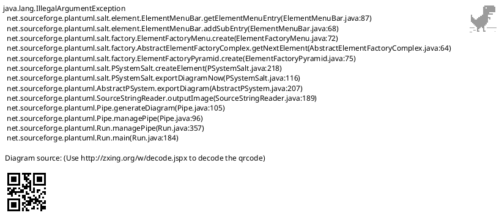
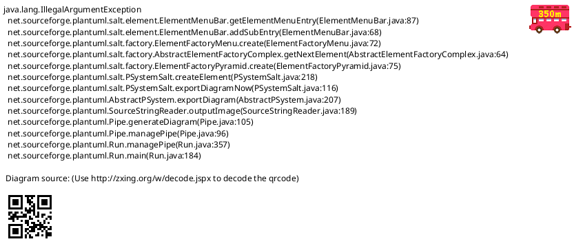
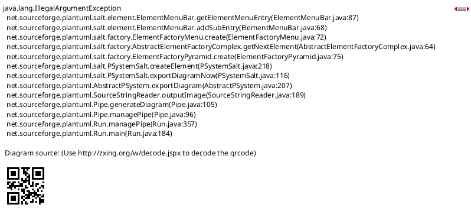
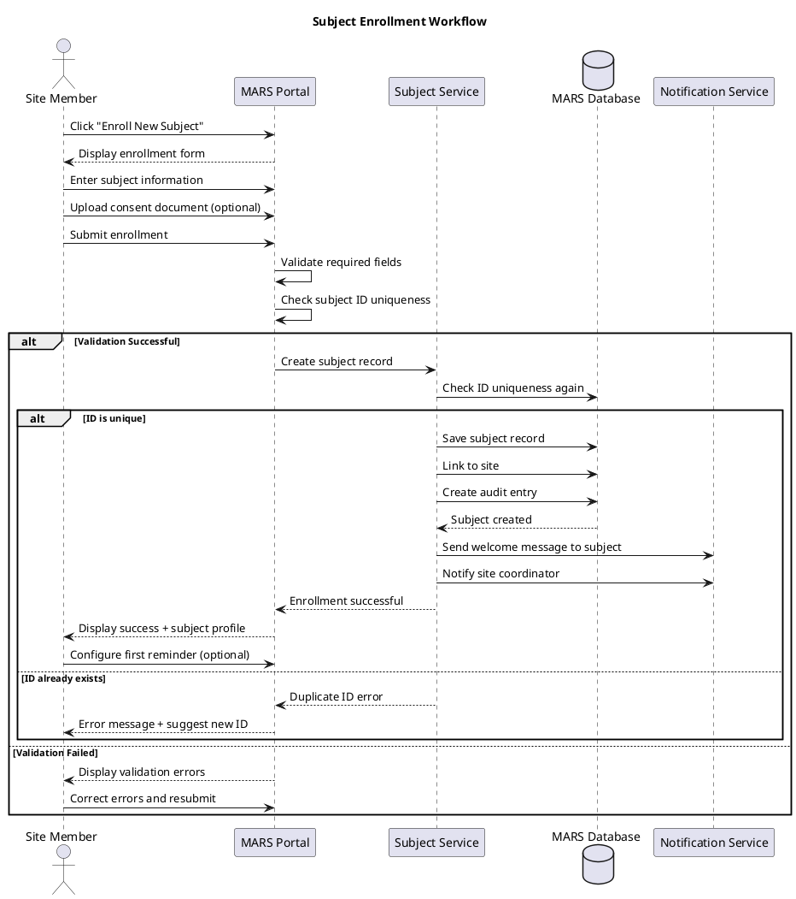
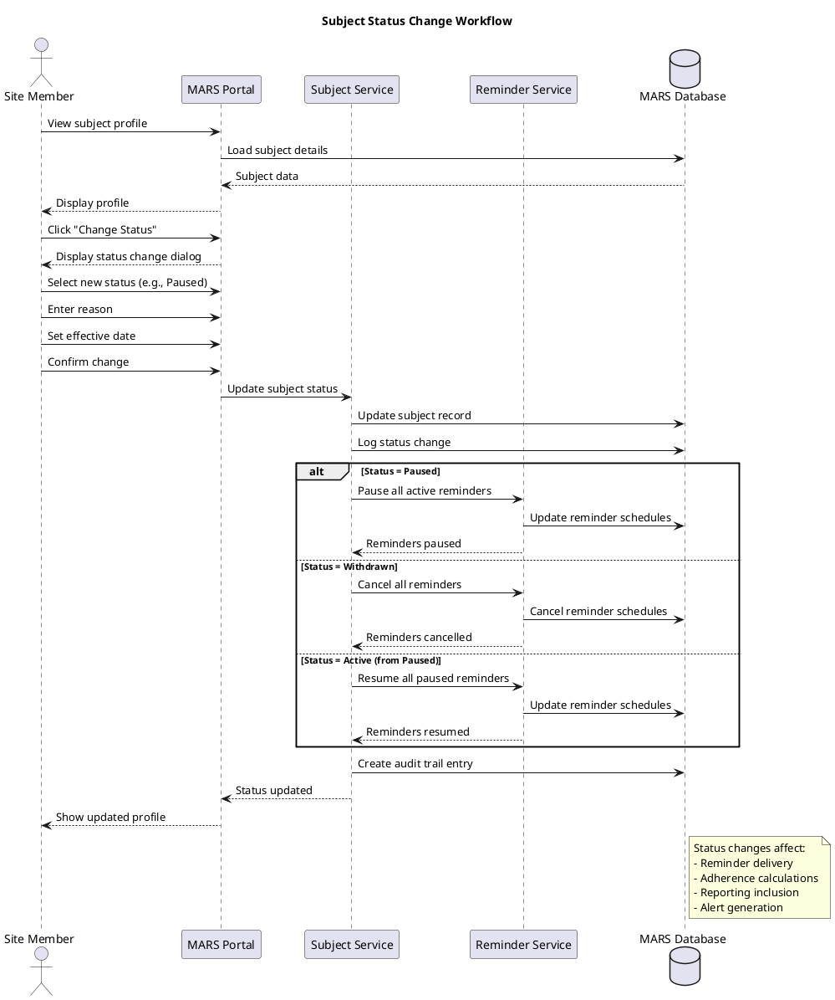

# MARS Feature Specification: Subject Management

## Overview

The Subject Management feature enables MARS site members to enroll, manage, and track trial subjects within their assigned sites. The system provides comprehensive subject profiles, contact management, and enrollment workflow capabilities.

## User Stories

- **As a** site member, **I want to** enroll new subjects into my site, **so that** they can participate in the trial
- **As a** site member, **I want to** manage subject contact information, **so that** I can communicate effectively with subjects
- **As a** site member, **I want to** view subject profiles with complete history, **so that** I have context for every interaction
- **As a** site member, **I want to** search for subjects quickly, **so that** I can access their information efficiently
- **As a** MARS manager, **I want to** view all subjects across sites, **so that** I can monitor trial enrollment

## Functional Requirements

### FR-1: Subject Enrollment
- Site member can enroll new subjects to their site
- Required subject information:
  - Subject ID (unique identifier, auto-generated or manual)
  - First name
  - Last name
  - Date of birth
  - Gender/Sex
  - Primary phone number
  - Email address (optional)
  - Mailing address
  - Preferred contact method (SMS, Email, Phone, Mail)
  - Preferred contact time
  - Emergency contact information
- Enrollment date automatically captured
- Subject automatically linked to enrolling site

### FR-2: Subject Profile View
- Comprehensive subject profile displaying:
  - Demographics and contact information
  - Enrollment information (date, site, ID)
  - Current status (Active, Paused, Completed, Withdrawn)
  - Medication adherence summary
  - Active reminder schedules
  - Appointment history
  - Message thread
  - Site member notes
  - Intervention history
- Quick action buttons for common tasks

### FR-3: Edit Subject Information
- Site member can update subject contact details:
  - Phone numbers (primary and alternative)
  - Email address
  - Mailing address
  - Preferred contact method
  - Preferred contact time
- Cannot modify:
  - Subject ID (immutable)
  - Enrollment date
  - Date of birth (requires manager approval)
- All changes logged in audit trail
- Change notifications sent to subject

### FR-4: Subject Search
- Multiple search methods:
  - Subject ID (exact match)
  - Name (partial match, first or last)
  - Phone number
  - Email address
  - Date of birth
- Advanced filters:
  - Status (Active, Paused, Withdrawn, Completed)
  - Enrollment date range
  - Adherence level (Excellent, Fair, Poor)
  - Has pending alerts
  - Site (for managers)
- Search results display key information
- Click to view full profile

### FR-5: Subject List View
- Paginated list of all subjects for site
- Customizable columns:
  - Subject ID
  - Name
  - Enrollment date
  - Status
  - Current adherence rate
  - Next appointment
  - Pending alerts
  - Last contact date
- Sortable by any column
- Quick filters (status, adherence level)
- Bulk operations (export, tag, assign coordinator)

### FR-6: Subject Status Management
- Four primary status values:
  - **Active**: Currently participating in trial
  - **Paused**: Temporarily not receiving reminders (e.g., hospitalized, traveling)
  - **Completed**: Finished trial protocol successfully
  - **Withdrawn**: Discontinued from trial
- Status change workflow:
  - Select new status
  - Enter reason for change
  - Enter effective date
  - Confirm change
- Status changes automatically affect:
  - Reminder delivery (paused = no reminders)
  - Adherence calculations (paused = excluded)
  - Reporting (withdrawn = excluded from active counts)

### FR-7: Subject Notes
- Chronological note-taking system
- Note types:
  - Phone call summary
  - In-person visit
  - Email correspondence
  - Issue resolution
  - General observation
  - Administrative note
- Each note includes:
  - Timestamp (auto-generated)
  - Author (auto-populated)
  - Note type
  - Note text (up to 2000 characters)
  - Optional tags/categories
- Notes cannot be deleted (audit compliance)
- Notes can be edited (edit history maintained)
- Search within notes

### FR-8: Emergency Contact Management
- Maintain emergency contact information:
  - Emergency contact name
  - Relationship to subject
  - Primary phone
  - Alternative phone
  - Email address
  - Address
- Multiple emergency contacts supported
- Marked as primary emergency contact
- Quick access from subject profile

### FR-9: Consent Management
- Track informed consent status:
  - Consent date
  - Consent version
  - Consent expiration (if applicable)
  - Reconsent required flag
  - Consent form document link
- Consent history (multiple versions)
- Alert when reconsent needed
- Digital consent signature storage (future)

### FR-10: Subject De-identification
- Generate de-identified subject code for reporting
- Mapping between real ID and de-identified code
- De-identified view option for research team
- PHI masking in exported data
- Compliance with privacy regulations

## User Interface Specifications

### UI-1: Subject Enrollment Form

#### PlantUML+SALT Mockup



#### ASCII Art Version

```
┌─────────────────────────────────────────────────────────────────────────────────────┐
│ MARS - Enroll New Subject                                                           │
│ Site: Memorial Hospital                        Enrolling Coordinator: Sarah Johnson │
├─────────────────────────────────────────────────────────────────────────────────────┤
│                                                                                      │
│ ┌─ Subject Identification ─────────────────────────────────────────────────────┐    │
│ │                                                                               │    │
│ │  Subject ID:         MARS-2026-0123 (auto-generated)         [Change]        │    │
│ │  Enrollment Date:    [01/15/2026 📅]                                         │    │
│ │                                                                               │    │
│ └───────────────────────────────────────────────────────────────────────────────┘    │
│                                                                                      │
│ ┌─ Demographics ───────────────────────────────────────────────────────────────┐    │
│ │                                                                               │    │
│ │  First Name:    [John________________]    Last Name: [Doe_________________]  │    │
│ │                                                                               │    │
│ │  Date of Birth: [05/15/1985 📅]           Gender:    [▼ Male              ] │    │
│ │                                                                               │    │
│ └───────────────────────────────────────────────────────────────────────────────┘    │
│                                                                                      │
│ ┌─ Contact Information ────────────────────────────────────────────────────────┐    │
│ │                                                                               │    │
│ │  Primary Phone:      [(555) 555-0123]              [✓] Can receive SMS       │    │
│ │  Alternative Phone:  [(555) 555-0456]              [ ] Can receive SMS       │    │
│ │                                                                               │    │
│ │  Email:              [john.doe@email.com_____________________________]       │    │
│ │                                                                               │    │
│ │  Preferred Contact Method:    [▼ SMS                                      ]  │    │
│ │                                Options: SMS, Email, Phone Call, Mail         │    │
│ │                                                                               │    │
│ │  Best Time to Contact:        [▼ Morning (8 AM - 12 PM)                   ]  │    │
│ │                                Options: Morning, Afternoon, Evening, Anytime │    │
│ │                                                                               │    │
│ └───────────────────────────────────────────────────────────────────────────────┘    │
│                                                                                      │
│ ┌─ Mailing Address ────────────────────────────────────────────────────────────┐    │
│ │                                                                               │    │
│ │  Street Address:  [123 Main Street_________________________________]         │    │
│ │  City:            [Springfield_________]  State: [IL ▼]  ZIP: [62701___]    │    │
│ │                                                                               │    │
│ └───────────────────────────────────────────────────────────────────────────────┘    │
│                                                                                      │
│ ┌─ Emergency Contact ──────────────────────────────────────────────────────────┐    │
│ │                                                                               │    │
│ │  Name:           [Jane Doe______________]  Relationship: [Spouse________]    │    │
│ │  Phone:          [(555) 555-0789_______]  Email: [jane.doe@email.com____]   │    │
│ │                                                                               │    │
│ └───────────────────────────────────────────────────────────────────────────────┘    │
│                                                                                      │
│ ┌─ Consent Information ────────────────────────────────────────────────────────┐    │
│ │                                                                               │    │
│ │  Consent Date:    [01/15/2026 📅]                                            │    │
│ │  Consent Version: [v3.2 ▼]                                                   │    │
│ │                                                                               │    │
│ │  [✓] Informed consent obtained and signed                                    │    │
│ │                                                                               │    │
│ └───────────────────────────────────────────────────────────────────────────────┘    │
│                                                                                      │
│                                                                                      │
│            [Cancel]           [Save as Draft]           [Enroll Subject]            │
│                                                                                      │
└─────────────────────────────────────────────────────────────────────────────────────┘
```

### UI-2: Subject Profile View

#### PlantUML+SALT Mockup



#### ASCII Art Version

```
┌─────────────────────────────────────────────────────────────────────────────────────┐
│ MARS - Subject Profile                                                              │
│ John Doe (ID: MARS-2026-0123)          Status: ACTIVE 🟢    Site: Memorial Hospital│
├─────────────────────────────────────────────────────────────────────────────────────┤
│                                                                                      │
│ [Edit Profile] [Create Reminder] [Schedule Appointment] [Add Note] [View History]  │
│                                                                                      │
├─────────────────────────────────────────────────────────────────────────────────────┤
│                                                                                      │
│ ┌─ Demographics & Contact ─────────────┐  ┌─ Adherence Summary ─────────────────┐  │
│ │                                       │  │                                      │  │
│ │  Name:      John Doe                 │  │  Overall:           85% (FAIR) 🟡   │  │
│ │  DOB:       05/15/1985 (Age: 40)     │  │  Current Streak:    5 days          │  │
│ │  Gender:    Male                      │  │  Best Streak:       12 days         │  │
│ │  Phone:     (555) 555-0123 (SMS ✓)   │  │  Active Medications: 4              │  │
│ │  Email:     john.doe@email.com       │  │  Pending Alerts:    0               │  │
│ │  Preferred: SMS, Morning              │  │  Last Confirmation: Today 8:15 AM   │  │
│ │  Enrolled:  01/15/2026 (14 days)     │  │                                      │  │
│ │                                       │  │                                      │  │
│ └───────────────────────────────────────┘  └──────────────────────────────────────┘  │
│                                                                                      │
│ ┌─ Active Reminders (4) ───────────────────────────────────────────────────────┐    │
│ │                                                                               │    │
│ │  ┌──────────────────┬──────────────────┬───────────┬──────────────────────┐  │    │
│ │  │ Medication       │ Schedule         │ Adherence │ Actions              │  │    │
│ │  ├──────────────────┼──────────────────┼───────────┼──────────────────────┤  │    │
│ │  │ Metformin 500mg  │ 8 AM, 8 PM Daily │    90%    │ [Edit]    [Pause]    │  │    │
│ │  ├──────────────────┼──────────────────┼───────────┼──────────────────────┤  │    │
│ │  │ Lisinopril 10mg  │ 9 AM Daily       │    85%    │ [Edit]    [Pause]    │  │    │
│ │  ├──────────────────┼──────────────────┼───────────┼──────────────────────┤  │    │
│ │  │ Aspirin 81mg     │ 8 AM Daily       │    75%    │ [Edit]    [Resume]   │  │    │
│ │  ├──────────────────┼──────────────────┼───────────┼──────────────────────┤  │    │
│ │  │ Atorvastatin 20mg│ 10 PM Daily      │    88%    │ [Edit]    [Pause]    │  │    │
│ │  └──────────────────┴──────────────────┴───────────┴──────────────────────┘  │    │
│ │                                                                               │    │
│ └───────────────────────────────────────────────────────────────────────────────┘    │
│                                                                                      │
│ ┌─ Upcoming Appointments ──────────────┐  ┌─ Recent Notes (3 total) ───────────┐   │
│ │                                       │  │                                     │   │
│ │  📅 01/20/2026 10:00 AM              │  │  01/14 - Phone call regarding      │   │
│ │     Follow-up Visit                   │  │          side effects               │   │
│ │                                       │  │                                     │   │
│ │  📅 02/15/2026 2:00 PM               │  │  01/10 - In-person visit,          │   │
│ │     Lab Work                          │  │          discussed adherence        │   │
│ │                                       │  │                                     │   │
│ │                                       │  │  01/05 - Welcome call completed    │   │
│ │                                       │  │                                     │   │
│ │                                       │  │  [View All Notes]                   │   │
│ │                                       │  │                                     │   │
│ └───────────────────────────────────────┘  └─────────────────────────────────────┘   │
│                                                                                      │
└─────────────────────────────────────────────────────────────────────────────────────┘
```

### UI-3: Subject Search and List

#### PlantUML+SALT Mockup



#### ASCII Art Version

```
┌─────────────────────────────────────────────────────────────────────────────────────┐
│ MARS - Subject Management                                                           │
│ Site: Memorial Hospital                                   [+ Enroll New Subject]    │
├─────────────────────────────────────────────────────────────────────────────────────┤
│                                                                                      │
│  Search: [___________________________] [Search]                                     │
│                                                                                      │
│  Filters: [▼ All Status] [▼ All Adherence] [Advanced Search]                       │
│                                                                                      │
├─────────────────────────────────────────────────────────────────────────────────────┤
│                                                                                      │
│  Showing 12 of 45 subjects    Sort by: [▼ Enrollment Date (Newest)]  [Export]      │
│                                                                                      │
│ ┌─────────┬──────────────┬──────────┬─────────┬──────────────┬──────┬─────────┬───┐│
│ │ ID      │ Name         │ Enrolled │ Status  │ Adherence    │Alert │Next Appt│Act││
│ ├─────────┼──────────────┼──────────┼─────────┼──────────────┼──────┼─────────┼───┤│
│ │MARS-123 │ John Doe     │01/15/26  │Active🟢│85% Fair 🟡  │  0   │01/20 10A│[V]││
│ │         │              │          │         │              │      │         │[E]││
│ ├─────────┼──────────────┼──────────┼─────────┼──────────────┼──────┼─────────┼───┤│
│ │MARS-122 │ Jane Smith   │01/14/26  │Active🟢│92% Excel🟢  │  0   │01/25 2P │[V]││
│ │         │              │          │         │              │      │         │[E]││
│ ├─────────┼──────────────┼──────────┼─────────┼──────────────┼──────┼─────────┼───┤│
│ │MARS-121 │ Bob Johnson  │01/12/26  │Active🟢│65% Poor 🔴  │  2⚠ │01/18 9A │[V]││
│ │         │              │          │         │              │      │         │[E]││
│ ├─────────┼──────────────┼──────────┼─────────┼──────────────┼──────┼─────────┼───┤│
│ │MARS-120 │ Mary Wilson  │01/10/26  │Paused⏸│78% Fair 🟡  │  0   │    -    │[V]││
│ │         │              │          │         │              │      │         │[E]││
│ ├─────────┼──────────────┼──────────┼─────────┼──────────────┼──────┼─────────┼───┤│
│ │MARS-119 │ Tom Brown    │01/08/26  │Active🟢│95% Excel🟢  │  0   │01/22 3P │[V]││
│ │         │              │          │         │              │      │         │[E]││
│ ├─────────┼──────────────┼──────────┼─────────┼──────────────┼──────┼─────────┼───┤│
│ │MARS-118 │ Lisa Davis   │01/05/26  │Active🟢│88% Fair 🟡  │  0   │01/19 11A│[V]││
│ │         │              │          │         │              │      │         │[E]││
│ ├─────────┼──────────────┼──────────┼─────────┼──────────────┼──────┼─────────┼───┤│
│ │MARS-117 │ Mike Miller  │01/03/26  │Active🟢│72% Fair 🟡  │  1⚠ │01/24 1P │[V]││
│ │         │              │          │         │              │      │         │[E]││
│ ├─────────┼──────────────┼──────────┼─────────┼──────────────┼──────┼─────────┼───┤│
│ │MARS-116 │ Sarah Lee    │12/28/25  │Active🟢│91% Excel🟢  │  0   │01/21 10A│[V]││
│ │         │              │          │         │              │      │         │[E]││
│ ├─────────┼──────────────┼──────────┼─────────┼──────────────┼──────┼─────────┼───┤│
│ │MARS-115 │ David Chen   │12/20/25  │Withdrw⛔│45% Poor 🔴 │  0   │    -    │[V]││
│ │         │              │          │         │              │      │         │[E]││
│ ├─────────┼──────────────┼──────────┼─────────┼──────────────┼──────┼─────────┼───┤│
│ │MARS-114 │ Amy White    │12/15/25  │Active🟢│87% Fair 🟡  │  0   │01/26 2P │[V]││
│ │         │              │          │         │              │      │         │[E]││
│ └─────────┴──────────────┴──────────┴─────────┴──────────────┴──────┴─────────┴───┘│
│                                                                                      │
│                        [Previous]  Page 1 of 5  [Next]                              │
│                                                                                      │
└─────────────────────────────────────────────────────────────────────────────────────┘

Legend: [V] = View  [E] = Edit
```

## Process Flow

### Subject Enrollment Process



#### ASCII Art Version

```
Site Member    MARS Portal    Subject Service    MARS DB    Notification Svc
     |               |                |              |              |
     |-- Enroll New Subject --------->|              |              |
     |<-- Display enrollment form ----|              |              |
     |               |                |              |              |
     |-- Enter subject info --------->|              |              |
     |-- Upload consent doc ---------->|              |              |
     |-- Submit enrollment ----------->|              |              |
     |               |                |              |              |
     |               |-- Validate required fields    |              |
     |               |-- Check ID uniqueness         |              |
     |               |                |              |              |
     +-- IF Validation Successful ---+              |              |
     |               |                |              |              |
     |               |--- Create subject record ---->|              |
     |               |                |              |              |
     |               |                |-- Check ID uniqueness ----->|
     |               |                |              |              |
     +-- IF ID is unique -------------+              |              |
     |               |                |              |              |
     |               |                |-- Save subject record ----->|
     |               |                |-- Link to site ------------->|
     |               |                |-- Create audit entry ------->|
     |               |                |<-- Subject created ----------|
     |               |                |              |              |
     |               |                |-- Send welcome message ----->|
     |               |                |-- Notify coordinator ------->|
     |               |                |              |              |
     |               |<-- Enrollment successful -----|              |
     |<-- Display success + profile --|              |              |
     |               |                |              |              |
     |-- Configure first reminder --->|              |              |
     |               |                |              |              |
     +-- ELSE IF ID exists ----------+              |              |
     |               |                |              |              |
     |               |<-- Duplicate ID error --------|              |
     |<-- Error message + suggest ID -|              |              |
     |               |                |              |              |
     +-- ELSE Validation Failed -----+              |              |
     |               |                |              |              |
     |<-- Display validation errors --|              |              |
     |-- Correct errors ------------->|              |              |
     |               |                |              |              |
```

### Subject Status Change Process



#### ASCII Art Version

```
Site Member    MARS Portal    Subject Service    Reminder Service    MARS DB
     |               |                |                  |               |
     |-- View subject profile ------->|                  |               |
     |               |                |                  |               |
     |               |--- Load subject details ----------------------->|
     |               |<-- Subject data ---------------------------------|
     |<-- Display profile ------------|                  |               |
     |               |                |                  |               |
     |-- Change Status ------------->|                  |               |
     |<-- Display status dialog -----|                  |               |
     |               |                |                  |               |
     |-- Select new status (Paused) ->|                  |               |
     |-- Enter reason -------------->|                  |               |
     |-- Set effective date -------->|                  |               |
     |-- Confirm change ------------>|                  |               |
     |               |                |                  |               |
     |               |--- Update subject status ------->|               |
     |               |                |                  |               |
     |               |                |-- Update subject record -------->|
     |               |                |-- Log status change ------------->|
     |               |                |                  |               |
     +-- IF Status = Paused ---------+                  |               |
     |               |                |                  |               |
     |               |                |--- Pause all active reminders -->|
     |               |                |                  |               |
     |               |                |                  |-- Update schedules ->|
     |               |                |<-- Reminders paused ------------|
     |               |                |                  |               |
     +-- ELSE IF Status = Withdrawn -+                  |               |
     |               |                |                  |               |
     |               |                |--- Cancel all reminders -------->|
     |               |                |                  |               |
     |               |                |                  |-- Cancel schedules ->|
     |               |                |<-- Reminders cancelled ---------|
     |               |                |                  |               |
     +-- ELSE IF Status = Active ----+                  |               |
     |               |                |                  |               |
     |               |                |--- Resume paused reminders ----->|
     |               |                |                  |               |
     |               |                |                  |-- Update schedules ->|
     |               |                |<-- Reminders resumed ------------|
     |               |                |                  |               |
     |               |                |-- Create audit entry ------------->|
     |               |<-- Status updated ---------------|               |
     |<-- Show updated profile -------|                  |               |
     |               |                |                  |               |

Note: Status changes affect reminder delivery, adherence calculations,
      reporting inclusion, and alert generation
```

## Business Rules

### BR-1: Subject ID
- Subject ID must be unique across entire trial (all sites)
- Auto-generated format: MARS-YYYY-NNNN (configurable)
- Site member can override auto-generated ID
- Once assigned, subject ID cannot be changed
- Subject ID visible in all communications (with consent)

### BR-2: Required Fields
- Minimum required for enrollment:
  - Subject ID
  - First name, Last name
  - Date of birth
  - At least one contact method (phone or email)
  - Informed consent confirmation
- All other fields optional but recommended

### BR-3: Contact Information
- At least one phone OR email required
- Primary phone validated for format
- SMS capability requires valid mobile number
- Email validated for format
- Preferred contact method must be available method

### BR-4: Status Transitions
- Valid status transitions:
  - Active → Paused (reversible)
  - Active → Withdrawn (permanent)
  - Active → Completed (permanent)
  - Paused → Active (reversible)
  - Paused → Withdrawn (permanent)
- Invalid transitions rejected by system
- All transitions require reason documentation

### BR-5: Age Restrictions
- Minimum age: 18 years (configurable per trial)
- Maximum age: None (unless trial-specific)
- Age calculated from date of birth
- Date of birth change requires manager approval

### BR-6: Consent Requirements
- Valid informed consent required before enrollment
- Consent version tracked
- Reconsent required on version changes
- Expired consent blocks reminder sending
- Consent withdrawal triggers automatic status = Withdrawn

### BR-7: Data Access
- Site members see only subjects at their assigned sites
- MARS managers see subjects across all sites
- Sponsors see de-identified aggregate data only
- All access logged for audit trail

## Data Model

### Subject Entity

| Field | Type | Required | Description |
|-------|------|----------|-------------|
| SubjectID | GUID | Yes | Internal unique identifier |
| SubjectCode | String(20) | Yes | Displayable subject ID (e.g., MARS-2026-0123) |
| SiteID | GUID | Yes | Reference to enrolling site |
| FirstName | String(50) | Yes | Subject first name |
| LastName | String(50) | Yes | Subject last name |
| DateOfBirth | Date | Yes | Subject date of birth |
| Gender | Enum | Yes | Male, Female, Other, PreferNotToSay |
| PrimaryPhone | String(20) | No | Primary contact phone |
| PrimaryPhoneSMS | Boolean | Yes | Can receive SMS on primary phone |
| AlternativePhone | String(20) | No | Alternative contact phone |
| AlternativePhoneSMS | Boolean | Yes | Can receive SMS on alternative phone |
| EmailAddress | String(100) | No | Email address |
| MailingAddress | String(200) | No | Full mailing address |
| City | String(50) | No | City |
| State | String(2) | No | State code |
| ZipCode | String(10) | No | Postal code |
| PreferredContactMethod | Enum | Yes | SMS, Email, Phone, Mail |
| PreferredContactTime | Enum | Yes | Morning, Afternoon, Evening, Anytime |
| Status | Enum | Yes | Active, Paused, Completed, Withdrawn |
| StatusReason | String(500) | No | Reason for current status |
| StatusEffectiveDate | Date | Yes | When status became effective |
| EnrollmentDate | Date | Yes | Date enrolled in trial |
| EnrolledBy | GUID | Yes | Site member who enrolled |
| ConsentDate | Date | Yes | Date of informed consent |
| ConsentVersion | String(10) | Yes | Consent form version |
| ConsentExpiration | Date | No | Consent expiration (if applicable) |
| DeidentifiedCode | String(20) | Yes | De-identified subject code |
| CreatedDate | DateTime | Yes | Record creation timestamp |
| ModifiedDate | DateTime | No | Last modification timestamp |
| ModifiedBy | GUID | No | Last modifier |

### Emergency Contact Entity

| Field | Type | Required | Description |
|-------|------|----------|-------------|
| EmergencyContactID | GUID | Yes | Unique identifier |
| SubjectID | GUID | Yes | Reference to subject |
| ContactName | String(100) | Yes | Emergency contact name |
| Relationship | String(50) | Yes | Relationship to subject |
| PrimaryPhone | String(20) | Yes | Primary contact phone |
| AlternativePhone | String(20) | No | Alternative contact phone |
| EmailAddress | String(100) | No | Email address |
| Address | String(200) | No | Full address |
| IsPrimary | Boolean | Yes | Primary emergency contact flag |
| CreatedDate | DateTime | Yes | Record creation timestamp |

### Subject Note Entity

| Field | Type | Required | Description |
|-------|------|----------|-------------|
| NoteID | GUID | Yes | Unique identifier |
| SubjectID | GUID | Yes | Reference to subject |
| NoteType | Enum | Yes | PhoneCall, InPerson, Email, Issue, General, Administrative |
| NoteText | String(2000) | Yes | Note content |
| Tags | JSON | No | Array of tag strings |
| CreatedBy | GUID | Yes | Author of note |
| CreatedDate | DateTime | Yes | Note timestamp |
| ModifiedDate | DateTime | No | Last edit timestamp (if edited) |
| EditHistory | JSON | No | Array of edit records |

### Subject Status History Entity

| Field | Type | Required | Description |
|-------|------|----------|-------------|
| StatusHistoryID | GUID | Yes | Unique identifier |
| SubjectID | GUID | Yes | Reference to subject |
| PreviousStatus | Enum | No | Status before change |
| NewStatus | Enum | Yes | Status after change |
| EffectiveDate | Date | Yes | When status became effective |
| Reason | String(500) | Yes | Reason for status change |
| ChangedBy | GUID | Yes | Who made the change |
| ChangedDate | DateTime | Yes | When change was recorded |

## Non-Functional Requirements

### NFR-1: Performance
- Subject list loads within 2 seconds (100 subjects)
- Subject profile loads within 1 second
- Search returns results within 1 second
- Enrollment completes within 3 seconds

### NFR-2: Scalability
- Support 10,000+ subjects per trial
- Support 100+ concurrent site members
- Efficient pagination for large subject lists
- Database indexing on search fields

### NFR-3: Security
- All PHI encrypted at rest and in transit
- Role-based access control enforced
- All access logged for audit trail
- Automatic session timeout (15 minutes)
- Subject data segregated by site

### NFR-4: Usability
- Enrollment form completable in <5 minutes
- Mobile-responsive subject list
- Keyboard shortcuts for common actions
- Auto-save for enrollment forms (draft)
- Inline validation on forms

### NFR-5: Compliance
- HIPAA compliant data handling
- 21 CFR Part 11 audit trails
- GCP compliance for subject management
- Data retention per regulatory requirements
- Subject right to be forgotten support

## Testing Requirements

### Test Scenarios

1. **Enroll New Subject**
   - Complete enrollment with all fields
   - Minimal enrollment (required fields only)
   - Duplicate subject ID rejection
   - Invalid phone/email format

2. **Subject Search**
   - Search by subject ID (exact)
   - Search by name (partial)
   - Search by phone number
   - Search by enrollment date range
   - Filter by status
   - Filter by adherence level

3. **Edit Subject Information**
   - Update phone number
   - Change preferred contact method
   - Modify address
   - Attempt to change immutable fields (reject)

4. **Status Management**
   - Active → Paused (verify reminders pause)
   - Paused → Active (verify reminders resume)
   - Active → Withdrawn (verify reminders cancel)
   - Invalid transition (reject)

5. **Subject Notes**
   - Create new note
   - Edit existing note (edit history)
   - Search within notes
   - Cannot delete note (audit compliance)

6. **Emergency Contact**
   - Add emergency contact
   - Edit emergency contact
   - Multiple emergency contacts
   - Mark primary contact

7. **Multi-Site Scenarios**
   - Site member sees only their site subjects
   - Manager sees all sites
   - Subject ID unique across sites

8. **Performance Testing**
   - Load 1000 subject list
   - Search across 10,000 subjects
   - Concurrent enrollment (10 users)

## Related Documentation

- [MARS Use Cases](/current/src/docs/architecture/mars/use-cases.md) - UC_SelectSubject, UC_EditSubjectContact
- [Medication Reminders Feature](/current/src/docs/features/mars/reminders.md) - Reminder management
- [Adherence Tracking Feature](/current/src/docs/features/mars/adherence-tracking.md) - Adherence metrics
- [Gateway Architecture](/current/src/docs/architecture/gateway/README.md) - User authentication and roles

## Implementation Notes

### Phase 1: Core Subject Management
- Subject enrollment
- Basic profile view
- Contact information editing
- Subject search and list
- Status management

### Phase 2: Enhanced Features
- Subject notes system
- Emergency contact management
- Consent tracking
- Advanced search filters
- Bulk operations

### Phase 3: Intelligence
- Auto-suggest subject ID
- Duplicate detection (similar names, DOB)
- Risk stratification
- Predictive enrollment analytics

## Change History

| Version | Date | Author | Changes |
|---------|------|--------|---------|
| 1.0 | 2026-01-13 | System | Initial specification with dual-format mockups |
