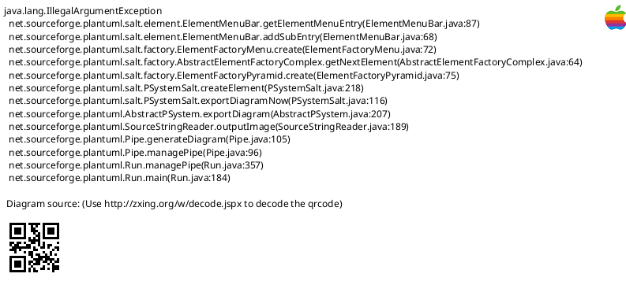
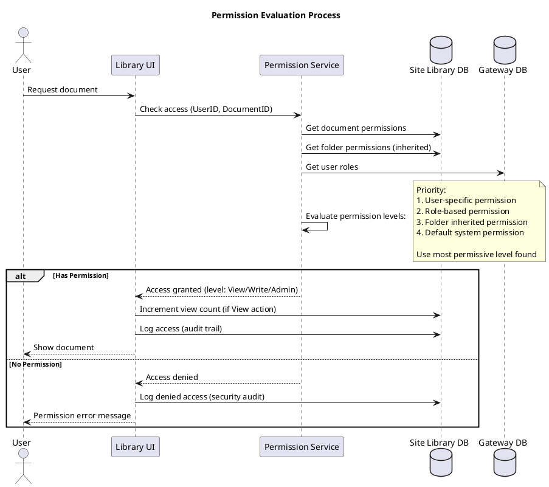

# Site Library Feature Specification: Access Control

## Overview

The Access Control feature provides role-based and user-specific permissions for documents and folders, ensuring users can only access authorized content.

## User Stories

- **As a** librarian, **I want to** control who can access documents, **so that** sensitive information is protected
- **As a** librarian, **I want to** assign role-based permissions, **so that** I can manage access efficiently
- **As a** librarian, **I want to** grant specific users access, **so that** I can handle special cases
- **As a** user, **I want to** see only documents I have access to, **so that** I'm not confused by restricted content

## Functional Requirements

### FR-1: Permission Levels
- **None**: No access to document
- **View**: Can view and download document
- **Write**: Can view, download, edit metadata, upload new versions
- **Admin**: Full control including permissions management

### FR-2: Role-Based Permissions
- Assign permissions by user role (e.g., "Coordinators can View")
- Supported roles:
  - Site Library User (default, read-only)
  - Site Library Writer (can upload/edit)
  - Site Library Librarian (full admin)
  - Trial-specific roles (imported from Gateway)
- Multiple roles can be assigned to same document

### FR-3: User-Specific Permissions
- Grant specific users access overriding role permissions
- Use cases:
  - Confidential documents for specific individuals
  - Trial-specific documents for trial team
  - Temporary access grants
- User permissions take precedence over role permissions

### FR-4: Folder Inheritance
- Permissions set on folder apply to all contents
- Child folders inherit parent permissions by default
- Documents can override folder permissions
- Multi-level inheritance supported

### FR-5: Permission Management Interface
- View current permissions for document/folder
- Add role permissions
- Add user permissions
- Remove permissions
- Test permissions for specific user
- Bulk permission updates

### FR-6: Permission Evaluation
- Most permissive access granted
- User-specific > Role-based > Folder inherited
- Evaluated at access time (real-time)
- Cached for performance (cache invalidated on permission change)
- Access denied logged for security audit

### FR-7: Default Permissions
- New folders inherit parent folder permissions
- New documents inherit folder permissions
- Override available during upload/creation
- System default: All authenticated users can View

### FR-8: Special Permissions
- "Public" documents accessible without authentication (optional)
- "Confidential" flag for extra access logging
- "Expiring" permissions with end date
- Delegation: Librarian can delegate permission management

## User Interface Specifications

### UI-1: Document Permissions Manager

#### PlantUML+SALT Mockup



#### ASCII Art Version

```
┌─────────────────────────────────────────────────────────────────────────────────────┐
│ Manage Permissions                                                                  │
│ Document: Protocol Amendment v2.0               Folder: Clinical Protocols          │
├─────────────────────────────────────────────────────────────────────────────────────┤
│                                                                                      │
│ ┌─ Role-Based Permissions ─────────────────────────────────────────────────────┐    │
│ │                                                                               │    │
│ │  ┌─────────────────────────┬────────────┬──────────────────────────────────┐ │    │
│ │  │ Role                    │ Permission │ Actions                          │ │    │
│ │  ├─────────────────────────┼────────────┼──────────────────────────────────┤ │    │
│ │  │ Site Library User       │    View    │ [Edit]  [Remove]                 │ │    │
│ │  ├─────────────────────────┼────────────┼──────────────────────────────────┤ │    │
│ │  │ Site Library Writer     │   Write    │ [Edit]  [Remove]                 │ │    │
│ │  ├─────────────────────────┼────────────┼──────────────────────────────────┤ │    │
│ │  │ Site Library Librarian  │   Admin    │ [Edit]  [Remove]                 │ │    │
│ │  ├─────────────────────────┼────────────┼──────────────────────────────────┤ │    │
│ │  │ Trial Coordinators      │    View    │ [Edit]  [Remove]                 │ │    │
│ │  └─────────────────────────┴────────────┴──────────────────────────────────┘ │    │
│ │                                                                               │    │
│ │  [+ Add Role Permission]                                                      │    │
│ │                                                                               │    │
│ └───────────────────────────────────────────────────────────────────────────────┘    │
│                                                                                      │
│ ┌─ User-Specific Permissions ──────────────────────────────────────────────────┐    │
│ │                                                                               │    │
│ │  ┌──────────────────────────┬────────────┬──────────┬────────────────────┐  │    │
│ │  │ User                     │ Permission │ Granted  │ Actions            │  │    │
│ │  ├──────────────────────────┼────────────┼──────────┼────────────────────┤  │    │
│ │  │ john.doe@example.com     │   Write    │ 01/15/26 │ [Edit]  [Remove]   │  │    │
│ │  ├──────────────────────────┼────────────┼──────────┼────────────────────┤  │    │
│ │  │ jane.smith@example.com   │    View    │ 01/10/26 │ [Edit]  [Remove]   │  │    │
│ │  └──────────────────────────┴────────────┴──────────┴────────────────────┘  │    │
│ │                                                                               │    │
│ │  [+ Add User Permission]                                                      │    │
│ │                                                                               │    │
│ └───────────────────────────────────────────────────────────────────────────────┘    │
│                                                                                      │
│ ┌─ Inheritance ─────────────────────────────────────────────────────────────────┐    │
│ │                                                                               │    │
│ │  (●) Inherit from folder (Clinical Protocols)                                 │    │
│ │  ( ) Custom permissions (no inheritance)                                      │    │
│ │                                                                               │    │
│ └───────────────────────────────────────────────────────────────────────────────┘    │
│                                                                                      │
│ ┌─ Permission Test ─────────────────────────────────────────────────────────────┐    │
│ │                                                                               │    │
│ │  Test access for user: [_____________________________]  [Test]               │    │
│ │                                                                               │    │
│ │  Result: (Click Test to check user's effective permissions)                  │    │
│ │                                                                               │    │
│ └───────────────────────────────────────────────────────────────────────────────┘    │
│                                                                                      │
│                                                                                      │
│           [Cancel]          [Reset to Defaults]          [Save Permissions]         │
│                                                                                      │
└─────────────────────────────────────────────────────────────────────────────────────┘
```

## Process Flow



## Business Rules

### BR-1: Permission Precedence
1. User-specific permissions (highest)
2. Role-based permissions
3. Folder inherited permissions
4. System default permissions (lowest)
- Most permissive access wins

### BR-2: Folder Inheritance
- New documents inherit folder permissions automatically
- Changes to folder permissions don't affect existing documents (unless configured)
- Multi-level inheritance: grandparent > parent > document
- Document can break inheritance and use custom permissions

### BR-3: Role Permission Updates
- Adding role permission affects all users with that role immediately
- Removing role permission removes access for users with only that role
- Users with multiple roles retain access if any role has permission

### BR-4: User Permission Grants
- User permission can grant higher access than role
- User permission can restrict access below role level
- User permissions can have expiration dates
- Expired permissions automatically revoked

### BR-5: Librarian Privileges
- Librarians have implicit Admin access to all documents
- Cannot be revoked (system enforced)
- Librarian access always logged
- Emergency access for administrators

## Data Model

### Document Permission Entity

| Field | Type | Required | Description |
|-------|------|----------|-------------|
| PermissionID | GUID | Yes | Unique identifier |
| DocumentID | GUID | No | Specific document (null for folder) |
| FolderID | GUID | No | Specific folder (null for document) |
| PermissionType | Enum | Yes | Role, User |
| RoleID | GUID | No | Reference to role (if Role type) |
| UserID | GUID | No | Reference to user (if User type) |
| AccessLevel | Enum | Yes | None, View, Write, Admin |
| GrantedBy | GUID | Yes | Who granted permission |
| GrantedDate | DateTime | Yes | When permission granted |
| ExpirationDate | DateTime | No | Optional expiration |
| IsInherited | Boolean | Yes | Inherited from folder? |

### Permission Evaluation Cache Entity

| Field | Type | Required | Description |
|-------|------|----------|-------------|
| CacheID | GUID | Yes | Unique identifier |
| UserID | GUID | Yes | User |
| DocumentID | GUID | Yes | Document |
| EffectivePermission | Enum | Yes | Calculated access level |
| CachedDate | DateTime | Yes | When cached |
| ExpirationTime | DateTime | Yes | Cache expiration (15 min) |

## Non-Functional Requirements

### NFR-1: Performance
- Permission check completes within 100ms
- Permission cache hit rate >95%
- Bulk permission updates within 5 seconds (100 documents)
- Folder inheritance calculation optimized

### NFR-2: Security
- All permission changes logged in audit trail
- Failed access attempts logged
- Regular security audit reports
- Prevent privilege escalation
- Role changes propagated within 1 minute

### NFR-3: Scalability
- Support 10,000+ permission rules
- Efficient indexing for permission queries
- Folder hierarchy depth up to 10 levels
- Handle 1,000+ concurrent permission checks

## Related Documentation

- [Site Library Use Cases](/current/src/docs/architecture/site-library/use-cases.md) - UC_ManageRoleAssignments, UC_ManageUserAssignments
- [Gateway Architecture](/current/src/docs/architecture/gateway/README.md) - Role management
- [Upload Feature](/current/src/docs/features/site-library/upload.md) - Permission inheritance

## Change History

| Version | Date | Author | Changes |
|---------|------|--------|---------|
| 1.0 | 2026-01-13 | System | Initial specification with dual-format mockups |
