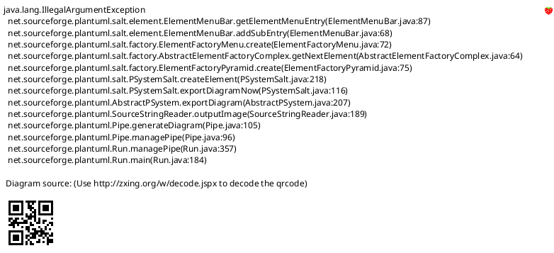
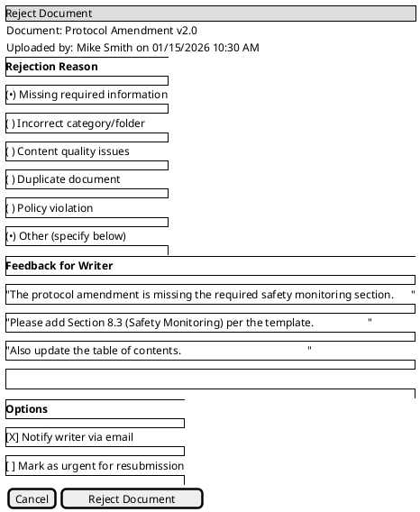
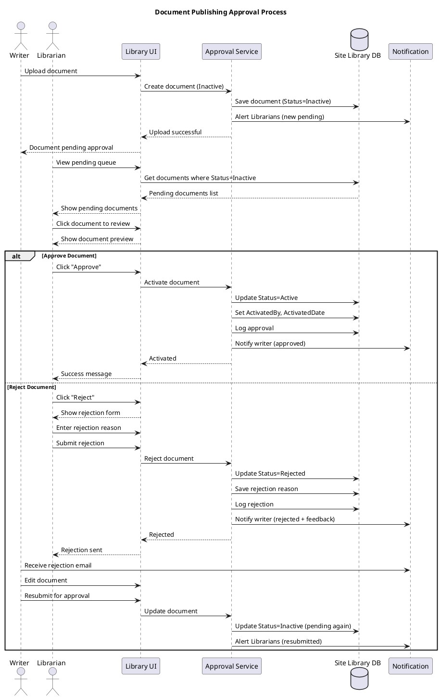

# Site Library Feature Specification: Publishing Workflow

## Overview

The Publishing Workflow ensures quality control by requiring Librarian approval before documents become visible to users. Writers upload documents as "Inactive" and Librarians activate them after review.

## User Stories

- **As a** writer, **I want to** upload documents for review, **so that** they can be published after approval
- **As a** librarian, **I want to** review pending documents, **so that** I can ensure quality before publication
- **As a** librarian, **I want to** activate approved documents, **so that** users can access them
- **As a** librarian, **I want to** reject documents with feedback, **so that** writers can make corrections

## Functional Requirements

### FR-1: Document States
- **Draft**: Saved but not submitted (Writer only)
- **Pending Approval**: Submitted, awaiting Librarian review
- **Active**: Approved and visible to all authorized users
- **Inactive**: Not visible to regular users (Writer edits)
- **Rejected**: Sent back to Writer with feedback
- **Archived**: Previous version, not current
- **Deleted**: Soft-deleted, in undelete area

### FR-2: Writer Upload
- Writers upload documents as Inactive/Pending
- Cannot make documents Active directly
- Can save as Draft and submit later
- Notified when document activated or rejected

### FR-3: Librarian Review Queue
- Dashboard showing all pending documents
- Sort by: Upload date, File type, Uploader, Folder
- Filter by: Category, Date range, Uploader
- Batch operations: Approve multiple, Reject multiple
- Priority flagging for urgent documents

### FR-4: Activation Process
- Librarian reviews document content
- Librarian reviews metadata (title, description, keywords)
- Librarian verifies correct folder/category
- Librarian clicks "Activate"
- Document immediately visible to users
- Uploader notified of activation

### FR-5: Rejection Process
- Librarian clicks "Reject"
- Librarian provides rejection reason
- Document returned to Writer
- Writer notified with feedback
- Writer can edit and resubmit
- Rejection logged in audit trail

### FR-6: Bulk Activation
- Select multiple pending documents
- Activate all at once
- Optional: Add activation note
- Individual failures don't block others
- Summary report of activation results

### FR-7: Librarian Can Skip Workflow
- Librarians can upload as Active directly
- Checkbox: "Make Active immediately"
- Bypasses pending state
- Still logged in audit trail
- Used for urgent publications

### FR-8: Auto-Deactivation on Edit
- When Writer edits Active document, it becomes Inactive
- Requires Librarian re-activation
- Exception: Librarian edits don't trigger deactivation
- Users continue seeing previous version until new version activated

## User Interface Specifications

### UI-1: Pending Documents Queue (Librarian View)

#### PlantUML+SALT Mockup



#### ASCII Art Version

```
┌─────────────────────────────────────────────────────────────────────────────────────┐
│ Site Library - Pending Approvals                                                    │
│ Librarian: Sarah Johnson                                    [Bulk Actions ▼]        │
├─────────────────────────────────────────────────────────────────────────────────────┤
│                                                                                      │
│  Filter: [▼All Categories] [▼Last 30 Days] [▼All Uploaders]  Sort:[▼Upload Date]  │
│                                                                                      │
├─────────────────────────────────────────────────────────────────────────────────────┤
│                                                                                      │
│  Showing 12 pending documents              [Approve Selected]  [Reject Selected]    │
│                                                                                      │
│ ┌───┬──────────────────────┬──────────────┬───────────┬──────────┬───────┬────────┐ │
│ │[✓]│ Title                │  Uploaded    │    By     │ Category │  Size │Actions │ │
│ ├───┼──────────────────────┼──────────────┼───────────┼──────────┼───────┼────────┤ │
│ │[✓]│ Protocol Amendment   │ 01/15        │Mike Smith │ Protocol │2.3 MB │ [View] │ │
│ │   │ v2.0                 │ 10:30 AM     │           │          │       │[Approve│ │
│ │   │                      │              │           │          │       │[Reject]│ │
│ ├───┼──────────────────────┼──────────────┼───────────┼──────────┼───────┼────────┤ │
│ │[ ]│ ICF Template Updated │ 01/15        │ Jane Doe  │  Forms   │156 KB │ [View] │ │
│ │   │                      │ 9:15 AM      │           │          │       │[Approve│ │
│ │   │                      │              │           │          │       │[Reject]│ │
│ ├───┼──────────────────────┼──────────────┼───────────┼──────────┼───────┼────────┤ │
│ │[✓]│ Lab Manual v3.0      │ 01/14        │Bob Wilson │   SOPs   │4.2 MB │ [View] │ │
│ │   │                      │ 2:00 PM      │           │          │       │[Approve│ │
│ │   │                      │              │           │          │       │[Reject]│ │
│ ├───┼──────────────────────┼──────────────┼───────────┼──────────┼───────┼────────┤ │
│ │[ ]│ Training Video       │ 01/14        │Lisa Brown │ Training │ 45 MB │ [View] │ │
│ │   │ Module 1             │ 11:00 AM     │           │          │       │[Approve│ │
│ │   │                      │              │           │          │       │[Reject]│ │
│ ├───┼──────────────────────┼──────────────┼───────────┼──────────┼───────┼────────┤ │
│ │[ ]│ Site Contact List    │ 01/13        │Tom Davis  │  Admin   │ 89 KB │ [View] │ │
│ │   │                      │ 4:30 PM      │           │          │       │[Approve│ │
│ │   │                      │              │           │          │       │[Reject]│ │
│ └───┴──────────────────────┴──────────────┴───────────┴──────────┴───────┴────────┘ │
│                                                                                      │
│                        [Previous]  Page 1 of 3  [Next]                              │
│                                                                                      │
└─────────────────────────────────────────────────────────────────────────────────────┘
```

### UI-2: Reject Document Dialog

#### PlantUML+SALT Mockup



#### ASCII Art Version

```
┌─────────────────────────────────────────────────────────────────────────────────────┐
│ Reject Document                                                                     │
├─────────────────────────────────────────────────────────────────────────────────────┤
│                                                                                      │
│  Document: Protocol Amendment v2.0                                                  │
│  Uploaded by: Mike Smith on 01/15/2026 10:30 AM                                     │
│                                                                                      │
│ ┌─ Rejection Reason ───────────────────────────────────────────────────────────┐    │
│ │                                                                               │    │
│ │  (●) Missing required information                                             │    │
│ │  ( ) Incorrect category/folder                                                │    │
│ │  ( ) Content quality issues                                                   │    │
│ │  ( ) Duplicate document                                                       │    │
│ │  ( ) Policy violation                                                         │    │
│ │  (●) Other (specify below)                                                    │    │
│ │                                                                               │    │
│ └───────────────────────────────────────────────────────────────────────────────┘    │
│                                                                                      │
│ ┌─ Feedback for Writer ────────────────────────────────────────────────────────┐    │
│ │                                                                               │    │
│ │  ┌───────────────────────────────────────────────────────────────────────┐   │    │
│ │  │ The protocol amendment is missing the required safety monitoring     │   │    │
│ │  │ section. Please add Section 8.3 (Safety Monitoring) per the          │   │    │
│ │  │ template. Also update the table of contents.                          │   │    │
│ │  │                                                                        │   │    │
│ │  │                                                                        │   │    │
│ │  └───────────────────────────────────────────────────────────────────────┘   │    │
│ │                                                                               │    │
│ └───────────────────────────────────────────────────────────────────────────────┘    │
│                                                                                      │
│ ┌─ Options ────────────────────────────────────────────────────────────────────┐    │
│ │                                                                               │    │
│ │  [✓] Notify writer via email                                                  │    │
│ │  [ ] Mark as urgent for resubmission                                          │    │
│ │                                                                               │    │
│ └───────────────────────────────────────────────────────────────────────────────┘    │
│                                                                                      │
│                                                                                      │
│                       [Cancel]            [Reject Document]                         │
│                                                                                      │
└─────────────────────────────────────────────────────────────────────────────────────┘
```

## Process Flow



## Business Rules

### BR-1: Role-Based Activation
- Only Librarians can activate documents
- Writers cannot activate their own uploads
- Exception: Librarians can upload as Active directly
- System administrators can activate (emergency only)

### BR-2: Automatic Deactivation
- Writer edits to Active document → Status becomes Inactive
- Librarian edits to Active document → Status remains Active
- Version replacement by Writer → New version Inactive
- Requires re-activation by Librarian

### BR-3: Rejection Workflow
- Rejected documents remain in library (not deleted)
- Writer can edit and resubmit
- Rejection reason required
- Multiple rejections allowed
- Rejection count tracked for reporting

### BR-4: Notification Rules
- New pending document → All Librarians notified
- Document approved → Uploader notified
- Document rejected → Uploader notified with feedback
- Batch approvals → Single notification per uploader
- Configurable notification preferences

### BR-5: Pending Document Visibility
- Inactive/Pending documents visible to:
  - Uploader (Writer)
  - All Librarians
  - System administrators
- Not visible to regular Users
- Search excludes Inactive by default

## Data Model

### Approval Workflow Entity

| Field | Type | Required | Description |
|-------|------|----------|-------------|
| ApprovalID | GUID | Yes | Unique identifier |
| DocumentID | GUID | Yes | Reference to document |
| VersionNumber | Int | Yes | Version being reviewed |
| SubmittedBy | GUID | Yes | Writer who submitted |
| SubmittedDate | DateTime | Yes | Submission timestamp |
| ReviewedBy | GUID | No | Librarian who reviewed |
| ReviewedDate | DateTime | No | Review timestamp |
| Action | Enum | Yes | Pending, Approved, Rejected |
| RejectionReason | Enum | No | Reason code for rejection |
| RejectionFeedback | String(1000) | No | Detailed feedback |
| ResubmissionCount | Int | Yes | Number of resubmissions |

## Related Documentation

- [Site Library Use Cases](/current/src/docs/architecture/site-library/use-cases.md) - UC_ActivateResources, UC_DeactivateOnEdit
- [Upload Feature](/current/src/docs/features/site-library/upload.md) - Document creation
- [Versioning Feature](/current/src/docs/features/site-library/versioning.md) - Version activation

## Change History

| Version | Date | Author | Changes |
|---------|------|--------|---------|
| 1.0 | 2026-01-13 | System | Initial specification with dual-format mockups |
