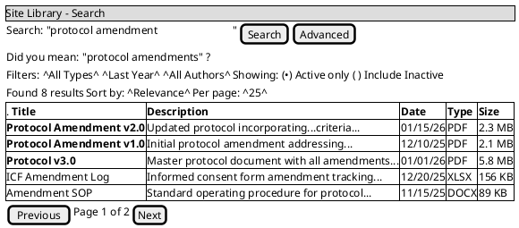
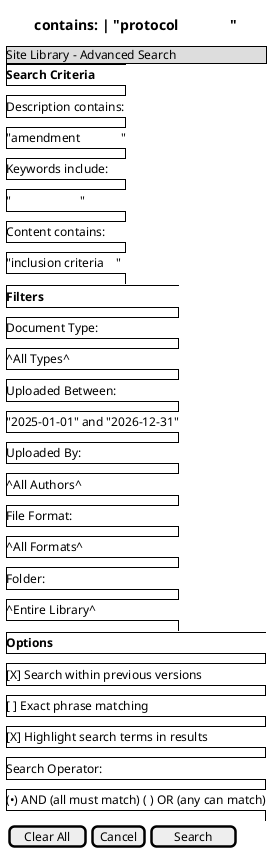
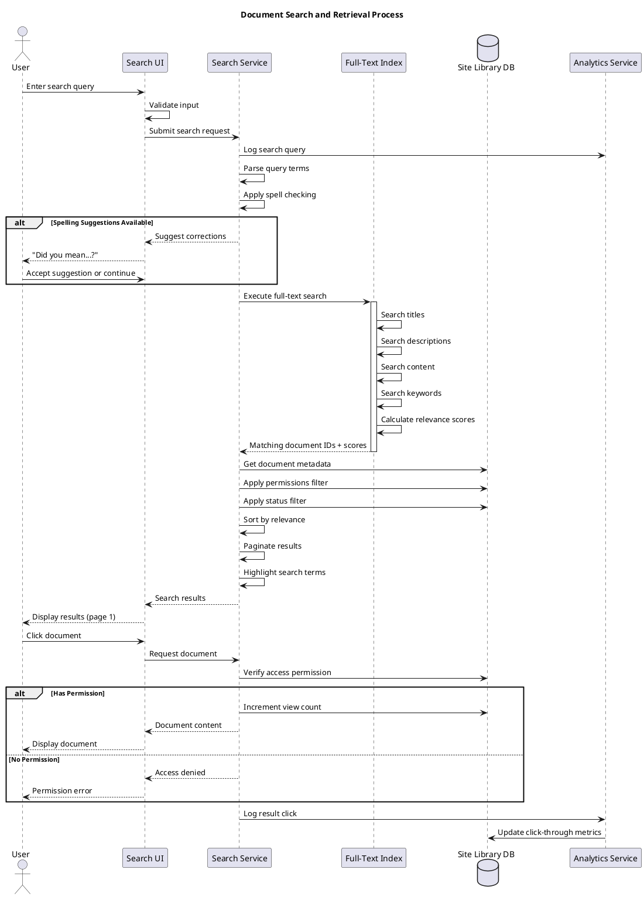

# Site Library Feature Specification: Full-Text Search

## Overview

The Full-Text Search feature enables users to quickly locate documents in the Site Library by searching titles, descriptions, keywords, and document content using SQL Server Full-Text Index technology.

## User Stories

- **As a** user, **I want to** search for documents by keyword, **so that** I can find relevant materials quickly
- **As a** user, **I want to** search within document content, **so that** I can find specific information
- **As a** user, **I want to** filter search results, **so that** I can narrow down results
- **As a** user, **I want to** see search result previews, **so that** I can identify the right document

## Functional Requirements

### FR-1: Search Types
- **Title Search**: Match keywords in document title
- **Description Search**: Match keywords in description/abstract
- **Content Search**: Full-text search within document body (PDF, Office docs)
- **Keyword/Tag Search**: Match assigned keywords
- **Combined Search**: Search across all fields simultaneously

### FR-2: Search Features
- Partial word matching
- Relevance ranking
- Highlighting of search terms in results
- Spelling correction suggestions ("Did you mean...?")
- Search within previous versions (optional)
- Faceted search filters

### FR-3: Search Filters
- Document type/category
- Upload date range
- Author/Uploader
- Folder/Location
- Document status (Active only vs Include Inactive)
- File format (PDF, Word, Excel, etc.)

### FR-4: Search Results Display
- Paginated results (10, 25, 50, 100 per page)
- Result information:
  - Document title (highlighted)
  - Description excerpt (highlighted)
  - Relevance score/ranking
  - Upload date
  - File type icon
  - File size
  - Author
  - Version number
- Sort options: Relevance, Date, Title, Author

### FR-5: Search Result Actions
- Click to view document
- Quick preview (in-browser)
- Download document
- Add to favorites/bookmarks
- Share document link

### FR-6: Advanced Search
- Boolean operators (AND, OR, NOT)
- Phrase search ("exact match")
- Proximity search (words near each other)
- Wildcard search (protocol*)
- Field-specific search (title:protocol)

### FR-7: Search History
- Recent searches saved per user
- Click to re-run previous search
- Clear search history
- Search history used for autocomplete suggestions

### FR-8: Search Analytics
- Track popular search terms
- Identify failed searches (zero results)
- Spelling correction patterns
- Search-to-click metrics

## User Interface Specifications

### UI-1: Search Interface

#### PlantUML+SALT Mockup



#### ASCII Art Version

```
┌─────────────────────────────────────────────────────────────────────────────────────┐
│ Site Library - Search                                                               │
├─────────────────────────────────────────────────────────────────────────────────────┤
│                                                                                      │
│  ┌──────────────────────────────────────────────────────────────────────────────┐   │
│  │ Search: protocol amendment_________________________________  [Search][Advanced]│   │
│  └──────────────────────────────────────────────────────────────────────────────┘   │
│                                                                                      │
│  Did you mean: "protocol amendments" ?                                              │
│                                                                                      │
│  Filters: [▼All Types] [▼Last Year] [▼All Authors]  Show: (●)Active ( )All        │
│                                                                                      │
├─────────────────────────────────────────────────────────────────────────────────────┤
│                                                                                      │
│  Found 8 results         Sort by: [▼Relevance]         Per page: [▼25]            │
│                                                                                      │
│ ┌─────────────────────────────────────────────────────────────────────────────────┐ │
│ │                                                                                  │ │
│ │ 📄 Protocol Amendment v2.0                              01/15/26  PDF  2.3 MB   │ │
│ │    Updated protocol incorporating feedback from sites. Major changes in          │ │
│ │    inclusion criteria (Section 4.2). [View] [Download]                          │ │
│ │                                                                                  │ │
│ ├──────────────────────────────────────────────────────────────────────────────────┤ │
│ │                                                                                  │ │
│ │ 📄 Protocol Amendment v1.0                              12/10/25  PDF  2.1 MB   │ │
│ │    Initial protocol amendment addressing site feedback regarding enrollment      │ │
│ │    procedures. [View] [Download]                                                 │ │
│ │                                                                                  │ │
│ ├──────────────────────────────────────────────────────────────────────────────────┤ │
│ │                                                                                  │ │
│ │ 📄 Protocol v3.0                                        01/01/26  PDF  5.8 MB   │ │
│ │    Master protocol document with all amendments incorporated. Complete trial     │ │
│ │    protocol. [View] [Download]                                                   │ │
│ │                                                                                  │ │
│ ├──────────────────────────────────────────────────────────────────────────────────┤ │
│ │                                                                                  │ │
│ │ 📊 ICF Amendment Log                                    12/20/25  XLSX 156 KB   │ │
│ │    Informed consent form amendment tracking spreadsheet with all ICF versions.   │ │
│ │    [View] [Download]                                                             │ │
│ │                                                                                  │ │
│ ├──────────────────────────────────────────────────────────────────────────────────┤ │
│ │                                                                                  │ │
│ │ 📝 Amendment SOP                                        11/15/25  DOCX  89 KB   │ │
│ │    Standard operating procedure for protocol amendments and change control.      │ │
│ │    [View] [Download]                                                             │ │
│ │                                                                                  │ │
│ └──────────────────────────────────────────────────────────────────────────────────┘ │
│                                                                                      │
│                        [Previous]  Page 1 of 2  [Next]                              │
│                                                                                      │
└─────────────────────────────────────────────────────────────────────────────────────┘
```

### UI-2: Advanced Search

#### PlantUML+SALT Mockup



#### ASCII Art Version

```
┌─────────────────────────────────────────────────────────────────────────────────────┐
│ Site Library - Advanced Search                                                      │
├─────────────────────────────────────────────────────────────────────────────────────┤
│                                                                                      │
│ ┌─ Search Criteria ────────────────────────────────────────────────────────────┐    │
│ │                                                                               │    │
│ │  Title contains:       [protocol___________________________]                 │    │
│ │  Description contains: [amendment__________________________]                 │    │
│ │  Keywords include:     [____________________________________]                │    │
│ │  Content contains:     [inclusion criteria_________________]                 │    │
│ │                                                                               │    │
│ └───────────────────────────────────────────────────────────────────────────────┘    │
│                                                                                      │
│ ┌─ Filters ────────────────────────────────────────────────────────────────────┐    │
│ │                                                                               │    │
│ │  Document Type:    [▼ All Types                                           ]  │    │
│ │                                                                               │    │
│ │  Uploaded Between: [01/01/2025 📅]  and  [12/31/2026 📅]                    │    │
│ │                                                                               │    │
│ │  Uploaded By:      [▼ All Authors                                         ]  │    │
│ │                                                                               │    │
│ │  File Format:      [▼ All Formats                                         ]  │    │
│ │                    Options: PDF, Word, Excel, PowerPoint, Image, Video       │    │
│ │                                                                               │    │
│ │  Folder:           [▼ Entire Library                                      ]  │    │
│ │                                                                               │    │
│ └───────────────────────────────────────────────────────────────────────────────┘    │
│                                                                                      │
│ ┌─ Options ────────────────────────────────────────────────────────────────────┐    │
│ │                                                                               │    │
│ │  [✓] Search within previous versions                                          │    │
│ │  [ ] Exact phrase matching                                                    │    │
│ │  [✓] Highlight search terms in results                                        │    │
│ │                                                                               │    │
│ │  Search Operator:  (●) AND (all criteria must match)                          │    │
│ │                    ( ) OR (any criteria can match)                            │    │
│ │                                                                               │    │
│ └───────────────────────────────────────────────────────────────────────────────┘    │
│                                                                                      │
│                                                                                      │
│                  [Clear All]         [Cancel]         [Search]                      │
│                                                                                      │
└─────────────────────────────────────────────────────────────────────────────────────┘
```

## Process Flow

### Search Execution Process



#### ASCII Art Version

```
User    Search UI    Search Svc    Full-Text Idx    Library DB    Analytics
  |          |             |              |               |              |
  |-- Enter search query -->              |               |              |
  |          |             |              |               |              |
  |          |-- Validate input           |               |              |
  |          |             |              |               |              |
  |          |--- Submit search request -->              |              |
  |          |             |              |               |              |
  |          |             |--- Log search query -----------------------  |
  |          |             |              |               |              |
  |          |             |-- Parse query terms          |              |
  |          |             |-- Apply spell checking       |              |
  |          |             |              |               |              |
  +-- IF Spelling Suggestions Available --+              |              |
  |          |             |              |               |              |
  |          |<-- Suggest corrections ----|              |              |
  |<-- "Did you mean...?" -|              |               |              |
  |          |             |              |               |              |
  |-- Accept/Continue ----->              |               |              |
  |          |             |              |               |              |
  +-- END IF ---------------              |               |              |
  |          |             |              |               |              |
  |          |             |--- Execute full-text search ->              |
  |          |             |              |               |              |
  |          |             |              |-- Search titles             |
  |          |             |              |-- Search descriptions        |
  |          |             |              |-- Search content             |
  |          |             |              |-- Search keywords            |
  |          |             |              |-- Calculate relevance scores |
  |          |             |              |               |              |
  |          |             |<-- Matching IDs + scores -----|              |
  |          |             |              |               |              |
  |          |             |--- Get document metadata -------------------> |
  |          |             |--- Apply permissions filter ----------------> |
  |          |             |--- Apply status filter ---------------------> |
  |          |             |              |               |              |
  |          |             |-- Sort by relevance          |              |
  |          |             |-- Paginate results           |              |
  |          |             |-- Highlight search terms     |              |
  |          |             |              |               |              |
  |          |<-- Search results ---------|              |              |
  |<-- Display results -----|              |               |              |
  |          |             |              |               |              |
  |-- Click document ------>              |               |              |
  |          |             |              |               |              |
  |          |--- Request document ------>|               |              |
  |          |             |              |               |              |
  |          |             |--- Verify access permission ----------------> |
  |          |             |              |               |              |
  +-- IF Has Permission ---+              |               |              |
  |          |             |              |               |              |
  |          |             |--- Increment view count --------------------> |
  |          |             |              |               |              |
  |          |<-- Document content -------|              |              |
  |<-- Display document ----|              |               |              |
  |          |             |              |               |              |
  +-- ELSE No Permission --+              |               |              |
  |          |             |              |               |              |
  |          |<-- Access denied ----------|              |              |
  |<-- Permission error ----|              |               |              |
  |          |             |              |               |              |
  +-- END IF ---------------              |               |              |
  |          |             |              |               |              |
  |          |             |--- Log result click --------------------------> |
  |          |             |              |               |              |
  |          |             |<-- Update click-through metrics -------------|
  |          |             |              |               |              |
```

## Business Rules

### BR-1: Search Permissions
- Users can only search documents they have access to
- Permission filter applied automatically
- No indication of restricted documents in search results
- Permission evaluated at search time (not indexed)

### BR-2: Version Inclusion
- By default, search only current/active versions
- User can opt-in to search previous versions
- Previous versions marked clearly in results
- Version number shown in search results

### BR-3: Relevance Ranking
- Exact phrase matches rank highest
- Title matches rank higher than description
- Description matches rank higher than content
- Keyword matches boost relevance
- Recent documents get slight boost
- View count influences ranking

### BR-4: Search Logging
- All searches logged for analytics (anonymized)
- Spelling corrections tracked
- Zero-result searches flagged for review
- Click-through rates calculated
- Personal search history per user (last 20 searches)

### BR-5: Performance
- Search results limited to 1000 max
- Full-text index updated every 5 minutes
- Search timeout after 30 seconds
- Cache popular search results (1 hour)

## Data Model

### Search Query Log Entity

| Field | Type | Required | Description |
|-------|------|----------|-------------|
| QueryLogID | GUID | Yes | Unique identifier |
| UserID | GUID | No | User who searched (null if anonymous) |
| QueryText | String(500) | Yes | Original search query |
| CorrectedQuery | String(500) | No | Spell-corrected query |
| ResultCount | Int | Yes | Number of results found |
| SearchType | Enum | Yes | Basic, Advanced, Title, Description, Content |
| FiltersApplied | JSON | No | Applied filter values |
| SearchDate | DateTime | Yes | When search performed |
| SessionID | GUID | Yes | User session identifier |
| ExecutionTime | Int | Yes | Search execution time (ms) |

### Search Result Click Log Entity

| Field | Type | Required | Description |
|-------|------|----------|-------------|
| ClickLogID | GUID | Yes | Unique identifier |
| QueryLogID | GUID | Yes | Reference to search query |
| DocumentID | GUID | Yes | Document clicked |
| ResultPosition | Int | Yes | Position in search results (1-based) |
| ClickedDate | DateTime | Yes | When document clicked |

## Non-Functional Requirements

### NFR-1: Performance
- Search results within 2 seconds (95th percentile)
- Full-text index rebuild within 30 minutes
- Support 100+ concurrent searches
- Incremental index updates every 5 minutes

### NFR-2: Accuracy
- Relevance ranking accuracy >80% (user satisfaction)
- Spelling correction accuracy >90%
- No false negatives for exact matches
- Partial word matching for 3+ character terms

### NFR-3: Scalability
- Support 100,000+ documents in index
- Handle 10,000+ searches per day
- Efficient pagination for large result sets
- Database partitioning for search logs

### NFR-4: Availability
- Search available 24/7
- Graceful degradation if index unavailable
- Fallback to database LIKE search
- Clear error messages on failure

## Related Documentation

- [Site Library Use Cases](/current/src/docs/architecture/site-library/use-cases.md) - UC_SearchContent
- [Upload Feature](/current/src/docs/features/site-library/upload.md) - Document indexing
- [Versioning Feature](/current/src/docs/features/site-library/versioning.md) - Version search
- [Permissions Feature](/current/src/docs/features/site-library/permissions.md) - Access control

## Change History

| Version | Date | Author | Changes |
|---------|------|--------|---------|
| 1.0 | 2026-01-13 | System | Initial specification with dual-format mockups |
