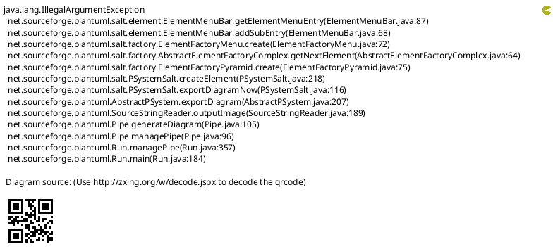
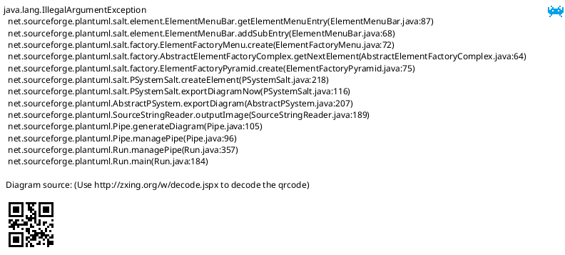
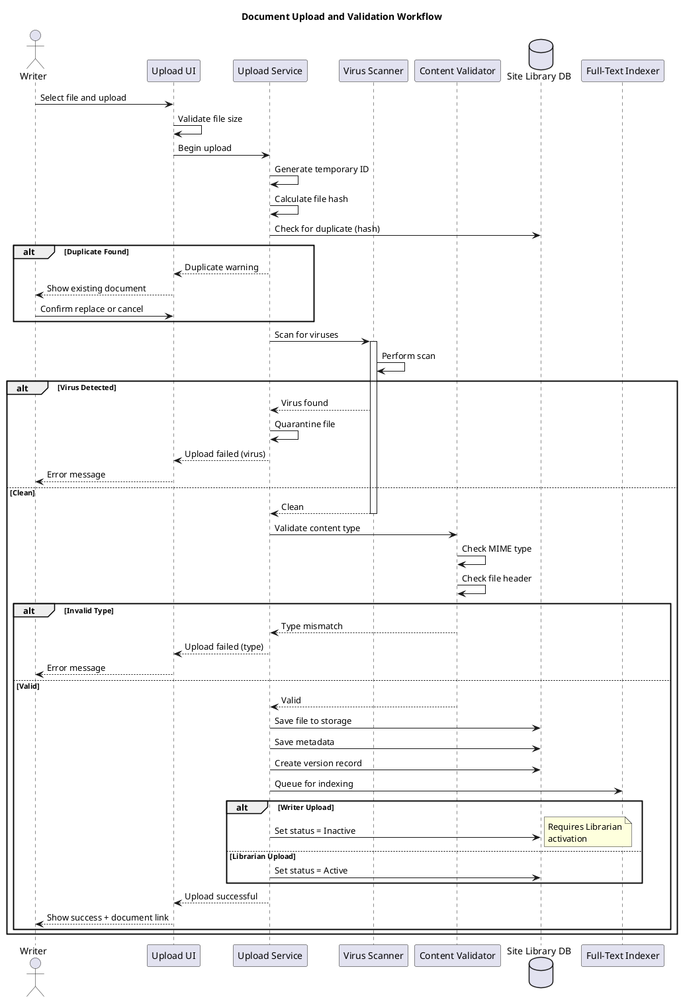

# Site Library Feature Specification: Document Upload

## Overview

The Document Upload feature enables Site Library Writers and Librarians to upload trial documents to the library, supporting multiple file formats with automatic content type validation and virus scanning.

## User Stories

- **As a** writer, **I want to** upload documents to the library, **so that** trial staff can access important materials
- **As a** writer, **I want to** provide descriptions for uploaded documents, **so that** users can understand document content
- **As a** librarian, **I want to** organize documents into folders, **so that** the library structure is logical
- **As a** writer, **I want to** update existing documents, **so that** users always have the latest version

## Functional Requirements

### FR-1: Upload Interface
- Drag-and-drop file upload
- Traditional file browser selection
- Multiple file upload (batch processing)
- Progress indicator for uploads
- Upload queue management

### FR-2: Supported File Types
- **Documents**: PDF, DOC, DOCX, TXT, RTF
- **Spreadsheets**: XLS, XLSX, CSV
- **Presentations**: PPT, PPTX
- **Images**: JPG, PNG, GIF, BMP
- **Videos**: MP4, WebM, AVI
- **Archives**: ZIP (with contents scanning)
- File type validation based on MIME type and file header

### FR-3: Upload Metadata
- Required fields:
  - Title (auto-populated from filename, editable)
  - Description/Abstract
  - Category/Folder location
- Optional fields:
  - Keywords/Tags
  - Related documents
  - Expiration date
  - Document version note
  - Author/Source

### FR-4: Upload Validation
- File size limit (default: 100MB, configurable)
- Content type validation (prevent file type spoofing)
- Virus scanning (integration with antivirus)
- Duplicate detection (same filename, hash match)
- Filename sanitization (remove special characters)

### FR-5: Upload to Folder
- Select destination folder before upload
- Browse folder hierarchy
- Recent folders quick access
- Create new folder during upload
- Folder permission validation (can upload to folder)

### FR-6: Replace Document Version
- Replace existing document with new version
- Preserve document ID and permissions
- Increment version number automatically
- Optional version change notes
- Previous version archived automatically

### FR-7: Batch Upload
- Upload multiple files simultaneously
- Apply metadata to all files or individually
- Bulk categorization and tagging
- Progress tracking for each file
- Partial success handling (some succeed, some fail)

### FR-8: Upload Draft Mode
- Save upload metadata as draft
- Complete upload later
- Drafts automatically deleted after 7 days
- Resume interrupted uploads

## User Interface Specifications

### UI-1: Document Upload Form

#### PlantUML+SALT Mockup



#### ASCII Art Version

```
┌─────────────────────────────────────────────────────────────────────────────────────┐
│ Site Library - Upload Document                                                      │
│ Upload to: Site Library > SOPs > Clinical Procedures          [Change Folder]      │
├─────────────────────────────────────────────────────────────────────────────────────┤
│                                                                                      │
│ ┌─ Select File ────────────────────────────────────────────────────────────────┐    │
│ │                                                                               │    │
│ │  ┌───────────────────────────────────────────────────────────────────────┐   │    │
│ │  │                                                                        │   │    │
│ │  │                   [Browse Files]                                       │   │    │
│ │  │                                                                        │   │    │
│ │  │              Or Drag & Drop Files Here                                │   │    │
│ │  │                                                                        │   │    │
│ │  │                                                                        │   │    │
│ │  └───────────────────────────────────────────────────────────────────────┘   │    │
│ │                                                                               │    │
│ │  Selected: 📄 protocol_amendment_v2.pdf (2.3 MB)              [Remove]       │    │
│ │                                                                               │    │
│ └───────────────────────────────────────────────────────────────────────────────┘    │
│                                                                                      │
│ ┌─ Document Information ───────────────────────────────────────────────────────┐    │
│ │                                                                               │    │
│ │  Title:                                                                       │    │
│ │  [Protocol Amendment v2.0__________________________________]                 │    │
│ │                                                                               │    │
│ │  Description:                                                                 │    │
│ │  ┌───────────────────────────────────────────────────────────────────────┐   │    │
│ │  │ Updated protocol incorporating feedback from sites.                   │   │    │
│ │  │ Major changes in inclusion criteria (Section 4.2).                    │   │    │
│ │  │                                                                        │   │    │
│ │  │                                                                        │   │    │
│ │  └───────────────────────────────────────────────────────────────────────┘   │    │
│ │                                                                               │    │
│ │  Category:         [▼ Clinical Protocol                                   ]  │    │
│ │  Keywords:         [protocol, amendment, inclusion criteria_______________]  │    │
│ │                                                                               │    │
│ └───────────────────────────────────────────────────────────────────────────────┘    │
│                                                                                      │
│ ┌─ Additional Options ─────────────────────────────────────────────────────────┐    │
│ │                                                                               │    │
│ │  [ ] Make Active (skip approval workflow - Librarian only)                   │    │
│ │  [✓] Replace existing version                                                 │    │
│ │                                                                               │    │
│ │  Existing Document: [▼ Protocol Amendment v1.0                            ]  │    │
│ │  Version Notes:     [Updated inclusion/exclusion criteria_________________]  │    │
│ │                                                                               │    │
│ └───────────────────────────────────────────────────────────────────────────────┘    │
│                                                                                      │
│ ┌─ Access Permissions ─────────────────────────────────────────────────────────┐    │
│ │                                                                               │    │
│ │  (●) Inherit from folder (Clinical Procedures)                                │    │
│ │  ( ) Custom permissions for this document                                     │    │
│ │                                                                               │    │
│ └───────────────────────────────────────────────────────────────────────────────┘    │
│                                                                                      │
│                                                                                      │
│          [Cancel]            [Save as Draft]            [Upload Document]           │
│                                                                                      │
└─────────────────────────────────────────────────────────────────────────────────────┘
```

### UI-2: Batch Upload Manager

#### PlantUML+SALT Mockup



#### ASCII Art Version

```
┌─────────────────────────────────────────────────────────────────────────────────────┐
│ Site Library - Batch Upload                                                         │
│ Upload to: Site Library > Training Materials                      [Change]          │
├─────────────────────────────────────────────────────────────────────────────────────┤
│                                                                                      │
│ ┌────────────────────────┬────────┬───────────┬───────────────┬─────────────────┐   │
│ │ File                   │  Size  │  Status   │   Progress    │    Actions      │   │
│ ├────────────────────────┼────────┼───────────┼───────────────┼─────────────────┤   │
│ │ training_module_1.pdf  │ 3.2 MB │ Uploading │ ████████░░80% │    [Cancel]     │   │
│ ├────────────────────────┼────────┼───────────┼───────────────┼─────────────────┤   │
│ │ training_module_2.pdf  │ 2.8 MB │  Pending  │ ░░░░░░░░░░ 0% │    [Remove]     │   │
│ ├────────────────────────┼────────┼───────────┼───────────────┼─────────────────┤   │
│ │ training_module_3.pdf  │ 4.1 MB │  Pending  │ ░░░░░░░░░░ 0% │    [Remove]     │   │
│ ├────────────────────────┼────────┼───────────┼───────────────┼─────────────────┤   │
│ │ training_quiz_1.xlsx   │ 156 KB │  Pending  │ ░░░░░░░░░░ 0% │    [Remove]     │   │
│ ├────────────────────────┼────────┼───────────┼───────────────┼─────────────────┤   │
│ │ training_video.mp4     │45.2 MB │ Scanning  │ ████████░░75% │    [Cancel]     │   │
│ └────────────────────────┴────────┴───────────┴───────────────┴─────────────────┘   │
│                                                                                      │
│ Summary: Total 5 files (55.5 MB)  Uploaded: 1  In Progress: 2  Pending: 2  Failed:0│
│                                                                                      │
│ ┌─ Apply to All Files ─────────────────────────────────────────────────────────┐    │
│ │                                                                               │    │
│ │  Category:      [▼ Training Materials                                     ]  │    │
│ │  Keywords:      [training, orientation________________________________]      │    │
│ │                                                                               │    │
│ │  [✓] Make Active after upload (Librarian only)                               │    │
│ │                                                                               │    │
│ └───────────────────────────────────────────────────────────────────────────────┘    │
│                                                                                      │
│                                                                                      │
│              [Cancel All]         [Pause Upload]         [Continue Upload]          │
│                                                                                      │
└─────────────────────────────────────────────────────────────────────────────────────┘
```

## Process Flow

### Document Upload Process



#### ASCII Art Version

```
Writer    Upload UI    Upload Svc    Scanner    Validator    Library DB    Indexer
  |           |             |            |            |            |            |
  |-- Select file --------->|            |            |            |            |
  |           |             |            |            |            |            |
  |           |-- Validate file size     |            |            |            |
  |           |             |            |            |            |            |
  |           |--- Begin upload -------->|            |            |            |
  |           |             |            |            |            |            |
  |           |             |-- Generate temp ID      |            |            |
  |           |             |-- Calculate hash        |            |            |
  |           |             |                         |            |            |
  |           |             |--- Check duplicate (hash) ---------->|            |
  |           |             |                         |            |            |
  +-- IF Duplicate Found --+            |            |            |            |
  |           |             |            |            |            |            |
  |           |<-- Duplicate warning ----|            |            |            |
  |<-- Show existing doc ---|            |            |            |            |
  |           |             |            |            |            |            |
  |-- Confirm replace ----->|            |            |            |            |
  |           |             |            |            |            |            |
  +-- END IF ---------------+            |            |            |            |
  |           |             |            |            |            |            |
  |           |             |--- Scan for viruses --->|            |            |
  |           |             |            |            |            |            |
  |           |             |            |-- Perform scan         |            |
  |           |             |            |            |            |            |
  +-- IF Virus Detected ----+            |            |            |            |
  |           |             |            |            |            |            |
  |           |             |<-- Virus found ---------|            |            |
  |           |             |-- Quarantine file       |            |            |
  |           |<-- Upload failed (virus)              |            |            |
  |<-- Error message -------|            |            |            |            |
  |           |             |            |            |            |            |
  +-- ELSE Clean -----------+            |            |            |            |
  |           |             |            |            |            |            |
  |           |             |<-- Clean ---------------|            |            |
  |           |             |            |            |            |            |
  |           |             |--- Validate content type ----------->|            |
  |           |             |            |            |            |            |
  |           |             |            |            |-- Check MIME type       |
  |           |             |            |            |-- Check file header     |
  |           |             |            |            |            |            |
  +-- IF Invalid Type ------+            |            |            |            |
  |           |             |            |            |            |            |
  |           |             |<-- Type mismatch -------------------|            |
  |           |<-- Upload failed (type) -|            |            |            |
  |<-- Error message -------|            |            |            |            |
  |           |             |            |            |            |            |
  +-- ELSE Valid -----------+            |            |            |            |
  |           |             |            |            |            |            |
  |           |             |<-- Valid ---------------------------             |
  |           |             |            |            |            |            |
  |           |             |--- Save file to storage ----------------------->|
  |           |             |--- Save metadata ---------------------------->|
  |           |             |--- Create version record --------------------->|
  |           |             |--- Queue for indexing ---------------------------->|
  |           |             |            |            |            |            |
  +-- IF Writer Upload -----+            |            |            |            |
  |           |             |            |            |            |            |
  |           |             |--- Set status = Inactive (requires activation) ->|
  |           |             |            |            |            |            |
  +-- ELSE Librarian -------+            |            |            |            |
  |           |             |            |            |            |            |
  |           |             |--- Set status = Active ----------------------->|
  |           |             |            |            |            |            |
  +-- END IF ---------------+            |            |            |            |
  |           |             |            |            |            |            |
  |           |<-- Upload successful ----|            |            |            |
  |<-- Show success + link -|            |            |            |            |
  |           |             |            |            |            |            |
```

## Business Rules

### BR-1: File Size Limits
- Default maximum: 100 MB per file
- Configurable per trial
- Video files: 500 MB maximum
- Batch upload: 1 GB total maximum
- Exceeded limits rejected before upload

### BR-2: Activation Workflow
- Writers upload documents as Inactive
- Librarians must activate before users can view
- Librarians can upload as Active directly
- Activation required after every edit by Writer

### BR-3: Duplicate Detection
- File hash calculated on upload
- Duplicate hash triggers warning
- User chooses: Replace version or Upload new
- Duplicate filenames allowed (different hash)

### BR-4: Virus Scanning
- All uploads scanned automatically
- Infected files quarantined
- Upload rejected with error message
- Security team notified of virus attempts

### BR-5: Version Replacement
- Replace preserves document ID
- Version number auto-incremented
- Previous version archived
- Permissions inherited from original
- Activation status reset to Inactive (if Writer)

## Data Model

### Document Entity

| Field | Type | Required | Description |
|-------|------|----------|-------------|
| DocumentID | GUID | Yes | Unique identifier |
| Title | String(200) | Yes | Document title |
| Description | String(2000) | Yes | Document description |
| FileName | String(255) | Yes | Original filename |
| FileSize | BigInt | Yes | File size in bytes |
| ContentType | String(100) | Yes | MIME type |
| FileHash | String(64) | Yes | SHA-256 hash |
| StoragePath | String(500) | Yes | File storage location |
| FolderID | GUID | Yes | Parent folder |
| CategoryID | GUID | No | Document category |
| Keywords | String(500) | No | Comma-separated keywords |
| CurrentVersion | Int | Yes | Current version number |
| Status | Enum | Yes | Active, Inactive, Deleted |
| UploadedBy | GUID | Yes | User who uploaded |
| UploadedDate | DateTime | Yes | Upload timestamp |
| ActivatedBy | GUID | No | Librarian who activated |
| ActivatedDate | DateTime | No | Activation timestamp |
| ExpirationDate | Date | No | Document expiration |
| ViewCount | Int | Yes | Number of views |
| DownloadCount | Int | Yes | Number of downloads |

### Document Version Entity

| Field | Type | Required | Description |
|-------|------|----------|-------------|
| VersionID | GUID | Yes | Unique identifier |
| DocumentID | GUID | Yes | Reference to document |
| VersionNumber | Int | Yes | Version number |
| FileName | String(255) | Yes | Filename for this version |
| FileSize | BigInt | Yes | File size in bytes |
| FileHash | String(64) | Yes | SHA-256 hash |
| StoragePath | String(500) | Yes | Storage location |
| VersionNotes | String(1000) | No | Change description |
| UploadedBy | GUID | Yes | Who uploaded this version |
| UploadedDate | DateTime | Yes | Version upload timestamp |
| IsCurrent | Boolean | Yes | Is this the current version |

## Non-Functional Requirements

### NFR-1: Performance
- Upload speed: Network-limited (no artificial throttling)
- Progress updates every 500ms
- Virus scan completes within 30 seconds
- Parallel uploads supported (up to 5 simultaneous)

### NFR-2: Reliability
- Resume interrupted uploads
- Chunked upload for large files
- Transactional database updates
- Automatic retry on transient failures (3 attempts)

### NFR-3: Security
- All uploads over HTTPS
- File storage encrypted at rest
- Access control on upload folders
- Virus scanning mandatory (cannot disable)
- File type whitelist (configurable)

### NFR-4: Usability
- Drag-and-drop support
- Paste from clipboard (images)
- Auto-populate title from filename
- Save draft and complete later
- Clear error messages with remediation steps

## Related Documentation

- [Site Library Use Cases](/current/src/docs/architecture/site-library/use-cases.md) - UC_UpdateContent
- [Versioning Feature](/current/src/docs/features/site-library/versioning.md) - Version management
- [Publishing Feature](/current/src/docs/features/site-library/publishing.md) - Activation workflow
- [Permissions Feature](/current/src/docs/features/site-library/permissions.md) - Access control

## Change History

| Version | Date | Author | Changes |
|---------|------|--------|---------|
| 1.0 | 2026-01-13 | System | Initial specification with dual-format mockups |
