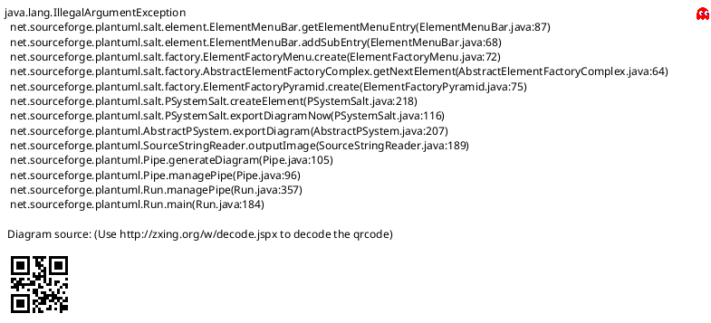
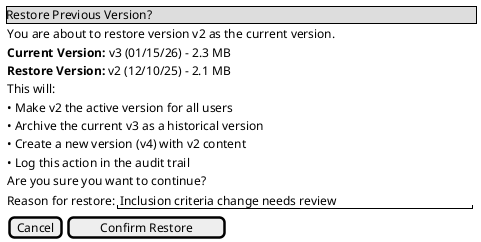
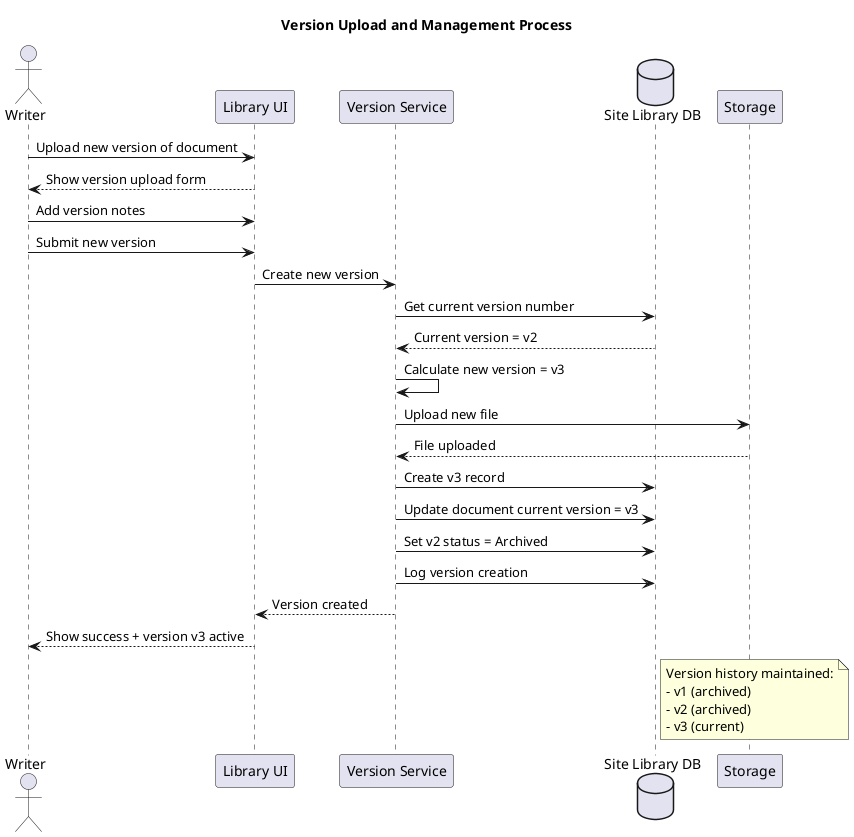

# Site Library Feature Specification: Version Control

## Overview

The Version Control feature enables tracking and managing multiple versions of documents, allowing users to view version history, compare versions, and restore previous versions when needed.

## User Stories

- **As a** user, **I want to** view version history of a document, **so that** I can see how it evolved
- **As a** writer, **I want to** upload new versions of documents, **so that** content stays current
- **As a** user, **I want to** download previous versions, **so that** I can reference historical content
- **As a** librarian, **I want to** restore previous versions, **so that** I can rollback incorrect changes

## Functional Requirements

### FR-1: Version History Display
- List all versions of a document in chronological order
- Show version number, upload date, uploader, file size
- Display version notes/change description
- Indicate current active version
- Quick actions: View, Download, Compare, Restore

### FR-2: Automatic Version Creation
- New version created when document replaced
- Version number auto-incremented (v1, v2, v3...)
- Previous version archived automatically
- All versions retain full metadata
- Version creation timestamp recorded

### FR-3: Version Notes
- Optional change description when uploading new version
- Version notes displayed in history
- Searchable version notes
- Markdown formatting supported

### FR-4: Version Comparison
- Side-by-side visual comparison (future)
- Metadata comparison (size, date, author)
- Download both versions for manual comparison
- Highlight differences (for text documents)

### FR-5: Version Restoration
- Librarian can restore previous version as current
- Restored version becomes new current version
- Restoration creates new version number
- Restoration logged in audit trail
- Confirmation required before restore

### FR-6: Version Deletion
- Individual versions can be deleted (Librarian only)
- Current version cannot be deleted
- At least one version must remain
- Deletion permanent (not recoverable)
- Deletion logged in audit trail

## User Interface Specifications

### UI-1: Version History View

#### PlantUML+SALT Mockup



#### ASCII Art Version

```
┌─────────────────────────────────────────────────────────────────────────────────────┐
│ Site Library - Version History                                                      │
│ Document: Protocol Amendment v2.0                          [Back to Document]       │
├─────────────────────────────────────────────────────────────────────────────────────┤
│                                                                                      │
│ ┌────┬──────────┬───────────────┬────────┬────────────────────┬─────────┬────────┐ │
│ │Ver │   Date   │  Uploaded By  │  Size  │  Changes           │ Status  │Actions │ │
│ ├────┼──────────┼───────────────┼────────┼────────────────────┼─────────┼────────┤ │
│ │ v3 │ 01/15/26 │Sarah Johnson  │ 2.3 MB │Updated inclusion   │ CURRENT │ [View] │ │
│ │    │          │               │        │criteria            │         │  [DL]  │ │
│ ├────┼──────────┼───────────────┼────────┼────────────────────┼─────────┼────────┤ │
│ │ v2 │ 12/10/25 │Mike Smith     │ 2.1 MB │Added safety        │Archived │ [View] │ │
│ │    │          │               │        │monitoring section  │         │  [DL]  │ │
│ │    │          │               │        │                    │         │[Restore│ │
│ ├────┼──────────┼───────────────┼────────┼────────────────────┼─────────┼────────┤ │
│ │ v1 │ 11/01/25 │Sarah Johnson  │ 1.8 MB │Initial version     │Archived │ [View] │ │
│ │    │          │               │        │                    │         │  [DL]  │ │
│ │    │          │               │        │                    │         │[Restore│ │
│ └────┴──────────┴───────────────┴────────┴────────────────────┴─────────┴────────┘ │
│                                                                                      │
│  Total versions: 3       Current version: v3                                        │
│                                                                                      │
│                    [Compare Versions]              [Download All]                   │
│                                                                                      │
└─────────────────────────────────────────────────────────────────────────────────────┘
```

### UI-2: Restore Version Confirmation

#### PlantUML+SALT Mockup



#### ASCII Art Version

```
┌─────────────────────────────────────────────────────────────────────────────────────┐
│ Restore Previous Version?                                                           │
├─────────────────────────────────────────────────────────────────────────────────────┤
│                                                                                      │
│  You are about to restore version v2 as the current version.                        │
│                                                                                      │
│  Current Version:  v3 (01/15/26) - 2.3 MB                                           │
│  Restore Version:  v2 (12/10/25) - 2.1 MB                                           │
│                                                                                      │
│  This will:                                                                          │
│    • Make v2 the active version for all users                                       │
│    • Archive the current v3 as a historical version                                 │
│    • Create a new version (v4) with v2 content                                      │
│    • Log this action in the audit trail                                             │
│                                                                                      │
│  Are you sure you want to continue?                                                 │
│                                                                                      │
│  ┌─────────────────────────────────────────────────────────────────────────────┐    │
│  │ Reason for restore:                                                          │    │
│  │ [Inclusion criteria change needs review________________________]            │    │
│  └─────────────────────────────────────────────────────────────────────────────┘    │
│                                                                                      │
│                                                                                      │
│                       [Cancel]            [Confirm Restore]                         │
│                                                                                      │
└─────────────────────────────────────────────────────────────────────────────────────┘
```

## Process Flow



## Business Rules

### BR-1: Version Numbering
- Version numbers start at 1
- Auto-increment for each new version
- Version numbers never reused
- Restored versions get new version number

### BR-2: Version Limits
- No limit on number of versions
- Storage quota may limit total size
- Very old versions may be archived offline (policy-based)

### BR-3: Current Version
- Exactly one current version at all times
- Current version is what users see by default
- Only current version appears in search (unless opted-in)
- Only current version counted in statistics

### BR-4: Version Permissions
- View history: Same permissions as view document
- Download any version: Same permissions as download document
- Upload new version: Requires Writer role
- Restore version: Requires Librarian role
- Delete version: Requires Librarian role

## Data Model

See Upload feature for Document and DocumentVersion entities.

## Non-Functional Requirements

### NFR-1: Performance
- Version history loads within 1 second
- Support 100+ versions per document efficiently
- Version download same speed as current version

### NFR-2: Storage
- All versions stored with full fidelity
- No compression or quality loss
- Efficient storage using deduplication (future)

### NFR-3: Auditability
- All version operations logged
- Restoration tracked with reason
- Deletion logged with approval
- Full audit trail for compliance

## Related Documentation

- [Site Library Use Cases](/current/src/docs/architecture/site-library/use-cases.md) - UC_ListVersions
- [Upload Feature](/current/src/docs/features/site-library/upload.md) - Version creation
- [Publishing Feature](/current/src/docs/features/site-library/publishing.md) - Version activation

## Change History

| Version | Date | Author | Changes |
|---------|------|--------|---------|
| 1.0 | 2026-01-13 | System | Initial specification with dual-format mockups |
