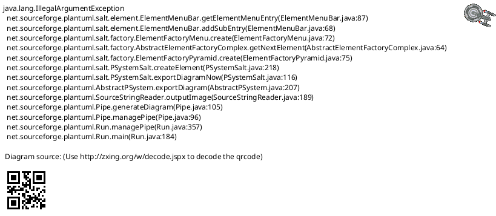
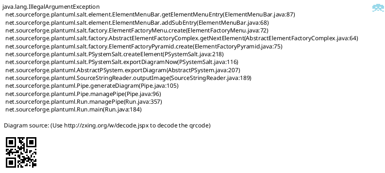
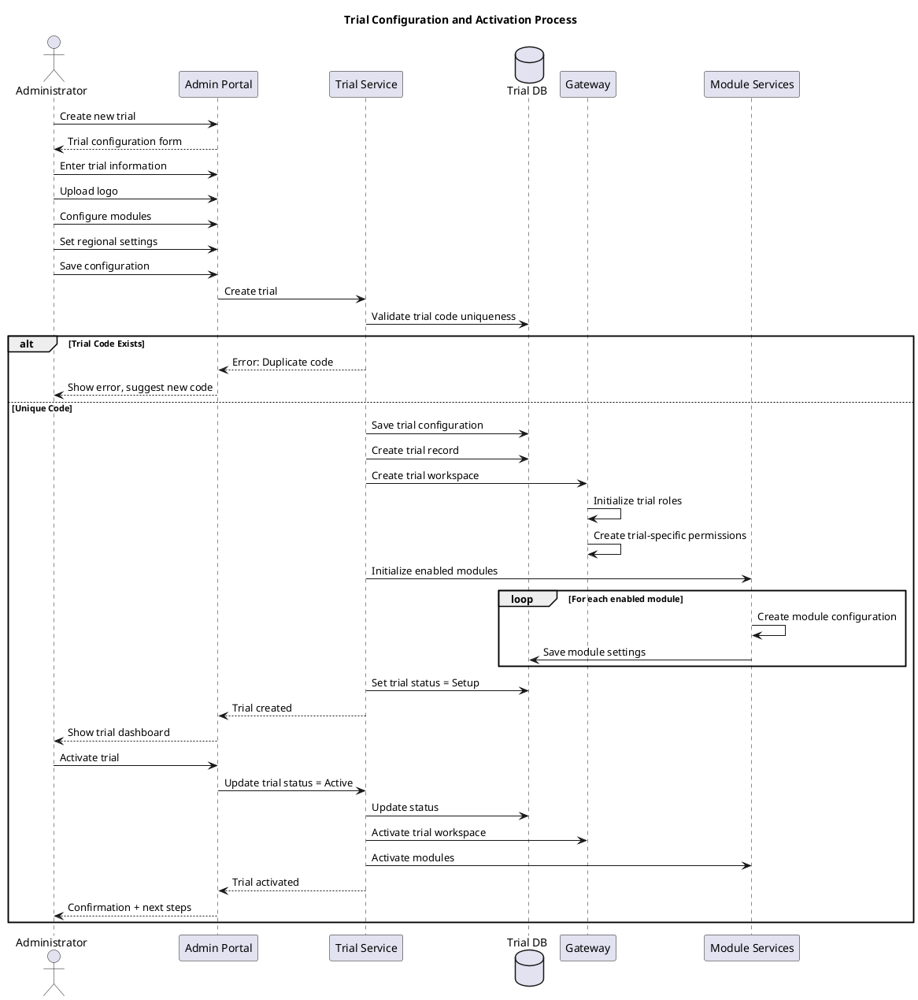

# Trial Feature Specification: Trial Configuration

## Overview

The Trial Configuration feature enables administrators to create and manage trial settings including name, description, branding, and metadata that customize the OoBDev platform for each clinical trial.

## User Stories

- **As an** administrator, **I want to** configure trial settings, **so that** the platform reflects trial-specific information
- **As an** administrator, **I want to** upload trial branding, **so that** users see trial-specific visuals
- **As an** administrator, **I want to** manage trial metadata, **so that** the system has complete trial information
- **As a** user, **I want to** see trial-specific branding, **so that** I know which trial I'm working on

## Functional Requirements

### FR-1: Basic Trial Information
- Trial Code (unique identifier)
- Trial Name (full trial name)
- Trial Title (display title for users)
- Trial Subtitle (additional descriptive text)
- Trial Description (detailed description)
- Protocol Number
- Sponsor Name
- CRO Name (if applicable)
- Trial Phase (I, II, III, IV)
- Therapeutic Area

### FR-2: Trial Branding
- Trial Logo upload (PNG, JPG, SVG)
- Logo dimensions (recommended: 200x80px)
- Logo displayed in:
  - Portal header
  - Email templates
  - PDF reports
  - Login page (optional)
- Color scheme customization (primary, secondary colors)
- Custom CSS (advanced, optional)

### FR-3: Trial Contact Information
- Primary contact name
- Primary contact email
- Primary contact phone
- Study coordinator contact
- Medical monitor contact
- Emergency contact (24/7 hotline)
- Sponsor contact information

### FR-4: Trial Dates
- Trial start date
- Planned end date
- Enrollment start date
- Enrollment end date
- First patient first visit (FPFV)
- Last patient last visit (LPLV)
- Database lock date

### FR-5: Trial External Links
- Protocol website URL
- Sponsor website URL
- CRO portal URL
- ClinicalTrials.gov identifier
- EudraCT number
- Ethics committee information link

### FR-6: Trial Settings
- Time zone (for scheduling and reporting)
- Default language
- Date format (MM/DD/YYYY, DD/MM/YYYY, YYYY-MM-DD)
- Time format (12-hour, 24-hour)
- Currency (for budget tracking)
- Measurement units (Imperial, Metric)

### FR-7: Module Configuration
- Enable/disable modules per trial:
  - MARS (Medication Adherence)
  - Site Library
  - SAE Reporting
  - CEC (Clinical Endpoint Committee)
  - CTS (Clinical Trial Site Management)
- Module-specific settings
- Feature flags for beta features

### FR-8: Trial Status Management
- Status values:
  - Setup (configuration in progress)
  - Active (enrolling subjects)
  - Enrollment Complete (follow-up ongoing)
  - Database Lock
  - Completed
  - Terminated
- Status change workflow with reason
- Status affects available functionality

## User Interface Specifications

### UI-1: Trial Configuration Form

#### PlantUML+SALT Mockup



#### ASCII Art Version

```
┌─────────────────────────────────────────────────────────────────────────────────────┐
│ Trial Configuration                                                                 │
│ Trial: ACME-2026-001                    Status: ACTIVE             [View Audit Log] │
├─────────────────────────────────────────────────────────────────────────────────────┤
│                                                                                      │
│ ┌─ Basic Information ──────────────────┐  ┌─ Branding ───────────────────────────┐ │
│ │                                       │  │                                       │ │
│ │  Trial Code:       ACME-2026-001      │  │  Trial Logo:                          │ │
│ │                    (read-only)        │  │                                       │ │
│ │                                       │  │  ┌──────────────────────────────┐    │ │
│ │  Trial Name:                          │  │  │                               │    │ │
│ │  [ACME Diabetes Prevention Study___] │  │  │    [Current Logo Preview]     │    │ │
│ │                                       │  │  │                               │    │ │
│ │  Protocol Number:                     │  │  └──────────────────────────────┘    │ │
│ │  [ACME-DP-2026-001_________________] │  │                                       │ │
│ │                                       │  │  [Upload New Logo]                    │ │
│ │  Trial Title:                         │  │                                       │ │
│ │  [Efficacy of Novel Drug in________] │  │  Primary Color:   [#003366] [🎨]     │ │
│ │  [Diabetes Prevention______________] │  │  Secondary Color: [#0066CC] [🎨]     │ │
│ │                                       │  │                                       │ │
│ │  Subtitle:                            │  └───────────────────────────────────────┘ │
│ │  [A Phase III Randomized___________] │                                            │
│ │  [Controlled Trial_________________] │                                            │
│ │                                       │                                            │
│ │  Phase:             [▼ Phase III   ] │                                            │
│ │  Therapeutic Area:  [▼Endocrinology] │                                            │
│ │                                       │                                            │
│ └───────────────────────────────────────┘                                            │
│                                                                                      │
│ ┌─ Description ────────────────────────────────────────────────────────────────┐    │
│ │                                                                               │    │
│ │  ┌───────────────────────────────────────────────────────────────────────┐   │    │
│ │  │ This is a multi-center, randomized, double-blind, placebo-controlled │   │    │
│ │  │ trial evaluating the efficacy and safety of ACME-Drug in preventing  │   │    │
│ │  │ type 2 diabetes in high-risk individuals.                             │   │    │
│ │  │                                                                        │   │    │
│ │  │                                                                        │   │    │
│ │  └───────────────────────────────────────────────────────────────────────┘   │    │
│ │                                                                               │    │
│ └───────────────────────────────────────────────────────────────────────────────┘    │
│                                                                                      │
│ ┌─ Trial Dates ────────────────────────┐  ┌─ Contact Information ────────────────┐ │
│ │                                       │  │                                       │ │
│ │  Start Date:       [01/01/2026 📅]   │  │  Primary Contact:                     │ │
│ │  Planned End:      [12/31/2028 📅]   │  │  [Dr. Sarah Johnson______________]   │ │
│ │  Enrollment Start: [02/01/2026 📅]   │  │                                       │ │
│ │  Enrollment End:   [06/30/2027 📅]   │  │  Email:                               │ │
│ │                                       │  │  [sarah.johnson@acme.com_________]   │ │
│ │                                       │  │                                       │ │
│ │                                       │  │  Phone:                               │ │
│ │                                       │  │  [(555) 123-4567_________________]   │ │
│ │                                       │  │                                       │ │
│ │                                       │  │  Emergency:                           │ │
│ │                                       │  │  [1-800-ACME-TRIAL (24/7)________]   │ │
│ │                                       │  │                                       │ │
│ └───────────────────────────────────────┘  └───────────────────────────────────────┘ │
│                                                                                      │
│                                                                                      │
│            [Cancel Changes]        [Save Draft]        [Save & Activate]            │
│                                                                                      │
└─────────────────────────────────────────────────────────────────────────────────────┘
```

### UI-2: Module Configuration

#### PlantUML+SALT Mockup



#### ASCII Art Version

```
┌─────────────────────────────────────────────────────────────────────────────────────┐
│ Trial Configuration - Modules                                                       │
│ Trial: ACME-2026-001                                        [Back to Basic Info]    │
├─────────────────────────────────────────────────────────────────────────────────────┤
│                                                                                      │
│ ┌─ Enabled Modules ────────────────────────────────────────────────────────────┐    │
│ │                                                                               │    │
│ │  ┌───────────────────────────────┬─────────┬─────────────┬────────────────┐  │    │
│ │  │ Module                        │ Status  │Configuration│ Actions        │  │    │
│ │  ├───────────────────────────────┼─────────┼─────────────┼────────────────┤  │    │
│ │  │ MARS                          │ Enabled │ [Configure] │ [Disable]      │  │    │
│ │  │ (Medication Adherence)        │         │             │                │  │    │
│ │  ├───────────────────────────────┼─────────┼─────────────┼────────────────┤  │    │
│ │  │ Site Library                  │ Enabled │ [Configure] │ [Disable]      │  │    │
│ │  ├───────────────────────────────┼─────────┼─────────────┼────────────────┤  │    │
│ │  │ SAE Reporting                 │ Enabled │ [Configure] │ [Disable]      │  │    │
│ │  ├───────────────────────────────┼─────────┼─────────────┼────────────────┤  │    │
│ │  │ CEC                           │Disabled │      -      │ [Enable]       │  │    │
│ │  │ (Clinical Endpoint Committee) │         │             │                │  │    │
│ │  ├───────────────────────────────┼─────────┼─────────────┼────────────────┤  │    │
│ │  │ CTS                           │ Enabled │ [Configure] │ [Disable]      │  │    │
│ │  │ (Trial Site Management)       │         │             │                │  │    │
│ │  └───────────────────────────────┴─────────┴─────────────┴────────────────┘  │    │
│ │                                                                               │    │
│ └───────────────────────────────────────────────────────────────────────────────┘    │
│                                                                                      │
│ ┌─ Regional Settings ──────────────────────────────────────────────────────────┐    │
│ │                                                                               │    │
│ │  Time Zone:        [▼ (UTC-05:00) Eastern Time (US & Canada)              ] │    │
│ │  Default Language: [▼ English (US)                                         ] │    │
│ │  Date Format:      [▼ MM/DD/YYYY                                           ] │    │
│ │  Time Format:      [▼ 12-hour (AM/PM)                                      ] │    │
│ │  Currency:         [▼ USD ($)                                              ] │    │
│ │  Units:            [▼ Imperial (lb, in, °F)                                ] │    │
│ │                                                                               │    │
│ └───────────────────────────────────────────────────────────────────────────────┘    │
│                                                                                      │
│                                                                                      │
│                       [Cancel]                    [Save Settings]                   │
│                                                                                      │
└─────────────────────────────────────────────────────────────────────────────────────┘
```

## Process Flow



## Business Rules

### BR-1: Trial Code Uniqueness
- Trial code must be unique across all trials in system
- Trial code cannot be changed after creation
- Suggested format: SPONSOR-INDICATION-YEAR-NNN
- Code used in URLs, APIs, references

### BR-2: Trial Status Transitions
- Valid transitions:
  - Setup → Active
  - Active → Enrollment Complete
  - Enrollment Complete → Database Lock
  - Database Lock → Completed
  - Any → Terminated (with approval)
- Reason required for status changes
- Status change logged in audit trail

### BR-3: Module Dependencies
- Site Library always enabled (core module)
- MARS requires Site Library
- SAE requires Site Library
- CEC can be standalone
- CTS can be standalone

### BR-4: Branding Requirements
- Logo file size: Maximum 2 MB
- Logo formats: PNG (preferred), JPG, SVG
- Recommended dimensions: 200x80px
- Logo appears in header (auto-scaled)

### BR-5: Time Zone Handling
- Trial time zone used for:
  - Scheduled reports
  - Reminder scheduling
  - Database timestamps display
  - Appointment scheduling
- Users can have different time zone
- System stores UTC, displays in trial time zone

## Data Model

### Trial Entity

| Field | Type | Required | Description |
|-------|------|----------|-------------|
| TrialID | GUID | Yes | Unique identifier |
| TrialCode | String(50) | Yes | Unique trial code |
| TrialName | String(200) | Yes | Full trial name |
| TrialTitle | String(200) | Yes | Display title |
| TrialSubtitle | String(200) | No | Subtitle |
| Description | String(2000) | No | Detailed description |
| ProtocolNumber | String(50) | No | Protocol number |
| SponsorName | String(200) | No | Sponsor name |
| CROName | String(200) | No | CRO name |
| Phase | Enum | No | I, II, III, IV |
| TherapeuticArea | String(100) | No | Therapeutic area |
| LogoPath | String(500) | No | Logo file path |
| PrimaryColor | String(7) | No | Hex color code |
| SecondaryColor | String(7) | No | Hex color code |
| TimeZone | String(50) | Yes | IANA time zone |
| DefaultLanguage | String(10) | Yes | Language code |
| DateFormat | String(20) | Yes | Date format string |
| TimeFormat | Enum | Yes | 12Hour, 24Hour |
| Currency | String(3) | Yes | ISO currency code |
| MeasurementUnits | Enum | Yes | Imperial, Metric |
| Status | Enum | Yes | Setup, Active, EnrollmentComplete, DatabaseLock, Completed, Terminated |
| StartDate | Date | No | Trial start date |
| PlannedEndDate | Date | No | Planned end date |
| CreatedBy | GUID | Yes | Who created trial |
| CreatedDate | DateTime | Yes | Creation timestamp |
| ModifiedBy | GUID | No | Last modifier |
| ModifiedDate | DateTime | No | Last modification |

### Trial Module Configuration Entity

| Field | Type | Required | Description |
|-------|------|----------|-------------|
| ConfigID | GUID | Yes | Unique identifier |
| TrialID | GUID | Yes | Reference to trial |
| ModuleName | Enum | Yes | MARS, SiteLibrary, SAE, CEC, CTS |
| IsEnabled | Boolean | Yes | Module enabled? |
| ConfigurationJSON | JSON | No | Module-specific settings |
| EnabledBy | GUID | No | Who enabled module |
| EnabledDate | DateTime | No | When enabled |

## Non-Functional Requirements

### NFR-1: Performance
- Trial configuration save within 2 seconds
- Logo upload within 5 seconds (2MB file)
- Trial dashboard load within 1 second
- Module activation within 3 seconds

### NFR-2: Availability
- Trial configuration available 24/7
- Configuration changes take effect immediately
- No system restart required for configuration changes

### NFR-3: Auditability
- All configuration changes logged
- Change history maintained
- Who/what/when tracked for all changes
- Configuration export for documentation

## Related Documentation

- [Admin Use Cases](/current/src/docs/architecture/admin/use-cases.md) - UC_ConfigureTrials
- [User Assignment Feature](/current/src/docs/features/trial/user-assignment.md) - User-trial associations
- [Roles Feature](/current/src/docs/features/trial/roles.md) - Trial-specific roles

## Change History

| Version | Date | Author | Changes |
|---------|------|--------|---------|
| 1.0 | 2026-01-13 | System | Initial specification with dual-format mockups |
