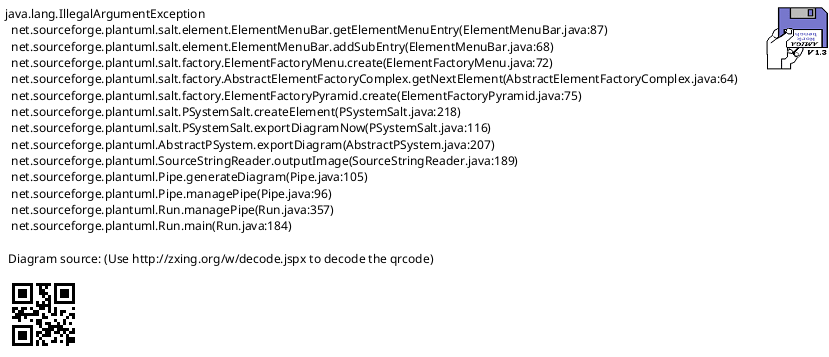
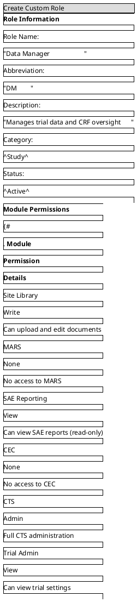
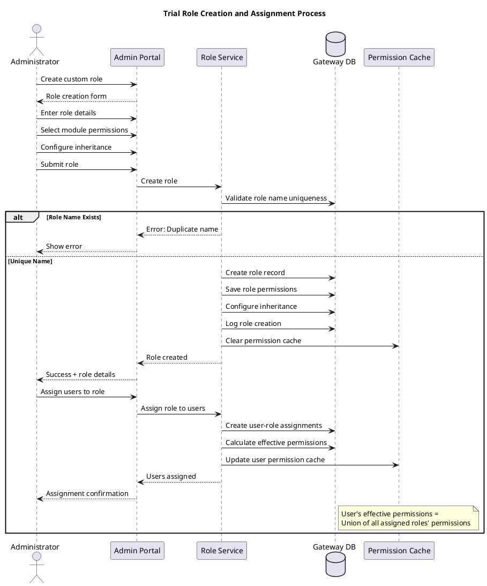

# Trial Feature Specification: Trial-Specific Roles

## Overview

The Trial-Specific Roles feature enables administrators to create and manage custom roles for each clinical trial, providing fine-grained access control tailored to each trial's organizational structure.

## User Stories

- **As an** administrator, **I want to** create custom roles for my trial, **so that** I can match our trial organization
- **As an** administrator, **I want to** assign permissions to roles, **so that** users have appropriate access
- **As an** administrator, **I want to** manage role membership, **so that** I can control who has which role
- **As a** user, **I want to** have role-appropriate permissions, **so that** I can do my job effectively

## Functional Requirements

### FR-1: Standard Trial Roles
- Pre-defined roles available for all trials:
  - **Trial Administrator**: Full trial management access
  - **Trial/Site Manager (RA2)**: Site and trial oversight
  - **Trial Coordinator (RA1)**: Day-to-day trial coordination
  - **Site Library Librarian**: Document approval and management
  - **Site Library Writer**: Document creation and editing
  - **Site Library User**: Document viewing only
  - **MARS Manager**: MARS system administration
  - **MARS Site Member**: Subject and reminder management
  - **MARS Sponsor**: Analytics and reporting
  - **SAE Reporter**: SAE entry and reporting
  - **CEC Member**: Endpoint adjudication
  - **Monitor**: Site monitoring access

### FR-2: Custom Role Creation
- Create trial-specific roles
- Role properties:
  - Role name (unique within trial)
  - Role description
  - Role category (Site, Study, Sponsor, Vendor)
  - Role abbreviation/code
  - Active/Inactive status
- Role templates for common custom roles

### FR-3: Permission Assignment
- Assign module-level permissions:
  - Site Library: None, View, Write, Admin
  - MARS: None, SiteMember, Manager, Sponsor
  - SAE: None, Report, Review, Admin
  - CEC: None, Member, Chair, Admin
  - CTS: None, View, Edit, Admin
  - Trial Admin: None, View, Admin
- Granular feature permissions within modules
- Permission inheritance from base roles (optional)

### FR-4: Role Hierarchy
- Define role relationships:
  - Parent-child role hierarchies
  - Role inheritance of permissions
  - Override inherited permissions
- Example: Coordinator inherits from User, adds Write permission

### FR-5: Role Assignment to Users
- Assign one or more roles to users
- Role effective dates (start/end)
- Primary role designation (for display)
- Role assignment history
- Bulk role assignment

### FR-6: Role-Based Access Control
- Permissions evaluated at runtime
- User's effective permissions = Union of all role permissions
- Most permissive access wins
- Real-time permission updates
- Permission caching for performance

### FR-7: Role Management
- View all roles for trial
- Edit role properties
- Modify role permissions
- Activate/deactivate roles
- Delete unused roles (validation check)
- Clone roles for similar roles

### FR-8: Role Reporting
- Users by role report
- Roles by user report
- Permission audit report
- Orphaned roles (no users) report
- Role usage statistics

## User Interface Specifications

### UI-1: Role Management Dashboard

#### PlantUML+SALT Mockup



#### ASCII Art Version

```
┌─────────────────────────────────────────────────────────────────────────────────────┐
│ Trial Roles Management                                                              │
│ Trial: ACME-2026-001                  [+ Create Custom Role]    [Import Roles]      │
├─────────────────────────────────────────────────────────────────────────────────────┤
│                                                                                      │
│  Filter: [▼All Categories] [▼Active Only]  Search: [____________] [Search]         │
│                                                                                      │
├─────────────────────────────────────────────────────────────────────────────────────┤
│                                                                                      │
│ ┌─ Standard Roles (10) ────────────────────────────────────────────────────────┐    │
│ │                                                                               │    │
│ │  ┌──────────────────────┬─────────┬──────┬───────────────┬────────┬────────┐ │    │
│ │  │ Role                 │Category │Users │ Modules       │ Status │Actions │ │    │
│ │  ├──────────────────────┼─────────┼──────┼───────────────┼────────┼────────┤ │    │
│ │  │ Trial Administrator  │ Study   │  3   │ All           │ Active │ [View] │ │    │
│ │  │                      │         │      │               │        │ [Edit] │ │    │
│ │  ├──────────────────────┼─────────┼──────┼───────────────┼────────┼────────┤ │    │
│ │  │ Trial/Site Manager   │ Study   │  8   │ All           │ Active │ [View] │ │    │
│ │  │ (RA2)                │         │      │               │        │ [Edit] │ │    │
│ │  ├──────────────────────┼─────────┼──────┼───────────────┼────────┼────────┤ │    │
│ │  │ Trial Coordinator    │ Site    │ 25   │ Library, MARS,│ Active │ [View] │ │    │
│ │  │ (RA1)                │         │      │ SAE           │        │ [Edit] │ │    │
│ │  ├──────────────────────┼─────────┼──────┼───────────────┼────────┼────────┤ │    │
│ │  │ Site Library         │ Study   │  5   │ Library       │ Active │ [View] │ │    │
│ │  │ Librarian            │         │      │ (Admin)       │        │ [Edit] │ │    │
│ │  ├──────────────────────┼─────────┼──────┼───────────────┼────────┼────────┤ │    │
│ │  │ MARS Site Member     │ Site    │ 30   │ MARS (Member) │ Active │ [View] │ │    │
│ │  │                      │         │      │               │        │ [Edit] │ │    │
│ │  └──────────────────────┴─────────┴──────┴───────────────┴────────┴────────┘ │    │
│ │                                                                               │    │
│ └───────────────────────────────────────────────────────────────────────────────┘    │
│                                                                                      │
│ ┌─ Custom Roles (3) ───────────────────────────────────────────────────────────┐    │
│ │                                                                               │    │
│ │  ┌──────────────────────┬─────────┬──────┬───────────────┬────────┬────────┐ │    │
│ │  │ Role                 │Category │Users │ Modules       │ Status │Actions │ │    │
│ │  ├──────────────────────┼─────────┼──────┼───────────────┼────────┼────────┤ │    │
│ │  │ Data Manager         │ Study   │  4   │ Library, CTS  │ Active │ [View] │ │    │
│ │  │                      │         │      │               │        │ [Edit] │ │    │
│ │  │                      │         │      │               │        │ [Del]  │ │    │
│ │  ├──────────────────────┼─────────┼──────┼───────────────┼────────┼────────┤ │    │
│ │  │ Safety Monitor       │ Sponsor │  2   │ SAE (Review)  │ Active │ [View] │ │    │
│ │  │                      │         │      │               │        │ [Edit] │ │    │
│ │  │                      │         │      │               │        │ [Del]  │ │    │
│ │  ├──────────────────────┼─────────┼──────┼───────────────┼────────┼────────┤ │    │
│ │  │ Site Auditor         │ Vendor  │  1   │ Library, CTS  │Inactive│ [View] │ │    │
│ │  │                      │         │      │               │        │ [Edit] │ │    │
│ │  │                      │         │      │               │        │ [Del]  │ │    │
│ │  └──────────────────────┴─────────┴──────┴───────────────┴────────┴────────┘ │    │
│ │                                                                               │    │
│ └───────────────────────────────────────────────────────────────────────────────┘    │
│                                                                                      │
└─────────────────────────────────────────────────────────────────────────────────────┘
```

### UI-2: Create/Edit Role

#### PlantUML+SALT Mockup



#### ASCII Art Version

```
┌─────────────────────────────────────────────────────────────────────────────────────┐
│ Create Custom Role                                                                  │
│ Trial: ACME-2026-001                                                                │
├─────────────────────────────────────────────────────────────────────────────────────┤
│                                                                                      │
│ ┌─ Role Information ───────────────────────────────────────────────────────────┐    │
│ │                                                                               │    │
│ │  Role Name:      [Data Manager_____________________________]                 │    │
│ │  Abbreviation:   [DM____]                                                    │    │
│ │  Description:    [Manages trial data and CRF oversight_____________]         │    │
│ │  Category:       [▼ Study                                              ]     │    │
│ │  Status:         [▼ Active                                             ]     │    │
│ │                                                                               │    │
│ └───────────────────────────────────────────────────────────────────────────────┘    │
│                                                                                      │
│ ┌─ Module Permissions ─────────────────────────────────────────────────────────┐    │
│ │                                                                               │    │
│ │  ┌────────────────┬────────────┬─────────────────────────────────────────┐   │    │
│ │  │ Module         │ Permission │ Details                                 │   │    │
│ │  ├────────────────┼────────────┼─────────────────────────────────────────┤   │    │
│ │  │ Site Library   │ Write      │ Can upload and edit documents           │   │    │
│ │  ├────────────────┼────────────┼─────────────────────────────────────────┤   │    │
│ │  │ MARS           │ None       │ No access to MARS                       │   │    │
│ │  ├────────────────┼────────────┼─────────────────────────────────────────┤   │    │
│ │  │ SAE Reporting  │ View       │ Can view SAE reports (read-only)        │   │    │
│ │  ├────────────────┼────────────┼─────────────────────────────────────────┤   │    │
│ │  │ CEC            │ None       │ No access to CEC                        │   │    │
│ │  ├────────────────┼────────────┼─────────────────────────────────────────┤   │    │
│ │  │ CTS            │ Admin      │ Full CTS administration                 │   │    │
│ │  ├────────────────┼────────────┼─────────────────────────────────────────┤   │    │
│ │  │ Trial Admin    │ View       │ Can view trial settings                 │   │    │
│ │  └────────────────┴────────────┴─────────────────────────────────────────┘   │    │
│ │                                                                               │    │
│ └───────────────────────────────────────────────────────────────────────────────┘    │
│                                                                                      │
│ ┌─ Role Inheritance (Optional) ────────────────────────────────────────────────┐    │
│ │                                                                               │    │
│ │  Inherit from: [▼ Site Library Writer                                     ]  │    │
│ │                                                                               │    │
│ │  [✓] Override inherited permissions with custom permissions above            │    │
│ │                                                                               │    │
│ └───────────────────────────────────────────────────────────────────────────────┘    │
│                                                                                      │
│ ┌─ Assignment Options ─────────────────────────────────────────────────────────┐    │
│ │                                                                               │    │
│ │  [ ] Assign users now                                                         │    │
│ │  [✓] Make available for assignment                                            │    │
│ │                                                                               │    │
│ └───────────────────────────────────────────────────────────────────────────────┘    │
│                                                                                      │
│                                                                                      │
│              [Cancel]       [Preview Permissions]       [Create Role]               │
│                                                                                      │
└─────────────────────────────────────────────────────────────────────────────────────┘
```

## Process Flow



## Business Rules

### BR-1: Role Naming
- Role name unique within trial
- Maximum 100 characters
- Cannot start with "System_" (reserved)
- Standard roles cannot be renamed
- Abbreviation optional, maximum 10 characters

### BR-2: Permission Inheritance
- Child role inherits all parent permissions
- Child can override inherited permissions
- Child can add additional permissions
- Circular inheritance prevented
- Maximum 5 levels of inheritance

### BR-3: Standard Roles
- Standard roles cannot be deleted
- Standard role permissions can be customized per trial
- Standard role names cannot be changed
- New trials get default standard roles

### BR-4: Custom Roles
- Custom roles trial-specific (not global)
- Can be deleted if no users assigned
- Can be deactivated (not available for new assignments)
- Active assignments remain if role deactivated

### BR-5: Permission Conflicts
- User with multiple roles: Most permissive wins
- Module-level permission precedence: Admin > Write > View > None
- Explicit permission > Inherited permission
- Role permission > Default permission

### BR-6: Role Deletion
- Cannot delete role with active user assignments
- Must remove all assignments first
- Deletion confirmation required
- Deletion logged in audit trail
- Deleted roles cannot be recovered

## Data Model

### Trial Role Entity

| Field | Type | Required | Description |
|-------|------|----------|-------------|
| RoleID | GUID | Yes | Unique identifier |
| TrialID | GUID | Yes | Reference to trial |
| RoleName | String(100) | Yes | Role name (unique per trial) |
| RoleAbbreviation | String(10) | No | Short code |
| Description | String(500) | Yes | Role description |
| Category | Enum | Yes | Site, Study, Sponsor, Vendor |
| IsStandardRole | Boolean | Yes | Standard or custom role |
| IsActive | Boolean | Yes | Active/inactive status |
| ParentRoleID | GUID | No | Inherited from role (optional) |
| CreatedBy | GUID | Yes | Who created role |
| CreatedDate | DateTime | Yes | Creation timestamp |
| ModifiedBy | GUID | No | Last modifier |
| ModifiedDate | DateTime | No | Last modification |

### Role Permission Entity

| Field | Type | Required | Description |
|-------|------|----------|-------------|
| PermissionID | GUID | Yes | Unique identifier |
| RoleID | GUID | Yes | Reference to role |
| ModuleName | Enum | Yes | SiteLibrary, MARS, SAE, CEC, CTS, TrialAdmin |
| PermissionLevel | Enum | Yes | None, View, Write, Admin (varies by module) |
| IsInherited | Boolean | Yes | Inherited from parent role? |
| GrantedBy | GUID | Yes | Who granted permission |
| GrantedDate | DateTime | Yes | When granted |

## Non-Functional Requirements

### NFR-1: Performance
- Role creation within 2 seconds
- Permission evaluation within 100ms
- Permission cache hit rate >95%
- Support 100+ roles per trial

### NFR-2: Security
- All role changes logged in audit trail
- Permission changes propagated within 1 minute
- User session permission updated on role change
- No privilege escalation allowed

### NFR-3: Scalability
- Support 10,000+ user-role assignments
- Efficient permission caching
- Optimized database queries for permission checks
- Bulk role assignment optimized

## Related Documentation

- [Admin Use Cases](/current/src/docs/architecture/admin/use-cases.md) - UC_AssignRoles
- [User Assignment Feature](/current/src/docs/features/trial/user-assignment.md) - User-trial associations
- [Trial Configuration Feature](/current/src/docs/features/trial/configuration.md) - Trial setup

## Change History

| Version | Date | Author | Changes |
|---------|------|--------|---------|
| 1.0 | 2026-01-13 | System | Initial specification with dual-format mockups |
