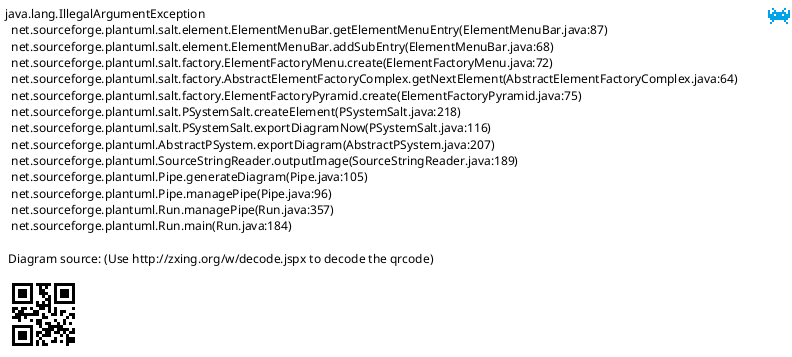
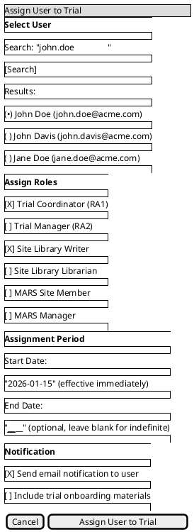
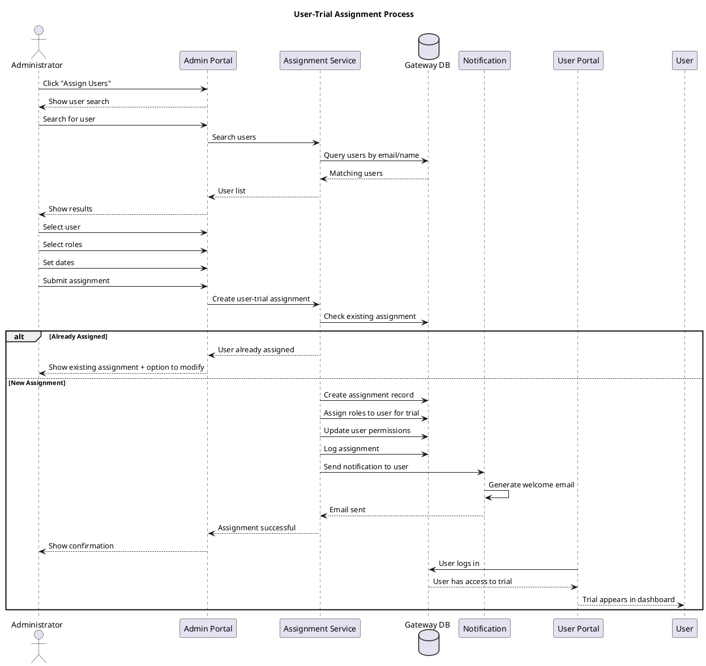

# Trial Feature Specification: User-Trial Assignment

## Overview

The User-Trial Assignment feature enables administrators to associate portal users with specific trials, controlling which trials users can access and work with in the OoBDev platform.

## User Stories

- **As an** administrator, **I want to** assign users to trials, **so that** they can access trial-specific content
- **As an** administrator, **I want to** manage user access across multiple trials, **so that** permissions are properly controlled
- **As a** user, **I want to** see only my assigned trials, **so that** I can focus on relevant work
- **As an** administrator, **I want to** remove user assignments, **so that** access can be revoked when needed

## Functional Requirements

### FR-1: Assign User to Trial
- Search for existing portal users
- Select trial to assign
- Assign user to trial with specific role(s)
- Set assignment effective date
- Optional assignment expiration date
- Assignment activated immediately
- User notified of new trial access

### FR-2: Bulk User Assignment
- Upload CSV with user emails and trial assignments
- Validate user existence
- Assign multiple users to single trial
- Assign single user to multiple trials
- Preview assignments before committing
- Summary report of successful/failed assignments

### FR-3: View User Assignments
- List all users assigned to a trial
- List all trials assigned to a user
- Filter by role, status, date range
- Sort by name, assignment date, role
- Export assignment list

### FR-4: Modify User Assignment
- Change user's role within trial
- Update assignment dates
- Add additional roles
- Remove specific roles
- Changes take effect immediately
- Modification logged in audit trail

### FR-5: Unassign User from Trial
- Remove user from trial
- Optional: Remove immediately or set end date
- Confirmation required
- User loses access to trial immediately
- User notified of access removal
- Unassignment logged in audit trail

### FR-6: Assignment Inheritance
- Users inherit trial access from site assignments
- Site members automatically assigned to trial sites belong to
- Explicit trial assignment overrides site inheritance
- Removing site assignment may remove trial access

### FR-7: Assignment Status
- Active: Currently has access
- Pending: Future start date
- Expired: Past end date
- Revoked: Manually removed
- Status affects access immediately

### FR-8: Multi-Trial Users
- Users can be assigned to multiple trials
- Trial selection dashboard for multi-trial users
- Current trial context indicator
- Switch between trials without re-login
- Last accessed trial remembered

## User Interface Specifications

### UI-1: User Assignment Manager

#### PlantUML+SALT Mockup



#### ASCII Art Version

```
┌─────────────────────────────────────────────────────────────────────────────────────┐
│ User-Trial Assignments                                                              │
│ Trial: ACME-2026-001                       [+ Assign Users]    [Bulk Import]        │
├─────────────────────────────────────────────────────────────────────────────────────┤
│                                                                                      │
│  Search Users: [_____________________________] [Search]                             │
│  Filter: [▼All Roles] [▼All Status]                                                │
│                                                                                      │
├─────────────────────────────────────────────────────────────────────────────────────┤
│                                                                                      │
│  Showing 15 assigned users                                          [Export List]   │
│                                                                                      │
│ ┌───────────────┬─────────────────────┬───────────────┬────────────┬────────┬─────┐ │
│ │ User          │ Email               │ Role(s)       │ Assigned   │ Status │Acts │ │
│ ├───────────────┼─────────────────────┼───────────────┼────────────┼────────┼─────┤ │
│ │ Sarah Johnson │ sarah.j@acme.com    │ Site Manager, │ 01/01/26   │ Active │[Ed] │ │
│ │               │                     │ Coordinator   │            │        │[Rm] │ │
│ ├───────────────┼─────────────────────┼───────────────┼────────────┼────────┼─────┤ │
│ │ Mike Smith    │ mike.s@acme.com     │ Coordinator   │ 01/05/26   │ Active │[Ed] │ │
│ │               │                     │               │            │        │[Rm] │ │
│ ├───────────────┼─────────────────────┼───────────────┼────────────┼────────┼─────┤ │
│ │ Jane Doe      │ jane.d@acme.com     │ Writer        │ 01/10/26   │ Active │[Ed] │ │
│ │               │                     │               │            │        │[Rm] │ │
│ ├───────────────┼─────────────────────┼───────────────┼────────────┼────────┼─────┤ │
│ │ Bob Wilson    │ bob.w@acme.com      │ Reviewer      │ 01/15/26   │Pending │[Ed] │ │
│ │               │                     │               │            │(02/01) │[Rm] │ │
│ ├───────────────┼─────────────────────┼───────────────┼────────────┼────────┼─────┤ │
│ │ Lisa Brown    │ lisa.b@acme.com     │ Coordinator   │ 12/15/25   │ Active │[Ed] │ │
│ │               │                     │               │            │        │[Rm] │ │
│ └───────────────┴─────────────────────┴───────────────┴────────────┴────────┴─────┘ │
│                                                                                      │
│                        [Previous]  Page 1 of 2  [Next]                              │
│                                                                                      │
└─────────────────────────────────────────────────────────────────────────────────────┘

Legend: [Ed] = Edit  [Rm] = Remove
```

### UI-2: Assign User Dialog

#### PlantUML+SALT Mockup



#### ASCII Art Version

```
┌─────────────────────────────────────────────────────────────────────────────────────┐
│ Assign User to Trial                                                                │
│ Trial: ACME-2026-001                                                                │
├─────────────────────────────────────────────────────────────────────────────────────┤
│                                                                                      │
│ ┌─ Select User ────────────────────────────────────────────────────────────────┐    │
│ │                                                                               │    │
│ │  Search: [john.doe_________________________] [Search]                        │    │
│ │                                                                               │    │
│ │  Results:                                                                     │    │
│ │  (●) John Doe (john.doe@acme.com)                                             │    │
│ │  ( ) John Davis (john.davis@acme.com)                                         │    │
│ │  ( ) Jane Doe (jane.doe@acme.com)                                             │    │
│ │                                                                               │    │
│ └───────────────────────────────────────────────────────────────────────────────┘    │
│                                                                                      │
│ ┌─ Assign Roles ───────────────────────────────────────────────────────────────┐    │
│ │                                                                               │    │
│ │  [✓] Trial Coordinator (RA1)                                                  │    │
│ │  [ ] Trial Manager (RA2)                                                      │    │
│ │  [✓] Site Library Writer                                                      │    │
│ │  [ ] Site Library Librarian                                                   │    │
│ │  [ ] MARS Site Member                                                         │    │
│ │  [ ] MARS Manager                                                             │    │
│ │                                                                               │    │
│ └───────────────────────────────────────────────────────────────────────────────┘    │
│                                                                                      │
│ ┌─ Assignment Period ──────────────────────────────────────────────────────────┐    │
│ │                                                                               │    │
│ │  Start Date: [01/15/2026 📅] (effective immediately)                         │    │
│ │  End Date:   [____________📅] (optional, leave blank for indefinite)         │    │
│ │                                                                               │    │
│ └───────────────────────────────────────────────────────────────────────────────┘    │
│                                                                                      │
│ ┌─ Notification ───────────────────────────────────────────────────────────────┐    │
│ │                                                                               │    │
│ │  [✓] Send email notification to user                                          │    │
│ │  [ ] Include trial onboarding materials                                       │    │
│ │                                                                               │    │
│ └───────────────────────────────────────────────────────────────────────────────┘    │
│                                                                                      │
│                                                                                      │
│                     [Cancel]              [Assign User to Trial]                    │
│                                                                                      │
└─────────────────────────────────────────────────────────────────────────────────────┘
```

## Process Flow



## Business Rules

### BR-1: Assignment Requirements
- User must exist in Gateway before trial assignment
- User must have at least one active role
- Assignment start date cannot be in the past (except "today")
- End date must be after start date (if specified)
- User notified within 15 minutes of assignment

### BR-2: Role Assignment
- User can have multiple roles within same trial
- Some role combinations restricted (e.g., Sponsor + Site Member)
- Minimum one role required per assignment
- Role changes take effect immediately
- Role removal may affect access to trial features

### BR-3: Multi-Trial Access
- User can be assigned to unlimited trials
- Each trial assignment has independent roles
- Trial context maintained per session
- User sees trial selector on login (if >1 trial)
- Last accessed trial remembered

### BR-4: Assignment Expiration
- Expired assignments automatically deactivate
- User loses trial access at 00:00 on expiration date (trial time zone)
- User notified 7 days before expiration
- Administrator notified of upcoming expirations
- Expired assignments can be renewed

### BR-5: Unassignment
- Confirmation required before unassignment
- Reason required for audit
- User notified immediately
- Access revoked within 1 minute
- User's trial data remains (not deleted)
- Can be re-assigned later

## Data Model

### User-Trial Assignment Entity

| Field | Type | Required | Description |
|-------|------|----------|-------------|
| AssignmentID | GUID | Yes | Unique identifier |
| UserID | GUID | Yes | Reference to Gateway user |
| TrialID | GUID | Yes | Reference to trial |
| StartDate | Date | Yes | Assignment effective date |
| EndDate | Date | No | Assignment expiration (null = indefinite) |
| Status | Enum | Yes | Active, Pending, Expired, Revoked |
| AssignedBy | GUID | Yes | Administrator who assigned |
| AssignedDate | DateTime | Yes | When assignment created |
| RevokedBy | GUID | No | Administrator who revoked |
| RevokedDate | DateTime | No | When assignment revoked |
| RevokedReason | String(500) | No | Reason for revocation |

### User-Trial-Role Entity

| Field | Type | Required | Description |
|-------|------|----------|-------------|
| UserTrialRoleID | GUID | Yes | Unique identifier |
| UserID | GUID | Yes | Reference to user |
| TrialID | GUID | Yes | Reference to trial |
| RoleID | GUID | Yes | Reference to role |
| GrantedBy | GUID | Yes | Who granted role |
| GrantedDate | DateTime | Yes | When role granted |

## Non-Functional Requirements

### NFR-1: Performance
- User search returns results within 1 second
- Assignment completes within 2 seconds
- Bulk assignment: 100 users within 30 seconds
- Access check cached (1 minute TTL)

### NFR-2: Security
- All assignments logged in audit trail
- Role changes logged with before/after values
- Unassignment requires confirmation
- Sensitive trial assignments require approval workflow (optional)

### NFR-3: Scalability
- Support 10,000+ users per trial
- Support 100+ trials per user
- Efficient database indexing
- Bulk operations optimized

## Related Documentation

- [Admin Use Cases](/current/src/docs/architecture/admin/use-cases.md) - User management
- [Trial Configuration](/current/src/docs/features/trial/configuration.md) - Trial setup
- [Trial Roles](/current/src/docs/features/trial/roles.md) - Role management

## Change History

| Version | Date | Author | Changes |
|---------|------|--------|---------|
| 1.0 | 2026-01-13 | System | Initial specification with dual-format mockups |
