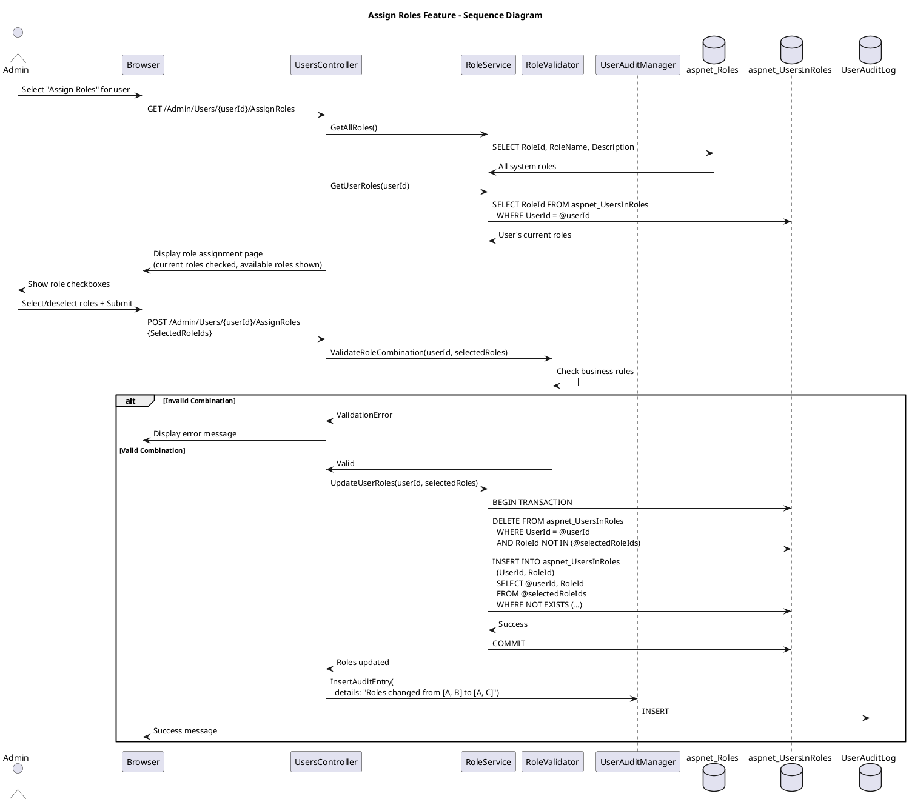

# Assign Roles Feature Specification

## Feature Overview

### Feature Name
Role Assignment and Management (RBAC)

### Description
Administrative capability for Gateway Admins to assign and manage user roles for Role-Based Access Control (RBAC). This feature provides a comprehensive interface for viewing current role assignments, adding new roles, removing existing roles, and validating role combinations. The system maintains a complete audit trail of all role changes and immediately applies permissions upon role assignment.

### Business Value
- **Access Control**: Granular control over user permissions via role assignments
- **Security**: Enforces principle of least privilege through role-based permissions
- **Flexibility**: Dynamic role assignment without code changes
- **Compliance**: Complete audit trail of permission changes per 21 CFR Part 11
- **Efficiency**: Quick role updates for changing user responsibilities
- **Multi-tenancy**: Trial-specific roles for data isolation

### Target Personas
- **Gateway Admin**: Assigns roles to trial personnel and coordinators
- **System Administrator**: Manages admin-level role assignments
- **Compliance Officer**: Reviews role assignment audit trail
- **Security Officer**: Monitors for privilege escalation patterns

### Work Item Reference
TFS Work Item #497 (tfscorp.itrica.com\ITRICA)

---

## Requirements

### Functional Requirements

**FR-001: User Selection from List**
- System MUST integrate with List Users for user selection
- System MUST display "Assign Roles" action in user actions menu
- System MUST navigate to role assignment page with user pre-selected

**FR-002: Current Roles Display**
- System MUST display all currently assigned roles for user
- System MUST show role names (friendly display names)
- System MUST show role descriptions
- System MUST indicate system-critical roles (cannot be removed)
- System MUST show when role was assigned (if tracked)

**FR-003: Available Roles Display**
- System MUST display all available roles in the system:
  - Gateway User (base user role)
  - Trial Coordinator (RA1)
  - Trial Manager (RA2)
  - Site Manager
  - Gateway Admin
  - System Admin
- System MUST show role descriptions and permissions
- System MUST indicate which roles are already assigned
- System MUST support trial-specific roles (if applicable)

**FR-004: Role Assignment**
- System MUST allow selecting multiple roles to assign
- System MUST validate role combinations (business rules)
- System MUST add roles to aspnet_UsersInRoles table
- System MUST display confirmation before assignment
- System MUST apply permissions immediately (no delay)
- Operation MUST be transactional

**FR-005: Role Removal**
- System MUST allow removing existing roles
- System MUST require at least one role remain assigned
- System MUST warn before removing admin roles
- System MUST prevent removing own admin role
- System MUST remove from aspnet_UsersInRoles table
- Removal MUST be immediate

**FR-006: Role Validation**
- System MUST validate role combinations per business rules
- System MUST prevent invalid combinations (e.g., System Admin + Trial User conflicts)
- System MUST display clear validation errors
- System MUST suggest valid alternatives

**FR-007: Audit Logging**
- System MUST log every role assignment
- System MUST log every role removal
- Audit entry MUST include:
  - Admin username
  - Target user username
  - Roles added (list)
  - Roles removed (list)
  - Previous roles state
  - New roles state
  - Timestamp
  - IP address

**FR-008: Permissions Preview**
- System SHOULD show preview of permissions user will have
- System SHOULD highlight permission changes
- System SHOULD show access areas granted by roles

**FR-009: Success Confirmation**
- System MUST display success message
- Message MUST show roles assigned/removed
- System MUST provide link back to user list
- System MUST indicate permissions now active

### Non-Functional Requirements

**NFR-001: Performance**
- Role assignment MUST complete within 2 seconds
- Permission updates MUST be immediate (no cache delays)
- Role list query MUST be optimized

**NFR-002: Security**
- Admin MUST be authorized for role assignment
- Admin CANNOT escalate own privileges (unless System Admin)
- Admin CANNOT assign System Admin role (unless System Admin)
- Privilege escalation attempts MUST be logged and blocked

**NFR-003: Reliability**
- Role assignment/removal is transactional
- Partial assignments prevented (all-or-nothing)
- System handles concurrent role updates

**NFR-004: Usability**
- Clear indication of current vs available roles
- Easy to understand role descriptions
- Visual feedback for permission changes
- Helpful validation messages

### Business Rules

**BR-001: Minimum Role Requirement**
- Every user MUST have at least one role
- Cannot remove all roles from a user
- "Gateway User" is typical minimum role

**BR-002: Role Hierarchy**
- System Admin > Gateway Admin > Trial Manager > Trial Coordinator > Gateway User
- Higher roles implicitly include lower role permissions (optional)
- Trial-specific roles isolated to trial scope

**BR-003: Invalid Role Combinations**
- May prevent conflicting roles (e.g., Admin + Regular User if separation required)
- Trial roles may be mutually exclusive
- Business logic defines valid combinations

**BR-004: Admin Role Restrictions**
- Regular admins cannot assign System Admin role
- System Admins can assign any role
- Admins cannot remove their own admin role
- Admins cannot elevate own privileges

**BR-005: Role Assignment Takes Effect Immediately**
- No user re-login required for role changes
- Permissions checked on each request
- Session cache refreshed on role change

**BR-006: Audit Trail Requirements**
- Every role change logged with before/after state
- Both assignments and removals tracked
- Admin identity always captured

### Compliance Requirements

**COMP-001: 21 CFR Part 11 - Access Control**
- System MUST limit system access to authorized individuals
- Role assignments MUST be traceable to administrators
- Audit trail MUST record all permission changes

**COMP-002: Principle of Least Privilege**
- Users granted minimum necessary permissions
- Role assignments justified and documented
- Regular review of role assignments recommended

---

## User Stories

### Story 1: Assign New Role to User
```gherkin
Given I am a Gateway Admin
  And user "jsmith" currently has roles: ["Gateway User"]
When I navigate to assign roles for "jsmith"
Then I should see current roles: "Gateway User"
  And I should see available roles: "Trial Coordinator", "Trial Manager", "Gateway Admin"
When I select "Trial Coordinator" to add
  And I click "Save Role Changes"
Then the system should validate the role combination
  And add "Trial Coordinator" to jsmith's roles
  And I should see success message: "Roles updated successfully for user 'jsmith'"
  And jsmith should now have roles: ["Gateway User", "Trial Coordinator"]
  And permissions should take effect immediately
  And an audit log entry should record:
    | AdminUsername  | my_admin_username       |
    | TargetUsername | jsmith                  |
    | RolesAdded     | Trial Coordinator       |
    | RolesRemoved   |                         |
    | PreviousRoles  | Gateway User            |
    | NewRoles       | Gateway User, Trial Coordinator |
```

### Story 2: Remove Existing Role
```gherkin
Given user "jdoe" has roles: ["Gateway User", "Trial Coordinator", "Trial Manager"]
When I navigate to assign roles for "jdoe"
  And I deselect "Trial Manager" role
  And I click "Save Role Changes"
Then the system should remove "Trial Manager" from jdoe's roles
  And jdoe should now have roles: ["Gateway User", "Trial Coordinator"]
  And an audit entry should log the removal
```

### Story 3: Prevent Removing Last Role
```gherkin
Given user "jsmith" has only one role: "Gateway User"
When I attempt to remove "Gateway User"
  And I click "Save Role Changes"
Then I should see error: "User must have at least one role. Cannot remove all roles."
  And no changes should be made
  And the role should remain assigned
```

### Story 4: Prevent Admin Removing Own Admin Role
```gherkin
Given I am logged in as "admin1"
  And my roles include "Gateway Admin"
When I navigate to assign roles for myself ("admin1")
  And I attempt to deselect "Gateway Admin"
  And I click "Save Role Changes"
Then I should see error: "You cannot remove your own admin role"
  And the "Gateway Admin" checkbox should be disabled
  And no changes should be made
```

### Story 5: Invalid Role Combination
```gherkin
Given the system prevents "System Admin" + "Trial User" combination
  And user "jsmith" has role "Trial User"
When I attempt to add "System Admin" role
  And I click "Save Role Changes"
Then I should see validation error: "Invalid role combination: System Admin cannot be combined with Trial User"
  And suggested alternatives should be displayed
  And no changes should be made
```

### Story 6: Assign Multiple Roles Simultaneously
```gherkin
Given user "newuser" has only "Gateway User" role
When I navigate to assign roles for "newuser"
  And I select both "Trial Coordinator" and "Site Manager"
  And I click "Save Role Changes"
Then both roles should be added simultaneously
  And newuser should have roles: ["Gateway User", "Trial Coordinator", "Site Manager"]
  And audit log should record both additions in one entry
```

---

## Design

### Architecture Diagram

```plantuml
@startuml Assign Roles Architecture
!include https://raw.githubusercontent.com/plantuml-stdlib/C4-PlantUML/master/C4_Component.puml

title Assign Roles Feature - Component Diagram

Container_Boundary(web, "Web Application") {
    Component(controller, "UsersController", "ASP.NET MVC Controller", "Handles role assignment")
    Component(view, "AssignRoles View", "Razor View", "Role selection interface")
    Component(roleService, "RoleService", "Service Layer", "Role management logic")
    Component(validator, "RoleValidator", "Business Logic", "Validates role combinations")
}

Container_Boundary(business, "Business Layer") {
    Component(auditMgr, "UserAuditManager", "Audit Manager", "Logs role changes")
    Component(authz, "AuthorizationService", "Authorization", "Permission checks")
}

Container_Boundary(data, "Data Layer") {
    ComponentDb(roles, "aspnet_Roles", "SQL Server", "Available roles")
    ComponentDb(userRoles, "aspnet_UsersInRoles", "SQL Server", "User role assignments")
    ComponentDb(users, "aspnet_Users", "SQL Server", "User identities")
    ComponentDb(auditDb, "UserAuditLog", "SQL Server", "Audit trail")
}

Rel(controller, view, "Renders")
Rel(controller, roleService, "GetUserRoles, AssignRoles")
Rel(controller, validator, "ValidateRoleCombination")
Rel(controller, authz, "CanAssignRole")
Rel(controller, auditMgr, "InsertAuditEntry")
Rel(roleService, roles, "SELECT all roles")
Rel(roleService, userRoles, "SELECT user roles, INSERT/DELETE")
Rel(validator, userRoles, "Check business rules")
Rel(auditMgr, auditDb, "INSERT audit records")

@enduml
```

#### ASCII Diagram

```
┌────────────────────────────────────────────────────────────────────┐
│         Assign Roles Feature - Component Architecture              │
└────────────────────────────────────────────────────────────────────┘

┌──────────────────────────────────────────────────────────────────────┐
│  Web Application Layer                                              │
│                                                                      │
│  ┌────────────────────┐           ┌──────────────────────────────┐  │
│  │  AssignRoles View  │◄──renders──│  UsersController             │  │
│  │  (Razor)           │            │  (MVC Controller)            │  │
│  │                    │            │                              │  │
│  │  - Current roles   │            │  - GET /AssignRoles          │  │
│  │    (checked)       │──submits───►│  - POST /AssignRoles        │  │
│  │  - Available roles │            │  - Validate role combo       │  │
│  │    (unchecked)     │            │  - Update role assignments   │  │
│  │  - Role checkboxes │            │  - Log audit                 │  │
│  └────────────────────┘            └──┬────────┬──────────┬────────┘  │
└───────────────────────────────────────┼────────┼──────────┼───────────┘
                                        │        │          │
                                        ▼        ▼          ▼
┌───────────────────────────────────────────────────────────────────────┐
│  Business Layer                                                       │
│                                                                       │
│  ┌──────────────────────────┐  ┌──────────────────────────────────┐  │
│  │ RoleService              │  │ RoleValidator                    │  │
│  │                          │  │                                  │  │
│  │  - GetAllRoles()         │  │  - ValidateRoleCombination()     │  │
│  │  - GetUserRoles()        │  │  - Check business rules          │  │
│  │  - UpdateUserRoles()     │  │  - Prevent invalid combos        │  │
│  │  - Add/Remove roles      │  │  - Require minimum roles         │  │
│  └──────────────────────────┘  └──────────────────────────────────┘  │
│                                                                       │
│  ┌──────────────────────────┐  ┌──────────────────────────────────┐  │
│  │ AuthorizationService     │  │ UserAuditManager                 │  │
│  │                          │  │                                  │  │
│  │  - CanAssignRole()       │  │  - InsertAuditEntry()            │  │
│  │  - Check admin perms     │  │  - Log role changes              │  │
│  │  - Prevent self-escalate │  │  - Before/after states           │  │
│  └──────────────────────────┘  └──────────────────────────────────┘  │
└─────────────────────────────────────────────────────────────────────┘
                  │                              │
                  ▼                              ▼
┌───────────────────────────────────────────────────────────────────────┐
│  Data Layer (SQL Server)                                             │
│                                                                       │
│  ┌──────────────────────────┐  ┌──────────────────────────────────┐  │
│  │ aspnet_Roles             │  │ aspnet_UsersInRoles              │  │
│  ├──────────────────────────┤  ├──────────────────────────────────┤  │
│  │  RoleId (PK)             │  │  UserId (PK, FK)                 │  │
│  │  RoleName                │  │  RoleId (PK, FK)                 │  │
│  │  LoweredRoleName         │  │                                  │  │
│  │  Description             │  │  Composite PK on (UserId,        │  │
│  └──────────────────────────┘  │  RoleId) ensures no duplicates   │  │
│                                 └──────────────────────────────────┘  │
│  ┌──────────────────────────┐                                         │
│  │ aspnet_Users             │  ┌──────────────────────────────────┐  │
│  ├──────────────────────────┤  │ UserAuditLog                     │  │
│  │  UserId (PK)             │  ├──────────────────────────────────┤  │
│  │  UserName                │  │  UserAuditLogID (PK)             │  │
│  └──────────────────────────┘  │  UserAspNetID (admin)            │  │
│                                 │  Details (role changes)          │  │
│                                 │  "Roles changed from [A,B]       │  │
│                                 │   to [A,C] for user X"           │  │
│                                 └──────────────────────────────────┘  │
└───────────────────────────────────────────────────────────────────────┘

Flow:
  1. Admin selects "Assign Roles" from user actions menu
  2. RoleService.GetAllRoles() loads all system roles
  3. RoleService.GetUserRoles(userId) loads user's current roles
  4. View displays checkboxes (current roles checked)
  5. Admin selects/deselects roles and submits
  6. RoleValidator.ValidateRoleCombination() checks:
     - At least one role selected
     - No invalid role combinations (business rules)
     - Admin can't remove own admin role
     - Privilege escalation prevention
  7. If valid:
     - DELETE removed roles from aspnet_UsersInRoles
     - INSERT new roles into aspnet_UsersInRoles
     - Transaction ensures all-or-nothing update
  8. UserAuditManager logs change (before/after state)
  9. Success message displayed to admin

Key Features:
  • Role assignments take effect immediately
  • Composite PK prevents duplicate role assignments
  • Validation prevents removing all roles
  • Audit trail captures before/after role state
  • Admin cannot escalate own privileges
```

### Workflow Diagram



#### ASCII Diagram

```
Assign Roles Feature - Sequence Diagram

Admin    Browser    Controller    RoleService    Validator    AuditMgr    DB
  │          │            │             │            │            │         │
  ├─Select───►            │             │            │            │         │
  │ Assign   │            │             │            │            │         │
  │ Roles    │            │             │            │            │         │
  │          ├──GET───────►             │            │            │         │
  │          │ /AssignRoles             │            │            │         │
  │          │            │             │            │            │         │
  │          │            ├─GetAllRoles─►            │            │         │
  │          │            │             ├─SELECT─────────────────────────────►
  │          │            │             │ aspnet_Roles          │         │
  │          │            │             │◄─All system roles────────────────┤
  │          │            │◄─Role list──┤            │            │         │
  │          │            │             │            │            │         │
  │          │            ├─GetUserRoles(userId)     │            │         │
  │          │            │             ├─SELECT─────────────────────────────►
  │          │            │             │ aspnet_UsersInRoles   │         │
  │          │            │             │ WHERE UserId=@userId  │         │
  │          │            │             │◄─User's current roles────────────┤
  │          │            │◄─Current────┤            │            │         │
  │          │            │             │            │            │         │
  │          │◄─Form──────┤             │            │            │         │
  │          │ (checkboxes)            │            │            │         │
  │◄─Display─┤            │             │            │            │         │
  │          │            │             │            │            │         │
  ├─Select───►            │             │            │            │         │
  │ Roles +  │            │             │            │            │         │
  │ Submit   │            │             │            │            │         │
  │          ├──POST──────►             │            │            │         │
  │          │ {selected  │             │            │            │         │
  │          │  RoleIds}  │             │            │            │         │
  │          │            │             │            │            │         │
  │          │            ├─ValidateRoleCombination──►            │         │
  │          │            │             │            │            │         │
  │          │            │             │            ├─Check──────────────┐
  │          │            │             │            │ - At least 1 role  │
  │          │            │             │            │ - No invalid combo │
  │          │            │             │            │ - Not removing own │
  │          │            │             │            │   admin role       │
  │          │            │             │            │◄───────────────────┘
  │          │            │             │            │            │         │
  │          │        ┌───┴─────────────┴────────────┴────────────┴─────┐   │
  │          │        │ IF Invalid                              │   │
  │          │        └───┬─────────────┬────────────┬────────────┬─────┘   │
  │          │            │◄─Invalid────┤            │            │         │
  │          │◄─Error─────┤             │            │            │         │
  │◄─Display─┤            │             │            │            │         │
  │          │            │             │            │            │         │
  │          │        ┌───┴─────────────┴────────────┴────────────┴─────┐   │
  │          │        │ ELSE Valid                              │   │
  │          │        └───┬─────────────┬────────────┬────────────┬─────┘   │
  │          │            │◄─Valid──────┤            │            │         │
  │          │            │             │            │            │         │
  │          │            ├─UpdateUserRoles(userId, selectedRoles)         │
  │          │            │             │            │            │         │
  │          │            │             ├─BEGIN TRANSACTION───────────────────►
  │          │            │             │            │            │         │
  │          │            │             ├─DELETE─────────────────────────────►
  │          │            │             │ FROM aspnet_UsersInRoles         │
  │          │            │             │ WHERE UserId=@userId  │         │
  │          │            │             │ AND RoleId NOT IN     │         │
  │          │            │             │ (@selectedRoleIds)    │         │
  │          │            │             │            │            │         │
  │          │            │             ├─INSERT─────────────────────────────►
  │          │            │             │ INTO aspnet_UsersInRoles         │
  │          │            │             │ (UserId, RoleId)      │         │
  │          │            │             │ SELECT @userId, RoleId│         │
  │          │            │             │ FROM @selectedRoleIds │         │
  │          │            │             │ WHERE NOT EXISTS...   │         │
  │          │            │             │            │            │         │
  │          │            │             ├─COMMIT TRANSACTION──────────────────►
  │          │            │◄─Success────┤            │            │         │
  │          │            │             │            │            │         │
  │          │            ├─────────────────InsertAuditEntry──────►         │
  │          │            │             │            │            │         │
  │          │            │             │   "Roles changed from [A,B] to   │
  │          │            │             │    [A,C] for user X by admin Y"  │
  │          │            │             │            │            ├─INSERT──►
  │          │            │             │            │            │         │
  │          │◄─Success───┤             │            │            │         │
  │◄─Display─┤            │             │            │            │         │
  │          │            │             │            │            │         │

Key Operations:
  1. Admin navigates to Assign Roles for selected user
  2. Load all available roles from aspnet_Roles
  3. Load user's current roles from aspnet_UsersInRoles
  4. Display form with checkboxes (current roles checked)
  5. Admin selects/deselects roles and submits
  6. Validate role combination:
     - At least one role must remain
     - No invalid combinations (e.g., SystemAdmin + TrialUser)
     - Cannot remove own admin role
  7. If invalid: display error, stop
  8. If valid:
     - BEGIN TRANSACTION
     - DELETE roles not in selected list
     - INSERT new roles not already assigned
     - COMMIT TRANSACTION (all-or-nothing)
  9. Log audit entry with before/after role state
  10. Display success message

Validation Rules:
  • Minimum 1 role required (prevent lockout)
  • Admin cannot remove own admin role (prevent self-lockout)
  • Invalid role combinations blocked (business rules)
  • System Admin role requires elevated permissions to assign
```

### Data Model

**aspnet_Roles Table**
```sql
CREATE TABLE aspnet_Roles (
    ApplicationId uniqueidentifier NOT NULL,
    RoleId uniqueidentifier PRIMARY KEY,
    RoleName nvarchar(256) NOT NULL,
    LoweredRoleName nvarchar(256) NOT NULL,
    Description nvarchar(max) NULL
);

-- Example roles
INSERT INTO aspnet_Roles VALUES
  (app_guid, guid1, 'Gateway User', 'gateway user', 'Base user role with read access'),
  (app_guid, guid2, 'Trial Coordinator', 'trial coordinator', 'RA1 - Coordinator role for trial data entry'),
  (app_guid, guid3, 'Trial Manager', 'trial manager', 'RA2 - Manager role with approval authority'),
  (app_guid, guid4, 'Gateway Admin', 'gateway admin', 'Administrative access to user management');
```

**aspnet_UsersInRoles Table**
```sql
CREATE TABLE aspnet_UsersInRoles (
    UserId uniqueidentifier NOT NULL,
    RoleId uniqueidentifier NOT NULL,
    PRIMARY KEY (UserId, RoleId),
    FOREIGN KEY (UserId) REFERENCES aspnet_Users(UserId),
    FOREIGN KEY (RoleId) REFERENCES aspnet_Roles(RoleId)
);

-- Example assignments
INSERT INTO aspnet_UsersInRoles VALUES
  (user_jsmith_guid, gateway_user_role_guid),
  (user_jsmith_guid, trial_coordinator_role_guid);
```

### API Contracts

#### Endpoint: POST /Admin/Users/{userId}/AssignRoles

**Request**:
```http
POST /Admin/Users/a1b2c3d4.../AssignRoles HTTP/1.1
Content-Type: application/x-www-form-urlencoded

SelectedRoleIds=guid1&SelectedRoleIds=guid2&SelectedRoleIds=guid3
```

**Request Model**:
```csharp
public class AssignRolesViewModel
{
    public Guid UserId { get; set; }
    public string UserName { get; set; }
    public List<RoleCheckboxViewModel> AvailableRoles { get; set; }
    public List<Guid> SelectedRoleIds { get; set; }
}

public class RoleCheckboxViewModel
{
    public Guid RoleId { get; set; }
    public string RoleName { get; set; }
    public string Description { get; set; }
    public bool IsAssigned { get; set; }
    public bool IsDisabled { get; set; } // e.g., can't remove own admin role
}
```

**Response - Success**: 302 Redirect
```http
Location: /Admin/Users
TempData: "Roles updated successfully for user 'jsmith'"
```

---

## Implementation Details

### Code Patterns

**Pattern: Role Assignment with Validation**
```csharp
[HttpPost]
[TrialRole("Administrators")]
public ActionResult AssignRoles(Guid userId, List<Guid> selectedRoleIds)
{
    var user = Membership.GetUser(userId);
    if (user == null)
        return HttpNotFound();

    // Get current roles
    var currentRoles = Roles.GetRolesForUser(user.UserName);

    // Validate cannot remove all roles
    if (selectedRoleIds == null || selectedRoleIds.Count == 0)
    {
        ModelState.AddModelError("", "User must have at least one role");
        return View(BuildViewModel(userId));
    }

    // Validate cannot remove own admin role
    var currentUserId = (Guid)Membership.GetUser().ProviderUserKey;
    if (userId == currentUserId)
    {
        var adminRole = Roles.FindRole("Administrators");
        if (currentRoles.Contains("Administrators") && !selectedRoleIds.Contains(adminRole.Id))
        {
            ModelState.AddModelError("", "You cannot remove your own admin role");
            return View(BuildViewModel(userId));
        }
    }

    // Validate role combination
    var validationResult = roleValidator.ValidateRoleCombination(selectedRoleIds);
    if (!validationResult.IsValid)
    {
        ModelState.AddModelError("", validationResult.ErrorMessage);
        return View(BuildViewModel(userId));
    }

    // Get selected role names
    var selectedRoles = Roles.GetRolesByIds(selectedRoleIds);

    // Remove all current roles
    if (currentRoles.Length > 0)
        Roles.RemoveUserFromRoles(user.UserName, currentRoles);

    // Add selected roles
    Roles.AddUserToRoles(user.UserName, selectedRoles.Select(r => r.Name).ToArray());

    // Audit log
    auditManager.InsertAuditEntry(
        "Admin.UsersController",
        "AssignRoles",
        User.Identity.Name,
        Request.UserHostAddress,
        UserAuditActions.UserManagement,
        UserAuditDetails.Roles_Assigned,
        details: $"Roles changed for {user.UserName}: " +
                 $"Previous: [{string.Join(", ", currentRoles)}], " +
                 $"New: [{string.Join(", ", selectedRoles.Select(r => r.Name))}]"
    );

    TempData["SuccessMessage"] = $"Roles updated successfully for '{user.UserName}'";
    return RedirectToAction("Index");
}
```

**Pattern: Role Validation Business Rules**
```csharp
public class RoleValidator
{
    public ValidationResult ValidateRoleCombination(List<Guid> roleIds)
    {
        var roles = GetRolesByIds(roleIds);

        // Rule: System Admin cannot be combined with regular user roles
        if (roles.Any(r => r.Name == "SystemAdmin") &&
            roles.Any(r => r.Name == "TrialUser"))
        {
            return new ValidationResult
            {
                IsValid = false,
                ErrorMessage = "System Admin role cannot be combined with Trial User role. " +
                              "System Admins should not have trial-specific roles."
            };
        }

        // Rule: Trial roles may require Gateway User base role
        var trialRoles = new[] { "TrialCoordinator", "TrialManager", "SiteManager" };
        if (roles.Any(r => trialRoles.Contains(r.Name)) &&
            !roles.Any(r => r.Name == "GatewayUser"))
        {
            return new ValidationResult
            {
                IsValid = false,
                ErrorMessage = "Trial roles require Gateway User base role. " +
                              "Please select Gateway User role as well."
            };
        }

        return new ValidationResult { IsValid = true };
    }
}
```

---

## Acceptance Criteria

**AC-001**: Current roles displayed correctly
- All assigned roles shown and checked
- Unassigned roles shown unchecked
- Role descriptions displayed

**AC-002**: Role assignment successful
- Selected roles added to aspnet_UsersInRoles
- Permissions take effect immediately
- Database update is transactional

**AC-003**: Role removal successful
- Deselected roles removed from aspnet_UsersInRoles
- Cannot remove all roles (validation error)
- Permissions updated immediately

**AC-004**: Validation enforced
- Invalid combinations rejected with clear message
- Cannot remove own admin role
- At least one role required

**AC-005**: Audit trail complete
- Role changes logged with before/after state
- Both additions and removals tracked
- Admin identity captured

**AC-006**: Authorization enforced
- Only authorized admins can assign roles
- System Admin required for System Admin role assignment
- Privilege escalation prevented

---

## Related Documentation

- [List Users Feature Specification](./list-users.md)
- [Create User Feature Specification](./create-user.md)
- [Admin Use Cases](/current/src/docs/architecture/admin/use-cases.md)
- [Code Review - Authorization Patterns](/current/src/docs/architecture/CODE_REVIEW.md)

---

**Document Version**: 1.0
**Last Updated**: January 2026
**Status**: Implementation-Ready
**Compliance**: 21 CFR Part 11, GCP
