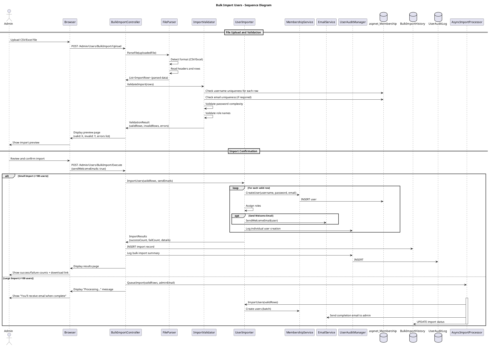

# Bulk Import Users Feature Specification

## Feature Overview

### Feature Name
Bulk User Import (CSV/Excel)

### Description
Administrative capability for Gateway Admins to import multiple user accounts simultaneously from CSV or Excel files. This feature streamlines the onboarding process for clinical trials by allowing batch creation of user accounts with role assignments, validates all data before import, provides detailed import results with success/failure reporting, and maintains comprehensive audit trails. The system handles large imports asynchronously and sends summary notifications upon completion.

### Business Value
- **Efficiency**: Rapid onboarding of multiple trial participants and staff
- **Accuracy**: Template-based data entry reduces manual input errors
- **Scalability**: Supports hundreds of users in a single operation
- **Transparency**: Detailed results showing which users succeeded/failed and why
- **Time Savings**: Eliminates repetitive manual user creation for large trials
- **Audit Trail**: Complete tracking of bulk operations for compliance

### Target Personas
- **Gateway Admin**: Imports trial staff and coordinators during trial setup
- **System Administrator**: Performs large-scale user provisioning
- **Trial Manager**: Onboards multiple site coordinators
- **Data Manager**: Imports user lists from external systems

---

## Requirements

### Functional Requirements

**FR-001: File Upload Interface**
- System MUST provide file upload interface
- System MUST support CSV (.csv) file format
- System MUST support Excel (.xlsx, .xls) file formats
- System MUST provide downloadable import template
- System MUST display file format requirements and instructions
- System MUST validate file size (max 10MB)
- System MUST validate file type by extension and content

**FR-002: Import Template**
- System MUST provide downloadable template file
- Template MUST include:
  - Required columns: Username/Email, First Name, Last Name, Email, Password, Role(s)
  - Optional columns: Phone, Trial Assignment, Site Assignment, Organization
  - Header row with column names
  - Sample data rows (with instructions to delete)
  - Data format examples
- Template MUST be available in both CSV and Excel formats

**FR-003: File Format Validation**
- System MUST validate file has required columns
- System MUST validate column headers match template
- System MUST validate file contains at least one data row
- System MUST validate maximum 1000 users per file
- System MUST display clear error if format invalid

**FR-004: Data Validation (Pre-Import)**
- System MUST validate EACH row before import:
  - Username: Required, max 256 chars, unique, valid format
  - First Name: Required, max 128 chars
  - Last Name: Required, max 128 chars
  - Email: Required, valid format, unique (if configured), max 256 chars
  - Password: Required, meets complexity requirements
  - Roles: Valid role names, role exists in system
  - Phone: Optional, valid phone format if provided
- System MUST check username uniqueness against existing users
- System MUST check email uniqueness (if requiresUniqueEmail=true)
- System MUST display preview with validation results

**FR-005: Import Preview**
- System MUST display preview of import before execution
- Preview MUST show:
  - Total rows in file
  - Number of valid rows (ready to import)
  - Number of invalid rows with error details
  - Summary statistics (by role, by trial, etc.)
  - Validation errors with row numbers
- Admin MUST confirm preview before import execution
- Admin MAY cancel and fix file

**FR-006: Import Execution**
- System MUST create users for all VALID rows
- System MUST skip invalid rows (partial import allowed)
- System MUST hash passwords before storage
- System MUST assign specified roles
- System MUST set IsApproved=true by default
- System MUST set IsLockedOut=false
- For large imports (>100 users), system SHOULD process asynchronously
- System MUST generate unique UserId (GUID) for each user

**FR-007: Welcome Email (Optional)**
- System MAY send welcome emails to imported users
- Setting configurable: "Send welcome emails" checkbox
- Email MUST include username and initial password
- Failed emails logged but do not block import
- Emails sent asynchronously to avoid timeout

**FR-008: Import Results**
- System MUST display detailed results page:
  - Total rows processed
  - Successful user creations (count and list)
  - Failed rows (count, row numbers, error details)
  - Warnings (duplicate emails, role assignment issues)
  - Download link for detailed results CSV
- System MUST provide downloadable results file:
  - Original row data
  - Import status (Success/Failed)
  - Error message (if failed)
  - Created UserId (if success)

**FR-009: Comprehensive Audit Logging**
- System MUST log bulk import operation
- Audit entry MUST include:
  - Admin username
  - Filename uploaded
  - Total rows, successful count, failed count
  - Timestamp
  - IP address
  - Import results summary
- System MUST log individual user creation for each imported user
- Failed rows logged with failure reasons

**FR-010: Async Processing (Large Imports)**
- For imports >100 users, system MUST process asynchronously
- System MUST display progress indicator during processing
- System MAY send email to admin when complete
- Admin MAY navigate away during processing
- Results available via import history

**FR-011: Import History**
- System SHOULD maintain history of import operations
- History MUST show:
  - Import date/time
  - Admin who performed import
  - Filename
  - Success/failure counts
  - Link to download results
- History retained for 90 days (configurable)

### Non-Functional Requirements

**NFR-001: Performance**
- File upload MUST complete within 30 seconds (10MB max)
- Validation MUST complete within 10 seconds for 1000 rows
- Synchronous import MUST complete within 60 seconds for <100 users
- Asynchronous import MUST process 1000 users within 10 minutes

**NFR-002: Security**
- Admin MUST be authenticated and authorized
- Admin MUST have "Bulk Import Users" permission
- Uploaded files MUST be virus scanned (optional)
- Passwords in file MUST be transmitted over HTTPS only
- Uploaded files deleted after processing (security)
- Import operations logged in audit trail

**NFR-003: Reliability**
- Import MUST be transactional per user (individual failures don't block others)
- Partial imports allowed (valid users created, invalid users skipped)
- System MUST handle duplicate usernames gracefully
- System MUST recover from email delivery failures

**NFR-004: Usability**
- Template clearly labeled and easy to download
- Validation errors clear and actionable (row numbers, specific issues)
- Preview easy to understand
- Results downloadable for record-keeping
- Helpful error messages guide admin to fix issues

**NFR-005: Scalability**
- System MUST support 1000 users per import
- System MUST handle multiple concurrent imports (different admins)
- Async processing prevents timeout for large files

### Business Rules

**BR-001: File Size and Row Limits**
- Maximum file size: 10MB
- Maximum rows per import: 1000 users
- Minimum rows: 1 user
- Exceeding limits displays clear error with current limits

**BR-002: Validation Strategy**
- Validate all rows before importing ANY users
- Invalid rows do NOT block valid rows from importing
- Partial imports allowed (best-effort approach)
- Admin notified of all failures with details

**BR-003: Password Handling**
- Passwords in file hashed before storage
- Same password complexity rules as manual user creation
- Passwords NOT logged in audit trail
- Welcome emails contain plain text passwords (if sent)
- Admin advised to require password change on first login

**BR-004: Role Assignment**
- Roles column accepts comma-separated role names
- Invalid role names cause row to fail
- Users created with specified roles immediately
- If no role specified, defaults to "Gateway User"

**BR-005: Duplicate Handling**
- Duplicate usernames: row fails with error
- Duplicate emails (if requiresUniqueEmail=true): row fails
- Duplicates within file detected in validation
- Duplicates against existing users detected

**BR-006: Email Delivery**
- Welcome emails optional (admin checkbox)
- Email failures logged but don't block import
- Failed emails queued for retry
- Import results indicate email status per user

**BR-007: Audit Trail Requirements**
- Bulk import operation logged as single entry
- Each created user logged individually
- Failed rows logged with reasons
- Audit trail includes filename and row counts

### Compliance Requirements

**COMP-001: 21 CFR Part 11 - Audit Trail**
- System MUST log all bulk import operations
- Audit trail MUST include admin identity, timestamp, results
- Individual user creation audited
- Audit records immutable

**COMP-002: Data Privacy**
- Uploaded files contain sensitive data (passwords, emails)
- Files MUST be deleted after processing
- Files stored encrypted during processing (if temp storage)
- Import results protected (admin-only access)

---

## User Stories

### Story 1: Successful Bulk Import
```gherkin
Given I am a Gateway Admin with bulk import permissions
When I navigate to /Admin/Users/BulkImport
Then I should see file upload interface
  And I should see link to download template
When I download the template
Then I receive a CSV file with required columns and sample data
When I fill the template with 10 new users:
    | Username | Email            | First Name | Last Name | Password      | Roles                    |
    | user1    | user1@example.com| User       | One       | Pass123!      | Gateway User             |
    | user2    | user2@example.com| User       | Two       | Pass456!      | Gateway User, Trial Coordinator |
    | ...      | ...              | ...        | ...       | ...           | ...                      |
  And I upload the file
Then the system should validate the file format
  And display preview showing:
    | Total Rows | Valid Rows | Invalid Rows |
    | 10         | 10         | 0            |
When I check "Send welcome emails"
  And I click "Confirm Import"
Then the system should create 10 user accounts
  And assign specified roles
  And send 10 welcome emails
  And display results:
    | Successfully Created | Failed | Emails Sent |
    | 10                   | 0      | 10          |
  And provide download link for detailed results CSV
  And log bulk import audit entry
```

### Story 2: Partial Import with Validation Errors
```gherkin
Given I upload a file with 20 rows
  And 3 rows have duplicate usernames
  And 2 rows have invalid email format
  And 15 rows are valid
When the system validates the file
Then I should see preview:
    | Total | Valid | Invalid |
    | 20    | 15    | 5       |
  And I should see error details:
    | Row | Error                                    |
    | 3   | Duplicate username 'jsmith'              |
    | 7   | Duplicate username 'jdoe'                |
    | 12  | Duplicate username 'asmith'              |
    | 15  | Invalid email format 'badEmail'          |
    | 18  | Invalid email format 'another@'          |
When I click "Confirm Import" (import valid rows only)
Then 15 users should be created successfully
  And 5 rows should be skipped
  And results CSV should detail each success/failure
  And audit log should record: "15 created, 5 failed"
```

### Story 3: Large Async Import
```gherkin
Given I upload a file with 500 users
When the system validates the file
  And all 500 rows are valid
  And I confirm import
Then the system should process asynchronously
  And display message: "Import processing... You will receive an email when complete."
  And I should be able to navigate away
  And a background job should process the import
When the import completes (after ~5 minutes)
Then I should receive email: "Bulk import completed: 500 users created"
  And import results should be available in import history
  And I can download detailed results CSV
```

### Story 4: Duplicate Detection
```gherkin
Given existing user "jsmith" in the database
When I upload file containing row with username "jsmith"
Then the validation should detect:
    | Row | Error                                           |
    | 5   | Username 'jsmith' already exists in the system  |
  And the preview should mark row 5 as invalid
  And if I proceed, row 5 should be skipped
  And other valid rows should be imported
```

### Story 5: Invalid Role Names
```gherkin
Given I upload file with row containing Role "NonExistentRole"
When the system validates
Then I should see error:
    | Row | Error                                      |
    | 8   | Invalid role name 'NonExistentRole'        |
  And the row should be marked invalid
  And valid role names should be suggested
```

---

## Design

### Architecture Diagram

```plantuml
@startuml Bulk Import Architecture
!include https://raw.githubusercontent.com/plantuml-stdlib/C4-PlantUML/master/C4_Component.puml

title Bulk Import Users Feature - Component Diagram

Container_Boundary(web, "Web Application") {
    Component(controller, "BulkImportController", "ASP.NET MVC Controller", "Handles file upload and import")
    Component(view, "Import Views", "Razor Views", "Upload, preview, results")
    Component(parser, "FileParser", "Service", "Parses CSV/Excel files")
    Component(validator, "ImportValidator", "Service", "Validates import data")
    Component(importer, "UserImporter", "Service", "Creates users in bulk")
    Component(email, "EmailService", "Service", "Sends welcome emails")
}

Container_Boundary(business, "Business Layer") {
    Component(auditMgr, "UserAuditManager", "Audit Manager", "Logs import operations")
    Component(membership, "MembershipService", "Service", "User creation")
    Component(asyncProcessor, "AsyncImportProcessor", "Background Job", "Processes large imports")
}

Container_Boundary(data, "Data Layer") {
    ComponentDb(users, "aspnet_Users", "SQL Server", "User accounts")
    ComponentDb(membershipDb, "aspnet_Membership", "SQL Server", "User credentials")
    ComponentDb(roles, "aspnet_UsersInRoles", "SQL Server", "Role assignments")
    ComponentDb(auditDb, "UserAuditLog", "SQL Server", "Audit trail")
    ComponentDb(importHistory, "BulkImportHistory", "SQL Server", "Import operation history")
}

Rel(controller, view, "Renders")
Rel(controller, parser, "ParseFile")
Rel(controller, validator, "ValidateRows")
Rel(controller, importer, "ImportUsers")
Rel(importer, membership, "CreateUser")
Rel(importer, email, "SendWelcomeEmails")
Rel(controller, asyncProcessor, "QueueLargeImport")
Rel(asyncProcessor, importer, "ProcessImport")
Rel(importer, users, "INSERT")
Rel(importer, membershipDb, "INSERT")
Rel(importer, roles, "INSERT")
Rel(controller, auditMgr, "LogBulkImport")
Rel(auditMgr, auditDb, "INSERT")
Rel(controller, importHistory, "INSERT import record")

@enduml
```

#### ASCII Diagram

```
┌────────────────────────────────────────────────────────────────────┐
│        Bulk Import Users Feature - Component Architecture          │
└────────────────────────────────────────────────────────────────────┘

┌──────────────────────────────────────────────────────────────────────┐
│  Web Application Layer                                              │
│                                                                      │
│  ┌────────────────────┐           ┌──────────────────────────────┐  │
│  │  Import Views      │◄──renders──│  BulkImportController        │  │
│  │  (Razor)           │            │  (MVC Controller)            │  │
│  │                    │            │                              │  │
│  │  - File upload     │            │  - POST /Upload              │  │
│  │  - Preview page    │──uploads───►│  - POST /Execute            │  │
│  │  - Results page    │            │  - Validate CSV/Excel        │  │
│  │  - Download        │            │  - Queue large imports       │  │
│  │    template        │            │  - Show results              │  │
│  └────────────────────┘            └──┬────────┬──────────┬────────┘  │
└───────────────────────────────────────┼────────┼──────────┼───────────┘
                                        │        │          │
                                        ▼        ▼          ▼
┌───────────────────────────────────────────────────────────────────────┐
│  Business Layer                                                       │
│                                                                       │
│  ┌──────────────────────────┐  ┌──────────────────────────────────┐  │
│  │ FileParser               │  │ ImportValidator                  │  │
│  │                          │  │                                  │  │
│  │  - ParseCSV()            │  │  - ValidateImport()              │  │
│  │  - ParseExcel()          │  │  - Check username uniqueness     │  │
│  │  - Detect file type      │  │  - Validate email format         │  │
│  │  - Read rows             │  │  - Check password complexity     │  │
│  └──────────────────────────┘  │  - Validate role names           │  │
│                                 └──────────────────────────────────┘  │
│  ┌──────────────────────────┐  ┌──────────────────────────────────┐  │
│  │ UserImporter             │  │ AsyncImportProcessor             │  │
│  │                          │  │  (Background Job)                │  │
│  │  - ImportUsers()         │  │                                  │  │
│  │  - Create users in loop  │  │  - ProcessLargeImport()          │  │
│  │  - Assign roles          │  │  - Async processing >100 users   │  │
│  │  - Send welcome emails   │  │  - Email admin on completion     │  │
│  └──────────────┬───────────┘  └──────────────────────────────────┘  │
│                 │                                                     │
│  ┌──────────────▼───────────┐  ┌──────────────────────────────────┐  │
│  │ MembershipService        │  │ EmailService                     │  │
│  │                          │  │                                  │  │
│  │  - CreateUser()          │  │  - SendWelcomeEmail()            │  │
│  │  - Hash passwords        │  │  - Send completion notification  │  │
│  └──────────────────────────┘  └──────────────────────────────────┘  │
│                                                                       │
│  ┌──────────────────────────┐                                         │
│  │ UserAuditManager         │                                         │
│  │                          │                                         │
│  │  - Log bulk import       │                                         │
│  │  - Log individual users  │                                         │
│  └──────────────────────────┘                                         │
└─────────────────────────────────────────────────────────────────────┘
                  │
                  ▼
┌───────────────────────────────────────────────────────────────────────┐
│  Data Layer (SQL Server)                                             │
│                                                                       │
│  ┌──────────────────────────┐  ┌──────────────────────────────────┐  │
│  │ aspnet_Users             │  │ aspnet_Membership                │  │
│  │ aspnet_UsersInRoles      │  │ MyInfo (extended profile)        │  │
│  └──────────────────────────┘  └──────────────────────────────────┘  │
│                                                                       │
│  ┌──────────────────────────┐  ┌──────────────────────────────────┐  │
│  │ BulkImportHistory        │  │ UserAuditLog                     │  │
│  ├──────────────────────────┤  ├──────────────────────────────────┤  │
│  │  ImportId (PK)           │  │  UserAuditLogID (PK)             │  │
│  │  ImportedBy              │  │  Details (bulk import summary)   │  │
│  │  FileName                │  │  Individual user creations       │  │
│  │  ImportDate              │  └──────────────────────────────────┘  │
│  │  TotalRows               │                                         │
│  │  SuccessCount            │                                         │
│  │  FailCount               │                                         │
│  │  Status                  │                                         │
│  │  ResultsFilePath         │                                         │
│  └──────────────────────────┘                                         │
└───────────────────────────────────────────────────────────────────────┘

Flow:
  1. Admin uploads CSV/Excel file
  2. FileParser detects format and parses rows
  3. ImportValidator validates each row:
     - Required fields present
     - Username uniqueness
     - Email format and uniqueness
     - Password complexity
     - Valid role names
  4. Preview page shows valid/invalid counts + errors
  5. Admin confirms import
  6. If <100 users: synchronous import
     If >100 users: async background job
  7. UserImporter creates users in loop:
     - CreateUser via MembershipService
     - Assign roles
     - Create extended profile
     - Send welcome email (optional)
  8. Results page shows success/failure counts
  9. Downloadable results CSV with details
  10. Audit log records bulk import operation

Key Features:
  • Supports CSV and Excel formats
  • Template download available
  • Validation before import (fail fast)
  • Partial imports allowed (valid rows processed)
  • Async processing for large files (>100 users)
  • Detailed results with row-level errors
  • Import history maintained for 90 days
```

### Workflow Diagram



#### ASCII Diagram

```
Bulk Import Users - Sequence Diagram (with Validation and Preview)

Admin    Browser    Controller    FileParser    Validator    UserImporter    AsyncProc    DB
  │          │            │            │             │             │             │         │
  ├─Upload───►            │            │             │             │             │         │
  │ CSV/Excel│            │            │             │             │             │         │
  │          ├──POST──────►            │             │             │             │         │
  │          │ /Upload    │            │             │             │             │         │
  │          │ (file)     │            │             │             │             │         │
  │          │            │            │             │             │             │         │
  │          │            ├─ParseFile──►             │             │             │         │
  │          │            │            ├─Detect─────┐│             │             │         │
  │          │            │            │ CSV/Excel  ││             │             │         │
  │          │            │            ├─Read rows  ││             │             │         │
  │          │            │            │◄───────────┘│             │             │         │
  │          │            │◄─List<Row>─┤             │             │             │         │
  │          │            │            │             │             │             │         │
  │          │            ├─ValidateImport───────────►             │             │         │
  │          │            │            │             │             │             │         │
  │          │            │            │             ├─────────────────────────────────────►
  │          │            │            │             │ For each row:              │         │
  │          │            │            │             │ - Check username uniqueness│         │
  │          │            │            │             │ - Validate email format    │         │
  │          │            │            │             │ - Check password complexity│         │
  │          │            │            │             │ - Validate role names      │         │
  │          │            │            │             │◄────────────────────────────────────┤
  │          │            │            │             │             │             │         │
  │          │            │◄─ValidationResult────────┤             │             │         │
  │          │            │  (validRows: 45,         │             │             │         │
  │          │            │   invalidRows: 5,        │             │             │         │
  │          │            │   errors: [...])         │             │             │         │
  │          │            │            │             │             │             │         │
  │          │◄─Preview───┤            │             │             │             │         │
  │          │  Page      │            │             │             │             │         │
  │◄─Display─┤            │            │             │             │             │         │
  │ Valid: 45│            │            │             │             │             │         │
  │ Invalid:5│            │             │             │             │             │         │
  │ + Errors │            │             │             │             │             │         │
  │          │            │             │             │             │             │         │
  ├─Review───►            │             │             │             │             │         │
  │ Confirm  │            │             │             │             │             │         │
  │          ├──POST──────►             │             │             │             │         │
  │          │ /Execute   │             │             │             │             │         │
  │          │            │             │             │             │             │         │
  │          │        ┌───┴─────────────┴─────────────┴─────────────┴─────────┐   │         │
  │          │        │ IF Small Import (<100 users)                    │   │         │
  │          │        └───┬─────────────┬─────────────┬─────────────┬─────────┘   │         │
  │          │            │             │             │             │             │         │
  │          │            ├─ImportUsers──────────────────────────────►             │         │
  │          │            │             │             │             │             │         │
  │          │            │             │             │  ┌──────────┴──────────┐  │         │
  │          │            │             │             │  │ For each valid row: │  │         │
  │          │            │             │             │  │ - CreateUser()      │  │         │
  │          │            │             │             │  │ - Assign roles      │  │         │
  │          │            │             │             │  │ - Send welcome email│  │         │
  │          │            │             │             │  │ - Log individual    │  │         │
  │          │            │             │             │  └──────────┬──────────┘  │         │
  │          │            │             │             │             ├─INSERT───────────────►
  │          │            │             │             │             │  Users   │         │
  │          │            │             │             │             │  Roles   │         │
  │          │            │             │             │             │  MyInfo  │         │
  │          │            │             │             │             │             │         │
  │          │            │◄─Results─────────────────────────────────┤             │         │
  │          │            │  (success: 43, fail: 2)  │             │             │         │
  │          │            │             │             │             │             │         │
  │          │◄─Results───┤             │             │             │             │         │
  │◄─Display─┤ Page       │             │             │             │             │         │
  │ Success  │            │             │             │             │             │         │
  │ + Download│            │             │             │             │             │         │
  │          │            │             │             │             │             │         │
  │          │        ┌───┴─────────────┴─────────────┴─────────────┴─────────────┴─────┐   │
  │          │        │ ELSE Large Import (>100 users)                            │   │
  │          │        └───┬─────────────┬─────────────┬─────────────┬─────────────┬─────┘   │
  │          │            │             │             │             │             │         │
  │          │            ├─QueueImport──────────────────────────────────────────►         │
  │          │            │             │             │             │  Async Job  │         │
  │          │            │             │             │             │             │         │
  │          │◄─Processing┤             │             │             │             │         │
  │◄─Display─┤ Message    │             │             │             │             │         │
  │ "You'll  │            │             │             │             │             │         │
  │  receive │            │             │             │             │             │         │
  │  email..." │            │             │             │             │             │         │
  │          │            │             │             │             │             │         │
  │          │            │             │             │             │ ┌─────────────────┐   │
  │          │            │             │             │             │ │ Background Job: │   │
  │          │            │             │             │             │ │ - ImportUsers() │   │
  │          │            │             │             │             │ │ - Create 500    │   │
  │          │            │             │             │             │ │   users         │   │
  │          │            │             │             │             │ │ - Send emails   │   │
  │          │            │             │             │             │ │ - Log results   │   │
  │          │            │             │             │             │ └────────┬────────┘   │
  │          │            │             │             │             │          │            │
  │          │            │             │             │             │          ├─INSERT─────►
  │          │            │             │             │             │          │   (batch)  │
  │          │            │             │             │             │          │            │
  │          │            │             │             │             │◄─Complete┘            │
  │          │            │             │             │             │                       │
  │◄─Email───┼────────────┼─────────────┼─────────────┼─────────────┤                       │
  │ "Import  │            │             │             │  "Import completed: 500 created"     │
  │ complete"│            │             │             │             │                       │
  │          │            │             │             │             │                       │

Key Operations:
  1. Upload Phase:
     - Admin uploads CSV/Excel file
     - FileParser detects format and parses all rows
  2. Validation Phase:
     - Validator checks each row against business rules
     - Check username uniqueness against existing users
     - Check email uniqueness (if configured)
     - Validate password complexity
     - Validate role names exist in system
  3. Preview Phase:
     - Display total, valid, invalid counts
     - Show detailed error list with row numbers
     - Admin reviews and can cancel or proceed
  4. Import Phase (Small <100):
     - Synchronous processing in request
     - Create users one by one
     - Assign roles, create profile, send welcome email
     - Display results immediately
  5. Import Phase (Large >100):
     - Queue background job
     - Return "processing" message immediately
     - Background job creates users asynchronously
     - Email admin when complete
  6. Results:
     - Success/failure counts
     - Downloadable CSV with row-level details
     - Audit log of bulk import operation

Features:
  • Partial imports (valid rows succeed, invalid skipped)
  • Async processing prevents timeout on large imports
  • Detailed validation errors help admin fix issues
  • Import history maintained for audit purposes
```

### Data Model

**BulkImportHistory Table**
```sql
CREATE TABLE BulkImportHistory (
    ImportId int IDENTITY(1,1) PRIMARY KEY,
    ImportedBy uniqueidentifier NOT NULL, -- FK to aspnet_Users
    ImportedByUsername nvarchar(256),
    FileName nvarchar(500),
    ImportDate datetime NOT NULL DEFAULT GETDATE(),
    TotalRows int,
    SuccessCount int,
    FailCount int,
    Status nvarchar(50), -- 'Completed', 'Processing', 'Failed'
    ResultsFilePath nvarchar(1000), -- Path to results CSV
    IPAddress nvarchar(45),
    CONSTRAINT FK_BulkImportHistory_Users FOREIGN KEY (ImportedBy)
        REFERENCES aspnet_Users(UserId)
);
```

**Import File Format (CSV Template)**
```csv
Username,Email,FirstName,LastName,Password,Roles,Phone,TrialAssignment,SiteAssignment
jdoe,jdoe@example.com,John,Doe,SecurePass123!,"Gateway User,Trial Coordinator",555-0100,TRIAL-001,SITE-A
asmith,asmith@example.com,Alice,Smith,AnotherPass456!,Gateway User,555-0101,TRIAL-001,SITE-B
# Delete these sample rows and add your users below
# Roles: Comma-separated list. Valid roles: Gateway User, Trial Coordinator, Trial Manager, Gateway Admin
# Password: Must be 8+ characters with at least 1 non-alphanumeric character
# Phone, TrialAssignment, SiteAssignment are optional
```

### API Contracts

#### Endpoint: POST /Admin/Users/BulkImport/Upload

**Request** (Multipart Form):
```http
POST /Admin/Users/BulkImport/Upload HTTP/1.1
Content-Type: multipart/form-data; boundary=----WebKitFormBoundary

------WebKitFormBoundary
Content-Disposition: form-data; name="importFile"; filename="users.csv"
Content-Type: text/csv

[CSV file content]
------WebKitFormBoundary--
```

**Response**: 200 OK (Preview Page)
```json
{
  "fileName": "users.csv",
  "totalRows": 50,
  "validRows": 45,
  "invalidRows": 5,
  "validationErrors": [
    {
      "rowNumber": 3,
      "userName": "jsmith",
      "error": "Duplicate username 'jsmith' already exists"
    },
    {
      "rowNumber": 12,
      "userName": "baduser",
      "error": "Invalid email format 'notanemail'"
    }
  ],
  "summary": {
    "byRole": {
      "Gateway User": 30,
      "Trial Coordinator": 15
    }
  }
}
```

#### Endpoint: POST /Admin/Users/BulkImport/Execute

**Request**:
```http
POST /Admin/Users/BulkImport/Execute HTTP/1.1
Content-Type: application/json

{
  "validationToken": "abc123...",
  "sendWelcomeEmails": true,
  "requirePasswordChange": true
}
```

**Response - Sync** (small import): 200 OK
```json
{
  "status": "completed",
  "totalProcessed": 45,
  "successCount": 43,
  "failCount": 2,
  "emailsSent": 43,
  "emailsFailed": 0,
  "resultsDownloadUrl": "/Admin/Users/BulkImport/Results/12345/Download",
  "failures": [
    {
      "rowNumber": 20,
      "userName": "testuser",
      "error": "Password does not meet complexity requirements"
    }
  ]
}
```

**Response - Async** (large import): 202 Accepted
```json
{
  "status": "processing",
  "importId": 12345,
  "message": "Import queued for processing. You will receive an email when complete.",
  "estimatedCompletionMinutes": 5
}
```

---

## Implementation Details

### Code Patterns

**Pattern: File Parsing**
```csharp
public class FileParser
{
    public List<ImportRow> ParseFile(HttpPostedFileBase file)
    {
        var extension = Path.GetExtension(file.FileName).ToLower();

        return extension switch
        {
            ".csv" => ParseCsv(file.InputStream),
            ".xlsx" or ".xls" => ParseExcel(file.InputStream),
            _ => throw new InvalidOperationException("Unsupported file format")
        };
    }

    private List<ImportRow> ParseCsv(Stream stream)
    {
        var rows = new List<ImportRow>();
        using (var reader = new StreamReader(stream))
        using (var csv = new CsvReader(reader, CultureInfo.InvariantCulture))
        {
            csv.Read();
            csv.ReadHeader();
            var rowNumber = 1;

            while (csv.Read())
            {
                rowNumber++;
                rows.Add(new ImportRow
                {
                    RowNumber = rowNumber,
                    UserName = csv.GetField("Username"),
                    Email = csv.GetField("Email"),
                    FirstName = csv.GetField("FirstName"),
                    LastName = csv.GetField("LastName"),
                    Password = csv.GetField("Password"),
                    Roles = csv.GetField("Roles")?.Split(',').Select(r => r.Trim()).ToList(),
                    Phone = csv.GetField("Phone")
                });
            }
        }
        return rows;
    }
}
```

**Pattern: Import Validation**
```csharp
public class ImportValidator
{
    public ValidationResult ValidateImport(List<ImportRow> rows)
    {
        var validRows = new List<ImportRow>();
        var invalidRows = new List<InvalidRow>();

        // Check for duplicates within file
        var usernames = new HashSet<string>(StringComparer.OrdinalIgnoreCase);

        foreach (var row in rows)
        {
            var errors = new List<string>();

            // Required fields
            if (string.IsNullOrWhiteSpace(row.UserName))
                errors.Add("Username is required");
            if (string.IsNullOrWhiteSpace(row.Email))
                errors.Add("Email is required");
            if (string.IsNullOrWhiteSpace(row.Password))
                errors.Add("Password is required");

            // Email format
            if (!IsValidEmail(row.Email))
                errors.Add($"Invalid email format '{row.Email}'");

            // Password complexity
            if (!MeetsPasswordRequirements(row.Password))
                errors.Add("Password does not meet complexity requirements");

            // Username uniqueness (within file)
            if (!usernames.Add(row.UserName))
                errors.Add($"Duplicate username '{row.UserName}' within file");

            // Username uniqueness (against database)
            if (Membership.GetUser(row.UserName) != null)
                errors.Add($"Username '{row.UserName}' already exists in system");

            // Email uniqueness (if required)
            if (RequiresUniqueEmail && IsEmailInUse(row.Email))
                errors.Add($"Email '{row.Email}' already in use");

            // Role validation
            if (row.Roles?.Any() == true)
            {
                var invalidRoles = row.Roles.Where(r => !IsValidRole(r)).ToList();
                if (invalidRoles.Any())
                    errors.Add($"Invalid role names: {string.Join(", ", invalidRoles)}");
            }

            if (errors.Any())
            {
                invalidRows.Add(new InvalidRow
                {
                    Row = row,
                    Errors = errors
                });
            }
            else
            {
                validRows.Add(row);
            }
        }

        return new ValidationResult
        {
            ValidRows = validRows,
            InvalidRows = invalidRows,
            TotalRows = rows.Count
        };
    }
}
```

**Pattern: Bulk User Creation**
```csharp
public class UserImporter
{
    public ImportResults ImportUsers(List<ImportRow> validRows, bool sendWelcomeEmails)
    {
        var results = new ImportResults
        {
            TotalProcessed = validRows.Count,
            Details = new List<ImportResultDetail>()
        };

        foreach (var row in validRows)
        {
            try
            {
                // Create user
                MembershipCreateStatus status;
                var user = Membership.CreateUser(
                    row.UserName,
                    row.Password,
                    row.Email,
                    passwordQuestion: null,
                    passwordAnswer: null,
                    isApproved: true,
                    providerUserKey: out object userId,
                    status: out status
                );

                if (status == MembershipCreateStatus.Success)
                {
                    // Create extended profile
                    CreateUserProfile((Guid)userId, row);

                    // Assign roles
                    if (row.Roles?.Any() == true)
                        Roles.AddUserToRoles(row.UserName, row.Roles.ToArray());
                    else
                        Roles.AddUserToRole(row.UserName, "Gateway User");

                    // Send welcome email (if enabled)
                    if (sendWelcomeEmails)
                    {
                        try
                        {
                            emailService.SendWelcomeEmail(row.Email, row.UserName, row.Password);
                            results.EmailsSent++;
                        }
                        catch
                        {
                            results.EmailsFailed++;
                        }
                    }

                    // Audit log individual user
                    auditManager.LogUserCreation(row.UserName, success: true, source: "Bulk Import");

                    results.SuccessCount++;
                    results.Details.Add(new ImportResultDetail
                    {
                        RowNumber = row.RowNumber,
                        UserName = row.UserName,
                        Status = "Success",
                        UserId = (Guid)userId
                    });
                }
                else
                {
                    throw new Exception($"User creation failed: {status}");
                }
            }
            catch (Exception ex)
            {
                results.FailCount++;
                results.Details.Add(new ImportResultDetail
                {
                    RowNumber = row.RowNumber,
                    UserName = row.UserName,
                    Status = "Failed",
                    Error = ex.Message
                });
            }
        }

        return results;
    }
}
```

---

## Acceptance Criteria

**AC-001**: Template download available
- Template contains all required columns
- Template includes sample data and instructions
- Available in CSV and Excel formats

**AC-002**: File upload and validation works
- CSV and Excel files accepted
- File format validated
- Row data validated before import
- Clear validation errors with row numbers

**AC-003**: Preview displays correctly
- Shows total, valid, invalid counts
- Lists all validation errors with row numbers
- Allows admin to confirm or cancel

**AC-004**: Import execution successful
- Valid rows imported successfully
- Invalid rows skipped
- Passwords hashed
- Roles assigned
- Partial imports allowed

**AC-005**: Welcome emails sent (if enabled)
- Emails sent to imported users
- Email failures logged but don't block import
- Email delivery status reported

**AC-006**: Results downloadable
- Detailed results CSV available
- Contains success/failure per row
- Error messages for failed rows

**AC-007**: Audit trail complete
- Bulk import operation logged
- Individual user creations logged
- Admin identity, filename, counts captured

**AC-008**: Large imports process asynchronously
- >100 users triggers async processing
- Admin notified when complete
- Results available in import history

**AC-009**: Error handling robust
- Duplicate usernames prevented
- Invalid data skipped with clear errors
- Email failures handled gracefully

**AC-010**: Import history maintained
- Past imports listed with dates and results
- Downloadable results available
- History retained per policy

---

## Related Documentation

- [Create User Feature Specification](./create-user.md)
- [List Users Feature Specification](./list-users.md)
- [Assign Roles Feature Specification](./assign-roles.md)
- [Admin Use Cases](/current/src/docs/architecture/admin/use-cases.md)

---

**Document Version**: 1.0
**Last Updated**: January 2026
**Status**: Implementation-Ready
**Compliance**: 21 CFR Part 11, GCP
