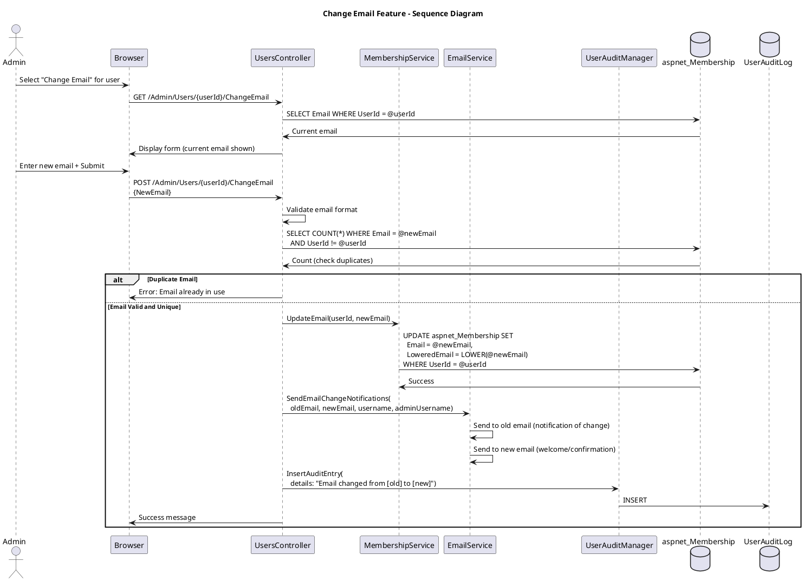

# Change Email Feature Specification

## Feature Overview

### Feature Name
Change User Email Address (Admin)

### Description
Administrative capability for Gateway Admins to update a user's email address. This feature validates the new email format and uniqueness, updates the user's account, sends confirmation notifications to both old and new email addresses for security, and maintains a comprehensive audit trail. This is critical for maintaining accurate user contact information when users change organizations or email providers.

### Business Value
- **Data Accuracy**: Ensures user contact information remains current
- **Communication**: Maintains ability to reach users for trial communications
- **Security**: Dual email confirmation prevents unauthorized email changes
- **Compliance**: Audit trail of email changes for regulatory requirements
- **User Support**: Admin can update email when user cannot access old email account

### Target Personas
- **Gateway Admin**: Updates email addresses for trial personnel
- **System Administrator**: Handles emergency email changes
- **Help Desk Support**: Assists users who need email updates
- **End User**: Receives confirmations at both old and new email addresses

---

## Requirements

### Functional Requirements

**FR-001: User Selection and Current Email Display**
- System MUST integrate with List Users for user selection
- System MUST display "Change Email" action in user actions menu
- System MUST show current email address on change email page
- System MUST show username and full name for confirmation

**FR-002: New Email Validation**
- System MUST validate new email format (RFC 5322 compliant)
- System MUST check email uniqueness (if requiresUniqueEmail=true)
- System MUST display error if email already in use by another user
- System MUST NOT allow changing email to same value
- System MUST provide real-time validation feedback

**FR-003: Email Update Operation**
- System MUST update Email field in aspnet_Membership
- System MUST update LoweredEmail field (for searches)
- System MUST preserve email change history (optional audit field)
- System MUST update via transactional database operation
- Update MUST be immediate (no confirmation delay)

**FR-004: Confirmation Emails**
- System MUST send confirmation to OLD email address:
  - Notification that email was changed
  - New email address
  - Admin who made change
  - Timestamp
  - Warning to contact security if unauthorized
- System MUST send confirmation to NEW email address:
  - Welcome/confirmation message
  - Confirmation this is now primary email
  - Reminder to update email in other systems
  - Login URL
- Both emails MUST be sent within 5 minutes

**FR-005: Success Confirmation**
- System MUST display success message to admin
- Message MUST include:
  - Old and new email addresses
  - Confirmation email delivery status
  - Link to return to user list
- System MUST handle email delivery failures gracefully

**FR-006: Audit Logging**
- System MUST log email change in UserAuditLog
- Audit entry MUST include:
  - Admin username
  - Target user username
  - Old email address
  - New email address
  - Timestamp
  - Email delivery status

**FR-007: Username Update (Optional)**
- If username is email-based, SHOULD prompt to update username
- Admin MAY choose to update or keep existing username
- If updated, audit both email and username changes

**FR-008: Error Handling**
- Handle user not found
- Handle duplicate email (already in use)
- Handle invalid email format
- Handle email delivery failures
- Display user-friendly error messages

### Non-Functional Requirements

**NFR-001: Performance**
- Email update MUST complete within 2 seconds
- Email sending MUST NOT block response
- Uniqueness check MUST be indexed

**NFR-002: Security**
- Both old and new emails notified (prevent hijacking)
- Email changes logged for security review
- HTTPS required for transmission
- Old email audit trail preserved

**NFR-003: Reliability**
- Update is transactional
- Email delivery failure does not block update
- Retry mechanism for failed emails

### Business Rules

**BR-001: Email Uniqueness**
- If requiresUniqueEmail=true, email must be unique
- If requiresUniqueEmail=false, multiple users may share email
- Uniqueness check is case-insensitive

**BR-002: Email Format**
- Must be valid email format (name@domain.tld)
- Maximum length 256 characters
- Cannot be empty or whitespace-only

**BR-003: Dual Notification Requirement**
- Both old and new emails MUST be notified
- Security best practice to prevent unauthorized changes
- User can report unauthorized changes

**BR-004: Audit Trail**
- Every email change logged with old and new values
- Previous email preserved in audit for history
- Email delivery status included

---

## User Stories

### Story 1: Successful Email Change
```gherkin
Given I am a Gateway Admin
  And user "jsmith" has current email "jsmith@oldcompany.com"
When I navigate to change email for "jsmith"
  And I enter new email "john.smith@newcompany.com"
  And I click "Update Email"
Then the system should validate the new email format
  And check that "john.smith@newcompany.com" is not already in use
  And update the email in aspnet_Membership
  And send confirmation to "jsmith@oldcompany.com" (old)
  And send confirmation to "john.smith@newcompany.com" (new)
  And display success message
  And log audit entry with old and new email addresses
```

### Story 2: Duplicate Email Error
```gherkin
Given user "jsmith" has email "jsmith@example.com"
  And user "jdoe" has email "jdoe@example.com"
  And requiresUniqueEmail=true
When I attempt to change "jsmith" email to "jdoe@example.com"
Then I should see error: "Email 'jdoe@example.com' is already in use by another user"
  And no changes should be made to the database
  And an audit entry should log the failed attempt
```

### Story 3: Email Delivery Failure
```gherkin
Given I am changing email for "jsmith"
  And the old email server is unreachable
When I confirm the email change
Then the email should be updated successfully
  And the system should attempt to send both confirmation emails
  And one or both emails may fail
  And I should see warning: "Email updated, but confirmation to old address could not be delivered"
  And failed emails should be queued for retry
```

---

## Design

### Workflow Diagram



#### ASCII Diagram

```
Change Email Feature - Sequence Diagram

Admin    Browser    Controller    Membership    EmailService    AuditMgr    DB
  │          │            │             │              │            │         │
  ├─Select───►            │             │              │            │         │
  │ Change   │            │             │              │            │         │
  │ Email    │            │             │              │            │         │
  │          ├──GET───────►             │              │            │         │
  │          │ /ChangeEmail             │              │            │         │
  │          │            │             │              │            │         │
  │          │            ├─Get User────────────────────────────────────────────►
  │          │            │             │              │            │   SELECT
  │          │            │◄─Current email────────────────────────────────────┤
  │          │            │             │              │            │         │
  │          │◄─Form──────┤             │              │            │         │
  │◄─Display─┤ (current   │             │              │            │         │
  │          │  email)    │             │              │            │         │
  │          │            │             │              │            │         │
  ├─Enter────►            │             │              │            │         │
  │ New Email│            │             │              │            │         │
  │ + Submit │            │             │              │            │         │
  │          ├──POST──────►             │              │            │         │
  │          │ {NewEmail} │             │              │            │         │
  │          │            │             │              │            │         │
  │          │            ├─Validate format           │            │         │
  │          │            │             │              │            │         │
  │          │            ├─Check uniqueness──────────────────────────────────►
  │          │            │             │              │            │   SELECT
  │          │            │             │              │            │   COUNT
  │          │            │◄─Result (0 duplicates)────────────────────────────┤
  │          │            │             │              │            │         │
  │          │        ┌───┴─────────────┴──────────────┴────────────┴─────┐   │
  │          │        │ IF Duplicate Email                          │   │
  │          │        └───┬─────────────┬──────────────┬────────────┬─────┘   │
  │          │            │             │              │            │         │
  │          │            ├─────────────────InsertAuditEntry────────►         │
  │          │            │             │     "Email change failed" │         │
  │          │◄─Error─────┤             │              │            │         │
  │◄─Display─┤            │             │              │            │         │
  │          │            │             │              │            │         │
  │          │        ┌───┴─────────────┴──────────────┴────────────┴─────┐   │
  │          │        │ ELSE Valid and Unique                       │   │
  │          │        └───┬─────────────┬──────────────┬────────────┬─────┘   │
  │          │            │             │              │            │         │
  │          │            ├─UpdateEmail─►              │            │         │
  │          │            │ (userId,    │              │            │         │
  │          │            │  newEmail)  │              │            │         │
  │          │            │             │              │            │         │
  │          │            │             ├─UPDATE───────────────────────────────►
  │          │            │             │ aspnet_Membership       │         │
  │          │            │             │ SET Email=@newEmail     │         │
  │          │            │             │ LoweredEmail=LOWER(@newEmail)     │
  │          │            │             │ WHERE UserId=@userId    │         │
  │          │            │             │◄─Success─────────────────────────┤
  │          │            │◄─Success────┤              │            │         │
  │          │            │             │              │            │         │
  │          │            ├─SendEmailChangeNotifications───────────►         │
  │          │            │             │              │            │         │
  │          │            │             │              ├──────────────────┐   │
  │          │            │             │              │ Send to OLD      │   │
  │          │            │             │              │ email:           │   │
  │          │            │             │              │ "Email changed   │   │
  │          │            │             │              │  to [new]"       │   │
  │          │            │             │              │ "Contact security│   │
  │          │            │             │              │  if unexpected"  │   │
  │          │            │             │              │◄─────────────────┘   │
  │          │            │             │              │                  │   │
  │          │            │             │              ├──────────────────┐   │
  │          │            │             │              │ Send to NEW      │   │
  │          │            │             │              │ email:           │   │
  │          │            │             │              │ "Welcome! Email  │   │
  │          │            │             │              │  updated. Login  │   │
  │          │            │             │              │  URL..."         │   │
  │          │            │             │              │◄─────────────────┘   │
  │          │            │             │              │                  │   │
  │          │            ├─────────────────InsertAuditEntry────────────►     │
  │          │            │             │              │            │         │
  │          │            │             │   "Email changed from [old] to [new]
  │          │            │             │    for user X by admin Y"│         │
  │          │            │             │              │            ├─INSERT──►
  │          │            │             │              │            │         │
  │          │◄─Success───┤             │              │            │         │
  │◄─Display─┤ Message    │             │              │            │         │
  │          │            │             │              │            │         │

Key Steps:
  1. Admin selects "Change Email" from user actions menu
  2. Form displays current email address
  3. Admin enters new email address
  4. Controller validates:
     - Email format (RFC 5322 compliant)
     - Email uniqueness (if requiresUniqueEmail=true)
     - Not same as current email
  5. If duplicate: display error, log attempt
  6. If valid:
     - Update Email and LoweredEmail in aspnet_Membership
     - Send notification to OLD email (security measure)
     - Send welcome/confirmation to NEW email
     - Log audit entry with old and new email addresses
  7. Display success message to admin

Security Features:
  • Dual notification prevents unauthorized changes
  • Old email receives alert if change was unexpected
  • New email confirms it's now the primary contact
  • Audit trail includes both old and new email addresses
  • Email uniqueness enforced at database level
```

### API Contracts

#### Endpoint: POST /Admin/Users/{userId}/ChangeEmail

**Request**:
```http
POST /Admin/Users/a1b2c3d4.../ChangeEmail HTTP/1.1
Content-Type: application/x-www-form-urlencoded

NewEmail=john.smith%40newcompany.com
```

**Response - Success**: 302 Redirect
```http
Location: /Admin/Users
Set-Cookie: TempData=Email+changed+successfully
```

---

## Implementation Details

### Code Patterns

**Pattern: Email Update with Dual Notification**
```csharp
[HttpPost]
[TrialRole("Administrators")]
public ActionResult ChangeEmail(Guid userId, string newEmail)
{
    var user = Membership.GetUser(userId);
    if (user == null)
        return HttpNotFound();

    var oldEmail = user.Email;

    // Validate new email
    if (!IsValidEmail(newEmail))
    {
        ModelState.AddModelError("NewEmail", "Invalid email format");
        return View();
    }

    // Check uniqueness
    if (RequiresUniqueEmail && IsEmailInUse(newEmail, userId))
    {
        ModelState.AddModelError("NewEmail", "Email already in use");
        return View();
    }

    // Update email
    user.Email = newEmail;
    Membership.UpdateUser(user);

    // Send dual confirmations
    emailService.SendEmailChangeNotificationToOld(oldEmail, newEmail, user.UserName, User.Identity.Name);
    emailService.SendEmailChangeNotificationToNew(newEmail, user.UserName);

    // Audit log
    auditManager.InsertAuditEntry(
        "Admin.UsersController",
        "ChangeEmail",
        User.Identity.Name,
        Request.UserHostAddress,
        UserAuditActions.UserManagement,
        UserAuditDetails.Email_Changed,
        details: $"Email changed from {oldEmail} to {newEmail} for user {user.UserName}"
    );

    TempData["SuccessMessage"] = $"Email updated successfully to {newEmail}";
    return RedirectToAction("Index");
}
```

---

## Acceptance Criteria

**AC-001**: Email validation works correctly
- Valid emails accepted
- Invalid format rejected
- Duplicate emails rejected (if configured)

**AC-002**: Email updated in database
- Email and LoweredEmail fields updated
- Update is immediate and transactional

**AC-003**: Dual confirmations sent
- Old email receives change notification
- New email receives welcome confirmation
- Both emails contain relevant information

**AC-004**: Audit trail complete
- Email change logged with old and new values
- Admin identity captured
- Timestamp recorded

**AC-005**: Error handling functional
- Duplicate email: clear error message
- Invalid format: validation error
- Email delivery failure: update succeeds, admin notified

---

## Related Documentation

- [List Users Feature Specification](./list-users.md)
- [Create User Feature Specification](./create-user.md)
- [Admin Use Cases](/current/src/docs/architecture/admin/use-cases.md)

---

**Document Version**: 1.0
**Last Updated**: January 2026
**Status**: Implementation-Ready
**Compliance**: 21 CFR Part 11, GDPR
