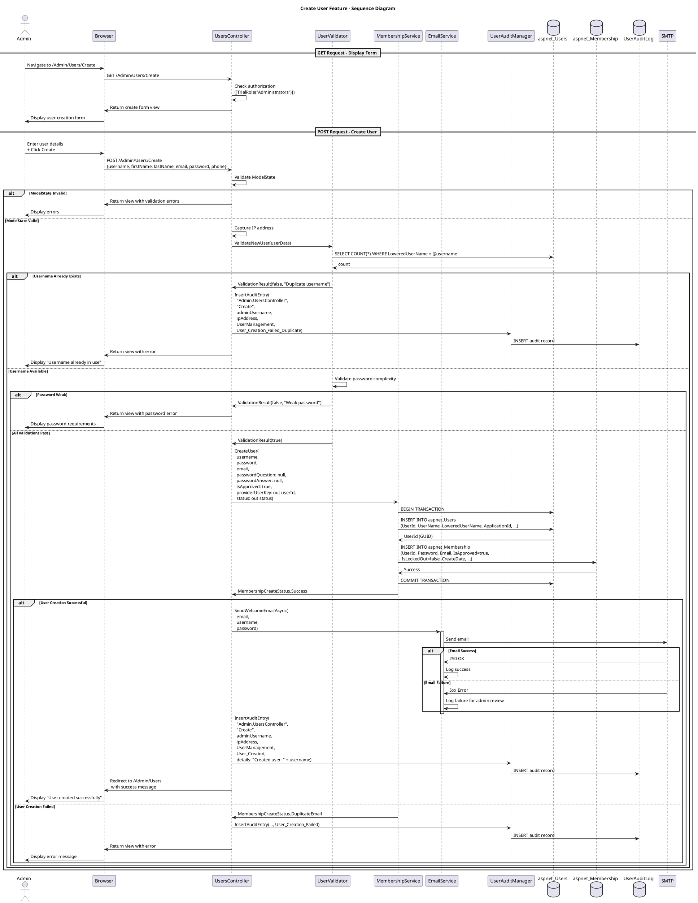

# Create User Feature Specification

## Feature Overview

### Feature Name
Manual User Creation (Admin)

### Description
Administrative capability for Gateway Admins to manually create new user accounts in the OoBDev system. This feature provides a comprehensive user creation form that captures essential user information, establishes initial credentials, sends welcome notifications, and maintains complete audit trails for regulatory compliance. The system validates all inputs, ensures data uniqueness, and integrates with the ASP.NET Membership Provider for secure account creation.

### Business Value
- **Efficiency**: Streamlined process for onboarding new users to clinical trials and system access
- **Control**: Centralized administrative control over user account provisioning
- **Compliance**: Maintains complete audit trail of user creation activities per 21 CFR Part 11
- **Security**: Enforces password complexity requirements and validates user data integrity
- **Automation**: Automatic welcome email delivery with initial credentials reduces manual communication overhead
- **Scalability**: Foundation for individual user creation, complementing bulk import capabilities

### Target Personas
- **Gateway Admin**: Primary user creating accounts for trial personnel and coordinators
- **System Administrator**: Creates admin-level accounts and manages user provisioning
- **Compliance Officer**: Reviews audit trail of user creation for regulatory compliance
- **Trial/Site Manager**: May have delegated permissions to create users within their trial scope

### Work Item Reference
TFS Work Item #495 (tfscorp.itrica.com\ITRICA)

---

## Requirements

### Functional Requirements

**FR-001: User Information Capture**
- System MUST provide form fields for:
  - Username/Email (primary identifier, max 256 characters)
  - First Name (required, max 128 characters)
  - Last Name (required, max 128 characters)
  - Email Address (required, valid email format)
  - Initial Password (required, meets complexity requirements)
  - Phone Number (optional, max 20 characters)
  - Additional contact information (optional)
- System MUST validate all required fields before submission
- System MUST display field-level validation errors

**FR-002: Username/Email Uniqueness**
- System MUST verify username does not already exist in aspnet_Users table
- System MUST verify email does not already exist if requiresUniqueEmail=true
- System MUST display clear error message if duplicate detected
- System MUST check uniqueness case-insensitively (LoweredUserName)

**FR-003: Password Requirements**
- System MUST enforce minimum password length (configured, default 8 characters)
- System MUST enforce minimum non-alphanumeric characters (configured, default 1)
- System MUST validate against password strength regular expression if configured
- System MUST hash password before storage (never store plain text)
- System MUST display password requirements on form

**FR-004: User Account Creation**
- System MUST create record in aspnet_Users table
- System MUST create record in aspnet_Membership table
- System MUST set IsApproved=true by default (unless specified otherwise)
- System MUST set IsLockedOut=false
- System MUST set CreateDate to current timestamp
- System MUST initialize FailedPasswordAttemptCount=0
- System MUST generate unique UserId (GUID)

**FR-005: Welcome Email Notification**
- System MUST send welcome email to new user's email address
- Email MUST contain:
  - Welcome message and system introduction
  - Username for login
  - Initial password (or password reset link)
  - Login URL
  - Support contact information
- System MUST log email delivery success/failure
- System MUST handle email failures gracefully (user still created)

**FR-006: Success Confirmation**
- System MUST display success message after user creation
- Success message MUST include:
  - Username of created user
  - Confirmation that welcome email was sent (or notification of email failure)
  - Link to view user in list
  - Option to create another user
- System MUST clear form after successful creation

**FR-007: Comprehensive Audit Logging**
- System MUST log user creation event in UserAuditLog
- Audit entry MUST include:
  - Admin username performing creation
  - New user's username
  - IP address of admin
  - Timestamp of creation
  - Action: "User Management"
  - Details: "User Created"
- System MUST log failures and reasons (validation errors, database errors)

**FR-008: Error Handling**
- System MUST validate ModelState before processing
- System MUST handle database constraint violations (duplicate username)
- System MUST handle Membership Provider exceptions
- System MUST display user-friendly error messages
- System MUST preserve form data on validation failures

### Non-Functional Requirements

**NFR-001: Performance**
- User creation request MUST complete within 3 seconds under normal load
- Email sending MUST NOT block user creation response (async preferred)
- Form validation MUST provide immediate feedback (<500ms)

**NFR-002: Security**
- Admin MUST be authenticated and authorized for user creation
- Admin MUST have "User Creation" permission
- Password field MUST use secure masking (type="password")
- Passwords MUST be transmitted over HTTPS only
- Initial password MUST be hashed using configured algorithm (SHA256/SHA512)
- Audit logs MUST NOT contain passwords

**NFR-003: Reliability**
- User creation MUST be transactional (all-or-nothing)
- Email delivery failure MUST NOT prevent user creation
- System MUST handle database connection failures gracefully
- System MUST provide retry mechanism for transient failures

**NFR-004: Usability**
- Form layout MUST be intuitive and follow organizational UI standards
- Required fields MUST be clearly marked with asterisk (*)
- Validation errors MUST display next to relevant fields
- Password requirements MUST be displayed near password field
- Form MUST support keyboard navigation and accessibility (WCAG 2.1 AA)

**NFR-005: Maintainability**
- Code MUST use Code Contracts for preconditions
- Business logic MUST be separated from presentation logic
- Email templates MUST be externalized (not hardcoded)
- Configuration settings MUST be in Web.config (not hardcoded)

### Business Rules

**BR-001: Username Validation**
- Username MUST be unique across the application
- Username comparison is case-insensitive (stored as LoweredUserName)
- Username MUST be valid email format if using email as username
- Username cannot contain special characters: <>[]|{}

**BR-002: Password Policy**
- Initial password complexity controlled by Membership Provider configuration
- Default: minimum 8 characters, 1 non-alphanumeric
- Password MUST be different from username
- Password hashed using configured passwordFormat (Hashed recommended)
- User SHOULD be required to change password on first login (optional setting)

**BR-003: Email Requirements**
- Email MUST be valid format (name@domain.tld)
- Email uniqueness enforced if requiresUniqueEmail=true in Membership config
- Multiple users MAY share email if configuration allows
- Email address stored in both Email and LoweredEmail fields

**BR-004: User Approval**
- New users created with IsApproved=true by default (immediately active)
- Admin MAY create user with IsApproved=false (requires manual activation)
- Unapproved users cannot log in until approved

**BR-005: Audit Trail Requirements**
- Every user creation MUST be logged
- Audit record includes both admin and new user identifiers
- Audit records are immutable (insert-only)
- Failed creation attempts also logged with failure reason

**BR-006: Welcome Email Content**
- Email MUST be sent within 5 minutes of user creation
- Email includes plain text and HTML versions
- Email template configurable per organizational branding
- Failed email delivery logged but does not block user creation

### Compliance Requirements

**COMP-001: 21 CFR Part 11 - Audit Trail**
- System MUST maintain secure, computer-generated, time-stamped audit trail
- Audit trail MUST record:
  - Date/time of user creation
  - Administrator identification who created the user
  - New user identification created
- Audit records MUST be available for FDA inspection
- Audit records retained per organizational retention policy

**COMP-002: 21 CFR Part 11 - Security**
- System MUST restrict user creation to authorized administrators only
- System MUST employ authority checks (role-based permissions)
- System MUST ensure passwords meet security requirements
- System MUST protect sensitive data during transmission (HTTPS)

**COMP-003: GCP (Good Clinical Practice)**
- System MUST maintain complete and accurate records of system users
- User creation MUST be traceable to responsible administrator
- User accounts MUST be uniquely identifiable
- System MUST support user accountability through unique credentials

**COMP-004: Data Privacy (GDPR/HIPAA)**
- System MUST obtain necessary consent for user data collection
- Personal data (email, phone) MUST be protected appropriately
- Users MUST have rights to access and correct their information
- Data retention policies MUST be enforced

---

## User Stories

### Story 1: Successful User Creation
```gherkin
Given I am a Gateway Admin with user creation permissions
  And I am authenticated in the system
When I navigate to /Admin/Users/Create
  And I enter new user details:
    | Field       | Value                |
    | Username    | jdoe                 |
    | First Name  | John                 |
    | Last Name   | Doe                  |
    | Email       | jdoe@example.com     |
    | Password    | SecurePass123!       |
    | Phone       | +1-555-0100          |
  And I click "Create User"
Then I should see success message "User 'jdoe' created successfully"
  And a new user account should exist in aspnet_Users
  And a new membership record should exist in aspnet_Membership
  And user should have IsApproved=true and IsLockedOut=false
  And a welcome email should be sent to jdoe@example.com
  And an audit log entry should record:
    | Field          | Value                |
    | Action         | User Management      |
    | Details        | User Created         |
    | AdminUsername  | my_admin_username    |
    | TargetUsername | jdoe                 |
    | IPAddress      | 192.168.1.100        |
```

### Story 2: Duplicate Username Error
```gherkin
Given I am a Gateway Admin
  And a user with username "jsmith" already exists
When I navigate to /Admin/Users/Create
  And I enter username "jsmith"
  And I enter other required fields
  And I click "Create User"
Then I should see error message "Username 'jsmith' is already in use"
  And the form should remain populated with my entered data
  And no new user should be created
  And an audit log entry should record:
    | Field          | Value                         |
    | Action         | User Management               |
    | Details        | User Creation Failed - Duplicate Username |
```

### Story 3: Invalid Password Complexity
```gherkin
Given I am a Gateway Admin
  And password requirements are: min 8 characters, 1 non-alphanumeric
When I navigate to /Admin/Users/Create
  And I enter username "newuser"
  And I enter password "simple" (does not meet requirements)
  And I enter other required fields
  And I click "Create User"
Then I should see error message "Password must be at least 8 characters and contain at least 1 non-alphanumeric character"
  And the password requirements should be highlighted
  And no user should be created
  And the form should preserve all other entered data
```

### Story 4: Email Delivery Failure
```gherkin
Given I am a Gateway Admin
  And the email server is temporarily unavailable
When I create a new user with valid information
  And the system attempts to send welcome email
  And the email delivery fails
Then I should see message "User 'newuser' created successfully, but welcome email could not be delivered. Please contact the user manually."
  And the user account should still be created
  And an audit log entry should record email delivery failure
  And an email notification failure log should be created for admin review
```

### Story 5: Creating User with Initial Role Assignment
```gherkin
Given I am a Gateway Admin
  And I have permissions to assign roles
When I navigate to /Admin/Users/Create
  And I enter new user details
  And I select initial role "Trial Coordinator"
  And I click "Create User"
Then the user should be created with assigned role
  And the user should have "Trial Coordinator" role immediately
  And the audit log should record both user creation and role assignment
  And the welcome email should mention the assigned role
```

### Story 6: Unauthorized Access Prevention
```gherkin
Given I am logged in as a standard Gateway User (not an admin)
  And I do not have user creation permissions
When I attempt to navigate to /Admin/Users/Create
Then I should be redirected to /Account/AccessDenied
  And I should see message "You do not have permission to create users"
  And an audit log entry should record unauthorized access attempt
```

---

## Design

### Architecture Diagram

```plantuml
@startuml Create User Architecture
!include https://raw.githubusercontent.com/plantuml-stdlib/C4-PlantUML/master/C4_Component.puml

title Create User Feature - Component Diagram

Container_Boundary(web, "Web Application") {
    Component(controller, "UsersController", "ASP.NET MVC Controller", "Handles user creation requests")
    Component(view, "Create View", "Razor View", "Renders user creation form")
    Component(membership, "MembershipService", "Service Layer", "Interfaces with ASP.NET Membership")
    Component(email, "EmailService", "Notification Service", "Sends welcome emails")
}

Container_Boundary(business, "Business Layer") {
    Component(auditMgr, "UserAuditManager", "Audit Manager", "Records user management events")
    Component(validator, "UserValidator", "Validation Service", "Validates user data and business rules")
}

Container_Boundary(data, "Data Layer") {
    ComponentDb(users, "aspnet_Users", "SQL Server Table", "Stores user identities")
    ComponentDb(membership_db, "aspnet_Membership", "SQL Server Table", "Stores credentials and settings")
    ComponentDb(auditDb, "UserAuditLog", "SQL Server Table", "Stores audit trail")
}

Container_Boundary(external, "External Services") {
    Component(smtp, "SMTP Server", "Email Server", "Delivers emails")
}

Rel(controller, view, "Renders", "HTML")
Rel(view, controller, "POST user data", "HTTP")
Rel(controller, validator, "Validate", "Method call")
Rel(controller, membership, "CreateUser", "Interface call")
Rel(controller, email, "SendWelcomeEmail", "Async call")
Rel(controller, auditMgr, "InsertAuditEntry", "Method call")
Rel(membership, users, "INSERT user", "ADO.NET")
Rel(membership, membership_db, "INSERT membership", "ADO.NET")
Rel(auditMgr, auditDb, "INSERT audit record", "Entity Framework")
Rel(email, smtp, "Send email", "SMTP")

note right of validator
  Validates:
  - Username uniqueness
  - Email format and uniqueness
  - Password complexity
  - Required fields
end note

note right of email
  Sends asynchronously
  Failure does not block user creation
  Logs delivery status
end note

@enduml
```

#### ASCII Diagram

```
┌────────────────────────────────────────────────────────────────────┐
│           Create User Feature - Component Architecture             │
└────────────────────────────────────────────────────────────────────┘

┌──────────────────────────────────────────────────────────────────────┐
│  Web Application Layer                                              │
│                                                                      │
│  ┌────────────────────┐           ┌──────────────────────────────┐  │
│  │  Create View       │◄──renders──│  UsersController             │  │
│  │  (Razor)           │            │  (MVC Controller)            │  │
│  │                    │            │                              │  │
│  │  - Username input  │            │  - POST Create(model)        │  │
│  │  - Email input     │──submits──►│  - Validate user data        │  │
│  │  - Password input  │            │  - Create user account       │  │
│  │  - Name inputs     │            │  - Send welcome email        │  │
│  │  - Submit button   │            │  - Log audit events          │  │
│  └────────────────────┘            └──┬────────┬──────────┬────────┘  │
└───────────────────────────────────────┼────────┼──────────┼───────────┘
                                        │        │          │
                                        ▼        ▼          ▼
┌───────────────────────────────────────────────────────────────────────┐
│  Business Layer                                                       │
│                                                                       │
│  ┌──────────────────────────┐  ┌──────────────────────────────────┐  │
│  │ MembershipService        │  │ UserValidator                    │  │
│  │                          │  │                                  │  │
│  │  - CreateUser()          │  │  - ValidateNewUser()             │  │
│  │  - Interfaces with       │  │  - Check username uniqueness     │  │
│  │    ASP.NET Membership    │  │  - Validate email format         │  │
│  └─────────────┬────────────┘  │  - Validate password complexity  │  │
│                │                └──────────────────────────────────┘  │
│                │                                                      │
│  ┌─────────────▼────────────┐  ┌──────────────────────────────────┐  │
│  │ EmailService             │  │ UserAuditManager                 │  │
│  │                          │  │                                  │  │
│  │  - SendWelcomeEmail()    │  │  - InsertAuditEntry()            │  │
│  │  - Async email delivery  │  │  - Log success/failure           │  │
│  │  - Failure doesn't block │  │  - Log email delivery status     │  │
│  └──────────────┬───────────┘  └─────────────┬────────────────────┘  │
└─────────────────┼──────────────────────────────┼────────────────────────┘
                  │                              │
                  ▼                              ▼
┌───────────────────────────────────────────────────────────────────────┐
│  Data Layer (SQL Server)                                             │
│                                                                       │
│  ┌──────────────────────────┐  ┌──────────────────────────────────┐  │
│  │ aspnet_Users             │  │ aspnet_Membership                │  │
│  ├──────────────────────────┤  ├──────────────────────────────────┤  │
│  │  UserId (PK)             │  │  UserId (PK, FK)                 │  │
│  │  UserName                │  │  Password (hashed)               │  │
│  │  LoweredUserName         │  │  Email                           │  │
│  │  ApplicationId           │  │  IsApproved                      │  │
│  │  IsAnonymous             │  │  IsLockedOut                     │  │
│  │  LastActivityDate        │  │  CreateDate                      │  │
│  └──────────────────────────┘  │  LastLoginDate                   │  │
│                                 │  FailedPasswordAttemptCount      │  │
│  ┌──────────────────────────┐  └──────────────────────────────────┘  │
│  │ MyInfo (Extended)        │                                         │
│  ├──────────────────────────┤  ┌──────────────────────────────────┐  │
│  │  MyInfoID (PK)           │  │ UserAuditLog                     │  │
│  │  AspNetUserId (FK)       │  ├──────────────────────────────────┤  │
│  │  FirstName               │  │  UserAuditLogID (PK)             │  │
│  │  LastName                │  │  UserAspNetID (FK)               │  │
│  │  Phone                   │  │  UserName                        │  │
│  │  Organization            │  │  ControllerName                  │  │
│  │  CreatedDate             │  │  ActionName                      │  │
│  └──────────────────────────┘  │  AuditAction                     │  │
│                                 │  Details                         │  │
│  ┌─────────────────────────┐   │  IPAddress                       │  │
│  │ SMTP Server (External)  │   │  CreatedOn                       │  │
│  │  Email delivery         │   └──────────────────────────────────┘  │
│  └─────────────────────────┘                                          │
└───────────────────────────────────────────────────────────────────────┘

Data Flow:
  1. Admin submits user creation form → UsersController
  2. Controller validates user data (UserValidator)
  3. Validator checks username/email uniqueness → aspnet_Users/Membership
  4. Validator checks password complexity against policy
  5. Controller calls MembershipService.CreateUser()
  6. MembershipService creates records in aspnet_Users and aspnet_Membership
  7. Controller creates extended profile → MyInfo table
  8. EmailService sends welcome email (async) → SMTP
  9. UserAuditManager logs creation event → UserAuditLog
  10. Controller displays success message to admin

Key Features:
  • Username uniqueness enforced at database level
  • Passwords hashed using configured algorithm (SHA256/SHA512)
  • Email delivery failure does not block user creation
  • Extended profile (MyInfo) links to aspnet_Users via AspNetUserId
  • Complete audit trail with admin identity and IP address
```

### Workflow Diagram



#### ASCII Diagram

```
Create User Feature - Sequence Diagram

Admin    Browser    Controller    Validator    Membership    Email    AuditMgr    DB
  │          │            │            │            │           │         │        │
  ├─Navigate─►            │            │            │           │         │        │
  │ /Create  │            │            │            │           │         │        │
  │          ├──GET───────►            │            │           │         │        │
  │          │            │            │            │           │         │        │
  │          │◄─Form──────┤            │            │           │         │        │
  │◄─Display─┤            │            │            │           │         │        │
  │          │            │            │            │           │         │        │
  ├─Fill─────►            │            │            │           │         │        │
  │ Form +   │            │            │            │           │         │        │
  │ Submit   │            │            │            │           │         │        │
  │          ├──POST──────►            │            │           │         │        │
  │          │  Create    │            │            │           │         │        │
  │          │            │            │            │           │         │        │
  │          │            ├─Validate───►            │           │         │        │
  │          │            │  ModelState│            │           │         │        │
  │          │            │            │            │           │         │        │
  │          │            │            ├─Check──────────────────────────────────────►
  │          │            │            │ Username   │           │         │        │
  │          │            │            │ Uniqueness │           │         │        │
  │          │            │            │◄─Result─────────────────────────────────────┤
  │          │            │            │            │           │         │        │
  │          │        ┌───┴────────────┴────┐       │           │         │        │
  │          │        │ IF Duplicate        │       │           │         │        │
  │          │        └───┬────────────┬────┘       │           │         │        │
  │          │            │            │            │           │         │        │
  │          │            │            ├─────────────────────InsertAudit──►        │
  │          │            │            │            │           │     "Failed"     │
  │          │            │            │            │           │         ├─INSERT─►
  │          │◄─Error─────┤            │            │           │         │        │
  │◄─Show────┤            │            │            │           │         │        │
  │ Error    │            │            │            │           │         │        │
  │          │            │            │            │           │         │        │
  │          │        ┌───┴────────────┴────┐       │           │         │        │
  │          │        │ ELSE Valid Data     │       │           │         │        │
  │          │        └───┬────────────┬────┘       │           │         │        │
  │          │            │◄─Valid─────┤            │           │         │        │
  │          │            │            │            │           │         │        │
  │          │            ├─CreateUser──────────────►           │         │        │
  │          │            │            │            │           │         │        │
  │          │            │            │            ├─BEGIN TRANSACTION────────────►
  │          │            │            │            │           │         │        │
  │          │            │            │            ├─INSERT aspnet_Users──────────►
  │          │            │            │            │◄─UserId (GUID)───────────────┤
  │          │            │            │            │           │         │        │
  │          │            │            │            ├─INSERT aspnet_Membership─────►
  │          │            │            │            │ (hashed password)    │        │
  │          │            │            │            │◄─Success─────────────────────┤
  │          │            │            │            │           │         │        │
  │          │            │            │            ├─COMMIT TRANSACTION───────────►
  │          │            │◄─Success───────────────┤           │         │        │
  │          │            │            │            │           │         │        │
  │          │            ├─Create─────────────────────────────────────────────────►
  │          │            │ Extended   │            │           │         │   MyInfo
  │          │            │ Profile    │            │           │         │        │
  │          │            │◄──────────────────────────────────────────────────────┤
  │          │            │            │            │           │         │        │
  │          │            ├─SendWelcomeEmail────────────────────►         │        │
  │          │            │ Async      │            │           │         │        │
  │          │            │            │            │           │         │        │
  │          │        ┌───┴────────────┴────┐       │           │         │        │
  │          │        │ Email Success/Fail  │       │           │         │        │
  │          │        └───┬────────────┬────┘       │           │         │        │
  │          │            │            │            │           │         │        │
  │          │            ├─────────────────────InsertAuditEntry──────────►        │
  │          │            │            │            │    "User Created"    │        │
  │          │            │            │            │    + email status    │        │
  │          │            │            │            │           │         ├─INSERT─►
  │          │            │            │            │           │         │        │
  │          │◄─Success───┤            │            │           │         │        │
  │◄─Display─┤ Redirect   │            │            │           │         │        │
  │ Success  │            │            │            │           │         │        │
  │          │            │            │            │           │         │        │

Key Workflow Steps:
  1. Admin navigates to Create User page
  2. Controller renders empty form
  3. Admin fills form with new user details and submits
  4. Controller validates ModelState
  5. Validator checks username uniqueness against database
  6. If duplicate: audit failure, return error
  7. If valid: MembershipService creates user
     - BEGIN TRANSACTION
     - INSERT into aspnet_Users (generate UserId GUID)
     - INSERT into aspnet_Membership (hash password)
     - COMMIT TRANSACTION
  8. Create extended profile in MyInfo table
  9. Send welcome email asynchronously (failure doesn't block)
  10. Log audit entry with success/failure and email status
  11. Display success message to admin

Transaction Handling:
  • User creation is transactional (all-or-nothing)
  • Email failure does NOT rollback user creation
  • Audit logging happens after successful creation
  • Extended profile creation is separate transaction
```

### Data Model

#### Entities

**aspnet_Users** (ASP.NET Framework Table)
```
Table: aspnet_Users
├── ApplicationId (uniqueidentifier, FK to aspnet_Applications)
├── UserId (uniqueidentifier, PK) - Generated GUID
├── UserName (nvarchar(256), UNIQUE)
├── LoweredUserName (nvarchar(256), UNIQUE) - For case-insensitive lookups
├── MobileAlias (nvarchar(16))
├── IsAnonymous (bit) - Always false for created users
└── LastActivityDate (datetime) - Set to creation date

Indexes:
- PK_aspnet_Users (UserId)
- UQ_aspnet_Users_UserName (ApplicationId, LoweredUserName)

Constraints:
- FK_aspnet_Users_Applications (ApplicationId)
```

**aspnet_Membership** (ASP.NET Framework Table)
```
Table: aspnet_Membership
├── ApplicationId (uniqueidentifier, FK)
├── UserId (uniqueidentifier, PK, FK to aspnet_Users)
├── Password (nvarchar(128)) - Hashed password
├── PasswordFormat (int) - 0=Clear (NEVER), 1=Hashed, 2=Encrypted
├── PasswordSalt (nvarchar(128)) - Random salt for hashing
├── Email (nvarchar(256)) - User email
├── LoweredEmail (nvarchar(256)) - Indexed
├── PasswordQuestion (nvarchar(256)) - Optional
├── PasswordAnswer (nvarchar(128)) - Optional, hashed
├── IsApproved (bit) - Set to true on creation
├── IsLockedOut (bit) - Set to false on creation
├── CreateDate (datetime) - Set to GETDATE()
├── LastLoginDate (datetime) - Set to CreateDate initially
├── LastPasswordChangedDate (datetime) - Set to CreateDate
├── LastLockoutDate (datetime) - NULL on creation
├── FailedPasswordAttemptCount (int) - Initialized to 0
├── FailedPasswordAttemptWindowStart (datetime) - NULL
├── FailedPasswordAnswerAttemptCount (int) - Initialized to 0
├── FailedPasswordAnswerAttemptWindowStart (datetime) - NULL
└── Comment (nvarchar(max)) - Optional notes

Indexes:
- PK_aspnet_Membership (UserId)
- IX_aspnet_Membership_Email
- IX_aspnet_Membership_LoweredEmail

Constraints:
- FK_aspnet_Membership_Users (UserId)
```

**UserAuditLog** (Custom Audit Table)
```
Table: UserAuditLog
├── UserAuditLogID (int, PK, Identity)
├── UserAspNetID (uniqueidentifier, FK) - Admin who performed action
├── UserName (nvarchar(256)) - Admin username
├── ControllerName (nvarchar(256)) - "Admin.UsersController"
├── ActionName (nvarchar(256)) - "Create"
├── AuditAction (nvarchar(256)) - "User Management"
├── Details (nvarchar(max)) - "User Created: {newUsername}" or error details
├── IPAddress (nvarchar(45)) - Admin's IP address
└── CreatedOn (datetime) - Timestamp

Indexes:
- PK_UserAuditLog
- IX_UserAuditLog_UserName
- IX_UserAuditLog_CreatedOn
- IX_UserAuditLog_AuditAction
```

**MyInfo** (User Profile Table - Optional Extended Data)
```
Table: MyInfo
├── MyInfoID (int, PK, Identity)
├── AspNetUserId (uniqueidentifier, FK to aspnet_Users)
├── FirstName (nvarchar(128))
├── LastName (nvarchar(128))
├── Phone (nvarchar(20))
├── Organization (nvarchar(256))
├── JobTitle (nvarchar(128))
└── CreatedDate (datetime)

Constraints:
- FK_MyInfo_aspnet_Users (AspNetUserId)
```

#### Relationships

```
aspnet_Applications 1---* aspnet_Users
aspnet_Users 1---1 aspnet_Membership
aspnet_Users 1---* UserAuditLog (for admin actions)
aspnet_Users 1---0..1 MyInfo (extended profile)
```

### API Contracts

#### Endpoint: GET /Admin/Users/Create

**Purpose**: Display user creation form

**Authorization**: Requires "Administrators" role

**Request**:
```http
GET /Admin/Users/Create HTTP/1.1
Host: gateway.itrica.com
Cookie: .ASPXAUTH=<authenticated-admin-cookie>
```

**Response**: 200 OK
```html
<!-- Razor view rendered with empty CreateUserModel -->
<form action="/Admin/Users/Create" method="post">
  <div>
    <label for="UserName">Username *</label>
    <input id="UserName" name="UserName" type="text" maxlength="256" required />
    <span class="field-validation-valid"></span>
  </div>

  <div>
    <label for="Email">Email *</label>
    <input id="Email" name="Email" type="email" maxlength="256" required />
    <span class="field-validation-valid"></span>
  </div>

  <div>
    <label for="Password">Password *</label>
    <input id="Password" name="Password" type="password" maxlength="128" required />
    <span class="help-text">Minimum 8 characters, 1 non-alphanumeric</span>
    <span class="field-validation-valid"></span>
  </div>

  <div>
    <label for="FirstName">First Name *</label>
    <input id="FirstName" name="FirstName" type="text" maxlength="128" required />
  </div>

  <div>
    <label for="LastName">Last Name *</label>
    <input id="LastName" name="LastName" type="text" maxlength="128" required />
  </div>

  <div>
    <label for="Phone">Phone</label>
    <input id="Phone" name="Phone" type="tel" maxlength="20" />
  </div>

  <div>
    <label for="IsApproved">Account Active</label>
    <input id="IsApproved" name="IsApproved" type="checkbox" checked />
  </div>

  <button type="submit">Create User</button>
</form>
```

**View Data**:
```csharp
ViewBag.Title = "Create User";
ViewBag.PasswordRequirements = GetPasswordRequirements(); // From membership config
```

---

#### Endpoint: POST /Admin/Users/Create

**Purpose**: Create new user account

**Authorization**: Requires "Administrators" role

**Request**:
```http
POST /Admin/Users/Create HTTP/1.1
Host: gateway.itrica.com
Content-Type: application/x-www-form-urlencoded
Cookie: .ASPXAUTH=<authenticated-admin-cookie>

UserName=jdoe&Email=jdoe@example.com&Password=SecurePass123!&FirstName=John&LastName=Doe&Phone=555-0100&IsApproved=true
```

**Request Model**:
```csharp
public class CreateUserModel
{
    [Required(ErrorMessage = "Username is required")]
    [StringLength(256, ErrorMessage = "Username cannot exceed 256 characters")]
    [Display(Name = "Username")]
    [RegularExpression(@"^[a-zA-Z0-9@.\-_]+$", ErrorMessage = "Username contains invalid characters")]
    public string UserName { get; set; }

    [Required(ErrorMessage = "Email is required")]
    [StringLength(256)]
    [EmailAddress(ErrorMessage = "Invalid email address format")]
    [Display(Name = "Email")]
    public string Email { get; set; }

    [Required(ErrorMessage = "Password is required")]
    [StringLength(128, MinimumLength = 8, ErrorMessage = "Password must be 8-128 characters")]
    [DataType(DataType.Password)]
    [Display(Name = "Password")]
    public string Password { get; set; }

    [Required(ErrorMessage = "First name is required")]
    [StringLength(128)]
    [Display(Name = "First Name")]
    public string FirstName { get; set; }

    [Required(ErrorMessage = "Last name is required")]
    [StringLength(128)]
    [Display(Name = "Last Name")]
    public string LastName { get; set; }

    [StringLength(20)]
    [Phone(ErrorMessage = "Invalid phone number format")]
    [Display(Name = "Phone")]
    public string Phone { get; set; }

    [Display(Name = "Account Active")]
    public bool IsApproved { get; set; } = true;
}
```

**Response - Success**: 302 Found
```http
HTTP/1.1 302 Found
Location: /Admin/Users?message=User+created+successfully
```

**Response - Validation Error**: 200 OK
```html
<!-- Form redisplayed with validation errors -->
<div class="validation-summary-errors">
  <ul>
    <li>Username is required.</li>
    <li>Email is required.</li>
  </ul>
</div>
```

**Response - Duplicate Username**: 200 OK
```html
<div class="validation-summary-errors">
  <ul>
    <li>Username 'jdoe' is already in use. Please choose a different username.</li>
  </ul>
</div>
```

**Response - Password Complexity Error**: 200 OK
```html
<div class="validation-summary-errors">
  <ul>
    <li>Password must be at least 8 characters and contain at least 1 non-alphanumeric character.</li>
  </ul>
</div>
```

**TempData** (success message):
```csharp
TempData["SuccessMessage"] = "User 'jdoe' created successfully. Welcome email sent to jdoe@example.com.";
// Or with email failure:
TempData["WarningMessage"] = "User 'jdoe' created successfully, but welcome email could not be delivered.";
```

---

## Implementation Details

### Technology Stack

**Framework**:
- ASP.NET MVC 4.x/5.x (.NET Framework)
- C# language
- Razor view engine

**Authentication/Membership**:
- ASP.NET Membership Provider (System.Web.Security)
- SQL Server Membership database schema
- Custom role-based authorization

**Data Access**:
- ADO.NET (via Membership Provider)
- Entity Framework (for audit logging and extended profiles)

**Email Delivery**:
- System.Net.Mail.SmtpClient
- Async email sending (Task-based)
- Configurable SMTP settings

**Validation**:
- Data Annotations (System.ComponentModel.DataAnnotations)
- ModelState validation
- Code Contracts (System.Diagnostics.Contracts)
- Custom validation attributes

### Dependencies

**NuGet Packages**:
```xml
<packages>
  <package id="Microsoft.AspNet.Mvc" version="5.x" />
  <package id="EntityFramework" version="6.x" />
  <package id="Microsoft.CodeContracts" version="1.x" />
</packages>
```

**Project References**:
```
OoBDev.Web.Controllers
├── OoBDev.Web.Models (CreateUserModel, User management models)
├── OoBDev.Gateway.Access (UserAuditManager, UserValidator)
├── OoBDev.Gateway.Data (GatewayEntities, MyInfo entity)
├── OoBDev.Gateway.Models (UserAuditLog, MyInfo)
├── OoBDev.Common.Email (EmailService, EmailTemplates)
└── OoBDev.Web.Mvc (Authorization attributes)
```

**External Dependencies**:
- System.Web.Mvc
- System.Web.Security (Membership, MembershipUser, MembershipCreateStatus)
- System.Net.Mail
- System.Diagnostics.Contracts
- System.ComponentModel.DataAnnotations

### Security Considerations

**Authorization**:
```csharp
[TrialRole("Administrators")]
public class UsersController : Controller
{
    // Only administrators can access user management
}
```

**Password Security**:
- Passwords never logged or displayed in UI
- Password hashing performed by Membership Provider
- Hashing algorithm: SHA256 or SHA512 (configurable)
- Unique salt generated per user automatically
- Password transmitted over HTTPS only
- Password field uses `type="password"` masking

**Input Validation**:
```csharp
// Prevent XSS attacks
public ActionResult Create([Bind(Include = "UserName,Email,Password,FirstName,LastName,Phone,IsApproved")] CreateUserModel model)
{
    Contract.Requires(model != null);

    if (!ModelState.IsValid)
    {
        return View(model);
    }

    // Additional validation
    if (!IsValidUsername(model.UserName))
    {
        ModelState.AddModelError("UserName", "Username contains invalid characters");
        return View(model);
    }

    // ... proceed with creation
}
```

**SQL Injection Prevention**:
- Membership Provider uses parameterized queries
- Entity Framework uses parameterized queries
- No raw SQL concatenation

**Audit Trail Security**:
```csharp
var auditManager = new UserAuditManager();
auditManager.InsertAuditEntry(
    "Admin.UsersController",
    "Create",
    User.Identity.Name, // Admin username
    Request.UserHostAddress,
    UserAuditActions.UserManagement,
    UserAuditDetails.User_Created,
    details: $"Created user: {model.UserName}"
);
```

**Email Security**:
- Email credentials stored encrypted in Web.config
- SMTP credentials protected via Data Protection API
- Email sending does not expose internal paths or configuration
- Email templates sanitized to prevent injection

### Code Patterns

**Pattern 1: Transaction-Safe User Creation**
```csharp
public ActionResult Create(CreateUserModel model)
{
    Contract.Requires(model != null);

    if (!ModelState.IsValid)
    {
        return View(model);
    }

    try
    {
        // Create user via Membership Provider (handles transaction)
        MembershipCreateStatus status;
        var user = Membership.CreateUser(
            model.UserName,
            model.Password,
            model.Email,
            passwordQuestion: null,
            passwordAnswer: null,
            isApproved: model.IsApproved,
            providerUserKey: out object userId,
            status: out status
        );

        if (status == MembershipCreateStatus.Success)
        {
            // Create extended profile (separate transaction)
            CreateUserProfile((Guid)userId, model);

            // Send welcome email (async, non-blocking)
            SendWelcomeEmailAsync(model.Email, model.UserName, model.Password);

            // Audit logging (separate transaction)
            LogUserCreation(model.UserName, success: true);

            TempData["SuccessMessage"] = $"User '{model.UserName}' created successfully.";
            return RedirectToAction("Index");
        }
        else
        {
            // Handle creation failure
            ModelState.AddModelError("", GetErrorMessage(status));
            LogUserCreation(model.UserName, success: false, reason: status.ToString());
            return View(model);
        }
    }
    catch (Exception ex)
    {
        LogException(ex);
        ModelState.AddModelError("", "An error occurred creating the user. Please try again.");
        return View(model);
    }
}
```

**Pattern 2: Async Email Sending (Non-Blocking)**
```csharp
private void SendWelcomeEmailAsync(string email, string username, string password)
{
    Task.Run(() =>
    {
        try
        {
            var emailService = new EmailService();
            var emailTemplate = new WelcomeEmailTemplate
            {
                ToAddress = email,
                Username = username,
                TemporaryPassword = password,
                LoginUrl = Url.Action("LogOn", "Account", null, Request.Url.Scheme),
                SupportEmail = ConfigurationManager.AppSettings["SupportEmail"]
            };

            emailService.SendEmail(emailTemplate);
            LogEmailDelivery(email, success: true);
        }
        catch (Exception ex)
        {
            // Log but don't throw (email failure shouldn't block user creation)
            LogEmailDelivery(email, success: false, error: ex.Message);
        }
    });
}
```

**Pattern 3: Extended Profile Creation**
```csharp
private void CreateUserProfile(Guid userId, CreateUserModel model)
{
    using (var db = new GatewayEntities())
    {
        var profile = new MyInfo
        {
            AspNetUserId = userId,
            FirstName = model.FirstName,
            LastName = model.LastName,
            Phone = model.Phone,
            CreatedDate = DateTime.Now
        };

        db.MyInfos.Add(profile);
        db.SaveChanges();
    }
}
```

**Pattern 4: Comprehensive Error Handling**
```csharp
private string GetErrorMessage(MembershipCreateStatus status)
{
    switch (status)
    {
        case MembershipCreateStatus.DuplicateUserName:
            return $"Username '{model.UserName}' is already in use. Please choose a different username.";

        case MembershipCreateStatus.DuplicateEmail:
            return $"Email address '{model.Email}' is already registered. Please use a different email.";

        case MembershipCreateStatus.InvalidPassword:
            return "Password does not meet complexity requirements. Minimum 8 characters, 1 non-alphanumeric character.";

        case MembershipCreateStatus.InvalidEmail:
            return "Email address format is invalid.";

        case MembershipCreateStatus.InvalidUserName:
            return "Username contains invalid characters.";

        case MembershipCreateStatus.ProviderError:
            return "An error occurred with the membership provider. Please contact support.";

        default:
            return "An error occurred creating the user. Please try again.";
    }
}
```

**Pattern 5: Audit Logging Wrapper**
```csharp
private void LogUserCreation(string newUsername, bool success, string reason = null)
{
    var auditManager = new UserAuditManager();
    var details = success
        ? $"User Created: {newUsername}"
        : $"User Creation Failed: {newUsername} - {reason}";

    auditManager.InsertAuditEntry(
        "Admin.UsersController",
        "Create",
        User.Identity.Name, // Admin performing action
        Request.UserHostAddress,
        UserAuditActions.UserManagement,
        success ? UserAuditDetails.User_Created : UserAuditDetails.User_Creation_Failed,
        details: details
    );
}
```

**Configuration Example** (Web.config):
```xml
<configuration>
  <appSettings>
    <add key="SupportEmail" value="support@itrica.com" />
    <add key="RequirePasswordChangeOnFirstLogin" value="true" />
  </appSettings>

  <system.net>
    <mailSettings>
      <smtp from="noreply@itrica.com" deliveryMethod="Network">
        <network
          host="smtp.itrica.com"
          port="587"
          userName="noreply@itrica.com"
          password="encrypted-password"
          enableSsl="true" />
      </smtp>
    </mailSettings>
  </system.net>

  <system.web>
    <membership defaultProvider="OoBDevMembershipProvider">
      <providers>
        <add
          name="OoBDevMembershipProvider"
          type="System.Web.Security.SqlMembershipProvider"
          connectionStringName="GatewayDatabase"
          applicationName="/Gateway"
          enablePasswordRetrieval="false"
          enablePasswordReset="true"
          requiresQuestionAndAnswer="false"
          requiresUniqueEmail="true"
          passwordFormat="Hashed"
          maxInvalidPasswordAttempts="5"
          minRequiredPasswordLength="8"
          minRequiredNonalphanumericCharacters="1"
          passwordAttemptWindow="10" />
      </providers>
    </membership>
  </system.web>
</configuration>
```

---

## Acceptance Criteria

**AC-001**: Admin can access user creation form
- Given I am an authenticated Gateway Admin
- When I navigate to /Admin/Users/Create
- Then I should see user creation form with all required fields
- And password requirements should be displayed
- And required fields marked with asterisk

**AC-002**: User created successfully with valid data
- Given I enter all required fields with valid data
- When I submit the form
- Then new user should be created in aspnet_Users and aspnet_Membership
- And user should have IsApproved=true, IsLockedOut=false
- And success message displayed
- And audit log entry created

**AC-003**: Welcome email sent on user creation
- Given I create a new user successfully
- Then welcome email should be sent to user's email address
- And email should contain username, password, and login URL
- And email delivery logged in system

**AC-004**: Duplicate username prevented
- Given username "existing" already exists
- When I try to create user with username "existing"
- Then error message "Username already in use" displayed
- And no user created
- And failure logged in audit trail

**AC-005**: Password complexity enforced
- Given I enter password that doesn't meet requirements
- When I submit the form
- Then error message displayed explaining requirements
- And no user created
- And form preserves entered data

**AC-006**: Email uniqueness enforced (if configured)
- Given requiresUniqueEmail=true in config
- And email "user@example.com" already exists
- When I try to create user with same email
- Then error message "Email already registered" displayed
- And no user created

**AC-007**: Extended profile created
- Given I create a new user with first name, last name, phone
- Then MyInfo record should be created with user details
- And AspNetUserId should link to created user

**AC-008**: Email delivery failure handled gracefully
- Given SMTP server is unavailable
- When I create a new user
- Then user should still be created
- And warning message displayed about email failure
- And email failure logged for admin review

**AC-009**: Unauthorized users cannot create users
- Given I am logged in without admin role
- When I attempt to access /Admin/Users/Create
- Then I should be redirected to access denied page
- And unauthorized access logged

**AC-010**: All fields validated correctly
- Required fields: Username, Email, Password, FirstName, LastName
- Email format validated
- Phone number format validated (if provided)
- Username character restrictions enforced
- Validation errors displayed next to fields

---

## Test Scenarios

### Unit Tests

**Test**: `Create_GET_AuthorizedAdmin_ReturnsView`
```csharp
[TestMethod]
public void Create_GET_AuthorizedAdmin_ReturnsView()
{
    // Arrange
    var controller = new UsersController();
    MockAuthenticatedUser(controller, "admin1", roles: new[] { "Administrators" });

    // Act
    var result = controller.Create() as ViewResult;

    // Assert
    Assert.IsNotNull(result);
    Assert.IsNotNull(result.Model as CreateUserModel);
    Assert.IsTrue((bool)result.ViewBag.PasswordRequirements != null);
}
```

**Test**: `Create_POST_ValidModel_CreatesUser`
```csharp
[TestMethod]
public void Create_POST_ValidModel_CreatesUser()
{
    // Arrange
    var controller = new UsersController();
    var model = new CreateUserModel
    {
        UserName = "newuser",
        Email = "newuser@example.com",
        Password = "SecurePass123!",
        FirstName = "New",
        LastName = "User",
        IsApproved = true
    };

    // Act
    var result = controller.Create(model) as RedirectToRouteResult;

    // Assert
    Assert.IsNotNull(result);
    Assert.AreEqual("Index", result.RouteValues["action"]);

    // Verify user created
    var user = Membership.GetUser("newuser");
    Assert.IsNotNull(user);
    Assert.AreEqual("newuser@example.com", user.Email);
    Assert.IsTrue(user.IsApproved);
    Assert.IsFalse(user.IsLockedOut);

    // Cleanup
    Membership.DeleteUser("newuser");
}
```

**Test**: `Create_POST_DuplicateUsername_ReturnsError`
```csharp
[TestMethod]
public void Create_POST_DuplicateUsername_ReturnsError()
{
    // Arrange
    var existingUser = "existing_user";
    Membership.CreateUser(existingUser, "Pass123!", "existing@example.com");

    var controller = new UsersController();
    var model = new CreateUserModel
    {
        UserName = existingUser,
        Email = "different@example.com",
        Password = "Pass123!",
        FirstName = "Test",
        LastName = "User"
    };

    // Act
    var result = controller.Create(model) as ViewResult;

    // Assert
    Assert.IsNotNull(result);
    Assert.IsFalse(controller.ModelState.IsValid);
    Assert.IsTrue(controller.ModelState[""].Errors.Any(e =>
        e.ErrorMessage.Contains("already in use")));

    // Cleanup
    Membership.DeleteUser(existingUser);
}
```

**Test**: `Create_POST_WeakPassword_ReturnsError`
```csharp
[TestMethod]
public void Create_POST_WeakPassword_ReturnsError()
{
    // Arrange
    var controller = new UsersController();
    var model = new CreateUserModel
    {
        UserName = "testuser",
        Email = "test@example.com",
        Password = "weak", // Doesn't meet requirements
        FirstName = "Test",
        LastName = "User"
    };

    // Act
    var result = controller.Create(model) as ViewResult;

    // Assert
    Assert.IsNotNull(result);
    Assert.IsFalse(controller.ModelState.IsValid);
    Assert.IsTrue(controller.ModelState["Password"].Errors.Any());
}
```

**Test**: `Create_POST_Success_LogsAuditEntry`
```csharp
[TestMethod]
public void Create_POST_Success_LogsAuditEntry()
{
    // Arrange
    var controller = new UsersController();
    MockAuthenticatedUser(controller, "admin1");
    var model = new CreateUserModel
    {
        UserName = "audituser",
        Email = "audit@example.com",
        Password = "SecurePass123!",
        FirstName = "Audit",
        LastName = "User"
    };

    // Act
    controller.Create(model);

    // Assert - Verify audit log entry
    using (var db = new GatewayEntities())
    {
        var auditEntry = db.UserAuditLogs
            .Where(a => a.UserName == "admin1"
                && a.Details.Contains("audituser")
                && a.AuditAction == "User Management")
            .OrderByDescending(a => a.CreatedOn)
            .FirstOrDefault();

        Assert.IsNotNull(auditEntry);
        Assert.AreEqual("Admin.UsersController", auditEntry.ControllerName);
        Assert.AreEqual("Create", auditEntry.ActionName);
        Assert.IsTrue(auditEntry.Details.Contains("User Created"));
    }

    // Cleanup
    Membership.DeleteUser("audituser");
}
```

**Test**: `Create_POST_Success_CreatesExtendedProfile`
```csharp
[TestMethod]
public void Create_POST_Success_CreatesExtendedProfile()
{
    // Arrange
    var controller = new UsersController();
    var model = new CreateUserModel
    {
        UserName = "profileuser",
        Email = "profile@example.com",
        Password = "SecurePass123!",
        FirstName = "Profile",
        LastName = "User",
        Phone = "555-0123"
    };

    // Act
    controller.Create(model);

    // Assert - Verify MyInfo record created
    var user = Membership.GetUser("profileuser");
    using (var db = new GatewayEntities())
    {
        var profile = db.MyInfos
            .FirstOrDefault(m => m.AspNetUserId == (Guid)user.ProviderUserKey);

        Assert.IsNotNull(profile);
        Assert.AreEqual("Profile", profile.FirstName);
        Assert.AreEqual("User", profile.LastName);
        Assert.AreEqual("555-0123", profile.Phone);
    }

    // Cleanup
    Membership.DeleteUser("profileuser");
}
```

### Integration Tests

**Test**: `CreateUser_EndToEnd_Success`
```csharp
[TestMethod]
public void CreateUser_EndToEnd_Success()
{
    // Arrange
    var client = CreateAuthenticatedAdminClient();
    var formData = new FormUrlEncodedContent(new[]
    {
        new KeyValuePair<string, string>("UserName", "integration_user"),
        new KeyValuePair<string, string>("Email", "integration@example.com"),
        new KeyValuePair<string, string>("Password", "IntegrationPass123!"),
        new KeyValuePair<string, string>("FirstName", "Integration"),
        new KeyValuePair<string, string>("LastName", "User"),
        new KeyValuePair<string, string>("Phone", "555-9999"),
        new KeyValuePair<string, string>("IsApproved", "true")
    });

    // Act
    var response = client.PostAsync("/Admin/Users/Create", formData).Result;

    // Assert
    Assert.AreEqual(HttpStatusCode.Redirect, response.StatusCode);
    Assert.IsTrue(response.Headers.Location.AbsolutePath.Contains("/Admin/Users"));

    // Verify user in database
    var user = Membership.GetUser("integration_user");
    Assert.IsNotNull(user);
    Assert.AreEqual("integration@example.com", user.Email);
    Assert.IsTrue(user.IsApproved);

    // Verify audit log
    var auditEntry = GetLatestUserManagementAudit();
    Assert.IsTrue(auditEntry.Details.Contains("integration_user"));

    // Cleanup
    Membership.DeleteUser("integration_user");
}
```

**Test**: `CreateUser_DuplicateUsername_ShowsError`
```csharp
[TestMethod]
public void CreateUser_DuplicateUsername_ShowsError()
{
    // Arrange
    var existingUser = "duplicate_test";
    Membership.CreateUser(existingUser, "Pass123!", "existing@example.com");

    var client = CreateAuthenticatedAdminClient();
    var formData = CreateFormData(username: existingUser, email: "new@example.com");

    // Act
    var response = client.PostAsync("/Admin/Users/Create", formData).Result;

    // Assert
    Assert.AreEqual(HttpStatusCode.OK, response.StatusCode); // Form redisplayed
    var content = response.Content.ReadAsStringAsync().Result;
    Assert.IsTrue(content.Contains("already in use"));

    // Verify no new user created
    var users = Membership.FindUsersByName(existingUser);
    Assert.AreEqual(1, users.Count); // Still only the original

    // Cleanup
    Membership.DeleteUser(existingUser);
}
```

**Test**: `CreateUser_EmailSent_Success`
```csharp
[TestMethod]
public void CreateUser_EmailSent_Success()
{
    // Arrange
    var smtpMock = new MockSmtpServer();
    smtpMock.Start();

    var client = CreateAuthenticatedAdminClient();
    var formData = CreateFormData(
        username: "email_test",
        email: "emailtest@example.com",
        password: "EmailTest123!"
    );

    // Act
    client.PostAsync("/Admin/Users/Create", formData).Wait();
    Thread.Sleep(2000); // Wait for async email

    // Assert
    var sentEmails = smtpMock.GetSentEmails();
    Assert.AreEqual(1, sentEmails.Count);
    Assert.AreEqual("emailtest@example.com", sentEmails[0].To);
    Assert.IsTrue(sentEmails[0].Body.Contains("email_test"));
    Assert.IsTrue(sentEmails[0].Body.Contains("EmailTest123!"));

    // Cleanup
    Membership.DeleteUser("email_test");
    smtpMock.Stop();
}
```

### Security Tests

**Test**: `Security_PasswordNotStoredInPlaintext`
```csharp
[TestMethod]
public void Security_PasswordNotStoredInPlaintext()
{
    // Arrange
    var controller = new UsersController();
    var password = "MySecretPassword123!";
    var model = CreateValidModel(password: password);

    // Act
    controller.Create(model);

    // Assert - Verify password is hashed
    using (var db = new SqlConnection(ConnectionString))
    {
        db.Open();
        var cmd = new SqlCommand(
            "SELECT Password FROM aspnet_Membership m " +
            "INNER JOIN aspnet_Users u ON m.UserId = u.UserId " +
            "WHERE u.UserName = @username",
            db);
        cmd.Parameters.AddWithValue("@username", model.UserName);

        var storedPassword = cmd.ExecuteScalar() as string;
        Assert.IsNotNull(storedPassword);
        Assert.AreNotEqual(password, storedPassword);
        Assert.IsTrue(storedPassword.Length > 20); // Hashed passwords are longer
    }

    // Cleanup
    Membership.DeleteUser(model.UserName);
}
```

**Test**: `Security_UnauthorizedUserCannotAccess`
```csharp
[TestMethod]
public void Security_UnauthorizedUserCannotAccess()
{
    // Arrange
    var client = CreateAuthenticatedUserClient(roles: new[] { "GatewayUser" }); // Not admin

    // Act
    var response = client.GetAsync("/Admin/Users/Create").Result;

    // Assert
    Assert.AreEqual(HttpStatusCode.Redirect, response.StatusCode);
    Assert.IsTrue(response.Headers.Location.AbsolutePath.Contains("AccessDenied"));

    // Verify audit log of unauthorized attempt
    var auditEntry = GetLatestAuditEntry();
    Assert.IsTrue(auditEntry.Details.Contains("Unauthorized") ||
                  auditEntry.AuditAction.Contains("Access Denied"));
}
```

**Test**: `Security_AuditLogDoesNotContainPassword`
```csharp
[TestMethod]
public void Security_AuditLogDoesNotContainPassword()
{
    // Arrange
    var controller = new UsersController();
    var password = "SecretPassword123!";
    var model = CreateValidModel(password: password);

    // Act
    controller.Create(model);

    // Assert
    using (var db = new GatewayEntities())
    {
        var auditEntries = db.UserAuditLogs
            .Where(a => a.Details.Contains(model.UserName))
            .ToList();

        foreach (var entry in auditEntries)
        {
            Assert.IsFalse(entry.Details.Contains(password));
            Assert.IsFalse(entry.ControllerName.Contains(password));
            Assert.IsFalse(entry.ActionName.Contains(password));
        }
    }

    // Cleanup
    Membership.DeleteUser(model.UserName);
}
```

---

## Migration/Deployment Considerations

### Database Schema

**Prerequisites**:
- ASP.NET Membership schema installed
- UserAuditLog table exists
- MyInfo table exists (for extended profiles)

**Verify Schema**:
```sql
-- Verify ASP.NET Membership tables exist
SELECT TABLE_NAME
FROM INFORMATION_SCHEMA.TABLES
WHERE TABLE_NAME IN ('aspnet_Users', 'aspnet_Membership', 'aspnet_Applications')

-- Verify custom tables exist
SELECT TABLE_NAME
FROM INFORMATION_SCHEMA.TABLES
WHERE TABLE_NAME IN ('UserAuditLog', 'MyInfo')
```

**Indexes for Performance**:
```sql
-- Ensure username lookup is optimized
IF NOT EXISTS (SELECT * FROM sys.indexes WHERE name = 'IX_aspnet_Users_LoweredUserName')
BEGIN
    CREATE NONCLUSTERED INDEX IX_aspnet_Users_LoweredUserName
    ON aspnet_Users (ApplicationId, LoweredUserName)
END

-- Ensure email lookup is optimized (if requiresUniqueEmail=true)
IF NOT EXISTS (SELECT * FROM sys.indexes WHERE name = 'IX_aspnet_Membership_LoweredEmail')
BEGIN
    CREATE NONCLUSTERED INDEX IX_aspnet_Membership_LoweredEmail
    ON aspnet_Membership (LoweredEmail)
END
```

### Configuration Checklist

**Web.config Settings**:
```xml
<!-- Membership Provider Configuration -->
<membership defaultProvider="OoBDevMembershipProvider">
  <providers>
    <add
      name="OoBDevMembershipProvider"
      requiresUniqueEmail="true"  <!-- Prevent duplicate emails -->
      minRequiredPasswordLength="8"
      minRequiredNonalphanumericCharacters="1"
      passwordFormat="Hashed"  <!-- NEVER use Clear -->
      maxInvalidPasswordAttempts="5"
      passwordAttemptWindow="10" />
  </providers>
</membership>

<!-- SMTP Configuration for Welcome Emails -->
<system.net>
  <mailSettings>
    <smtp from="noreply@itrica.com">
      <network
        host="smtp.itrica.com"
        port="587"
        enableSsl="true"
        userName="noreply@itrica.com"
        password="<encrypted-password>" />
    </smtp>
  </mailSettings>
</system.net>

<!-- Application Settings -->
<appSettings>
  <add key="SupportEmail" value="support@itrica.com" />
  <add key="RequirePasswordChangeOnFirstLogin" value="true" />
  <add key="SendWelcomeEmail" value="true" />
</appSettings>
```

### Deployment Steps

1. **Backup Database**
   - Backup aspnet_Users, aspnet_Membership, UserAuditLog, MyInfo tables
   - Verify backup integrity
   - Document rollback procedure

2. **Deploy Code**
   - Deploy UsersController and dependencies
   - Deploy Views (Create.cshtml, _CreateUserForm.cshtml)
   - Deploy Models (CreateUserModel)
   - Deploy Services (EmailService, UserValidator)
   - Deploy email templates

3. **Configure Email Templates**
   - Deploy welcome email template
   - Test email delivery with test SMTP settings
   - Verify email formatting (HTML and plain text)

4. **Test User Creation**
   - Create test user via UI
   - Verify user in database
   - Verify welcome email sent
   - Verify audit log entry
   - Verify extended profile created
   - Delete test user

5. **Configure Permissions**
   - Verify admin role has user creation permissions
   - Test unauthorized access blocked
   - Verify audit logging of permission denials

6. **Monitor Logs**
   - Set up monitoring for user creation events
   - Create alerts for creation failures
   - Monitor email delivery success rate

### Rollback Plan

1. **Code Rollback**
   - Restore previous UsersController
   - Restore previous Views and Models
   - Users created before rollback remain in database

2. **Database**
   - No schema changes required for this feature
   - UserAuditLog entries are append-only (safe to leave)
   - Manually delete test users if needed

3. **Configuration**
   - Restore previous Web.config
   - Restore previous SMTP settings

### Performance Considerations

**Expected Load**:
- Estimate: 10-50 user creations per day
- Peak: 100+ during trial enrollment periods
- Bulk operations handled by separate bulk import feature

**Optimization**:
- Username uniqueness check uses indexed LoweredUserName
- Email uniqueness check uses indexed LoweredEmail
- Async email sending prevents blocking
- Extended profile creation in separate transaction

**Monitoring**:
- Track user creation success rate
- Monitor email delivery success rate
- Alert on creation failures
- Monitor database performance for Membership operations

---

## Related Documentation

- [List Users Feature Specification](./list-users.md)
- [Bulk Import Users Feature Specification](./bulk-import.md)
- [Assign Roles Feature Specification](./assign-roles.md)
- [Admin Use Cases](/current/src/docs/architecture/admin/use-cases.md)
- [Code Review Findings](/current/src/docs/architecture/CODE_REVIEW.md)

---

**Document Version**: 1.0
**Last Updated**: January 2026
**Status**: Implementation-Ready
**Compliance**: 21 CFR Part 11, GCP, GDPR
