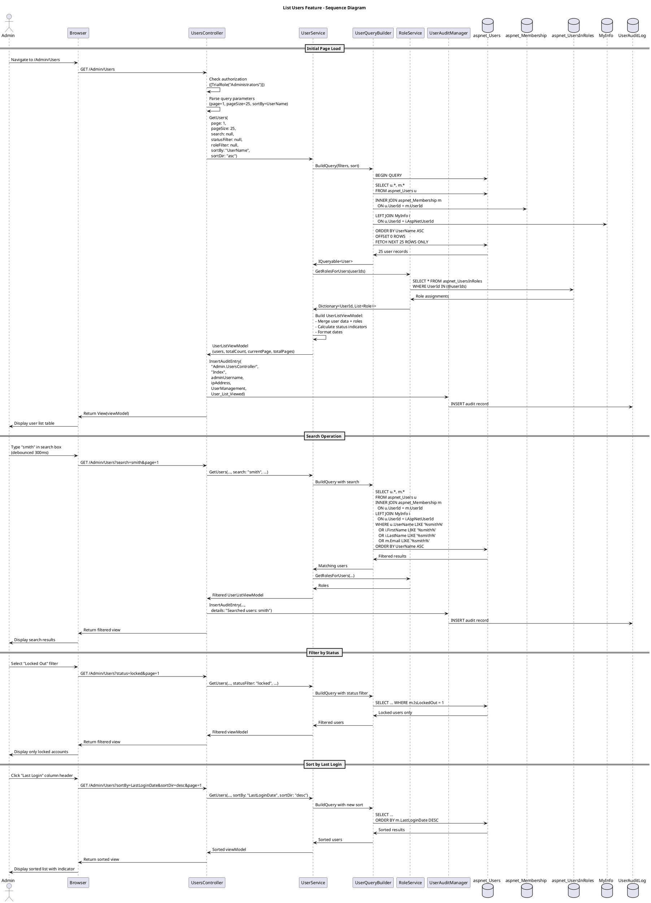

# List Users Feature Specification

## Feature Overview

### Feature Name
User Directory and Search (List Users)

### Description
Comprehensive user directory functionality that enables Gateway Admins to view, search, filter, and sort all system users. This foundational feature provides the primary interface for user selection in administrative workflows including password reset, account unlock, email changes, and role assignment. The system displays user information in a paginated, searchable table with real-time filtering capabilities and detailed status indicators.

### Business Value
- **Foundation for Admin Operations**: Serves as the entry point for all user management tasks (Work Items #497, #498, #499)
- **Visibility**: Provides complete oversight of all system users and their status
- **Efficiency**: Quick search and filter capabilities reduce time to locate specific users
- **Monitoring**: Real-time view of account statuses (active, locked, unapproved)
- **Compliance**: Audit trail of user list access for security monitoring
- **Scalability**: Pagination and indexing support thousands of users efficiently

### Target Personas
- **Gateway Admin**: Primary user accessing list for user management operations
- **System Administrator**: Monitors user accounts and system health
- **Compliance Officer**: Reviews user access and account statuses
- **Trial/Site Manager**: Views users within their trial scope (filtered view)
- **Security Officer**: Monitors for locked accounts and suspicious patterns

### Work Item Reference
Referenced as dependency in:
- Work Item #497 (Assign Roles) - depends on List Users
- Work Item #498 (Unlock Account) - depends on List Users
- Work Item #499 (Reset Password) - depends on List Users

---

## Requirements

### Functional Requirements

**FR-001: User List Display**
- System MUST display paginated list of all system users
- System MUST show the following columns:
  - Username
  - Full Name (First + Last)
  - Email Address
  - Assigned Roles (comma-separated)
  - Account Status (Active, Locked Out, Unapproved)
  - Last Login Date
  - Creation Date
  - Actions (dropdown menu)
- System MUST handle empty state (no users)
- System MUST display loading indicator during data fetch

**FR-002: Pagination**
- System MUST paginate results (default 25 users per page)
- System MUST support configurable page sizes (10, 25, 50, 100)
- System MUST display pagination controls (First, Previous, Next, Last)
- System MUST display current page and total pages (e.g., "Page 3 of 12")
- System MUST display total user count
- System MUST preserve pagination state during search/filter operations

**FR-003: Search Functionality**
- System MUST provide search box for real-time filtering
- System MUST search across multiple fields:
  - Username (partial match, case-insensitive)
  - First Name (partial match, case-insensitive)
  - Last Name (partial match, case-insensitive)
  - Email (partial match, case-insensitive)
- System MUST display search results as user types (debounced, 300ms delay)
- System MUST highlight search terms in results (optional enhancement)
- System MUST display message when no results found
- System MUST provide "Clear Search" button

**FR-004: Filtering**
- System MUST provide filter by Account Status:
  - All Users (default)
  - Active Users (IsApproved=true, IsLockedOut=false)
  - Locked Out (IsLockedOut=true)
  - Unapproved (IsApproved=false)
- System MUST provide filter by Role:
  - All Roles (default)
  - Gateway User
  - Trial Coordinator
  - Trial Manager
  - Gateway Admin
  - System Admin
- System MUST support combining search with filters
- System MUST display active filter indicators

**FR-005: Sorting**
- System MUST support sorting by columns:
  - Username (ascending/descending)
  - Full Name (ascending/descending)
  - Email (ascending/descending)
  - Last Login Date (ascending/descending)
  - Creation Date (ascending/descending)
- System MUST indicate current sort column and direction (arrow icons)
- System MUST default to Username ascending
- System MUST preserve sort state during pagination

**FR-006: User Actions Menu**
- System MUST provide action menu for each user row:
  - View Details (navigate to user details page)
  - Edit User (navigate to edit page)
  - Reset Password (if authorized) - see reset-password.md
  - Unlock Account (if locked and authorized) - see unlock-account.md
  - Change Email (if authorized) - see change-email.md
  - Assign Roles (if authorized) - see assign-roles.md
  - Delete User (if authorized, with confirmation)
- System MUST enable/disable actions based on:
  - Admin permissions
  - User's current status (e.g., "Unlock" only if locked)
- System MUST launch dependent features via action menu

**FR-007: Status Indicators**
- System MUST display visual indicators:
  - Locked Out: Red lock icon + "Locked" badge
  - Unapproved: Yellow warning icon + "Pending" badge
  - Active: Green checkmark icon
  - Never Logged In: Gray icon + "Never logged in" text
- System MUST use color coding for quick scanning
- System MUST provide tooltips explaining status

**FR-008: Export Functionality (Optional)**
- System MAY provide "Export to CSV" button
- Export MUST include all columns currently displayed
- Export MUST respect current search/filter settings
- Export MUST include timestamp and admin username in filename
- Export MUST be logged in audit trail

**FR-009: Audit Logging**
- System MUST log when admin views user list
- System MUST log search queries performed
- System MUST log filter selections
- System MUST log export operations
- Audit entries MUST include:
  - Admin username
  - IP address
  - Timestamp
  - Action: "User Management"
  - Details: "Viewed User List" or "Searched users: {query}"

### Non-Functional Requirements

**NFR-001: Performance**
- Initial page load MUST complete within 2 seconds
- Search results MUST return within 500ms
- Pagination navigation MUST complete within 500ms
- System MUST support 10,000+ users efficiently
- Database queries MUST use indexed columns

**NFR-002: Security**
- Admin MUST be authenticated and authorized
- Admin MUST have "View Users" permission minimum
- Sensitive data (passwords) MUST NOT be displayed
- User list access MUST be logged in audit trail
- System MUST prevent SQL injection in search queries

**NFR-003: Usability**
- Search box MUST have clear placeholder text
- Filters MUST have clear labels
- Table MUST be responsive (mobile-friendly)
- Empty states MUST provide helpful guidance
- Loading states MUST be clearly indicated
- Keyboard navigation MUST be supported

**NFR-004: Accessibility**
- Table MUST have proper ARIA labels
- Sort controls MUST be keyboard-accessible
- Screen readers MUST announce sort changes
- Color indicators MUST have text labels (not color-only)
- WCAG 2.1 AA compliance required

**NFR-005: Maintainability**
- Code MUST separate data access, business logic, presentation
- Table rendering MUST use reusable component
- Column configuration MUST be externalized
- Pagination logic MUST be reusable across application

### Business Rules

**BR-001: User Visibility**
- System Admins see ALL users across all trials
- Trial Managers see users within their assigned trials only
- Gateway Admins see all Gateway users (not trial-specific)
- Filtering based on admin scope is automatic

**BR-002: Default View**
- Default sort: Username ascending
- Default filter: All Users, All Roles
- Default page size: 25 users per page
- Default state persisted in user preferences (optional)

**BR-003: Account Status Logic**
- Active: IsApproved=true AND IsLockedOut=false
- Locked Out: IsLockedOut=true (regardless of IsApproved)
- Unapproved: IsApproved=false AND IsLockedOut=false
- Deleted users NOT displayed (soft delete assumed)

**BR-004: Last Login Display**
- Show actual last login date if available
- Show "Never" if LastLoginDate equals CreateDate
- Show relative time for recent logins (e.g., "2 hours ago")
- Show absolute date for older logins

**BR-005: Role Display**
- Display all roles assigned to user (comma-separated)
- Display "No Roles" if user has no role assignments
- Roles sorted alphabetically in display
- Role names displayed as friendly names (not database keys)

**BR-006: Search Behavior**
- Search is case-insensitive
- Search uses partial matching (LIKE %term%)
- Multiple search terms separated by space treated as AND
- Empty search shows all users (respecting filters)

### Compliance Requirements

**COMP-001: 21 CFR Part 11 - Audit Trail**
- System MUST log admin access to user lists
- Audit trail MUST be tamper-proof (insert-only)
- Search operations MUST be auditable
- Audit records retained per retention policy

**COMP-002: Data Privacy (GDPR/HIPAA)**
- System MUST NOT display sensitive personal data unnecessarily
- Export functionality MUST comply with data minimization
- User list access MUST be justified and logged
- Access logs available for privacy audits

**COMP-003: Access Control**
- Role-based access control enforced
- Principle of least privilege applied
- Unauthorized access attempts logged and blocked

---

## User Stories

### Story 1: View All Users
```gherkin
Given I am a Gateway Admin with user view permissions
  And I am authenticated in the system
When I navigate to /Admin/Users
Then I should see a paginated list of all users
  And I should see columns: Username, Name, Email, Roles, Status, Last Login
  And users should be sorted by Username ascending
  And I should see pagination controls
  And page size should default to 25 users
  And an audit log entry should record "Viewed User List"
```

### Story 2: Search for Specific User
```gherkin
Given I am viewing the user list
  And the system contains users: "jsmith", "jdoe", "ajones"
When I type "smith" in the search box
Then the list should filter to show only users matching "smith"
  And I should see "jsmith" in the results
  And I should not see "jdoe" or "ajones"
  And the search should work across username, name, and email fields
  And an audit log entry should record "Searched users: smith"
```

### Story 3: Filter by Account Status
```gherkin
Given I am viewing the user list
  And the system contains:
    | Username | IsLockedOut | IsApproved |
    | user1    | false       | true       |
    | user2    | true        | true       |
    | user3    | false       | false      |
When I select filter "Locked Out"
Then I should see only "user2" in the results
  And the filter indicator should show "Locked Out" is active
  And pagination should reset to page 1
```

### Story 4: Sort by Last Login
```gherkin
Given I am viewing the user list
  And users have various last login dates
When I click the "Last Login" column header
Then the list should sort by Last Login ascending
  And a sort indicator (up arrow) should appear next to "Last Login"
When I click the "Last Login" column header again
Then the list should sort by Last Login descending
  And the sort indicator should change to down arrow
  And pagination should remain on current page
```

### Story 5: Access User Actions
```gherkin
Given I am viewing the user list
  And I have permissions for password reset and role assignment
When I click the Actions dropdown for user "jsmith"
Then I should see menu options:
  | Action          | Enabled |
  | View Details    | Yes     |
  | Edit User       | Yes     |
  | Reset Password  | Yes     |
  | Unlock Account  | No      | (user not locked)
  | Change Email    | Yes     |
  | Assign Roles    | Yes     |
When I select "Reset Password"
Then I should be navigated to the Reset Password workflow for "jsmith"
  And the user "jsmith" should be pre-selected
```

### Story 6: Paginate Through Users
```gherkin
Given the system contains 100 users
  And page size is set to 25
When I am on page 1
Then I should see users 1-25
  And I should see "Page 1 of 4" indicator
  And "Previous" and "First" buttons should be disabled
When I click "Next"
Then I should see users 26-50
  And I should see "Page 2 of 4" indicator
  And all navigation buttons should be enabled
```

### Story 7: Identify Locked Accounts
```gherkin
Given I am viewing the user list
  And user "jsmith" has IsLockedOut=true
When the list displays
Then I should see a red lock icon next to "jsmith"
  And I should see a "Locked" badge in red
  And the "Unlock Account" action should be enabled for "jsmith"
  And tooltip should explain "Account locked due to failed login attempts"
```

---

## Design

### Architecture Diagram

```plantuml
@startuml List Users Architecture
!include https://raw.githubusercontent.com/plantuml-stdlib/C4-PlantUML/master/C4_Component.puml

title List Users Feature - Component Diagram

Container_Boundary(web, "Web Application") {
    Component(controller, "UsersController", "ASP.NET MVC Controller", "Handles list/search/filter requests")
    Component(view, "Index View", "Razor View", "Renders user list table")
    Component(userService, "UserService", "Service Layer", "User query and filtering logic")
    Component(roleService, "RoleService", "Service Layer", "Role resolution for users")
}

Container_Boundary(business, "Business Layer") {
    Component(auditMgr, "UserAuditManager", "Audit Manager", "Logs list access and searches")
    Component(queryBuilder, "UserQueryBuilder", "Query Builder", "Builds dynamic LINQ queries")
}

Container_Boundary(data, "Data Layer") {
    ComponentDb(users, "aspnet_Users", "SQL Server Table", "User identities")
    ComponentDb(membership, "aspnet_Membership", "SQL Server Table", "User status and dates")
    ComponentDb(roles, "aspnet_UsersInRoles", "SQL Server Table", "Role assignments")
    ComponentDb(myinfo, "MyInfo", "SQL Server Table", "Extended user profiles")
    ComponentDb(auditDb, "UserAuditLog", "SQL Server Table", "Audit trail")
}

Rel(controller, view, "Renders", "HTML")
Rel(view, controller, "GET with query params", "HTTP")
Rel(controller, userService, "GetUsers", "Method call")
Rel(controller, roleService, "GetUserRoles", "Method call")
Rel(controller, auditMgr, "InsertAuditEntry", "Method call")
Rel(userService, queryBuilder, "BuildQuery", "LINQ expression")
Rel(queryBuilder, users, "SELECT with filters", "Entity Framework")
Rel(queryBuilder, membership, "JOIN for status", "Entity Framework")
Rel(roleService, roles, "SELECT roles", "Entity Framework")
Rel(userService, myinfo, "JOIN for names", "Entity Framework")
Rel(auditMgr, auditDb, "INSERT audit record", "Entity Framework")

note right of queryBuilder
  Dynamic query building:
  - Search terms (WHERE UserName LIKE)
  - Status filters (WHERE IsLockedOut=)
  - Role filters (JOIN UsersInRoles)
  - Sorting (ORDER BY)
  - Pagination (SKIP/TAKE)
end note

note right of controller
  Query string parameters:
  - page (default: 1)
  - pageSize (default: 25)
  - search (optional)
  - status (optional)
  - role (optional)
  - sortBy (default: UserName)
  - sortDir (default: asc)
end note

@enduml
```

#### ASCII Diagram

```
┌────────────────────────────────────────────────────────────────────┐
│           List Users Feature - Component Architecture              │
└────────────────────────────────────────────────────────────────────┘

┌──────────────────────────────────────────────────────────────────────┐
│  Web Application Layer                                              │
│                                                                      │
│  ┌────────────────────┐           ┌──────────────────────────────┐  │
│  │  Index View        │◄──renders──│  UsersController             │  │
│  │  (Razor)           │            │  (MVC Controller)            │  │
│  │                    │            │                              │  │
│  │  - User table      │            │  - GET Index(query params)   │  │
│  │  - Search box      │──queries───►│  - Search/filter/sort       │  │
│  │  - Filters         │            │  - Pagination                │  │
│  │  - Pagination      │            │  - Actions menu              │  │
│  │  - Actions menu    │            │  - Log audit events          │  │
│  └────────────────────┘            └──┬────────┬──────────┬────────┘  │
└───────────────────────────────────────┼────────┼──────────┼───────────┘
                                        │        │          │
                                        ▼        ▼          ▼
┌───────────────────────────────────────────────────────────────────────┐
│  Business Layer                                                       │
│                                                                       │
│  ┌──────────────────────────┐  ┌──────────────────────────────────┐  │
│  │ UserService              │  │ RoleService                      │  │
│  │                          │  │                                  │  │
│  │  - GetUsers()            │  │  - GetUserRoles(userIds)         │  │
│  │  - Apply filters         │  │  - Returns Dictionary            │  │
│  │  - Apply sorting         │  │    <UserId, List<Role>>          │  │
│  │  - Apply pagination      │  └──────────────────────────────────┘  │
│  └─────────────┬────────────┘                                         │
│                │                                                      │
│  ┌─────────────▼────────────┐  ┌──────────────────────────────────┐  │
│  │ UserQueryBuilder         │  │ UserAuditManager                 │  │
│  │                          │  │                                  │  │
│  │  - BuildQuery()          │  │  - InsertAuditEntry()            │  │
│  │  - Dynamic LINQ          │  │  - Log list views                │  │
│  │  - Search filters        │  │  - Log search queries            │  │
│  │  - WHERE clauses         │  └──────────────────────────────────┘  │
│  │  - ORDER BY clauses      │                                         │
│  │  - SKIP/TAKE (paging)    │                                         │
│  └──────────────┬───────────┘                                         │
└─────────────────┼───────────────────────────────────────────────────┘
                  │
                  ▼
┌───────────────────────────────────────────────────────────────────────┐
│  Data Layer (SQL Server)                                             │
│                                                                       │
│  ┌──────────────────────────┐  ┌──────────────────────────────────┐  │
│  │ aspnet_Users             │  │ aspnet_Membership                │  │
│  ├──────────────────────────┤  ├──────────────────────────────────┤  │
│  │  UserId (PK)             │  │  UserId (PK, FK)                 │  │
│  │  UserName (indexed)      │  │  Email (indexed)                 │  │
│  │  LoweredUserName (idx)   │  │  LoweredEmail (indexed)          │  │
│  └──────────────────────────┘  │  IsApproved                      │  │
│                                 │  IsLockedOut                     │  │
│  ┌──────────────────────────┐  │  LastLoginDate                   │  │
│  │ MyInfo                   │  │  CreateDate                      │  │
│  ├──────────────────────────┤  └──────────────────────────────────┘  │
│  │  AspNetUserId (FK)       │                                         │
│  │  FirstName (indexed)     │  ┌──────────────────────────────────┐  │
│  │  LastName (indexed)      │  │ aspnet_UsersInRoles              │  │
│  │  Phone                   │  ├──────────────────────────────────┤  │
│  └──────────────────────────┘  │  UserId (PK, FK)                 │  │
│                                 │  RoleId (PK, FK)                 │  │
│  ┌──────────────────────────┐  └──────────────────────────────────┘  │
│  │ UserAuditLog             │                                         │
│  ├──────────────────────────┤  ┌──────────────────────────────────┐  │
│  │  UserAuditLogID (PK)     │  │ aspnet_Roles                     │  │
│  │  UserName                │  ├──────────────────────────────────┤  │
│  │  ControllerName          │  │  RoleId (PK)                     │  │
│  │  ActionName              │  │  RoleName                        │  │
│  │  AuditAction             │  └──────────────────────────────────┘  │
│  │  Details                 │                                         │
│  │  IPAddress               │                                         │
│  │  CreatedOn (indexed)     │                                         │
│  └──────────────────────────┘                                         │
└───────────────────────────────────────────────────────────────────────┘

Query Flow:
  1. Admin navigates to /Admin/Users with optional query params
  2. UsersController receives request with filters/search/sort/page
  3. UserService builds dynamic LINQ query via UserQueryBuilder
  4. QueryBuilder joins: aspnet_Users + aspnet_Membership + MyInfo
  5. Applies WHERE clauses for search (username, email, names)
  6. Applies WHERE clauses for status filters (locked, unapproved)
  7. Applies ORDER BY for sorting (username, email, last login, etc.)
  8. Applies SKIP/TAKE for pagination
  9. Executes query, gets paginated results
  10. RoleService separately queries aspnet_UsersInRoles for roles
  11. Controller merges user data + roles into ViewModel
  12. UserAuditManager logs list view/search operation
  13. View renders table with pagination and filters

Key Performance Features:
  • Indexed columns for fast searches (LoweredUserName, LoweredEmail)
  • Separate query for roles to avoid cartesian product
  • COUNT(*) OVER() window function for total count
  • Pagination with OFFSET/FETCH for efficiency
  • Query builder uses parameterized queries (SQL injection safe)
```

### Workflow Diagram



#### ASCII Diagram

```
List Users Feature - Sequence Diagram (Search/Filter/Sort/Paginate)

Admin    Browser    Controller    UserService    QueryBuilder    RoleService    AuditMgr    DB
  │          │            │             │              │              │            │         │
  ├─Navigate─►            │             │              │              │            │         │
  │ /Users   │            │             │              │              │            │         │
  │ ?search=smith         │             │              │              │            │         │
  │ &status=active        │             │              │              │            │         │
  │ &page=2               │             │              │              │            │         │
  │          ├──GET───────►             │              │              │            │         │
  │          │  /Users    │             │              │              │            │         │
  │          │            │             │              │              │            │         │
  │          │            ├─GetUsers────►              │              │            │         │
  │          │            │ (search,    │              │              │            │         │
  │          │            │  filters,   │              │              │            │         │
  │          │            │  sort,      │              │              │            │         │
  │          │            │  page)      │              │              │            │         │
  │          │            │             │              │              │            │         │
  │          │            │             ├─BuildQuery───►              │            │         │
  │          │            │             │              │              │            │         │
  │          │            │             │              ├─SELECT u.*, m.*, i.*──────►
  │          │            │             │              │ FROM aspnet_Users u      │         │
  │          │            │             │              │ JOIN aspnet_Membership m │         │
  │          │            │             │              │ LEFT JOIN MyInfo i       │         │
  │          │            │             │              │ WHERE u.UserName LIKE    │         │
  │          │            │             │              │   '%smith%'              │         │
  │          │            │             │              │   OR i.FirstName LIKE    │         │
  │          │            │             │              │   '%smith%'              │         │
  │          │            │             │              │   AND m.IsApproved=1     │         │
  │          │            │             │              │   AND m.IsLockedOut=0    │         │
  │          │            │             │              │ ORDER BY UserName ASC    │         │
  │          │            │             │              │ OFFSET 25 ROWS           │         │
  │          │            │             │              │ FETCH NEXT 25 ROWS ONLY  │         │
  │          │            │             │              │                          │         │
  │          │            │             │              │◄─User records (page 2)───────────┤
  │          │            │             │◄─User list───┤              │            │         │
  │          │            │             │              │              │            │         │
  │          │            │             ├─GetUserRoles─────────────────►            │         │
  │          │            │             │ (userIds)    │              │            │         │
  │          │            │             │              │              │            │         │
  │          │            │             │              │              ├─SELECT─────────────►
  │          │            │             │              │              │ RoleId    │         │
  │          │            │             │              │              │ FROM      │         │
  │          │            │             │              │              │ aspnet_   │         │
  │          │            │             │              │              │ UsersIn   │         │
  │          │            │             │              │              │ Roles     │         │
  │          │            │             │              │              │           │         │
  │          │            │             │◄─────────────────Dictionary<UserId,────────────┤
  │          │            │             │              │    List<Role>>│           │         │
  │          │            │             │              │              │            │         │
  │          │            │             ├─Build ViewModel──────────────────────────────────┤
  │          │            │             │ (merge users + roles)        │            │         │
  │          │            │◄─ViewModel──┤              │              │            │         │
  │          │            │ (users,     │              │              │            │         │
  │          │            │  page info, │              │              │            │         │
  │          │            │  filters)   │              │              │            │         │
  │          │            │             │              │              │            │         │
  │          │            ├─────────────────InsertAuditEntry("Searched: smith")────►         │
  │          │            │             │              │              │            ├─INSERT──►
  │          │            │             │              │              │            │         │
  │          │◄─Render────┤             │              │              │            │         │
  │          │  Table     │             │              │              │            │         │
  │◄─Display─┤            │             │              │              │            │         │
  │ Results  │            │             │              │              │            │         │
  │ Page 2   │            │             │              │              │            │         │
  │ 26-50    │            │             │              │              │            │         │
  │          │            │             │              │              │            │         │

Key Operations:
  • Initial Load: Page 1, no filters, default sort (UserName ASC)
  • Search: Filters across username, email, first name, last name
  • Status Filter: Active (IsApproved=1, IsLockedOut=0), Locked, Unapproved
  • Sort: Click column headers to sort ASC/DESC
  • Paginate: Navigate between pages (OFFSET/FETCH)
  • Roles: Separate query to avoid cartesian product

Performance Optimizations:
  1. Indexed columns used in WHERE/ORDER BY
  2. COUNT(*) OVER() for total without second query
  3. Roles fetched separately for only visible users
  4. Parameterized queries prevent SQL injection
```

### Data Model

#### View Models

**UserListViewModel**
```csharp
public class UserListViewModel
{
    // Pagination
    public List<UserListItemViewModel> Users { get; set; }
    public int CurrentPage { get; set; }
    public int PageSize { get; set; }
    public int TotalUsers { get; set; }
    public int TotalPages { get; set; }

    // Search and Filter
    public string SearchQuery { get; set; }
    public string StatusFilter { get; set; }
    public string RoleFilter { get; set; }

    // Sorting
    public string SortBy { get; set; }
    public string SortDirection { get; set; }

    // Helper Properties
    public bool HasPreviousPage => CurrentPage > 1;
    public bool HasNextPage => CurrentPage < TotalPages;
    public int StartRecord => (CurrentPage - 1) * PageSize + 1;
    public int EndRecord => Math.Min(CurrentPage * PageSize, TotalUsers);
}

public class UserListItemViewModel
{
    public Guid UserId { get; set; }
    public string UserName { get; set; }
    public string Email { get; set; }
    public string FirstName { get; set; }
    public string LastName { get; set; }
    public string FullName => $"{FirstName} {LastName}".Trim();

    // Status
    public bool IsApproved { get; set; }
    public bool IsLockedOut { get; set; }
    public string StatusText { get; set; } // "Active", "Locked", "Unapproved"
    public string StatusCssClass { get; set; } // "status-active", "status-locked", etc.

    // Dates
    public DateTime CreateDate { get; set; }
    public DateTime LastLoginDate { get; set; }
    public string LastLoginDisplay { get; set; } // "2 hours ago", "Never", "Jan 12, 2025"

    // Roles
    public List<string> Roles { get; set; }
    public string RolesDisplay => Roles.Any() ? string.Join(", ", Roles) : "No Roles";

    // Actions
    public bool CanResetPassword { get; set; }
    public bool CanUnlock { get; set; }
    public bool CanChangeEmail { get; set; }
    public bool CanAssignRoles { get; set; }
    public bool CanDelete { get; set; }
}
```

#### Database Query

**Optimized User List Query**
```sql
-- Efficient query with all required data
SELECT
    u.UserId,
    u.UserName,
    m.Email,
    m.IsApproved,
    m.IsLockedOut,
    m.CreateDate,
    m.LastLoginDate,
    i.FirstName,
    i.LastName,
    -- Calculate total count for pagination (window function)
    COUNT(*) OVER() as TotalCount
FROM aspnet_Users u
INNER JOIN aspnet_Membership m ON u.UserId = m.UserId
LEFT JOIN MyInfo i ON u.UserId = i.AspNetUserId
WHERE
    u.ApplicationId = @applicationId
    -- Search filter (if provided)
    AND (
        @searchTerm IS NULL
        OR u.UserName LIKE '%' + @searchTerm + '%'
        OR m.Email LIKE '%' + @searchTerm + '%'
        OR i.FirstName LIKE '%' + @searchTerm + '%'
        OR i.LastName LIKE '%' + @searchTerm + '%'
    )
    -- Status filter (if provided)
    AND (
        @statusFilter IS NULL
        OR (@statusFilter = 'active' AND m.IsApproved = 1 AND m.IsLockedOut = 0)
        OR (@statusFilter = 'locked' AND m.IsLockedOut = 1)
        OR (@statusFilter = 'unapproved' AND m.IsApproved = 0)
    )
ORDER BY
    CASE @sortBy
        WHEN 'UserName' THEN u.UserName
        WHEN 'Email' THEN m.Email
        WHEN 'FullName' THEN i.LastName
    END ASC/DESC,
    CASE @sortBy
        WHEN 'CreateDate' THEN m.CreateDate
        WHEN 'LastLoginDate' THEN m.LastLoginDate
    END ASC/DESC
OFFSET @offset ROWS
FETCH NEXT @pageSize ROWS ONLY;

-- Separate query for roles (to avoid cartesian product)
SELECT
    uir.UserId,
    r.RoleName
FROM aspnet_UsersInRoles uir
INNER JOIN aspnet_Roles r ON uir.RoleId = r.RoleId
WHERE uir.UserId IN (@userIds)
ORDER BY r.RoleName;
```

### API Contracts

#### Endpoint: GET /Admin/Users

**Purpose**: Display user list with search, filter, sort, pagination

**Authorization**: Requires "Administrators" or "UserViewers" role

**Request**:
```http
GET /Admin/Users?page=2&pageSize=25&search=smith&status=active&sortBy=LastLoginDate&sortDir=desc HTTP/1.1
Host: gateway.itrica.com
Cookie: .ASPXAUTH=<authenticated-admin-cookie>
```

**Query Parameters**:
```typescript
{
  page?: number;          // Default: 1
  pageSize?: number;      // Default: 25, Options: 10, 25, 50, 100
  search?: string;        // Search term (optional)
  status?: string;        // "all" | "active" | "locked" | "unapproved" (default: "all")
  role?: string;          // Role name filter (optional)
  sortBy?: string;        // "UserName" | "FullName" | "Email" | "LastLoginDate" | "CreateDate"
  sortDir?: string;       // "asc" | "desc" (default: "asc")
}
```

**Response**: 200 OK (HTML View)
```html
<!-- Razor view with UserListViewModel -->
<div class="user-list-container">
  <div class="search-filter-bar">
    <input type="text" id="searchBox" placeholder="Search users..." value="@Model.SearchQuery" />
    <select id="statusFilter">
      <option value="all">All Users</option>
      <option value="active" selected="@(Model.StatusFilter == "active")">Active</option>
      <option value="locked">Locked Out</option>
      <option value="unapproved">Unapproved</option>
    </select>
  </div>

  <table class="user-list-table">
    <thead>
      <tr>
        <th data-sort="UserName" class="sortable active asc">
          Username <span class="sort-indicator">▲</span>
        </th>
        <th data-sort="FullName" class="sortable">Full Name</th>
        <th data-sort="Email" class="sortable">Email</th>
        <th>Roles</th>
        <th>Status</th>
        <th data-sort="LastLoginDate" class="sortable">Last Login</th>
        <th>Actions</th>
      </tr>
    </thead>
    <tbody>
      @foreach (var user in Model.Users)
      {
        <tr>
          <td>@user.UserName</td>
          <td>@user.FullName</td>
          <td>@user.Email</td>
          <td>@user.RolesDisplay</td>
          <td>
            <span class="status-badge @user.StatusCssClass">
              @user.StatusText
            </span>
          </td>
          <td>@user.LastLoginDisplay</td>
          <td>
            <div class="dropdown">
              <button class="btn-actions">Actions ▼</button>
              <div class="dropdown-menu">
                <a href="/Admin/Users/@user.UserId">View Details</a>
                <a href="/Admin/Users/@user.UserId/Edit">Edit User</a>
                @if (user.CanResetPassword)
                {
                  <a href="/Admin/Users/@user.UserId/ResetPassword">Reset Password</a>
                }
                @if (user.CanUnlock)
                {
                  <a href="/Admin/Users/@user.UserId/Unlock">Unlock Account</a>
                }
                <a href="/Admin/Users/@user.UserId/ChangeEmail">Change Email</a>
                <a href="/Admin/Users/@user.UserId/AssignRoles">Assign Roles</a>
              </div>
            </div>
          </td>
        </tr>
      }
    </tbody>
  </table>

  <div class="pagination">
    <span>Showing @Model.StartRecord-@Model.EndRecord of @Model.TotalUsers users</span>
    <div class="pagination-controls">
      <a href="?page=1&..." class="btn-page" @(!Model.HasPreviousPage ? "disabled" : "")>First</a>
      <a href="?page=@(Model.CurrentPage - 1)&..." class="btn-page" @(!Model.HasPreviousPage ? "disabled" : "")>Previous</a>
      <span>Page @Model.CurrentPage of @Model.TotalPages</span>
      <a href="?page=@(Model.CurrentPage + 1)&..." class="btn-page" @(!Model.HasNextPage ? "disabled" : "")>Next</a>
      <a href="?page=@Model.TotalPages&..." class="btn-page" @(!Model.HasNextPage ? "disabled" : "")>Last</a>
    </div>
  </div>
</div>
```

**Response - JSON (AJAX variant)**:
```json
{
  "users": [
    {
      "userId": "a1b2c3d4-...",
      "userName": "jsmith",
      "fullName": "John Smith",
      "email": "jsmith@example.com",
      "roles": ["Gateway User", "Trial Coordinator"],
      "isApproved": true,
      "isLockedOut": false,
      "statusText": "Active",
      "lastLoginDate": "2026-01-12T14:30:00Z",
      "lastLoginDisplay": "2 hours ago",
      "createDate": "2025-06-01T09:00:00Z",
      "canResetPassword": true,
      "canUnlock": false,
      "canChangeEmail": true,
      "canAssignRoles": true
    }
  ],
  "currentPage": 2,
  "pageSize": 25,
  "totalUsers": 150,
  "totalPages": 6,
  "searchQuery": "smith",
  "statusFilter": "active"
}
```

---

## Implementation Details

### Technology Stack

**Framework**:
- ASP.NET MVC 4.x/5.x (.NET Framework)
- C# language
- Razor view engine
- jQuery for client-side interactions

**Data Access**:
- Entity Framework 6.x for queries
- LINQ for dynamic query building
- SQL Server for data storage

**UI Components**:
- Bootstrap for responsive table
- DataTables.js (optional enhancement) for advanced table features
- Font Awesome for icons
- Custom CSS for status badges

### Dependencies

**NuGet Packages**:
```xml
<packages>
  <package id="Microsoft.AspNet.Mvc" version="5.x" />
  <package id="EntityFramework" version="6.x" />
  <package id="jQuery" version="3.x" />
  <package id="Bootstrap" version="4.x" />
</packages>
```

**Project References**:
```
OoBDev.Web.Controllers
├── OoBDev.Web.Models (UserListViewModel)
├── OoBDev.Gateway.Access (UserService, RoleService, UserAuditManager)
├── OoBDev.Gateway.Data (GatewayEntities)
├── OoBDev.Gateway.Models (aspnet_Users, aspnet_Membership, MyInfo)
└── OoBDev.Web.Mvc (Authorization attributes, Pagination helpers)
```

### Security Considerations

**Authorization**:
```csharp
[TrialRole("Administrators", "UserViewers")]
public class UsersController : Controller
{
    public ActionResult Index(UserListQuery query)
    {
        // View permission required minimum
        // Specific actions require additional permissions
    }
}
```

**SQL Injection Prevention**:
```csharp
// SAFE: Parameterized query via LINQ
var users = db.aspnet_Users
    .Where(u => u.UserName.Contains(searchTerm)) // Parameterized
    .ToList();

// NEVER do this:
// var users = db.Database.SqlQuery($"SELECT * FROM aspnet_Users WHERE UserName LIKE '%{searchTerm}%'");
```

**Audit Logging**:
```csharp
public ActionResult Index(UserListQuery query)
{
    var auditDetails = query.Search != null
        ? $"Searched users: {query.Search}"
        : "Viewed User List";

    auditManager.InsertAuditEntry(
        "Admin.UsersController",
        "Index",
        User.Identity.Name,
        Request.UserHostAddress,
        UserAuditActions.UserManagement,
        UserAuditDetails.User_List_Viewed,
        details: auditDetails
    );

    // ... proceed with query
}
```

### Code Patterns

**Pattern 1: Dynamic Query Building with LINQ**
```csharp
public class UserService
{
    public UserListViewModel GetUsers(UserListQuery query)
    {
        using (var db = new GatewayEntities())
        {
            // Start with base query
            var usersQuery = from u in db.aspnet_Users
                           join m in db.aspnet_Membership on u.UserId equals m.UserId
                           join i in db.MyInfos on u.UserId equals i.AspNetUserId into infos
                           from info in infos.DefaultIfEmpty()
                           where u.ApplicationId == applicationId
                           select new { u, m, info };

            // Apply search filter if provided
            if (!string.IsNullOrWhiteSpace(query.Search))
            {
                var searchLower = query.Search.ToLower();
                usersQuery = usersQuery.Where(x =>
                    x.u.UserName.ToLower().Contains(searchLower) ||
                    x.m.Email.ToLower().Contains(searchLower) ||
                    x.info.FirstName.ToLower().Contains(searchLower) ||
                    x.info.LastName.ToLower().Contains(searchLower)
                );
            }

            // Apply status filter
            switch (query.StatusFilter)
            {
                case "active":
                    usersQuery = usersQuery.Where(x => x.m.IsApproved && !x.m.IsLockedOut);
                    break;
                case "locked":
                    usersQuery = usersQuery.Where(x => x.m.IsLockedOut);
                    break;
                case "unapproved":
                    usersQuery = usersQuery.Where(x => !x.m.IsApproved);
                    break;
            }

            // Get total count before pagination
            var totalCount = usersQuery.Count();

            // Apply sorting
            usersQuery = ApplySorting(usersQuery, query.SortBy, query.SortDirection);

            // Apply pagination
            var users = usersQuery
                .Skip((query.Page - 1) * query.PageSize)
                .Take(query.PageSize)
                .ToList();

            // Get roles for these users
            var userIds = users.Select(x => x.u.UserId).ToList();
            var roles = GetRolesForUsers(userIds);

            // Build view model
            var viewModel = new UserListViewModel
            {
                Users = users.Select(x => new UserListItemViewModel
                {
                    UserId = x.u.UserId,
                    UserName = x.u.UserName,
                    Email = x.m.Email,
                    FirstName = x.info?.FirstName,
                    LastName = x.info?.LastName,
                    IsApproved = x.m.IsApproved,
                    IsLockedOut = x.m.IsLockedOut,
                    CreateDate = x.m.CreateDate,
                    LastLoginDate = x.m.LastLoginDate,
                    Roles = roles.ContainsKey(x.u.UserId) ? roles[x.u.UserId] : new List<string>(),
                    StatusText = GetStatusText(x.m.IsApproved, x.m.IsLockedOut),
                    LastLoginDisplay = FormatLastLogin(x.m.LastLoginDate, x.m.CreateDate)
                }).ToList(),
                CurrentPage = query.Page,
                PageSize = query.PageSize,
                TotalUsers = totalCount,
                TotalPages = (int)Math.Ceiling(totalCount / (double)query.PageSize),
                SearchQuery = query.Search,
                StatusFilter = query.StatusFilter,
                SortBy = query.SortBy,
                SortDirection = query.SortDirection
            };

            return viewModel;
        }
    }

    private Dictionary<Guid, List<string>> GetRolesForUsers(List<Guid> userIds)
    {
        using (var db = new GatewayEntities())
        {
            return db.aspnet_UsersInRoles
                .Where(uir => userIds.Contains(uir.UserId))
                .Join(db.aspnet_Roles, uir => uir.RoleId, r => r.RoleId, (uir, r) => new { uir.UserId, r.RoleName })
                .GroupBy(x => x.UserId)
                .ToDictionary(
                    g => g.Key,
                    g => g.Select(x => x.RoleName).OrderBy(r => r).ToList()
                );
        }
    }
}
```

**Pattern 2: Client-Side Search with Debouncing**
```javascript
// Debounced search to avoid excessive requests
var searchDebounce;
$('#searchBox').on('input', function() {
    clearTimeout(searchDebounce);
    var searchTerm = $(this).val();

    searchDebounce = setTimeout(function() {
        // Update URL and reload
        var url = updateQueryString(window.location.href, 'search', searchTerm);
        url = updateQueryString(url, 'page', '1'); // Reset to page 1
        window.location.href = url;
    }, 300); // 300ms delay
});

function updateQueryString(url, key, value) {
    var re = new RegExp("([?&])" + key + "=.*?(&|$)", "i");
    var separator = url.indexOf('?') !== -1 ? "&" : "?";
    if (url.match(re)) {
        return url.replace(re, '$1' + key + "=" + value + '$2');
    } else {
        return url + separator + key + "=" + value;
    }
}
```

**Pattern 3: Status Calculation Helper**
```csharp
public static class UserStatusHelper
{
    public static string GetStatusText(bool isApproved, bool isLockedOut)
    {
        if (isLockedOut)
            return "Locked Out";
        if (!isApproved)
            return "Unapproved";
        return "Active";
    }

    public static string GetStatusCssClass(bool isApproved, bool isLockedOut)
    {
        if (isLockedOut)
            return "status-locked";
        if (!isApproved)
            return "status-unapproved";
        return "status-active";
    }

    public static string FormatLastLogin(DateTime lastLogin, DateTime createDate)
    {
        // If never logged in (last login equals create date)
        if (lastLogin == createDate)
            return "Never";

        var diff = DateTime.Now - lastLogin;

        // Recent logins (< 24 hours)
        if (diff.TotalHours < 1)
            return $"{(int)diff.TotalMinutes} minutes ago";
        if (diff.TotalHours < 24)
            return $"{(int)diff.TotalHours} hours ago";
        if (diff.TotalDays < 7)
            return $"{(int)diff.TotalDays} days ago";

        // Older logins
        return lastLogin.ToString("MMM dd, yyyy");
    }
}
```

---

## Acceptance Criteria

**AC-001**: Admin can view paginated user list
- List displays 25 users per page by default
- Pagination controls functional (First, Previous, Next, Last)
- Total user count displayed

**AC-002**: Search filters users correctly
- Search works across username, name, email
- Search is case-insensitive
- Search results update dynamically (debounced)
- Empty search shows all users

**AC-003**: Status filter works correctly
- "Active" shows only approved, non-locked users
- "Locked Out" shows only locked users
- "Unapproved" shows only unapproved users
- Filter indicator shows active filter

**AC-004**: Sorting works correctly
- Clicking column header sorts ascending
- Clicking again sorts descending
- Sort indicator (arrow) shows direction
- Pagination preserved during sort

**AC-005**: User actions menu functional
- Menu displays available actions for each user
- Actions disabled based on user status (e.g., unlock disabled if not locked)
- Actions navigate to correct feature workflows
- Permissions control action visibility

**AC-006**: Status indicators display correctly
- Locked users show red lock icon and "Locked" badge
- Unapproved users show yellow warning and "Pending" badge
- Active users show green checkmark
- Tooltips explain status meanings

**AC-007**: Last login displayed correctly
- Recent logins show relative time ("2 hours ago")
- Never logged in shows "Never"
- Older logins show absolute date
- Timezone handled correctly

**AC-008**: Audit logging functional
- List access logged with admin username and IP
- Search operations logged with search term
- Filter operations logged
- Audit records immutable

**AC-009**: Performance acceptable
- Initial load < 2 seconds
- Search results < 500ms
- Pagination < 500ms
- Efficient queries with indexes

**AC-010**: Responsive and accessible
- Table responsive on mobile devices
- Keyboard navigation functional
- Screen reader compatible
- WCAG 2.1 AA compliant

---

## Test Scenarios

### Unit Tests

**Test**: `GetUsers_NoFilters_ReturnsAllUsers`
```csharp
[TestMethod]
public void GetUsers_NoFilters_ReturnsAllUsers()
{
    // Arrange
    var service = new UserService();
    var query = new UserListQuery { Page = 1, PageSize = 25 };

    // Act
    var result = service.GetUsers(query);

    // Assert
    Assert.IsNotNull(result);
    Assert.IsTrue(result.TotalUsers > 0);
    Assert.AreEqual(1, result.CurrentPage);
    Assert.AreEqual(25, result.PageSize);
}
```

**Test**: `GetUsers_SearchByUsername_ReturnsFilteredResults`
```csharp
[TestMethod]
public void GetUsers_SearchByUsername_ReturnsFilteredResults()
{
    // Arrange
    var service = new UserService();
    var query = new UserListQuery { Search = "smith", Page = 1, PageSize = 25 };

    // Act
    var result = service.GetUsers(query);

    // Assert
    Assert.IsTrue(result.Users.All(u =>
        u.UserName.ToLower().Contains("smith") ||
        u.Email.ToLower().Contains("smith") ||
        u.FirstName?.ToLower().Contains("smith") == true ||
        u.LastName?.ToLower().Contains("smith") == true
    ));
}
```

**Test**: `GetUsers_FilterByLocked_ReturnsOnlyLockedUsers`
```csharp
[TestMethod]
public void GetUsers_FilterByLocked_ReturnsOnlyLockedUsers()
{
    // Arrange
    var service = new UserService();
    var query = new UserListQuery { StatusFilter = "locked", Page = 1, PageSize = 25 };

    // Act
    var result = service.GetUsers(query);

    // Assert
    Assert.IsTrue(result.Users.All(u => u.IsLockedOut));
}
```

### Integration Tests

**Test**: `ListUsers_EndToEnd_DisplaysCorrectly`
```csharp
[TestMethod]
public void ListUsers_EndToEnd_DisplaysCorrectly()
{
    // Arrange
    var client = CreateAuthenticatedAdminClient();

    // Act
    var response = client.GetAsync("/Admin/Users").Result;

    // Assert
    Assert.AreEqual(HttpStatusCode.OK, response.StatusCode);
    var content = response.Content.ReadAsStringAsync().Result;
    Assert.IsTrue(content.Contains("user-list-table"));
    Assert.IsTrue(content.Contains("pagination"));
}
```

---

## Migration/Deployment Considerations

### Database Indexes

**Required Indexes**:
```sql
-- Username search performance
CREATE NONCLUSTERED INDEX IX_aspnet_Users_UserName
ON aspnet_Users (LoweredUserName)
INCLUDE (UserId, UserName);

-- Email search performance
CREATE NONCLUSTERED INDEX IX_aspnet_Membership_Email
ON aspnet_Membership (LoweredEmail)
INCLUDE (UserId, IsApproved, IsLockedOut, LastLoginDate);

-- MyInfo name search
CREATE NONCLUSTERED INDEX IX_MyInfo_Names
ON MyInfo (FirstName, LastName)
INCLUDE (AspNetUserId);

-- Role filtering
CREATE NONCLUSTERED INDEX IX_aspnet_UsersInRoles_UserId
ON aspnet_UsersInRoles (UserId)
INCLUDE (RoleId);
```

### Configuration

**Web.config**:
```xml
<appSettings>
  <add key="UserList.DefaultPageSize" value="25" />
  <add key="UserList.MaxPageSize" value="100" />
  <add key="UserList.SearchDebounceMs" value="300" />
</appSettings>
```

### Deployment Steps

1. Deploy database indexes
2. Deploy code (UsersController, UserService, Views)
3. Test with production-like data volume
4. Monitor query performance
5. Verify audit logging

---

## Related Documentation

- [Create User Feature Specification](./create-user.md)
- [Reset Password Feature Specification](./reset-password.md)
- [Unlock Account Feature Specification](./unlock-account.md)
- [Change Email Feature Specification](./change-email.md)
- [Assign Roles Feature Specification](./assign-roles.md)
- [Admin Use Cases](/current/src/docs/architecture/admin/use-cases.md)

---

**Document Version**: 1.0
**Last Updated**: January 2026
**Status**: Implementation-Ready
**Compliance**: 21 CFR Part 11, GDPR
