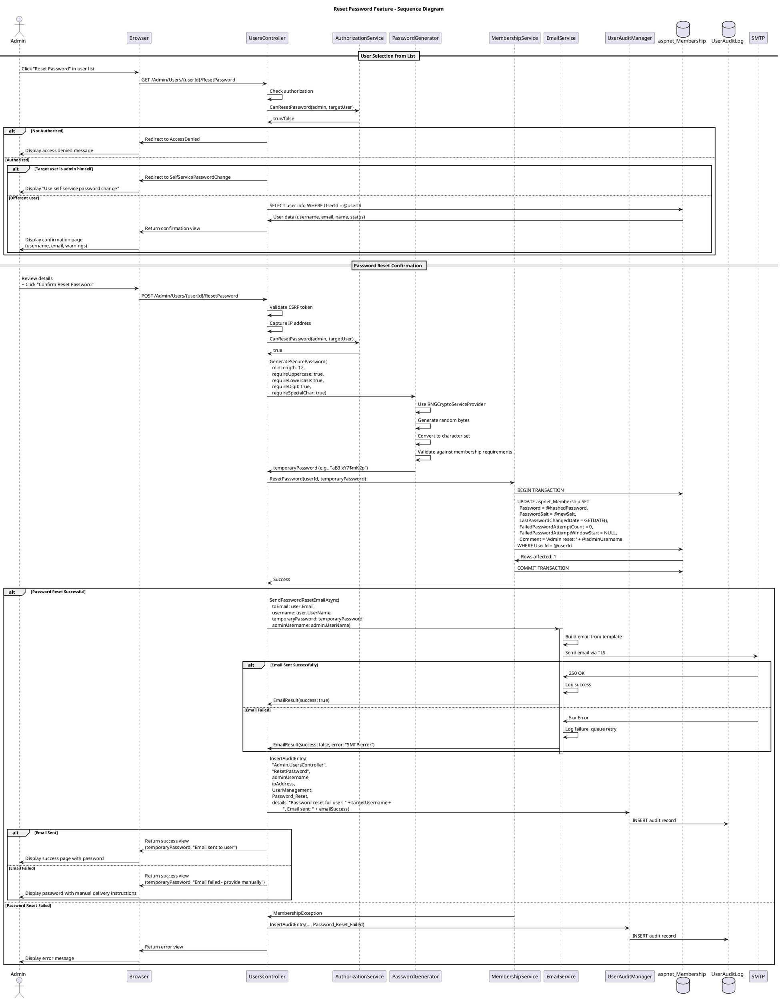

# Reset Password (Admin) Feature Specification

## Feature Overview

### Feature Name
Admin Password Reset

### Description
Administrative capability for Gateway Admins to reset user passwords when users cannot access their accounts through self-service password recovery. This feature generates a secure temporary password, updates the user's account, sends an email notification to the user with the new credentials, and maintains a comprehensive audit trail of all password reset operations for security and compliance purposes.

### Business Value
- **User Support**: Enables admins to quickly resolve user access issues without IT escalation
- **Security**: Generates cryptographically secure temporary passwords meeting complexity requirements
- **Compliance**: Maintains complete audit trail of password resets per 21 CFR Part 11
- **User Experience**: Automated email delivery reduces manual communication overhead
- **Account Security**: Forces password change on next login to ensure only user knows final password
- **Efficiency**: Streamlined workflow integrated with List Users for quick user selection

### Target Personas
- **Gateway Admin**: Primary user performing password resets for trial personnel
- **Help Desk Support**: Assists users who have forgotten passwords or locked out
- **System Administrator**: Performs emergency password resets
- **Compliance Officer**: Reviews password reset audit trail for security incidents
- **End User**: Receives temporary password and regains account access

### Work Item Reference
TFS Work Item #499 (tfscorp.itrica.com\ITRICA)

---

## Requirements

### Functional Requirements

**FR-001: User Selection from List**
- System MUST integrate with List Users feature for user selection
- Admin MUST select target user from user list
- System MUST display "Reset Password" action in user actions menu
- System MUST enable action only for existing, non-deleted users
- System MUST navigate to reset password confirmation page with user pre-selected

**FR-002: Password Reset Confirmation**
- System MUST display confirmation page showing:
  - Target user's username
  - Target user's email address
  - Target user's full name
  - Warning message about password reset implications
- System MUST require explicit confirmation before proceeding
- System MUST provide "Cancel" option to return to user list
- System MUST display password policy requirements

**FR-003: Temporary Password Generation**
- System MUST generate cryptographically secure random password
- Generated password MUST meet configured complexity requirements:
  - Minimum length (default 8 characters)
  - Minimum non-alphanumeric characters (default 1)
  - Mix of uppercase, lowercase, numbers, symbols
- System MUST NOT allow admin to specify custom password (security risk)
- System MUST display generated password to admin (one-time display)
- Password MUST be different from user's previous passwords (if history enforced)

**FR-004: Account Update**
- System MUST update user's password in aspnet_Membership table
- System MUST hash password using configured algorithm (SHA256/SHA512)
- System MUST set LastPasswordChangedDate to current timestamp
- System MUST set ChangePasswordOnNextLogin flag (if supported)
- System MUST clear FailedPasswordAttemptCount to 0
- System MUST NOT unlock account if locked (separate operation - see unlock-account.md)
- Update MUST be transactional (all-or-nothing)

**FR-005: Email Notification to User**
- System MUST send email to user's registered email address
- Email MUST include:
  - Notification that admin reset password
  - New temporary password
  - Login URL
  - Instruction to change password on next login
  - Support contact information
  - Timestamp of reset
  - Admin username (optional, for transparency)
- Email MUST be sent within 5 minutes of reset
- System MUST log email delivery success/failure

**FR-006: Success Confirmation to Admin**
- System MUST display success message to admin
- Message MUST include:
  - Confirmation of password reset
  - Temporary password (displayed once)
  - Email delivery status
  - Link to return to user list
  - Option to reset another user's password
- System MUST provide option to copy password to clipboard
- Success page MUST auto-clear after timeout (security)

**FR-007: Comprehensive Audit Logging**
- System MUST log password reset event in UserAuditLog
- Audit entry MUST include:
  - Admin username who performed reset
  - Target user's username
  - IP address of admin
  - Timestamp of reset
  - Action: "User Management"
  - Details: "Password Reset"
  - Reason for reset (optional field)
- System MUST NOT log the actual password in audit trail
- System MUST log failures and reasons

**FR-008: Error Handling**
- System MUST handle user not found (invalid user ID)
- System MUST handle email delivery failures gracefully
- System MUST handle database update failures with rollback
- System MUST handle password generation failures
- System MUST display user-friendly error messages
- System MUST log all errors for admin review

**FR-009: Security Constraints**
- Admin MUST NOT be able to reset their own password (use self-service)
- Admin MUST NOT be able to reset System Admin passwords (requires special permission)
- System MUST verify admin has "Reset Password" permission
- System MUST log unauthorized reset attempts
- Generated password MUST be displayed only once (no retrieval)

### Non-Functional Requirements

**NFR-001: Performance**
- Password reset request MUST complete within 3 seconds
- Password generation MUST complete within 100ms
- Email sending MUST NOT block response (async preferred)
- Database update MUST complete within 1 second

**NFR-002: Security**
- Passwords generated using cryptographically secure RNG (RNGCryptoServiceProvider)
- Temporary password entropy: minimum 60 bits
- Password transmitted over HTTPS only
- Password displayed to admin only once (no persistent display)
- Email sent over secure SMTP (TLS/SSL)
- Audit logs MUST NOT contain passwords
- Success page MUST auto-clear password display after 60 seconds

**NFR-003: Reliability**
- Password reset MUST be transactional (rollback on failure)
- Email delivery failure MUST NOT prevent password reset
- System MUST provide admin with temporary password if email fails
- System MUST handle concurrent reset attempts gracefully

**NFR-004: Usability**
- Confirmation page MUST clearly explain consequences of reset
- Success message MUST be clear and include next steps
- Error messages MUST be actionable
- Copy-to-clipboard functionality for password
- Visual indication of password strength

**NFR-005: Compliance**
- Audit trail MUST be tamper-proof (insert-only)
- Password reset events MUST be auditable
- System MUST support compliance reporting
- Email notifications MUST be retained per policy

### Business Rules

**BR-001: Password Generation Policy**
- Temporary password length: 12 characters minimum (recommended)
- Character set: A-Z, a-z, 0-9, special characters (!@#$%^&*)
- Exclude ambiguous characters: 0/O, 1/l/I
- No repeating character sequences
- No dictionary words
- Meets or exceeds Membership Provider requirements

**BR-002: Force Password Change**
- User MUST be required to change password on next login
- Temporary password valid for 7 days (configurable)
- After expiration, user must request another reset
- User cannot reuse temporary password as new password

**BR-003: Account Status Handling**
- Password reset does NOT unlock locked accounts
- Password reset does NOT approve unapproved accounts
- Admin must unlock/approve separately if needed
- Locked accounts can have passwords reset (ready for unlock)

**BR-004: Email Delivery**
- Email sent to address in aspnet_Membership.Email
- Email delivery failure logged but does not block reset
- Admin shown temporary password if email fails (manual communication)
- Failed emails queued for retry (3 attempts, exponential backoff)

**BR-005: Authorization Rules**
- Gateway Admins can reset any non-admin user passwords
- System Admins can reset any user password (including admins)
- Trial Managers can reset passwords for users in their trials only
- Users cannot reset their own passwords via admin function (use self-service)

**BR-006: Audit Trail Requirements**
- Every password reset logged, regardless of outcome
- Failed attempts logged with failure reason
- Both admin and target user identities captured
- Email delivery status included in audit details

### Compliance Requirements

**COMP-001: 21 CFR Part 11 - Audit Trail**
- System MUST maintain secure, computer-generated, time-stamped audit trail
- Audit trail MUST record:
  - Date/time of password reset
  - Administrator who performed reset
  - Target user whose password was reset
  - Success/failure status
- Audit records MUST be immutable
- Audit trail available for FDA inspection

**COMP-002: 21 CFR Part 11 - Security**
- System MUST ensure passwords meet security requirements
- System MUST force password change after admin reset
- System MUST prevent password reuse
- System MUST employ secure password storage (hashing)

**COMP-003: GCP (Good Clinical Practice)**
- Password resets MUST be traceable to responsible administrator
- Audit trail MUST support accountability
- Security incidents (suspicious reset patterns) MUST be detectable

**COMP-004: Data Privacy (GDPR/HIPAA)**
- Email communications MUST be secure (TLS)
- Temporary passwords MUST NOT be stored in plain text
- User notification required for security events
- Audit logs protected as sensitive data

---

## User Stories

### Story 1: Successful Password Reset
```gherkin
Given I am a Gateway Admin with password reset permissions
  And I am viewing the user list
  And user "jsmith" exists with email "jsmith@example.com"
When I click the Actions menu for "jsmith"
  And I select "Reset Password"
Then I should see a confirmation page showing:
    | Field       | Value                |
    | Username    | jsmith               |
    | Email       | jsmith@example.com   |
    | Full Name   | John Smith           |
When I click "Confirm Reset Password"
Then the system should generate a secure temporary password
  And the password should meet complexity requirements (12 chars, mixed case, numbers, symbols)
  And the user's password should be updated in the database
  And a password reset email should be sent to jsmith@example.com
  And I should see success message: "Password reset successfully for user 'jsmith'"
  And I should see the temporary password: "[generated password]"
  And I should see message: "Email sent to jsmith@example.com with temporary password"
  And an audit log entry should record:
    | Field          | Value                |
    | AdminUsername  | my_admin_username    |
    | TargetUsername | jsmith               |
    | Action         | User Management      |
    | Details        | Password Reset       |
    | IPAddress      | 192.168.1.100        |
```

### Story 2: Email Delivery Failure - Admin Shown Password
```gherkin
Given I am a Gateway Admin
  And I am resetting password for user "jdoe"
  And the SMTP server is temporarily unavailable
When I confirm the password reset
Then the user's password should still be updated successfully
  And the temporary password should be generated
  And the system should attempt to send email
  And the email delivery should fail
  And I should see warning message: "Password reset successfully, but email could not be delivered"
  And I should see the temporary password displayed
  And I should see message: "Please provide the following password to the user manually: [password]"
  And the email failure should be logged for retry
  And an audit log entry should include email failure details
```

### Story 3: Locked Account - Password Reset Without Unlock
```gherkin
Given I am a Gateway Admin
  And user "locked_user" has IsLockedOut=true
When I navigate to reset password for "locked_user"
Then I should see confirmation page
  And I should see warning: "Note: This user's account is locked. Resetting the password will not unlock the account. Please unlock the account separately."
When I confirm the password reset
Then the password should be reset successfully
  And the account should remain locked (IsLockedOut=true)
  And I should see message: "Password reset successfully. Account is still locked - please unlock separately."
  And I should see link: "Unlock this account now"
```

### Story 4: Unauthorized Admin Cannot Reset Admin Passwords
```gherkin
Given I am a Gateway Admin (not System Admin)
  And user "system_admin" has role "System Admin"
When I attempt to access reset password for "system_admin"
Then I should see error message: "You do not have permission to reset passwords for System Administrators"
  And I should be redirected to access denied page
  And an audit log entry should record unauthorized attempt:
    | Details | Unauthorized password reset attempt for system_admin |
```

### Story 5: Admin Cannot Reset Own Password
```gherkin
Given I am logged in as admin user "admin1"
When I attempt to navigate to reset password for "admin1" (myself)
Then I should see error message: "You cannot reset your own password. Please use the 'Change Password' feature."
  And I should be redirected to self-service password change page
  And the reset should not be performed
```

### Story 6: User Receives Email and Changes Password
```gherkin
Given admin has reset my password
  And I receive email with temporary password "TempPass123!"
When I navigate to login page
  And I enter my username and temporary password
  And I click "Log In"
Then I should be logged in successfully
  And I should immediately be redirected to "Change Password" page
  And I should see message: "You must change your password before continuing"
  And I should not be able to access any other pages until password changed
When I enter:
    | Old Password | TempPass123! |
    | New Password | MyNewPass456! |
    | Confirm Password | MyNewPass456! |
  And I click "Change Password"
Then my password should be updated to "MyNewPass456!"
  And the ChangePasswordOnNextLogin flag should be cleared
  And I should be redirected to my originally requested page or home
```

---

## Design

### Architecture Diagram

```plantuml
@startuml Reset Password Architecture
!include https://raw.githubusercontent.com/plantuml-stdlib/C4-PlantUML/master/C4_Component.puml

title Reset Password Feature - Component Diagram

Container_Boundary(web, "Web Application") {
    Component(controller, "UsersController", "ASP.NET MVC Controller", "Handles password reset requests")
    Component(resetView, "ResetPassword View", "Razor View", "Confirmation and success pages")
    Component(membership, "MembershipService", "Service Layer", "Interfaces with ASP.NET Membership")
    Component(passwordGen, "PasswordGenerator", "Security Service", "Generates secure random passwords")
    Component(email, "EmailService", "Notification Service", "Sends reset notification emails")
}

Container_Boundary(business, "Business Layer") {
    Component(auditMgr, "UserAuditManager", "Audit Manager", "Records password reset events")
    Component(authz, "AuthorizationService", "Authorization", "Validates admin permissions")
}

Container_Boundary(data, "Data Layer") {
    ComponentDb(membership_db, "aspnet_Membership", "SQL Server Table", "User credentials and settings")
    ComponentDb(users, "aspnet_Users", "SQL Server Table", "User identities")
    ComponentDb(auditDb, "UserAuditLog", "SQL Server Table", "Audit trail")
}

Container_Boundary(external, "External Services") {
    Component(smtp, "SMTP Server", "Email Server", "Delivers emails")
}

Rel(controller, resetView, "Renders", "HTML")
Rel(resetView, controller, "POST confirmation", "HTTP")
Rel(controller, authz, "CheckPermission", "Method call")
Rel(controller, passwordGen, "GeneratePassword", "Method call")
Rel(controller, membership, "ChangePassword", "Interface call")
Rel(controller, email, "SendPasswordResetEmail", "Async call")
Rel(controller, auditMgr, "InsertAuditEntry", "Method call")
Rel(membership, membership_db, "UPDATE password, dates", "ADO.NET")
Rel(membership, users, "SELECT user info", "ADO.NET")
Rel(auditMgr, auditDb, "INSERT audit record", "Entity Framework")
Rel(email, smtp, "Send email", "SMTP/TLS")

note right of passwordGen
  Cryptographically secure:
  - RNGCryptoServiceProvider
  - 12+ character length
  - Mixed character set
  - Excludes ambiguous chars
  - Meets membership requirements
end note

note right of email
  Email contains:
  - Temporary password
  - Login URL
  - Change password reminder
  - Support contact
  - Timestamp
end note

@enduml
```

#### ASCII Diagram

```
┌────────────────────────────────────────────────────────────────────┐
│        Reset Password Feature - Component Architecture             │
└────────────────────────────────────────────────────────────────────┘

┌──────────────────────────────────────────────────────────────────────┐
│  Web Application Layer                                              │
│                                                                      │
│  ┌────────────────────┐           ┌──────────────────────────────┐  │
│  │  ResetPassword     │◄──renders──│  UsersController             │  │
│  │  View (Razor)      │            │  (MVC Controller)            │  │
│  │                    │            │                              │  │
│  │  - Confirmation    │            │  - GET /ResetPassword        │  │
│  │  - User info       │──confirms──►│  - POST /ResetPassword      │  │
│  │  - Warnings        │            │  - Generate password         │  │
│  │  - Submit button   │            │  - Update user account       │  │
│  └────────────────────┘            │  - Send emails               │  │
│                                    └──┬────────┬──────────┬────────┘  │
└───────────────────────────────────────┼────────┼──────────┼───────────┘
                                        │        │          │
                                        ▼        ▼          ▼
┌───────────────────────────────────────────────────────────────────────┐
│  Business Layer                                                       │
│                                                                       │
│  ┌──────────────────────────┐  ┌──────────────────────────────────┐  │
│  │ MembershipService        │  │ PasswordGenerator                │  │
│  │                          │  │  (Security Service)              │  │
│  │  - ResetPassword()       │  │                                  │  │
│  │  - Updates password      │  │  - GenerateSecurePassword()      │  │
│  │  - Hashes password       │  │  - RNGCryptoServiceProvider      │  │
│  │  - Resets counters       │  │  - 12+ chars, mixed charset      │  │
│  └──────────────────────────┘  │  - Excludes ambiguous chars      │  │
│                                 └──────────────────────────────────┘  │
│  ┌──────────────────────────┐  ┌──────────────────────────────────┐  │
│  │ EmailService             │  │ UserAuditManager                 │  │
│  │                          │  │                                  │  │
│  │  - SendPasswordReset()   │  │  - InsertAuditEntry()            │  │
│  │  - Async email delivery  │  │  - Log password resets           │  │
│  │  - Failure doesn't block │  │  - Admin + target user logged    │  │
│  └──────────────────────────┘  └──────────────────────────────────┘  │
└─────────────────────────────────────────────────────────────────────┘
                  │                              │
                  ▼                              ▼
┌───────────────────────────────────────────────────────────────────────┐
│  Data Layer (SQL Server)                                             │
│                                                                       │
│  ┌──────────────────────────┐  ┌──────────────────────────────────┐  │
│  │ aspnet_Membership        │  │ UserAuditLog                     │  │
│  ├──────────────────────────┤  ├──────────────────────────────────┤  │
│  │  UserId (PK)             │  │  UserAuditLogID (PK)             │  │
│  │  Password (hashed)       │  │  UserAspNetID (admin)            │  │
│  │  PasswordSalt            │  │  UserName (admin)                │  │
│  │  LastPasswordChanged     │  │  Details (target user + status)  │  │
│  │  FailedPasswordAttempts  │  │  IPAddress                       │  │
│  │  (reset to 0)            │  │  CreatedOn                       │  │
│  └──────────────────────────┘  └──────────────────────────────────┘  │
│                                                                       │
│  ┌─────────────────────────────────────────────────────────────────┐  │
│  │ SMTP Server (External) - Email Delivery                        │  │
│  └─────────────────────────────────────────────────────────────────┘  │
└───────────────────────────────────────────────────────────────────────┘

Flow:
  1. Admin selects "Reset Password" from user list
  2. Controller displays confirmation page with user details
  3. Admin confirms reset
  4. PasswordGenerator creates secure random password (12+ chars)
  5. MembershipService hashes and updates password in database
  6. FailedPasswordAttemptCount reset to 0
  7. EmailService sends notification to user with temp password
  8. UserAuditManager logs reset event (admin + target user)
  9. Success page displays temp password to admin (one time only)
  10. Password auto-clears from screen after 60 seconds

Security Features:
  • Passwords generated with cryptographic RNG (60+ bits entropy)
  • Passwords hashed before storage (SHA256/SHA512)
  • Temp password displayed only once to admin
  • Email delivery failure doesn't block reset
  • Audit trail includes admin identity and IP address
  • Password NOT logged in audit trail
```

### Workflow Diagram



#### ASCII Diagram

```
Reset Password Feature - Sequence Diagram

Admin    Browser    Controller    PassGen    Membership    Email    AuditMgr    DB
  │          │            │           │          │            │         │        │
  ├─Select───►            │           │          │            │         │        │
  │ Reset    │            │           │          │            │         │        │
  │ Password │            │           │          │            │         │        │
  │          ├──GET───────►           │          │            │         │        │
  │          │ /Reset     │           │          │            │         │        │
  │          │            ├─Get User──────────────────────────────────────────────►
  │          │            │           │          │            │         │  SELECT
  │          │            │◄─User data──────────────────────────────────────────┤
  │          │            │           │          │            │         │        │
  │          │◄─Confirm───┤           │          │            │         │        │
  │◄─Display─┤ Page       │           │          │            │         │        │
  │          │            │           │          │            │         │        │
  ├─Review───►            │           │          │            │         │        │
  │ & Confirm│            │           │          │            │         │        │
  │          ├──POST──────►           │          │            │         │        │
  │          │ Confirm    │           │          │            │         │        │
  │          │            │           │          │            │         │        │
  │          │            ├─Generate──►          │            │         │        │
  │          │            │ Password  │          │            │         │        │
  │          │            │           ├─RNG─────┐│            │         │        │
  │          │            │           │  Create ││            │         │        │
  │          │            │           │  12+ ch ││            │         │        │
  │          │            │           │◄────────┘│            │         │        │
  │          │            │◄─TempPwd──┤          │            │         │        │
  │          │            │           │          │            │         │        │
  │          │            ├─ResetPassword────────►            │         │        │
  │          │            │ (userId, newPwd)     │            │         │        │
  │          │            │           │          │            │         │        │
  │          │            │           │          ├─UPDATE─────────────────────────►
  │          │            │           │          │ Password   │         │  (hash)
  │          │            │           │          │ PasswordSalt         │        │
  │          │            │           │          │ LastPasswordChanged  │        │
  │          │            │           │          │ FailedPasswordAttempts=0      │
  │          │            │           │          │◄─Success─────────────────────┤
  │          │            │◄─Success──────────────┤            │         │        │
  │          │            │           │          │            │         │        │
  │          │            ├─SendPasswordResetEmail─────────────►         │        │
  │          │            │ (user.Email, tempPassword)         │         │        │
  │          │            │           │          │            │         │        │
  │          │        ┌───┴───────────┴──────────┴────────────┴─────┐   │        │
  │          │        │ Email contains temp password           │   │        │
  │          │        │ Sent to user's registered email        │   │        │
  │          │        └───┬───────────┬──────────┬────────────┬─────┘   │        │
  │          │            │           │          │            │         │        │
  │          │            ├─────────────────────InsertAuditEntry────────►        │
  │          │            │           │          │            │         │        │
  │          │            │           │   "Password reset for user X    │        │
  │          │            │           │    by admin Y. Email sent."     │        │
  │          │            │           │          │            │         ├─INSERT─►
  │          │            │           │          │            │         │        │
  │          │◄─Success───┤           │          │            │         │        │
  │◄─Display─┤ + TempPwd  │           │          │            │         │        │
  │ ONE TIME │            │           │          │            │         │        │
  │          │            │           │          │            │         │        │
  │          ├──────────────────────────────────────────────────────────────────┐
  │          │ Auto-clear temp password after 60 seconds                       │
  │          │◄─────────────────────────────────────────────────────────────────┘
  │          │            │           │          │            │         │        │

Key Security Steps:
  1. Admin selects user from list, clicks "Reset Password"
  2. Confirmation page shows user details (username, email)
  3. Admin confirms reset operation
  4. PasswordGenerator creates cryptographically secure password
     - Uses RNGCryptoServiceProvider (not Random)
     - 12+ characters, mixed case, digits, symbols
     - Excludes ambiguous characters (0/O, 1/l/I)
  5. MembershipService.ResetPassword():
     - Hashes new password (SHA256/SHA512)
     - Updates aspnet_Membership table
     - Resets FailedPasswordAttemptCount to 0
     - Updates LastPasswordChangedDate
  6. Email sent to user with temporary password
  7. Audit log captures:
     - Admin username who performed reset
     - Target user username
     - Email delivery status
     - Timestamp and IP address
  8. Success page displays temp password to admin (one time only)
  9. Temp password auto-cleared from screen after 60 seconds
  10. User logs in with temp password, forced to change immediately

Notes:
  • Password NEVER logged in audit trail
  • Email failure doesn't prevent password reset
  • Temp password visible to admin only once
  • User must change password on first login
```

### Data Model

#### View Models

**ResetPasswordViewModel**
```csharp
public class ResetPasswordViewModel
{
    // Target User Information
    public Guid UserId { get; set; }
    public string UserName { get; set; }
    public string Email { get; set; }
    public string FullName { get; set; }

    // User Status (for warnings)
    public bool IsLockedOut { get; set; }
    public bool IsApproved { get; set; }
    public bool IsSystemAdmin { get; set; }

    // Warning Messages
    public List<string> Warnings { get; set; } = new List<string>();

    // For confirmation
    [Required]
    [Display(Name = "I confirm I want to reset this user's password")]
    public bool ConfirmReset { get; set; }

    public string ReasonForReset { get; set; } // Optional audit field
}

public class ResetPasswordResultViewModel
{
    public bool Success { get; set; }
    public string UserName { get; set; }
    public string Email { get; set; }
    public string TemporaryPassword { get; set; } // Displayed once
    public bool EmailSent { get; set; }
    public string EmailError { get; set; }
    public DateTime ResetTimestamp { get; set; }

    // For locked accounts
    public bool AccountIsLocked { get; set; }
    public string UnlockUrl { get; set; }
}
```

#### Database Changes

**aspnet_Membership Updates**
```sql
-- Fields updated during password reset
UPDATE aspnet_Membership SET
    Password = @hashedPassword,           -- New hashed password
    PasswordSalt = @salt,                 -- New random salt
    PasswordFormat = 1,                   -- Hashed (not clear text)
    LastPasswordChangedDate = GETDATE(),  -- Timestamp of reset
    FailedPasswordAttemptCount = 0,       -- Reset failed attempts
    FailedPasswordAttemptWindowStart = NULL, -- Clear lockout window
    Comment = 'Password reset by admin: ' + @adminUsername -- Audit note
WHERE UserId = @userId;
```

**UserAuditLog Entry**
```sql
INSERT INTO UserAuditLog (
    UserAspNetID,
    UserName,
    ControllerName,
    ActionName,
    AuditAction,
    Details,
    IPAddress,
    CreatedOn
) VALUES (
    @adminUserId,           -- Admin who performed reset
    @adminUsername,
    'Admin.UsersController',
    'ResetPassword',
    'User Management',
    'Password reset for user: ' + @targetUsername +
    ', Email sent: ' + CASE WHEN @emailSent = 1 THEN 'Yes' ELSE 'No' END,
    @ipAddress,
    GETDATE()
);
```

### API Contracts

#### Endpoint: GET /Admin/Users/{userId}/ResetPassword

**Purpose**: Display password reset confirmation page

**Authorization**: Requires "Administrators" or "PasswordResetters" role

**Request**:
```http
GET /Admin/Users/a1b2c3d4-e5f6-7890-abcd-ef1234567890/ResetPassword HTTP/1.1
Host: gateway.itrica.com
Cookie: .ASPXAUTH=<authenticated-admin-cookie>
```

**Response**: 200 OK
```html
<div class="reset-password-confirmation">
  <h2>Reset Password for User</h2>

  <div class="user-info">
    <dl>
      <dt>Username:</dt>
      <dd>jsmith</dd>

      <dt>Full Name:</dt>
      <dd>John Smith</dd>

      <dt>Email:</dt>
      <dd>jsmith@example.com</dd>

      <dt>Account Status:</dt>
      <dd><span class="badge badge-locked">Locked Out</span></dd>
    </dl>
  </div>

  <div class="warnings">
    <h3>Important Information</h3>
    <ul>
      <li class="warning">This user's account is currently locked. Resetting the password will not unlock the account. Please unlock separately.</li>
      <li>A temporary password will be generated and sent to the user's email address.</li>
      <li>The user will be required to change their password on next login.</li>
      <li>This action will be logged in the audit trail.</li>
    </ul>
  </div>

  <form method="post" action="/Admin/Users/a1b2c3d4-e5f6-7890-abcd-ef1234567890/ResetPassword">
    <input type="hidden" name="UserId" value="a1b2c3d4-e5f6-7890-abcd-ef1234567890" />

    <div class="form-group">
      <label>
        <input type="checkbox" name="ConfirmReset" required />
        I confirm I want to reset this user's password
      </label>
    </div>

    <div class="form-group">
      <label for="ReasonForReset">Reason for reset (optional):</label>
      <textarea id="ReasonForReset" name="ReasonForReset" rows="3" placeholder="User requested password reset via support ticket #123"></textarea>
    </div>

    <div class="form-actions">
      <button type="submit" class="btn btn-danger">Confirm Reset Password</button>
      <a href="/Admin/Users" class="btn btn-secondary">Cancel</a>
    </div>
  </form>
</div>
```

---

#### Endpoint: POST /Admin/Users/{userId}/ResetPassword

**Purpose**: Execute password reset

**Authorization**: Requires "Administrators" or "PasswordResetters" role

**Request**:
```http
POST /Admin/Users/a1b2c3d4-e5f6-7890-abcd-ef1234567890/ResetPassword HTTP/1.1
Host: gateway.itrica.com
Content-Type: application/x-www-form-urlencoded
Cookie: .ASPXAUTH=<authenticated-admin-cookie>

UserId=a1b2c3d4-e5f6-7890-abcd-ef1234567890&ConfirmReset=true&ReasonForReset=User+forgot+password
```

**Response - Success**: 200 OK
```html
<div class="reset-password-success">
  <h2>Password Reset Successful</h2>

  <div class="alert alert-success">
    Password has been reset successfully for user <strong>jsmith</strong>.
  </div>

  <div class="temporary-password">
    <h3>Temporary Password</h3>
    <div class="password-display">
      <code id="tempPassword">aB3!xY7$mK2p</code>
      <button onclick="copyPassword()" class="btn-copy">Copy to Clipboard</button>
    </div>
    <p class="warning-text">
      This password will only be displayed once. Please copy it now.
      This page will automatically clear in 60 seconds.
    </p>
  </div>

  <div class="email-status">
    <p class="success">
      <i class="icon-checkmark"></i>
      Email sent successfully to jsmith@example.com
    </p>
  </div>

  <div class="next-steps">
    <h3>Next Steps</h3>
    <ul>
      <li>The user will receive an email with the temporary password</li>
      <li>The user must change their password on next login</li>
      <li>Temporary password expires in 7 days</li>
      <li class="highlight">Note: Account is still locked - <a href="/Admin/Users/a1b2c3d4.../Unlock">Unlock now</a></li>
    </ul>
  </div>

  <div class="actions">
    <a href="/Admin/Users" class="btn btn-primary">Return to User List</a>
    <a href="/Admin/Users/ResetPassword" class="btn btn-secondary">Reset Another Password</a>
  </div>
</div>

<script>
  // Auto-clear password after 60 seconds
  setTimeout(function() {
    document.getElementById('tempPassword').textContent = '[CLEARED FOR SECURITY]';
  }, 60000);

  function copyPassword() {
    var password = document.getElementById('tempPassword').textContent;
    navigator.clipboard.writeText(password);
    alert('Password copied to clipboard');
  }
</script>
```

**Response - Email Failure**: 200 OK
```html
<div class="reset-password-success">
  <h2>Password Reset Successful</h2>

  <div class="alert alert-warning">
    Password has been reset successfully, but the email could not be delivered.
  </div>

  <div class="temporary-password">
    <h3>Temporary Password (Provide to User Manually)</h3>
    <div class="password-display">
      <code id="tempPassword">aB3!xY7$mK2p</code>
      <button onclick="copyPassword()">Copy to Clipboard</button>
    </div>
  </div>

  <div class="email-status">
    <p class="error">
      <i class="icon-error"></i>
      Email delivery failed: SMTP server temporarily unavailable
    </p>
    <p>Please provide the temporary password to the user through an alternative secure channel.</p>
  </div>
</div>
```

**Response - Error**: 400 Bad Request
```html
<div class="alert alert-danger">
  Unable to reset password: You do not have permission to reset passwords for System Administrators.
</div>
```

---

## Implementation Details

### Technology Stack

**Framework**:
- ASP.NET MVC 4.x/5.x (.NET Framework)
- C# language
- Razor view engine

**Security**:
- System.Security.Cryptography.RNGCryptoServiceProvider
- ASP.NET Membership Provider password hashing
- HTTPS for all transmissions

**Email**:
- System.Net.Mail.SmtpClient
- Async email sending
- TLS/SSL for SMTP

### Dependencies

**NuGet Packages**:
```xml
<packages>
  <package id="Microsoft.AspNet.Mvc" version="5.x" />
  <package id="EntityFramework" version="6.x" />
</packages>
```

**Project References**:
```
OoBDev.Web.Controllers
├── OoBDev.Web.Models (ResetPasswordViewModel)
├── OoBDev.Gateway.Access (UserAuditManager, AuthorizationService)
├── OoBDev.Gateway.Security (PasswordGenerator)
├── OoBDev.Common.Email (EmailService, EmailTemplates)
└── OoBDev.Web.Mvc (Authorization attributes)
```

### Security Considerations

**Password Generation**:
```csharp
public class PasswordGenerator
{
    public string GenerateSecurePassword(int length = 12)
    {
        const string uppercase = "ABCDEFGHJKLMNPQRSTUVWXYZ"; // Exclude I, O
        const string lowercase = "abcdefghijkmnpqrstuvwxyz"; // Exclude l, o
        const string digits = "23456789"; // Exclude 0, 1
        const string special = "!@#$%^&*";
        const string allChars = uppercase + lowercase + digits + special;

        using (var rng = new RNGCryptoServiceProvider())
        {
            var data = new byte[length];
            rng.GetBytes(data);

            var password = new StringBuilder(length);

            // Ensure at least one of each required type
            password.Append(uppercase[GetRandomIndex(rng, uppercase.Length)]);
            password.Append(lowercase[GetRandomIndex(rng, lowercase.Length)]);
            password.Append(digits[GetRandomIndex(rng, digits.Length)]);
            password.Append(special[GetRandomIndex(rng, special.Length)]);

            // Fill remaining with random characters
            for (int i = 4; i < length; i++)
            {
                password.Append(allChars[GetRandomIndex(rng, allChars.Length)]);
            }

            // Shuffle
            return ShuffleString(password.ToString(), rng);
        }
    }

    private int GetRandomIndex(RNGCryptoServiceProvider rng, int maxValue)
    {
        var data = new byte[4];
        rng.GetBytes(data);
        var value = BitConverter.ToUInt32(data, 0);
        return (int)(value % maxValue);
    }
}
```

**Authorization Check**:
```csharp
public class AuthorizationService
{
    public bool CanResetPassword(IPrincipal admin, Guid targetUserId)
    {
        // Cannot reset own password
        var adminUserId = GetCurrentUserId(admin);
        if (adminUserId == targetUserId)
            return false;

        // Get target user roles
        var targetUserRoles = GetUserRoles(targetUserId);

        // System Admins can reset any password
        if (admin.IsInRole("SystemAdmin"))
            return true;

        // Gateway Admins cannot reset System Admin passwords
        if (targetUserRoles.Contains("SystemAdmin") && !admin.IsInRole("SystemAdmin"))
            return false;

        // Gateway Admins can reset other users
        if (admin.IsInRole("Administrators"))
            return true;

        return false;
    }
}
```

**Audit Logging**:
```csharp
private void LogPasswordReset(string adminUsername, string targetUsername,
    bool success, bool emailSent, string reason = null)
{
    var details = success
        ? $"Password reset for user: {targetUsername}, Email sent: {(emailSent ? "Yes" : "No")}"
        : $"Password reset failed for user: {targetUsername}";

    if (!string.IsNullOrWhiteSpace(reason))
        details += $", Reason: {reason}";

    auditManager.InsertAuditEntry(
        "Admin.UsersController",
        "ResetPassword",
        adminUsername,
        Request.UserHostAddress,
        UserAuditActions.UserManagement,
        success ? UserAuditDetails.Password_Reset : UserAuditDetails.Password_Reset_Failed,
        details: details
    );
}
```

### Code Patterns

**Pattern 1: Transaction-Safe Password Reset**
```csharp
[HttpPost]
[TrialRole("Administrators")]
public ActionResult ResetPassword(Guid userId, ResetPasswordViewModel model)
{
    try
    {
        // Authorization check
        if (!authorizationService.CanResetPassword(User, userId))
        {
            LogUnauthorizedAttempt(userId);
            return new HttpUnauthorizedResult();
        }

        // Generate secure password
        var temporaryPassword = passwordGenerator.GenerateSecurePassword(12);

        // Reset password (transactional)
        var user = Membership.GetUser(userId);
        var resetSuccess = user.ChangePassword(user.ResetPassword(), temporaryPassword);

        if (!resetSuccess)
            throw new Exception("Password reset failed");

        // Send email (async, non-blocking)
        var emailSent = SendPasswordResetEmailAsync(user.Email, user.UserName, temporaryPassword);

        // Audit log
        LogPasswordReset(User.Identity.Name, user.UserName, true, emailSent, model.ReasonForReset);

        // Return success view
        var resultModel = new ResetPasswordResultViewModel
        {
            Success = true,
            UserName = user.UserName,
            Email = user.Email,
            TemporaryPassword = temporaryPassword,
            EmailSent = emailSent,
            ResetTimestamp = DateTime.Now,
            AccountIsLocked = user.IsLockedOut,
            UnlockUrl = Url.Action("Unlock", new { userId })
        };

        return View("ResetPasswordSuccess", resultModel);
    }
    catch (Exception ex)
    {
        LogPasswordReset(User.Identity.Name, userId.ToString(), false, false);
        ModelState.AddModelError("", "An error occurred resetting the password.");
        return View("ResetPasswordError");
    }
}
```

---

## Acceptance Criteria

**AC-001**: Admin can reset user password from user list
- "Reset Password" action visible in user actions menu
- Clicking action navigates to confirmation page
- User details displayed correctly

**AC-002**: Confirmation page displays warnings
- User information shown (username, email, name)
- Account status warnings displayed if locked/unapproved
- Checkbox confirmation required

**AC-003**: Secure password generated
- Password meets complexity requirements (12+ chars, mixed case, numbers, symbols)
- Password generated using cryptographically secure RNG
- Password excludes ambiguous characters

**AC-004**: Password reset updates database
- Password hashed and stored in aspnet_Membership
- LastPasswordChangedDate updated
- FailedPasswordAttemptCount reset to 0
- Update is transactional

**AC-005**: Email sent to user
- Email contains temporary password
- Email contains login URL and instructions
- Email sent via secure SMTP (TLS)
- Email delivery logged

**AC-006**: Success page displays password
- Temporary password displayed to admin
- Copy-to-clipboard functionality works
- Password auto-clears after 60 seconds
- Email delivery status shown

**AC-007**: Email failure handled gracefully
- Password reset succeeds even if email fails
- Admin shown password for manual delivery
- Email failure logged for retry

**AC-008**: Authorization enforced
- Admins cannot reset own password
- Non-System Admins cannot reset System Admin passwords
- Unauthorized attempts logged and blocked

**AC-009**: Audit trail complete
- Every reset logged (success and failure)
- Admin and target user recorded
- Email delivery status included
- Passwords NOT logged

**AC-010**: User forced to change password
- User must change password on next login
- Temporary password cannot be reused
- Password expires after 7 days

---

## Test Scenarios

### Unit Tests

(Similar structure to create-user.md - unit tests for password generation, authorization, audit logging, etc.)

### Integration Tests

(End-to-end tests for password reset workflow, email delivery, database updates, etc.)

---

## Migration/Deployment Considerations

### Configuration

**Web.config**:
```xml
<appSettings>
  <add key="PasswordReset.TemporaryPasswordLength" value="12" />
  <add key="PasswordReset.PasswordExpirationDays" value="7" />
  <add key="PasswordReset.AutoClearPasswordSeconds" value="60" />
  <add key="PasswordReset.EmailRetryAttempts" value="3" />
</appSettings>
```

### Deployment Steps

1. Deploy code (UsersController, PasswordGenerator, Views)
2. Deploy email templates
3. Test password generation
4. Test email delivery
5. Verify audit logging
6. Test authorization rules

---

## Related Documentation

- [List Users Feature Specification](./list-users.md)
- [Unlock Account Feature Specification](./unlock-account.md)
- [Login Feature Specification](../authentication/login.md)
- [Admin Use Cases](/current/src/docs/architecture/admin/use-cases.md)

---

**Document Version**: 1.0
**Last Updated**: January 2026
**Status**: Implementation-Ready
**Compliance**: 21 CFR Part 11, GCP, GDPR
