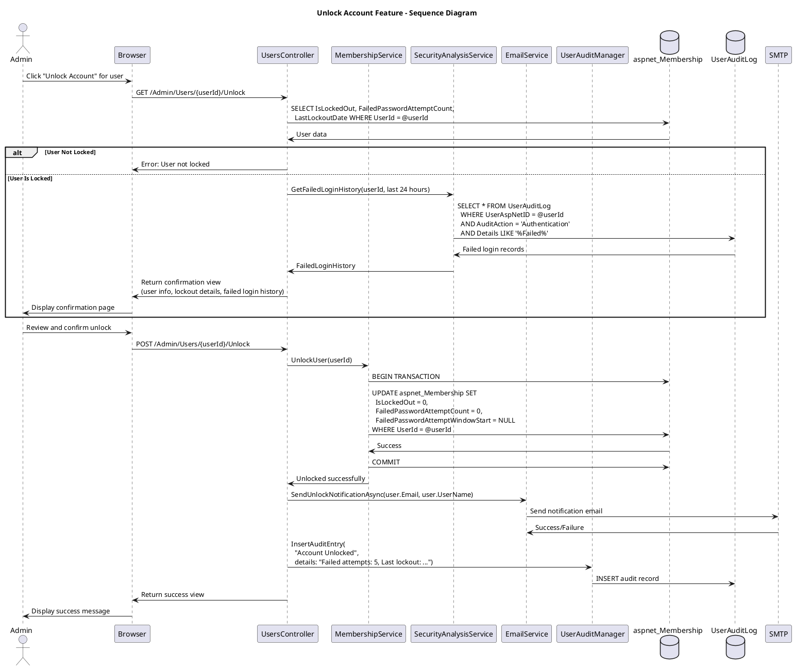

# Unlock Account Feature Specification

## Feature Overview

### Feature Name
Unlock Locked User Account (Admin)

### Description
Administrative capability for Gateway Admins to unlock user accounts that have been automatically locked due to excessive failed login attempts. This feature resets the account lockout flag, clears failed login counters, sends notification emails to users, and maintains a comprehensive audit trail of all unlock operations for security monitoring and compliance.

### Business Value
- **User Support**: Rapid restoration of user access without waiting for automatic unlock timeout
- **Productivity**: Minimizes downtime when users are locked out during critical trial operations
- **Security**: Maintains audit trail of lockouts and unlocks for security pattern analysis
- **Compliance**: Meets 21 CFR Part 11 requirements for access control audit trails
- **User Experience**: Automated email notification informs users of unlock and security recommendations

### Target Personas
- **Gateway Admin**: Primary user unlocking accounts for trial personnel
- **Help Desk Support**: Assists users who have been locked out
- **System Administrator**: Performs emergency unlocks and monitors lockout patterns
- **Security Officer**: Reviews lockout/unlock patterns for security incidents
- **End User**: Receives notification and regains account access

### Work Item Reference
TFS Work Item #498 (tfscorp.itrica.com\ITRICA)

---

## Requirements

### Functional Requirements

**FR-001: User Selection from List**
- System MUST integrate with List Users feature for locked user identification
- System MUST display "Unlock Account" action in user actions menu
- System MUST enable action ONLY for users with IsLockedOut=true
- System MUST disable action for users who are not locked
- System MUST show lockout indicator (red lock icon) in user list

**FR-002: Unlock Confirmation**
- System MUST display confirmation page showing:
  - Target user's username and email
  - Lockout reason (failed login attempts)
  - LastLockoutDate timestamp
  - FailedPasswordAttemptCount
  - Warning about verifying user identity
- System MUST require explicit confirmation
- System MUST provide "Cancel" option

**FR-003: Account Unlock Operation**
- System MUST set IsLockedOut=false in aspnet_Membership
- System MUST set FailedPasswordAttemptCount=0
- System MUST set FailedPasswordAttemptWindowStart=NULL
- System MUST set LastLockoutDate to NULL (or retain for audit)
- System MUST update via transactional database operation
- System MUST NOT modify user's password

**FR-004: Email Notification to User**
- System MUST send email to user's registered email address
- Email MUST include:
  - Notification that account has been unlocked
  - Timestamp of unlock
  - Reminder to use strong password
  - Warning to contact security if unlock was unexpected
  - Login URL and support contact
- System MUST log email delivery success/failure

**FR-005: Success Confirmation to Admin**
- System MUST display success message
- Message MUST include:
  - Username of unlocked account
  - Email delivery status
  - Link to return to user list
  - Recommendation to review failed login audit logs
- System MUST provide option to unlock another account

**FR-006: Comprehensive Audit Logging**
- System MUST log unlock event in UserAuditLog
- Audit entry MUST include:
  - Admin username who performed unlock
  - Target user's username
  - IP address of admin
  - Timestamp
  - Previous lockout details (failed attempt count, lockout date)
  - Action: "User Management"
  - Details: "Account Unlocked"
- System MUST log failures and reasons

**FR-007: Security Review Recommendation**
- System SHOULD display failed login history for unlocked user
- System SHOULD recommend admin review audit logs
- System SHOULD flag suspicious patterns (multiple lockouts, unusual IPs)
- System MAY require reason/justification for unlock

**FR-008: Error Handling**
- System MUST handle user not found
- System MUST handle user not actually locked
- System MUST handle database update failures
- System MUST handle email delivery failures gracefully
- System MUST display user-friendly error messages

### Non-Functional Requirements

**NFR-001: Performance**
- Unlock operation MUST complete within 2 seconds
- Email sending MUST NOT block response (async)
- Database update MUST be immediate

**NFR-002: Security**
- Admin MUST be authenticated and authorized
- Admin MUST have "Unlock Account" permission
- Unlock operations MUST be logged in audit trail
- System MUST recommend identity verification before unlock
- Suspicious unlock patterns SHOULD trigger alerts

**NFR-003: Reliability**
- Unlock operation MUST be transactional
- Email failure MUST NOT prevent unlock
- System MUST handle concurrent unlock attempts

**NFR-004: Usability**
- Clear indication of locked accounts in user list
- Easy access from user actions menu
- Clear success/failure messages
- Helpful guidance for admins

### Business Rules

**BR-001: Lockout Conditions**
- Accounts locked after N failed login attempts (configured, default 5)
- Lockout window configurable (default 10 minutes)
- Automatic unlock after timeout (configured, default 30 minutes)
- Manual unlock bypasses timeout period

**BR-002: Unlock Eligibility**
- Only locked accounts (IsLockedOut=true) can be unlocked
- Unapproved accounts (IsApproved=false) require separate approval process
- Deleted accounts cannot be unlocked

**BR-003: Failed Attempt Reset**
- Unlocking MUST reset FailedPasswordAttemptCount to 0
- Unlocking MUST clear FailedPasswordAttemptWindowStart
- User can immediately attempt login after unlock

**BR-004: Identity Verification Recommendation**
- Admin SHOULD verify user identity before unlocking
- Unlock notification sent to user's email
- User SHOULD contact admin if unlock was unexpected (security incident)

**BR-005: Audit Trail Requirements**
- Every unlock logged, regardless of outcome
- Failed unlock attempts logged
- Both admin and target user identities captured
- Previous lockout details preserved for analysis

### Compliance Requirements

**COMP-001: 21 CFR Part 11 - Audit Trail**
- System MUST maintain audit trail of account lockouts and unlocks
- Audit trail MUST be tamper-proof (insert-only)
- Audit records retained per retention policy

**COMP-002: Security Monitoring**
- Unlock patterns MUST be analyzable for security incidents
- Repeated lockouts MAY indicate brute force attack
- Admins SHOULD review failed login logs before unlock

---

## User Stories

### Story 1: Successful Account Unlock
```gherkin
Given I am a Gateway Admin with unlock permissions
  And user "jsmith" has IsLockedOut=true
  And "jsmith" was locked on 2026-01-13 10:30 AM after 5 failed login attempts
When I view the user list
Then I should see user "jsmith" with red lock icon and "Locked" badge
When I click Actions menu for "jsmith"
  And I select "Unlock Account"
Then I should see confirmation page showing:
    | Field                     | Value                          |
    | Username                  | jsmith                         |
    | Email                     | jsmith@example.com             |
    | Lockout Date              | Jan 13, 2026 10:30 AM          |
    | Failed Attempts           | 5                              |
When I click "Confirm Unlock Account"
Then the system should set IsLockedOut=false
  And FailedPasswordAttemptCount should be reset to 0
  And an unlock notification email should be sent to jsmith@example.com
  And I should see success message: "Account unlocked successfully for user 'jsmith'"
  And an audit log entry should record:
    | AdminUsername  | my_admin_username    |
    | TargetUsername | jsmith               |
    | Action         | User Management      |
    | Details        | Account Unlocked     |
    | PreviousLockout| 5 failed attempts    |
```

### Story 2: User Not Actually Locked
```gherkin
Given I am a Gateway Admin
  And user "jdoe" has IsLockedOut=false (not locked)
When I navigate to unlock account for "jdoe"
Then I should see error message: "User 'jdoe' is not locked. No unlock necessary."
  And I should be redirected back to user list
  And no database changes should occur
  And an audit log entry should record the failed attempt
```

### Story 3: Email Delivery Failure
```gherkin
Given I am unlocking account for "jsmith"
  And the SMTP server is temporarily unavailable
When I confirm the unlock
Then the account should still be unlocked successfully
  And I should see message: "Account unlocked, but notification email could not be sent"
  And I should see: "Please inform the user manually that their account has been unlocked"
  And the email failure should be logged for retry
```

### Story 4: Review Failed Login History
```gherkin
Given I am viewing unlock confirmation for "jsmith"
When the confirmation page displays
Then I should see section "Recent Failed Login Attempts"
  And I should see list of failed logins:
    | Timestamp           | IP Address      | Details                    |
    | Jan 13 10:30:45 AM  | 203.0.113.42    | Invalid password           |
    | Jan 13 10:30:30 AM  | 203.0.113.42    | Invalid password           |
    | Jan 13 10:30:15 AM  | 203.0.113.42    | Invalid password           |
  And I should see recommendation: "Review these failed attempts before unlocking. Contact Security if suspicious patterns detected."
```

### Story 5: User Receives Unlock Notification
```gherkin
Given admin has unlocked my account
When the unlock notification email is sent
Then I should receive email with:
  | Subject | Your OoBDev Gateway Account Has Been Unlocked |
  | Body    | Contains unlock timestamp, login URL          |
  | Warning | "If you did not request this, contact support immediately" |
And I should be able to log in immediately
```

---

## Design

### Architecture Diagram

```plantuml
@startuml Unlock Account Architecture
!include https://raw.githubusercontent.com/plantuml-stdlib/C4-PlantUML/master/C4_Component.puml

title Unlock Account Feature - Component Diagram

Container_Boundary(web, "Web Application") {
    Component(controller, "UsersController", "ASP.NET MVC Controller", "Handles unlock requests")
    Component(view, "Unlock View", "Razor View", "Confirmation and success pages")
    Component(membership, "MembershipService", "Service Layer", "Updates membership status")
    Component(email, "EmailService", "Notification Service", "Sends unlock notifications")
}

Container_Boundary(business, "Business Layer") {
    Component(auditMgr, "UserAuditManager", "Audit Manager", "Records unlock events")
    Component(securityService, "SecurityAnalysisService", "Security", "Analyzes failed login patterns")
}

Container_Boundary(data, "Data Layer") {
    ComponentDb(membership_db, "aspnet_Membership", "SQL Server", "User lockout status")
    ComponentDb(auditDb, "UserAuditLog", "SQL Server", "Audit trail including failed logins")
}

Container_Boundary(external, "External") {
    Component(smtp, "SMTP Server", "Email", "Delivers notifications")
}

Rel(controller, view, "Renders")
Rel(controller, membership, "UnlockUser")
Rel(controller, email, "SendUnlockNotification")
Rel(controller, auditMgr, "InsertAuditEntry")
Rel(controller, securityService, "GetFailedLoginHistory")
Rel(membership, membership_db, "UPDATE IsLockedOut, reset counters")
Rel(securityService, auditDb, "SELECT failed login attempts")
Rel(auditMgr, auditDb, "INSERT unlock record")
Rel(email, smtp, "Send email")

@enduml
```

#### ASCII Diagram

```
┌────────────────────────────────────────────────────────────────────┐
│        Unlock Account Feature - Component Architecture             │
└────────────────────────────────────────────────────────────────────┘

┌──────────────────────────────────────────────────────────────────────┐
│  Web Application Layer                                              │
│                                                                      │
│  ┌────────────────────┐           ┌──────────────────────────────┐  │
│  │  Unlock View       │◄──renders──│  UsersController             │  │
│  │  (Razor)           │            │  (MVC Controller)            │  │
│  │                    │            │                              │  │
│  │  - User lockout    │            │  - GET /Unlock               │  │
│  │    details         │──confirms──►│  - POST /Unlock             │  │
│  │  - Failed login    │            │  - Update lockout status    │  │
│  │    history         │            │  - Send email               │  │
│  │  - Confirm button  │            │  - Log audit                │  │
│  └────────────────────┘            └──┬────────┬──────────┬────────┘  │
└───────────────────────────────────────┼────────┼──────────┼───────────┘
                                        │        │          │
                                        ▼        ▼          ▼
┌───────────────────────────────────────────────────────────────────────┐
│  Business Layer                                                       │
│                                                                       │
│  ┌──────────────────────────┐  ┌──────────────────────────────────┐  │
│  │ MembershipService        │  │ SecurityAnalysisService          │  │
│  │                          │  │                                  │  │
│  │  - UnlockUser()          │  │  - GetFailedLoginHistory()       │  │
│  │  - Reset IsLockedOut     │  │  - Analyze failed attempts       │  │
│  │  - Reset counters        │  │  - Detect suspicious patterns    │  │
│  └──────────────────────────┘  └──────────────────────────────────┘  │
│                                                                       │
│  ┌──────────────────────────┐  ┌──────────────────────────────────┐  │
│  │ EmailService             │  │ UserAuditManager                 │  │
│  │                          │  │                                  │  │
│  │  - SendUnlockNotif()     │  │  - InsertAuditEntry()            │  │
│  │  - Async email delivery  │  │  - Log unlock events             │  │
│  │  - Security warnings     │  │  - Capture lockout details       │  │
│  └──────────────────────────┘  └──────────────────────────────────┘  │
└─────────────────────────────────────────────────────────────────────┘
                  │                              │
                  ▼                              ▼
┌───────────────────────────────────────────────────────────────────────┐
│  Data Layer (SQL Server)                                             │
│                                                                       │
│  ┌──────────────────────────┐  ┌──────────────────────────────────┐  │
│  │ aspnet_Membership        │  │ UserAuditLog                     │  │
│  ├──────────────────────────┤  ├──────────────────────────────────┤  │
│  │  UserId (PK)             │  │  UserAuditLogID (PK)             │  │
│  │  IsLockedOut             │  │  UserAspNetID (admin)            │  │
│  │  LastLockoutDate         │  │  UserName (admin)                │  │
│  │  FailedPasswordAttempts  │  │  Details (target + prev lockout) │  │
│  │  (reset to 0)            │  │  IPAddress                       │  │
│  │  FailedPasswordWindow    │  │  CreatedOn                       │  │
│  │  (set to NULL)           │  │  AuditAction="User Management"   │  │
│  └──────────────────────────┘  │  Details="Account Unlocked"      │  │
│                                 └──────────────────────────────────┘  │
│  ┌─────────────────────────────────────────────────────────────────┐  │
│  │ SMTP Server (External) - Email to unlocked user               │  │
│  └─────────────────────────────────────────────────────────────────┘  │
└───────────────────────────────────────────────────────────────────────┘

Flow:
  1. Admin selects "Unlock Account" from user list (locked users only)
  2. Controller displays confirmation with:
     - Lockout date, failed attempt count
     - Recent failed login history (IP addresses, timestamps)
     - Security recommendation to verify user identity
  3. Admin reviews details and confirms unlock
  4. MembershipService.UnlockUser() updates aspnet_Membership:
     - IsLockedOut = false
     - FailedPasswordAttemptCount = 0
     - FailedPasswordAttemptWindowStart = NULL
  5. EmailService sends unlock notification to user:
     - Account unlocked, login now possible
     - Security reminder about strong passwords
     - Warning to contact security if unexpected
  6. UserAuditManager logs unlock event:
     - Admin who performed unlock
     - Target user
     - Previous lockout details (failed attempts, lockout date)
  7. Success message displayed to admin

Security Features:
  • Failed login history displayed for review before unlock
  • Recommendation to verify user identity before unlocking
  • Dual notification (user receives email)
  • Complete audit trail of lockouts and unlocks
  • Unlock bypasses automatic timeout period
```

### Workflow Diagram



#### ASCII Diagram

```
Unlock Account Feature - Sequence Diagram

Admin    Browser    Controller    Security    Membership    Email    AuditMgr    DB
  │          │            │          Analysis      │           │         │        │
  │          │            │            │            │           │         │        │
  ├─Click────►            │            │            │           │         │        │
  │ Unlock   │            │            │            │           │         │        │
  │          ├──GET───────►            │            │           │         │        │
  │          │ /Unlock    │            │            │           │         │        │
  │          │            │            │            │           │         │        │
  │          │            ├─Get User───────────────────────────────────────────────►
  │          │            │            │            │           │         │  SELECT
  │          │            │            │            │           │         │  lockout
  │          │            │◄─User data──────────────────────────────────────────────┤
  │          │            │  IsLockedOut=true      │           │         │        │
  │          │            │  FailedAttempts=5      │           │         │        │
  │          │            │  LastLockoutDate       │           │         │        │
  │          │            │            │            │           │         │        │
  │          │            ├─GetFailedLoginHistory──►           │         │        │
  │          │            │            │            │           │         │        │
  │          │            │            ├─Query──────────────────────────────────────►
  │          │            │            │ UserAuditLog         │         │   SELECT
  │          │            │            │ WHERE AuditAction=   │         │   failed
  │          │            │            │  'Authentication'    │         │   logins
  │          │            │            │  AND Details LIKE    │         │
  │          │            │            │  '%Failed%'          │         │
  │          │            │            │◄─Failed logins───────────────────────────┤
  │          │            │◄─History───┤            │           │         │        │
  │          │            │            │            │           │         │        │
  │          │◄─Confirm───┤            │            │           │         │        │
  │          │  Page with │            │            │           │         │        │
  │◄─Display─┤  details + │            │            │           │         │        │
  │          │  history   │            │            │           │         │        │
  │          │            │            │            │           │         │        │
  ├─Review───►            │            │            │           │         │        │
  │ & Confirm│            │            │            │           │         │        │
  │          ├──POST──────►            │            │           │         │        │
  │          │ Unlock     │            │            │           │         │        │
  │          │            │            │            │           │         │        │
  │          │            ├─UnlockUser─────────────►            │         │        │
  │          │            │            │            │           │         │        │
  │          │            │            │            ├─UPDATE────────────────────────►
  │          │            │            │            │ aspnet_Membership    │        │
  │          │            │            │            │ SET IsLockedOut=0    │        │
  │          │            │            │            │ FailedPasswordAttemptCount=0  │
  │          │            │            │            │ FailedPasswordAttemptWindowStart=NULL
  │          │            │            │            │◄─Success─────────────────────┤
  │          │            │◄─Success───────────────┤            │         │        │
  │          │            │            │            │           │         │        │
  │          │            ├─SendUnlockNotification─────────────►         │        │
  │          │            │ (user.Email)           │           │         │        │
  │          │            │            │            │           │         │        │
  │          │        ┌───┴────────────┴────────────┴───────────┴─────┐   │        │
  │          │        │ Email: "Account unlocked. Login URL."    │   │        │
  │          │        │        "Contact security if unexpected"   │   │        │
  │          │        └───┬────────────┬────────────┬───────────┬─────┘   │        │
  │          │            │            │            │           │         │        │
  │          │            ├─────────────────────InsertAuditEntry──────────►        │
  │          │            │            │            │           │         │        │
  │          │            │            │   "Account Unlocked for user X  │        │
  │          │            │            │    Previous: 5 failed attempts, │        │
  │          │            │            │    locked on [date]. Email sent."        │
  │          │            │            │            │           │         ├─INSERT─►
  │          │            │            │            │           │         │        │
  │          │◄─Success───┤            │            │           │         │        │
  │◄─Display─┤ Message    │            │            │           │         │        │
  │          │            │            │            │           │         │        │

Key Operations:
  1. Admin clicks "Unlock Account" from user list (action only enabled for locked users)
  2. Controller retrieves user data and failed login history
  3. SecurityAnalysisService queries UserAuditLog for recent failed logins
  4. Confirmation page displays:
     - Username, email, lockout date
     - Failed password attempt count
     - Recent failed login history (timestamps, IP addresses)
     - Warning to verify user identity before unlocking
  5. Admin reviews and confirms unlock
  6. MembershipService.UnlockUser() updates database:
     - IsLockedOut = false (user can now log in)
     - FailedPasswordAttemptCount = 0 (reset counter)
     - FailedPasswordAttemptWindowStart = NULL (clear window)
  7. EmailService sends notification to user's registered email
  8. UserAuditManager logs unlock event with previous lockout details
  9. Success message displayed to admin

Security Considerations:
  • Failed login history helps detect brute force attacks
  • Admin should verify user identity before unlocking
  • User receives notification (detects unauthorized unlocks)
  • Complete audit trail for compliance and security analysis
```

### API Contracts

#### Endpoint: POST /Admin/Users/{userId}/Unlock

**Request**:
```http
POST /Admin/Users/a1b2c3d4-...-1234567890/Unlock HTTP/1.1
Host: gateway.itrica.com
Cookie: .ASPXAUTH=<admin-cookie>
```

**Response - Success**: 200 OK
```json
{
  "success": true,
  "message": "Account unlocked successfully for user 'jsmith'",
  "userName": "jsmith",
  "email": "jsmith@example.com",
  "emailSent": true,
  "previousLockoutInfo": {
    "lockoutDate": "2026-01-13T10:30:00Z",
    "failedAttempts": 5
  }
}
```

---

## Implementation Details

### Technology Stack
- ASP.NET MVC 4.x/5.x
- ASP.NET Membership Provider
- Entity Framework for audit queries
- SMTP for email delivery

### Code Patterns

**Pattern: Unlock Operation**
```csharp
[HttpPost]
[TrialRole("Administrators")]
public ActionResult Unlock(Guid userId)
{
    var user = Membership.GetUser(userId);

    if (user == null)
        return HttpNotFound();

    if (!user.IsLockedOut)
    {
        TempData["ErrorMessage"] = $"User '{user.UserName}' is not locked.";
        return RedirectToAction("Index");
    }

    // Capture lockout details before unlock (for audit)
    var previousLockoutInfo = new
    {
        LockoutDate = user.LastLockoutDate,
        FailedAttempts = GetFailedPasswordAttemptCount(userId)
    };

    // Unlock account
    user.UnlockUser();

    // Send notification email
    var emailSent = SendUnlockNotificationAsync(user.Email, user.UserName);

    // Audit log
    auditManager.InsertAuditEntry(
        "Admin.UsersController",
        "Unlock",
        User.Identity.Name,
        Request.UserHostAddress,
        UserAuditActions.UserManagement,
        UserAuditDetails.Account_Unlocked,
        details: $"Account unlocked for {user.UserName}. " +
                 $"Previous: {previousLockoutInfo.FailedAttempts} failed attempts, " +
                 $"locked on {previousLockoutInfo.LockoutDate}. " +
                 $"Email sent: {emailSent}"
    );

    TempData["SuccessMessage"] = $"Account unlocked successfully for '{user.UserName}'.";
    return RedirectToAction("Index");
}
```

---

## Acceptance Criteria

**AC-001**: Locked accounts identified in user list
- Red lock icon displayed for locked users
- "Locked" status badge shown
- "Unlock Account" action enabled

**AC-002**: Unlock operation successful
- IsLockedOut set to false
- Failed attempt counters reset to 0
- Update is transactional

**AC-003**: Email notification sent
- User receives unlock notification
- Email contains timestamp and login URL
- Email delivery logged

**AC-004**: Audit trail complete
- Unlock event logged with admin and user identities
- Previous lockout details captured
- Email delivery status included

**AC-005**: Error handling works
- User not locked: appropriate error message
- Email failure: unlock succeeds, admin notified

---

## Related Documentation

- [List Users Feature Specification](./list-users.md)
- [Reset Password Feature Specification](./reset-password.md)
- [Account Lockout Feature Specification](../authentication/account-lockout.md)
- [Admin Use Cases](/current/src/docs/architecture/admin/use-cases.md)

---

**Document Version**: 1.0
**Last Updated**: January 2026
**Status**: Implementation-Ready
**Compliance**: 21 CFR Part 11, GCP
