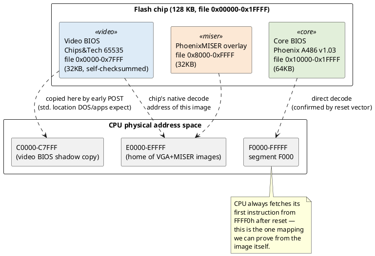
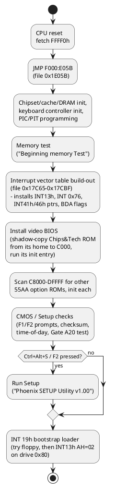
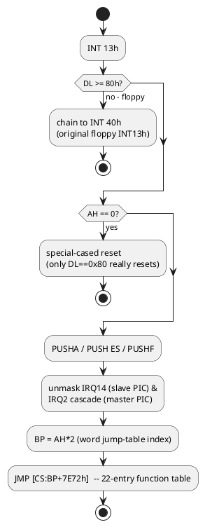
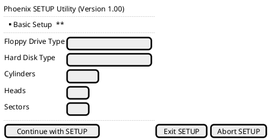
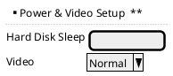
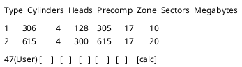
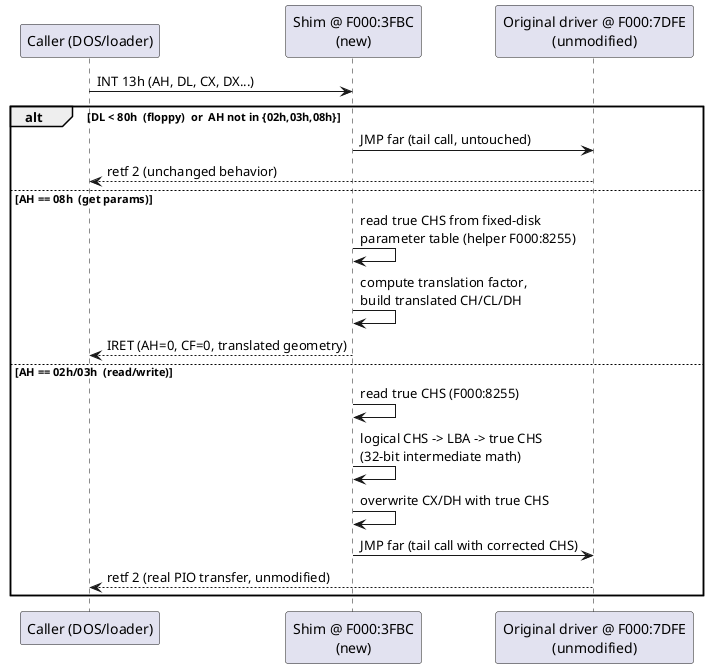

# Compuadd 486 "Color Scan 450" BIOS — Reverse-Engineering Notes

Source image: `BIOS from Compuadd 486 Color Scan 450.BIN` (131,072 bytes / 128 KB).
Full linear disassembly listings are in [`disassembly/`](disassembly/); this document explains
what's actually in there and lays out the LBA patch design. Raw analysis was done with the
throwaway 16-bit disassembler in [`tools/BiosDisasm`](tools/BiosDisasm) (built on
[Iced](https://github.com/icedland/iced)).

All addresses below are given as `segment:offset` and, where relevant, as a file byte offset
(`file 0x…`).

## 1. Identification

| Module | File range | Size | Identity |
|---|---|---|---|
| Video BIOS | `0x00000–0x07FFF` | 32 KB | Chips & Technologies 65535 VGA BIOS v2.0.0, © 1994 |
| "PhoenixMISER" overlay | `0x08000–0x0FFFF` | 32 KB | Phoenix power-management/setup module, © 1991-1992 |
| Core system BIOS | `0x10000–0x1FFFF` | 64 KB | **Phoenix "A486" core v1.03**, OEM tag `PhoenixMISER(TM) PT68C268`, © 1985-1993 Phoenix Technologies |

The reset vector proves the core BIOS module maps to `F000:0000–FFFF` (standard AT top-of-memory
BIOS segment):

```
file 0x1FFF0:  EA 5B E0 00 F0   ->   JMP F000:E05B
file 0x1FFF5:  "04/19/90"        (generic Phoenix placeholder BIOS date, not the OEM build date)
file 0x1FFFE:  FC 00             (model byte FC = AT-class, checksum byte)
```

`file offset = 0x10000 + segment-offset` for every address in the core BIOS from here on, e.g.
`F000:7DFE` is `file 0x17DFE`.

The video BIOS module checksums correctly as a standalone 32KB option ROM (byte sum ≡ 0 mod 256),
confirming it's a real, complete option ROM that the system copies to segment `C000` during POST
(the standard place DOS/Windows expect to find the primary VGA BIOS). The "PhoenixMISER" block also
starts with a `55 AA` header but its checksum did **not** balance over its declared length — it is
very likely accessed directly by the core BIOS's own POST code rather than through the generic
adapter-ROM scan, so its exact call convention is not confirmed.

## 2. ROM / memory layout



## 3. Boot flow



The vector-install block is small enough to quote directly (`file 0x17C65`, disassembly in
[`disassembly/03_core_bios_F000.asm`](disassembly/03_core_bios_F000.asm) around line matching
`F000:7C65`):

```
F000:7C6B   A1 4C 00        MOV AX,[004Ch]        ; save previous INT13h offset...
F000:7C6E   A3 00 01        MOV [0100h],AX        ; ...into a scratch cell (unused floppy chain?)
F000:7C77   C7 06 4C 00 FE 7D   MOV WORD [004Ch],7DFEh   ; <-- INT13h vector = F000:7DFE
F000:7C7D   8C 0E 4E 00     MOV [004Eh],CS
```

**This is the exact instruction the LBA patch needs to change** — see §6.

## 4. The INT 13h hard-disk driver

Entry point `F000:7DFE` (`file 0x17DFE`). Full listing in
[`disassembly/03_core_bios_F000.asm`](disassembly/03_core_bios_F000.asm).



Function table (`file 0x17E72`, 22 words, index = `AH*2`):

| AH | Function | Handler (F000:) | file offset |
|----|----------|------------------|-------------|
| 00 | Reset | 7F9A | 0x17F9A |
| 01 | Get status | 7E9E (shared "invalid/status" path) | 0x17E9E |
| 02 | **Read sectors** | 7FEC | 0x17FEC |
| 03 | **Write sectors** | 8067 | 0x18067 |
| 04 | Verify sectors | 80ED | 0x180ED |
| 05 | Format track | 8119 | 0x18119 |
| 08 | **Get drive parameters** | 815B | 0x1815B |
| 09 | Initialize controller | 81A4 | 0x181A4 |
| 0A | Read long | 7FE8 | 0x17FE8 |
| 0B | Write long | 8063 | 0x18063 |
| 0C | Seek | 81DB | 0x181DB |
| 0D | Alt. reset | 7F9F | 0x17F9F |
| 10 | Test drive ready | 81FD | 0x181FD |
| 11 | Recalibrate | 81D7 | 0x181D7 |
| 14 | Controller diagnostic | 8212 | 0x18212 |
| 15 | Get disk type | 7F63 | 0x17F63 |
| 06,07,0E,0F,12,13 | unimplemented → shared error path | 7E9E | 0x17E9E |
| ≥16h | invalid function | 7E9E | 0x17E9E |

Key shared subroutines (all in `disassembly/03_core_bios_F000.asm`):

| Addr (F000:) | Role |
|---|---|
| `8255` | `ES:SI` = pointer to the **fixed disk parameter table** for drive `DL` (`table = [7B5Ch:DL*0x14]` → `LES SI,[ES:SI+0x104]`) |
| `831B` | Build the 6-byte ATA task-file image at `BDA:0441h` from CX(cyl/sector)/DX(head/drive)/AL(command); select drive |
| `8383` | Push the built task-file bytes out to ports `1F1h-1F7h` |
| `8298`/`82CF` | Wait for controller not-busy / drive ready (polls port `3F6h`/`1F7h`) |
| `8404`/`842A` | Wait for DRQ, then `REP INSW` 256 words from port `1F0h` (PIO sector transfer) |
| `856E` | Short I/O delay |

### Fixed disk parameter table (16 bytes, pointed to by `ES:SI` from helper `8255`)

This is the **standard IBM AT fixed-disk parameter table** layout — confirmed field-by-field from
how the driver reads it:

| Offset | Size | Field | Evidence |
|---|---|---|---|
| `+0x00` | word | Cylinders | `AH=08`: `MOV CX,[ES:SI]` then `DEC CX` twice, packed into CH/CL |
| `+0x02` | byte | Heads | `AH=08`: `MOV DH,[ES:SI+2]` / `DEC DH`; also compared in `831B` |
| `+0x05` | word | (write-precomp / landing-zone-ish, unused by patch) | read in `831B` |
| `+0x08` | byte | Control byte | tested `AND AL,0C0h` style flags in `831B` |
| `+0x0E` | byte | Sectors per track | `AH=08`: `ADD CL,[ES:SI+0Eh]`; also used to size transfers |

This table is populated at POST time from whatever CHS the Setup screen has stored for that drive
(preset Type 1-46, or the manual "Type 47/User" entry) — see §5.

### Why this confirms "no LBA"

* The function table has **no AH=41h/42h/43h/44h/47h/48h** entries (INT 13h Extensions) — those
  AH values (>0x15) all fall through to the generic "invalid function" handler.
* `AH=08` packs cylinder into `CH` plus 2 bits of `CL` — a hard **10-bit, 1024-cylinder** ceiling —
  and reports heads as a single byte pulled straight from the table with no bit-shift/translation
  logic anywhere in the driver.
* The ATA task-file build in `831B` shows the hardware head field is masked to 4 bits
  (`AND DH,0Fh`) — the classic **16-head** ATA CHS-mode ceiling.

`1024 × 16 × 63 × 512 bytes ≈ 504 MiB` — exactly the classic pre-LBA barrier, and it matches your
symptom (needing a boot-time LBA loader) precisely.

## 5. Setup screens (reconstructed from on-ROM strings)

Only two Setup screens exist in this BIOS ("Basic Setup" and "Power & Video Setup" — no
"Advanced"/IDE-specific screen), plus the classic numbered hard-disk type table. Reconstructed
layout (not a pixel-exact dump — Salt mockups from the literal strings found in the ROM):







There is no third "LBA/Large/Auto" column or mode selector anywhere in this table — every type
(including the User-defined slot 47) is a raw CHS entry, capped by the on-screen field widths at
what the classic table has always allowed (≤1024/16/63). This is consistent with §4: the Setup
screen itself never had a way to *express* a translated geometry, because the driver never had a
translator to feed.

## 6. LBA patch design

Goal: let the same physical CF card be addressed by DOS/boot loaders up past 504 MiB, without a
boot-time TSR, by hooking INT 13h with a small translator and leaving the existing ATA/PIO code
completely alone.

### Hook mechanism

Free space: file offset **`0x13FBC`**, a 6,212-byte block of erased (`0xFF`) space inside the core
BIOS module — `F000:3FBC`. Plenty of room for a translator this size.

Patch the single vector-install instruction found in §3:

```
file 0x17C79-0x17C7A:  FE 7D  (imm16 = 7DFEh)   ->   BC 3F  (imm16 = 3FBCh)
```

That's the *only* byte-level change to existing code. Everything else is new code dropped into the
free block. Net effect: `INT 13h` now vectors to our shim first.



### Translation algorithm ("Large/ECHS" style)

Only drive `0x80` is translated (kept deliberately narrow/simple/safe); everything else passes
through untouched.

```
true_cyl, true_heads, true_spt   <- read from fixed disk parameter table (offsets 0x00,0x02,0x0E)

find smallest F in {1,2,4,8,16,32,64,128} such that:
    ceil(true_cyl / F)   <= 1024
    true_heads * F       <= 240        (stay under the 255-head ceiling with margin)

logical_cyl   = true_cyl   / F
logical_heads = true_heads * F
logical_spt   = true_spt                (unchanged)

# AH=08 (get params): report logical_cyl-1 / logical_heads-1 / logical_spt to the caller

# AH=02/03 (read/write): caller gives logical CHS, we need true CHS
LBA        = (logical_cyl_in * logical_heads + logical_head_in) * logical_spt + (logical_sector_in - 1)
true_cyl_i = LBA / (true_heads * true_spt)
true_head  = (LBA / true_spt) mod true_heads
true_sect  = (LBA mod true_spt) + 1
```

`LBA` can reach ~16.7 million, so the multiply/divide steps need real 32-bit (`DX:AX`) arithmetic —
a 16×16→32 `MUL` is free on the 8086, but the 32÷16 divide needs a manual shift-subtract loop
because a plain `DIV` faults if the quotient overflows 16 bits. With `true_heads=16`, `true_spt=63`,
this scheme is good up to `true_cyl` ≈ 16,384, i.e. **up to ~8 GiB** — comfortably past "more than
504 MB" and past any capacity a period-correct CF card in this machine is likely to have.

### What this deliberately does *not* do

* No true INT 13h Extensions (AH=41h/42h/48h/EDD) — not needed for a CF card in the multi-GB range
  addressed through plain DOS-era INT 13h; adding EDD would mean also hand-writing raw ATA LBA-mode
  PIO code instead of reusing the existing (unmodified, trusted) CHS transfer routine.
* No change to the existing ATA transfer code at all (`8383h`/`8404h`/`842Ah`/etc.) — the shim only
  ever hands it *smaller, in-range* CHS values, so all of the original hardware-timing-sensitive
  code keeps running exactly as shipped.
* Only drive `0x80` is translated. Drive `0x81` and floppies are byte-for-byte untouched.

## 7. Status / next steps

The shim above is implemented in [`tools/BiosPatcher`](tools/BiosPatcher) and produces a new file,
**not** an in-place edit of the original — see [`PATCH_NOTES.md`](PATCH_NOTES.md) for what changed,
build instructions, and — importantly — the testing plan, since none of this has been run on real
hardware or in an emulator yet.
