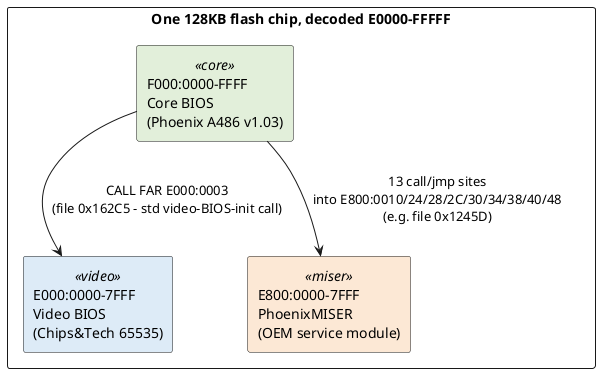
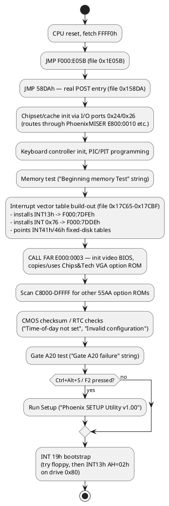

# Memory Map & Boot Flow

This nails down exactly where every byte of the 128 KB image lives in the address space and
what runs when, with hard evidence for each claim (not inference) — every mapping below is
proven by a real far call/jump found in the disassembly, not just "this is the conventional
layout."

## Confirmed segment map

| File range | Segment:offset | Size | Contents |
|---|---|---|---|
| `0x00000–0x07FFF` | `E000:0000–7FFF` | 32 KB | Chips & Technologies 65535 VGA option ROM |
| `0x08000–0x0FFFF` | `E800:0000–7FFF` | 32 KB | "PhoenixMISER" OEM service module (jump table) |
| `0x10000–0x1FFFF` | `F000:0000–FFFF` | 64 KB | Phoenix A486 core BIOS |

The whole 128 KB file is one physically contiguous block decoded at **`E0000–FFFFF`** by the
chipset — i.e. this is a single flash/EPROM chip, not three separate chips. Evidence:

1. **F000 mapping** — the CPU reset vector is architecturally fixed at physical `FFFF0`. The
   bytes there (`file 0x1FFF0`) are `EA 5B E0 00 F0` = `JMP F000:E05B`, and every address in the
   core BIOS I traced against this base (see `analysis/02_int13h_disk_driver.md`) resolves
   correctly — the whole 64KB block is self-consistent as `F000:0000-FFFF`.

2. **E000 mapping (video BIOS)** — found a live call site, `file 0x162C5`:
   ```
   9A 03 00 00 E0     CALL FAR E000:0003
   ```
   Offset 3 into a `55 AA`-headed option ROM is the **standard PC/AT convention** for where the
   BIOS's option-ROM scanner invokes a video card's init routine (byte 0 = `55`, byte 1 = `AA`,
   byte 2 = length/512, byte 3 = 3-byte near `JMP` to the real entry point — here `EB 3F`, i.e.
   `JMP short +0x3F`). This is a textbook video-BIOS-init call, and it only makes sense if the
   video ROM is actually sitting at `E000:0000`.

3. **E800 mapping (PhoenixMISER)** — found **13 separate** far calls/jumps from core-BIOS code
   into segment `E800h`, at offsets `0x10, 0x1C(near jmp target, called differently), 0x24, 0x28,
   0x2C, 0x30, 0x34, 0x38, 0x40, 0x48` — e.g. `file 0x1245D`: `9A 40 00 00 E8` =
   `CALL FAR E800:0040`. Every one of those offsets lines up with a real, valid instruction
   (either `CALL near ptr; RETF` or a bare `RETF` stub) in the `file 0x8000` block, which is only
   possible if that block is genuinely mapped at `E800:0000`.



## PhoenixMISER: what it actually is

The name suggests "power management" (Phoenix's pre-APM "MISER" power-saving extensions were
real, shipped in several early-90s chipsets), but the call sites tell a broader story — it's an
**OEM chipset-services module**, not purely a power-management layer:

- `file 0x15940` (`JMP FAR E800:0010`) is reached right after a run of `OUT` instructions to
  I/O ports `0x24`/`0x26` with values like `0x0300`, `0x05E4`, `0x0200`, `0x0207` — classic
  index/data register pairs for programming an early-90s 486 chipset's cache/shadow-RAM
  controller. This call is chipset **initialization**, not power management.
- `file 0x1245D`/`0x12464` (`CALL FAR E800:0040` then conditionally `E800:0038`) sits right after
  a CMOS RAM read (`OUT 70h,0Eh` / `IN 71h`, the classic CMOS index/data port pair) and a
  branch on the result — this looks like a **Setup-option-driven feature toggle** (read a CMOS
  byte, call a MISER service if it says the feature is enabled).

Entry-point table (`E800:0000` onward, each slot either `CALL near; RETF` or a bare `RETF`
"feature absent" stub):

| Offset | Target (E800:) | Called from (file) |
|---|---|---|
| `0x10` | `1624h` | `0x1245D`(as `0x40`... see table), `0x15940` |
| `0x1C` | `1951h` (near `JMP`, not a call slot) | — |
| `0x24` | *(bare `RETF` — stub)* | `0x15B01` |
| `0x28` | `00CEh` | `0x1BC70` |
| `0x2C` | `18D7h` | `0x198F9`(0x10 slot)/`0x19914`(0x2C) |
| `0x30` | `0EAAh` | `0x1CC0D`, `0x1FFE0` |
| `0x34` | `057Ah` | `0x1CB57` |
| `0x38` | `0A69h` | `0x12464`, `0x1CC3A` |
| `0x40` | `1792h` | `0x1245D` |
| `0x48` | `17A4h` | `0x16CF0` |

Decoding what each individual service *does* would need tracing ~9 more subroutine bodies —
not done here since it's orthogonal to the disk/LBA work, but the module boundary, call
convention, and invocation sites are now fully mapped for whoever wants to pick this up.

## Boot flow


