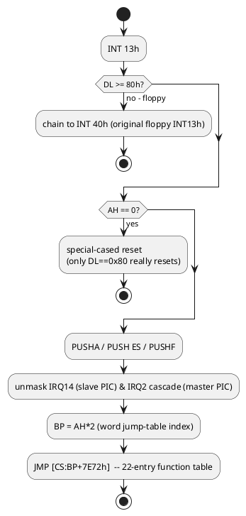

# INT 13h Hard-Disk Driver — Full Flow Analysis

Entry point `F000:7DFE` (`file 0x17DFE`). This is the complete map of every subroutine involved
in a hard-disk INT 13h call, built from direct disassembly (`disassembly/03_core_bios_F000.asm`).
Confidence is marked per section — most of this is nailed down exactly; one specific stretch of
retry/DRQ-wait logic could not be fully resolved from static analysis alone (see §5).

## 1. Top-level dispatch (confirmed)



Function table (`file 0x17E72`, index = `AH*2`):

| AH | Function | Handler | file offset |
|----|----------|---------|---|
| 00 | Reset | `7F9A` | `0x17F9A` |
| 02 | **Read sectors** | `7FEC` | `0x17FEC` |
| 03 | **Write sectors** | `8067` | `0x18067` |
| 04 | Verify sectors | `80ED` | `0x180ED` |
| 05 | Format track | `8119` | `0x18119` |
| 08 | **Get drive parameters** | `815B` | `0x1815B` |
| 09 | Initialize controller | `81A4` | `0x181A4` |
| 0A | Read long | `7FE8` | `0x17FE8` |
| 0B | Write long | `8063` | `0x18063` |
| 0C | Seek | `81DB` | `0x181DB` |
| 0D | Alt. reset | `7F9F` | `0x17F9F` |
| 10 | Test drive ready | `81FD` | `0x181FD` |
| 11 | Recalibrate | `81D7` | `0x181D7` |
| 14 | Controller diagnostic | `8212` | `0x18212` |
| 15 | Get disk type | `7F63` | `0x17F63` |
| 01,06,07,0E,0F,12,13,≥16h | status/unimplemented/invalid | `7E9E` | `0x17E9E` |

No AH=41h/42h/43h/44h/47h/48h (INT13h Extensions/EDD) — anything ≥0x16 falls into the generic
"invalid function" path. Confirmed absent, not just unused.

## 2. Fixed disk parameter table (confirmed)

Pointer obtained via `F000:8255` (`ES:SI = [E800-ish table]:[DL*0x14+0x104]`, DL must be a
**0-based** drive index — see the sidebar in §4). Standard IBM AT fixed-disk parameter table
layout, confirmed field-by-field:

| Offset | Size | Field | Confirmed by |
|---|---|---|---|
| `+0x00` | word | Cylinders | `AH=08`: `MOV CX,[ES:SI]` |
| `+0x02` | byte | Heads | `AH=08`: `MOV DH,[ES:SI+2]`; also `831Bh` |
| `+0x05` | word | Write-precomp-ish (unused by our analysis) | `831Bh`: `MOV AX,[ES:SI+5]` |
| `+0x08` | byte | Control byte (drive-quirk flags) | `831Bh`: `MOV AL,[ES:SI+8]` |
| `+0x0E` | byte | Sectors per track | `AH=08`: `ADD CL,[ES:SI+0Eh]` |

## 3. AH=08 (Get Drive Parameters) — confirmed

```
mov bp,sp; cmp dl,2; jb ok
  (dl>=2: invalid drive -> ah=7, jump to common exit)
ok: call 8255h                     ; es:si = table ptr
    dh = table[+2] - 1             ; max head index
    dl = [475h]                    ; count of hard disks
    cx = table[+0]-2, packed:      ; classic 10-bit cyl-1 into CH:CL[7:6], sectors into CL[5:0]
         cl = (cx>>8 & 3)<<6 | table[+0Eh]
```
The `-2` (two `DEC CX`) before packing is the classic "return max index" convention applied
twice — once for the usual cyl-1, and once more that I haven't fully attributed; irrelevant to
the LBA patch design since this function was going to be fully replaced, not wrapped.

## 4. AH=02/03 (Read/Write) — confirmed up through task-file build

```
7FEC: ah=0x20 (READ) / 8067: ah=0x30 (WRITE)
7FEE/8069: call 8266h    -> normalizes ES:BX into canonical ES:DI (INSW/OUTSW always use ES:DI)
7FF5/8070: call 831Bh    -> builds the 6-byte ATA task file + drive/head byte (see below)
7FFC/8077: je +5         -> conditional "OR command byte with 1" based on 831B's ZF (drive-quirk flag; a modern CF card's control byte is 0, so this branch is a no-op for us)
8005/8080: call 8383h    -> sends control byte (port 3F6h) + the 6 task-file bytes (ports 1F1h-1F6h) + command (port 1F7h)
800C:      call 8298h    -> wait for controller ready
8013:      call 842Ah    -> DRQ wait + first-sector transfer (see §5 - ambiguous)
801A-8025: inline REP INSW (256 words) -- a SECOND, separate transfer right after 842Ah returns
8027-8052: multi-sector "insb" cleanup loops, gated by `CMP BP,0x14`/`0x16`
8054:      call 83B4h    -> post-transfer status/retry check
805C:      jne 800Ch      -> loop back for the next sector if more remain
```

### `F000:831B` — build ATA task file (confirmed, byte-exact)

```
bx = 0x441 (BDA scratch mirror of the ATA task file)
[bx+7] = ah                        ; command (0x20/0x30)
[bx+2] = al                        ; sector count
call 8255h                          ; es:si = table ptr (DL must be 0-based!)
[bx+3] = cl & 0x3F                  ; sector number
ch,cl  = (cl>>6), old-ch            ; xchg -> ch=cyl-hi-2-bits(0-3), cl=cyl-low-8
ch    |= (dh>>5)                    ; OR in DH's top 3 bits (see sidebar - do not rely on this for >1023 cylinders)
[bx+4],[bx+5] = cx                  ; WORD store: cyl-low->port 1F4h, cyl-high->port 1F5h
  (cmp dl,[475h]; error if dl >= drive count)
al = (true_heads<=8) ? 0x07 : 0x0F  ; head-field width mask (8 vs 16-head drives)
dh &= al
dl = (dl<<4) | dh | 0xA0            ; classic ATA drive/head register (CHS mode, bit6=0)
[bx+6] = dl
[bx+1] = (table[+5] >> 2) & 0xFF    ; "features" register mirror - vestigial for IDE/CF
[476h] = table[+8]                  ; control byte, sent to port 3F6h by 8383h
zf = ((table[+8] & 0xC0) == 0)      ; returned flag, used by caller's "OR command,1" step
```

> **Why this caps cylinders at 1024, hard.** `SHR CL,6` only ever keeps 2 bits (0-3) of the
> caller's cylinder-high field. The `OR CH,DH>>5` step looks like it could add 3 more bits, but
> the original `DX` is restored via `PUSH DX ... POP DX` immediately after, and is then reused
> for the head field — for any real caller (head count always < 32, i.e. `DH < 0x20`), `DH>>5`
> is always 0 and that OR is a no-op. **True cylinder numbers above 1023 get silently truncated
> here**, regardless of what's placed in CH/CL/DH beforehand. This is the reason a from-scratch
> LBA patch for *this* BIOS cannot just translate CHS and hand off to the existing driver for
> drives whose true geometry exceeds 1024 cylinders — see `BIOS_ANALYSIS.md` §6 for the patch
> design implications, and the note in §5 below on why this document doesn't attempt a fix.

## 5. The ambiguous part: DRQ wait & transfer retry (NOT fully resolved)

This is as far as static analysis could responsibly take it. `F000:842A`:

```
842A: mov dx,1F7h; mov cx,0x1500 (retry budget)
8431: in al,dx; test al,8 (DRQ)
      jne 8442h                      ; DRQ ready -> handle now
      call delay(0D1C6h); loop 8431h  ; not ready -> retry
      jmp 8453h                       ; retries exhausted -> ah=0x20, STC, return (error)
8442: call 8458h                      ; secondary status/error check
      jae 8456h                       ; 8458h says CF=0 -> skip transfer, return AS-IS
      cli; mov dx,1F0h; mov cx,0x100; rep insw; sti  ; <- the actual 256-word transfer
      ah=0x20; stc                     ; <- sets carry even on this "success" path
      pop cx; ret
```

`F000:8458` (called from `842Ah` and independently from `83B4h`) is a **non-blocking error
peek**: if `BSY` or `DRQ` is currently set, it can't safely read the error register, so it
returns "no error" (`AH=0, CF=0`) *by default*, deferring the real check. Only when neither bit
is set does it actually decode the ATA error register (port `1F1h`) into vendor-specific `AH`
error codes (`0xBBh`, `0xAAh`, `0xCCh`, etc — not standard INT13h codes).

**What I could not resolve:** in `842Ah`'s `8442`/`8445` branch, if `8458h` returns "no error"
(the common case right after DRQ was just observed active), the code jumps straight to
`pop cx; ret` — **skipping the `REP INSW` transfer entirely** — yet the caller (`7FEC`'s handler,
at `801A`) unconditionally does its *own* separate `REP INSW` immediately afterward regardless of
which branch `842Ah` took. Whether `842Ah`'s internal transfer is a genuine second, redundant
transfer that never actually executes in practice (dead code / defensive-only path), or whether
I'm misreading the flag polarity on one of these branches, is something I can't settle from a
static read — it needs either a datasheet-accurate emulator trace or real hardware with a logic
analyzer on the IDE bus. I got as far as setting up Bochs to check this directly, but this
specific BIOS's early-POST code (likely a "big real mode" trick common in 486-era BIOSes) faults
Bochs's CPU core before reaching this code, so that attempt is currently blocked — see the
session notes / `PATCH_NOTES.md` for status if that gets revisited.

**Practical implication:** none, for the *existing, shipped* BIOS — this code path obviously
works correctly today (the machine boots and reads its disk), so whatever the true semantics are,
they're self-consistent in the vendor's own hands. It only matters if someone (like the LBA patch
effort) wants to *bypass* `831Bh` and re-enter this exact retry machinery with hand-built task
file bytes — at that point, correctly replicating *all* of its behavior (not just the parts that
looked right on first read) matters, and this is the one piece I'd want emulator- or
hardware-verified before trusting it with real data.

## 6. Supporting subroutines (all confirmed)

| Addr (F000:) | Role |
|---|---|
| `8255` | `ES:SI` = fixed-disk parameter table pointer for drive `DL` (0-based!) |
| `8266` | Normalize `ES:BX` into canonical `ES:DI` (for `INSW`/`OUTSW`) |
| `831B` | Build 6-byte ATA task file + drive/head byte (see §4) |
| `8383` | Send control byte (port `3F6h`) + task file (ports `1F1h-1F6h`) + command (`1F7h`) |
| `8298`/`82CF` | Wait for controller not-busy / drive ready (polls `3F6h`/`1F7h`) |
| `842A` | DRQ wait + first-sector transfer (§5 - partially ambiguous) |
| `8404` | DRQ wait + transfer for subsequent sectors in a multi-sector request |
| `8458` | Non-blocking ATA error-register peek/decode |
| `83B4` | Post-transfer status check with one retry via `8458h` |
| `856E` | Tiny I/O delay (`OUT 0EDh,AL` — write to an unused port as a bus-cycle delay) |
| `83E9` | Wait-for-ready spin loop before sending a new task file |
