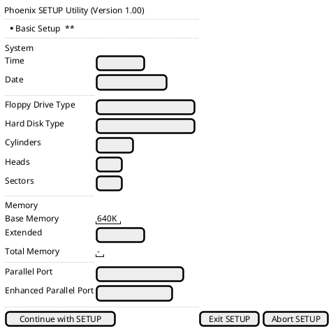
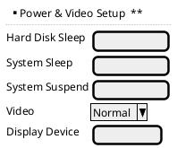
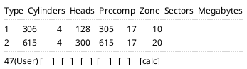

# Setup Utility — Reconstructed Screens

"Phoenix SETUP Utility (Version 1.00)" — reconstructed from the literal on-ROM strings (not a
pixel-accurate dump of the real screen; layout is inferred from field groupings and labels).
Only two screens exist in this BIOS — no "Advanced"/IDE-specific screen — plus the classic
numbered hard-disk type table.







There is no third "LBA/Large/Auto" column or translation-mode selector anywhere — every type,
including the User-defined slot 47, is a raw CHS entry. This matches
`02_int13h_disk_driver.md`'s finding that the driver has no translation layer at all: the Setup
screen never had anything to *drive*, because the driver never had a translator to feed.

## Error/status message strings (for context, not a full screen)

```
* Extended CMOS checksum was invalid. Extended CMOS defaults were loaded.
* System configuration was invalid. Review the first page settings.
* Memory size was invalid. Review base and extended memory settings.
* CMOS time and date were invalid. Defaults were loaded.
```

These print above the Basic Setup screen when POST's CMOS/checksum validation fails, consistent
with the checksum/validation logic referenced in `01_memory_map_and_boot.md`'s boot flow.
