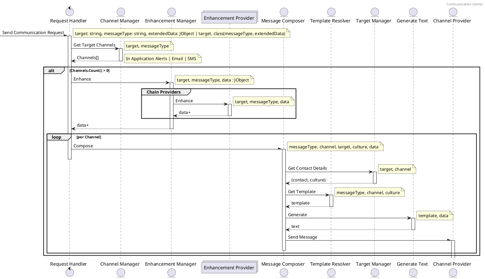

# Communication Center

The Communication Center will be the central hub for all In Application Alerts, SMS, Email and any other 
notification channels added in the future. 

## Configuration

| Key                                                         | Default      | Note                                                                        |
| ----------------------------------------------------------- | ------------ | --------------------------------------------------------------------------- |
| OoBDev:Communications:EmailMessageComposer:EnableTracing | false        | Enable/disable tracing for emails.  Primarily for development & debugging   |
| OoBDev:Communications:Deferral:MaxCount                  | 100          | Max page size for processing deferred messages                              |

### Mail Kit

| Key                                     | Default      | Note                                                                                            |
| --------------------------------------- | ------------ | -----------------------------------                                                             |
| MailKit:SmtpClient:Host                 |              | DNS Host for SMTP Server                                                                        |
| MailKit:SmtpClient:Port                 | 25           | TCP IP Port number SMTP Server                                                                  |
| MailKit:SmtpClient:SecureSocketOption   | Auto         | None, Auto, SslOnConnect, StartTls, StartTlsWhenAvailable                                       |
| MailKit:SmtpClient:Uri                  |              | This may be used in place of Host, Port and Secure Port Option                                  |
| MailKit:SmtpClient:Username             |              | Username to use with SMTP Server                                                                |
| MailKit:SmtpClient:Password             |              | Password to use with SMTP server                                                                |
| MailKit:SmtpClient:Default:From:Email   |              | Default From address if not provided in request                                                 |
| MailKit:SmtpClient:Default:Subject      |              | Default Subject if not provided in request                                                      |
| MailKit:SmsClient:Default:From:Number   |              | Default From number if not provided in request                                                  |
| OoBDev:ConfiguredServices:OoBDev.Communications.Abstractions.Channels.ISendEmailProvider |  | Set to "OoBDev.MailKit.Communications.SendMailKitEmailHandler" to enable this provider
| OoBDev:ConfiguredServices:OoBDev.Communications.Abstractions.Channels.ISendSmsProvider   |  | Set to "OoBDev.MailKit.Communications.SendMailKitSmsHandler" to enable this provider

### SendGrid 

| Key                                     | Default      | Note                                |
| --------------------------------------- | ------------ | ----------------------------------- |
| Twilio:SendGrid:ApiKey                  |              | API Key for Send Grid               |
| Twilio:SendGrid:Default:From:Email      |              | Default From address if not provided in request |
| Twilio:SendGrid:Default:Subject         |              | Default Subject if not provided in request |
| OoBDev:ConfiguredServices:OoBDev.Communications.Abstractions.Channels.ISendEmailProvider |  | Set to "OoBDev.Twilio.SendGrid.Communications.SendGridEmailHandler" to enable this provider

### Twilio 

| Key                                     | Default      | Note                                |
| --------------------------------------- | ------------ | ----------------------------------- |
| Twilio:SmsMessaging:AccountSid          |              | Account SID                         |
| Twilio:SmsMessaging:AuthToken           |              | Twilio Auth token                   |
| Twilio:SmsMessaging:Default:From        |              | Default from number if not provided in request |
| OoBDev:ConfiguredServices:OoBDev.Communications.Abstractions.Channels.ISendSmsProvider |  | Set to "OoBDev.Twilio.SmsMessaging.Communications.SendTwilioSmsHandler" to enable this provider


## Table of Contents

 * [General Usage](#general-usage)
   * [Data Enhancement](#data-enhancement)
   * [Message Composers](#message-composers)
   * [Template Naming and Resolution](#template-naming-and-resolution)
   * [Text Generation Engine](#text-generation-engine)
 * [Technical Documentation](#technical-documentation)
   * [Send Message Request Flow](#send-message-request-flow)

## General Usage

To use Communication Center add a reference to *OoBDev.Communication.Contracts* and import the 
*ICommunicationProvider* interface into your class.  The simplest approach is to declare a .Net class 
for your message type and extended data.  

   * By default the class name will be used to generate the message type and any properties on this 
        class will be used as the extended data.

   * If you choose to use the .net object approach but still need more control over the message type 
        add the [CommunicationAttribute] to your class and set the MessageType property 

   * These messages should be kept as small as possible so only key information should be included 
        in the extended data.  Additional information may be added later with the Data Enhancement 
        feature.

### Default Deployed Queue

The queue for Communication Central is an `Azure Storage Queue` named `communications-central`

### Data Enhancement

The communication central platform support the ability to enhance data.  These enhancements may be 
applied globally or per message type.  The order of processing may also be controlled by setting
priority of the data enhancer.  You will also need to ensure your data enhancer if registered in the 
IOC container for the *ICommunicationCentralProvider*.

Data enhancement is a context pipeline where the lowest priority enhancers are executed and hand the 
payload to the next to the next and so on.  Each enhancer may add, remove or even reset the context
that will be sent to the template engine. 

Implement the IDataEnhancementProvider interface.  If you wish to ensure your provider is only used 
for a select message time or to change the processing order you may add the DataEnhancerAttribute. 
The attribute and the properties on this attribute are optional.  If the TargetedMessageType is set
your enhancer will only be executed when the inbound request matches the existing message type. You
may also choose to filter within your own class based on the passed in parameters.  

Any exceptions throw within this pipeline will terminate the entire pipeline including sending the 
request to the targeted person.

### Message Composers

As part of the initial implementation SMS, Email and In Applications Alerts were added as message 
composers.  A message composer may be used based on the target persons selected preferences to choose 
a delivery channel.  Each delivery channel should have a single composer.  That composer has the job
to map the incoming request (person id, message type and enhanced data) to whatever the particular 
channel requires.  Using the template resolver and text generation engine in the TextTemplating
library is a highly recommended approach.   

### Template Naming and Resolution

Text Templates are provided by ITemplateResolver.  The current shared implementation uses 
ApplicationDb.Core.TextTemplates table.  The default naming convention for templates is as follows...

```
Format: 
    {MessageType}-{DeliveryChannel}-{Section}

Examples:
    ReferralCreated-Email-From
    ReferralCreated-Email-Body
    ReferralCreated-Email-Subject
    ReferralCreated-InApp-Detail
    ReferralCreated-InApp-NotificationTypeId
    ReferralCreated-InApp-Summary
    ReferralCreated-Sms-From
    ReferralCreated-Sms-Body
    ReferralProviderAssigned-Email-Body
    ReferralProviderAssigned-Email-Subject
    ReferralProviderAssigned-InApp-Detail
    ReferralProviderAssigned-InApp-NotificationTypeId
    ReferralProviderAssigned-InApp-Summary
    ReferralProviderAssigned-Sms-Body    
```

#### Message Type

MessageType string value (or class name) passed to the .SendAsync() on the ICommunicationProvider

#### Delivery Channel

The *DeliveryChannel* property found on the ComposerAttribute on the related IMessageComposer based class

Current options are "Email", "Sms", and "InApp"

#### Section

Sections are defined based on the requirements of a delivery channel composer.

 * Email
   * Subject - Subject text for email to be sent
   * Body - Text body for email
   * HTML - HTML formatted body for email
 * Sms
   * Body - content for SMS message
 * InApp - In Application Alert/Notification
   * Summary - Short summary description
   * Detail - Detailed message 
   * NotificationTypeId - related NotificationTypeId from ApplicationDb.Core.NotificationTypes
     - This should be equal to the Primary Key for the related notification type 

### Text Generation Engine 

The text generation engine used by Communication Central is based on [HTML Agility Pack](https://github.com/zzzprojects/html-agility-pack), 
[JSON.Net](https://github.com/JamesNK/Newtonsoft.Json) and [JSON paths](https://www.newtonsoft.com/json/help/html/QueryJsonSelectTokenJsonPath.htm).

After the request data is enhanced and the templates are downloaded they are ran though a text generation 
engine. These template are generally formated as HTML with a few extended attribute and properties to 
allow for content creation. 

#### Markup Extensions

##### value-of
Path
Custom element that will use the JSON Path provided in its binding attribute to resolve 
and output the selected content

##### repeater

Custom element that will use the JSON path provided in its binding attribute to resolve 
and iterate over the selected content set


#### Example

##### Template

```HTML
To: <value-of binding="$.Parent.FirstName" /> <value-of binding="$.Parent.LastName" />
Regarding: <value-of binding="$.Student.FirstName" /> <value-of binding="$.Student.LastName" /> attendance issues

<value-of binding="$.Student.FirstName" /> missed <value-of binding="$.Class.Name" /> scheduled on <value-of binding="$.Class.Date" />
            
            <a alt="replace it" href="replace me!"><value-attr binding="$.Link.Url" item="href"  />Link Desc</a>
            <a alt="add it"><value-attr binding="$.Link.Url" item="href"  /><value-of binding="$.Link.Title" /></a>

<table>
    <thead>
        <tr>
            <th>Class</th>
            <th>Period</th>
        </tr>
    </thead>
    <tbody>
        <repeater binding="$.FullSchedule">
            <tr>
                <td><value-of binding="$.Name" /></td>
                <td><value-of binding="$.Period" /></td>
            </tr>
        </repeater>
    </tbody>
</table>
``` 

##### Data

```JSON
{
  "Parent": {
    "FirstName": "Chris",
    "LastName": "Watson"
  },
  "Student": {
    "FirstName": "Johnnie",
    "LastName": "Watson"
  },
  "Class": {
    "Name": "English 101",
    "Date": "5/12/2020"
  },
  "Link": {
    "Url": "http://learnmark.co",
    "Title": "LearnMark"
  },
  "FullSchedule": [
    {
      "Name": "Science 101",
      "Period": 1
    },
    {
      "Name": "Math 102",
      "Period": 2
    },
    {
      "Name": "English 101",
      "Period": 3
    }
  ]
}
```

##### Result
```HTML
To: Chris Watson
Regarding: Johnnie Watson attendance issues

Johnnie missed English 101 scheduled on 5/12/2020
            
            <a alt="replace it" href="http://learnmark.co">Link Desc</a>
            <a alt="add it" href="http://learnmark.co">LearnMark</a>

<table>
    <thead>
        <tr>
            <th>Class</th>
            <th>Period</th>
        </tr>
    </thead>
    <tbody>
        <div>
            <tr>
                <td>Science 101</td>
                <td>1</td>
            </tr>
        
            <tr>
                <td>Math 102</td>
                <td>2</td>
            </tr>
        
            <tr>
                <td>English 101</td>
                <td>3</td>
            </tr>
        </div>
    </tbody>
</table>
```

## Technical Documentation

### Send Message Request Flow



